# TCP通讯功能教程

## TCP通讯

### TCP通讯参数

与外部设备进行通讯时，可以选择TCP通讯，点击"设置-外部通讯-TCP通讯设置"，进入通讯参数设置界面。如图所示：

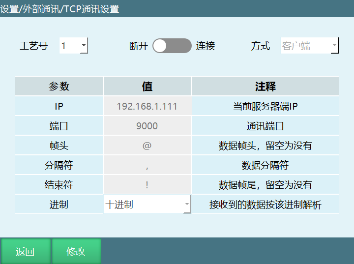

参数介绍：

1.  工艺号：支持9个工艺号。

2.  连接开关：客户端时灰色代表断开，绿色代表连接;服务器时灰色代表连接关闭，绿色代表连接打开。

3.  方式：控制器作服务器或客户端。（控制器为客户端或服务器时都可使用不同的工艺号与多台外部设备进行通讯和数据收发。

注：控制器为客户端多个工艺号与多台服务器设备连接时工艺号之间的IP和端口不能一致，控制器为服务器多个工艺号与多台客户端设备连接时端口不能一致。

4.  IP：连接方式为服务器时，此处为控制器IP无需修改；连接方式为客户端时，控制器作为客户端，此处IP为外部通讯设备的IP。

5.  端口：方式为服务器时为本机监听端口，供客户端连接；方式为客户端时为连接服务器端口。

6.  帧头：数据通讯时，控制器接收外部设备消息时的帧头，可修改。

7.  分隔符：数据通讯时，控制器接收外部设备消息时的分隔符，可修改。

8.  结束符：数据通讯时，控制器接收外部设备消息时的结束符，可修改。

9.  进制：将要接收的十进制或十六进制数据以10进制解析后输出。

说明：选择十六进制，执行解析指令后将数据以十进制解析到选择的变量，例如外部通讯设备发送的数据（@,123,100,120,!）将三个数据解析为十进制（291，256，288）输出。

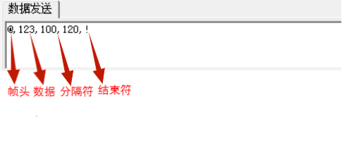

注：TCP通讯进行连接时，首先将控制器IP与外部设备IP设置为同一网段，如192.168.1.xxx，若设置控制器为客户端，则外部设备为服务端，再将网络设置中的IP和端口与外部设备网络调试软件中的IP和端口设置一致，连接开关打开，提示连接成功。

## 网络通讯类指令

### SENDMSG-发送数据

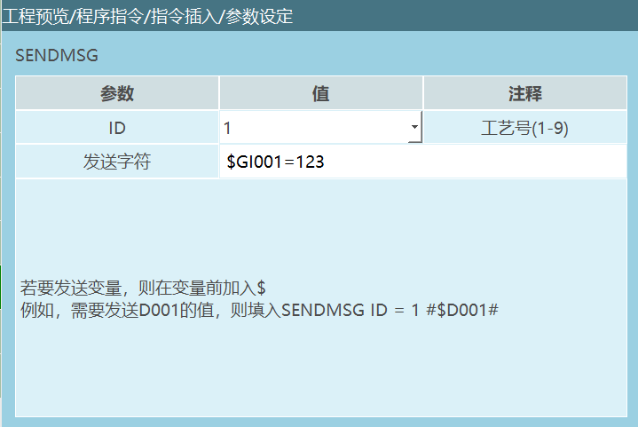

格式：SENDMSG【指令名】ID=1【工艺号】#DATA#【发送的数据】。

功能：该指令用于向已连接的外部设备发送数据，通过选择对应的工艺号可以发送字符串和变量。字符串与变量可以混合发送。通过此条指令向外部设备发送信息时需要使用在"设置-TCP通讯设置"界面设置的帧头、分隔符、结束符。

注意：如果要发送变量，则在变量前加入\$。

参数：

| ID       | TCP通讯时连接的工艺号  |
| :--- | :--- |
| 发送字符 | 给连接的网络设备发送数据。可以发送字符串格式数据、发送变量值。   若要发送变量需要在目标变量前面加\$符号，例如：SENDMSG ID = 1      #\$D001#，如果选择的目标变量D001本身就有值，在执行发送字符数据指令时网络端收到的是变量值，如果目标变量D001本身没有值，在执行发送字符数据指令时网络端收到的数值是0 |

示例：

1.  NOP

2.  OPENMSG ID= 1

3.  SET D001 = 12.23

4.  SENDMSG ID = 1 #\$D001#

5.  CLOSEMSG ID = 1

6.  END

示例说明：TCP通讯成功后，发送数据D001的变量值给外部通讯设备。

### PARSEMSG-解析数据

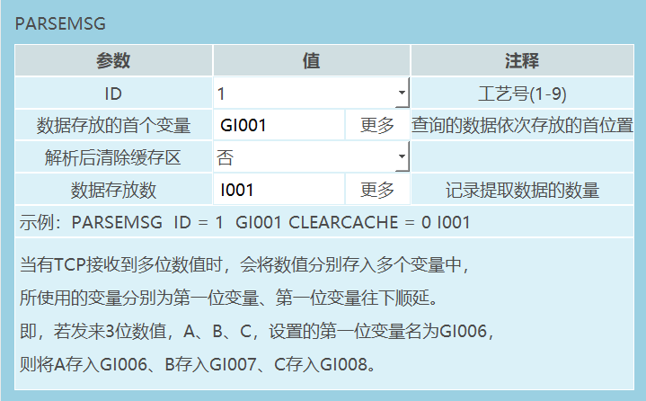

格式：PARSEMSG【指令名】ID=1【工艺号】I001【数据存放的首变量】CLEARCACHE=0【是否清除缓存，"0"不清除，"1"清除】0【提取数据的数量"0"不记录，"1"记录】。

功能：该指令用来解析外部设备传来的一组数据，并将数据存入多个变量。

参数：

| ID                 | TCP通讯时连接的工艺号  |
| :--- | :--- |
| 数据存放的首个变量 | 将查询到的数据存放在变量，存放的变量类型：整型、浮点型、字符串型      例如：TCP接收到多位数值A、B、C，设置的第一位变量名为GI001，则将A存入GI001，B存入GI002，C存入GI003。      |
| 解析后清除缓存区   | 否：解析后不会清除缓存，在外部设备没有发送新的数据时解析所得到的数据一直为缓存中的值，外部设备重新发送数据后能解析到新的数据    是：解析后会清除缓存，在外部设备没有发送新的数据时解析得不到数据，外部设备重新发送数据后能解析到新的数据      例如：外部设备发送数据：@,12,23,34,！存入的首变量位GI001,则GI001=12,GI002=23,GI003=34   解析后清除缓存区：       否：例如通过赋值指令GI001赋值为10，然后运行解析数据，在外部设备没有发送新数据时，仍会解析缓存中的数据12并赋值给GI001，最后显示GI001=12     是：例如通过赋值指令GI001赋值为10，在外部设备没有发送新数据时，缓存没有数据无法解析并给GI001赋值，最后显示GI001=10                     |
| 数据存放数         | 记录发送数据的数量     变量：发送的数据数量存入到选择的变量，例如：TCP接收到3位数值，数据存放变量GI001,执行解析指令GI001=3      不使用：不记录发送的数据个数，选择不使用时，输入框置灰。    |

示例：

1.  NOP

2.  OPENMSG ID= 1

3.  PARSEMSG ID = 1 I001 CLEARCACHE = 0 GI001

4.  CLOSEMSG ID = 1

5.  END

示例说明：网络通讯成功后，运行解析指令，外部设备发送的数据存入首变量I001，按照发送个数依次顺延，数据个数存入变量GI001。

### READCOMM-读取数据

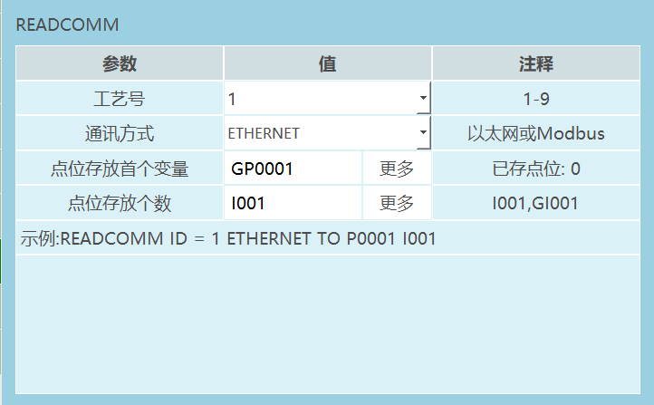

格式：READCOMM【指令名】ID=1【工艺号】ETHERENT、MODBUS【通讯方式】P/GP【点位存放变量】I001【点位存放个数】。

功能：读取通过以太网或Modbus通讯发送点位，并将点位存入到变量。

参数：

  ----------------------------------- -------------------------------------------
                工艺号                           TCP通讯时连接的工艺号

               通讯方式                         以太网通讯、Modbus通讯

           点位存放首个变量            将发送的点位存入到选则的位置变量（P、GP）

              点位存放数                 用变量（INT/GINT）记录发送的点位个数
  ----------------------------------- -------------------------------------------

注意事项：在选择不同的通讯方式发送点位时需要注意格式，否则点位数据无法写入到变量。

Ethernet通讯：在发送点位时可以参考《inexbot读取指令Ethernet点位通讯协议》

Modbus通讯：点位的设置可以外部传输点-通讯方式。

示例：

1.  NOP

2.  OPENMSG ID= 1

3.  READCOMM ID = 1 ETHERENT TO GP001 IOO1

4.  CLOSEMSG ID = 1

5.  END

示例说明：根据《inexbot读取指令ETHERENT点位通讯协议》发送点位，网络通讯成功后，读取点位指令，会将发送的点位数据保存到变量GP0001,点位个数存到变量I001。

### OPENMSG-打开数据

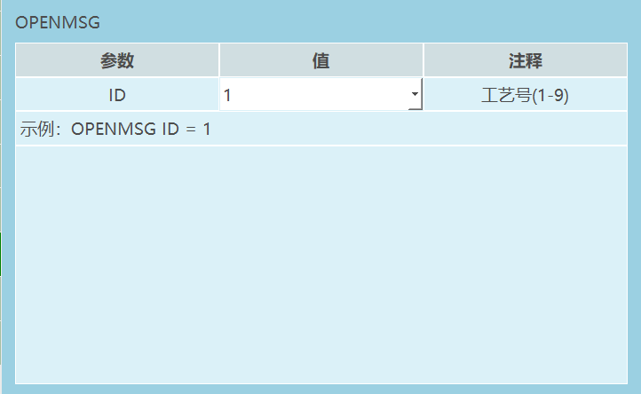

格式：OPENMSG【指令名】ID = 1【工艺号序号】。

功能：打开网络通讯。

参数:

  ------------------------------------------------
       ID：TCP通讯时连接的工艺号，范围\[1,9\]

  ------------------------------------------------

示例：

1.  NOP

2.  OPENMSG ID= 1

3.  SENDMSG ID = 1 #TEST#

4.  CLOSEMSG ID = 1

5.  END

示例说明：执行打开数据指令，控制器与外部设备通讯成功后就可以收发数据。

### CLOSEMSG-关闭数据

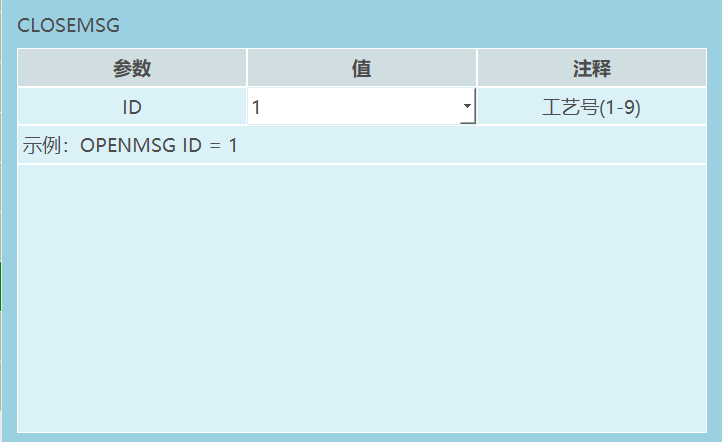

格式：CLOSEMSG【指令名】ID = 1【工艺号序号】。

功能：关闭网络通讯。

参数:

  ------------------------------------------------
       ID：TCP通讯关闭时的工艺号，范围\[1,9\]

  ------------------------------------------------

示例：

1.  NOP

2.  OPENMSG ID= 1

3.  SENDMSG ID = 1 #TEST#

4.  CLOSEMSG ID = 1

5.  END

示例说明：执行关闭数据指令，控制器与外部设备通讯断开。

### PRINTMSG-输出信息

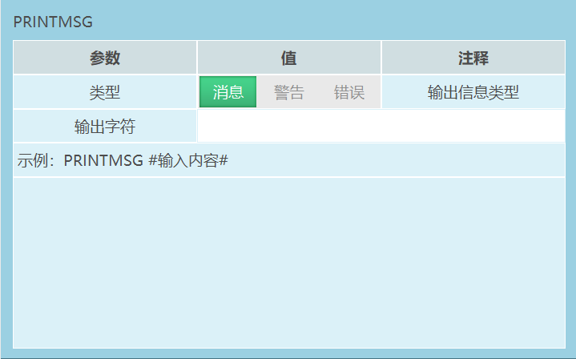

格式：PRINTMSG【指令名】0，1，2【类型消息，警告，报错】#输入内容#【输出的字符】。

功能：通过打印提示条的方式输出定义的信息内容。

参数:

| 类型     | 消息：执行指令时示教器界面打印白条提示    |
| :--- | :--- |
| 警告 | 执行指令时示教器界面打印黄条的警告提示    |
| 错误 | 执行指令时示教器界面打印红条的错误提示，且伺服下电  |
| 输出字符 | 打印提示条时示教器界面显示的内容，若要打印变量，则在变量前加入\$，例如\$GD001,输入变量在执行指令时，提示条打印的是变量的值 |

示例：

1.  NOP

2.  PRINTMSG 0 #这是一个消息#

3.  PRINTMSG 1 #这是一个警告#

4.  PRINTMSG 2 #这是一个报错#

5.  END

示例说明：执行指令，示教器界面分别打印白色消息提示，黄色警告提示，红色报错提示。

### MSG_CONNECTION_ST-获取信息连接状态

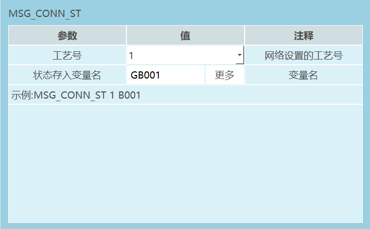

格式：MSG_CONNECTION_STATUS【指令名】1【工艺号序号】GB001【当前连接状态"0"未连接，"1"已连接】。

功能：获取网络设置里某个工艺号的连接状态。

参数：

  ---------------- -------------------------------------------------------
       工艺号                   TCP通讯设置界面选择的工艺号，

   状态存入变量名      当前连接的工艺号的状态用变量（BOOL,GBOOL）表示
  ---------------- -------------------------------------------------------

示例：

1.  NOP

2.  OPENMSG ID= 1

3.  MSG_CONNECTION_ST I GB001

4.  CLOSEMSG ID = 1

5.  END

示例说明：执行打开数据指令，控制器与外部设备通讯成功的话GB001=1,如果通讯失败的话GB001=0。

## 示例说明

外部通讯设备：网络调试助手。如图：

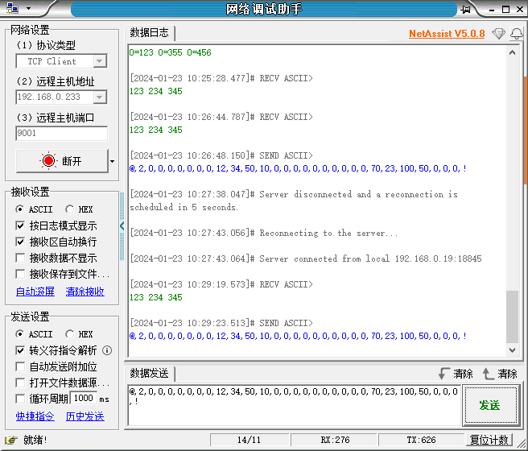

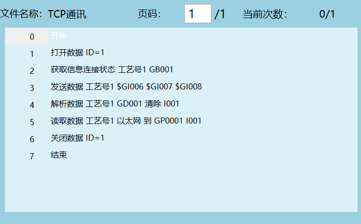

1.  执行第1条指令连接控制器与外部通讯设备。

2.  执行第2条指令如果控制器与外部设备通讯成功的话变量GI001=1,如果通讯失败的话变量GI001=0。

3.  执行第3条指令发送数据给外部设备，将变量GI006,GI007,GI008的值发送给外部设备,如下图所示：

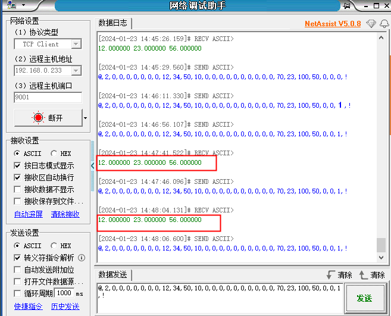

4.  执行第4条指令外部设备发送数据后解析数据，根据选择的首变量将解析的数据顺延存入变量。

5.  执行第5条指令将外部设备发送的点位数据存入位置变量，根据选择的首变量顺延存入，如下图所示：

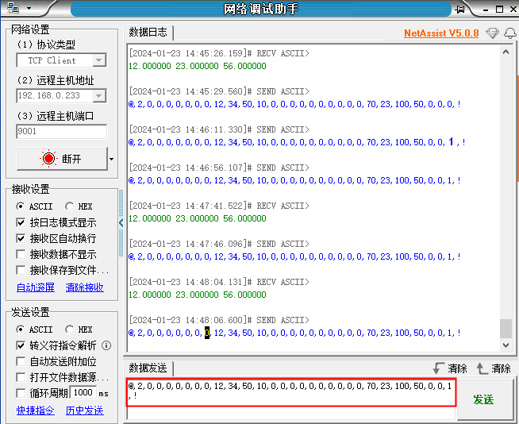

6.  执行第6条指令关闭控制器与外部通讯设备的连接。

注意事项：

外部设备发送点位时必须遵循《inexbot读取指令Ethernet点位通讯协议》，如表格所示。

发送数据时帧头，分隔符，结束符需要和TCP通讯设置界面保持一致。

  --------------- -------------------- --------------------------------
       序号               意义                       数值

         1              点位个数       

         2               坐标系         0-关节；1-直角；2-工具；3-用户

         3              角度单位                0-角度；1-弧度

         4               左右手            0-无；1-左手系；2-右手系

         5              工具手号                 0-无；1-999

         6             用户坐标号                0-无；1-999

         7                预留         

         8                预留         

         9               坐标1         

        10               坐标2         

        11               坐标3         

        12               坐标4         

        13               坐标5         

        14               坐标6         

        15               坐标7         
  --------------- -------------------- --------------------------------

##  外部传输点

###  参数设置

外部通讯可使用Modbus，设置参数进入"设置-外部通讯-Modbus设置-Modbus参数"界面（也可查看Modbus相关手册）。

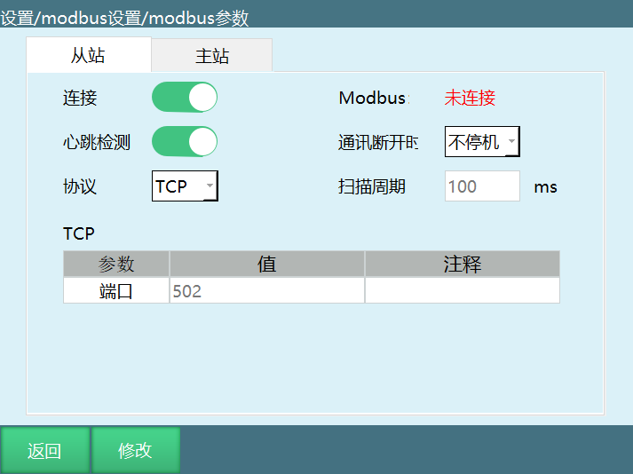

连接：Modbus的开关，打开后检测Modbus信号。

心跳检测：打开后用于检测Modbus与控制器之间的收发频率，断开Modbus连接后心跳检测显示数据收发关闭。

Modbus：显示Modbus与控制器之间的连接状态。

通讯断开时：不停机：当Modbus从站断开、通讯断开时不会停止运行或下电。

停机：当Modbus从站断开、通讯断开时会停止运行或下电。

扫描周期：指系统扫描modbus中范围内的数据的频率。

在这个界面可以设置modbus是否进行连接、modbus连接所使用的协议、本控制器为modbus主站/从站以及当连接时的各个参数。

###  通讯方式

因地址码限制，对于过多的点位需要进行分次发送，每次最多发送30个点。

只要控制器与PLC连接上便可发送点位，控制器会自动存储。

  ------------------------ ---------- -----------------------------------------------------------------------------------
            用途             地址码                                          过程

      全部点位发送标志        1001            PLC需发送点位时将其置1，发送结束后将其置2，控制器接收完毕将其置0。
     发送一次的发送标志       1002     PLC需发送点位时将其置1，控制器接收完将其置0，PLC再次将其置1来进行下一次的发送过程
     发送一次的点位数量       1003                             PLC一次发送时的点位数量，最多30个
       点位存放的数据       根据个数                                       下面详解
      每帧数据的帧编号        1004                        每一次发点都要更改编号数字，不可与上次相同
   清空控制器点位队列标志     1005           若要抛弃已发送给控制器的点位队列，PLC将其置1，控制器清除之后将其置0。
  ------------------------ ---------- -----------------------------------------------------------------------------------

点位存放的数据：

一个点位数据包含1个坐标系和6个轴的值（若为四轴机器人，则包含1个坐标系和四个轴的值）。

  ------------- ------------------------------- -----------------------------------------------------
    第i个点位               地址码                                      注释

     坐标系            1010+20\*（i-1）                                1≤i≤32

    是否使用           1011+20\*（i-1）                      1≤i≤32；发0使用，发1不使用

   第j个轴的值   1010+2+20\*（i-1）+2\*（j-1）   1≤i≤32，1≤j≤9，轴的值使用float类型，所以占用2个地址
  ------------- ------------------------------- -----------------------------------------------------

示例：

需要发送88个点位。由于每次只能发32个，所以需要分为3次发送，发送的个数分别为32、32、24。

过程如下：

1.  PLC设置1003为32，设置点位存放数据所用各个地址码的值，设置1001为1，设置1002为1；

2.  控制器检测到1002为1,1001为1，则根据1003的值取出点位存放地址码的数据，然后设置1002为0；

3.  PLC检测到1002为0，设置1003为32，设置点位存放地址码的数据，然后设置1002为1；

4.  控制器检测到1002的值为1，1001为1，根据1003的值取出点位存放地址码的数据，然后设置1002为0；

5.  PLC检测到1002为0，设置1003为24，设置点位存放地址码的数据，设置1001为2，设置1002为1；

6.  控制器判断到1002为1,1001为2，根据1003的值取出点位存放地址码的数据，然后设置1002的值为0，再将1001设置为0。

##  AI 检索专用问答对 (Q&A for Retrieval)

**Q: TCP通讯连接失败怎么办?**

A: 检查网络连接是否正常，确保IP地址和端口设置正确；确认TCP通讯参数中的连接使能开关是否打开；验证防火墙是否阻挡了TCP连接；确保控制器和外部设备在同一网络内；检查网络调试软件的配置是否正确。

**Q: 如何区分TCP服务器和客户端?**

A: 服务器：被动等待连接的一方，控制器作为服务器时，外部设备可以主动连接；客户端：主动发起连接的一方，控制器作为客户端时，需要连接到外部服务器；根据实际应用场景选择控制器作为服务器或客户端。

**Q: TCP通讯支持哪些数据类型?**

A: TCP通讯支持多种数据类型，包括字符串、整型、浮点型等；可以通过SENDMSG指令发送字符串和变量；可以通过PARSEMSG指令解析接收到的数据并存储到不同类型的变量中。

**Q: 如何修改TCP通讯的端口号?**

A: 在TCP通讯参数设置中修改端口号；服务器模式下，端口为本机监听端口；客户端模式下，端口为连接服务器端口；修改后需要重新连接才能生效；确保防火墙允许该端口的访问。

**Q: TCP通讯与Modbus通讯有什么区别?**

A: TCP通讯是一种通用的网络通讯协议，支持自定义数据格式，灵活性高；Modbus通讯是一种标准的工业通讯协议，有固定的数据格式和地址码；TCP通讯需要设置帧头、分隔符、结束符等参数；Modbus通讯使用标准的地址码进行数据读写。

**Q: 如何验证TCP通讯连接是否成功?**

A: 在TCP通讯参数设置界面查看连接状态，连接成功后连接开关显示为绿色；使用MSG_CONNECTION_ST指令获取连接状态；尝试发送和接收数据，验证数据传输是否正常；查看控制器日志，确认是否有连接失败的记录。

**Q: TCP通讯会影响机器人正常运行吗?**

A: TCP通讯设计为低优先级任务，不会影响机器人的正常运行；数据收发的过程是快速的，不会占用太多控制器资源；建议合理设置数据收发的频率，避免过于频繁的操作；如果通讯量较大，可以考虑使用更高效的网络设备。

**Q: 如何发送变量数据?**

A: 使用SENDMSG指令发送数据时，在变量前加入\$符号；例如：SENDMSG ID=1 #\$D001#，会将变量D001的值发送给外部设备；字符串和变量可以混合发送；确保变量已经赋值，否则发送的值为0。

**Q: 如何解析接收到的数据?**

A: 使用PARSEMSG指令解析接收到的数据；设置数据存放的首变量，解析后的数据会顺延存入后续变量；可以选择是否清除缓存区，不清除缓存时会一直解析缓存中的数据；可以记录接收到的数据个数。

**Q: 如何排查TCP通讯问题?**

A: 检查网络连接和IP地址设置；验证防火墙是否允许TCP端口的访问；查看控制器日志，了解具体错误信息；检查TCP通讯参数设置是否正确；尝试使用网络调试助手进行测试；确保控制器和外部设备的通讯协议一致。

---

##  相关资源

- [Modbus功能使用手册](./Modbus功能使用手册.md)

- [OPC-UA参数](./OPC-UA参数.md)

- [系统功能调试手册](./系统功能调试手册.md)
