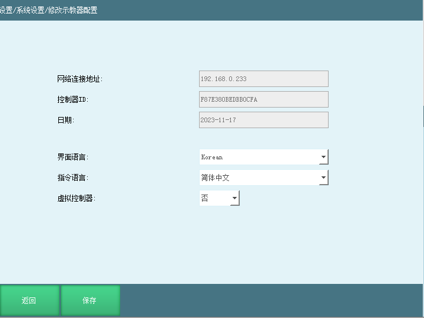
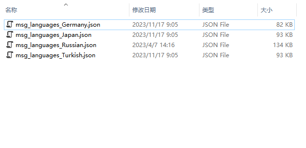
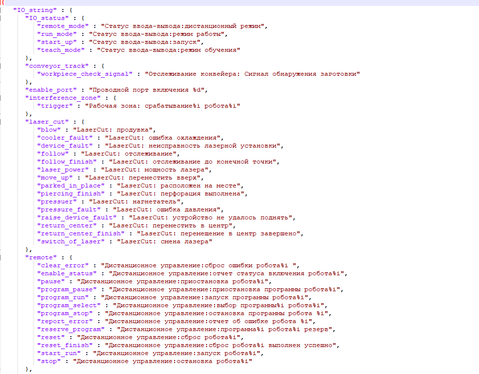
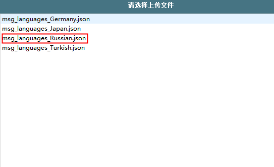
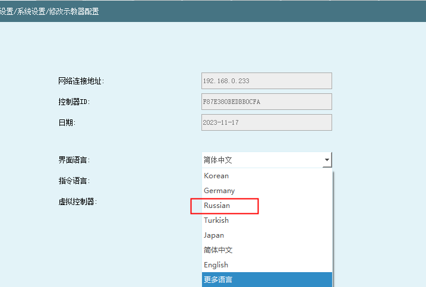
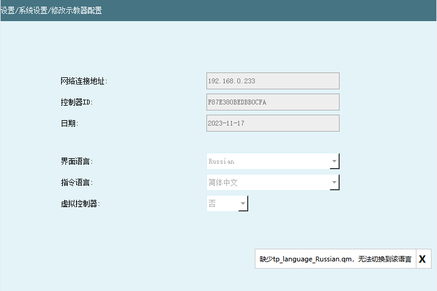
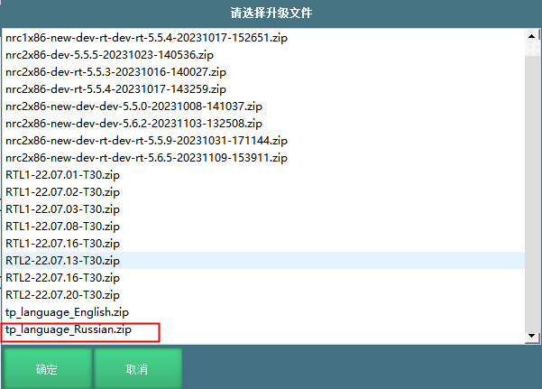
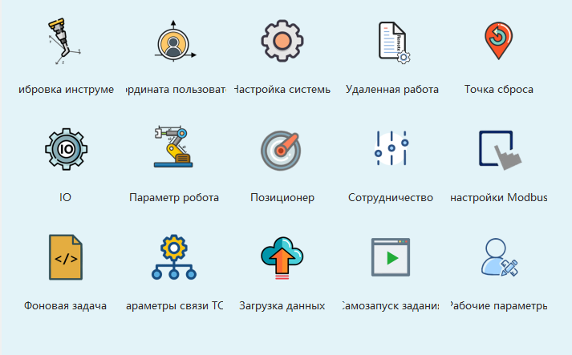

# dev多语言功能使用教程

dev多语言功能使用教程

在设置-系统设置-修改示教器配置界面可以修改界面语言，系统支持多语言功能

# 使用方法

1.  导出配置，将配置文件里面的msg_languages_Chinese.json/msg_languages_English.json文件复制。

U盘根路径下新建一个upgrade的文件夹，将msg_languages_Chinese.json/msg_languages_English.json文件保存，如果需要俄文将复制的msg_languages_Chinese.json/msg_languages_English.json文件重命名为）msg_languages_Russian.json

2.  翻译msg_languages_Russian.json文件需要客户自己翻译，翻译结束保存

3.  在设置-系统设置-版本上级界面点击【上传文件】

4.  文件上传成功后在设置-系统设置-修改示教器配置界面语言就可以选择俄文了

说明：如果没有升级对应的语言文件，会提示缺少对应的qm文件。

5.  在设置-系统设置-版本升级界面点击【升级文件】，选择语言包后点击【确定】

6.  文件升级成功后，在设置-系统设置-示教器配置界面再去选择界面语言为俄文，重启系统后，界面语言切换成功

翻译tp_en_US.ts文件，可查看\"界面语言翻译\"手册。

注意：恢复出厂设置后，上传的语言文件会被删除，需要重新上传msg_languages_Russian.json文件和tp_language_Russian.qm压缩包

## AI 检索专用问答对 (Q&A for Retrieval)

**Q: 切换语言时提示“缺少对应的qm文件”，该怎么解决？**

A: 出现该提示说明未完成完整语言包升级，需要先在设置-系统设置-版本升级界面，点击【升级文件】选中对应的语言包压缩包，完成文件升级后，再返回示教器配置界面选择语言，重启系统即可正常切换。

**Q: 恢复出厂设置后，之前上传的自定义语言不见了怎么办？**

A: 恢复出厂设置会清空手动上传的语言文件，需要重新按照教程步骤，重新上传对应的语言json文件和语言qm压缩包，完成文件上传与升级操作后，再次选择目标语言并重启系统即可恢复。

**Q: 在哪里切换示教器的界面语言？**

A: 在系统设置-系统设置-修改示教器配置界面，完成语言文件上传与升级后，即可在该界面选择对应的目标语言，重启系统后生效。