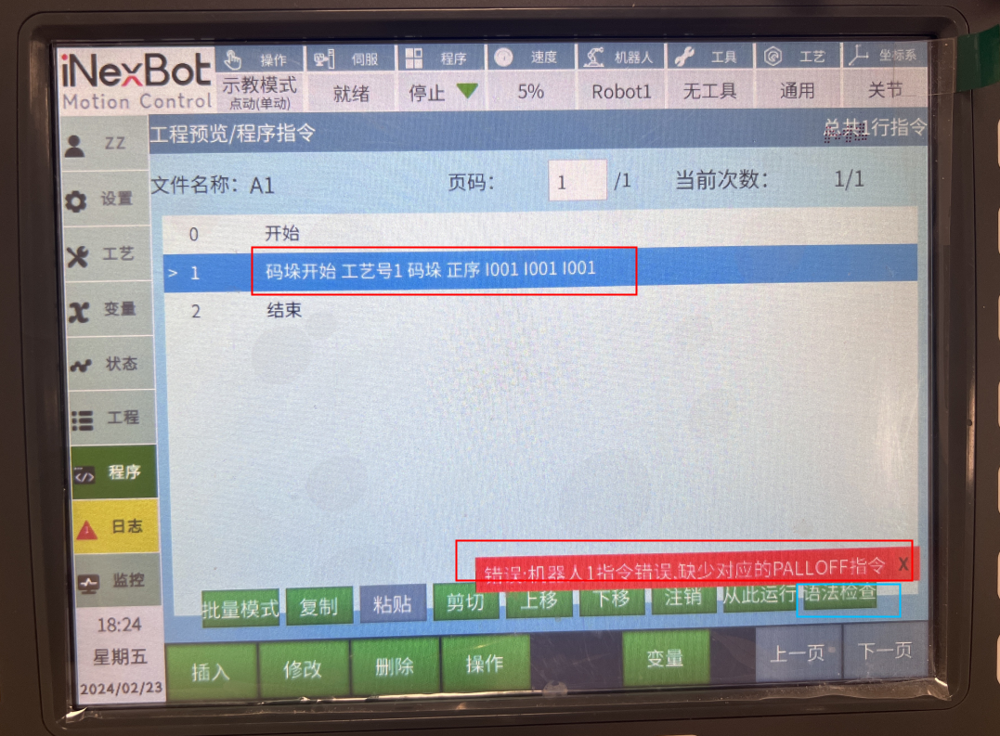

# 语法检测功能

## 功能介绍

功能：检测语法错误，检查到错误后会定位在错误的位置上

例如：点击语法检测，只插入码垛开始-会报缺少码垛结束指令

注：不检查运行类错误

提示信息都以报错信息提示

## 操作步骤

1. 在示教模式下，打开需要检测的作业文件
2. 点击【操作】按钮
3. 选择【语法检测】选项
4. 系统会自动检测作业文件中的语法错误
5. 如果发现错误，系统会定位到错误位置并显示错误信息
6. 根据错误信息修改代码，然后重新检测直到没有错误

## 测试小tip：如何判断是运行错误还是语法错误

在要测试的部分加一个延迟指令，切到运行模式，运行，直接报错的为语法错误，若运行了延迟指令，即是运行报错。

## 语法检测规则

### 检测顺序

- 主程序不调用线程时按顺序正常检测。
- 主程序调用后台程序时按顺序正常检测。即：主程序-遇到后台（进后台检测）-主程序。
- 主程序调用子程序时先检查主程序，主程序无错误后按顺序检查子程序。即：主程序-第一个调用的子程序-第二个调用的子程序-...
- 后台程序点击语法检查即正常检测后台对应程序。

### 常见语法错误类型

1. **指令不匹配**：如缺少码垛结束指令、循环结束指令等
2. **参数错误**：指令参数格式不正确或超出范围
3. **变量未定义**：使用了未声明的变量
4. **程序结构错误**：如子程序调用层次过深、循环嵌套错误等
5. **语法格式错误**：指令格式不符合规范

## 注意事项

1. 语法检测仅检查代码的语法正确性，不检查逻辑正确性
2. 语法检测不检查运行时错误，如传感器信号异常、运动轨迹碰撞等
3. 检测结果仅供参考，最终程序的正确性还需要通过实际运行验证
4. 对于复杂程序，建议分模块进行语法检测，以便更快定位错误

## 常见问题解答

### Q1: 语法检测失败但程序可以正常运行，这是为什么？

**A1:** 语法检测是基于静态分析，可能会误报一些实际上不会影响运行的问题。如果程序可以正常运行，可以忽略这些误报。

### Q2: 语法检测通过但程序运行时出错，这是为什么？

**A2:** 语法检测只检查代码的语法正确性，不检查运行时错误。运行时错误可能由外部因素引起，如传感器信号异常、运动轨迹碰撞等。

### Q3: 如何快速定位语法错误？

**A3:** 语法检测会自动定位到错误位置并显示错误信息。根据错误信息修改代码后，重新运行语法检测直到没有错误。

### Q4: 语法检测是否支持所有指令？

**A4:** 语法检测支持所有标准指令，但对于自定义指令可能支持有限。

### Q5: 语法检测的速度如何？

**A5:** 语法检测速度很快，对于一般规模的程序，检测过程通常在几秒钟内完成。
