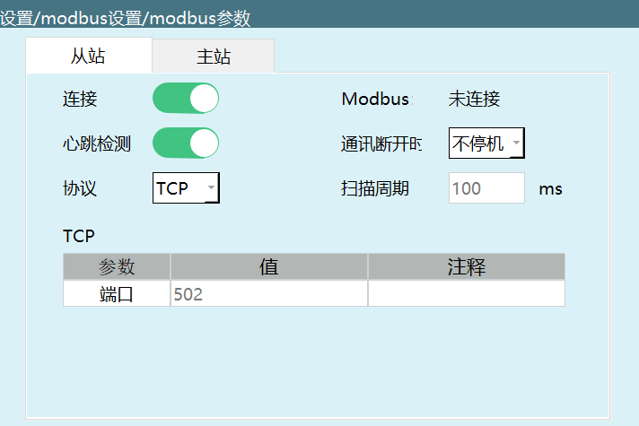

# Modbus多主站连接

## 功能介绍

Modbus多主站连接功能允许多个主站设备同时连接到控制器，实现对机器人的协同控制。控制器作为从站，支持最多9个主站设备同时连接，包括Modbus Poll软件、触摸屏等。

## 环境要求

- **硬件设备**：
  - 控制器（支持Modbus功能）
  - 电脑（安装Modbus Poll软件）
  - 触摸屏（支持Modbus协议）
  - 交换机（用于连接控制器、电脑和触摸屏）
  - 网线

- **软件要求**：
  - Modbus Poll软件（用于测试多主站连接）
  - 控制器固件（支持Modbus多主站功能）

## 设置位置

在示教器上进入：**设置 → Modbus设置 → Modbus参数**

## 连接步骤

1. **硬件连接**：
   - 将电脑、触摸屏通过交换机连接到控制器
   - 确保所有设备在同一网络网段

2. **控制器设置**：
   - 在Modbus参数界面，选择协议为TCP
   - 设置控制器作为从站
   - 打开连接使能开关
   - 记录控制器的IP地址和端口号

3. **Modbus Poll连接**：
   - 打开Modbus Poll软件
   - 点击Connection → Connect
   - 连接类型选择ModbusTCP/IP
   - 输入控制器的IP地址和端口号
   - 设置扫描周期与示教盒一致
   - 点击OK完成连接

4. **触摸屏连接**：
   - 在触摸屏上配置Modbus TCP连接
   - 输入控制器的IP地址和端口号
   - 保存配置并建立连接

## 多主站控制

- **最多支持9个主站**：可以同时连接多个Modbus Poll实例和触摸屏
- **并行控制**：不同主站可以同时向控制器发送指令
- **IP地址管理**：确保所有主站设备的IP地址不冲突
- **扫描周期**：所有主站的扫描周期应设置合理，避免网络拥塞

## 注意事项

1. **网络配置**：确保所有设备在同一网络网段，IP地址不冲突
2. **扫描周期**：设置合理的扫描周期，避免网络拥塞
3. **连接数量**：最多支持9个主站同时连接，超过可能导致连接失败
4. **优先级**：当多个主站同时发送指令时，控制器会按照接收顺序处理
5. **通讯稳定性**：确保网络连接稳定，避免断线情况

## 常见问题解答

### Q1: 为什么无法建立多主站连接？

**A1:** 检查以下几点：
- 确保控制器的Modbus连接使能开关已打开
- 验证所有设备在同一网络网段
- 检查IP地址是否冲突
- 确认端口号设置正确
- 检查网络连接是否稳定

### Q2: 多主站连接时响应缓慢怎么办？

**A2:** 可能的原因和解决方法：
- 减少同时连接的主站数量
- 增大扫描周期，减少通讯频率
- 检查网络带宽是否足够
- 确保控制器性能满足多主站需求

### Q3: 多主站连接时出现数据冲突怎么办？

**A3:** 建议：
- 合理分配不同主站的控制范围
- 避免多个主站同时修改相同的参数
- 在控制系统设计时考虑多主站协同逻辑

### Q4: 如何测试多主站连接是否正常？

**A4:** 可以通过以下方法测试：
- 在不同的Modbus Poll实例中写入不同的地址码
- 在触摸屏上操作机器人
- 观察控制器是否能正确响应所有主站的指令
- 检查通讯状态是否稳定
