# 不常使用的功能

## 绝对位置分辨率

绝对位置分辨率功能说明

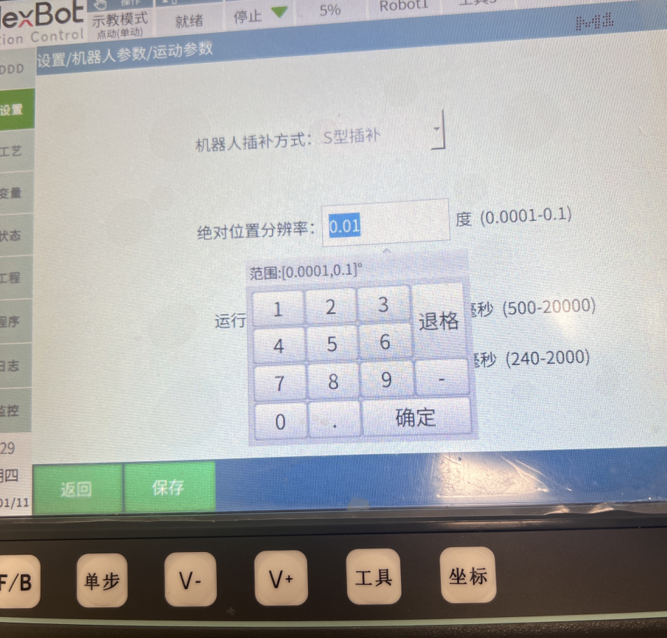

设置-机器人参数-运动参数-绝对位置分辨率。

功能：运行点位是2个点相差小于等于分辨率时，当成1个点执行。这是一个重要的性能指标，决定了定位系统的精确度和精度。

范围：[0.0001,0.1]。

## 点动灵敏度

点动灵敏度功能说明

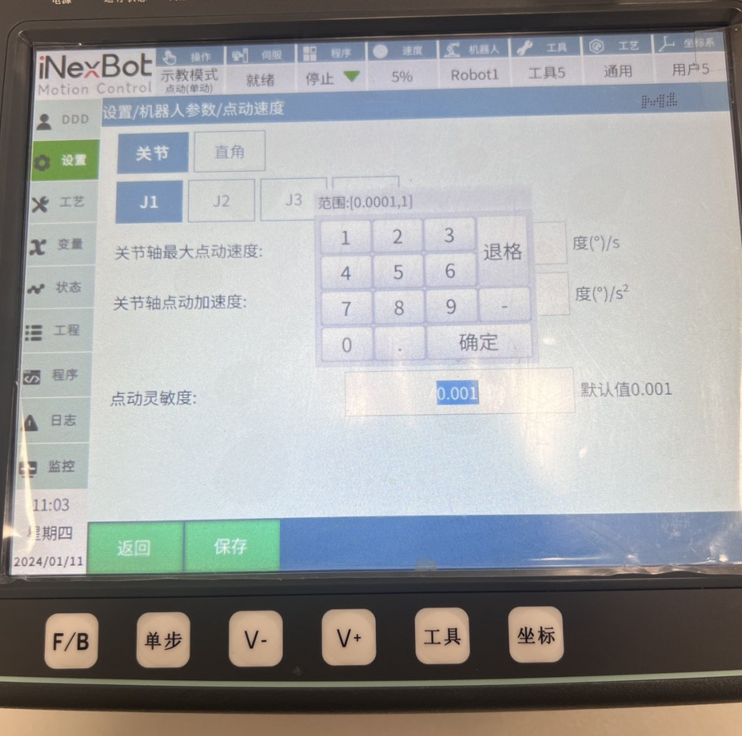

设置-机器人参数-点动参数-点动灵敏度。

点动灵敏度是一个重要的功能设置，决定了机器人在进行点动操作时的相应速度和精度。

功能：上电后，机器人抖动范围大于点动灵敏度时点动操作无效。  因为机器人的抖动可能超过了系统所能识别的最小变化量，导致系统无法正确判断机器人的实际位置和姿态。

范围：[0.0001,1]。

## 关节空间速度限制

关节空间速度限制

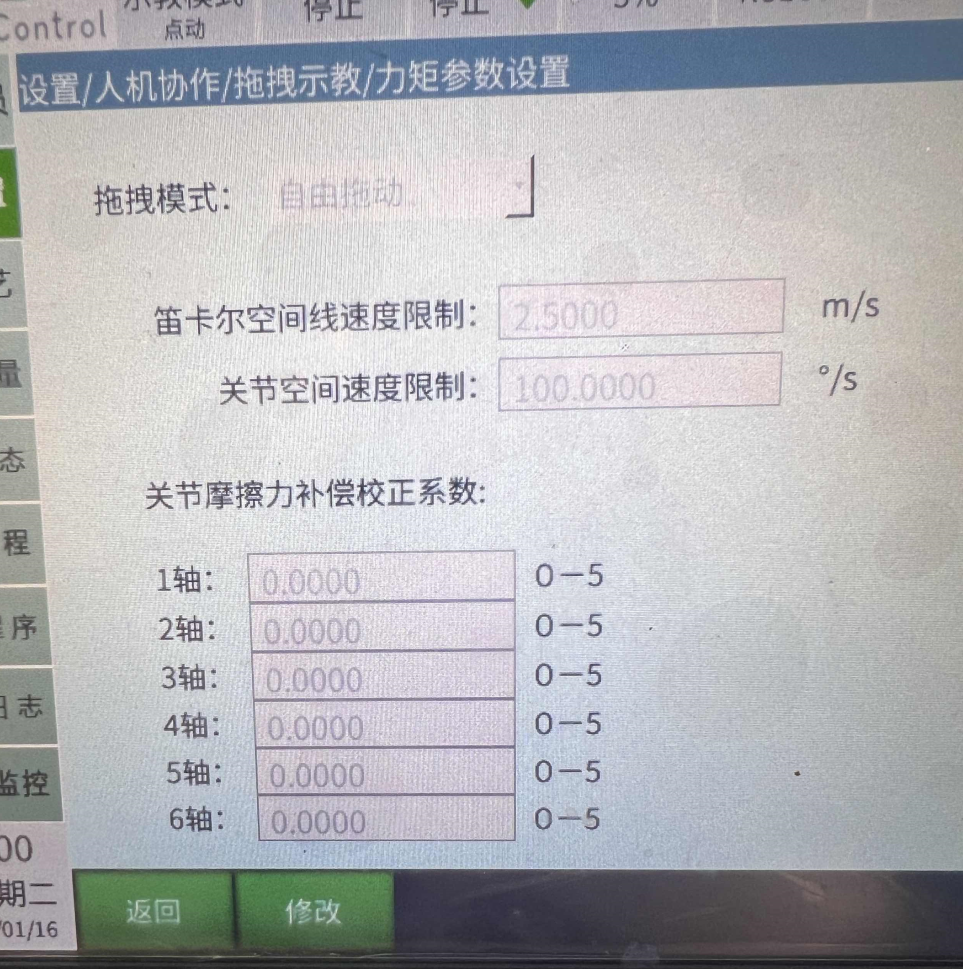

设置-人机协作-拖拽示教-力矩参数设置-关节空间速度限制。

关节空间速度限制是指机器人在关节运动过程中，关节速度的限制范围。可以更好地保护机器人以及周围环境。

功能：拖动时的最大速度，超过限制后会下电停止。

范围：[0,+$\infty$]。

## 关节摩擦力补偿校正参数

关节摩擦力补偿校正参数

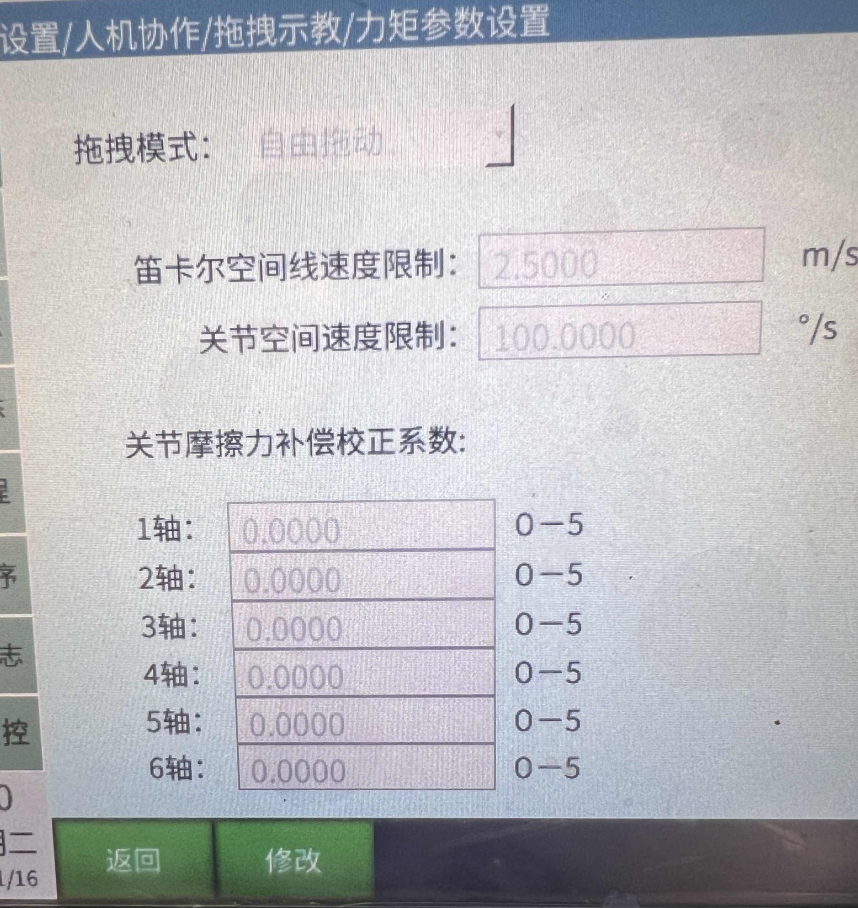

设置-人机协作-拖拽示教-力矩参数设置-关节摩擦力补偿校正参数。

关节摩擦力补偿校正系数是一个重要的参数，它能够对机器人的关节灵活性、运动性能、自适应控制、关节保护和系统集成性能等方面产生显著的影响。通过合理的设置和调整该参数，可以提高机器人的整体性能和工作效率。

功能：参数越靠近5关节越灵活。

范围：[0,5]。

## 运行延时时间

运行延时时间

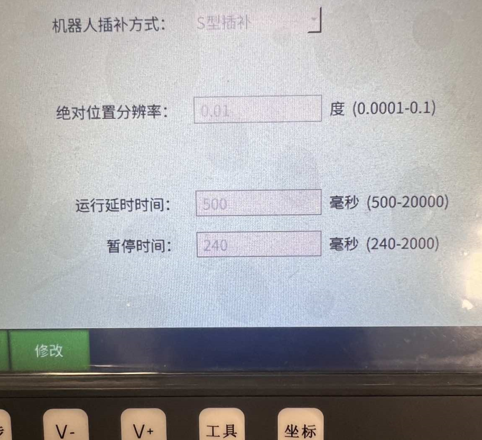

设置-机器人参数-运动参数-运行延时时间。

运行延迟时间是一个重要的性能指标，反应了程序或系统的执行效率。计算公式为：运行延迟时间=执行时间+等待时间。

功能：程序启动时的运行延时。

范围：[500,20000]毫秒。

## 暂停时间

暂停时间

设置-机器人参数-运动参数-暂停时间。

对于一些关键任务和实时系统，暂停时间的控制尤为重要，需要保证程序的响应速度和执行效率。

功能：运行程序过程中切模式停止、切模式暂停、远程停止、远程暂停时，从运行到停止所用的时间。

范围：[240,2000]。

## NP参数

NP参数

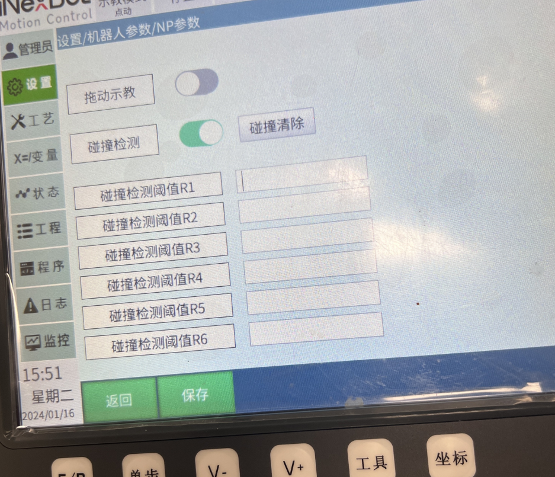

设置-操作设置-打开NP参数后，设置-机器人参数-NP设置

拖拽示教和碰撞检测是机器人的重要功能，这些使得机器人能够更高效、安全的地与人类交互。

功能：人机协作机器人的拖动示教、碰撞检测。

## 反向间隙

[主页](https://ones.inexbot.com/wiki/?/team/RnqpQ1Yp/page/PyaUeBy7)

1：设置/操作参数界面，打开【显示电机坐标位置及标定按钮】

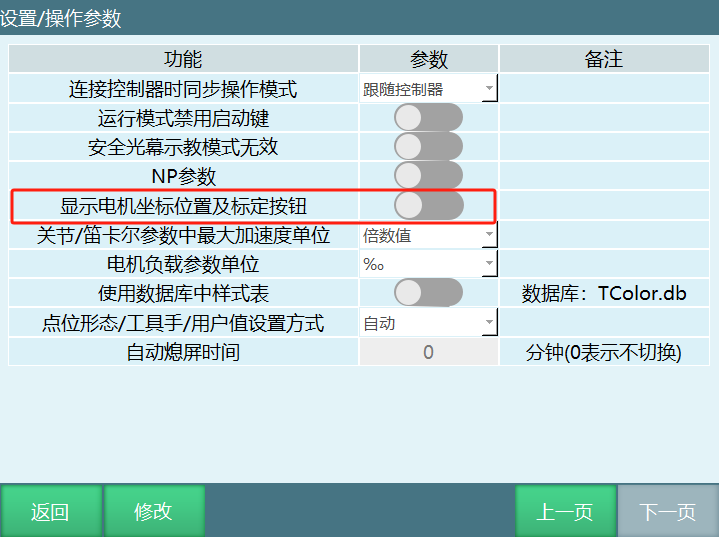

此时在监控/机器坐标界面可以看出多了一个电机位置坐标

在设置/机器人参数/零点位置界面多了一个【标记无间隙方向】按钮

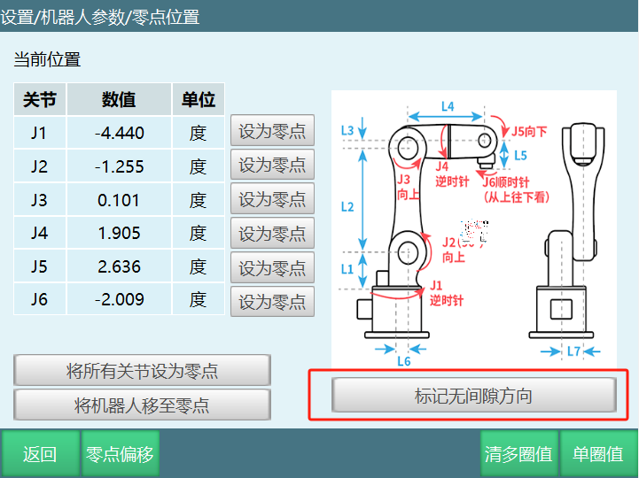

2：以机器人的一轴为例

在设置/机器人参数/关节参数/其他参数界面中【齿轮反向间隙】设置一个值(例如填：10)

齿轮反向间隙有值的时候会出现一个报错，因为没有还没有进行标定；

3：此时到零点位置界面标记无间隙方向

标定方法如下：

a：动1轴+，因为齿轮反向间隙的值为10，所以电机位置在动1轴的过程中要大于10：

b：当大于10之后点击【标记无间隙方向按钮】，会有标记成功的消息提示

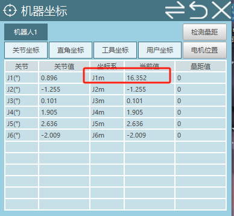

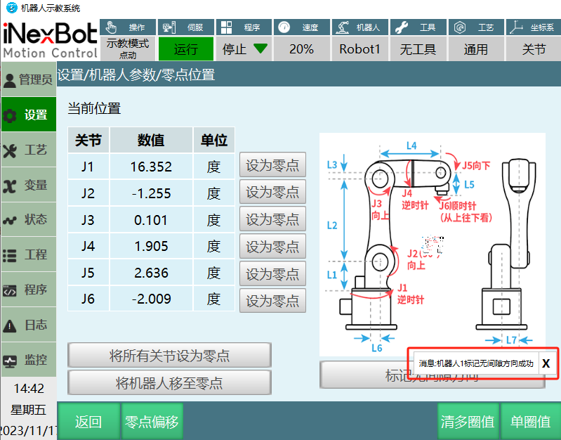

4：验证是否有效果

标记成功之后看监控机器人坐标和电机位置坐标的一轴坐标是否一样

上电点动机器人一轴，点动一轴正方向时机器人坐标和电机位置坐标一致

反方向点动一轴时，机器人坐标和电机位置坐标相差10，也就是齿轮反向间隙的值

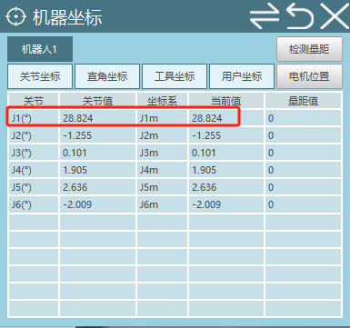

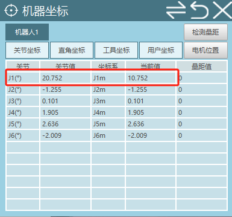

## AI 检索专用问答对 (Q&A for Retrieval)

**Q: 机器人上电速度慢，运行程序会报警**

A: 修改设置-机器人参数-运动参数-运行延时时间，让程序启动时的运行延时。
