## 1 文档概述

## 1.1 文档目的

本文档旨在提供人机协作功能的详细使用指南，帮助用户正确配置和使用动力学参数、碰撞检测、力矩前馈和拖拽示教等功能。

## 1.2 适用范围

本手册适用于纳博特机器人控制器的人机协作功能配置，包括机器人辨识、力学功能设置和拖拽示教操作。

## 1.3 术语定义

| 术语 | 定义 |
| :--- | :--- |
| 人机协作（HRC） | 人和自动化机器共享工作空间并同时进行作业的工作 |
| 动力学参数 | 描述机器人运动学和动力学特性的参数 |
| 碰撞检测 | 机器人检测碰撞并停止的功能 |
| 力矩前馈 | 基于动力学模型提前计算力矩的控制方法 |
| 拖拽示教 | 通过手动拖动机器人来示教位置的方法 |

---

## 2 人机协作概述

本章主要介绍动力学的作用以及如何使用。因为机器人的复杂非线性、时变不确定性、强耦合性(特别是在高速运动时)，要使机器人能以期望的速度和加速度运动，机器人各关节伺服电机必须有足够大的力和力矩来驱动机器人的连杆和关节。否则，连杆将因运动迟缓而影响机器人的定位和轨迹跟踪精度，为此必须建立基于动力学模型的前馈力矩控制。从而实时快速地计算前馈补偿力矩。

**人机协作（HRC）**指的是人和自动化机器共享工作空间并同时进行作业的工作。

---

## 3 机器人辨识

## 3.1 辨识前准备

1. 在使用力学功能之前首先需要设置好动力学参数，使控制器建立机器人的动力学模型。

2. 设置动力学参数需进入"设置/人机协作/动力学参数"，在进入辨识界面前，需要仔细阅读辨识的相关注意事项。机器人进行轨迹测试时，范围和速度应由小到大设置，逐渐确定一个不会碰到周围环境前提下的最大轨迹范围值。再把轨迹速度设置为100，就可以开始辨识。辨识过程中除必要情况不要操作示教器，人员需远离机器人。若需要停止辨识，可以通过点击示教盒上的停止、按下急停按钮或切换模式来停止机器人。

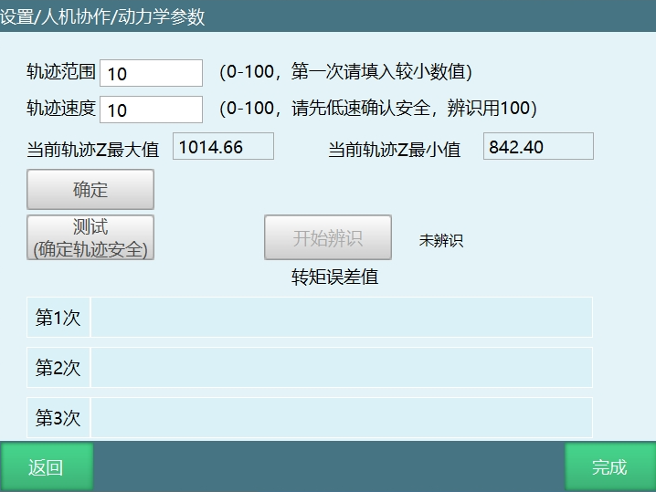

## 3.2 参数说明

| 参数 | 说明 |
| :--- | :--- |
| 轨迹范围 | 根据轨迹范围计算出机器人最大最小运动范围 |
| 轨迹速度 | 机器人在运行时的速度，与全局速度无关 |
| 当前轨迹Z最大值/当前轨迹Z最小值 | 表示了当前轨迹Z的范围 |
| 辨识误差 | 辨识后会出现六个参数分别代表六个轴的误差（值越小说明误差越小且不能为0） |

## 3.3 辨识注意事项

> **重要提示**
>
> 
>
> - 目前该辨识方法仅适用于六轴机器人空载情况下辨识机器人本体的动力学参数。
> - 该辨识方法辨识所得的动力学参数与手填的动力学参数无关。
> - 执行辨识前请确保机器人的运动范围内空旷，无障碍物。
> - 辨识轨迹参数中，轨迹范围用于调节机器人的辨识轨迹的范围大小，100为辨识轨迹的100%，90为辨识轨迹的90%，以此类推。轨迹速度用于调节机器人执行辨识轨迹时的速度大小。
> - 辨识轨迹参数选取原则：在确保安全的情况下使得运动范围尽可能大，运动速度尽可能快。
> - 辨识结果所得到的误差数值对应于碰撞检测功能中的灵敏度数值。
> - 辨识前应先进行轨迹测试。先试用低速小范围，若机器人可能与周围发生碰撞，则减小轨迹范围参数，若还有空余，则逐渐调大轨迹范围参数，直至确定一个不会发生碰撞前提下的最大轨迹范围值。此时把轨迹速度设置为100，点击辨识按钮开始执行辨识。
> - 测试轨迹安全时，机器人会运行两段轨迹，机器人测试结束前请勿靠近机器人，机器人可能随时会启动。
> - 辨识工作共执行三次，包括运行轨迹，获得数据，分析数据，计算动力学参数等过程，并在每一次完成后把误差数值显示在界面上，辨识期间请勿进行任何操作以免影响辨识工作。

## 3.4 辨识操作步骤

### 步骤1：进入辨识界面

点击【设置-人机协作-动力学参数】，进入动力学参数界面，仔细阅读提示说明，完整的看完提示说明后，点击"已阅读且同意"，点击"开始辨识"。

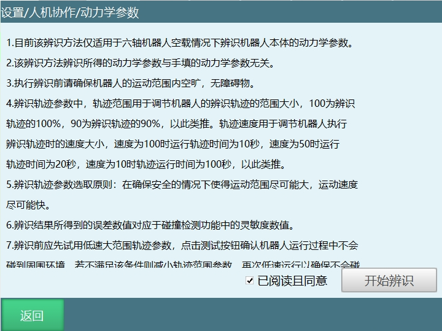

### 步骤2：设置辨识参数

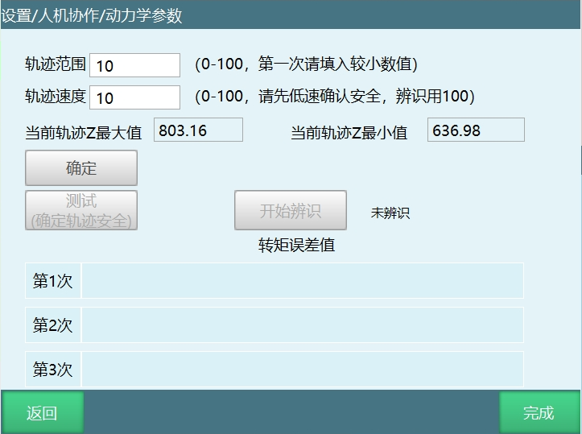

1. 进入辨识操作界面后，填写轨迹范围和轨迹速度。

2. 点击"确定"，查看当前轨迹Z最大值、当前轨迹Z最小值，查看范围是否合理，确认轨迹可到达方可操作下一步。

3. 点击"测试（确定轨迹安全）"，弹出测试提示窗，点击"确定"后如果报错（机器人位置不在零点）请先将机器人移至零点位置，然后再次点击"测试（确定轨迹安全）"。

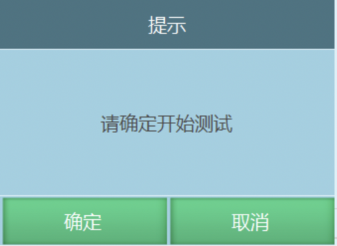

### 步骤3：轨迹测试

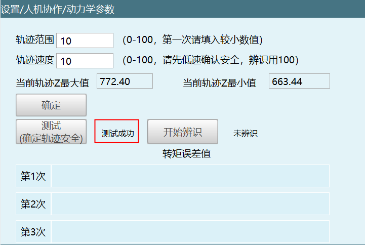

4. 轨迹测试完成后提示测试成功。

5. 若轨迹范围较小，可调大轨迹范围，原则上轨迹范围越大，辨识的准确性越高。

### 步骤4：开始辨识

轨迹测试完成后就可以开始辨识，在保证安全的基础上使其轨迹范围达到最大，轨迹速度调整为100后即可开始辨识，点击"开始辨识"，如下图所示：

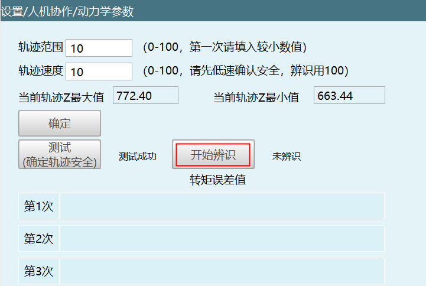

再次确认轨迹安全，人员远离机器人，点击确定，如图。

弹窗提示辨识中，在提示辨识结束之前请勿靠近机器人。机器人有可能随时运行下一段轨迹。

机器人三次辨识结束后会将计算后每个轴的转矩误差值填在表格。

---

## 4 力学功能

力学功能包括碰撞检测、力矩前馈，需要进入"设置/人机协作/力学功能"中进行设置。

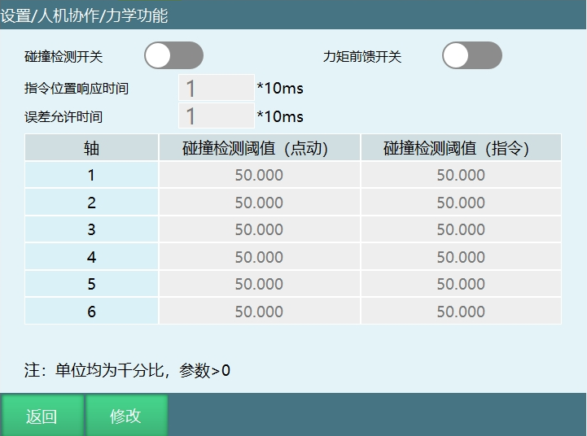

## 4.1 碰撞检测

| 参数 | 说明 |
| :--- | :--- |
| 碰撞检测开关 | 开启后机器人会根据灵敏度对碰撞进行检测，通常需要找到机器人运行时不会判定发生碰撞的值，然后就可以正常使用 |
| 碰撞检测阈值（点动） | 设置碰撞检测阈值参数后，机器人在示教模式下进行点动操作时将调用此处设置的值 |
| 碰撞检测阈值（指令） | 设置参数后，机器人在示教模式下回复位点、回零、单步、试运行以及切至运行模式后运行机器人将调用此处的值 |
| 指令位置响应时间 | 本体机器人在运行过程中已经碰触到了，但因为设置了这个时间，所以会因为设置的时间从而延时报错；时间到了，报错出现，机器人下电 |
| 误差允许时间 | PID调节导致力矩波动，误触发了碰撞警告，该功能就是防止这种现象出现，在设置的时间内力矩回到正常范围，警报就不会出现 |

## 4.2 力矩前馈

人机协作中力矩前馈开关，打开即表示打开了力矩前馈功能。

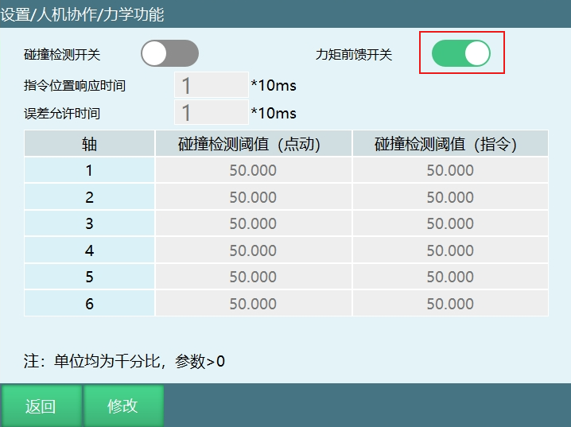

### 力矩前馈是什么？

机器人的控制器传递给电机的力矩是经过一定的运算的，这个运算就是机器人的动力学方程。公式基于牛顿定律而得的，机器人的动力学方程输入时机器人的姿态，由姿态计算出所需要的力矩，再由雅可比矩阵转换到对应的电机中。

机器人的控制是基于力的控制，通过对反馈力的积分，得到当前的姿态信息和姿态修正量，最后把期待的力矩和修正姿态对应的位置和速度传给电机驱动器，通过不断的迭代，从而机器人完成指定动作。

**简单来说**即在伺服运动前提前告诉伺服运动时应该以多大的力矩进行运动，方便伺服进行运动调节，从而降低运动时机器人抖动的情况。

---

## 5 拖拽示教

## 5.1 拖拽模式

### 外部触发信号

触发选中的IO端口进入拖拽模式，例如信号触发为0，选中的IO端口由高电平1-低电平0拖拽信号触发，进入拖拽模式，IO触发后按键不生效，如下图。

### 拖拽方式

- 力矩
- 3D鼠标

## 5.2 3D鼠标使用方法

**使用该功能，可以不用进行辨识就可以正常切换并使用**

### 5.2.1 3D鼠标配件说明

- TTL转RS232转接头
- 5V电源
- 3D鼠标本体
- 线缆收纳盒
- 3D鼠标固定板

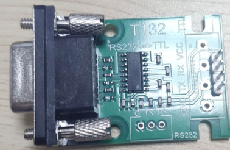

### 5.2.2 接线定义

#### 4针连接器 J1

3DX-Sensor Module Serial 有一个4针公头连接器，栅格为1.0毫米。

电缆连接器：JSTSHR-04V-S-B，带压接触点SSH-003T-P0.2。

模块上的连接器：JSTBM04B-SRSS-TB。

| 针脚# | 连接器 | 功能颜色 |
| :--- | :--- | :--- |
| 1 | VCC +3.3V至+5.0V | 红色 |
| 2 | TxD（输出） | 绿色 |
| 3 | RxD（输入） | 橙色 |
| 4 | GND | 黑色 |

#### 电缆

有关3DX-Sensor Module Serial的连接器的信息，请参阅"4针连接器J1"部分。

与控制台的连接可通过一个栅格为2.54毫米的4针母头连接器来实现。

| 针脚# | 连接器 | 功能颜色 |
| :--- | :--- | :--- |
| 1 | VCC +3.3V至+5.0V | 红色 |
| 2 | GND | 黑色 |
| 3 | TxD（输出） | 绿色 |
| 4 | RxD（输入） | 橙色 |

### 5.2.3 3D鼠标的安装部件

- 3D鼠标本体
- 3D鼠标置线盒
- 固定板

**安装说明**：

3D鼠标置线盒用于收纳部分；3D鼠标连接线缆，固定板用于将3D鼠标安装在机器人末端。将3D鼠标的组件按上图所示拼接完成后即可安装于机器人末端。同时，3D鼠标也可以不安装在机器人末端使用，但此时拖动起来的方向感不如装于机器人末端直观。

**供电设备**：外接 5V电源。

**接线设置**：鼠标转换线插入控制器的 Com1串口且Com1串口需要支持RS232通讯即可直接使用。

### 5.2.4 使用说明及注意事项

#### 3D鼠标端口号

相当于控制器上COM端口，填入多少就选择几号COM口。

控制器配置默认端口号为1，以桦汉控制器为例，232为COM2口，那么需要更改控制器对应节点后才能使用。

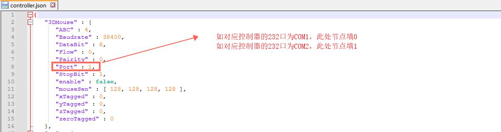

#### 3D鼠标参数设置

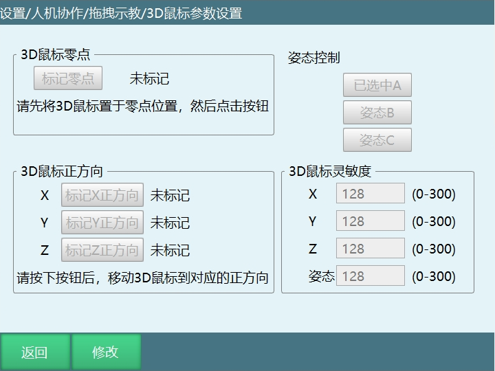

**注意**：若3D鼠标安装在机器人本体上，使用前一定要确认机器人运行安全方可进行使用。

**参数说明**：

1. **标记零点**：需切换到拖拽模式后标记3D鼠标零位置，未标记表示没有标记过零点，标记后即显示已标记。
   
   **用法**：点击修改，然后点击标记零点即可完成标记，不需要移动鼠标。

2. **3D鼠标正方向**：分为标记X、Y、Z正方向，未标记表示没有标记过方向，标记后即显示已标记。若按下后通讯失败则显示通讯失败，该情况下方向沿用上次标记的方向。
   
   **用法**：点击修改，然后点击标记方向按钮，然后按下鼠标对应方向，提示标记方向成功即完成该方向的标记。

3. **姿态控制**：选择鼠标旋转控制的姿态，可以选择控制姿态 A，B，C。
   
   **用法**：点击修改，点击对应姿态按钮即可完成选择。

4. **3D鼠标灵敏度**：用于控制 3D鼠标控制对应方向和姿态的灵敏度。
   
   **用法**：点击修改，输入数值，数值范围是 0-300，数字越大灵敏度越高。

5. **首次使用3D鼠标按键顺序**：
   - 点击修改
   - 标记零点
   - 标记XYZ方向
   - 设置灵敏度数值
   - 保存

6. **3D鼠标控制机器人运动方法**：
   - 完成零点设置和方向标记
   - 通过示教器进行伺服使能
   - 按下 3D鼠标对应方向即可控制机器人向该方向运动
   - 3D鼠标支持机器人在各坐标系下的运动，但方向对应只适用于直角坐标系，其他坐标系下控制关节单独运动，与直角坐标系下的运动方式不同

## 5.3 力矩

### 力矩参数设置

### 拖拽模式

拖拽模式分为三种：

| 模式 | 说明 |
| :--- | :--- |
| 自由拖动 | 可以拖动六个轴 |
| 位置拖动 | 只可以拖动前三个轴 |
| 姿态拖动 | 只可以拖动后三个轴 |

### 参数说明

| 参数 | 说明 |
| :--- | :--- |
| 笛卡尔空间线速度限制 | 暂时无效 |
| 关节空间速度限制 | 拖拽时的最大速度，超过限制后会下电停止 |
| 关节摩擦力补偿校正系数 | 范围0-5，参数越靠近5关节越灵活；建议参数从0开始测试 |

## 5.4 如何切换拖拽模式？

### 方法1：使用示教器快捷键

使用示教器-监控-快捷键-示教方式按钮进行切换。

### 方法2：使用示教器拖拽键

使用示教器拖拽键进行切换。

### 方法3：使用外部信号

通过在设置-人机协作-拖拽示教界面设置的外部信号（DIN输入信号）进行切换。

**注意**：切换拖拽模式之前必须要机器人辨识成功，进入拖拽模式后，上电即可拖拽机器人。

## 5.5 轨迹管理

拖拽的轨迹会保存到此界面，如下图所示。

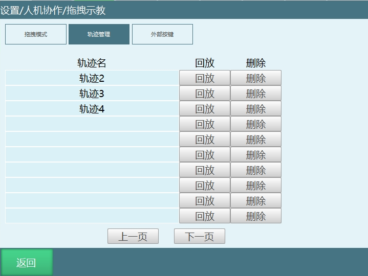

| 功能 | 说明 |
| :--- | :--- |
| 回放 | 回放拖拽的轨迹 |
| 删除 | 删除拖拽轨迹，删除的轨迹不可恢复，请谨慎操作 |

## 5.6 外部按键

如下图所示：

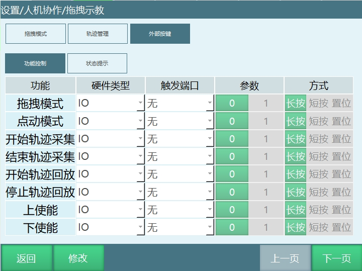

### 功能控制

参数生效方式为0和1。

#### 1. 触发方式为长按

触发IO 3-10s后生效：
- 0有效时，IO状态为1-0-1
- 1有效时，IO状态为0-1-0

#### 2. 触发方式为短按

触发IO 0-3s内生效：
- 0有效时，IO状态为1-0-1
- 1有效时，IO状态为0-1-0

#### 3. 触发方式为置位

置位方式的IO信号是持续触发的，正常使用应该选择功能对立的情况上使能1生效，下使能0生效，绑定同一个端口，方式选择置位。

**例如**：上使能触发端口1-1，参数1有效，下使能触发端口1-1，参数0有效，当1-1口为1时上使能，1-1口为0时下使能。

**注意事项**：选择置位，选择的功能对立时，必须第一个参数选择1，第二个参数选择0。

**例如**：上使能和下使能功能对立，置位时上使能参数必须选1，下使能选0，如果上使能参数选0，下使能选1的话功能不生效。

### 功能示例

| 功能 | 示例说明 |
| :--- | :--- |
| 拖拽模式 | 示例：IO端口1-1，触发1-1信号，示教模式切换为拖拽模式  **注意**：机器人必须辨识成功后才可以切换为拖拽模式进行拖拽操作 |

---

## 6 常见问题与解答 (FAQ)

## 6.1 机器人辨识相关

### Q: 机器人辨识前需要做什么准备？

A: 在使用力学功能之前首先需要设置好动力学参数，使控制器建立机器人的动力学模型。设置动力学参数需进入"设置/人机协作/动力学参数"。

### Q: 机器人辨识过程中可以操作示教器吗？

A: 辨识过程中除必要情况不要操作示教器，人员需远离机器人。若需要停止辨识，可以通过点击示教盒上的停止、按下急停按钮或切换模式来停止机器人。

### Q: 机器人辨识的轨迹范围和速度如何设置？

A: 机器人进行轨迹测试时，范围和速度应由小到大设置，逐渐确定一个不会碰到周围环境前提下的最大轨迹范围值。再把轨迹速度设置为100，就可以开始辨识。

### Q: 机器人辨识适用于哪些情况？

A: 目前该辨识方法仅适用于六轴机器人空载情况下辨识机器人本体的动力学参数。

### Q: 辨识过程中出现错误怎么办？

A: 如果辨识过程中出现错误，首先检查机器人是否在零点位置，周围是否有障碍物，轨迹范围是否合理。如果问题仍然存在，请联系技术支持。

### Q: 辨识完成后误差值多少算正常？

A: 辨识误差值越小说明误差越小，但不能为0。一般来说，误差值在合理范围内即可正常使用，具体数值因机器人型号而异。

## 6.2 力学功能相关

### Q: 碰撞检测如何设置？

A: 碰撞检测开关开启后机器人会根据灵敏度对碰撞进行检测，通常需要找到机器人运行时不会判定发生碰撞的值，然后就可以正常使用。

### Q: 力矩前馈有什么作用？

A: 力矩前馈即在伺服运动前提前告诉伺服运动时应该以多大的力矩进行运动，方便伺服进行运动调节，从而降低运动时机器人抖动的情况。

### Q: 碰撞检测阈值如何调整？

A: 碰撞检测阈值需要根据实际使用情况进行调整。一般来说，点动模式的阈值可以设置得较低（更灵敏），而指令模式的阈值可以设置得较高（更稳定）。

### Q: 为什么碰撞检测会误触发？

A: 碰撞检测误触发可能是因为阈值设置过低、机器人负载变化、PID调节导致的力矩波动等原因。可以通过调整误差允许时间来减少误触发。

### Q: 力矩前馈功能对所有机器人都适用吗？

A: 力矩前馈功能适用于大多数六轴机器人，但效果可能因机器人型号和负载情况而异。建议根据实际情况进行调整。

## 6.3 拖拽示教相关

### Q: 如何切换拖拽模式？

A: 有三种方法：1. 使用示教器-监控-快捷键-示教方式按钮进行切换；2. 使用示教器拖拽键进行切换；3. 通过在设置-人机协作-拖拽示教界面设置的外部信号（DIN输入信号）进行切换。

### Q: 拖拽模式有哪几种？

A: 拖拽模式分为三种：自由拖动（可以拖动六个轴）、位置拖动（只可以拖动前三个轴）、姿态拖动（只可以拖动后三个轴）。

### Q: 3D鼠标使用前需要做什么准备？

A: 使用3D鼠标功能，可以不用进行辨识就可以正常切换并使用。使用前一定要确认机器人运行安全方可进行使用。

### Q: 3D鼠标首次使用需要哪些步骤？

A: 首次使用3D鼠标按键顺序：点击修改；标记零点；标记XYZ方向；设置灵敏度数值；保存。

### Q: 3D鼠标连接不上怎么办？

A: 检查3D鼠标的接线是否正确，COM端口是否设置正确，电源是否正常。如果问题仍然存在，请联系技术支持。

### Q: 拖拽示教时机器人移动不流畅怎么办？

A: 可以调整关节空间速度限制和关节摩擦力补偿校正系数，从0开始逐渐增加，找到最适合的参数值。

### Q: 拖拽轨迹可以导出吗？

A: 目前拖拽轨迹只能在轨迹管理界面进行回放和删除，暂不支持导出功能。

## 6.4 安全相关

### Q: 人机协作时需要注意哪些安全事项？

A: 1. 确保机器人辨识成功后再进行拖拽操作；2. 辨识过程中人员需远离机器人；3. 拖拽操作时需确保周围环境安全；4. 如遇紧急情况，立即按下急停按钮。

### Q: 如何确保人机协作的安全性？

A: 1. 正确设置碰撞检测阈值；2. 定期检查机器人的动力学参数；3. 操作人员需经过培训；4. 工作区域需设置安全防护措施。

### Q: 机器人在拖拽模式下突然停止怎么办？

A: 检查是否触发了碰撞检测，是否达到了速度限制，或者是否有外部信号干扰。如果问题仍然存在，请联系技术支持。

## 6.5 其他问题

### Q: 人机协作功能适用于所有机器人型号吗？

A: 人机协作功能主要适用于六轴机器人，具体支持的机器人型号请参考技术文档。

### Q: 如何判断机器人辨识是否成功？

A: 辨识完成后，界面会显示六个轴的误差值，且没有报错信息，说明辨识成功。

### Q: 3D鼠标和力矩拖拽有什么区别？

A: 3D鼠标不需要机器人辨识就可以使用，操作更加直观；力矩拖拽需要机器人辨识成功后才能使用，更适合精确的示教操作。

### Q: 如何提高拖拽示教的精度？

A: 1. 确保机器人辨识成功，误差值较小；2. 调整合适的关节空间速度限制；3. 选择合适的拖拽模式（自由拖动、位置拖动或姿态拖动）。

### Q: 人机协作功能会影响机器人的运行速度吗？

A: 开启力矩前馈功能可能会提高机器人的运动平稳性，但不会显著影响运行速度。碰撞检测功能在正常情况下也不会影响运行速度，只有在检测到碰撞时才会停止机器人。

---

## 7 相关资源

- [示教器功能按键说明手册](./示教器功能按键说明手册.md)
- [外部轴使用手册](./外部轴使用手册.md)
- [系统功能调试手册](./系统功能调试手册.md)

---

## 8 AI 检索专用问答对 (Q&A for Retrieval)

**Q: 机器人辨识的作用是什么？**

A: 机器人辨识用于设置动力学参数，使控制器建立机器人的动力学模型，为碰撞检测和力矩前馈等功能提供基础。

**Q: 如何进入拖拽模式？**

A: 有三种方法：1. 使用示教器-监控-快捷键-示教方式按钮进行切换；2. 使用示教器拖拽键进行切换；3. 通过在设置-人机协作-拖拽示教界面设置的外部信号（DIN输入信号）进行切换。

**Q: 3D鼠标使用前需要做哪些准备？**

A: 首次使用3D鼠标按键顺序：点击修改；标记零点；标记XYZ方向；设置灵敏度数值；保存。

**Q: 碰撞检测阈值如何调整？**

A: 碰撞检测阈值需要根据实际使用情况进行调整。一般来说，点动模式的阈值可以设置得较低（更灵敏），而指令模式的阈值可以设置得较高（更稳定）。

**Q: 力矩前馈有什么作用？**

A: 力矩前馈即在伺服运动前提前告诉伺服运动时应该以多大的力矩进行运动，方便伺服进行运动调节，从而降低运动时机器人抖动的情况。