# 传送带跟踪工艺手册

## 工艺介绍

传送带跟踪，是指机器人利用用户输入的物料点位置，以及物料在这一位置时对应的编码器值，实时计算物料点的位置，通过运动来追踪物料。

点击【工艺】-【传送带跟踪工艺】-【参数设置】进入传送带跟踪工艺参数设置界面
。

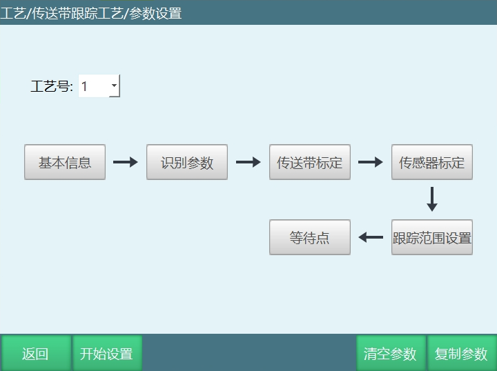

清空参数：清除当前选中工艺号的参数。

复制参数：将此工艺号的参数全部复制到另一个工艺号。

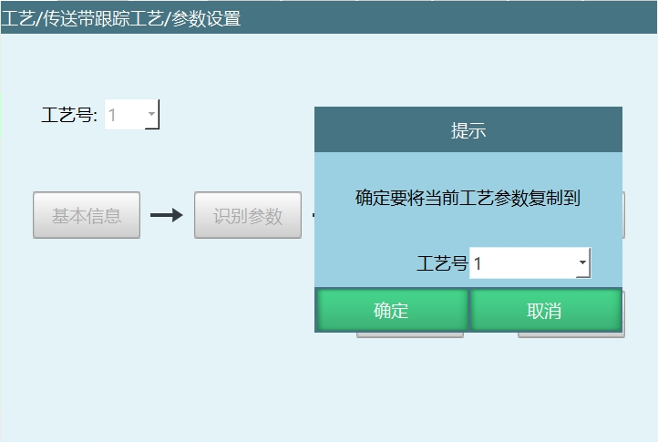

## 基本信息

在设置所有参数之前，请在"参数设置"界面选择一个工艺号，每一个工艺号保存了所有的参数。该基本信息是对传送带的参数进行基本的设置。

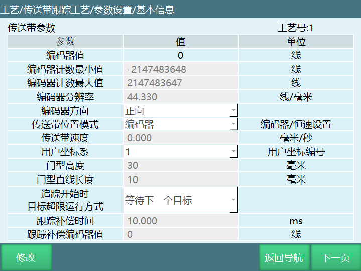

1.  编码器值

编码器连接成功后，自动识别当前已连接编码器的值，此数只能读，无法修改。

编码器值无法读取成功时一般分为两种情况：编码器接口的接线方式不正确；编码器接到IO板上面的端口位置不对。

IO板上面的端口位置可以参照对应IO板的定义图；编码器端口的接线方式可以参照对应编码器的定义图。

2.  编码器计数最大值最小值：

编码器数据处理模块所能计数的最大值是根据使用的
IO板作为编码器数据处理模块，目前范围有以下几种：

驱控一体版本： 0-65535；

> 诺达佳固件低于18版本：0-1024

诺达佳固件18版本：  -2147483648-2147483647；

R4C版本： -2147483648-2147483647。

3.  编码器分辨率：

传送带转动1mm，编码器发出的单位脉冲，此值为标定结果。

4.  编码器方向：

打开传送带，观察偏移量和速度是否随着传送带的移动而增大。如果没变化，那么编码器类型或者分辨率设置与实际情况不符。如果是随着传送带的运动而减小，那么此处选择方向。

5.  传送带位置模式：

选择编码器：正常的传感器标定。

选择恒速设置：恒速设置时和编码器无关，传送带速度可以手动填写进行设置（手动修改完速度之后要重新标定传感器）。

注意:设置恒速时传感器位置标定计算有误差；误差因素：标定时刻统计的传送带运动时间间隔偏大；

解决方法：机器人工具手停在工件随动的路径上，工件经过工具手时直接标定，可以减小误差。

6.  传送带速度

为当前传送带的速度，为只读。

7.  用户坐标系

可根据传送带的实际运动方向对此用户坐标系进行标定，追踪计算与运动就是在这个用户坐标系下面。

8.  门型高度：机器人以门型运动时Z轴的最高高度。

9.  门型直线长度：机器人抬起时，Z走到该设定长度才会移动X、Y坐标（该值不能大于门型高度）。

说明：该门型是当机器人接收到抓取坐标时，机器人需要运动到工件点位，以门型方式去抓取。

10. 追踪开始时目标超限运行方式

- 等待下一个目标：当工件超出追踪范围，示教器右下角会提示传送带跟踪当前超限，跟踪下一个目标。

- 跳行到追踪结束运行：当工件超出追踪范围，指令则会跳转至跟踪结束指令的位置。

11. 跟踪补偿时间

用于解决补偿滞后问题；通过时间与传送带速度计算获得。补偿滞后主要由编码器数据滤波以及机器人规划运动执行过程导致。

12. 跟踪补偿编码器值

用于解决补偿滞后问题；通过编码器值与分辨率计算获得。

## 参数识别

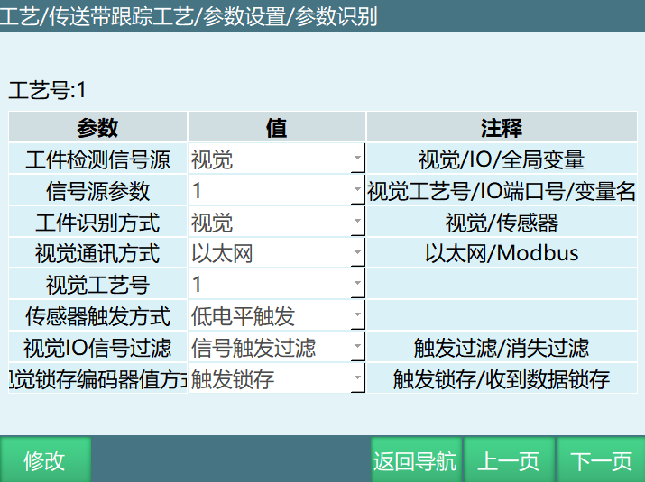

1.  工件检测信号源

可通过视觉、IO、全局变量三种方式来对传送带工件进行检测。

2.  信号源参数

若通过IO来对传送带工件进行检测,信号源参数可选择IO端口号；

若通过全局变量来对传送带工件进行检测,信号源参数可选择全局布尔变量。

3.  工件识别方式

可通过视觉，传感器两种方式来对传送带工件进行识别；选择传感器的时候，视觉通讯方式是不用选择的。

4.  视觉通讯方式

若通过视觉来对传送带工件进行识别，可选择以太网、Modbus两种通讯方式。

5.  视觉工艺号

范围1-9

6.  传感器触发方式

只有工件检测信号源设置为数字IO,信号源参数选择对应的IO端口，同时工件的识别方式为传感器，此时传感器触发方式才能生效，触发方式分为高电平触发（IO信号为1触发）、低电平触发（IO信号为0触发）两种触发方式。

7.  视觉IO信号过滤

- 视觉触发过滤：

当第一个工件触发传感器信号，在第二个工件触发传感器信号时，视觉还是没有返回数据，则丢弃第一个工件触发的传感器信号，然后记录第二个工件的传感器信号，第一个工件机器人不进行抓取。

当第一个工件触发传感器信号，在第二个工件触发传感器信号时，视觉返回数据，机器人则正常抓取。

- 信号消失过滤：

当第一个工件触发传感器信号，在第二次工件触发传感器信号消失时，视觉还是没有返回数据，则丢弃第一个工件触发的传感器信号，然后记录第二个工件的传感器信号，第一个工件机器人不进行抓取。

当第一个工件触发传感器信号，在第二次工件触发传感器信号消失时，视觉返回数据，机器人则正常抓取。

8.  视觉锁存编码器值方式：当机器人运行时，使用传感器与视觉搭配抓取工件，此时有工件经过传感器，视觉去拍摄图片计算工件方位，在指令运行时有许多不确定因素，相机处理速度慢，所以有了锁存功能。

- 触发锁存：视觉触发拍照时即锁存当前传送带编码器值。每次触发视觉时，若前一次工件触发传感器时未收到视觉数据，则丢弃前一次锁存的传送带编码器数据。

- 收到数据锁存：收到相机发送的数据时锁存编码器值。

## 传送带标定

该用户坐标系是在基本信息里进行选择的，用户坐标系是需要用户提前进行标定。

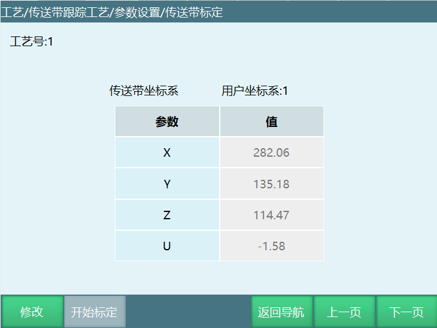

传送带标定，通过标定3个工件位置点，计算传送带的用户坐标系；点击【修改】，【开始标定】按钮进入标定界面。

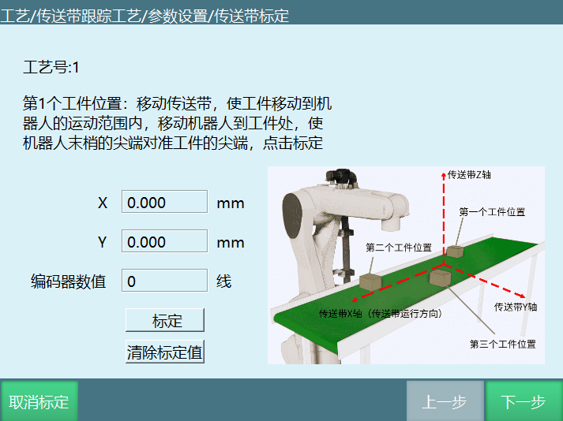

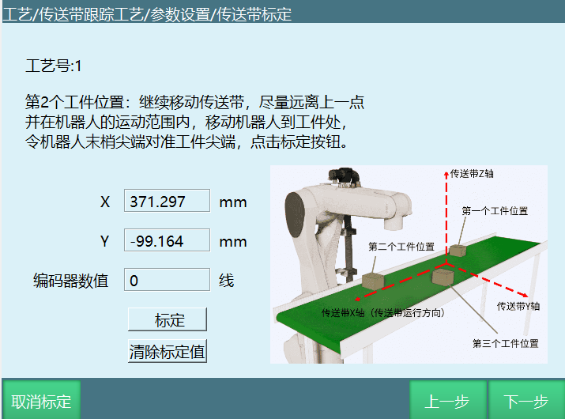

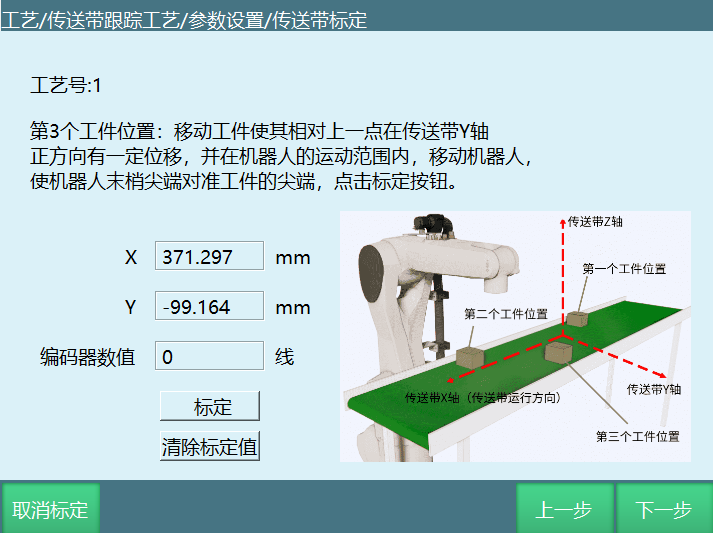

Step
1：在传送带上放置1尖状标定锥，移动传送带，使传送带上的标定锥移动到机器人的运动范围内，关掉传送带，移动机器人到工件处，使机器人工具末梢的尖端对准标定锥的尖端，点击标定。

Step
2：稍微示教抬高机器人，继续移动传送带，尽量远离上一点并在机器人的运动范围内，关掉传送带，移动机器人到标定锥处，机器人工具末梢尖端对准标定锥尖端，点击标定按钮。

Step
3：移动标定锥使其相对于上一点在传送带Y轴正方向有一定的位移，并在机器人的运动范围内，移动机器人到标定锥处，使机器人工具末梢尖端对准标定锥的尖端，点击标定按钮。

Step 4：上抬机器人一段距离，点击【计算】按钮，标定完成。

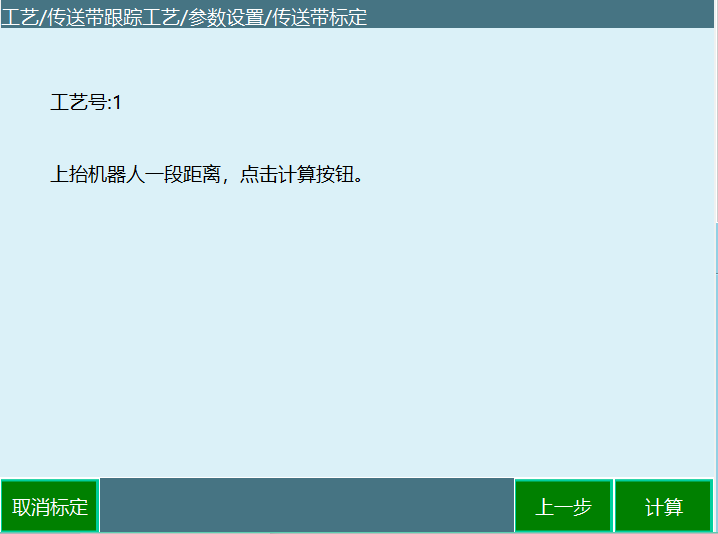

注意：所选用的用户坐标系的方向要与传送带的标定方向保持一致。

## 传感器标定

工件识别方式选择传感器时需要在此界面标定传感器；点击【修改】-【开始标定】按钮进入标定界面，如下图所示。

注意：使用视觉识别工件则无需标定，直接跳过。

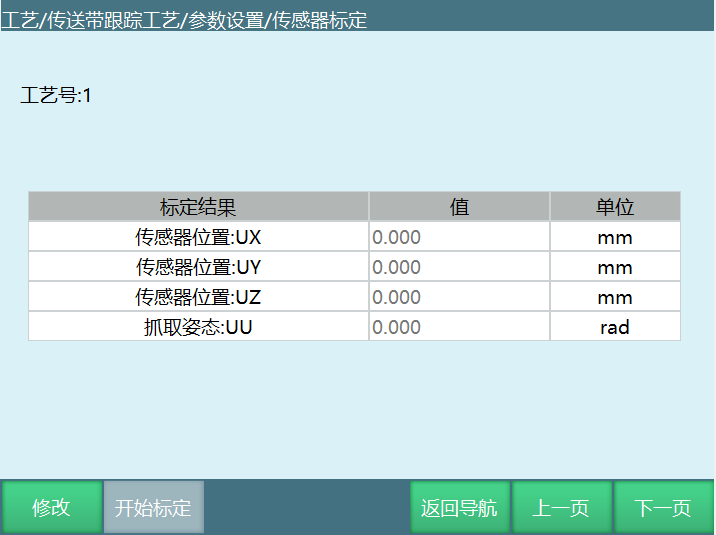

Step
1：准备一个带有尖端的工件，放置在传送带工作时的宽度处，并在机器人法兰上安装一个尖锥；移动传送带，使工件移动经过传感器位置，触发IO，然后继续移动传送带，将工件移动到机器人的运动范围内的标定点，传送带停止，将机器人移动到工件处，使尖对准尖；点击【标定】按钮。如下图：

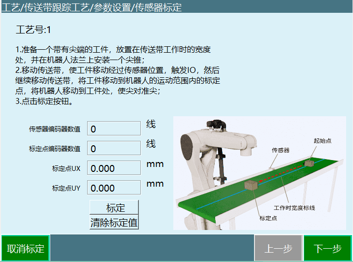

Step
2：将标定锥与机器人尖型工具手拆下，换成实际工作的工件和夹爪；将机器人运行到实际抓取的高度和姿态，点击【标定】按钮。如下图所示：

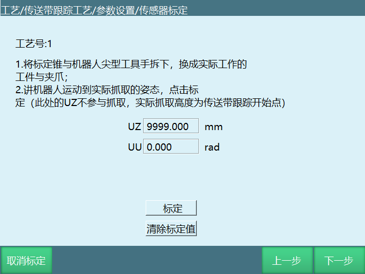

Step 3：点击【计算】按钮，标定参数被存入，详见下图。

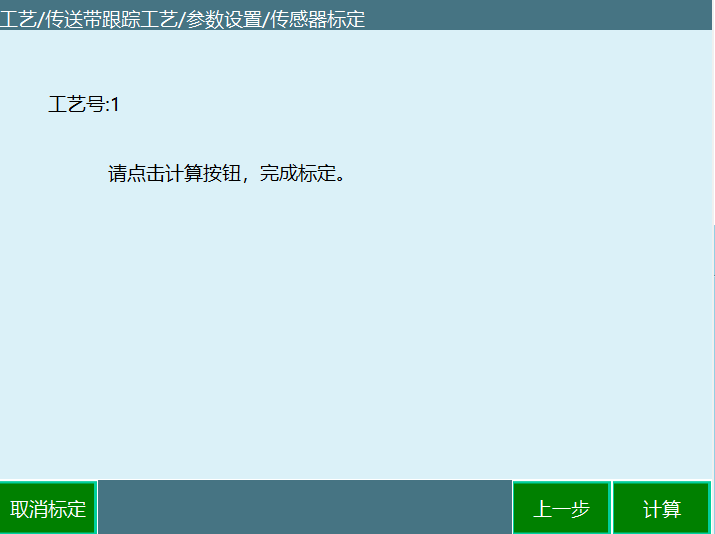

## 跟踪范围设置

该界面用来设置机器人在跟踪过程中的一些关键位置与追踪范围，如下图。

注意：使用传送带标定后的用户坐标系进行标定。

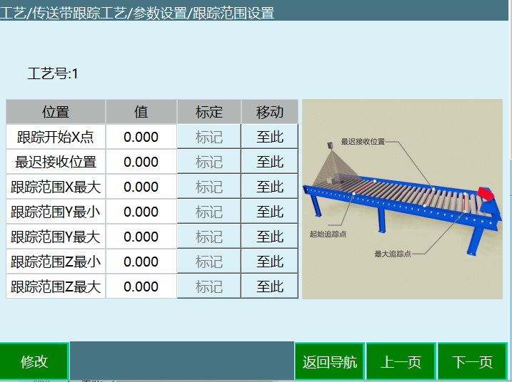

- 跟踪开始X点

此参数仅记录传送带坐标X轴（传送带运行方向）的值，每次跟踪时，只有工件超过该位置，机器人才会进行跟踪。

当机器人正在进行上一个追踪过程，而下一个工件已超过跟踪开始X点位置，机器人在完成上一个跟踪过程后会直接进行对该工件的追踪过程。

若机器人此时没有进行跟踪过程，此时工件还没有到达跟踪开始X点位置，则机器人会在该位置进行等待。

- 跟踪范围X最大

跟踪范围在传送带X轴（传送带运行方向）最大的位置，无论工件是否正在被跟踪，只要超过该位置，机器人则放弃追踪并进行警告提示。

- 跟踪范围Y最小

跟踪范围在传送带Y轴（垂直于传送带运行方向）最小的位置，工件小于该位置，机器人不跟踪。

- 跟踪范围Y最大

跟踪范围在传送带Y轴（垂直于传送带运行方向）最大的位置，工件大于该位置，机器人不跟踪。

- 跟踪范围Z最小

机器人在跟踪过程中的最小高度。

- 跟踪范围Z最大

机器人在跟踪过程中的最大高度。

- 最迟接收位置

工件在传送带X轴（传送带运行方向）上的最迟接收位置。工件在被跟踪之前超过该位置，机器人不跟踪该工件。

注意：若发现标定的范围不合理，请重新确认用户坐标系的标定，查看选用的用户坐标系的方向是否合理。

## 等待点

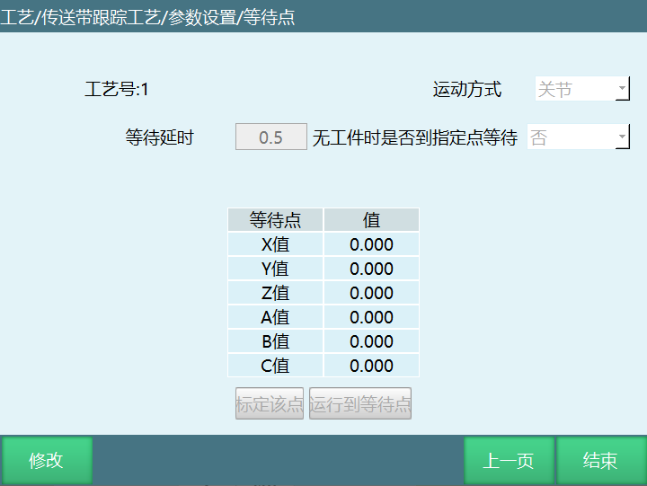

1.  运动方式：工件抓取完成后机器人回到安全点，如果在设定的时间内没有工件还需要抓取，则以设定的运动方式运动到等待点。

关节：工件跟踪结束后机器人以关节运动方式回到等待点。

门型：工件跟踪结束后机器人以门型运动方式回到等待点。

门型高度：机器人以门型运动时Z的最高高度。

门型直线长度：机器人抬起时，Z走到该设定长度才会移动X,Y坐标（该值不能大于门型高度）。

2.  等待延时

通过设置的时间判断是否有工件，例如设置的时间为0.5，0.5s内有工件就直接继续追踪，没有工件，机器人就去等待点。

3.  无工件时是否到指定点等待

是：无工件时会在等待点停留，一直等到检测到工件的信号才会继续跟踪。

否：无工件时不去等待点停留，跟踪当前工件结束位置等待下一个工件信号。

4.  标定该点

无论在什么坐标系下标记点位，保存的依旧是用户坐标系下的点位。

5.  运行到等待点

运行到标记的等待点。

## 传送带指令

## CONVEYOR_ON-传送带跟踪开始

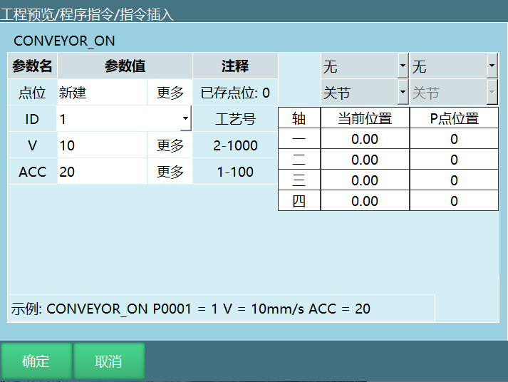

格式：CONVEYOR_ON【指令名】P/GP/工件点【点位】V【跟踪速度】ACC【加速度】。

功能：工件到达跟踪范围后开始跟踪。

参数：

| 点位 | 基准点位置数据（P点、GP点、工件点：相机发送的点位）                                                                                                                                               |
| :--- | :--- |
|  | 工件点：当相机发送的点位是一段轨迹时将这段轨迹的第一个点作为工件点                                                                                                                                |
|  | P/GP:用户可以选择一个已有位置变量或者新建一个位置变量。该点为传送带跟踪过程中的基准点，还可以确定跟踪高度。建议将此点设置为需追踪工件的中间点，若需要在工件上走轨迹，则将该点设置在轨迹的第一个点 |
| ID | 传送带跟踪工艺号                                                                                                                                                                                  |
| V | 传送带跟踪时的速度                                                                                                                                                                                |
| ACC | 传送带跟踪时的加速度                                                                                                                                                                              |

## CONVEYOR_OFF-传送带跟踪结束

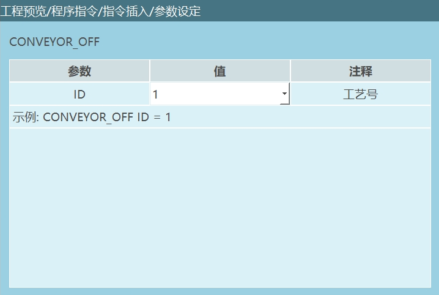

格式：CONVEYOR_OFF【指令名】ID【跟踪结束工艺号】GP【】I001【】。

功能：传送带结束跟踪。

参数：

| ID | 传送带跟踪工艺号 |
| :--- | :--- |

## CONVEYOR_POS-获取传送带跟踪位置

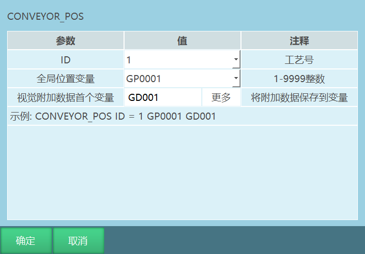

格式：CONVEYOR_POS【指令名】ID【工艺号】.

功能：传感器标定的结果存入选择的位置变量，附加数据的值存入数值变量。

参数：

| ID | 传送带跟踪工艺号                                                                                                                                                                                                                           |
| :--- | :--- |
| 全局位置变量 | 传感器触发时将传感器标定结果存入GP点                                                                                                                                                                                                       |
|  | 视觉触发时将视觉每次拍照的位置存入GP点                                                                                                                                                                                                     |
| 附件数据首个变量 | 附加数据的值保存到变量，变量类型（整型、浮点型、字符型）                                                                                                                                                                                   |
|  | 视觉工艺-视觉参数界面设置附加数据个数，获取传送带跟踪位置参数界面设置附加数据首个变量，执行此条指令可以将获取到的附加数据值存入到变量。用户可以通过条件判断调用对应的变量抓取不同颜色，形状等工件                                          |
|  | 例如：附加数据首变量为GD001,附加数据个数为2，执行此条指令会将用户定义的附加数据值按顺序存入GD001,GD002                                                                                                                                     |
|  | 如果用户需要将传送带上不同颜色工件抓取后放置在不同位置，我们可以将不同颜色的工件用不同的变量值表示，然后通过IF条件判断选择对应变量对不同颜色工件抓取。假设将红色工件用GD001=1表示，当相机拍到的工件是红色时条件判断ifGD001=1，抓取红色工件 |

## CONVEYOR_REMOVE-删除传送带跟踪目标

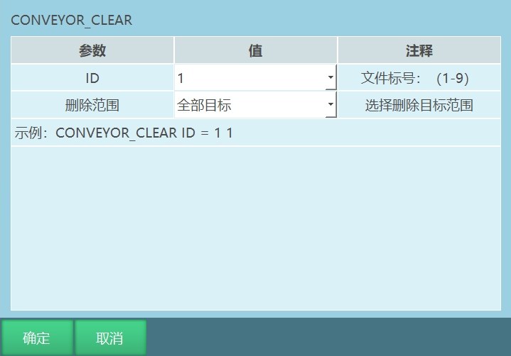

格式：CONVEYOR_REMOVE【指令名】ID=1【跟踪工艺号】0/1【删除的目标范围："0"全部目标，"1"本次目标】。

功能：根据选择的删除范围删除跟踪信号。

参数：

| ID | 传送带跟踪工艺号，范围【1，9】 |
| :--- | :--- |
| 删除范围 | 全部目标：程序运行时多次给传送带跟踪开始信号，除了第一个信号以外的所有信号都会删除 |
|  | 本次目标：程序运行时多次给传送带跟踪开始信号，每一次循环都会删除前一个信号 |
|  | 假设有5个工件，第1个工件跟踪，第2个工件跟踪信号删除不跟踪，第3个工件跟踪，第4个工件跟踪信号删除不跟踪，第5个工件跟踪 |
|  | 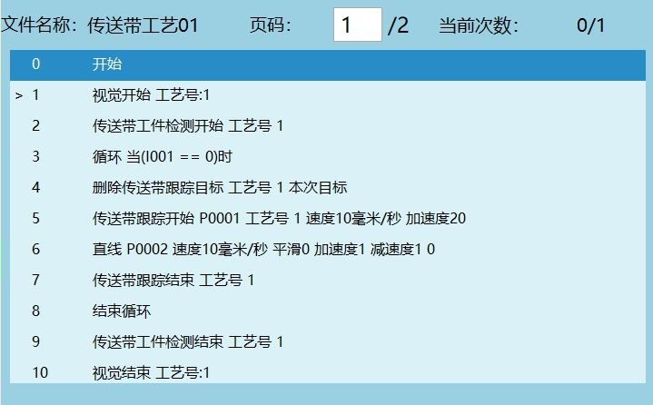 |

## CONVEYOR_CHECKEND-传送带工件检测结束

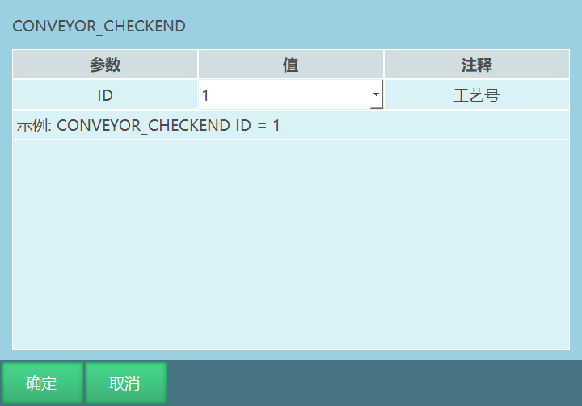

格式：CONVEYOR_CHECKEND【指令名】ID【跟踪工艺号】。

功能：停止检测工件，执行此条指令后就算工件经过传感器也不参与队列计算。

参数：略。

## CONVEYOR_CHECKPOS-传送带工件检测开始

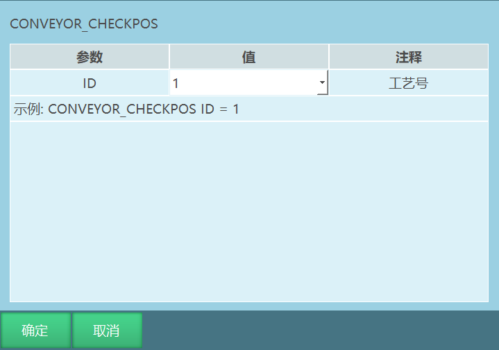

格式：CONVEYOR_CHECKPOS【指令名】ID【跟踪工艺号】。

功能：执行此条指令，工件经过传感器时参与队列计算。

参数：

| ID | 传送带跟踪工艺号 |
| :--- | :--- |

## 程序示例说明

## 示例1:传感器触发，在跟踪的工件上运行轨迹

示例说明：

1.  机器人安全位置；

2.  开始检测工件，工件经过传感器时开始参与队列计算；

3.  循环开始，工件循环跟踪；

4.  开始跟踪工件；

5.  延时1秒；

6.  在跟踪的工件上走直线轨迹（GP0001-GP0002）；

7.  结束工件跟踪；

8.  工件循环跟踪结束；

9.  停止检测，工件再次经过传送带时不参与队列计算。

## 示例2：传感器触发，使用外部点功能走轨迹

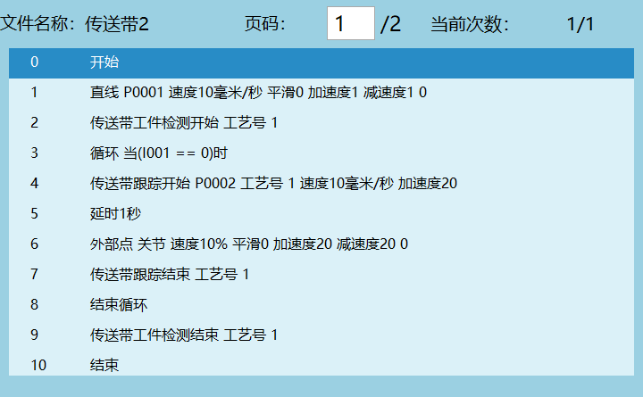

示例说明：

1.  机器人安全位置；

2.  开始检测工件，工件经过传感器时开始参与队列计算；

3.  循环开始，工件循环跟踪；

4.  开始跟踪工件；

5.  延时1秒；

6.  使用外部点功能发送点位走轨迹；

7.  结束工件跟踪；

8.  工件循环跟踪结束；

9.  停止检测，工件再次经过传送带时不参与队列计算。

## 示例3：视觉+传送带跟踪

通过视觉追踪工件，工件检测信号源那里要选择视觉。

示例说明：

1.  机器人安全位置；

2.  打开视觉；

3.  传送带工件检测开始；

4.  循环开始，工件循环跟踪；

5.  相机拍照一次，视觉触发一次（视觉软件里面选择的触发条件为连续时视觉触发指令触发一次后工件也能够正常跟踪，如果触发条件为单次时，相机拍一次触发一次）；

6.  开始跟踪工件；

7.  跟踪轨迹（P0003-P0004）；

8.  结束工件跟踪；

9.  工件循环跟踪结束；

10. 停止检测，工件再次经过传送带时不参与队列计算；

11. 关闭视觉。

## 示例4：传送带与码垛结合使用

视觉跟踪工件，将抓取到的工件进行码垛。

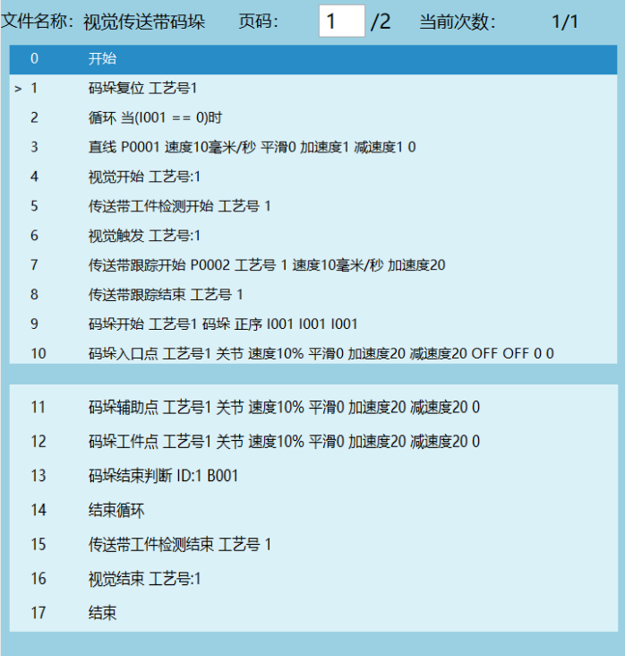

## 示例5:获取跟踪位置附件数据参数说明

1.  视觉工艺-视觉参数界面设置附加数据个数，最多支持10个。

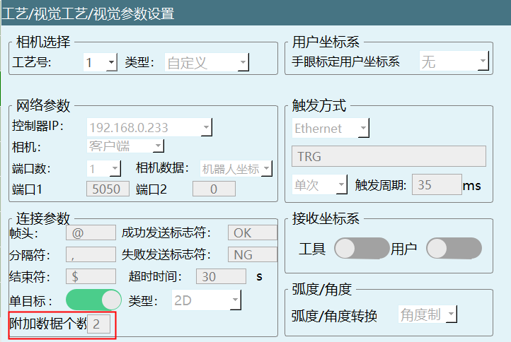

2.  点击视觉位置参数进入参数界面后查看示例格式发生变化，"data"表示附加的数据。

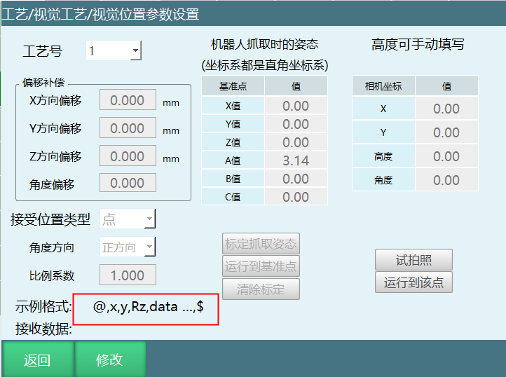

3.  外部设备：网络调试助手，按照视觉位置参数界面的示例格式发送点位。

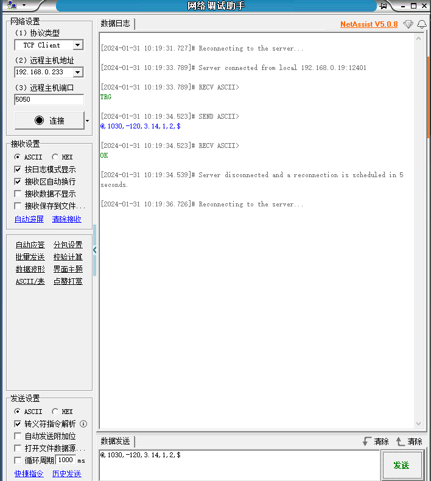

4.  点击试拍照，网络助手发送点位后接收数据行的"1，2"表示附加数据。附加数据默认存到GS001,根据定义的附加数据个数顺延存入。

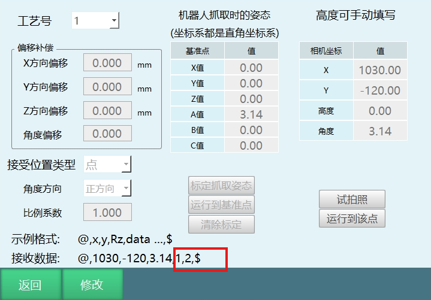

5.  如果插入获取传送带跟踪位置指令，执行指令会将定义的附加数据的值存入用户自己选择的变量（整型、浮点型、字符型），用户可以将工件的形状，颜色用数值表示（例如GD001=1表示红色，GD002=2表示绿色），然后通过条件判断对不同颜色的工件跟踪抓取。

例如：

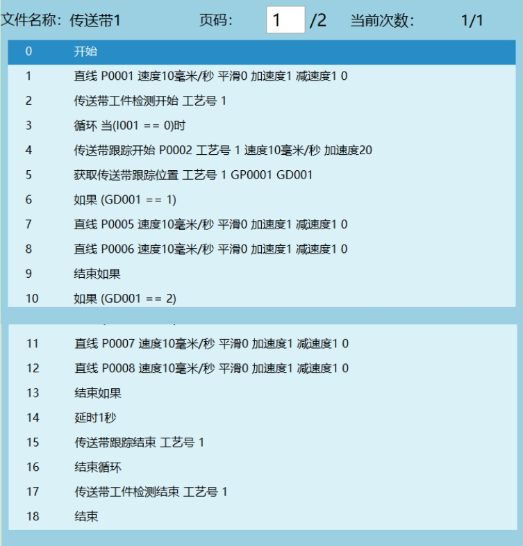

## AI 检索专用问答对 (Q&A for Retrieval)

### Q1: 传送带跟踪时机器人无法准确抓取工件，怎么办？

**A1:** 检查以下几点：1. 编码器连接是否正常，确保编码器值能正确读取；2. 传送带标定是否准确，特别是3个标定锥的位置是否正确；3. 传感器标定是否准确，确保传感器触发位置与实际抓取位置一致；4. 跟踪范围设置是否合理，确保工件在跟踪范围内；5. 跟踪补偿时间和编码器值是否设置正确，以解决滞后问题。

### Q2: 传送带跟踪过程中出现"跟踪超限"警告，怎么办？

**A2:** 这是因为工件超出了设定的跟踪范围。解决方法：1. 调整跟踪范围X最大值，确保工件在跟踪范围内；2. 检查跟踪开始X点设置，确保机器人有足够的时间开始跟踪；3. 检查传送带速度是否稳定，避免速度突变导致工件快速超出范围。

### Q3: 视觉+传送带跟踪时，相机无法正确识别工件，怎么办？

**A3:** 检查以下几点：1. 视觉工艺号设置是否正确；2. 视觉通讯方式（以太网/Modbus）是否与实际连接方式一致；3. 相机触发方式是否设置正确；4. 视觉IO信号过滤设置是否合理；5. 视觉锁存编码器值方式是否适合当前场景。

### Q4: 传送带跟踪时机器人运动轨迹不稳定，怎么办？

**A4:** 可能的原因：1. 编码器分辨率设置不正确，导致位置计算误差；2. 传送带速度不稳定，建议使用编码器方式而非恒速设置；3. 用户坐标系标定不准确，重新进行传送带标定；4. 机器人速度和加速度设置不合理，调整CONVEYOR_ON指令的V和ACC参数。

### Q5: 如何提高传送带跟踪的准确性？

**A5:** 提高准确性的方法：1. 确保编码器安装牢固，避免振动影响；2. 精确标定传送带和传感器；3. 根据实际情况调整跟踪补偿时间和编码器值；4. 选择合适的视觉锁存编码器值方式；5. 合理设置跟踪范围和等待点参数；6. 定期检查和维护编码器和传感器。
