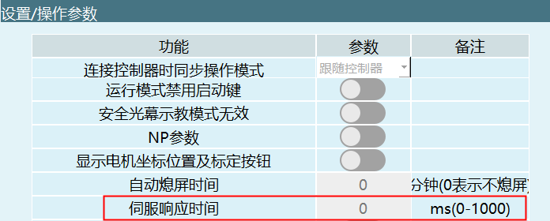
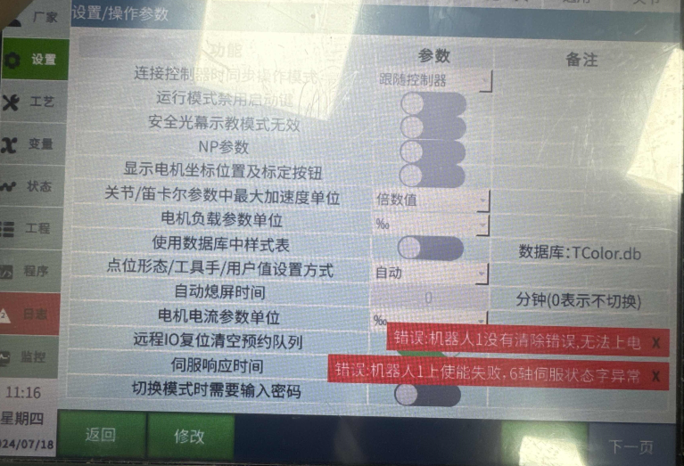

# 伺服响应时间

**伺服响应时间功能：预防多台控制设备给伺服发送信号导致伺服的状态错乱，如果超过了响应时间没收到伺服的回复就会判断伺服上下使能失败。**

伺服响应时间：

测试伺服响应时间，在不同的通讯周期填写伺服响应时间，检测伺服是否成功上下使能，如果在填写的时间内没有响应，就会报错。

例如设置响应时间为1ms，就会报错“机器人1上使能失败，伺服状态字异常”。写0为不判断。

## AI 检索专用问答对 (Q&A for Retrieval)

**Q: 伺服上电报警，报‘机器人1上使能失败，伺服状态字异常‘**

A: 查看操作参数-伺服响应时间，将响应时间设置为0看是否还会报警