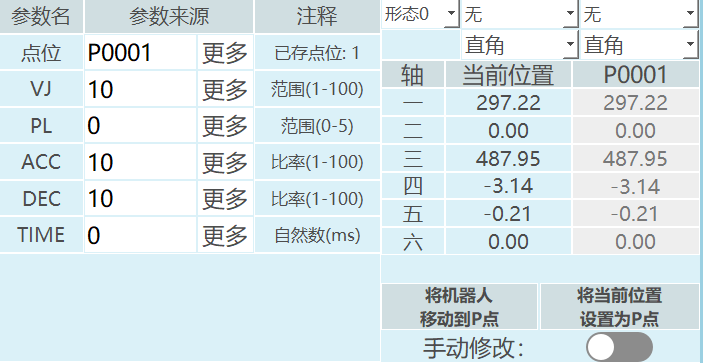
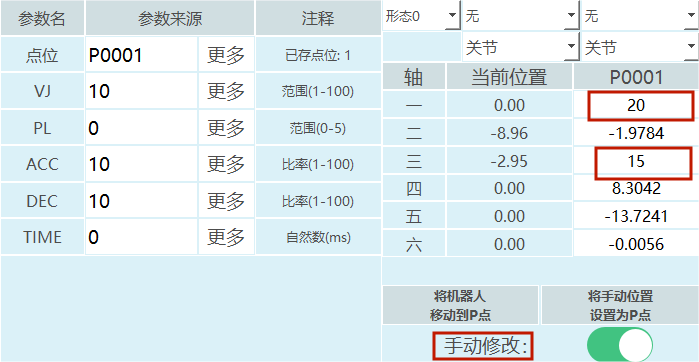
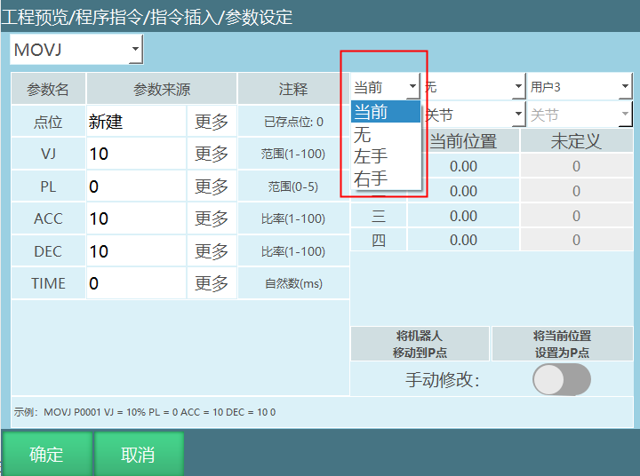
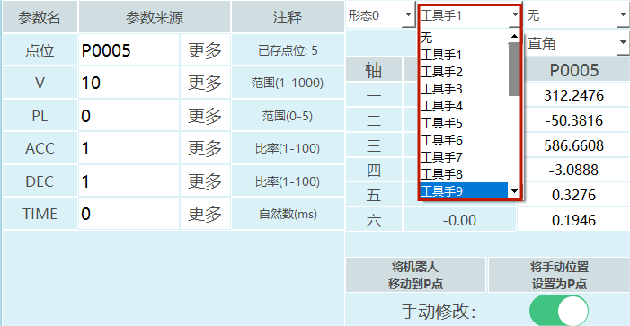

# 修改机器人点位

## 文档概述

### 文档目的

本文档旨在详细说明如何修改机器人点位的方法，包括将当前位置设为目标点位、手动修改点位坐标以及调整目标点位信息参数等操作，帮助用户正确、高效地完成机器人点位的修改工作。

### 文档结构

本文档分为：文档概述、核心内容、相关资源、常见问题。核心内容部分详细介绍了修改机器人点位的具体操作步骤和参数设置方法。

### 术语定义
| 术语 | 定义 |
| :--- | :--- |
| P变量 | 局部位置变量，仅在当前程序中有效 |
| GP变量 | 全局位置变量，在所有程序中都可以使用 |
| 形态参数 | 6轴串联多关节机器人的参数，范围为[0,8]，通过机器人1、3、5轴的关节点位计算得出 |
| 工具手 | 机器人末端执行器的坐标系，范围为[0,999] |
| 用户坐标 | 用户自定义的坐标系，范围为[0,999] |

---

## 核心内容

### 注意事项

1.  当目标点位的坐标为直角、工具或者用户坐标时，修改的点位工具要和实际使用工具一致，否则程序运行时出错！

2.  当目标点位的坐标为用户坐标时，修改的点位用户要和实际使用用户一致，否则程序运行时出错！

### 如何修改点位

#### 将当前位置设为目标点位

1.  插入指令选择新建一个P变量或者GP变量；

2.  如果点位选择"新建"，需要点击参数设定界面的确定按钮，点击确定后一个新的局部位置变量新建成功，选中新建的变量，点击【修改】，点击【将当前位置设置为P点】；

3.  如果选择的是GP点，在参数设定界面可以直接点击【将当前位置设置为GP点】；

4.  【将当前位置设置为P/GP点】：如果当前点位是关节点位，会将当前的关节点位坐标写入目标变量；当前点位是直角点位，会将当前的直角点位坐标写入目标变量；当前点位是工具点位，会将当前的工具点位坐标写入目标变量；当前点位是用户点位，会将当前的用户点位坐标写入目标变量；

5.  提示框弹出"是否继续修改点位",点击【确定】将当前位置存入目标变量，点击【取消】不会记录机器人当前点位到目标变量，可以继续移动机器人到想要的点位,参数界面"当前位置"在移动机器人时坐标是一直变化的。

#### 手动修改目标点位

1.  手动修改机器人位置时需要先打开"手动修改"的开关，这样点位才会修改成功。

2.  打开手动修改按钮，修改目标变量目标轴的点位。填入需要的坐标值,如上图所示将P0001目标变量的关节坐标一轴手动修改为20，三轴手动修改为15,点击【将手动位置设为P/GP点】提示框弹出"是否继续修改点位",点击【确定】将修改后的点位位置存入目标变量，小白条提示修改成功。点击【取消】可以继续修改目标轴的点位；

3.  【将机器人移动到P/GP点】将机器人移动到选择的目标变量存入的位置，例如：在一个作业文件里面插入了多条运动指令，如果想要单独移动某一个点位可选中指令在程序指令界面点击【修改】，按下上电使能，点击【将机器人移动到P/GP点】,机器人到达目标点位。

### 目标点位信息参数

#### 形态

形态范围：[0,8]

1.  机型为6轴串联多关节机器人有形态参数，如形态参数选择当前，则控制系统自动通过转换方式计算出机器人当前的形态值,形态值是通过机器人1、3、5轴的关节点位来计算的，如果范围在[-90,+90]之间则为1，不在为0；

2.  形态值为机器人1轴、3轴、5轴位置的二进制转换为十进制然后再加1。

例如：某个六轴机器人1轴为59度、2轴为69度、3轴为79度、4轴为89度、5轴为99度、6轴为109度；

结果如下：二进制数110 = 十进制6，形态值为十进制结果再加1，该点位形态值为7。

| 轴 | 1轴 | 3轴 | 5轴 |
| :--- | :--- | :--- | :--- |
| 二进制数值 | 1 | 1 | 0 |

3.  机型为四轴SCARA机器人时有左右手参数。

修改目标点位形态：

1.  打开手动修改按钮，点击形态，选择需要修改的形态值；

2.  修改完成后，点击【确定】形态值修改成功。

#### 工具手

范围：[0,999]。

修改目标点位的工具手：

1.  打开手动修改按钮，点击工具手，选择需要修改的工具手号；

2.  修改完成后，点击【确定】工具手修改成功。

#### 用户坐标

坐标范围：[0,999]

修改目标点位的用户坐标

1.  打开手动修改按钮，点击用户，选择需要修改的用户坐标号；

2.  修改完成后，点击【确定】用户坐标号修改成功。

#### 坐标系

1.  打开手动修改按钮，点击目标点位坐标;

2.  选择需要修改的坐标系修改完成后，点击【确定】坐标系修改成功。

---

## 相关资源

### 参考文档

- [示教器换图](./示教器换图.md)
- [T30示教器按键介绍](./T30示教器按键介绍.md)

### 相关操作手册

- [人机协作](./人机协作.md)
- [力矩前馈](./力矩前馈.md)
- [外部轴使用手册](./外部轴使用手册.md)

---

## AI 检索专用问答对 (Q&A for Retrieval)

**Q：如何将当前位置设为目标点位?**

A ：插入指令选择新建一个P变量或者GP变量，然后点击【将当前位置设置为P/GP点】，确认后即可将当前位置存入目标变量。

**Q：如何手动修改目标点位?**

A ：打开"手动修改"的开关，修改目标变量目标轴的点位，填入需要的坐标值，然后点击【将手动位置设为P/GP点】，确认后即可修改成功。

**Q：什么是形态参数?**

A ：形态参数是6轴串联多关节机器人的参数，范围为[0,8]，通过机器人1、3、5轴的关节点位计算得出，是这些轴位置的二进制转换为十进制然后再加1的结果。

**Q：修改点位时需要注意什么?**

A ：当目标点位的坐标为直角、工具或者用户坐标时，修改的点位工具要和实际使用工具一致；当目标点位的坐标为用户坐标时，修改的点位用户要和实际使用用户一致，否则程序运行时出错！

**Q：如何将机器人移动到已设置的点位?**

A ：选中指令在程序指令界面点击【修改】，按下上电使能，点击【将机器人移动到P/GP点】，机器人会到达目标点位。

---

## AI 检索专用问答对 (Q&A for Retrieval)

**Q: 如何将当前位置设为目标点位?**

A: 插入指令选择新建一个P变量或者GP变量，然后点击【将当前位置设置为P/GP点】，确认后即可将当前位置存入目标变量。

**Q: 如何手动修改目标点位?**

A: 打开"手动修改"的开关，修改目标变量目标轴的点位，填入需要的坐标值，然后点击【将手动位置设为P/GP点】，确认后即可修改成功。

**Q: 什么是形态参数?**

A: 形态参数是6轴串联多关节机器人的参数，范围为[0,8]，通过机器人1、3、5轴的关节点位计算得出，是这些轴位置的二进制转换为十进制然后再加1的结果。

**Q: 修改点位时需要注意什么?**

A: 当目标点位的坐标为直角、工具或者用户坐标时，修改的点位工具要和实际使用工具一致；当目标点位的坐标为用户坐标时，修改的点位用户要和实际使用用户一致，否则程序运行时出错！

**Q: 如何将机器人移动到已设置的点位?**

A: 选中指令在程序指令界面点击【修改】，按下上电使能，点击【将机器人移动到P/GP点】，机器人会到达目标点位。

**Q: 如何修改目标点位的形态?**

A: 打开手动修改按钮，点击形态，选择需要修改的形态值，修改完成后，点击【确定】形态值修改成功。

**Q: 如何修改目标点位的工具手?**

A: 打开手动修改按钮，点击工具手，选择需要修改的工具手号，修改完成后，点击【确定】工具手修改成功。

**Q: 如何修改目标点位的用户坐标?**

A: 打开手动修改按钮，点击用户，选择需要修改的用户坐标号，修改完成后，点击【确定】用户坐标号修改成功。

**Q: 如何修改目标点位的坐标系?**

A: 打开手动修改按钮，点击目标点位坐标，选择需要修改的坐标系修改完成后，点击【确定】坐标系修改成功。
