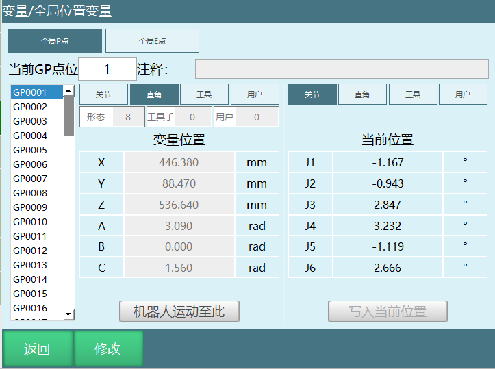
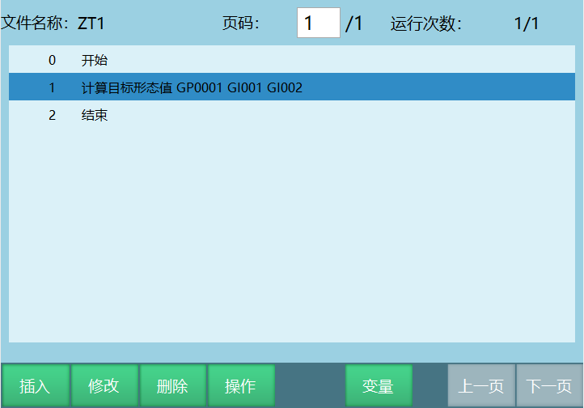
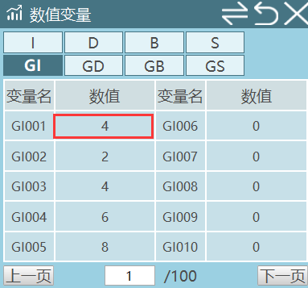
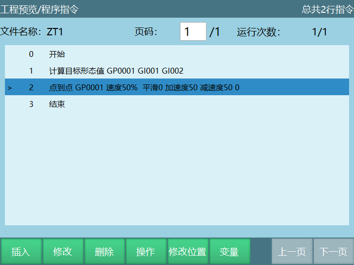

# 六轴协作机器人增加形态参数

**形态值规则：**

1、J1轴与J2轴形成一个平面，如果末端法兰中心在平面前方，A=1，否则A=0;（末端法兰中心就是指机器人的末端，末端在J1和J2形成的平面前A=1，否则A=0）

2、如果大臂小臂夹角小于180,B=1,否则B=0;（大小臂指的是2轴和3轴）

3、如果J4\<O(俯视向下)【默认J4关节限制-180\~+180】 , C=l，否则C=0;

形态值计算公式:形态值=A\*4+B\*2+C+1

例如;

J1= 60°，大小臂夹角小于180，J4\<0(向下俯视)，则A=1，B=1，C=1,形态值=1\*4
+1\*2+1 +1 =8

**注意：上述姿态都是基于机器人零点的基础上算的；**

**测试：**

1：找到一个点，计算该点的形态值，设定形态值后，走点到点，看看实际各轴是否符合形态值规则，可以多找几个点

2：多个形态值的点，可以形态值之间走一走，看看实际各轴是否符合形态值规则

例如：

- 首先找一个点

- 然后用计算目标形态值计算出此点有几个形态

- 由此可见，有四个形态，分别是形2、形态4、形态6、形态8；

- 用点到点依次走计算出来的形态，查看每个形态的机器人姿态，看看实际各轴是否符合形态值规则

## AI 检索专用问答对 (Q&A for Retrieval)

**Q：六轴协作机器人的形态值是怎么计算的？**

A： 
形态值由 A、B、C 三个条件共同决定，计算公式为：

`形态值 = A*4 + B*2 + C + 1`

其中：

- A：J1轴与J2轴形成一个平面，若末端法兰中心在平面前方，则 A=1，否则 A=0
- B：若大臂和小臂夹角小于 180°，则 B=1，否则 B=0
- C：若 J4 < 0（俯视向下），则 C=1，否则 C=0

例如：  
当 A=1、B=1、C=1 时，

`形态值 = 1*4 + 1*2 + 1 + 1 = 8`

**Q：文档中的形态值 8 是怎么得出来的？**

A：  
示例条件为：

- J1 = 60°
- 大臂小臂夹角小于 180°，所以 B=1
- J4 < 0（向下俯视），所以 C=1
- 末端法兰中心在 J1 和 J2 形成的平面前方，所以 A=1

代入公式：

`形态值 = A*4 + B*2 + C + 1`

即：

`形态值 = 1*4 + 1*2 + 1 + 1 = 8`

因此该姿态对应的形态值为 **8**。

**Q：六轴协作机器人增加形态参数后，应该如何测试是否生效？**

A： 
可以按以下两种方式测试：

1. 找到一个点，先计算该点的形态值。  
   设定不同形态值后执行点到点运动，观察机器人各轴实际姿态是否符合形态值规则。

2. 对于同一个点计算出的多个形态值，可以让机器人在这些形态值之间相互切换运动。  
   检查每次运动后的实际姿态，确认是否与对应形态规则一致。

例如文档中的测试结果显示，一个点可计算出 4 个形态，分别是 **形态2、形态4、形态6、形态8**，可依次运行这些形态进行验证。