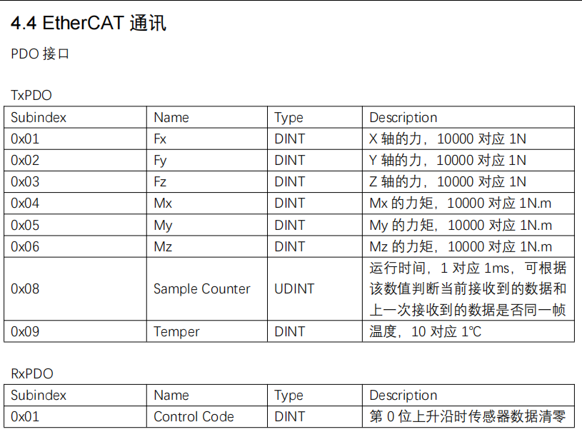
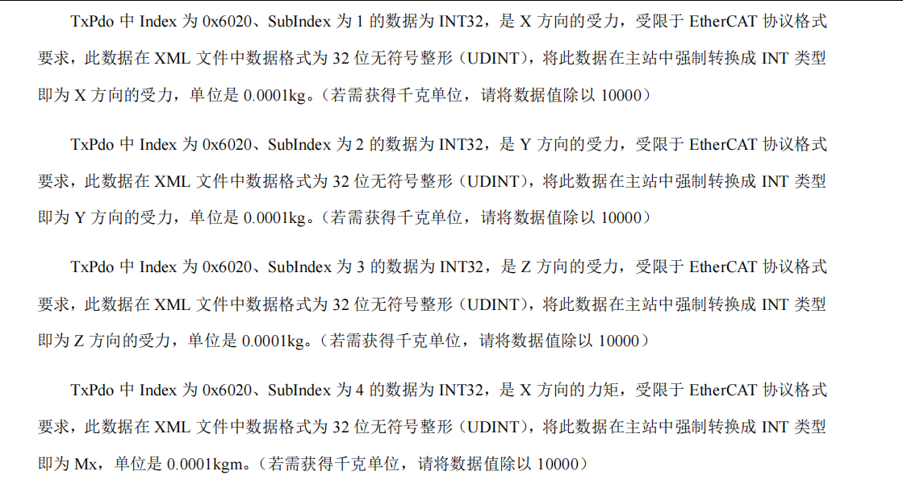
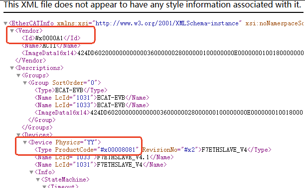
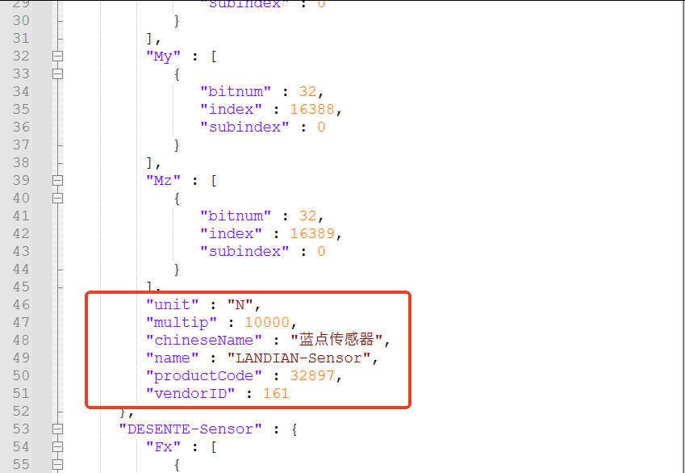
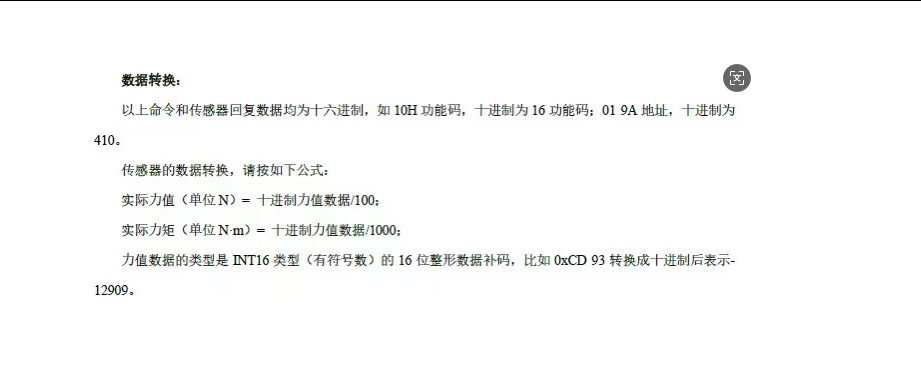
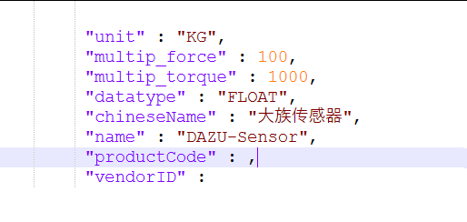
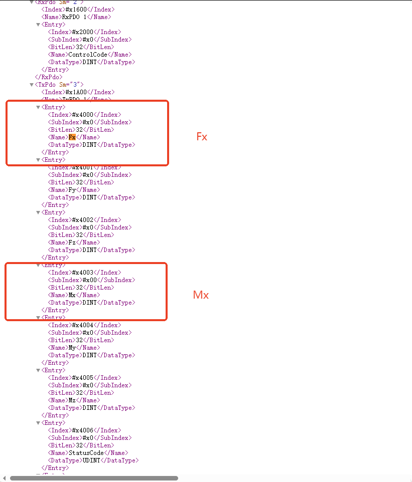
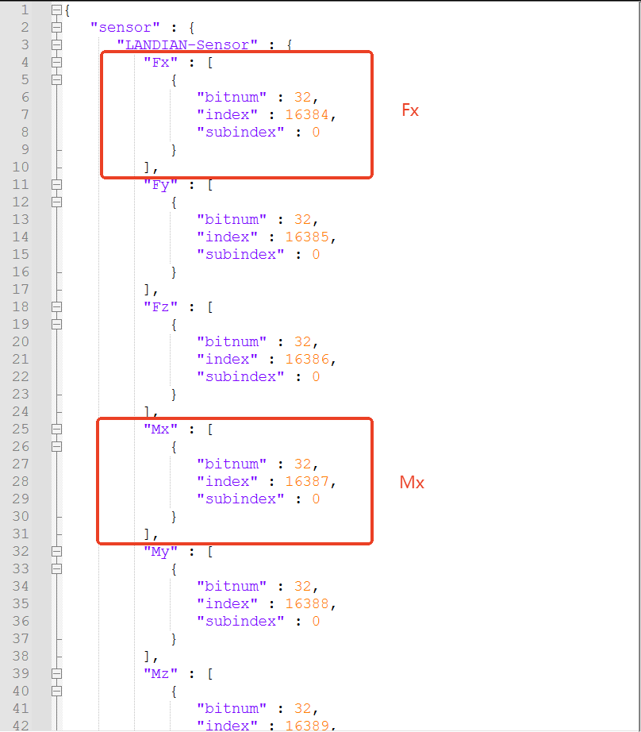

# 六维力传感器配置文件自动适配说明

## 功能概述

适配六维力传感器时，控制器通过EtherCAT通讯进行数据读取，需要配置传感器的PDO接口。本指南以蓝点传感器为例，详细介绍配置文件的自动适配步骤。

---

## 配置步骤

### 第一步：获取传感器基础信息

从传感器说明手册中查找与**EtherCAT通讯**相关的六维力信息：

1. **力和力矩名称**：如蓝点传感器的力和力矩名称为 **Fx、Fy、Fz、Mx、My、Mz**
2. **数据类型**：通常为 **DINT** 型
3. **单位**：力的单位为 **N**，力矩的单位为 **N·m**

> **注意**：不同厂商的力和力矩单位可能不同，例如坤维传感器的单位是 **KG**，需要根据实际情况填写参数。

### 第二步：配置厂商信息和单位参数

在XML文件开头查找厂商和产品信息：

1. **VendorID**：厂商识别码，需将**16进制**数据转换为**10进制**后填入配置文件
2. **ProductCode**：产品代码，同样需将**16进制**数据转换为**10进制**
3. **unit**：数据单位，如"N"或"KG"
4. **multip**：乘数参数，用于数值转换（如蓝点传感器每10000代表1N）

### 特殊配置说明

**注意事项**：

1. **力和力矩分开转换**：若厂家力和力矩的转换公式不同，需删除"multip"节点，添加"multip_force"和"multip_torque"节点，分别填写力和力矩的转换公式。

2. **数据类型配置**：控制器默认数据类型为INT，但部分厂家使用浮点型。此时需在配置文件内添加"datatype"节点，支持**FLOAT**和**DOUBLE**两种类型。

### 第三步：配置PDO接口参数

在XML文件内搜索力和力矩的名称，配置以下参数：

1. **Index**：索引值，需将**16进制**转换为**10进制**后填入
2. **SubIndex**：子索引值，需将**16进制**转换为**10进制**后填入
3. **BitLen**：位长度参数，直接填入配置文件的"bitnum"位置，无需转换

---

## 配置文件示例

配置文件已适配蓝点传感器和德森特传感器，分别代表了上述的几种情况，可作为参考模板进行修改。

---

## AI 检索专用问答对 (Q&A for Retrieval)

**Q: 六维力传感器适配时需要配置哪些PDO接口参数？**

A: 需要配置力和力矩的Index、SubIndex和BitLen参数，其中Index和SubIndex需要从16进制转换为10进制，BitLen直接填写即可。

**Q: 不同厂商的六维力传感器单位有什么区别？**

A: 不同厂商的力和力矩单位可能不同，蓝点传感器的单位是"N"和"N·m"，而坤维传感器的单位是"KG"，需要根据实际情况填写参数。

**Q: 如何处理力和力矩转换公式不同的情况？**

A: 如果力和力矩的转换公式不同，需要删除"multip"节点，添加"multip_force"和"multip_torque"节点，分别填写力和力矩的转换乘数。

**Q: 控制器默认的数据类型是什么？**

A: 控制器默认数据类型为INT，但支持FLOAT和DOUBLE两种额外的数据类型，需在配置文件内添加"datatype"节点进行配置。

**Q: VendorID和ProductCode如何转换？**

A: 需要将XML文件中的16进制数据转换为10进制后填入配置文件。

**Q: 配置文件中"multip"参数的作用是什么？**

A: "multip"参数用于数值转换，例如蓝点传感器每10000代表1N，因此将10000填入"multip"。

**Q: 如何获取传感器的EtherCAT通讯信息？**

A: 从传感器的说明手册中查找与EtherCAT通讯相关的章节，获取力和力矩名称、数据类型、单位等信息。

---

## 相关资源

- [人机界面操作手册](./人机界面操作手册.md)
