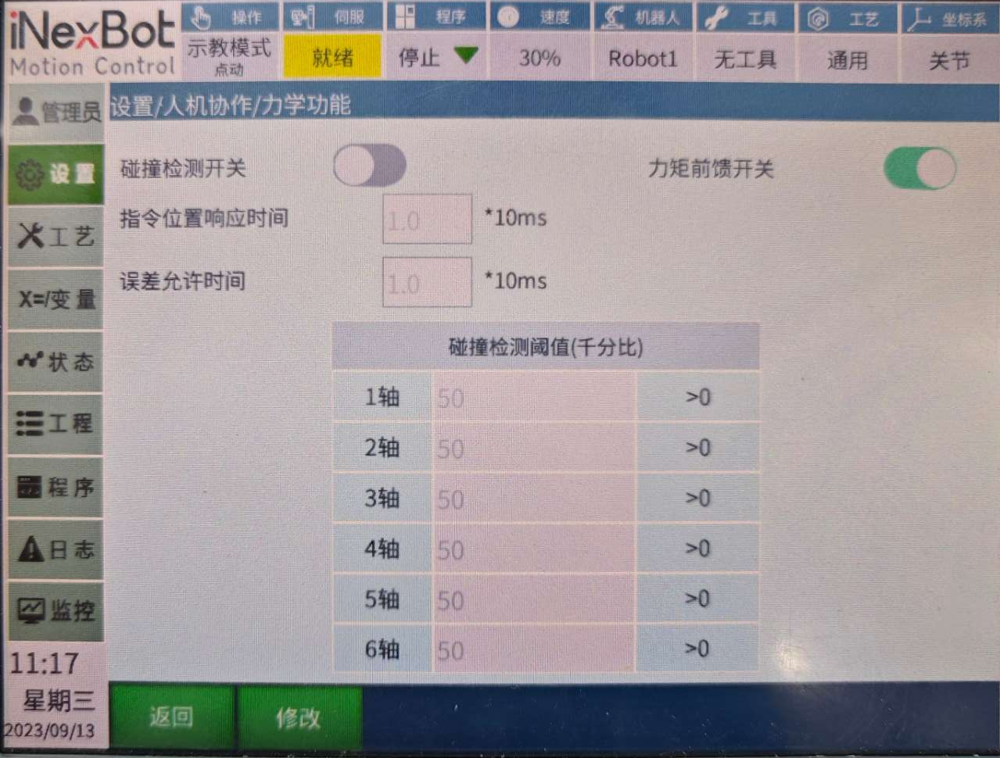
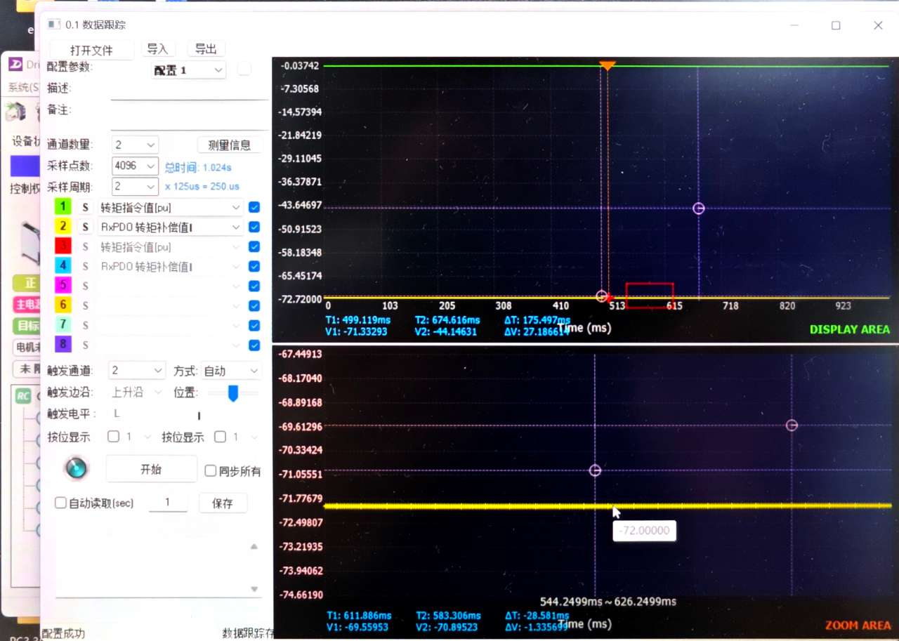
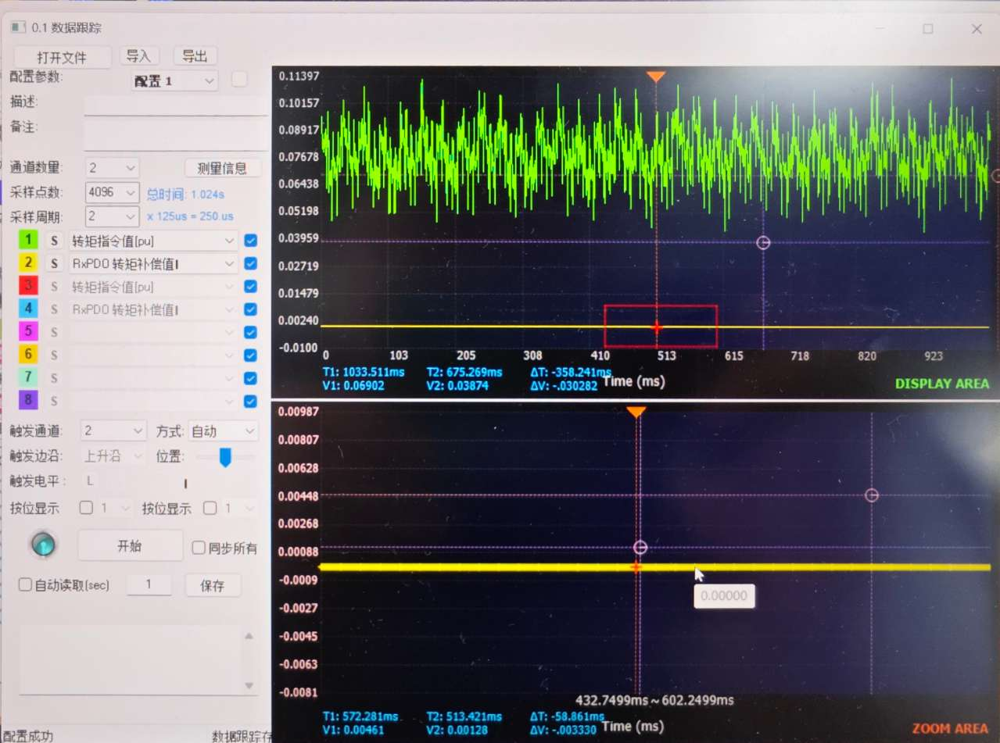

# 力矩前馈

## 1. 文档概述

### 1.1 文档目的
本文档旨在详细介绍机器人力矩前馈功能的原理、使用方法和验证步骤，帮助用户正确配置和使用力矩前馈功能，以提高机器人运动的稳定性和精度。

### 1.2 适用范围
适用于iNexBot系列机器人的力矩前馈功能配置和调试。

### 1.3 术语定义
- **力矩前馈**：在伺服运动前提前计算并告知伺服电机所需的力矩，以优化运动控制
- **动力学方程**：基于牛顿定律的数学模型，用于计算机器人各关节所需的力矩
- **雅可比矩阵**：用于将笛卡尔空间的力转换为关节空间力矩的数学工具
- **转矩补偿值**：力矩前馈功能提供的额外转矩值，用于补偿机器人运动时的动态负载

## 2. 功能介绍

人机协作中力矩前馈开关，打开即表示打开了力矩前馈功能。

## 3. 工作原理

### 3.1 力矩前馈是什么？

机器人的控制器传递给电机的力矩是经过一定的运算的，这个运算就是机器人的动力学方程。公式基于牛顿定律而得的，机器人的动力学方程输入时机器人的姿态，由姿态计算出所需要的力矩，再由雅可比矩阵转换到对应的电机中。

机器人的控制是基于力的控制，通过对反馈力的积分，得到当前的姿态信息和姿态修正量，最后把期待的力矩和修正姿态对应的位置和速度传给电机驱动器，通过不断的迭代，从而机器人完成指定动作。

**简单来说**即在伺服运动前提前告诉伺服运动时应该以多大的力矩进行运动，方便伺服进行运动调节，从而降低运动时机器人抖动的情况。

### 3.2 工作流程
1. 控制器根据机器人当前姿态和运动轨迹，通过动力学方程计算所需力矩
2. 将计算得到的力矩值作为前馈信号发送给伺服电机
3. 伺服电机根据前馈力矩和反馈力矩的组合进行运动控制
4. 通过持续的力矩前馈，减少机器人运动过程中的抖动和误差

## 4. 验证方法

### 4.1 伺服示波器验证
可以通过伺服调试软件查看伺服示波器中0x60B2的参数即转矩补偿值。

当开启力矩前馈时能够通过数据跟踪采集到转矩补偿值的数值。

下图1中较粗的黄色线有数值(-72)表示打开了力矩前馈开关：

反之当关闭力矩前馈后无法采集到转矩补偿值的数值：

### 4.2 实际效果验证
1. 观察机器人运动时的抖动情况
2. 比较开启和关闭力矩前馈时的运动平稳性
3. 检查重复定位精度的变化

## 5. 配置方法

### 5.1 开启力矩前馈
1. 进入机器人控制系统设置界面
2. 找到"人机协作"或"力学功能"选项
3. 开启"力矩前馈"开关
4. 保存配置并重启控制器

### 5.2 注意事项
- 力矩前馈功能需要机器人动力学参数准确，建议在使用前进行机器人辨识
- 对于不同的负载和运动轨迹，可能需要调整力矩前馈的参数
- 开启力矩前馈后，应观察机器人运动情况，确保没有异常

## 6. 常见问题

### 6.1 为什么开启力矩前馈后机器人运动仍然有抖动？
- 可能原因：动力学参数不准确
- 解决方法：重新进行机器人辨识，确保动力学参数正确

### 6.2 力矩前馈对机器人性能有什么影响？
- 优点：减少运动抖动，提高运动平稳性，提升重复定位精度
- 注意：可能会增加伺服电机的负载，需确保电机容量足够

### 6.3 力矩前馈适用于所有运动场景吗？
- 适用于高速、高精度的运动场景
- 对于简单的低速运动，力矩前馈的效果可能不明显

## 7. 相关资源

### 7.1 参考文档
- 《机器人动力学参数辨识指南》
- 《伺服系统调试手册》

### 7.2 相关技术文档
- [机器人控制系统用户手册](./机器人控制系统用户手册.md)
- [人机协作功能指南](./人机协作.md)