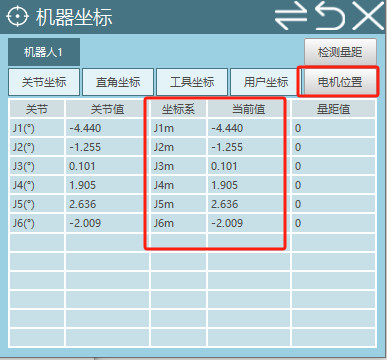
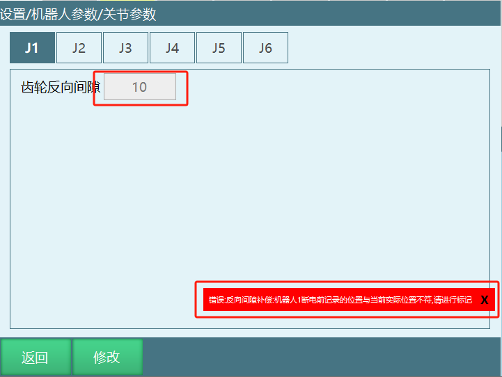
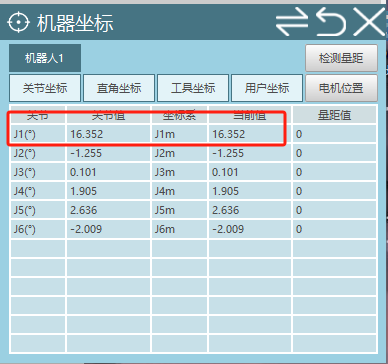

# 反向间隙

1：设置/操作参数界面，打开【显示电机坐标位置及标定按钮】

此时在监控/机器坐标界面可以看出多了一个电机位置坐标

在设置/机器人参数/零点位置界面多了一个【标记无间隙方向】按钮

2：以机器人的一轴为例

在设置/机器人参数/关节参数/其他参数界面中【齿轮反向间隙】设置一个值(例如填：10)

齿轮反向间隙有值的时候会出现一个报错，因为没有还没有进行标定；

3：此时到零点位置界面标记无间隙方向

标定方法如下：

a：动1轴+，因为齿轮反向间隙的值为10，所以电机位置在动1轴的过程中要大于10：

b：当大于10之后点击【标记无间隙方向按钮】，会有标记成功的消息提示

4：验证是否有效果

标记成功之后看监控机器人坐标和电机位置坐标的一轴坐标是否一样

上电点动机器人一轴，点动一轴正方向时机器人坐标和电机位置坐标一致

反方向点动一轴时，机器人坐标和电机位置坐标相差10，也就是齿轮反向间隙的值

## AI 检索专用问答对 (Q&A for Retrieval)

**Q: 什么是反向间隙？**

A: 反向间隙是指齿轮传动中的间隙，在机器人控制中需要通过标定来补偿，以提高运动精度。

**Q: 如何启用反向间隙功能？**

A: 在设置/操作参数界面，打开【显示电机坐标位置及标定按钮】，此时在监控/机器坐标界面会显示电机位置坐标，在零点位置界面会出现【标记无间隙方向】按钮。

**Q: 如何设置齿轮反向间隙值？**

A: 在设置/机器人参数/关节参数/其他参数界面中，为【齿轮反向间隙】设置一个值（例如10）。

**Q: 为什么设置反向间隙后会出现报错？**

A: 设置反向间隙值后会出现报错，因为还没有进行无间隙方向的标定。

**Q: 如何标定无间隙方向？**

A: 在零点位置界面，动对应轴的正方向，确保电机位置移动距离大于反向间隙值，然后点击【标记无间隙方向】按钮，会有标记成功的消息提示。

**Q: 如何验证反向间隙效果？**

A: 标记成功后，观察监控界面的机器人坐标和电机位置坐标是否一致。点动轴的正方向时，两个坐标应一致；点动反方向时，两个坐标应相差反向间隙的值。

**Q: 反向间隙的作用是什么？**

A: 反向间隙补偿可以提高机器人运动的精度，特别是在轴方向改变时，减少因齿轮间隙导致的定位误差。