# 变量手册

## 变量类型

| 变量类型 | 全局变量 | 局部变量 |
| :--- | :--- | :--- |
| 整型 | GINT | INT |
| 浮点型 | GDOUBLE | DOUBLE |
| 布尔型 | GBOOL | BOOL |
| 字符型 | GSTRING | STRING |

### 位置变量

| 变量类型 | 描述 |
| :--- | :--- |
| P | 记录机器人位置数据的局部点位变量 |
| GP | 记录机器人位置数据的全局点位变量 |
| E | 机器人在连接外部轴时，记录外部轴位置数据的局部点位变量；当设置双机模式时，记录两台机器人位置数据的局部点位变量。双机模式："两台类型均为六轴串联多关节机器人" |
| GE | 机器人在连接外部轴时，记录外部轴位置数据的全局点位变量；当设置双机模式时，记录两台机器人位置数据的全局点位变量 |

注意事项：新建或者修改的局部点位数据只保存于当前的作业文件，全局点位的数据会一直保存。不同的作业文件可以调用相同的全局位置变量，当其中一个文件修改了全局点位，另一个作业中被调用的相同全局变量的数据也会被修改。

## 引用变量

### 位置变量引用变量

使用介绍：给 [] 里面的局部整型或全局整型变量赋值为某一个值时，局部或全局点位为该值所表示的点位。

| 格式 | 示例 |
| :--- | :--- |
| P[INT/GINT] | P[I001]，当 I001=10 时，P[I001] 相当于 P0010 P[GI001]，当 GI001=20 时，P[GI001] 相当于 P0020 |
| GP[INT/GINT] | GP[I002]，当 I002=5 时，GP[I002] 相当于 GP0005 GP[GI002]，当 GI002=10 时，GP[GI002] 相当于 GP0010 |
| E[INT/GINT] | E[I003]，当 I003=8 时，E[I003] 相当于 E0008 E[GI003]，当 GI003=12 时，E[GI003] 相当于 E0012 |
| GE[INT/GINT] | GE[I004]，当 I004=15 时，GE[I004] 相当于 GE0015 GE[GI004]，当 GI004=25 时，GE[GI004] 相当于 GE0025 |

### 数值变量引用变量

使用介绍：给 [] 里面的局部整型或全局整型变量赋值为某一个值时，局部或全局变量为该值所表示的变量。

| 格式 | 示例 |
| :--- | :--- |
| I[INT/GINT] | I[I002]，当 I002=12 时，I[I002] 相当于 I012 I[GI002]，当 GI002=22 时，I[GI002] 相当于 I022 |
| GI[INT/GINT] | GI[I003]，当 I003=3 时，GI[I003] 相当于 GI003 GI[GI003]，当 GI003=5 时，GI[GI003] 相当于 GI005 |
| D[INT/GINT] | D[I004]，当 I004=5 时，D[I004] 相当于 D005 D[GI004]，当 GI004=7 时，D[GI004] 相当于 D007 |
| GD[INT/GINT] | GD[I005]，当 I005=8 时，GD[I005] 相当于 GD008 GD[GI005]，当 GI005=12 时，GD[GI005] 相当于 GD012 |
| B[INT/GINT] | B[I006]，当 I006=11 时，B[I006] 相当于 B011 B[GI006]，当 GI006=9 时，B[GI006] 相当于 B009 |
| GB[INT/GINT] | GB[I007]，当 I007=14 时，GB[I007] 相当于 GB014 GB[GI007]，当 GI007=15 时，GB[GI007] 相当于 GB015 |
| S[INT/GINT] | S[I008]，当 I008=23 时，S[I008] 相当于 S023 S[GI008]，当 GI008=17 时，S[GI008] 相当于 S017 |
| GS[INT/GINT] | GS[I009]，当 I009=45 时，GS[I009] 相当于 GS045 GS[GI009]，当 GI009=21 时，GS[GI009] 相当于 GS021 |

### IO 端口引用变量

| 格式 | 示例 |
| :--- | :--- |
| AIN | 根据当前所连接的 IO 板直接选择端口 |
| DIN | 根据当前所连接的 IO 板直接选择端口 |
| DOUT | 根据当前所连接的 IO 板直接选择端口 |
| AIN[INT/GINT] | AIN[I001]，当 I001=1 时，AIN[I001] 相当于 AIN1-1 端口 AIN[GI001]，当 GI001=2 时，AIN[GI001] 相当于 AIN1-2 端口 |
| DIN[INT/GINT] | DIN[I010]，当 I010=5 时，DIN[I010] 相当于 DIN1-5 端口 DIN[GI010]，当 GI010=6 时，DIN[GI010] 相当于 DIN1-6 端口 |
| DOUT[INT/GINT] | DOUT[I015]，当 I015=10 时，DOUT[I015] 相当于 DOUT1-10 端口 DOUT[GI016]，当 GI016=11 时，DOUT[GI016] 相当于 DOUT1-11 端口 |

注意事项：IO 端口引用变量时定义的变量值不能超过当前所连接 IO 板的端口数。

## 数值变量

### 全局数值变量

数值变量分为全局数值变量和局部数值变量。

| 变量类型 | 变量数量 | 变量示例 |
| :--- | :--- | :--- |
| 全局整数型 | 999 | GI001...GI999 |
| 全局浮点型 | 999 | GD001...GD999 |
| 全局布尔型 | 999 | GB001...GB999 |
| 全局字符型 | 999 | GS001...GS999 |

点击变量 - 全局数值，进入全局数值变量界面。

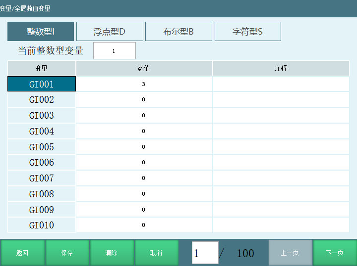

【修改】选中需要修改的变量名，点击"修改"然后给变量赋值、给变量添加注释。

【清除】清除变量里面存的值，点击清除后，变量值变为 0，清除按钮只会清除当前界面的值。

【取消】对选中的变量不进行任何操作。

【保存】保存修改后的变量值。

【返回】返回到变量界面。

#### 如何给全局数值变量赋值？

**手动赋值**

1. 在全局数值变量选中需要修改的变量，点击"修改"然后输入数值。
2. 点击"保存"变量赋值成功。

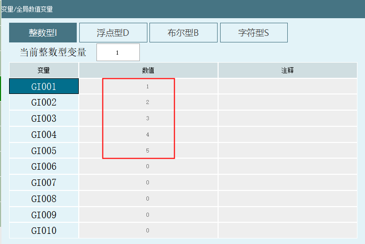

**指令赋值**

1. 新建工程，打开工程文件。
2. 插入指令，指令类型选择变量类，选择赋值指令。
3. 点击【确定】进入指令参数设置界面，选择变量类型和填入变量值。
4. 点击【确定】赋值指令插入成功，如果需要给多个不同的变量赋值，重复前面的步骤即可。
5. 指令执行完后，可以在监控 - 数值变量界面或者全局数值变量界面查看变量值。

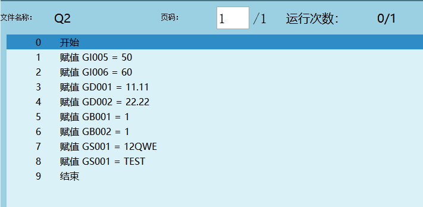

#### 全局数值变量类型

**全局整数型**

| 项目 | 说明 |
| :--- | :--- |
| 格式 | GINT |
| 范围 | 【1，999】 |
| 变量 | 变量的编号 |
| 数值 | 变量的值，整数型变量的范围为整数 |
| 注释 | 用户可以给变量添加注释，方便用户标记该变量的作用 |

**全局浮点型**

| 项目 | 说明 |
| :--- | :--- |
| 格式 | GDOUBLE |
| 范围 | 【1，999】 |
| 变量 | 变量的编号 |
| 数值 | 变量的值，浮点型变量的范围为实数 |
| 注释 | 用户可以给变量添加注释，方便用户标记该变量的作用 |

**全局布尔型**

| 项目 | 说明 |
| :--- | :--- |
| 格式 | GBOOL |
| 范围 | 【1，999】 |
| 变量 | 变量的编号 |
| 数值 | 该变量的值，布尔型变量的范围为 0/1 |
| 注释 | 用户可以给变量添加注释，方便用户标记该变量的作用 |

**全局字符型**

| 项目 | 说明 |
| :--- | :--- |
| 格式 | GSTRING |
| 范围 | 【1，999】 |
| 变量 | 变量的编号 |
| 数值 | 全局字符型可以保存数字、符号、字母（包含大小写）、汉字 |
| 注释 | 用户可以给变量添加注释，方便用户标记该变量的作用 |

### 局部数值变量

| 变量类型 | 数值类型 | 变量数量 | 变量示例 |
| :--- | :--- | :--- | :--- |
| 局部整数型 | INT | 999 | I001...I999 |
| 局部浮点型 | DOUBLE | 999 | D001...D999 |
| 局部布尔型 | BOOL | 999 | B001...B999 |
| 局部字符型 | STRING | 999 | S001...S999 |

说明：

1. 局部数值变量赋值的值只作用于当前程序。
   例如：新建程序 A 和程序 B，程序 A 里面赋值 I001=10，然后打开程序 B，在变量界面查看 I001 的值，变量界面显示 I001=0。
2. 定义的所有局部数值变量一般只能用于当前程序，其他程序、后台程序都无法使用。

> 注：若使用指令调用后台子程序时，声明局部数值变量参数即可在主程序中使用。

定义局部变量需要在打开的程序界面点击【变量】，进入局部变量参数设置界面。

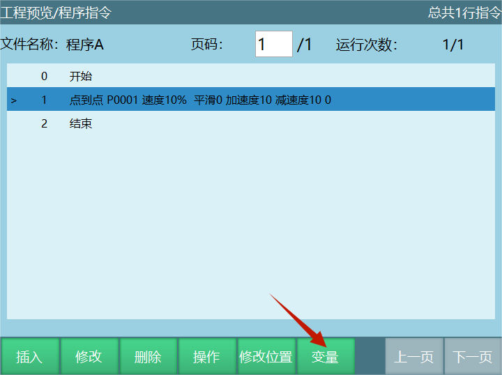

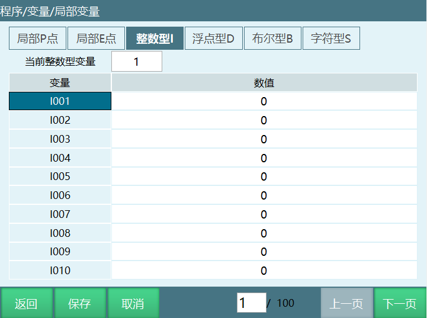

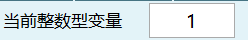

【修改】修改选中编号的变量值。

【保存】给目标变量修改值后，点击保存，变量值修改成功。

【取消】对选中变量不进行任何操作。

【返回】点击返回按钮，返回到程序界面。

填入数值，点击小键盘上的确定，可以直接定位到对应变量，例如填写 9，会直接定位到 I009。

#### 如何给局部数值变量赋值

**手动赋值**

1. 在程序 - 变量 - 局部变量界面，点击【修改】给需要赋值的变量输入数值。
2. 点击【保存】，变量修改成功。

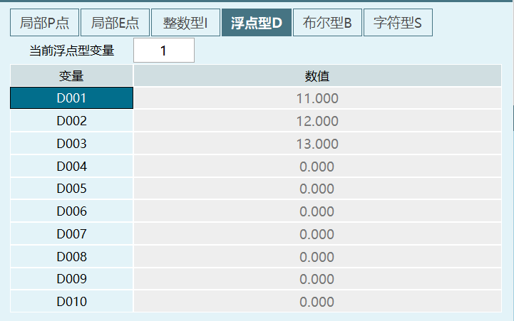

注意事项：通过手动给变量赋的值我们认为是这个变量的初始数值，通过指令给变量赋的值不会修改初始数值，局部变量界面变量值的显示是一直不变的，除非用户再次手动修改了初始值。

例如：我们通过指令给 D001 赋值为 22.22，指令运行结束后在此界面查看 D001=11.11。

**指令赋值**

1. 新建工程，打开工程文件。
2. 插入指令，指令类型选择变量类，选择赋值指令。
3. 点击【确定】进入指令参数设置界面，选择变量类型和填入变量值。
4. 点击【确定】赋值指令插入成功，如果需要给多个不同的变量赋值，重复前面的步骤即可。
5. 在指令执行时，可以在监控 - 数值变量界面监控变量数值的变化。

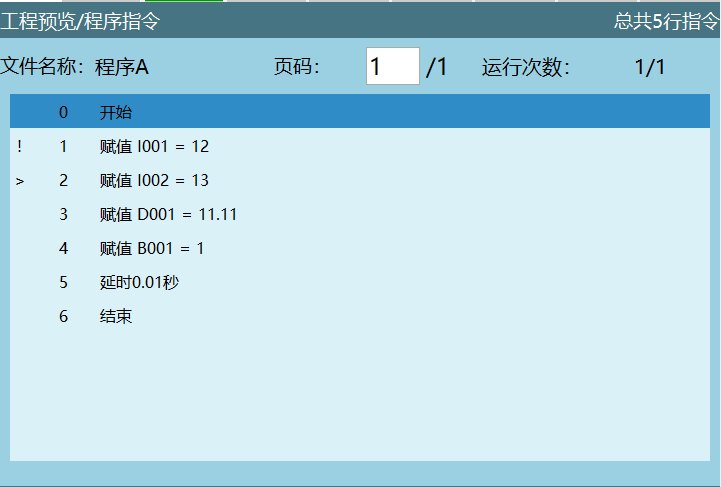

### 数值变量的使用

数值变量应用在不同的工艺、功能和指令等。

1. **工艺使用**：码垛工艺里面通过变量来记录码垛的层数、码垛的数目和当前层码垛数目。

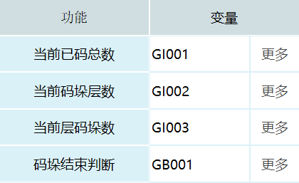

2. **Modbus 主站功能**：通讯成功后，插入 Modbus 类指令，给变量赋值，执行 Modbus 写指令会把赋值得变量值写入进去。

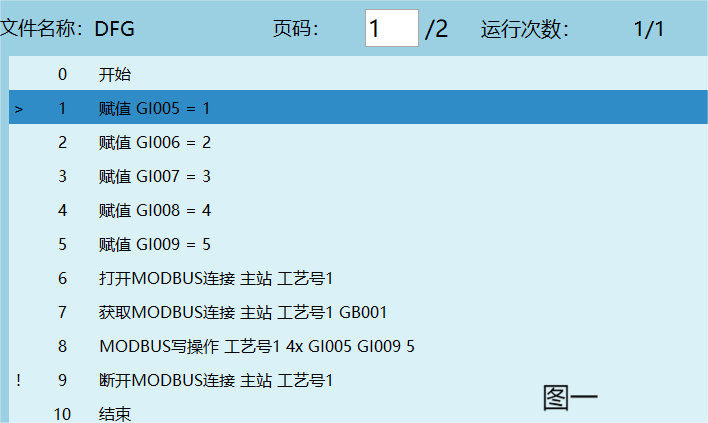

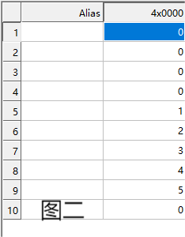

3. **指令使用**：
   - 计时指令通过绑定变量计时。
   - 条件判断指令通过变量作为判断的条件。
   - 位置变量类指令点位的加、减、改可以通过给变量赋值的形式对点位进行修改，运动控制类、程序控制类等指令类型都会用到绑定变量功能。

### 数值变量的应用示例

**条件类指令应用**

例如：插入 IF 指令，判断条件是当 I001<=5 时执行 IF 语句里面的指令，当 I001>5 时，退出 IF 语句执行 ENDIF 后面的指令。

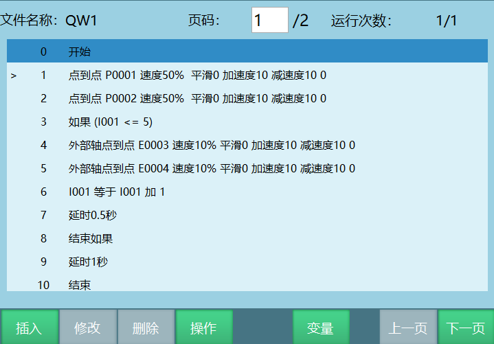

**计时指令应用**

程序在运行的时候，可以通过计时指令把程序运行的时间存入到变量。

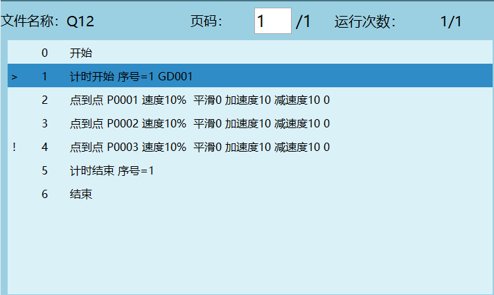

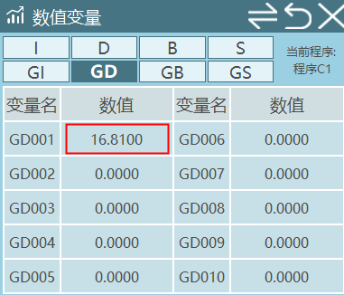

## 位置变量

### 全局位置变量

| 类型 | 数量 | 示例 |
| :--- | :--- | :--- |
| GP：记录机器人位置数据的变量 | 9999 | GP0001...GP9999 |
| GE：双机模式时记录两台机器人位置数据的变量 | 9999 | GE0001...GE9999 |
| 带外部轴时记录外部轴点位的位置变量 | 9999 | GE0001...GE9999 |

点击变量 - 全局位置，进入全局位置界面。

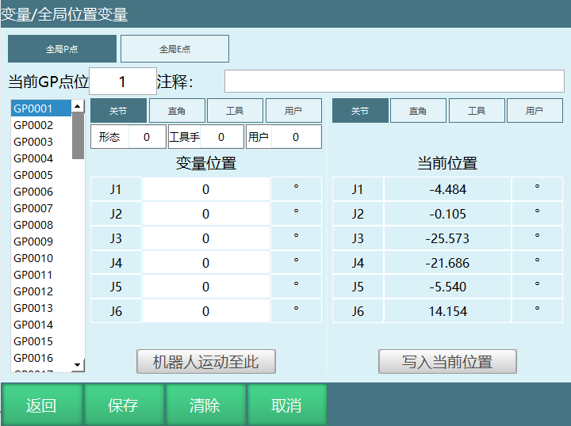

1. 【修改】手动修改目标变量的点位，点击修改，填入参数后点击小键盘上的确定。
2. 【保存】修改完点位后，点击保存，点位修改成功。
3. 【清除】清除目标变量的点位信息，点击保存后点位数据清除成功。
4. 【取消】取消对目标变量的修改和清除操作。
5. 【返回】返回到变量界面。
6. 当前 GP 点位 / 当前 GE 点位：填写数值后点击小键盘上的确定，会直接定位到对应的变量，如果输入 100，会直接定位到 GP0100。
7. 注释：变量添加注释说明，方便用户知道每个位置变量所代表的意思。
8. 变量位置：可以将机器人不同位置的点位信息存入到选择的变量，当带有外部轴时，也会记录外部轴的位置信息。此参数可以手动修改。
9. 当前位置：机器人当前的位置信息，当带有外部轴时，也会记录外部轴当前的位置信息。此参数不能修改。
10. 机器人运动至此：在示教模式下上使能，然后点击运动至此，机器人运动到目标点位。
11. 写入当前位置：点击修改，再点击写入当前位置，会把机器人当前的点位信息写入到选择的变量。如果要将机器人当前关节坐标下的点位写入到变量，需要选中关节，然后再点击写入当前位置；如果要将机器人当前直角坐标下的点位写入到变量，需要选中直角，然后再点击写入当前位置，点击保存，写入位置成功。

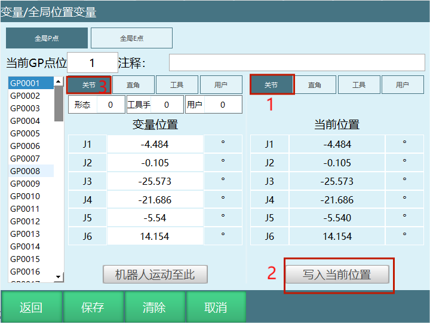

#### 全局位置变量修改

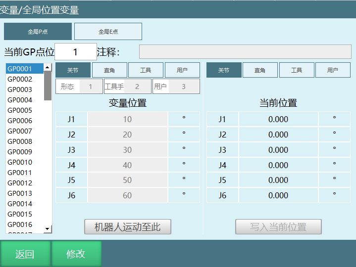

**手动修改**

- 点击【修改】，选中需要修改的变量，然后在变量位置给每一个轴赋值，如果需要修改形态、工具手、用户这些参数信息时，在对应的输入框填入合理的参数值。
- 点击【保存】变量位置信息修改成功。

**写入机器人当前位置修改**

- 示教模式下点动机器人，让机器人运动到目标位置后，点击【修改】。
- 点击写入当前位置。
- 点击【保存】目标变量修改成功。

**目标点位说明**

**参数界面修改全局GP点**

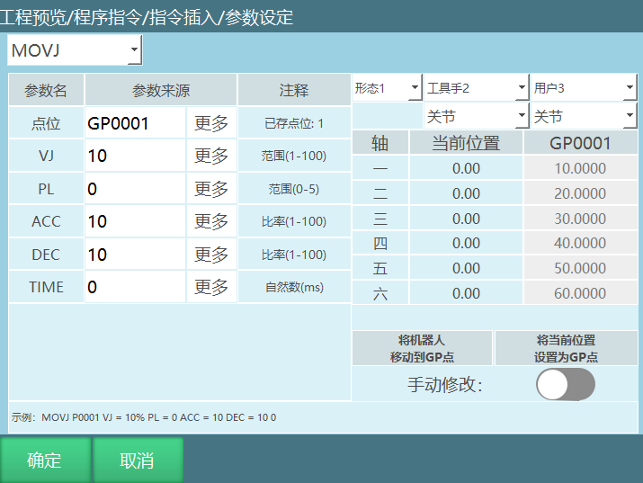

1. 当前位置修改为目标点位：
   - 插入运动类指令点位选择 GP 变量。
   - 移动机器人到目标变量位置后，点击【将当前位置设置为 GP 点】会将机器人当前坐标下的位置写入变量。
   - 提示框弹出"是否继续修改点位"，点击【确定】将当前位置存入目标变量，点击【取消】不会记录机器人当前点位到目标变量，可以继续移动机器人到想要的点位。参数界面"当前位置"在移动机器人时坐标是一直变化的。

2. 手动位置设置目标点位（必须打开手动修改按钮，这样目标点位才会修改成功）：
   - 插入一条运动类指令，点位类型选择全局 GP 点。
   - 在参数设定界面，点击【将手动位置设为 GP 点】，修改目标变量坐标轴的点位，填入需要的坐标值，提示框弹出"是否继续修改点位"，点击【确定】将修改后的点位位置存入目标变量。点击【取消】可以继续修改目标轴的点位。

注意事项：

1. 全局位置变量在不同的作业文件里面是可以直接被调用的。
2. 全局位置变量界面修改的 GP 点点位信息和参数设定界面修改的全局 GP 点点位信息是同步的。
3. 如果程序 A 里面插入了 GP0001 和 GP0002，程序 B 里面也插入了 GP0001 和 GP0002，那么这两个程序里面 GP0001 和 GP0002 的点位是相同的。如果修改了程序 A 里面的两个点位，程序 B 里面的点位也会被修改，会造成程序 B 在运行的时候出现问题。
4. 不同作业文件建议不要调用相同的全局 GP 点，否则其中一个作业文件如果修改了全局点位信息，其他作业文件中被调用的相同的全局 GP 点也会被修改，会造成其他作业文件在运行的时候出现问题。

### 局部位置变量

| 类型 | 数量 | 示例 |
| :--- | :--- | :--- |
| P：记录机器人位置数据的变量 | 9999 | P0001...P9999 |
| E：双机模式时记录两台机器人位置数据的变量 | 9999 | E0001...E9999 |
| 带外部轴时记录外部轴点位的位置变量 | 9999 | E0001...E9999 |

点击【工程】- 选择【程序】- 在程序界面点击【变量】，进入局部位置变量界面。

说明：局部位置变量 P 仅能用于单独的一个作业文件，不能在所有的作业文件之间调用。

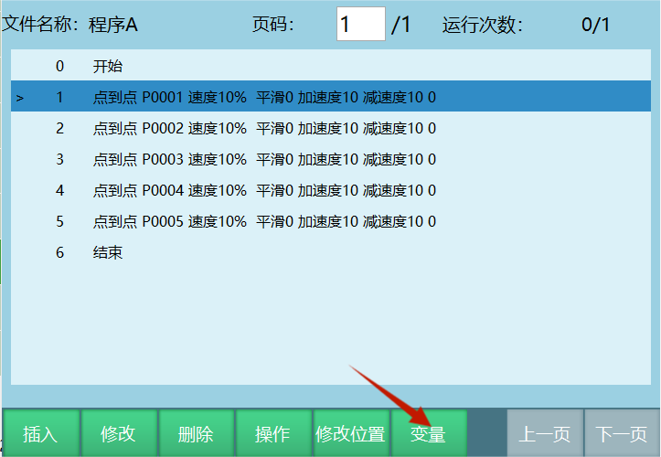

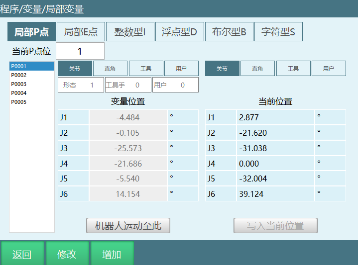

图例中按钮说明：

1. 【修改】手动修改目标变量的点位，点击修改，填入参数后点击小键盘上的确定。
2. 【返回】返回到程序指令界面。
3. 【保存】修改完点位后点击保存，点位修改成功。
4. 【增加】选中局部 P 点，点击增加会新建一个新的 P 点；选中局部 E 点，点击增加会新建一个新的 E 点。例如：现在局部 P 点的点位个数是在 P0006，点击增加，点位个数会变到 P0007。
5. 【取消】原有变量的点位信息不进行任何修改。
6. 当前 P 点位 / 当前 E 点位：填写数值后点击小键盘上的确定，会直接定位到对应的变量，例如输入 5，会直接定位到 P0005。
7. 变量位置：可以将机器人不同位置的点位信息存入到选择的变量，当带有外部轴时，也会记录外部轴的位置信息。此参数可以手动修改。
8. 当前位置：机器人当前的位置信息，当带有外部轴时，也会记录外部轴当前的位置信息。此参数不能修改。
9. 机器人运动至此：在示教模式下上使能，然后点击运动至此，机器人运动到目标点位。
10. 写入当前位置：点击修改，再点击写入当前位置，会把机器人当前的点位信息写入到选择的变量。如果要将机器人当前关节坐标下的点位写入到变量，需要选中关节，然后再点击写入当前位置；如果要将机器人当前直角坐标下的点位写入到变量，需要选中直角，然后再点击写入当前位置，点击保存，写入位置成功。

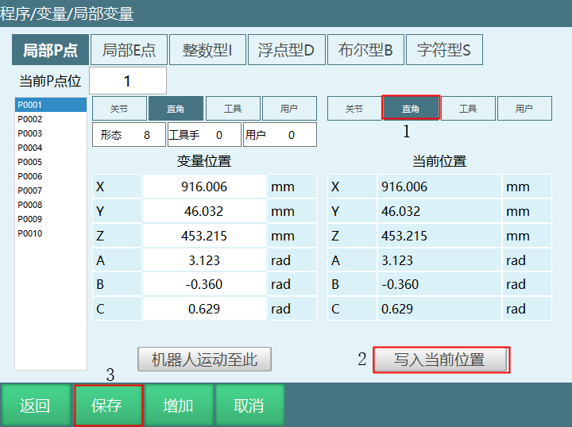

#### 局部位置变量修改

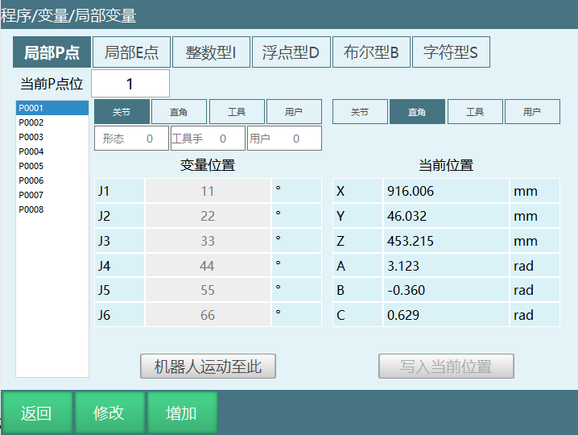

**手动修改**

- 点击【修改】，选中需要修改的变量，然后在变量位置给每一个坐标轴赋值；如果需要修改形态、工具手、用户这些参数信息时，在对应的输入框填入合理的参数值。
- 点击【保存】变量位置信息修改成功。

## 指令局部变量

### 对局部指令进行加、减、改操作

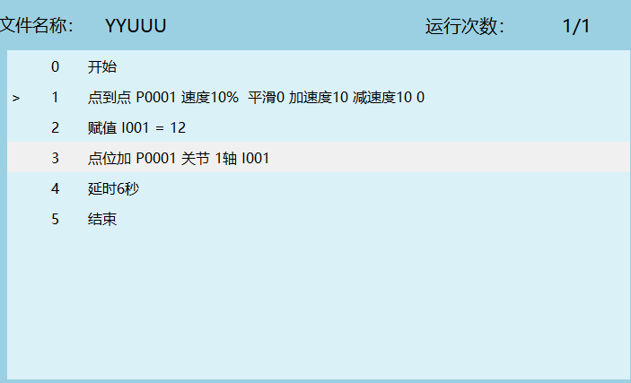

程序说明：

1.  假设 P0001关节坐标（3.6847 ，0 ，0 ，0 ，0 ，0）

2.  程序运行到第三行时P001在监控-位置变量-关节坐标显示为（35.6847 ，0，0， 0， 0， 0）

3.  程序运行结束后上使能P001关节坐标（3.6847， 0， 0 ，0 ，0， 0）

说明：程序说明第1条的P001的点位我们可以认为是目标点位的初始点位，通过加减对目标点位进行修改的值可以理解为附加值。例如：对P001关节J1Z轴加的32为附加值

程序运行结束后，P0001点位坐标为初点位的坐标。

如图所示，现在有3条指令，未设置局部变量，当程序开始运行。

开始走第一条指令：点击监控-位置变量，位置变量显示P001点位的坐标值。

P0001初始点位

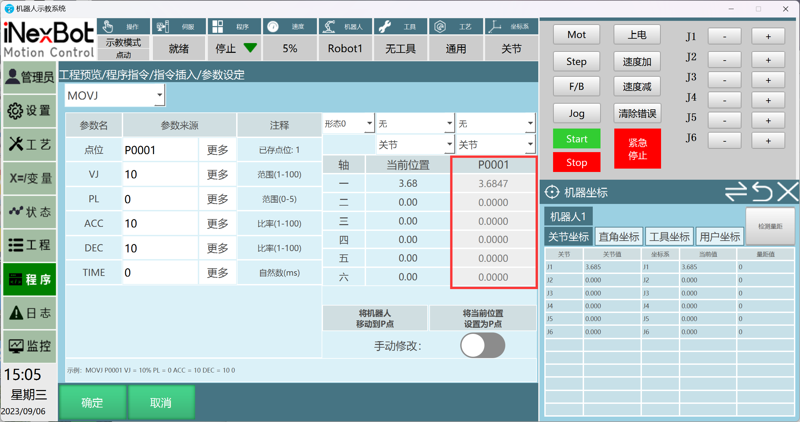

P001:初始点位+附加值点位坐标显示

程序运行结束后P001点位坐标显示

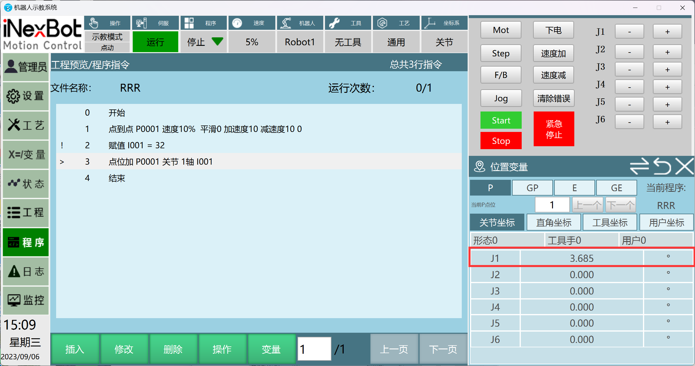

注意：全局点位（GP）如果和上图插入一样的指令，对目标点位进行加、减、改操作，目标点位会变为加、减、改之后的点位。

**写入机器人当前位置修改**

- 示教模式下点动机器人，让机器人运动到目标位置后，点击【修改】。
- 点击写入当前位置。
- 点击【保存】目标变量修改成功。

**参数界面修改局部 P 点**

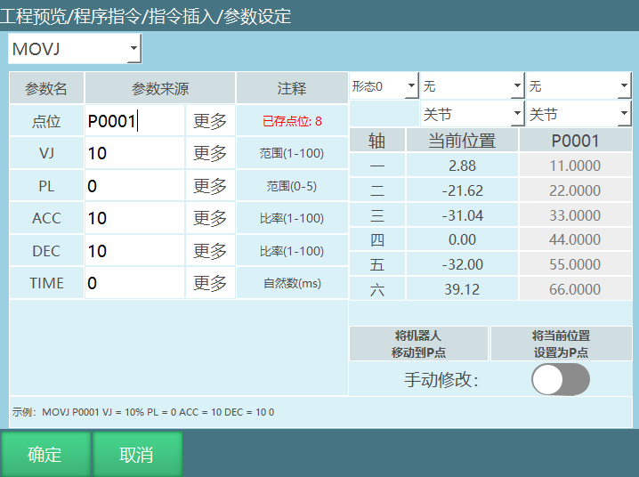

1. 当前位置修改为目标点位：
   - 插入指令后选择目标变量。
   - 在参数设定界面，移动机器人到目标变量位置后，点击【将当前位置设置为 P 点】会将机器人当前坐标下的位置写入变量。
   - 提示框弹出"是否继续修改点位"，点击【确定】将当前位置存入目标变量，点击【取消】不会记录机器人当前点位到目标变量，可以继续移动机器人到想要的点位。

2. 手动位置设置目标点位（必须打开手动修改按钮）：
   - 插入一条运动类指令，点位类型选择 P 点。
   - 在参数设定界面，点击【将手动位置设为 P 点】，修改目标变量坐标轴的点位，填入需要的坐标值，提示框弹出"是否继续修改点位"，点击【确定】将修改后的点位位置存入目标变量。点击【取消】可以继续修改目标轴的点位。

注意事项：

1. 局部位置变量界面的点位信息和参数设定界面的点位信息是同步的。
2. 插入运动类指令后点位如果选择新建的话会新建一个 P 点（点位直接选择新建的话是无法修改点位信息的，必须在参数设定界面点击【确定】然后在程序指令界面点击【修改】就可以修改点位信息了）。如果直接选择 P 的话，要在已存在点位数量的区间内选择需要修改位置的 P 点。
3. 定义的局部变量只对当前的作业文件生效。
   例如：程序 A 和程序 B 里面都定义了 P0001，如果修改了程序 A 里面 P0001 的点位，程序 B 里面 P0001 的点位是不会被修改的。

### 点位形态、工具手、用户值修改方式

设置 - 操作参数界面增加点位形态、工具手、用户值设置方式，有自动和手动两种方式，默认为自动。

#### 自动

新建点位时形态、工具手、用户坐标默认取当前值。

修改工具手需要将当前位置选为工具，点击【将当前位置设置为 P 点】，工具手修改成功。

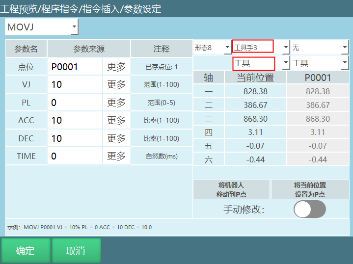

修改用户坐标：将当前位置选为用户，点击【将当前位置设置为 P 点】用户坐标修改成功。

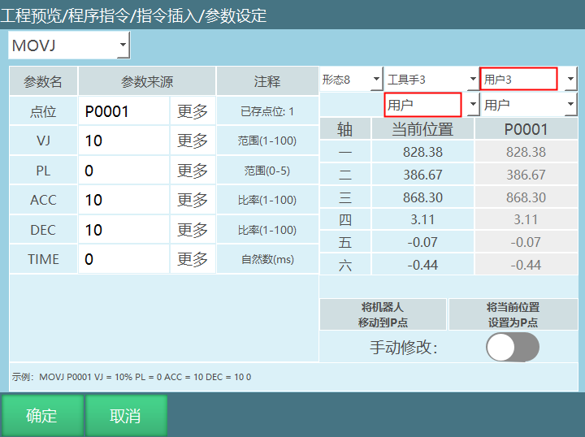

形态值：无法修改，自动获取。

#### 手动

手动设置形态、工具手、用户坐标。

1. 新建点位：可以直接修改形态、工具手、用户坐标。
   修改工具手：选中需要修改的工具手，点击【将当前位置设置为 P 点】，点击提示框界面的【确定】工具手修改成功。
   修改用户坐标和形态的方法和修改工具手一样。
   点击【将当前位置设置为 P/GP 时】不改变当前点位已有形态、工具手、用户值。

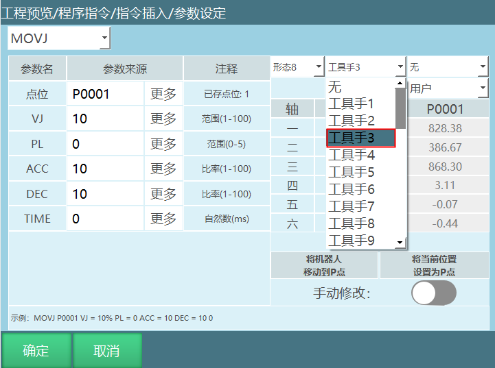

2. 指令 - 位置变量类 - 设置点位信息，可以改坐标系、形态等。

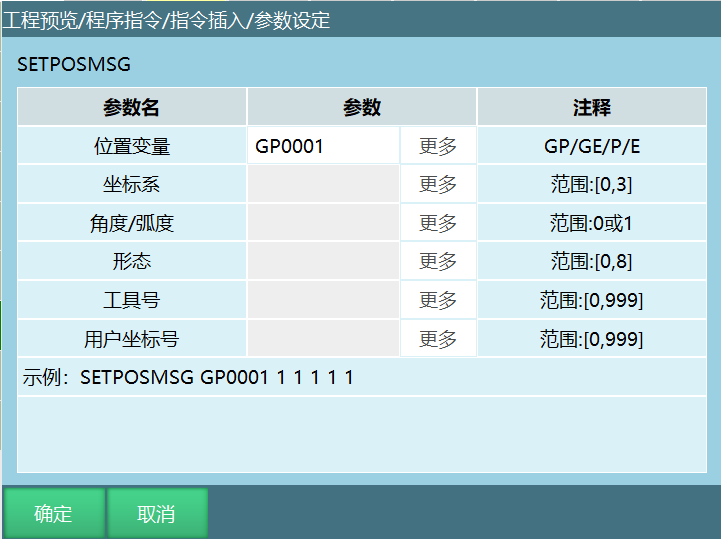

   - 位置变量：选择想要修改的点位 GP/GE/P/E，只能选择已有的点位。
   - 坐标系：范围【0，3】；0：关节坐标系；1：直角坐标系；2：工具坐标系；3：用户坐标系。
   - 角度/弧度：可选值 0/1。
   - 形态：范围【0，8】。
   - 工具号：工具手号【0，999】。
   - 用户坐标号：用户坐标系【0，999】。
   点击确定，运行程序即可修改。

### 位置变量点位信息

#### 点位坐标系

范围【0，3】：0 为关节坐标，1 为直角坐标，2 为工具坐标，3 为用户坐标。

如何修改位置变量的坐标系？

1. 全局 GP 点可以点击变量 - 全局位置，进入全局位置变量界面点击修改，选择坐标系，点击保存，坐标系修改成功。
2. 局部 P 点可以在程序指令界面点击变量，进入局部位置变量界面点击修改，选择坐标系，点击保存，坐标系修改成功。
3. 程序指令界面选中需要修改的全局 GP 点、局部 P 点，点击修改，进入参数设定界面，打开手动修改按钮选择坐标系后点击确定，坐标修改成功。

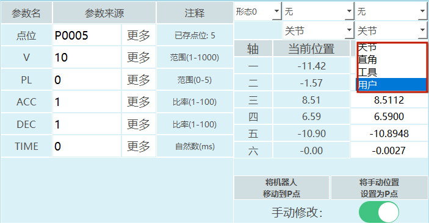

#### 形态

范围：【0，8】。

1. 机型为 6 轴串联多关节机器人有形态参数，如形态参数选择当前，则控制系统自动通过转换方式计算出机器人当前的形态值。形态值是通过机器人 1、3、5 轴的关节点位来计算的，如果范围在 [-90, +90] 之间则为 1，否则为 0。
2. 形态值为机器人 1 轴、3 轴、5 轴位置的二进制转换为十进制然后再加 1。
   例如：某个六轴机器人 1 轴为 59 度、2 轴为 69 度、3 轴为 79 度、4 轴为 89 度、5 轴为 99 度、6 轴为 109 度。
   结果：二进制数 110 = 十进制 6，形态值为 6+1=7。

| 轴 | 1轴 | 3轴 | 5轴 |
| :--- | :--- | :--- | :--- |
| 二进制数值 | 1 | 1 | 0 |

3. 机型为四轴 SCARA 机器人时有左右手参数。

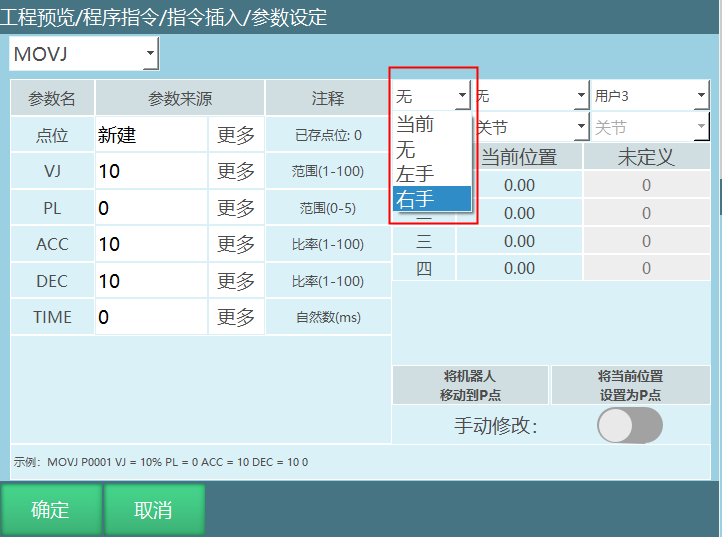

如何修改位置变量形态？

1. 全局 GP 点：点击变量 - 全局位置，进入全局位置变量界面点击修改，在形态栏输入形态值，点击保存。
2. 局部 P 点：在程序指令界面点击变量，进入局部位置变量界面点击修改，在形态栏输入形态值，点击保存。
3. 程序指令界面：选中需要修改的全局 GP 点、局部 P 点，点击修改，进入参数设定界面，打开手动修改按钮选择形态后点击确定。左右手参数的修改方法相同。

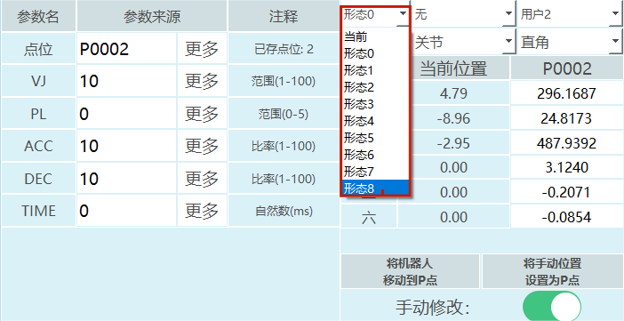

#### 工具手

范围【0，999】。

如何修改位置变量的工具号？

1. 全局 GP 点：点击变量 - 全局位置，进入全局位置变量界面点击修改，在工具手栏输入工具手号，点击保存，工具手参数修改成功。
2. 局部 P 点：在程序指令界面点击变量，进入局部位置变量界面点击修改，在工具手栏输入工具手号，点击保存，工具手修改成功。
3. 程序指令界面：选中需要修改的全局 GP 点、局部 P 点，点击修改，进入参数设定界面，打开手动修改按钮选择工具手，点击确定，工具手修改成功。

注意事项：当目标点位的坐标为直角、工具或者用户坐标时，如果想要将目标点位绑定工具手，则选择对应的工具手，不绑定选择无。若运动时实际工具手和点位绑定工具手不同，则程序运行时出错。

例如：目标点位绑定工具手 2，实际使用工具手 1，运行指令时控制器报错（机器人 1 工具坐标使用错误，点位工具为 1，实际使用工具 2）。

#### 用户坐标

范围【0，999】。

如何修改目标点位的用户坐标号？

1. 全局 GP 点：点击变量 - 全局位置，进入全局位置变量界面点击修改，在用户栏输入用户坐标号，点击保存，用户坐标号修改成功。
2. 局部 P 点：在程序指令界面点击变量，进入局部位置变量界面点击修改，用户栏输入用户坐标号，点击保存，用户坐标号修改成功。
3. 程序指令界面：选中需要修改的全局 GP 点、局部 P 点，点击修改，进入参数设定界面，打开手动修改按钮选择用户后点击确定，用户坐标号修改成功。

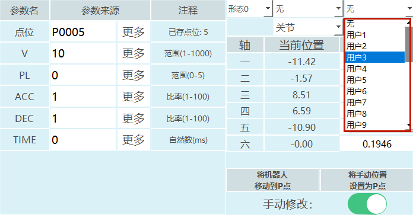

注意事项：当目标点位的坐标为用户坐标时，如果想要将目标点位绑定用户坐标，则选择对应的用户编号，不绑定选择无。若运动时实际用户和点位绑定用户不同，则程序运行时出错。

例如：目标点位绑定用户 1，实际使用用户 2，运行指令时控制器报错（机器人用户坐标使用错误，点位用户为 1，实际用户 2）。

#### 角度/弧度

机器人在直角坐标、工具坐标、用户坐标下有姿态轴 A、B、C，姿态轴的姿态值是可以手动修改的。

如何修改角度/弧度？

点击设置 - 操作参数，进入操作参数界面，点击修改，在姿态值列设置角度制和弧度制。

例如：修改姿态值为角度值后，在直角坐标、工具坐标、用户坐标下 A、B、C 轴的单位变为角度制（°）；修改为弧度值后，A、B、C 轴的单位变为弧度（rad）。

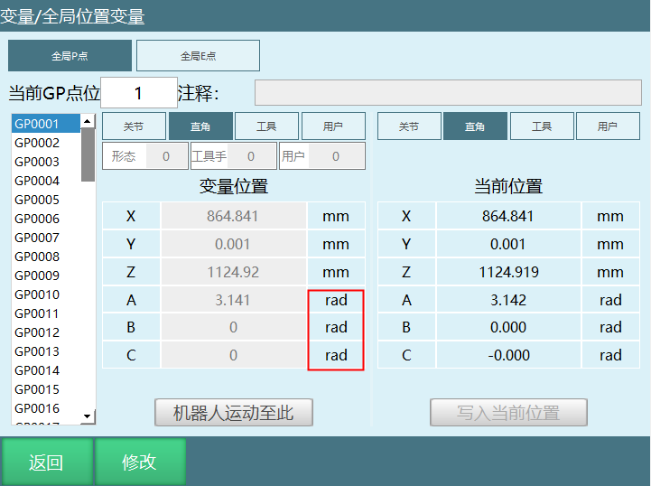

### 局部 P 点点位信息说明

例如：P0002 = 1,1,0,0,0,0,0,815,0,1297,3.1416,0,0,0。

点位数据分解如下：

| P0002 | 点位参数 | 参数说明 |
| :--- | :--- | :--- |
| 1 | 坐标系 | 0：关节 1：直角 2：工具 3：用户 |
| 1 | 角度/弧度 | 0：角度（关节点）1：弧度（直角点、工具点、用户点） |
| 0 | 形态/左右手 | 六轴时为形态参数，四轴 SCARA 时为左右手参数 |
| 0 | 工具 | 工具手编号 |
| 0 | 用户 | 用户坐标编号 |
| 0 | 预留 | 预留 |
| 0 | 预留 | 预留 |
| 815 | 1轴 | 点位 1 轴坐标 |
| 0 | 2轴 | 点位 2 轴坐标 |
| 1297 | 3轴 | 点位 3 轴坐标 |
| 3.1416 | 4轴 | 点位 4 轴坐标 |
| 0 | 5轴 | 点位 5 轴坐标 |
| 0 | 6轴 | 点位 6 轴坐标 |
| 0 | 7轴 | 点位 7 轴坐标 |

### 局部 E 点点位信息说明

例如：E0001 点位数据分解如下：

| E0001 | 点位参数 | 参数说明 |
| :--- | :--- | :--- |
| 0 | 坐标系 | 0：关节 1：直角 2：工具 3：用户 |
| 0 | 角度/弧度 | 0：角度（关节点）1：弧度（直角点、工具点、用户点） |
| 8 | 形态/左右手 | 六轴时为形态参数，四轴 SCARA 时为左右手参数 |
| 0 | 工具 | 工具手编号 |
| 0 | 用户 | 用户坐标编号 |
| 0 | 预留 | 预留 |
| 0 | 预留 | 预留 |
| -2.3060 | 1轴 | 点位 1 轴坐标 |
| 3.0150 | 2轴 | 点位 2 轴坐标 |
| 6.4860 | 3轴 | 点位 3 轴坐标 |
| 4.0130 | 4轴 | 点位 4 轴坐标 |
| -4.4430 | 5轴 | 点位 5 轴坐标 |
| -13.0030 | 6轴 | 点位 6 轴坐标 |
| 0 | 7轴 | 点位 7 轴坐标 |
| 12.0 | O1 | 点位 O1 轴坐标 |
| 58.0 | O2 | 点位 O2 轴坐标 |
| 0 | O3 | 点位 O3 轴坐标 |
| 0 | O4 | 点位 O4 轴坐标 |
| 0 | O5 | 点位 O5 轴坐标 |

---

## 变量类指令

"√"表示支持此条指令。

| 指令类型 | 前台 | 全局后台 | 局部后台
| :--- | :---| :---| :---|
| 赋值 | √ | √ | √ |
| 写入文件 | √ | √ | √ |

### SET-赋值

格式：SET【变量名】I001【选择的目标变量】3【赋值的数值】。
  
功能：给定义的整型、浮点型、布尔型和字符串变量赋值。
  
参数：引用变量的详细介绍可以在引用变量章节查看。
  
| 参数 | 参数说明 |
| :--- | :--- |
| 变量 | 点击更多可以选择需要的变量类型(整型，浮点型，布尔型和字符串型) |
| 变量值 | 给上面的变量赋值，可以手填或者选择变量表示 |
  
示例：
  
1.  NOP
  
2.  SET I001=12
  
3.  SET D001=12.21
  
4.  SET GI012=100
  
5.  SET GI\[GI012\]=999
  
6.  END
  
示例说明：程序第1、2行是直接给选择的变量赋值，第4、5行是通过变量形式赋值,程序运行结束后I001=12,D001=12.21,GI100=999。
  
如果SET字符串类型时，字符串中有转义字符，如果想避免转义字符对字符串的影响，可在转义字符之前加\"\\\";字符串类中也有类似问题。
  
 示例：
  
 SET GS001=11\\n：此处输出"\\n"被作为转义字符
  
 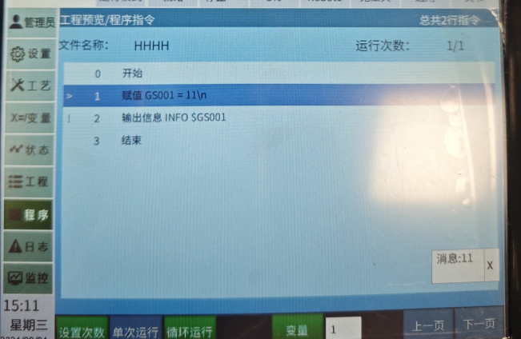
  
 可修改为：SET GS001=11\\\\n：此时可以正常打印
  
 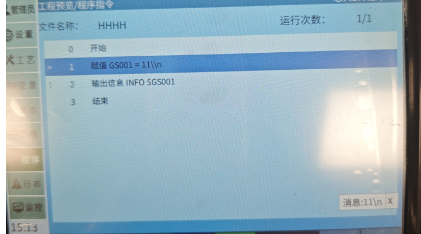
 
 [转义字符对照表](https://www.cnblogs.com/tabkey9/p/15930390.html)
  
### FORCESET-写入文件
  
格式：FORCESET【指令名】GI001【写入文件的变量名】。
  
功能：将缓存的数据存入硬盘。
  
在程序运行过程中，所有的计算、赋值操作均是对缓存中的数值进行更改的，并不会存入系统文件中。若要强制将内存中的全局数值变量写入文件中，则可以使用FORCESET指令。
  
参数：
  
| 参数 | 参数说明 |
| :--- | :--- |
| 变量名 | 点击更多选择要强制写入文件的变量名 |
  
示例：
  
1.  NOP
  
2.  GI001=10

3.  FORCESET GI001
  
4.  END

---

## AI 检索专用问答对 (Q&A for Retrieval)

**Q：全局变量和局部变量有什么区别？**

A：全局变量（如 GINT、GP）在所有作业文件中均可调用和共享，修改后会影响所有调用该变量的程序。局部变量（如 INT、P）仅对当前作业文件生效，不同作业文件之间互不影响。

**Q：如何给全局数值变量赋值？**

A：两种方式。手动赋值：在全局数值变量界面选中变量，点击"修改"输入数值，点击"保存"。指令赋值：插入变量类赋值指令，选择变量类型和填入变量值，执行后可在监控界面查看变量值。

**Q：局部位置变量 P 和全局位置变量 GP 有什么区别？**

A：局部位置变量 P 仅能用于当前作业文件，不能跨文件调用。全局位置变量 GP 在不同作业文件之间可以直接调用，但需要注意：当一个作业文件修改了某个 GP 点位，其他作业文件中调用的相同 GP 点位也会被修改，可能影响程序运行。

**Q：什么是引用变量？如何使用？**

A：引用变量是通过整型变量动态索引其他变量的方式。例如 P[I001] 表示当 I001=10 时，等同于 P0010。这使得程序可以通过修改变量 I001 的值来动态选择不同的位置变量。

**Q：形态值是如何计算的？**

A：对于六轴串联多关节机器人，形态值由 1、3、5 轴位置的二进制转换为十进制再加 1。例如 1 轴、3 轴、5 轴的二进制分别为 1、1、0，则形态值为 (110)_2 + 1 = 7。对于四轴 SCARA 机器人，形态参数对应左右手选择。

**Q：工具手和用户坐标绑定有什么注意事项？**

A：当目标点位的坐标为直角坐标、工具坐标或用户坐标时，如果想要将目标点位绑定工具手，则应选择对应的工具手编号，不绑定则选择"无"。运动时实际工具手和点位绑定工具手必须一致，否则控制器会报错。
