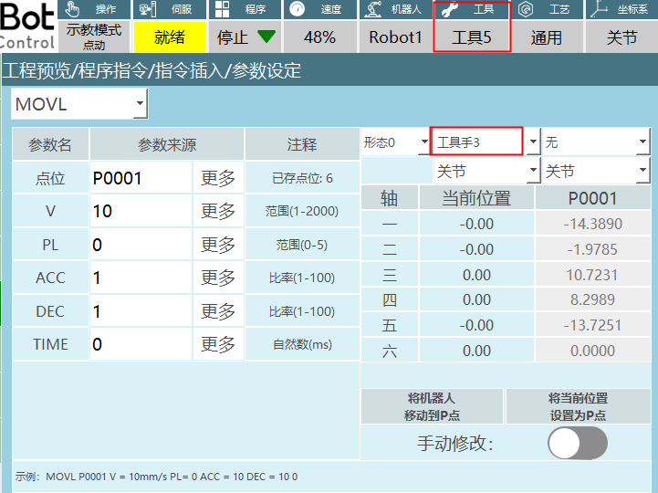
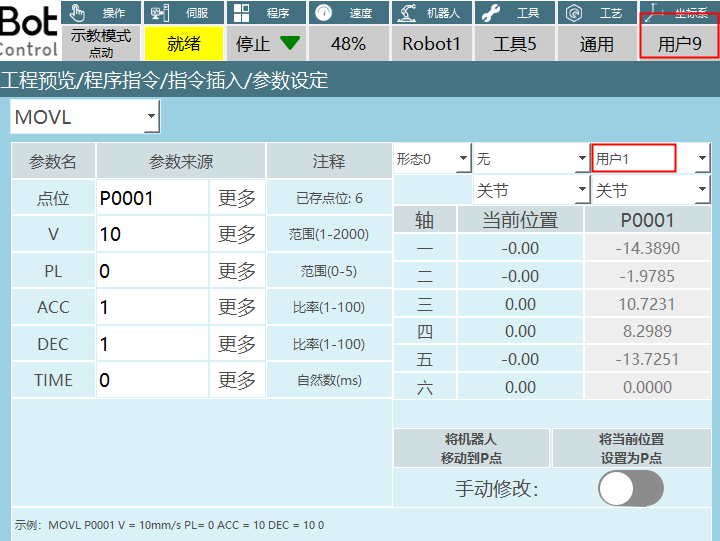

# 坐标系类

"√"表示支持此条指令。

| 指令类型   | 前台 | 全局后台   | 局部后台   |
| :----- | :- | :----- | :----- |
| 切换工具手  | √  | √      | √      |
| 切换用户坐标 | √  | √      | √      |
| 用户坐标转换 | √  |   |   |
| 切换外部轴  | √  |   |   |

| 指令类型 | 指令         | 单步      | 倒序         | 试运行 | 提前执行 | 被提前执行 |
| :--- | :--- | :--- | :--- | :--- | :--- | :--- |
| 坐标类   | 切换工具手   | 支持      | 跳转到第一行 | 不支持 | 不支持   | 支持       |
| 坐标类   | 切换工具坐标 | 支持      | 跳转到第一行 | 不支持 | 不支持   | 支持       |
| 坐标类   | 用户坐标转换 | 支持      | 跳转到第一行 | 不支持 | 不支持   | 支持       |
| 坐标类   | 切换外部轴   | 支持      | 跳转到第一行 | 不支持 | 不支持   | 支持       |
---

## 坐标切换类

### SWITCHTOOL-切换工具手   

格式：SWITCHTOOL【指令名】(1)【切换的工具手编号】。

功能：切换对应工具手编号的参数（工具手参数，负载参数）。

参数：

| 变量类型 | 
| :--- |
| 手填、变量形式（INT、GINT）范围[0,999]，编号为0表示无工具手 |

注意事项：

1. 切换工具手后检查机器人点位工具和实际使用工具是否一致，否则导致程序运行出错

如图所示：设置的点位工具编号为3，切换工具指令选择的编号是5。

示例：

1. NOP
2. SET GI001 = 5
3. SWITCHTOOL (GI001)
4. END

示例说明：在执行指令时示教器界面状态栏的工具手编号会切换到指令中设置的工具手编号5。

### SWITCHUSER-切换用户坐标 

格式：SWITCHUSER 【指令名】(1)【切换的用户坐标编号】。

功能：切换对应用户编号的参数。

参数：

| 变量类型   | 
| :--- |
| 手填、变量形式（INT、GINT）范围[1,999] |

注意事项：切换用户坐标后检查机器人点位用户和实际用户是否一致，否则会导致程序运行出错。

如图所示：设置的点位用户编号为1，切换用户指令选择的编号是9。

示例：

1. NOP
2. SET I010 = 2
3. SWITCHUSER (I010)
4. END

示例说明：在执行指令时示教器界面状态栏的用户编号会切换到指令中设置的用户编号2。

### USERCOORD_TRANS-用户坐标转换    

格式：USERCOORD_TRANS【指令名】1【用户坐标A的序号】2【用户坐标B的序号】3【用户坐标C的序号】。

功能:用户A与用户B叠加，计算出用户C。

例如：在传送带和相机结合使用的场景下，托盘是用户A,相机拍摄得出的工件坐标相对于托盘是用户B，最后计算出工件相对于机器人的用户C。

参数:

| 参数    | 说明                                    |
| :---- | :------------------------------------ |
| 用户坐标C | 用户A和用户B叠加计算出来的用户坐标C，将计算出来的参数存入选择的用户序号 |
| 用户坐标A | 存入用户坐标A的序号                            |
| 用户坐标B | 存入用户坐标B的序号                            |

示例：

1. NOP
2. USERCOORD_TRANS (1)(2)(3)
3. END

示例说明：用户坐标1和用户坐标2计算出用户坐标3。

### SWITCHSYNC-切换外部轴   

格式：SWITCHSYNC【指令名】1、2、3【外部轴组号1、外部轴组号2、外部轴组号3】。

功能：通过设置外部轴组号来切换外部轴类型。

参数：

| 外部轴组号  |
| :----- | 
| 要切换到的外部轴的组号，范围[0,3]。    例如：设置的外部轴组1是旋转单轴，外部轴组2是旋转双轴，如果在切换外部轴参数设置界面外部轴组号是2，运行指令外部轴会切换到旋转双轴 |

示例：在机器人配置界面，设置的外部轴组1是旋转单轴，外部轴组2是旋转双轴，外部轴组3是直线单轴。

1. NOP
2. TIMER T=1
3. SWITCHSYNC 1
4. MOVLEXT E0003 V = 50 mm/s PL = 0 ACC = 1 DEC = 1 SYNC = 1 0
5. MOVLEXT E0004 V = 50 mm/s PL = 0 ACC = 1 DEC = 1 SYNC = 1 0
6. END

示例说明：程序在运行第3行时切换到外部轴组1（旋转单轴），然后机器人在旋转单轴上面走直线轨迹。

## AI 检索专用问答对 (Q&A for Retrieval)    

**Q：如何使用SWITCHTOOL指令切换工具手**

A：使用SWITCHTOOL指令，格式为SWITCHTOOL【指令名】(1)【切换的工具手编号】。例如，SWITCHTOOL (GI001)表示切换到GI001变量指定的工具手编号。

**Q：切换工具手时需要注意什么？**

A：切换工具手后检查机器人点位工具和实际使用工具是否一致，否则导致程序运行出错。例如，设置的点位工具编号为3，切换工具指令选择的编号是5，会导致程序运行出错。

**Q：如何使用SWITCHUSER指令切换用户坐标**

A：使用SWITCHUSER指令，格式为SWITCHUSER 【指令名】(1)【切换的用户坐标编号】。例如，SWITCHUSER (I010)表示切换到I010变量指定的用户坐标编号。

**Q：切换用户坐标时需要注意什么？**

A：切换用户坐标后检查机器人点位用户和实际用户是否一致，否则会导致程序运行出错。例如，设置的点位用户编号为1，切换用户指令选择的编号是9，会导致程序运行出错。

**Q：如何使用USERCOORD_TRANS指令进行用户坐标转换？**

A：使用USERCOORD_TRANS指令，格式为USERCOORD_TRANS【指令名】1【用户坐标A的序号】2【用户坐标B的序号】3【用户坐标C的序号】。例如，USERCOORD_TRANS (1)(2)(3)表示用户坐标1和用户坐标2计算出用户坐标3。

**Q：USERCOORD_TRANS指令的应用场景是什么？**

A：USERCOORD_TRANS指令的应用场景是用户A与用户B叠加，计算出用户C。例如，在传送带和相机结合使用的场景下，托盘是用户A,相机拍摄得出的工件坐标相对于托盘是用户B，最后计算出工件相对于机器人的用户C。

**Q：如何使用SWITCHSYNC指令切换外部轴？**

A：使用SWITCHSYNC指令，格式为SWITCHSYNC【指令名】1、2、3【外部轴组号1、外部轴组号2、外部轴组号3】。例如，SWITCHSYNC 1表示切换到外部轴组1。

**Q：SWITCHSYNC指令的参数范围是什么？**

A：SWITCHSYNC指令的参数范围是[0,3]，表示要切换到的外部轴的组号。例如，设置的外部轴组1是旋转单轴，外部轴组2是旋转双轴，如果在切换外部轴参数设置界面外部轴组号是2，运行指令外部轴会切换到旋转双轴。

## 版本历史

| 版本 | 日期 | 变更内容 | 作者 |
| :--- | :--- | :--- | :--- |
| 1.0.0 | 2026-04-08 | 初始版本 | tongmengyuan123 |