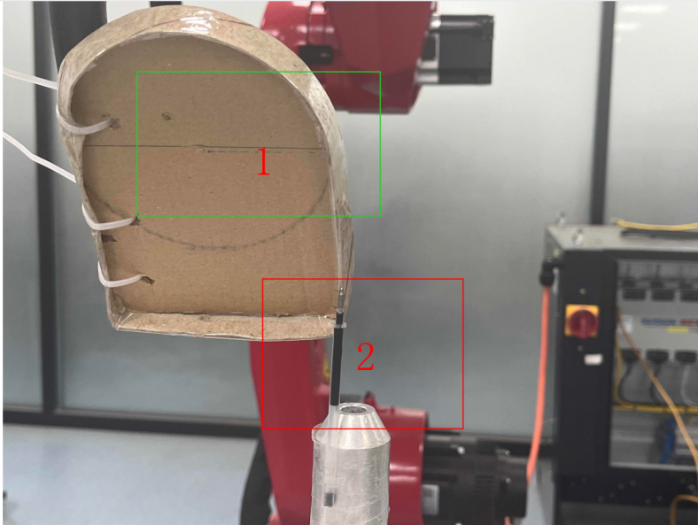
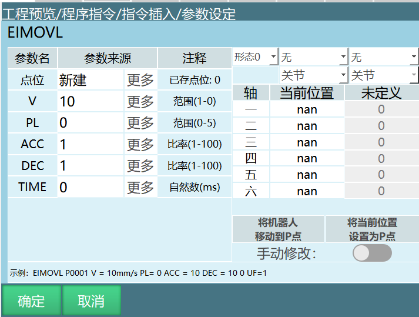
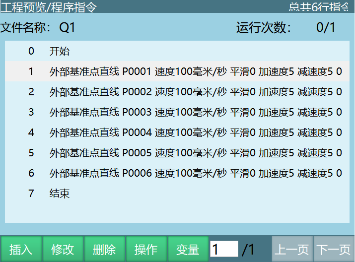
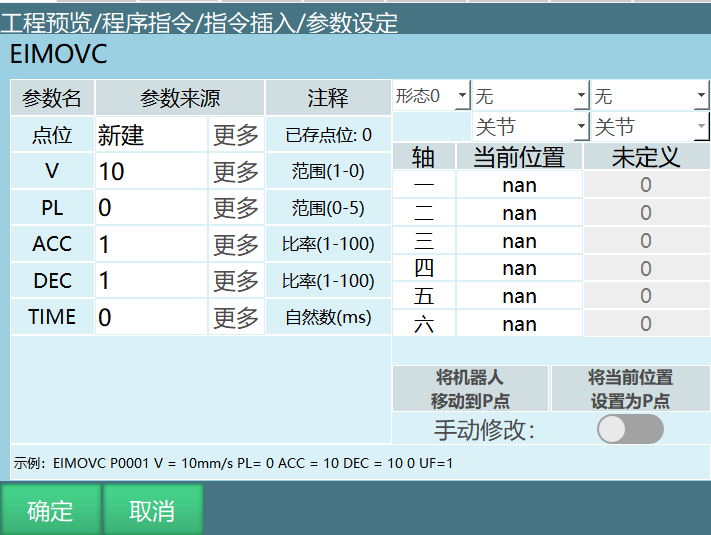
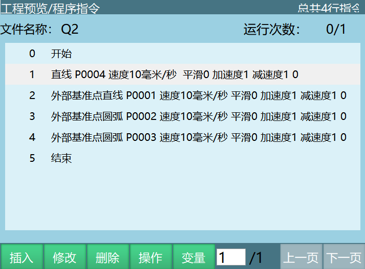
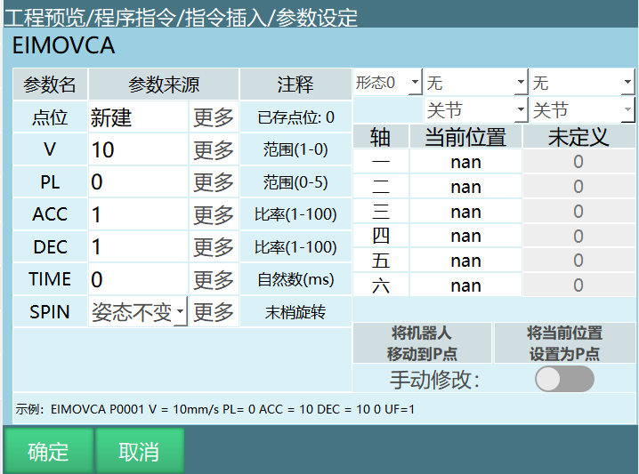
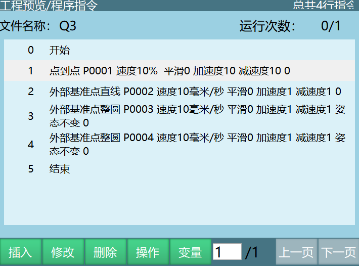

# 外部点TCP

**外部点的使用方法：**

工具手在外部，工件在机器人末端的工具上运动

例如图上所示：1代表工件，2代表外部工具手。

---

## 标定步骤：

**1.标定用户坐标系：**

解释：工件上找一个点或者机械臂安装标定锥（尖端就行），工件上找的点或者标定锥与外部工具手尖端对齐，标定用户坐标的原点，然后移动机器人标X,Y。用户原点、X、Y三个点位的姿态要一样。

*外部TCP就是工件在机器人上外部尖端固定，移动机器人在尖端上标定用户坐标。咱们正常标用户坐标系是机器人尖端在用户面标定，现在是尖端不动，用户面在机器人上，移动机器人标用户坐标。*

**2.选中标定好的用户坐标**

**3.标定工具手（运行时姿态有变化的话就需要标定工具手）**

工具手标定方法和以前一样，工件上的点和外部点每标定一个点位都需要两个点对齐

说明：标定用户和工具手时工件上的点是同一个点

4.**选中工具手**

## 指令介绍

**外部基准点直线**

程序编写

**外部基准点圆弧**

程序编写

**外部基准点整圆**

程序编写

**[外部点TCP效果视频](./assets/外部点TCP.mp4)**

## AI 检索专用问答对 (Q&A for Retrieval)

**Q: 外部点TCP的使用场景是什么?**

A: 适用于工具手固定在外部，需要让机器人末端的工件围绕外部工具手运动的场景，例如焊接、切割等工艺。

**Q: 标定用户坐标系和工具手时需要注意什么?**

A: 标定用户和工具手时，工件上使用的点必须是同一个点，以确保坐标系的一致性。

**Q: 如何测试外部点TCP的设置是否正确?**

A: 在工件上选择1条测试直线，示教2个点（每个点位要和外部工具手尖端对齐），插入EIMOVL指令，试运行查看轨迹是否符合预期。

**Q: 精度不足对后续的运动控制有什么影响?**

A: 标定精度直接影响后续运动轨迹的准确性，精度不足会导致工件运动偏差，影响工艺质量（如焊接位置偏移、切割轨迹误差等）。

**Q: 如何保证用户原点、X、Y三个点位姿态一致?**

A: 标定时保持机器人末端工具的姿态不变，仅移动位置。

**Q: 外部点TCP运行出现偏差时，如何进行故障排查和调整?**

A: 1.检查标定精度 ：重新执行标定流程，确保用户坐标系和工具手标定准确; 2.检查外部工具手 ：确认外部工具手是否固定牢固，无松动或位移; 3.检查指令参数 ：核对指令中的用户坐标系、工具手选择是否正确; 4.检查机器人状态 ：确认机器人各轴运行正常，无机械故障; 5.调整轨迹参数 ：根据偏差情况微调指令参数，如速度、加速度或轨迹点; 6.使用测试程序 ：编写简单的测试程序，逐步排查问题所在; 7.检查环境因素 ：确认工作环境温度、湿度等因素是否影响系统精度。

**Q: 外部点TCP相关指令的参数设置有哪些需要特别注意的地方?**

A: 1.用户坐标系选择 ：确保选择已标定的正确用户坐标系; 2.工具手选择 ：选择已标定的外部点工具手; 3.速度和加速度 ：根据工件质量和工艺要求设置合适的速度和加速度，避免运动过冲; 4.轨迹类型 ：根据实际需求选择直线、圆弧或整圆指令; 5.提前执行时间 ：根据工艺要求调整提前执行时间，确保动作协调

## 相关资源

- [用户坐标标定](./用户坐标标定手册.md)

- [工具手标定手册](./工具手标定手册.md)