# 外部轴使用手册

## 1 外部轴介绍

外部轴是指除去机器人本体的轴，为了工作需要所以再加上的轴，如地轨、翻转台、旋转台。被用于喷涂，焊接，切割等行业。

## 2 外部轴类型

1.  直线单轴

将机器人安装于地轨上，并通过外部轴功能控制地轨滑动来实现机器人的单个方向的长距离移动，可以实现大范围，多工位工作。

2.  直线双轴

将机器人安装于地轨上，并通过外部轴功能控制地轨滑动来实现机器人的同时两个方向的长距离移动，可以实现较大范围，多工位工作。

3.  直线三轴

将机器人安装于地轨上，并通过外部轴功能控制地轨滑动来实现机器人的同时三个方向长距离移动，可以实现更大范围，多工位工作。安装结构如图所示：

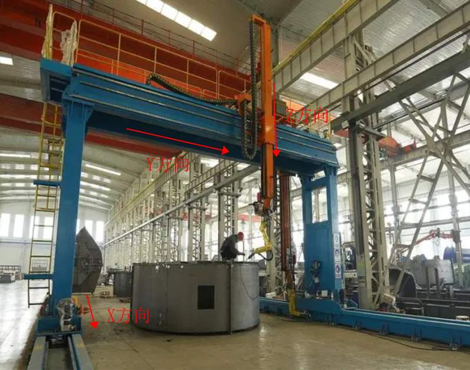

4.  旋转单轴

可分为：翻转轴或旋转轴

翻转轴：将翻转台独立于机器人本体，通过外部轴的功能控制翻转到特定的角度，更加利于对工件的某一个面进行加工，主要应用于焊接、切割、喷涂等方面。如在喷涂行业中，通过翻转台翻转实现对工件的上下表面的喷涂。

旋转轴：将旋转台独立于机器人本体，通过外部轴的功能控制旋转轴，在进行焊接操作时随着外部轴的转动进行工件的焊接。

5.  旋转双轴

将旋转轴与翻转轴相结合使用。

## 3 外部轴配置

1.  点击设置-机器人参数-从站配置，进入从站列表界面，然后点击此界面的【外部轴】进入外部轴配置界面。

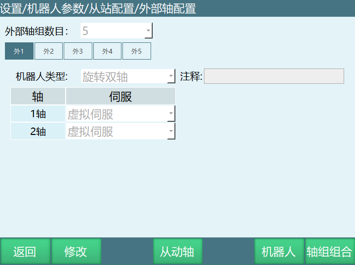

外部轴组数目：最大支持12个，相当于外部轴编号。

2.  点击【修改】设置外部轴组数。

3.  设置外部轴组数目后点击对应外部轴编号设置机器人类型。

4.  外部轴配置界面设置好参数后点击【保存】。

5.  点击【轴组组合】，进入轴组组合配置界面。

6.  参数设置完成后点击保存，外部轴配置设置完成。

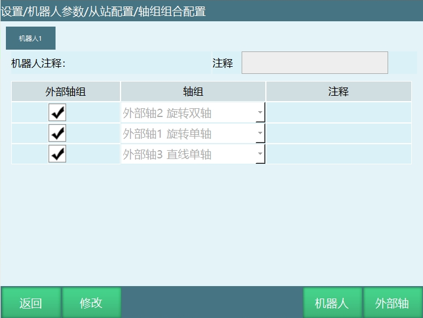

外部轴组：共支持三组外部轴组，点击对应行表示选中外部轴组。

轴组：选中外部轴后轴组列的参数才可以选择，此列显示的参数为外部轴配置界面设置的外部轴编号+机器人类型，用户根据设置的参数选择不同的轴组组合。

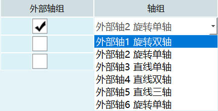

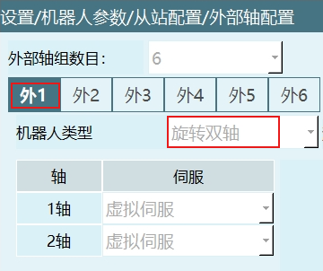

外部轴组数仅支持3组；  
外部轴的轴总数仅支持5个。

## 4 示例说明

1.  在从站配置页面确认是否读取到外部轴所使用的伺服，若识别到从站页面会显示，如图所示：

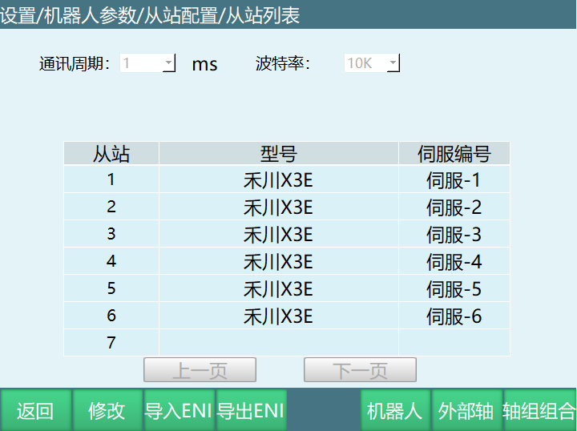

2.  在外部轴配置页面根据对应的轴进行选择伺服选择

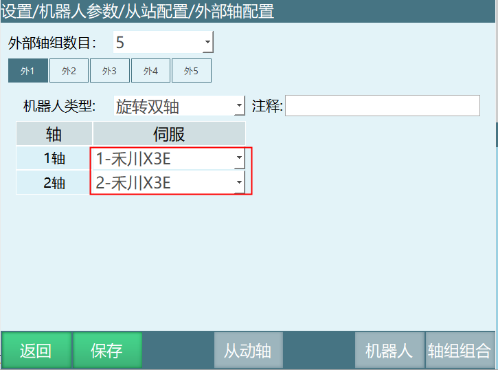

3.  在轴组组合页面进行外部轴轴组的选择

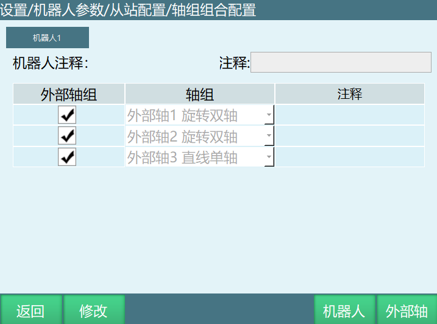

## 外部轴标定

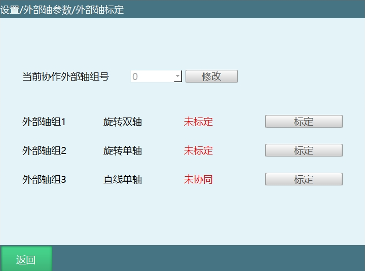

外部轴连接成功后就可以进行外部轴标定了。

当前协作外部轴组号：范围1-3，当外部轴类型为旋转单轴或者旋转双轴时需要设置协作组号，否则外部轴直线，外部轴圆弧指令无法运行，当外部轴类型为直线轴时不需要选择协作组号。

标定：点击对应外部轴组的标定按钮，进入标定界面。

### 旋转双轴标定

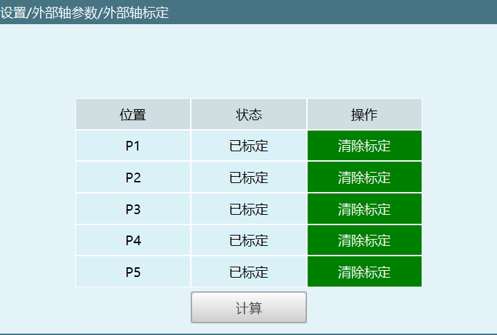

外部轴标定界面如图所示。

标定步骤：

1.  外部轴回零点，并在旋转台上找一点作为基准点A；

2.  P1：外部轴2轴+方向转动100度左右，此时基准点A如图P1，将机器人末梢移动到P1，点击标定；

3.  P2：外部轴2轴-方向转动50度左右，此时基准点A如图P2，将机器人末梢移动到P2，点击标定；

4.  P3：外部轴回零，此时基准点A如图P3，将机器人末梢移动到P3，标定P3；

5.  P4：将外部轴1轴正方向转动25度左右，此时基准点A如图P4，将机器人末梢移动到P4，点击标定；

6.  P5：再次将外部轴1轴正方向转动25度左右，此时基准点A如图P5，将机器人末梢移动到P5，点击标定；

7.  点击计算。

### 旋转单轴标定

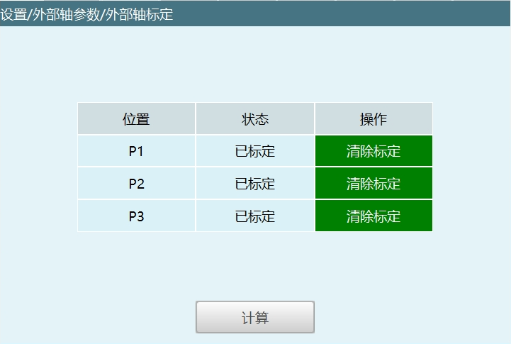

1.  外部轴回零点，并在平台上找一点作为基准点A；

2.  将外部轴正方向转动100度，此时A为P1，将机器人末梢移动到P1点，标定P1；

3.  将外部轴反方向转动50度，此时A为P2，将机器人末梢移动到P2点，标定P2；

4.  将外部轴回零，此时A为P3，将机器人末梢移动到P3点，标定P3；

5.  点击计算。

### 翻转单轴标定

1.  外部轴回零点，并在平台上找一点作为基准点A；

2.  将外部轴正方向转动50度，此时A为P1，将机器人末梢移动到P1点，标定P1；

3.  将外部轴反方向转动25度，此时A为P2，将机器人末梢移动到P2点，标定P2；

4.  将外部轴回零，此时A为P3，将机器人末梢移动到P3点，标定P3；

5.  点击计算。

### 直线单轴标定

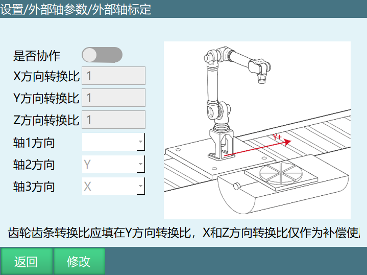

1.  X方向转换比：减速机输出端转一圈时，直线单轴X方向移动的距离

计算方式1：先将转换比的值填1，然后测量减速机输出端转一圈时，直线单轴X方向行走的长度，再将量出值重新填入转换比；

计算方式2：直线单轴X方向行走的长度（齿数\*齿距），将计算出的值重新填入转换比；

2.  Y方向转换比：减速机输出端转一圈时，直线单轴Y方向移动的距离

略，计算方式可参考【X方向转换比】

3.  Z方向转换比：减速机输出端转一圈时，直线单轴Z方向移动的距离

略，计算方式可参考【X方向转换比】

4.  轴方向：直线单轴的运动方向：X、Y、Z三个方向，只能选择其一

5.  当轴方向选择完成以及转换比修改完成，打开协作使能开关即认为已标定

### 直线双轴标定

略，可参考直线单轴标定

注意：轴方向：直线双轴的运动方向：X、Y、Z三个方向，只能选择其二，且不可以重复设置

### 直线三轴标定

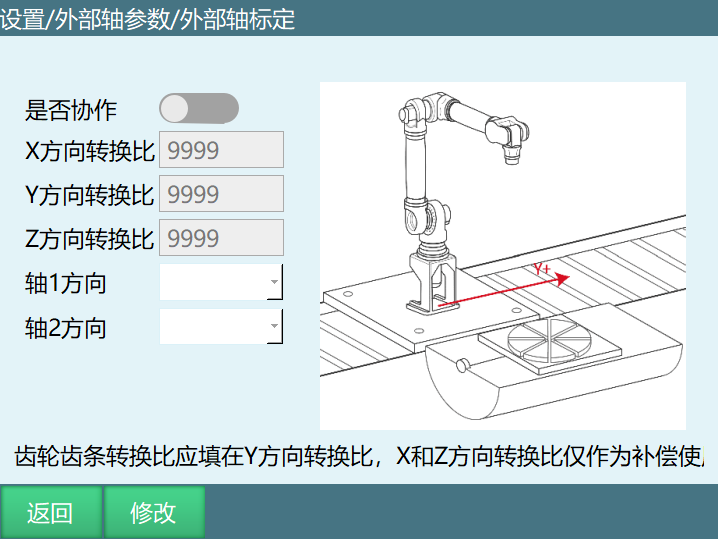

略，可参考直线单轴标定

注意：轴方向：直线三轴的运动方向：X、Y、Z三个方向，都是必选项

#### 方向校准

由于安装地轨和机器人时会存在误差，会使地轨的方向与机器人直角坐标系的下方向存在偏差，便可以通过标定计算出来的比例系数进行方向校准

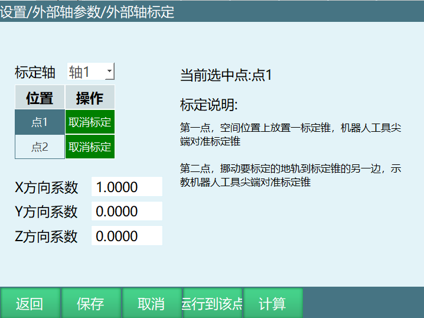

1.  该功能仅使用【协作】时，方可使用

2.  标定轴1的第一个点：在空间位置上放置一标定锥，将机器人的工具手的尖端对准标定锥

3.  标定轴1的第二个点：挪动需要标定的地轨至标定锥的另一端，将机器人的工具手的尖端对准标定锥

4.  点击【计算】，便可以计算出X、Y、Z三个方向的比例系数

5.  点击【保存】即可

注意：直线单轴需要标定一个轴，直线双轴则需要标定两个轴，直线三轴是三个轴都需要标定

## 零点位置

### 零点标定

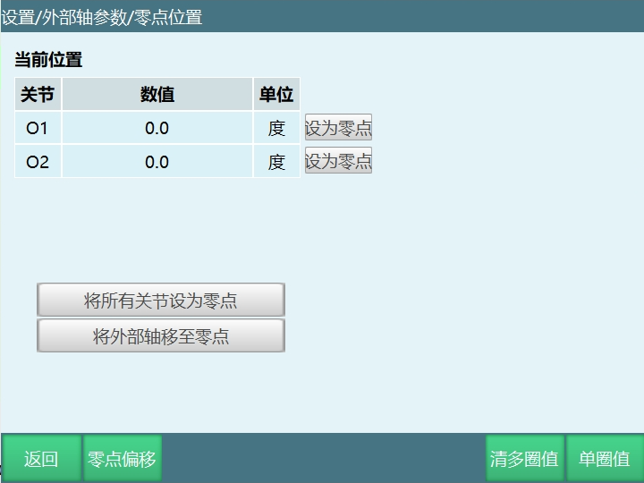

零点位置设定如图所示。

外部轴点位都为零的位置，用户可以自己设置外部轴零点位置。

1.  设为零点：将选中的某个轴的位置设为零点。

2.  将所有关节设为零点：将外部轴所有轴的位置设置为零点。

3.  将外部轴移至零点：示教模式下上使能，点击【将外部轴移至零点】，外部轴运动到零点位置。

### 零点偏移

零点偏移可以在用户需要调整零点时使用，手动输入数值，操作方式与零点标定类似。

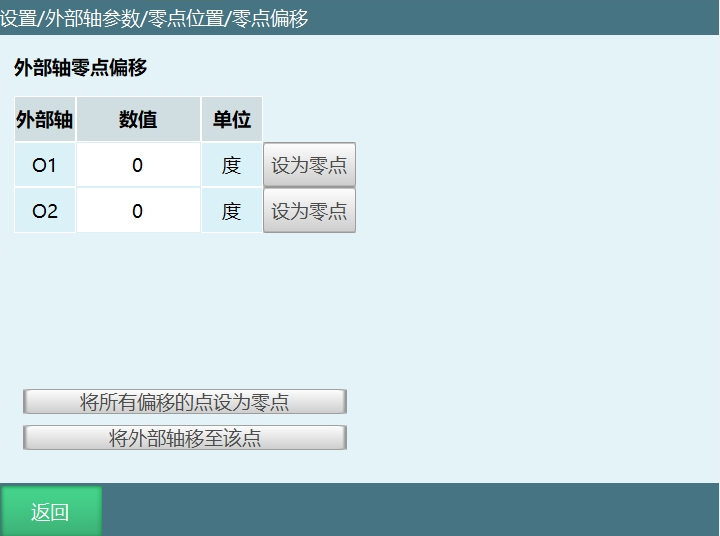

零点偏移设定选项如图所示。

1.  设为零点：单独调整某个外部轴的零点位置，选中需要调整零点位置的外部轴手动输入值，点击【设为零点】，然后点击此界面的【返回】进入零点位置界面，点击对应轴的【设为零点】零点位置被修改。

2.  将所有偏移的点设为零点：调整所有外部轴的零点位置，手动输入数值后点击【将所有偏移的点设为零点】，然后点击此界面的【返回】进入零点位置界面，点击【将所有关节设为零点】零点位置被修改。

3.  将外部轴移至该点：示教模式下上使能，点击将外部轴移至该点，外部轴运动到零点位置。

### 清多圈值

多圈值就是伺服电机的圈数。

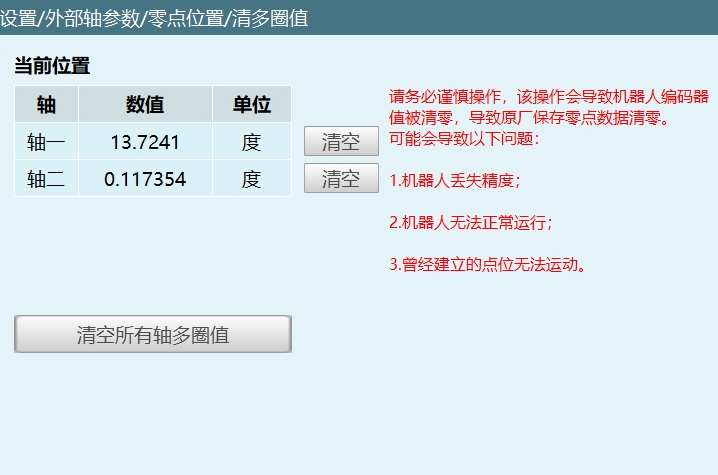

如图，清多圈值界面中有几个选项，选项的解释如下：

清空：清除某一个外部轴的多圈值。

清空所有轴多圈值：清空所有外部轴的多圈值。

请务必谨慎操作，该操作会导致机器人编码器值被清零，导致原厂保存的零点数据清零！ 

可能会导致以下问题：

- 机器人丢失精度；
- 机器人无法正常运行；
- 曾经建立的点位无法运行。

### 单圈值

单圈值是根据分辨率与旋转角度在一圈内得出的脉冲数。

修改单圈值后点击保存会修改角度值。

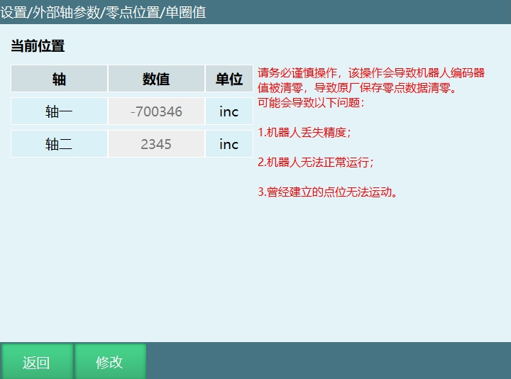

请务必谨慎操作，该操作会导致机器人编码器值被清零，导致原厂保存的零点数据清零！

可能会导致以下问题：   
- 机器人丢失精度； 
- 机器人无法正常运行；
- 曾经建立的点位无法运行。

## 6 外部轴参数

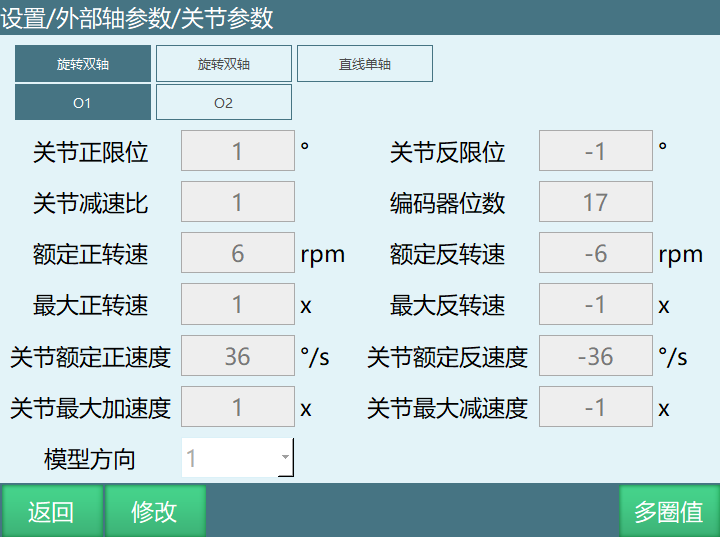

1.  关节正限位：机器人正方向旋转的角度或移动的距离，运动时超过限位会报错（机器人点动位置到达极限）。

2.  关节方限位：机器人反方向旋转的角度或移动的距离，运动时超过限位会报错（机器人点动位置到达极限）。

3.  关节减速比：减速机的减速比。

4.  编码器位数：填写当前所使用的编码器位数，注意不要随便填写，否则在点动机器人时飞车。

5.  额定正转速：电机正方向能够运行的转速。

6.  额定反转速：电机反方向能够运行的转速。

7.  最大正转速：例如1倍时从0速到达额定正速度时间为10秒，那么2倍就是5秒到达额定正速度。

8.  最大反转速：例如1倍时从0速到达额定反速度时间为10秒，那么2倍就是5秒到达额定反速度。

9.  关节额定正速度：机器人关节额定正方向速度，关节额定正速度计算方法：额定正转速\*360/60/减速比。

10. 关节额定反速度：机器人关节额定反方向速度，关节额定反速度计算方法：额定反转速\*360/60/减速比。

11. 最大加速度：例如1倍时从0速到达最大加速度时间为10秒，那么2倍就是5秒到达最大加速度。

12. 最大减速度：例如1倍时从0速到达最大减速度时间为10秒，那么2倍就是5秒到达最大减小速度。

13. 模型方向：模型方向可参照零点位置界面关节正方向示意图设置，各轴点动"+"键应与关节正方向示意图方向相同，相同选1，相反选-1。

#### 多圈值

点击【设置】-【外部轴参数】-【关节参数】进入关节参数界面，点击【多圈值】修改编码器的范围。

编码器多圈值溢出计数功能：该功能用来消除编码器最大/最小值之间跳变产生的影响。

例如编码器多圈值范围为\[-2147483648,2147483647\]，当前编码器多圈值位置为2147483647，则再往正方向转1个单位则为-2147483648，如系统不知道编码器多圈值范围则会认为机器人突然跳变，并不会知道实际只转了1个单位，此时则容易出现飞车现象。

必须填写该参数，不填写可能出现以下问题：

1.  点位出现较大跳变，例如突然从4度变为40度。
2.  飞车。

若配置从动轴，则从动轴的编码器最大/最小值也要填写！ 

## 点动速度

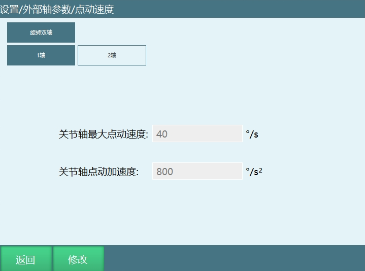

如图所示为点动速度界面，名词解释如下：

关节轴最大点动速度：点动外部轴时的速度，外部轴为旋转轴时单位为°/s,外部轴为直线轴时单位为mm/s。

外部轴点动速度计算方法：关节轴最大点动速度\*全局速度（此处的全局速度表示示教器上方状态栏速度）。

关节轴点动加速度：略。

## 外部轴指令

当修改外部轴指令的速度时，加速度比率和减速度比率会与速度成1：1的倍数关系自动显示，如需修改加速度比率或减速度比率，可手动操作。

### 外部轴点到点

功能：机器人以关节插补方式向示教位置移动，外部轴在旋转时机器人通过示教的点位在外部轴上运动。

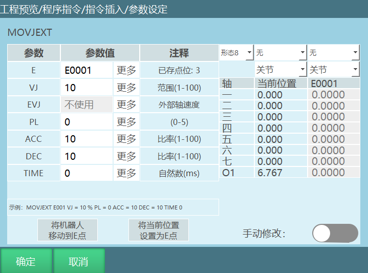

| 参数 | 说明 |
| :--- | :--- |
| E | 记录机器人与外部轴位置数据的变量。当值为“新建”时，插入该指令则新建一个E变量，并将机器人与外部轴的当前位置记录到该E变量 |
| VJ | 关节插补的速度，范围[1,100] |
| EVJ | 外部轴速度，范围[1,100]，增加该参数是用来提高整体运行速度,通过计算哪一个速度运行的时间长就用哪一个速度 当其为【不使用】状态时，机器人外部轴同时运动时，会出现其中一方运动速度特别慢 |
| PL | 平滑过渡等级，范围[0,5] |
| ACC | 加速度比率，范围[1,100] |
| DEC | 减速度比率，范围[1,100] |
| TIME | 提前时间执行下一条指令。单位ms |

1.  将机器人移动到E/GE点：示教模式下按下使能按键，点击【将机器人移动到E/GE点】机器人和外部轴会运动到当前所选择变量的位置。

2.  将当前位置设置为E/GE点：将外部轴和机器人当前的位置写入到选择的变量，如果当前点位是关节点位，会将当前的关节点位坐标写入目标变量；当前点位是直角点位，会将当前的直角点位坐标写入目标变量；当前点位是工具点位，会将当前的工具点位坐标写入目标变量；当前点位是用户点位，会将当前的用户点位坐标写入目标变量。

3.  手动修改：打开手动修改按钮，用户可以手动修改点位。

示例：

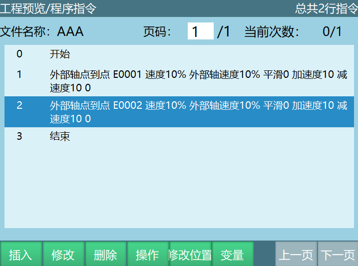

示例说明：机器人从E0001运动到E0002，并且E0001-E0002的运动过程中外部轴旋转。

### 外部轴直线

功能:机器人以直线插补的方式向示教位置移动，外部轴在旋转时机器人在外部轴上走直线轨迹。

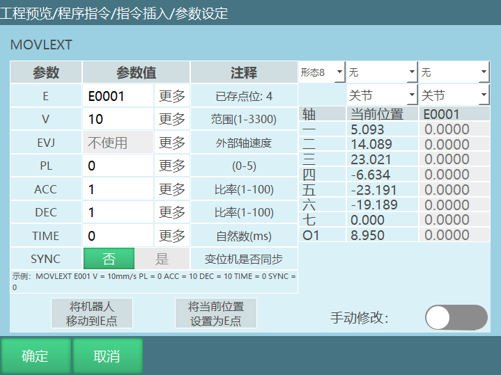

| 参数 | 说明 |
| :--- | :--- |
| E | 记录机器人与外部轴位置数据的变量。当值为“新建”时，插入该指令则新建一个E变量，并将机器人与外部轴的当前位置记录到该E变量 |
| V | 直线插补的速度，范围1-1000（默认笛卡尔参数最大速度为1000，范围根据实际填写的笛卡尔参数变化），单位为mm/s |
| EVJ | 外部轴速度，范围[1,100] |
| PL | 平滑过渡等级，范围[0,5] |
| ACC | 加速度比率，范围[1,100] |
| DEC | 减速度比率，范围[1,100] |
| TIME | 提前时间执行下一条指令，单位ms |
| SYNC | SYNC 变位机是否同步 打开同步：机器人与外部轴协同走直线 关闭同步：机器人在空间走直线，外部轴独立运动到目标角度 |

1.  将机器人移动到E/GE点：示教模式下按下使能按键，点击【将机器人移动到E/GE点】机器人和外部轴会运动到当前所选择变量的位置。

2.  将当前位置设置为E/GE点：将外部轴和机器人当前的位置写入到选择的变量，如果当前点位是关节点位，会将当前的关节点位坐标写入目标变量；当前点位是直角点位，会将当前的直角点位坐标写入目标变量；当前点位是工具点位，会将当前的工具点位坐标写入目标变量；当前点位是用户点位，会将当前的用户点位坐标写入目标变量。

3.  手动修改：打开手动修改按钮，用户可以手动修改点位。

注意事项：在使用外部轴直线指令前需要在外部轴标定界面选中外部轴组号，否则程序运行时会报错。标定外部轴时需要准确的标定，否则在走外部轴直线指令时，机器人与外部轴同步会有问题。

示例：

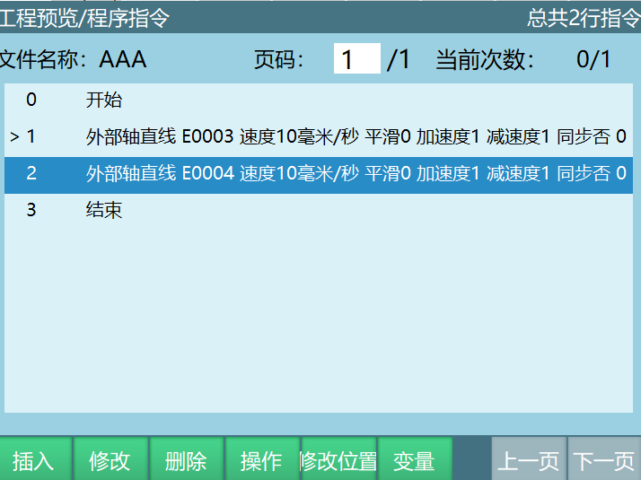

示例说明：机器人在E0003点后，机器人与外部轴协作走直线轨迹运行到 E0004

### 外部轴圆弧

功能：机器人和外部轴一起运动，机器人以圆弧插补方式向示教位置移动，外部轴用关节差补的方式运动。

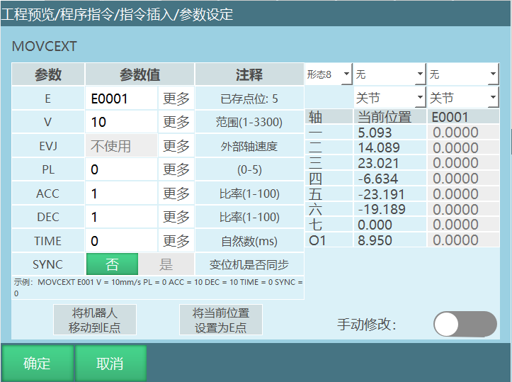

如图所示为参数设定界面。

| 参数 | 说明 |
| :--- | :--- |
| E | 记录机器人与外部轴位置数据的变量。当值为“新建”时，插入该指令则新建一个E变量，并将机器人与外部轴的当前位置记录到该E变量。 |
| V | 直线插补的速度，范围1-1000（默认笛卡尔参数最大速度为1000，范围根据实际填写的笛卡尔参数变化），单位为mm/s |
| EVJ | 外部轴速度，范围[1,100] |
| PL | 平滑过渡等级，范围[0,5] |
| ACC | 加速度比率，范围[1,100] |
| DEC | 减速度比率，范围[1,100] |
| TIME | 提前时间执行下一条指令。单位ms |
| SYNC | SYNC 变位机是否同步 打开同步：机器人与外部轴协同走直线 关闭同步：机器人在空间走直线，外部轴独立运动到目标角度 |

1.  将机器人移动到E/GE点：示教模式下按下使能按键，点击【将机器人移动到E/GE点】机器人和外部轴会运动到当前所选择变量的位置。

2.  将当前位置设置为E/GE点：将外部轴和机器人当前的位置写入到选择的变量，如果当前点位是关节点位，会将当前的关节点位坐标写入目标变量；当前点位是直角点位，会将当前的直角点位坐标写入目标变量；当前点位是工具点位，会将当前的工具点位坐标写入目标变量；当前点位是用户点位，会将当前的用户点位坐标写入目标变量。

3.  手动修改：打开手动修改按钮，用户可以手动修改点位。

注意事项：在使用外部轴圆弧指令前需要在外部轴标定界面选中外部轴组号，否则程序运行时会报错。标定外部轴时需要准确的标定，否则在走外部轴圆弧指令时，机器人与外部轴同步会有问题。

示例：

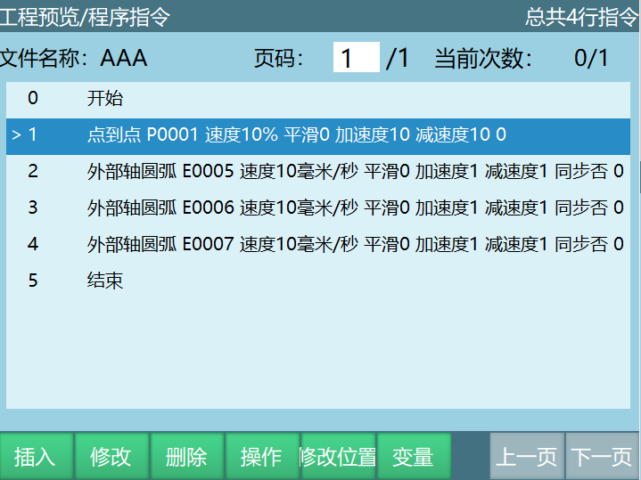

示例说明：机器人从当前位置运行到P0001点，从P0001点运行到圆弧开始点E0005，到达E0005后运行至圆弧中间点E0006
，在E0007点走完整个外部轴圆弧轨迹。E0005-E0007运动过程中机器人与外部轴协作走圆弧，机器人在向示教的目标点移动时，外部轴也在同步旋转。

## 外部轴注意事项

1.  设置多组外部轴时，机器人只能同时与一组外部轴进行协作。可通过插入协作外部轴指令切换当前协作的外部轴轴组，如下图所示：

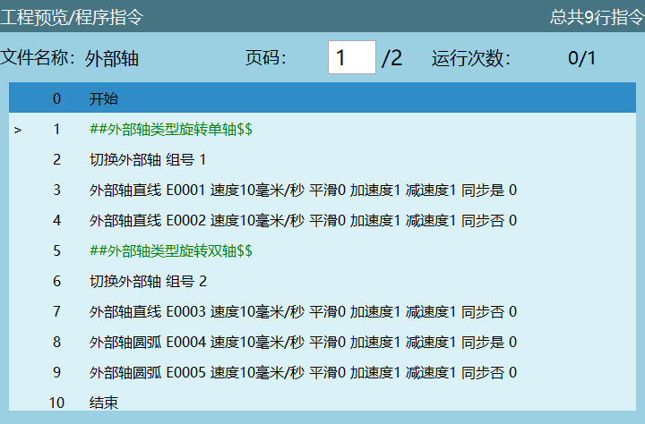

2.  外部轴直线、外部轴圆弧指令未标定外部轴或未选择协作组号时不能开启同步运行。

3.  外部轴类型为直线单轴、直线双轴、直线三轴时不需要选择协作外部轴组号。

## 外部轴的使用

焊接工艺里焊接机器人的外部轴主要是辅助机器人完成焊接动作，同时提高效率和精度。机器人和变位机进行协调运动，当机器人在完成焊接一面后，变位机自动翻转到另外一面进行焊接作业。

操作步骤：

1.  外部轴标定、设置外部轴参数；

2.  焊接工艺界面设置焊接参数；

3.  示教点位（焊接轨迹）。

### 焊接

### 

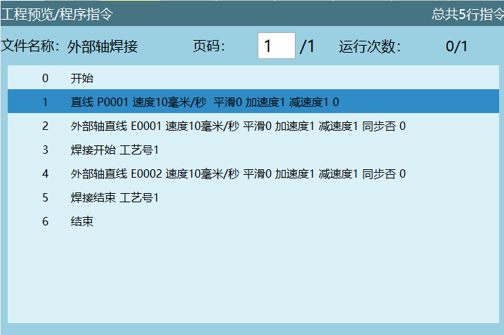

1.  安全点；

2.  焊接轨迹的起始点；

3.  焊接开始；

4.  焊接轨迹的终点；

5.  焊接结束 。

### 外部轴定点摆

### 

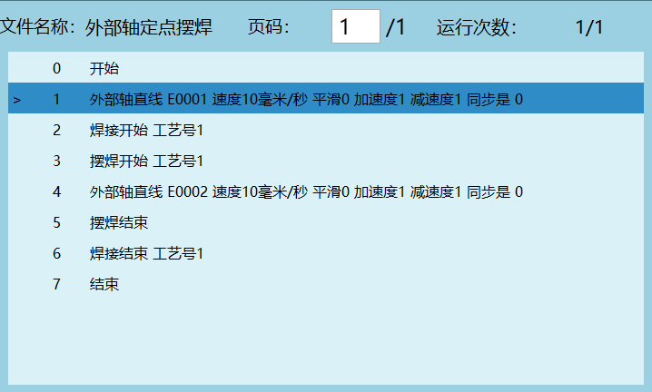

注意事项：

1.  位置变量E包含了机器人的位置数据和外部轴的位置数据，机器人的点位确定了外部轴转动方向，外部轴的点位确定摆焊轨迹。

2.  外部轴标定E1和E2时机器人和外部轴都需要移动。

---

## 7 AI 检索专用问答对 (Q&A for Retrieval)

**Q: 外部轴的类型有哪些？**

A: 外部轴类型包括：直线单轴、直线双轴、直线三轴、旋转单轴、旋转双轴。

**Q: 外部轴标定的步骤是什么？**

A: 外部轴标定的步骤因轴类型而异：
- 旋转双轴：回零点找基准点A，分别标定P1、P2、P3、P4、P5点，然后点击计算
- 旋转单轴：回零点找基准点A，分别标定P1、P2、P3点，然后点击计算
- 翻转单轴：回零点找基准点A，分别标定P1、P2、P3点，然后点击计算
- 直线轴：设置转换比和轴方向，打开协作使能开关

**Q: 外部轴指令有哪些类型？**

A: 外部轴指令包括：外部轴点到点、外部轴直线、外部轴圆弧。

**Q: 如何设置外部轴零点位置？**

A: 可以通过以下方式设置外部轴零点位置：
- 设为零点：将选中的某个轴的位置设为零点
- 将所有关节设为零点：将外部轴所有轴的位置设置为零点
- 零点偏移：手动输入数值调整零点位置

**Q: 外部轴使用时需要注意什么？**

A: 外部轴使用时需要注意：
- 设置多组外部轴时，机器人只能同时与一组外部轴进行协作
- 外部轴直线、外部轴圆弧指令未标定外部轴或未选择协作组号时不能开启同步运行
- 直线轴类型不需要选择协作外部轴组号

---

## 8 相关资源

- [示教器功能按键说明手册](./示教器功能按键说明手册.md)
- [人机协作](./人机协作.md)
- [系统功能调试手册](./系统功能调试手册.md)
