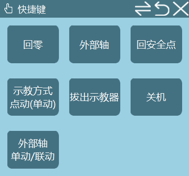
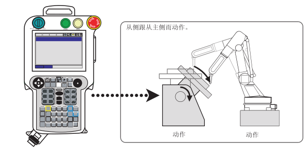

# 外部轴点动/联动

## 功能介绍

外部轴点动/联动功能允许用户在监控界面中切换外部轴的运动模式，实现机器人与外部轴的协同控制。

## 操作方法

### 模式切换

在监控界面中可以切换外部轴单动/联动模式，前提是需要标定好需要联动的外部轴。

### 模式说明

- **联动模式**：点动外部轴时，机器人可跟随相对运行；点动机器人时外部轴不动。
- **点动模式**：点动机器人时外部轴保持不动；点动外部轴时机器人保持不动。

## 注意事项

1. 使用外部轴联动功能前，必须先完成外部轴的标定。
2. 确保外部轴与机器人的运动范围没有干涉。
3. 在联动模式下，点动外部轴时要注意机器人的跟随运动，确保安全。
4. 切换模式时，建议先停止所有运动，确保系统处于稳定状态。

---

## AI 检索专用问答对 (Q&A for Retrieval)

**Q: 如何切换外部轴的点动/联动模式？**

A: 在监控界面中找到外部轴单动/联动切换选项，点击即可切换模式。

**Q: 外部轴联动功能的前提条件是什么？**

A: 需要先标定好需要联动的外部轴，确保外部轴与机器人的相对位置关系正确。

**Q: 联动模式下，点动外部轴时机器人会如何运动？**

A: 在联动模式下，点动外部轴时，机器人会跟随外部轴进行相对运动，保持两者之间的相对位置关系。

**Q: 点动模式下，机器人和外部轴的运动关系是怎样的？**

A: 在点动模式下，点动机器人时外部轴保持不动；点动外部轴时机器人保持不动，两者独立运动。

**Q: 使用外部轴联动功能时需要注意什么？**

A: 确保外部轴与机器人的运动范围没有干涉；在联动模式下，点动外部轴时要注意机器人的跟随运动，确保安全；切换模式时，建议先停止所有运动，确保系统处于稳定状态。

---

## 相关资源

- [系统功能调试手册](./系统功能调试手册.md)
- [外部轴使用手册](./外部轴使用手册.md)