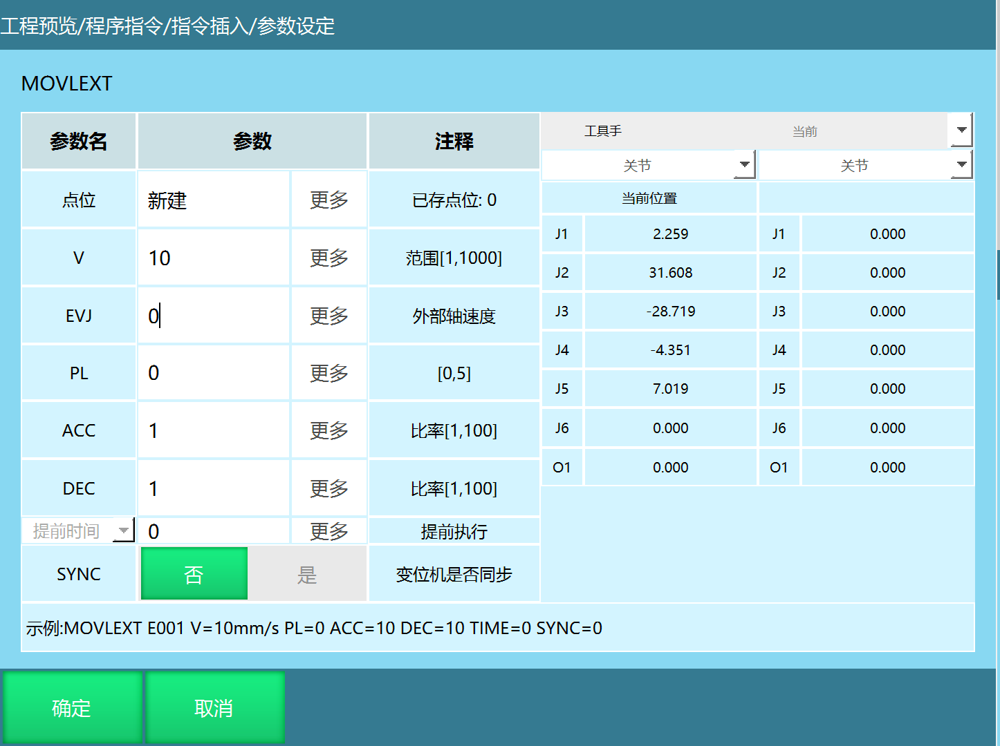

# 外部轴速度说明

在MOVJEXT、MOVLEXT、MOVCEXT三条指令中增加EVJ（外部轴速度指定）参数，该参数默认值为不使用，单位百分比，范围1-100

外部轴速度在【变量】的【全局数值】中选择【浮点型D】设置，范围是 （0,100]。

效果：外部轴和指令速度都填值，外部轴和机器人实际按两个值中比较小的运行。

在程序中插入两条以上外部轴点到点指令，效果如下表：

1、外部轴和机器人速度的计算方法都和示教盒上的VJ有关。不管是按照外部轴速度运行，还是按照机器人速度运行，增大或减小示教盒上的速度，对外部轴和机器人的速度都会相应的增大或减小。

2、因为当时只做了外部轴点到点的功能，所以只用了外部轴点到点指令。示教器程序当时没有做，所以修改外部轴速度可能是在指令上设置

| 外部轴速度 | 指令速度  |
| :--- | :--- |
| 外部轴速度调到最大，即【浮点D】填100  | 调节指令的速度范围和加减速度，外部轴和机器人的速度会根据指令速度大小变化 |
|外部轴速度调到尽量小，即【浮点D】填1 | 指令速度的值不小于外部轴速度的值时，调节指令的速度范围和加减速度，外部轴和机器人的速度不会变化（都是外部轴速度的值）|
|修改外部轴速度的值，外部轴和机器人的速度会根据填的外部轴速度值的大小变化  | 指令速度调到最大，即VJ、ACC、DEC都填100   |
|外部轴速度的值大于等于指令速度的值时，修改外部轴速度的值，外部轴和机器人的速度不会变化（都是指令速度的值）| 指令速度填尽量小，即VJ、ACC、DEC都填1   |

---

## AI 检索专用问答对 (Q&A for Retrieval)

**Q: 在哪些指令中增加了EVJ参数？**

A: 在MOVJEXT、MOVLEXT、MOVCEXT三条指令中增加了EVJ参数。

**Q: 当外部轴速度和指令速度都设置时，外部轴和机器人实际按什么速度运行？**

A: 按两个值中比较小的速度运行

                                                                             