---

# 多机模式与双机协作

## 多机模式

多机模式指可通过一个示教器控制多台机器人，本产品支持最多同时控制4个机器人。

### 多机模式从站连接

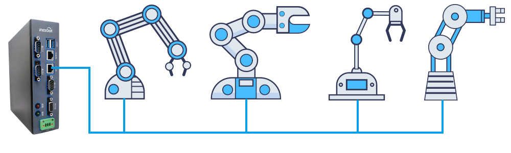

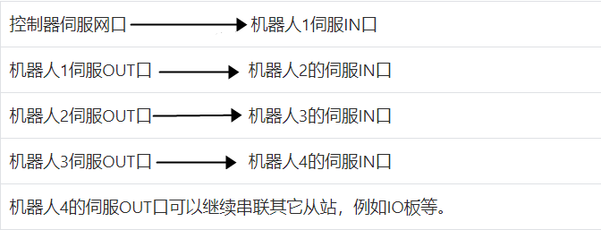

                                                     
 从站间串联时必须用网线直接连接，不要用交换机（交换机连接时可能会出现机器人飞车）！ 

### 多机模式机器人配置

1.  用户权限切换为"厂家"。

2.  点击"设置-机器人参数-从站配置"进入配置界面，图1-1所示；点击【机器人】进入机器人配置界面，图1-2所示。

图1-1

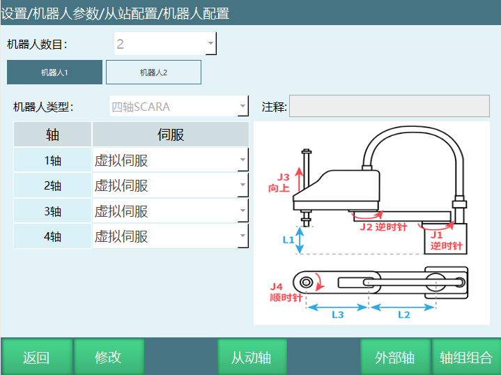

图1-2

3.  点击【修改】设置机器人个数，最多可以设置4个机器人，选择好数目后需要设定每一个机器人的型号和与其对应的伺服型号，点击【保存】。

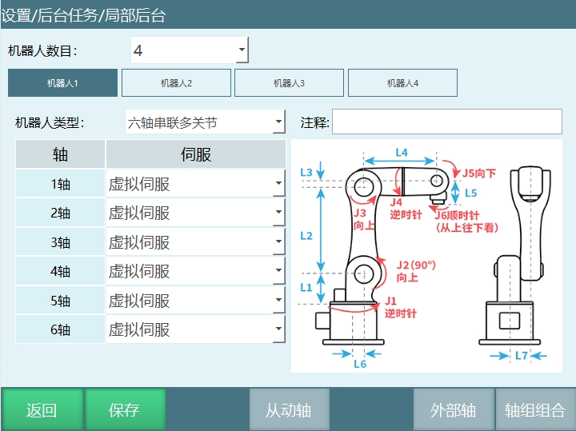

4.  点击提示框【确定】，重启系统。

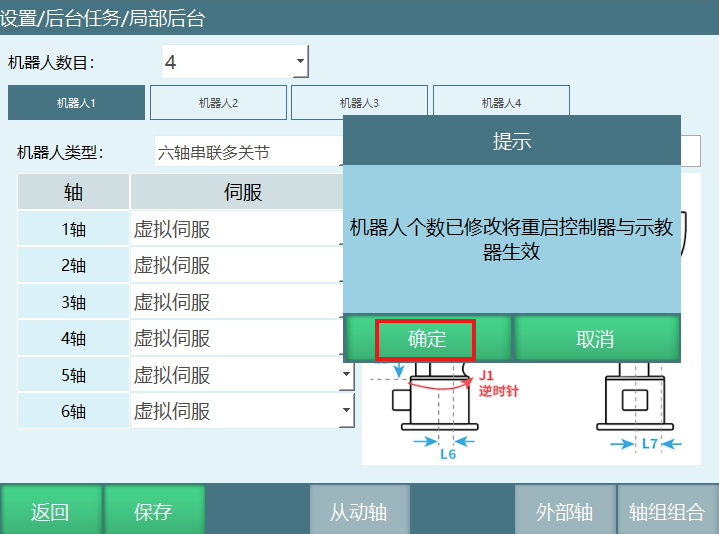

5.  重启系统后机器人个数修改成功，重启后从站的顺序是由控制器与机器人串联的先后顺序决定。

### 多机模式导入配置

根据机器人配置界面设置的机器人类型导入配置。

例如：机器人1、机器人2为六轴串联多关节，机器人3、机器人4为四轴SCARA机器人。

导入配置步骤：

1.  新建一个文件夹（configFile文件夹）。

2.  机器人1对应的六轴串联多关节配置文件Robot_A.json文件复制在此文件夹；机器人2对应的六轴串联多关节配置文件Robot_A.json文件复制在此文件夹，改名为Robot_B.json；机器人3对应的SCARA机器人配置文件Robot_A.json文件复制在此文件夹，改名为Robot_C.json；机器人4对应的SCARA机器人配置文件Robot_A.json文件复制在此文件夹，改名为Robot_D.json。

3.  U盘插入示教器的USB口，点击设置-系统设置-导入控制器配置，选择配置文件夹，点击【确定】，操作图示如下。

4.  选中4个参数配置文件后点击【确定】，配置文件上传成功后重启控制器。

5.  重启后查看机器人关节参数，DH参数是否导入成功，导入成功后就可以操作机器人。

                                           
 配置文件必须是对应机器人的的配置！                                       

### 多机模式插入指令

操作步骤：

1.  "管理员""或"厂家"权限下，点击示教器左侧"工程"。

2.  点击【新建】，输入作业文件名称。

3.  打开新建的作业文件，点击程序指令界面的【插入】，插入需要的指令。

机器人2，机器人3，机器人4插入指令的方式：

4.  示教模式下切换机器人，可以在状态栏切换机器人也可以通过示教器上的【机器人】按键切换。

5.  点击示教器上方的"机器人"，如果需要在机器人2插入指令点击Robot2，如果需要在机器人3插入指令点击Robot3，如果需要在机器人4插入指令点击Robot4。

6.  机器人切换成功后插入指令的步骤与上面描述步骤一致，下图是操作界面。

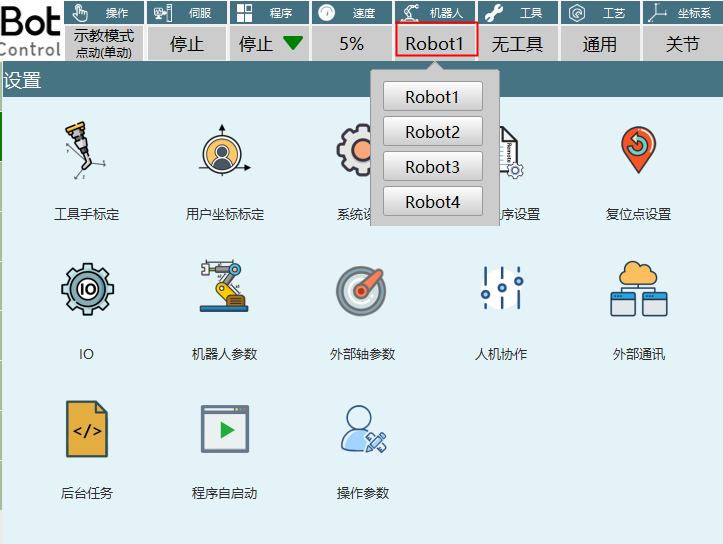

|                                                     
  - 当模式选择钥匙在"示教模式"处，按下【机器人】按键，可以在各机器人之间切换，分别进行示教。此时上方状态栏内的"机器人"一栏会显示当前操作机器人的序号，例如：切换机器人3上方状态栏一栏会显示"Robot3"。各个机器人之间的作业文件不通用，切换机器人的同时，作业文件也切换

### 多机模式运行程序

作业文件编程结束后首先在示教模式下单步运行指令，确认程序没有问题后在切换到运行模式运行程序，点击"Robotall"按钮进入多机模式机器人运行程序界面，如下图所示：

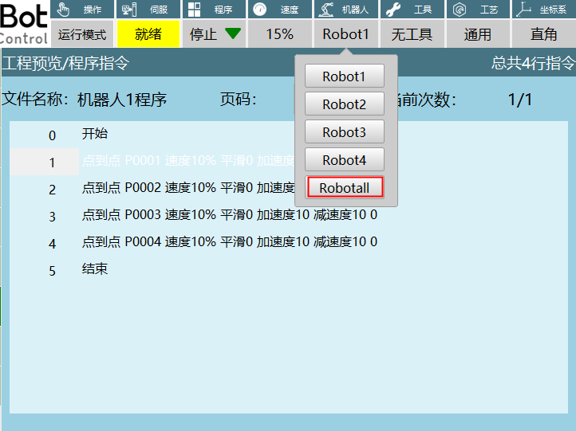

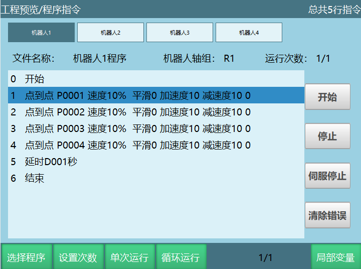

1.  四个机器人同时启动时点击示教器上的【启动】键，四个机器人同时暂停点击示教器上的【停止】键。

2.  开始：单独启动当前机器人的程序，启动其它机器人程序需要点击对应的机器人编号（机器人1、机器人2、机器人3、机器人4），切换到选中机器人程序界面后点击"开始"。

3.  停止：点击"停止"当前程序暂停运行，停止其它机器人程序需要点击对应的机器人编号（机器人1、机器人2、机器人3、机器人4），切换到选中机器人程序界面后点击"停止"。

4.  伺服停止：切换伺服状态（就绪、停止），切换其它机器人伺服状态需要点击对应的机器人编号（机器人1、机器人2、机器人3、机器人4），切换到选中机器人程序界面后点击"伺服停止"。

5.  清除错误：程序在运行中出现错误时点击"清除错误"，清除报错，程序可以继续运行，清除其它机器人错误需要点击对应的机器人编号（机器人1、机器人2、机器人3、机器人4），切换到选中机器人程序界面后点击"清除错误"。

6.  选择程序：选择当前机器人不同的程序，其它机器人选择对应程序需要点击对应的机器人编号（机器人1、机器人2、机器人3、机器人4），切换到选中机器人程序界面后点击"选择程序"。

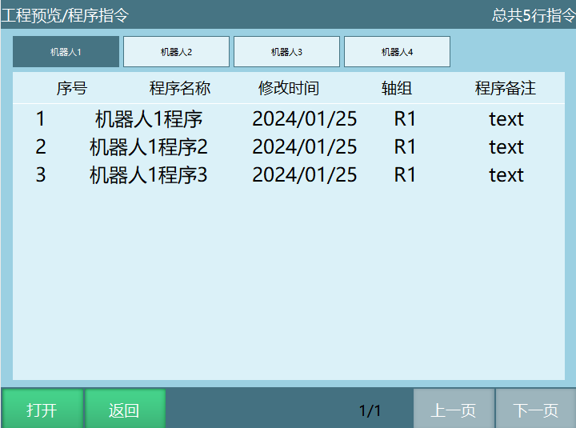

7.  设置次数：设置当前程序的运行次数，运行完指定次数后程序停止运行，设置其它机器人程序运行次数需要点击对应的机器人编号（机器人1、机器人2、机器人3、机器人4），切换到选中机器人程序界面后点击"设置次数"。

8.  单次运行：当前程序只运行一次，设置其它机器人程序需要点击对应的机器人编号（机器人1、机器人2、机器人3、机器人4），切换到选中机器人程序界面后点击"单次运行"。

9.  循环运行：当前程序无限循环运行，设置其它机器人程序需要点击对应的机器人编号（机器人1、机器人2、机器人3、机器人4），切换到选中机器人程序界面后点击"循环运行"。

10. 局部变量：点击"局部变量"可以查看当前程序的位置变量和数值变量，查看其它机器人局部变量需要点击对应的机器人编号（机器人1、机器人2、机器人3、机器人4），切换到选中机器人程序界面后点击"局部变量"。

## 双机协作

双机协作必须是两台六轴串联多关节机器人。

### 双机模式从站连接

  -------------------------------------------------------------
  控制器伺服网口 机器人1伺服IN口

  机器人1伺服OUT口 机器人2的伺服IN口

  机器人2的伺服OUT口可以串联其它从站

   
  
    从站间串联时必须用网线直接连接，不要用交换机(交换机连接时可能会出现机器人飞车)！ 

### 双机模式机器人配置

1.  用户权限切换为"厂家"。

2.  点击"设置-机器人参数-从站配置"进入配置界面，图2-1所示，点击【机器人】进入机器人配置界面，图2-2所示。

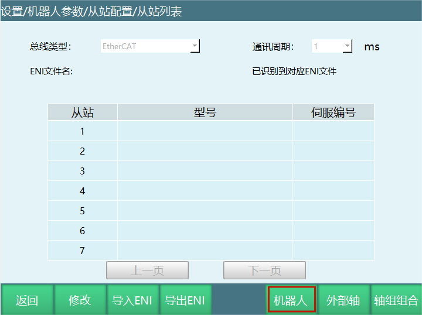

图2-1

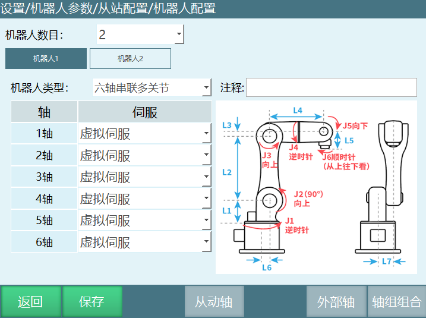
图2-2

3.  点击【修改】设置2个机器人，机器人类型选择六轴串联多关节，设置每个轴对应的伺服型号，点击【保存】，再点击提示框【确定】，重启系统。

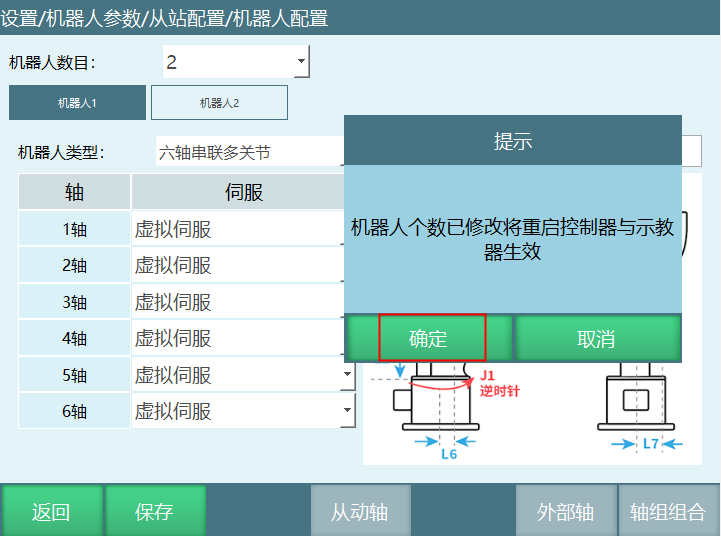

4.  重启系统后机器人个数修改成功。

5.  点击设置-机器人参数-运动参数，打开是否启用双机同步模式开关，打开开关双机模式设置成功。

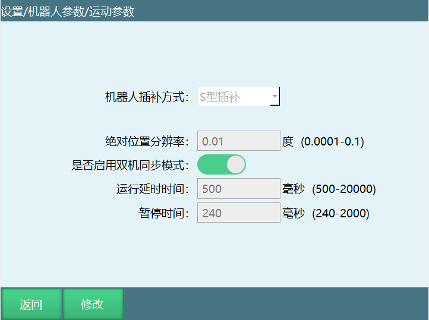

 **注释：**   
 

 - 关闭双机协作按钮，需要重启控制器系统；打开不需要重启。

 - 机器人个数大于2，重启时将自动关闭双机协作功能。

 - 双机模式不可与多机模式同时使用。                                     

 - 双机模式和外部轴不可以同时使用。 

### 双机模式导入配置

导入配置步骤：

1.  新建一个文件夹(configFile文件夹)。

2.  机器人1对应的六轴串联多关节配置文件Robot_A.json文件复制在此文件夹；机器人2对应的六轴串联多关节配置文件Robot_A.json文件复制在此文件夹，改名为Robot_B.json。

3.  U盘插入示教器的USB口，点击设置-系统设置-导入控制器配置，选择配置文件夹，点击【确定】。

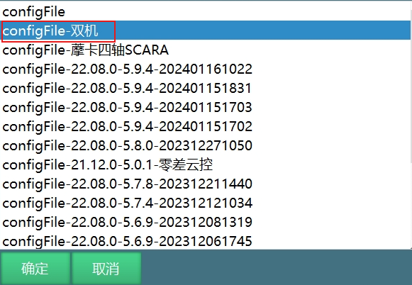

4.  选中2个参数配置文件后点击【确定】，配置文件上传成功后重启控制器。

5.  重启后查看机器人关节参数，DH参数是否导入成功，导入成功后就可以操作机器人。

### 双机模式插入指令

双机工作模式：机器人双机协作是由两台六轴串联机器人协同完成，在整个工作过程中，机器人之间互相协调，以完成最终的任务目标。

双机指令的介绍请参考指令手册章节：运动控制类。

问题：双机指令插入后如何示教点位？

解答：

1.  机器人1指令界面插入双机指令；

2.  点动机器人1到达目标点位；

3.  切换到机器人2，点动机器人2到达目标点位；

4.  在机器人1程序指令界面选中需要修改的指令点击【修改】，然后在参数定界面点击【当前位置设置为E点】，提示框弹出"是否继续修改点位",点击【确定】将当前位置存入目标变量，点击【取消】不会记录机器人当前点位到目标变量，可以继续移动机器人到想要的点位。

注：双机点到点，双机直线，双机圆弧和双机整圆指令只支持在机器人1插入。

下图第1部分表示机器人1当前位置和存入变量的位置，第2部分表示机器人2当前位置和存入变量的位置。

### 双机模式运行程序

作业文件编程结束后，首先在示教模式下单步运行指令，确认程序没有问题后切换到运行模式运行程序，点击"Robotall"进入多机模式机器人运行程序界面。如下图所示：

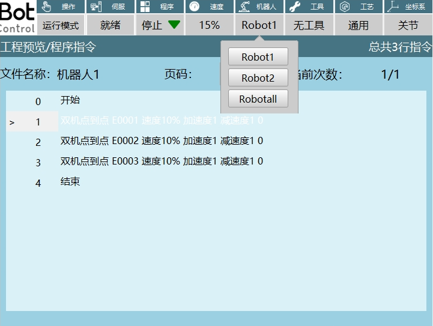

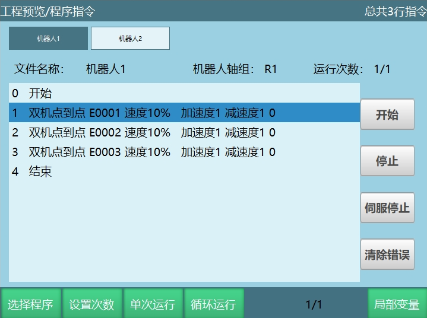

同时启动两个机器人，可以点击示教器上面的【启动】。

同时暂停两台机器的工作点击示教器上面的【停止】。

如果单独启动机器人1可以点击【机器人1】，然后点击图上所示的【开始】,机器人1开始工作，点击【停止】机器人1暂停工作。

单独启动机器人2首先点击【机器人2】，然后点击【开始】,机器人2开始工作，点击【停止】机器人2暂停工作。

其它参数的描述可参考多机模式运行程序。

## 复制参数

功能：将当前机器人的参数复制给其他机器人，点击复制参数选择源机器人和目标机器人，点击提示框里【确定】复制参数成功。

注意事项：

1.  复制参数不包括：机器人零点位置、从站配置、NP参数、伺服参数、协作机器人参数。

2.  机器人数目大于1时才可以使用复制参数功能。

3.  复制参数不能选择当前机器人，例如机器人1的参数只能选择机器人2、机器人3、机器人4复制。

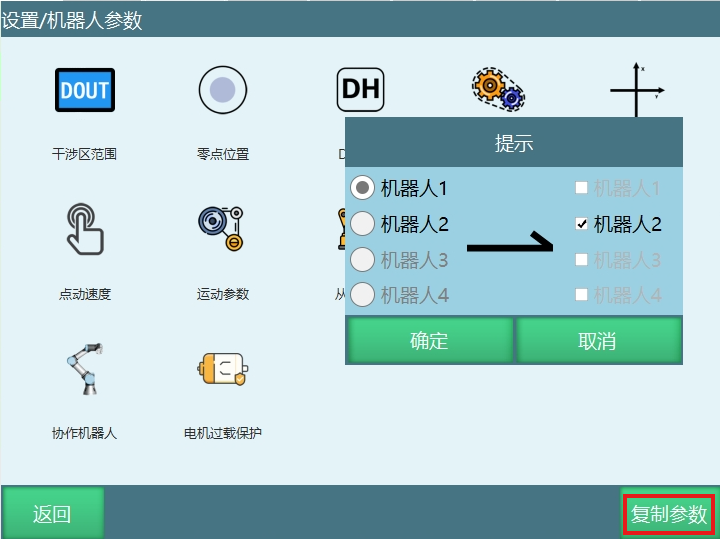

 ## AI 检索专用问答对 (Q&A for Retrieval)

**Q: 多机作业文件可以互相通用吗？**

A: ：不通用，切换机器人时作业文件会同步切换

**Q: 如何同时启动多台机器人？**

A: 切换到 Robotall 界面，按示教器上的【启动】键。

**Q3: 双机模式可以同时使用外部轴吗？**

A: 不可以，双机模式与外部轴不能同时使用。

**Q4: 双机模式可以同时使用外部轴吗？**

A: 不可以，双机模式与外部轴不能同时使用。