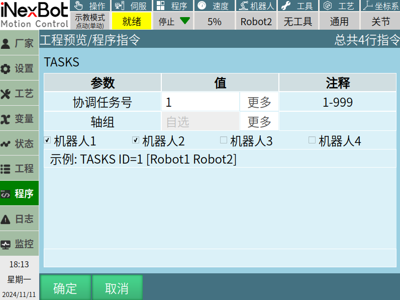
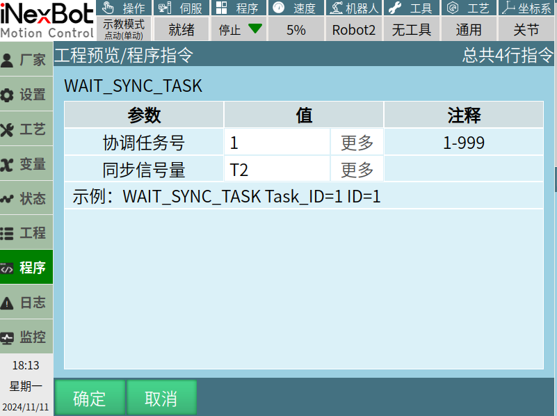
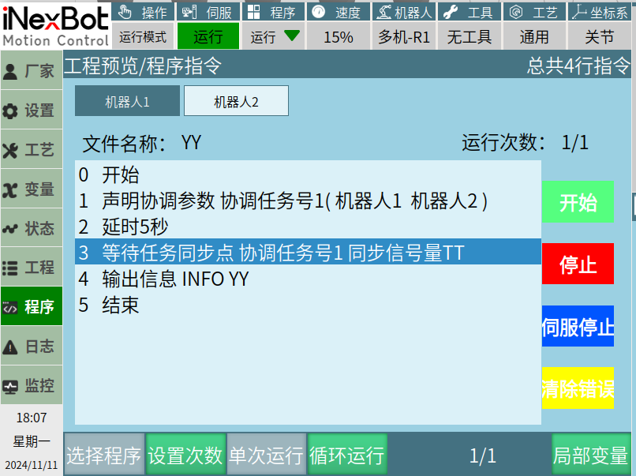
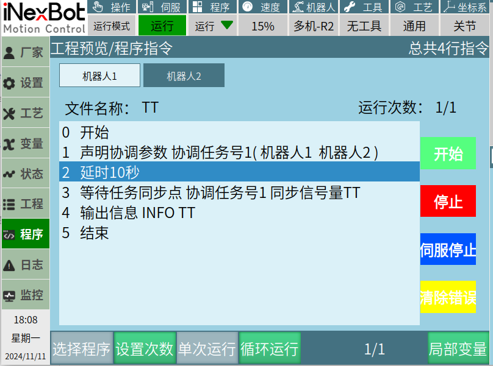
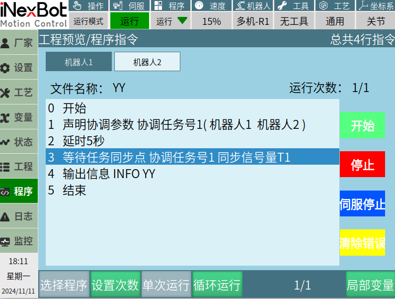
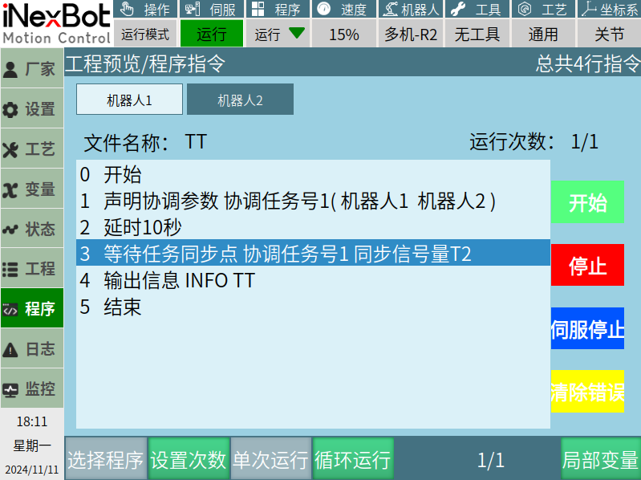

# 多机协调类指令

**环境：** 多机模式下，机器人之间的同步。

## task 指令（声明协调参数）

**参数：**

**协调任务号：** 范围1-999，可绑定整数型变量，也可选择手填。

**轴组：** 可选择自选或者绑定整数型变量。

1. 自选：点击下方机器人1、2、3、4，前的小方框，选中对应的机器人。

2. 绑定变量：选择机器人1，变量数值为1；选择机器人1、2，变量数值为3；选择机器人1、2、3，变量数值为7；选择机器人1、2、3、4，变量数值为15。（注：变量数值不对，运行指令则会报错。）

---

## wait_sync_task指令（等待任务同步点）

**协调任务号：** 范围1-999，可绑定整数型变量，也可选择手填。

**同步信号量：** 只能手填。范围：键盘所有字符。

## 示例：

1. 机器人1、2指令参数一致

多机模式，运行机器人1、2图片内作业文件，当机器人1运行到等待任务同步点指令的时候，机器人2未运行到等待任务同步点，机器人1会停留在等待任务同步点指令位置，一直到机器人2也运行到等待任务同步点指令，机器人1、2，才会继续向下运行。否则将会一直停留在等待任务同步点指令。

2. 机器人1、2指令参数不一致

机器人1等待任务同步点指令内同步信号量为T1，机器人2等待任务同步点指令内同步信号量为T2，机器人1、2同时或者先后运行到等待任务同步点指令，因为同步信号量不一致，所以机器人1、2会一直停留在等待任务同步点指令，不再往下运行。

## AI 检索专用问答对 (Q&A for Retrieval)

**Q: task指令的作用是什么？**

A: task指令用于声明协调参数，在多机模式下实现机器人之间的同步。

**Q: wait_sync_task指令的作用是什么？**

A: wait_sync_task指令用于等待任务同步点，在多机模式下实现机器人之间的同步等待。

**Q: wait_sync_task指令中的同步信号量有什么要求？**

A: 同步信号量只能手填，范围是键盘所有字符。

**Q: 多机协调指令的使用环境是什么？**

A: 多机协调指令需要在多机模式下使用，用于实现机器人之间的同步协调。
