# 工具手标定手册

## 工具手标定

法兰盘中心：默认工具坐标系的原点，法兰盘中心指向法兰盘定位孔方向为+X方向，垂直法兰向外为+Z方向，最后根据右手法则即可判定Y方向。新的工具坐标系都是相对默认的工具坐标系变化得的。

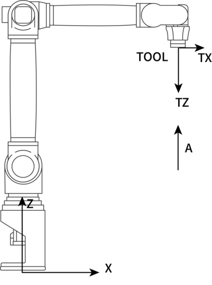

### 为什么要建立工具坐标系？

1.  机器人都有一个默认的工具坐标系Tool
    0：位置在法兰中心。但是机器人在实际运动中往往会在法兰中心安装吸盘（图一所示）、焊枪（图二所示）等工具。此时若机械手运动中心依然在法兰中心，会造成很大的不便。因此根据实际情况去示教需要的工具坐标系就很有必要。

例如：焊接时，需要在机器人末端（法兰中心）安装焊枪，用户通常把TCP点定义到焊丝的尖端。那么程序里记录的位置便是焊丝尖端的位置，记录的姿态便是焊枪围绕焊丝尖端转动的姿态。

2.  对于工业机器人，需要在末端法兰盘安装工具来进行作业。为了确定该工具的位姿，在安装的工件上上绑定一个工具坐标TCS
    (Tool Coordinate System)，TCS的原点就是TCP（Tool Center
    Point，工具中心点）。

思考
：我们知道工具坐标系是运动中的一个研究对象，但是它在实际调试过程中，又起到了什么作用呢？思考下图一、图二的手爪姿态和位置是如何调整得到的？

根据思考可以得出两个推测：

推测1：若图1中的手爪有一个旋转点，使手爪直接绕着这个旋转点选择就可以。

推测2：若图二中有一个手爪的前进方向就可以直接移动过去了。

结论：建立工具坐标系的作用：

1.  确立工具的TCP点（即工具中心点），方便调整工具状态。

2.  确定工具进给方向，方便工具位置调整。

工具坐标系特点：

新的工具坐标系是相对于默认的工具坐标系变化得到的，新的工具坐标系的位置和方向始终同法兰盘保持绝对的位置和姿态关系，但在空间上是一直变化的。

什么情况下需要使用工具手：需要用到绕X、绕Y、绕Z的姿态旋转时，需要进行工具手标定。

什么情况下无需使用工具手：机器人本身仅做Z轴姿态旋转，且工具末梢位于机器人6轴法兰中心延长线上；此时可以不设置工具手参数。

## 适用场景

机器人在工作时X、Y、Z轴需要绕着A、B、C姿态轴旋转时，就需要标定工具手，例如焊接工艺、打磨工艺、喷涂工艺等。

### 不同情景工具手标定方式的选择

1.  机器人已做过激光标定+使用焊枪。

推荐：使用6点标定工具手即可，标定完成验证机器人标定结果即可。

2.  机器人未做过激光标定+使用焊枪。

推荐：使用12点标定工具手即可，标定完成验证机器人标定结果即可。

3.  标定码垛夹抓。

推荐：优先选择直接填工具尺寸，不知道尺寸的再使用6点标定。

如何直接填写夹爪尺寸？

- 准备好夹抓长宽高的参数。

- 夹抓末梢在X轴上的偏移量填到"x轴方向偏移"。

注意：末梢位于直角X轴正方向上填正值。

- 夹抓末梢在Y轴上的偏移量填到"y轴方向偏移"。

注意：末梢位于直角Y轴正方向上填负值。

- 夹抓末梢在Z轴上的偏移量填到"z轴方向偏移"。

注意：末梢位于直角Z轴正方向上填负值。

- 保存后，验证工具手旋转A、B、C精度。

如何6点标定？

准备一尖状物体且可以被夹抓抓住，该物体尽可能放置到夹抓中心，然后找一个带有尖端的标定锥，根据6点标定的步骤进行工具手标定。

4.  机器人零点丢失，按照对位孔标定的零点位置有偏差。

推荐：准备标定工具，该工具末梢尽可能位于6轴法兰中心延长线上、工具尺寸较小。

使用20点标定，校准零点，20标定后再换上要实际用到的工具手进行6点标定。

5.  6点标定后A、B轴旋转误差较大满足不了使用需求。

推荐：更换7点标定。

### 工具手参数

点击设置---工具手标定进入工具手标定界面，如下图所示：

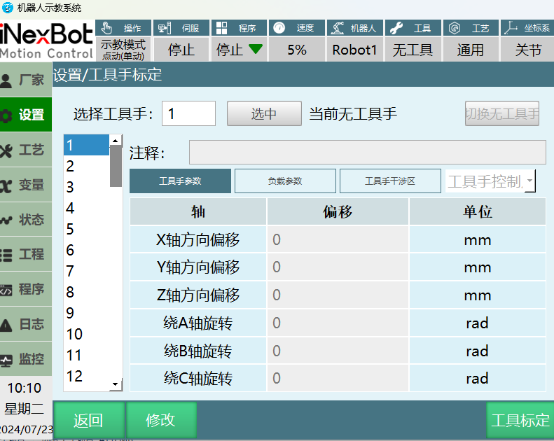

工具手参数：

| 轴 | 偏移 | 单位 |
| :--- | :--- | :--- |
| X轴 | 工具末端相对于法兰中心，沿直角坐标系X轴方向的偏移长度 | 毫米(mm) |
| Y轴 | 工具末端相对于法兰中心，沿直角坐标系Y轴方向的偏移长度 | 毫米(mm) |
| Z轴 | 工具末端相对于法兰中心，沿直角坐标系Z轴方向的偏移长度 | 毫米(mm) |
| A轴 | 工具末端相对于法兰中心，绕直角坐标系X 轴方向旋转角度 | 度/弧度(°/rad) |
| B轴 | 工具末端相对于法兰中心，绕直角坐标系Y 轴方向旋转角度 | 度/弧度(°/rad) |
| C轴 | 工具末端相对于法兰中心，绕直角坐标系Z轴方向的旋转角度 | 度/弧度(°/rad) |

有安装工具的详细参数：

1.  选择工具手编号，点击【修改】，然后填写安装的工具手参数；

2.  点击【确定】；

3.  点击【选中】，此时状态栏上面的工具栏显示的工具手号就是选中的工具号；

4.  在该界面下，用户可以直接填写工具末端偏移的相关参数，不需进行工具手标定。若更换工具手请重新填写；

无安装工具的详细参数（工具手标定）：

## 工具手标定方式

| 标定方式 | 功能 |
| :--- | :--- |
| 6点标定 | 校准工具手尺寸+姿态，标定结果旋转C轴精度较好 |
| 7点标定 | 校准工具手尺寸+姿态，标定结果旋转A、B轴精度较好 |
| 12点标定 | 校准零点2、3、4、5轴零点+工具手尺寸 |
| 15点标定 | 校准零点2、3、4、5轴零点+校准工具手尺寸+姿态 |
| 20点标定 | 校准零点2、3、4、5轴零点+工具手尺寸 |

### 6点标定

点击设置-进入工具手标定界面，点击【工具手标定】。

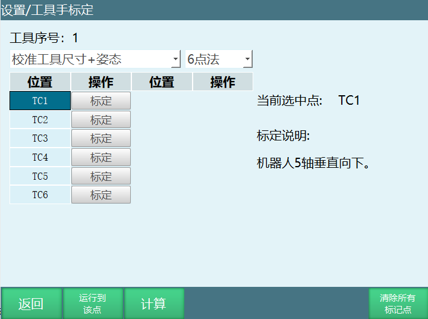

#### 标定步骤：

TC1标定:机器人5轴垂直向下

TC2标定：机器人在第一点的基础上C轴旋转180°

TC3标定：机器人在第一点的基础上B轴角度在35°

TC4标定：机器人回到零点，然后工具手末梢垂直

TC5标定：机器人在第四点的基础上动X-

TC6标定：机器人在第五点的基础上动Y+

【计算】：六个点标定结束后，点击"计算"会算出计算结果，如果计算结果大于1的话就需要重新标定。

【运行到该点】：选择标记的任意一点，点击"运行到该点"机器人会运行到选择的位置。

【清除所有标记点】：清除所有已标记的6个点位。

【返回】：返回"工具手标定"界面。

若在标定过程中对标定的某一点不满意，可以点击该行所对应的【取消标定】按钮，取消标定后再次标定该点。

何验证标定精度：

示教模式下，工具手标定的末梢对准标定锥，在尖端对准的情况下，选中标定的工具手参数，点动坐标系切换到直角，点动A、B、C轴，看尖端是否对准、偏了多少mm。

### 7点标定

点击设置-进入工具手标定界面，点击【工具手标定】。

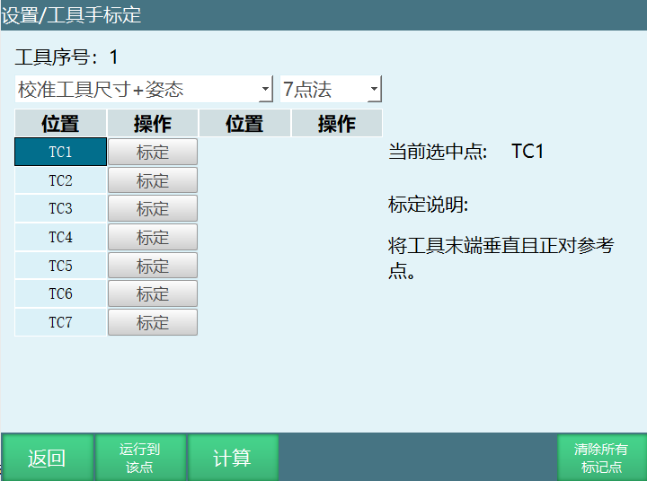

#### 标定步骤：

TC1：工具手末梢垂直对准参考点；

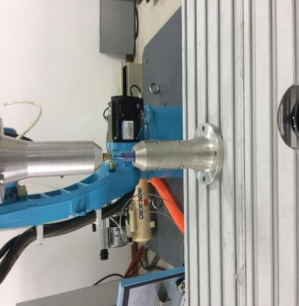

TC2标定：将机器人切换一个姿势，末端正对参考点；

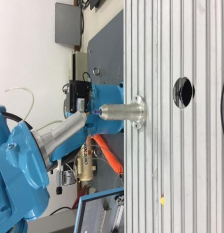

TC3标定：将机器人切换一个姿势，末端正对参考点；

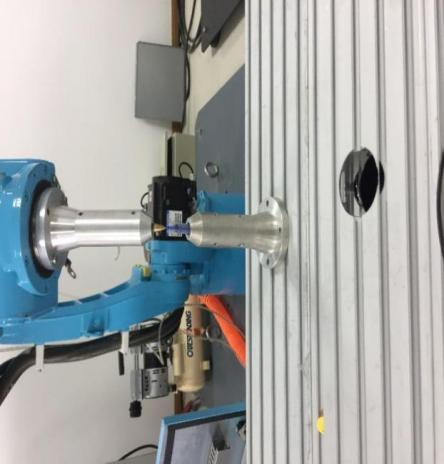

TC4标定：将机器人切换一个姿势，末端正对参考点；

TC5标定：将工具末端垂直且正对参考点（同TC1）；

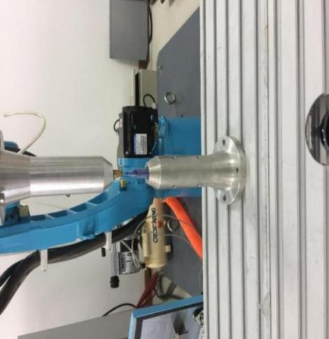

TC6标定：在TC5的基础上，沿笛卡尔坐标系X轴负方向移动任意距离；

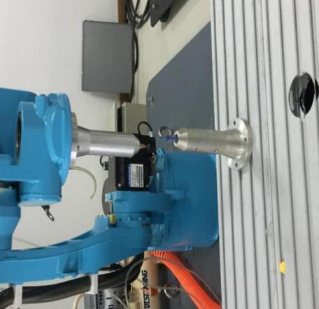

TC7标定：在TC6的基础上，沿笛卡尔坐标系Y轴正方向移动任意距离；

【计算】：七个点标定结束后，点击"计算"会算出计算结果，如果计算结果大于1的话就需要重新标定。

【运行到该点】：选择标记的任意一点，点击"运行到该点"机器人会运行到选择的位置。

【清除所有标记点】：清除所有已标记的7个点位。

【返回】：返回"工具手标定"界面。

若在标定过程中对标定的某一点不满意，可以点击该行所对应的【取消标定】按钮，取消标定后再次标定该点。

<table border="1" style="border-collapse: collapse;">
<tr><th style="background-color: #d3d3d3; text-align: center;">警告</th></tr>
<tr><td style="vertical-align: top; text-align: center; padding: 8px;"></td></tr>
<tr><td style="vertical-align: top; padding: 8px;">
进行数据量取前请将法兰盘平行于水平面！
</td></tr>
</table>

### 12点标定

12点标定结果只有工具手的XYZ轴方向偏移，无绕ABC旋转的数值。

点击设置-进入工具手标定界面，点击【工具手标定】。

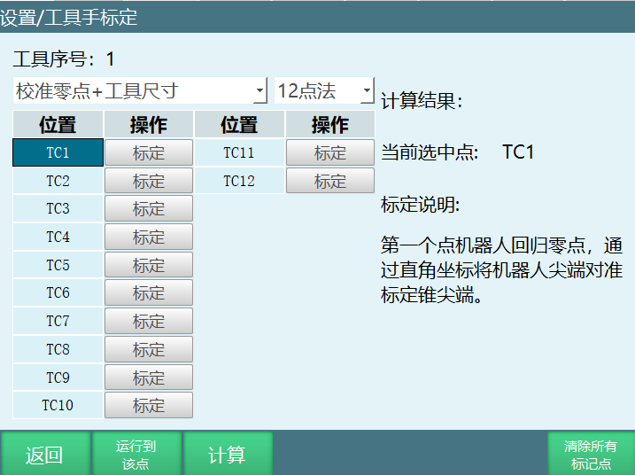

#### 标定步骤：

找到一个参考点（标定锥尖端为参考点），并确保此参考点固定。

TC1：第一个点机器人回归零点，通过直角坐标将机器人尖端对准标定锥尖端。

TC2：第二个点在第一个点的基础上，通过直角坐标系将C旋转180度；尖端对齐标定第二点。

TC3：第三个点机器人回归零点，通过直角坐标系将机器人尖端对准标定锥尖端；标定第三个点（与第一个点相同）。

TC4：第四个点在第三个点的基础上，通过直角坐标系做B-、度数位于30°-60°，尖端对齐标定第四个点。

TC5：第五个点在第四个点的基础上，通过直角坐标系做B+、J5\>-90°、将机器人尖端对准标定锥
尖端，标定第五个点。

TC6：选中第一个点，并将机器人移动到第一个点，在第一个点的基础上、通过直角坐标系做B+、J5\>-90°，尖端对齐标定第六个点。

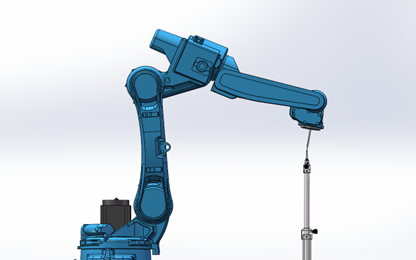

TC7：在第一个点的基础上，通过直角坐标系做B-、J5\>-90°，尖端对齐标定第七个点。

TC8：在第七个点的基础上，通过直角坐标系做A+、旋转90°、J5\>-90°，尖端对齐标定第八个点。

TC9：在第七个点的基础上，通过直角坐标系做A-、旋转90°、J5\>-90°，尖端对齐标定第九个点。

TC10：回到第一个点，通过关节坐标系点动五轴，使五轴向上、J5\<-90°、将尖端对齐，标定第十个点。

TC11：在第十点的基础上，通过直角坐标系做A+、旋转90°、J5\<-90°，尖端对齐标定第十一个点。

TC12：在第十点的基础上，通过直角坐标系做A-、旋转90°、J5\<-90°，尖端对齐标定第十二个点。

【计算】：标定完成后点击计算，计算出标定结果，如果计算出来的数值较大的话，就需要重新标定。

【取消标定】：若在标定过程中对某点标定后不满意，可以点击该行所对应的【取消标定】按钮，取消标定后再次标定该点。

【运行到计算结果位置】：机器人运行到修正零点后的零点位置。

【运行到该点】：选择标记的任意一点，点击"运行到该点"机器人会运行到选择的位置。

【将结果位置标为零点】：将标定补偿后的位置设置为当前机器人的零点位置。

【清除所有标定点】：清除已经标记的12个点位。

【返回】返回"工具手标定"界面。

### 15点标定

15点标定结果只有工具手的XYZ轴方向偏移，无绕ABC旋转的数值。

点击设置-进入工具手标定界面，点击【工具手标定】。

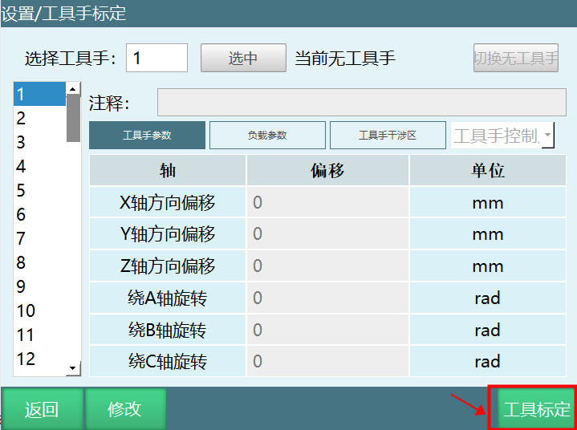

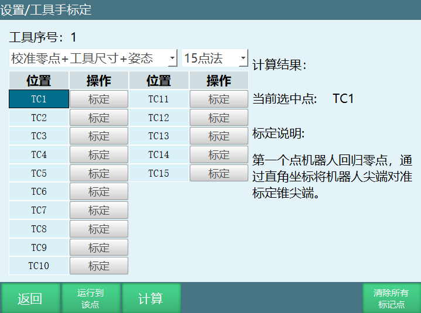

#### 标定步骤：

找到一个参考点（标定锥尖端为参考点），并确保此参考点固定。

TC1：第一个点机器人回归零点，通过直角坐标将机器人尖端对准标定锥尖端。

TC2：在第一个点的基础上，通过直角坐标系将C旋转180度，尖端对齐标定第二点。

TC3：机器人回归零点，通过直角坐标系将机器人尖端对准标定锥尖端，标定第三个点。

TC4：在第三个点的基础上，通过直角坐标系做B-、度数位于30°-60°、尖端对齐标定第四个点。

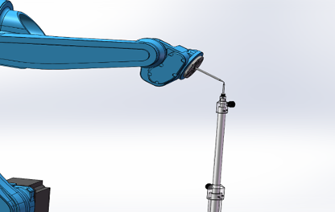

TC5：在第四个点的基础上，通过直角坐标系做B+、J5\>-90°、将机器人尖端对准标定锥尖端，标定第五个点。

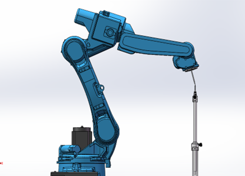

TC6：选中第一个点，并将机器人移动到第一个点，在第一个点的基础上，通过直角坐标系做B+，J5\>-90°,尖端对齐标定第六个点。

TC7：在第一个点的基础上，通过直角坐标系做B-、J5\>-90°，尖端对齐标定第七个点。

TC8：在第七个点的基础上，通过直角坐标系做A+、旋转90°、J5\>-90°，尖端对齐标定第八个点。

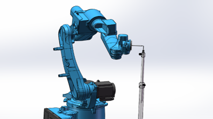

TC9：在第七个点的基础上，通过直角坐标系做A-、旋转90°、J5\>-90°，尖端对齐标定第九个点。

TC10：机器人回到第一个点，通过关节坐标系点动五轴使五轴向上，J5\<-90°，将尖端对齐标定第十个点。

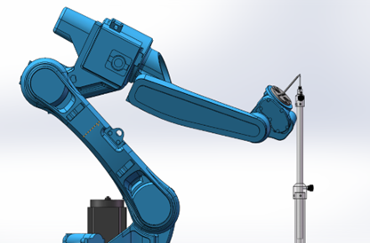

TC11：在第十点的基础上，通过直角坐标系做A+、旋转90°、J5\<-90°，尖端对齐标定第十一个点。

TC12：在第十点的基础上，通过直角坐标系做A-、旋转90°、J5\<-90°，尖端对齐标定第十二个点。

TC13：机器人回到零点位置，调整机器人姿态，使机器人末端工具尖端竖直朝下，将标定尖端与标定锥对齐，标定第十三个点。

TC14：在第十三点的基础上，通过直角坐标系做X-，机器人位移一段距离，直接点击标定第十四点。

TC15：在第十四点的基础上，通过直角坐标系做Y+，机器人位移一段距离，直接点击标定第十五点。

【计算】：标定完成后点击计算，计算出标定结果，如果计算出来的数值较大的话，就需要重新标定。

【取消标定】：若在标定过程中对某点标定后不满意，可以点击该行所对应的【取消标定】按钮，取消标定后再次标定该点。

【运行到计算结果位置】：机器人运行到修正零点后的零点位置。

【运行到该点】：选择标记的任意一点，点击"运行到该点"机器人会运行到选择的位置。

【将结果位置标为零点】：将标定补偿后的位置设置为当前机器人的零点位置。

【清除所有标定点】：清除已经标记的15个点位。

【返回】返回"工具手标定"界面。

### 20点标定

点击设置-进入工具手标定界面，点击【工具手标定】。

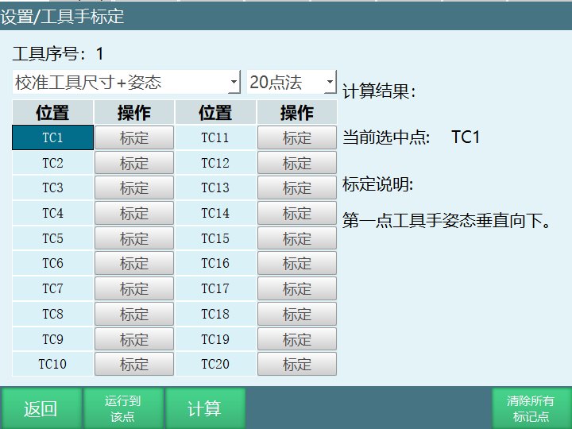

#### 标定步骤：

TC1：机器人工具手末端垂直参考点；

TC2：在第一点的基础上动A+；

TC3：在第一点的基础上动A+ 40度

TC4：在第一点的基础上动A+ 60度；

TC5：在第一点基础上动A- 20度；

TC6：在第一点基础上动A- 40度；

TC7：在第一点基础上动A- 60度；

TC8：在第一点基础上动B+ 20度；

TC9：在第一点基础上动B+ 30度；

TC10：在第一点基础上动B+ 40度；

TC11：在第一点基础上动B- 20度；

TC12：在第一点基础上动B- 30度；

TC13：在第一点基础上动B- 40度；

TC14：在第一点基础上动C+ 30度；

TC15：在第一点基础上动C+ 50度；

TC16：在第一点基础上动C+ 70度；

TC17：在第一点基础上动C+ 90度；

TC18：在第一点基础上动C- 30度；

TC19：在第一点基础上动C- 60度；

TC20：第二十点在第一点基础上动C- 90度。

【计算】：标定完成后点击计算，计算出标定结果，如果计算出来的数值较大的话，就需要重新标定。

【取消标定】：若在标定过程中对某点标定后不满意，可以点击该行所对应的【取消标定】按钮，取消标定后再次标定该点。

【运行到计算结果位置】：机器人运行到修正零点后的零点位置。

【运行到该点】：选择标记的任意一点，点击"运行到该点"机器人会运行到选择的位置。

【将结果位置标为零点】：将标定补偿后的位置设置为当前机器人的零点位置。

【清除所有标定点】：清除已经标记的15个点位。

【返回】返回"工具手标定"界面。
<table border="1" style="border-collapse: collapse;">
<tr><th style="background-color: #d3d3d3; text-align: center;">注意</th></tr>
<tr><td style="vertical-align: top; text-align: center; padding: 8px;"></td></tr>
<tr><td style="vertical-align: top; padding: 8px;">
进行数据量取前请将法兰盘平行于水平面！ 
标定过程中请保持参考点固定，否则标定误差增大</td></tr>
</table>

### 如何验证标定精度

示教模式下，工具手标定的末梢对准标定锥，在两个尖端对准的情况下，选中标定的工具手工具手编号，然后在直角坐标系下点动A、B、C轴，看尖端是否对准、偏了多少mm。
 
# QA

| 问题 | 回答 |
| :--- | :--- |
| 什么是工具坐标系？ | 工具坐标系是机器人末端工具的坐标系，原点是TCP（工具中心点），用于确定工具的位姿。 |
| 为什么要建立工具坐标系？ | 1. 确立工具的TCP点，方便调整工具状态；2. 确定工具进给方向，方便工具位置调整。 |
| 什么情况下需要使用工具手标定？ | 需要用到绕X、绕Y、绕Z的姿态旋转时，需要进行工具手标定，例如焊接工艺、打磨工艺、喷涂工艺等。 |
| 什么情况下无需使用工具手？ | 机器人本身仅做Z轴姿态旋转，且工具末梢位于机器人6轴法兰中心延长线上；此时可以不设置工具手参数。 |
| 如何选择工具手标定方式？ | 1. 已做过激光标定+使用焊枪：使用6点标定；2. 未做过激光标定+使用焊枪：使用12点标定；3. 标定码垛夹抓：优先选择直接填工具尺寸；4. 零点丢失：使用20点标定；5. 6点标定后A、B轴旋转误差大：使用7点标定。 |
| 如何直接填写夹爪尺寸？ | 准备好夹抓长宽高的参数，将夹抓末梢在X、Y、Z轴上的偏移量分别填到对应的偏移字段中，注意X轴正方向为正值，Y、Z轴正方向为负值。 |
| 6点标定的步骤是什么？ | 1. TC1：机器人5轴垂直向下；2. TC2：在第一点基础上C轴旋转180°；3. TC3：在第一点基础上B轴角度在35°；4. TC4：机器人回到零点，工具手末梢垂直；5. TC5：在第四点基础上动X-；6. TC6：在第五点基础上动Y+；最后点击计算。 |
| 如何验证标定精度？ | 示教模式下，工具手标定的末梢对准标定锥，在尖端对准的情况下，选中标定的工具手参数，点动坐标系切换到直角，点动A、B、C轴，看尖端是否对准、偏了多少mm。 |
