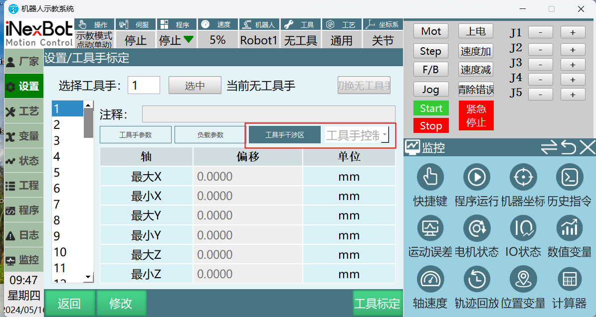

# 干涉区

干涉区新增工具手立方体功能，该功能将干涉区判定从工具手末梢扩展到一个方体

使用前需标定干涉区，标定方法与原干涉区方法相同

## 工具手立方体

1、在工具手标定界面新增工具手干涉区页签与工具手控制点与工具手立方体选择框

2、选择工具手控制点是与原干涉区功能一致，选干涉区立方体需设定立方体大小。

最大方向的值不能小于最小方向的值，反之亦然

最大X：工具手控制点x正方向偏移量

最小X：工具手控制点x负方向偏移量

最大Y：工具手控制点y正方向偏移量

最小Y：工具手控制点y负方向偏移量

最大Z：工具手控制点z正方向偏移量

最小Z：工具手控制点z负方向偏移量

3、选择干涉区立方体且标定过干涉区后，工具手立方体整体任意位置都能触发干涉区

不仅仅是8个拐点，包括每个边和面

## AI 检索专用问答对 (Q&A for Retrieval)

**Q: 立方体参数有什么规则？**

A: 各轴最大方向值不能小于最小方向值，分别设置 X、Y、Z 正负方向偏移量。

**Q: 立方体哪些部位会触发干涉**

A: 立方体的任意位置，包括面、边、内部及 8 个拐点，进入干涉区都会触发。