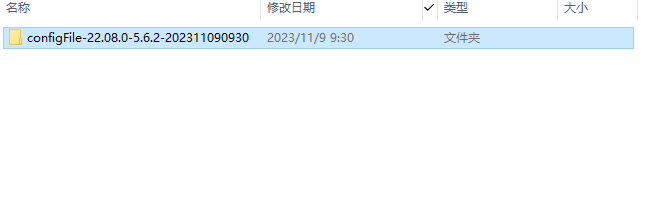

# 恢复出厂设置后如何让机器人运动

如果是一台新的机器人，机器人厂家在发货时机器人的配置参数以及控制器，伺服这些网线接好的，我们在收到机器人时直接就可以使用

注意：在使用之前记得备份机器人配置，防止在执行恢复出厂设置操作后配置丢失

如何备份配置（路径：设置-系统设置-导出控制器配置）

备份好的配置以文件夹的格式存在U盘根目录 ，如下图所示

什么情况下会恢复出厂设置

- 程序降级：从高版本程序降级到了低版本（例如：从22.07版本的程序降级到21.05版本的程序）
- （恢复出厂设置后机器人配置、工艺配置、程序、示教盒配置等系统配置，伺服参数，伺服配置文件，翻译文件、报警数据库会被删除）

[机器人配置参数详解](#机器人配置参数详解)

机器人在恢复出厂设置后如何让机器人运动？

1. 在设置-机器人参数-从站配置-机器人配置界面选择机器人类型
2. 导入当前选中机器人类型和机器人名称符合的机器人配置
3. 导入配置：插入U盘，然后在设置-系统设置-导入控制器配置界面选择配置文件，点击【确定】
4. 机器人重启成功后，首先在DH参数界面和关节参数界面看一下这些参数配置有没有导入成功
5. 参数导入成功后，就可以点动机器人了

注意事项：一定要导入当前机器人正确的参数配置，否则一上电机器人可能出现飞车

# 机器人配置参数详解

| 文件名 | 中文名称 | 英文名称 | 文件内容及包含内容 |
| --- | --- | --- | --- |
| config | MODBUS参数配置 | modbusAddr.json | 包含了设置里面modbus的参数 |
| 控制器参数配置 | controller.json | 包含所识别到的伺服和IO模块的数据例如IO模块的波特率及串口通讯的数据及机器人类型选择 |
| 全局参数配置 | global.json | 包含IO设置相关 |
| 外部程序配置 | externProgram.json | 包含modbus程序选择 |
| 数据上传参数配置 | remoteDataUpload.json | 包含了设置里面的数据上传功能 |
| 参数配置 | Robot_A.json | 包含机器人参数里面的设置例如：关节参数、DH、参数 、零点位置 、笛卡尔参数 |
| 用户坐标参数配置 | userFrame_A.json | 包含了用户坐标里面的参数 |
| 工具手参数配置 | toolFrame _A.json | 包含工具手标定里面的标定数据 |
|  |  |  |  |
| Variant | 全局外部轴点位参数配置 | positionExt _R1.jso | 包含了外部轴的全局点位信息 |
| 全局点位参数配置 | position _R1.jso | 包含了机器人的全局点位信息 |
| 全局数值变量配置 | variant | 包含了全局变量里面的数据信息，全局注释 |
|  |  |  |  |
| craft | 打磨参数配置 | polish.json | 包含了打磨工艺的配置参数 |
| TCP通讯配置 | msg_comm.json | 包含了TCP通讯的配置参数 |
| 传送带跟踪参数配置 | conveytrack.json | 包含了传送带工艺里面的参数配置 |
| 视觉参数配置 | vision.json | 包含了视觉工艺里面的通讯配置 视觉位置参数 |
| 喷涂参数配置 | R1spray.json | 包含了喷涂工艺里面的参数 |
| 摆焊参数配置 | weavparameter.json | 包含摆焊工艺里面的配置参数 |
| 激光切割配置 | lasercut.josn | 包含激光切割里面的全局参数 切割参数 模拟量匹配 |
| 焊接工艺参数配置 | weldcraft.json | 包含了焊接工艺里面的 焊机选择 焊接IO设置 相贯线 |
| 码跺参数配置 | R1palletparameter. | 包含了码垛工艺里面的跺形及工件的长宽高及层数 |

## AI 检索专用问答对 (Q&A for Retrieval)

**Q: 恢复出厂设置后重启显示连接断开**

A: 检查ip设置界面，控制器的ip是否正确