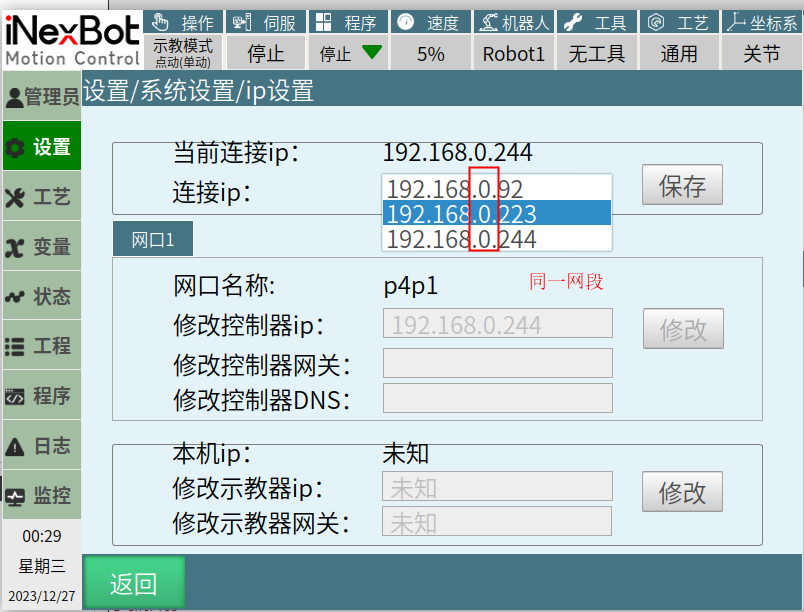
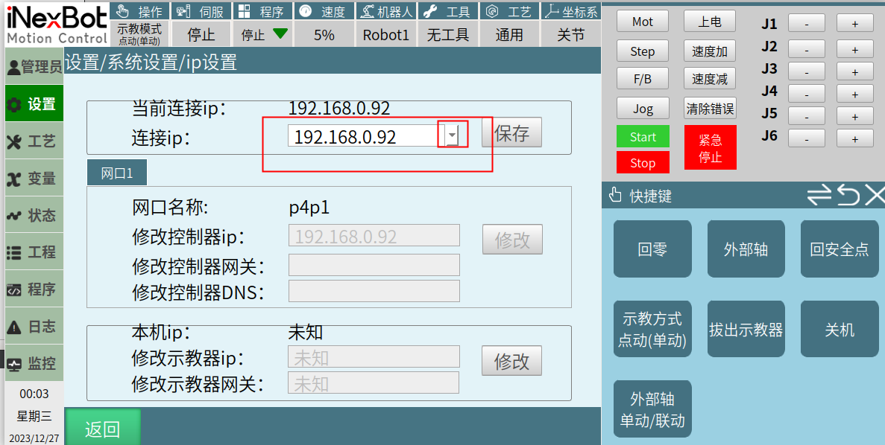
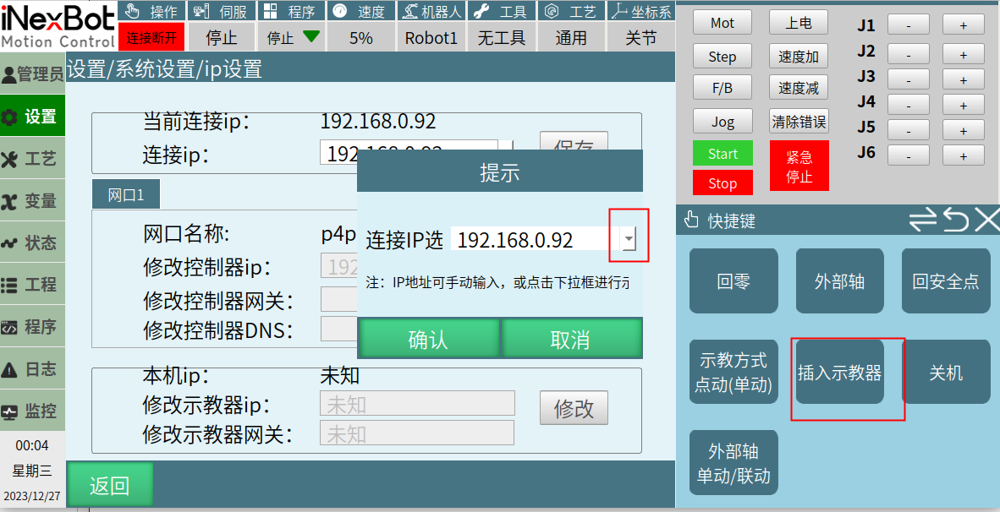
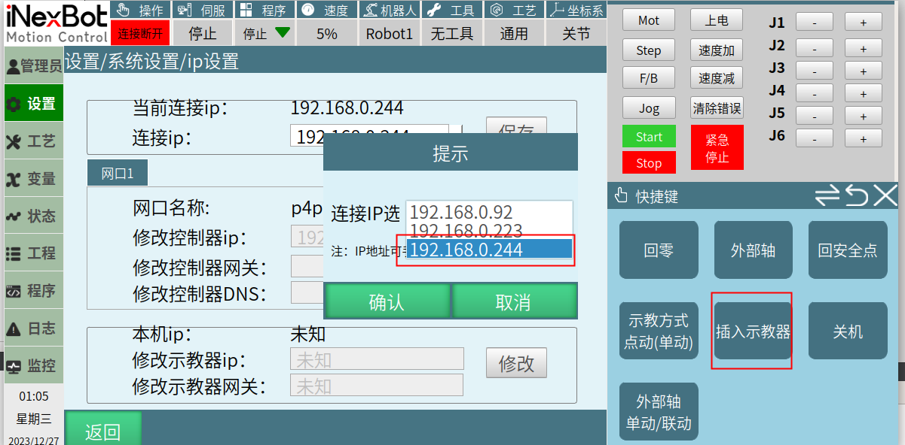

# 扫描IP功能

## 扫描IP功能：控制器可以扫描到在同一个局域网内且同一网段的控制器IP

（该功能在第一次扫描时有延迟：T30版本延迟3-4秒，linux桌面版延时7秒）

在原IP界面和插入示教的IP界面新增了IP扫描功能，可以扫描到同一局域网内（即：连接在同一个交换机/集线器/路由器上），且同一网段的控制器IP

## 具体实现(有两个界面可以实现扫描IP功能)：

### 在IP设置界面

点击修改IP，再点击出现的下拉框等待3-4秒，即可扫描到同一网段同一局域网内的其他控制器的IP，等待搜索完成，以IP最后一位大小进行排序显示，选中搜索出来的IP，则更新到文本框中，文本框原有输入功能不变，可以输入IP地址进行连接，其余机制保持不变。

### 在插入示教器界面,点击示教器时弹出弹框

1、文本框原有输入功能不变，可以输入IP地址进行连接。

2、可以点击下拉框弹窗下拉界面，会搜索示教盒网段下6002端口地址，等待搜索完成，以IP最后三位数字大小进行排序显示，选中搜索出来的IP，则更新到文本框中，点击确认之后开始连接。

### 适用场景：

一台示教器在多台控制器之间切换IP（在同一局域网内），或多台示教器和多台控制器在同一局域网内进行IP切换
