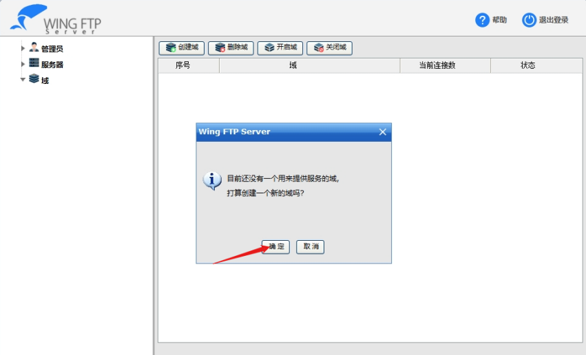
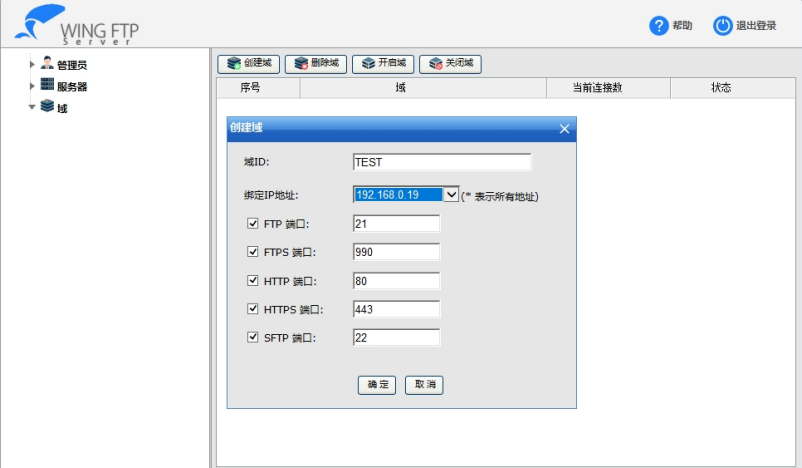
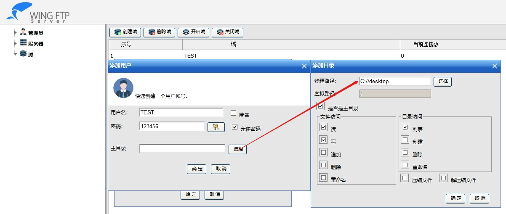
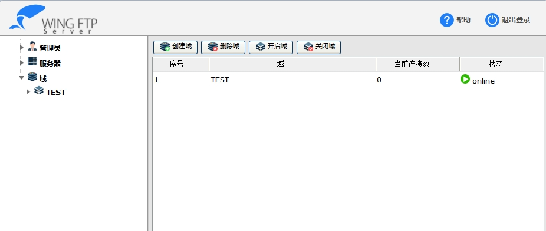
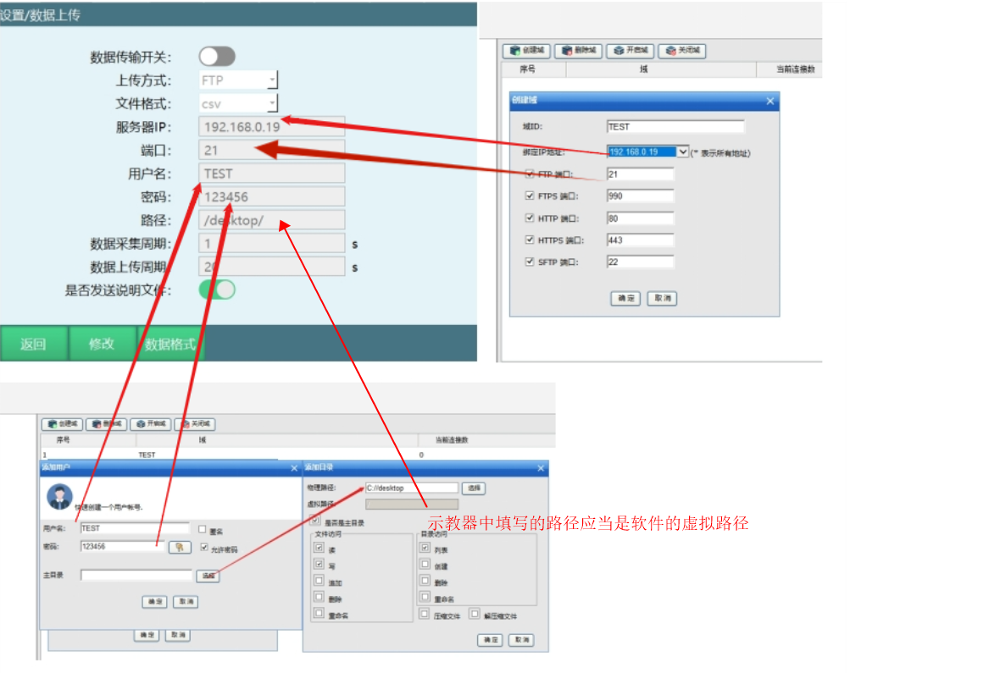
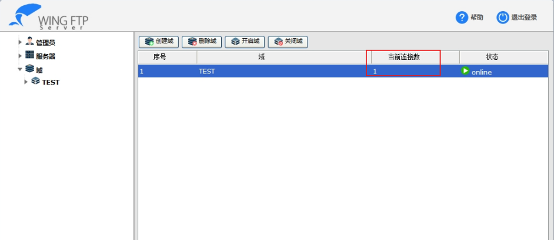
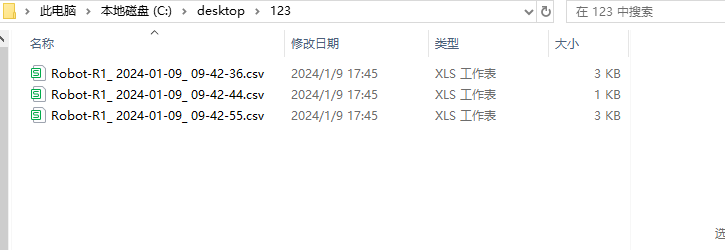

# 数据上传

数据上传功能可以定时自动采集并上传当前机器人运行状态、参数，并将数据整合成csv、txt文件上传到指定服务器。

# 环境准备

- 安装FTP服务器

- 登录FTP服务器

- 创建一个域

域ID：由用户自己创建。

绑定的IP地址：本机ipv4地址，选择好点击确定

# 创建用户

用户名：由用户定义名称。

密码：由用户定义密码。

主目录：点击选择，物理路径就是文件上传上来储存的目录，点击选择想要存储的路径，下面选择是权限设置，建议全选（直接最高权限即可），最后点击确定，配置完成。

## 设置数据上传参数

服务器IP，端口，用户名，密码必须一致。

路径是指在ftp选择路径后再建一个目录，例如：FTP选择的主目录为D://，示教盒数据上传路径为/robot/
则文件存储路径为 D://robot/。

数据传输开关：打开后则开始连接ftp服务器并上传数据。在所有参数填写好之后再打开该开关，开关打开后，开机将自动开始采集并上传数据。

上传方式：当前仅支持ftp协议。所以在使用本功能之前请先拥有一个ftp服务器。

文件格式：当前支持csv与txt格式。其文件内容相同，文件格式不同。csv格式更方便进行数据的统计。

服务器IP：ftp服务器的ip地址，请保证本控制器与ftp服务器在同一个网络内，保证其网关相同（控制器网关在设置-系统设置-IP设置内进行查看和修改）。

端口：ftp服务器的ftp协议所使用的端口。一般的ftp协议使用的默认端口为21。

用户名：登录ftp服务器所使用的用户名。需先在ftp服务器处创建好一个用户。

密码：登录ftp服务器所使用的密码。

路径：文件上传到ftp服务器的路径。本路径是相对于ftp根目录的路径。

数据采集周期：根据设定的时间，每隔一定时间，控制器采集一次当前数据并存入要发送的文件中。

数据上传周期：根据设定的时间，每隔一定时间，控制器将已采集好数据的文件发送到ftp服务器指定的目录下。

是否发送说明文件：说明文件在开机或打开【数据传输开关】后第一次发送数据文件前发送。内容可自定义，一般用来说明当前机器人的序号等信息。若本开关关闭，则不发送说明文件。

配置完成后再配置想要发送的数据格式，数据格式配置完成后，打开数据传输开关即可自动传输。

连接成功后当前连接数会变成1。

数据格式：

配置好ftp的连接相关参数后则需要配置发送的数据文件中的数据格式。在设定数据格式时使用特殊字符串代表所需要发送的参数。例如要发送当前的日期，格式如下"2024-01-01"，则需在数据格式中填写如下："\$Y%-\$m%-\$d%"（不包括引号）。

例如：生成csv文件（以下数据内容仅作示例说明，无任何实际意义）

希望得到的结果如下：

说明文档文件名：Robot-R1_年-月-日_时-分-秒。

说明文档内容：Robot-R1，年-月-日，时：分：秒、本机IP、本机MAC、1轴电机转速、2轴电机转速、3轴电机转速、4轴电机转速、5轴电机转速、6轴电机转速、1轴电机扭矩、2轴电机扭矩、3轴电机扭矩、4轴电机扭矩、5轴电机扭矩、6轴电机扭矩、1轴电机负载、2轴电机负载、3轴电机负载、4轴电机负载、5轴电机负载、6轴电机负载

数据文档文件名：Robot-R1_年-月-日_时-分-秒。

数据内容：Robot-R1，年-月-日，时:分:秒、本机IP、本机MAC、1轴电机转速、2轴电机转速、3轴电机转速、4轴电机转速、5轴电机转速、6轴电机转速、1轴电机扭矩、2轴电机扭矩、3轴电机扭矩、4轴电机扭矩、5轴电机扭矩、6轴电机扭矩、1轴电机负载、2轴电机负载、3轴电机负载、4轴电机负载、5轴电机负载、6轴电机负载

所编写的数据格式如下：

说明文档文件名：Robot-R1\_ \$Y%-\$m%-\$d%\_ \$H%-\$M%-\$S%。

说明内容：

Robot-R1,\$Y%-\$m%-\$d%,\$H%:\$M%:\$S%,\$IP%,\$MAC%,\$RPM_J1%,\$RPM_J2%,\$RPM_J3%,\$RPM_J4%,\$RPM_J5%,\$RPM_J6%,\$Torsion_J1%,\$Torsion_J2%,\$Torsion_J3%,\$Torsion_J4%,\$Torsion_J5%,\$Torsion_J6%,\$Load_J1%,\$Load_J2%,\$Load_J3%,\$Load_J4%,\$Load_J5%,\$Load_J6%

数据文档文件名：Robot-R1\_ \$Y%-\$m%-\$d%\_ \$H%-\$M%-\$S%。

数据内容：

Robot-R1,\$Y%-\$m%-\$d%,\$H%:\$M%:\$S%,
\$IP%,\$MAC%,\$RPM_J1%,\$RPM_J2%,\$RPM_J3%,\$RPM_J4%,\$RPM_J5%,\$RPM_J6%,\$Torsion_J1%,\$Torsion_J2%,\$Torsion_J3%,\$Torsion_J4%,\$Torsion_J5%,\$Torsion_J6%,\$Load_J1%,\$Load_J2%,\$Load_J3%,\$Load_J4%,\$Load_J5%,\$Load_J6%

## 注意事项

1.  涉及轴的参数需要手动输入哪个轴，如1轴转速：\$RPM_J%需要在J后面写1

2.  文件的命名规则：文件名称中不能包含 \\ / : \* ? \" \< \>  \|
    9个特殊字符。

3.  如果上传方式为csv格式，每一项之间要用英文逗号","分割。

生成的文件：生成的文件根据创建的路径保存

---

# 常见问题与解答

## 1. FTP服务器连接失败怎么办？

**问题**：数据上传功能无法连接到FTP服务器。

**解答**：
- 检查FTP服务器是否正常运行
- 确认服务器IP地址、端口、用户名和密码是否正确
- 确保控制器与FTP服务器在同一网络内，网关设置相同
- 检查防火墙是否阻挡了FTP连接
- 验证FTP服务器的用户权限是否正确设置

## 2. 数据上传文件格式如何选择？

**问题**：不知道应该选择CSV还是TXT格式。

**解答**：
- CSV格式：更方便进行数据的统计和分析，适合使用Excel等表格软件打开
- TXT格式：纯文本格式，通用性强，适合简单查看
- 两种格式的文件内容相同，只是文件格式不同，可根据实际需求选择

## 3. 数据采集周期和上传周期如何设置？

**问题**：不知道如何设置合适的数据采集周期和上传周期。

**解答**：
- 数据采集周期：根据需要的实时性设置，一般建议1-5秒
- 数据上传周期：根据网络带宽和存储需求设置，一般建议1-5分钟
- 采集周期不宜过短，否则会增加控制器负担；上传周期不宜过长，否则会导致数据延迟

## 4. 如何自定义数据格式？

**问题**：需要自定义数据上传的格式。

**解答**：
- 使用特殊字符串代表所需要发送的参数，如`$Y%`表示年份，`$m%`表示月份
- 参考文档中的示例格式，根据实际需要修改
- 注意文件命名规则，不能包含特殊字符：`\ / : * ? " < > |`
- 如果上传方式为csv格式，每一项之间要用英文逗号","分割

## 5. 如何验证数据上传是否成功？

**问题**：不确定数据是否成功上传到FTP服务器。

**解答**：
- 查看数据上传参数设置界面中的"当前连接数"，连接成功后会显示为1
- 检查FTP服务器指定路径下是否生成了数据文件
- 查看生成的文件内容是否符合预期格式
- 检查控制器日志，确认是否有上传失败的记录

## 6. 数据上传功能会影响机器人正常运行吗？

**问题**：担心数据上传会影响机器人的正常运行。

**解答**：
- 数据上传功能设计为低优先级任务，不会影响机器人的正常运行
- 采集数据的过程是快速的，不会占用太多控制器资源
- 上传数据的过程是在后台进行的，不会干扰机器人的运动控制
- 建议合理设置采集和上传周期，避免过于频繁的操作

## 7. 如何修改数据上传的路径？

**问题**：需要修改数据上传到FTP服务器的路径。

**解答**：
- 在数据上传参数设置中修改"路径"参数
- 路径是相对于FTP根目录的路径，例如：若FTP根目录为D://，路径设置为/robot/，则文件存储路径为D://robot/
- 修改路径后，需要确保FTP服务器上存在该目录，或设置FTP服务器自动创建目录

## 8. 如何发送说明文件？

**问题**：需要发送说明文件，包含机器人的基本信息。

**解答**：
- 在数据上传参数设置中，打开"是否发送说明文件"开关
- 说明文件在开机或打开【数据传输开关】后第一次发送数据文件前发送
- 内容可自定义，一般用来说明当前机器人的序号等信息
- 说明文件的格式可以在数据格式设置中配置

## 9. 数据上传功能支持哪些参数？

**问题**：想知道数据上传功能支持哪些参数。

**解答**：
- 时间参数：年($Y%)、月($m%)、日($d%)、时($H%)、分($M%)、秒($S%)
- 网络参数：IP地址($IP%)、MAC地址($MAC%)
- 轴参数：转速($RPM_J1%)、扭矩($Torsion_J1%)、负载($Load_J1%)等
- 其他参数：可根据实际需求在数据格式中配置

## 10. 如何排查数据上传问题？

**问题**：数据上传功能出现问题，不知道如何排查。

**解答**：
- 检查网络连接是否正常
- 验证FTP服务器设置是否正确
- 查看控制器日志，了解具体错误信息
- 检查数据格式设置是否正确
- 尝试使用简单的格式进行测试
- 确认FTP服务器的存储空间是否充足
