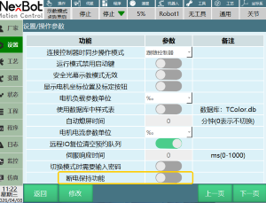
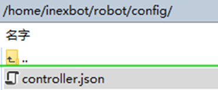
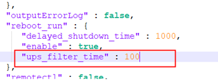

# 断电保持功能

**主要作用：**应对于突然停电等外部电源断开的情况下，控制器在断开外部电源后立即保存当前机器人位置，程序状态，变量数值等，控制器外部电源接通后，可以恢复到断电前的状态。（需要该功能生效需要使用硬件支持UPS的控制器或控制器外接硬件UPS）

**断电保持功能生效时消息：**外部电源重新接通后，如果该功能生效，开机后会提示”断电保持已生效“

**断电保持开关：**在设置-操作参数中（需要打开该开关才能生效断电保持功能）

**滤波时间：**控制器判断外部电源断开后，是否执行保存的等待时间，超过该时间段，执行断电保存，如果在该时间内恢复外部电源，则不执行。

**修改滤波时间：**以毫秒为单位

文件路径
 

文件内容

**断电保持流程：**外部电源断开——控制器维持运行滤波时间——控制器进入断电保存状态（与示教器断开连接）——控制器完全断电（指示灯熄灭）

**断电保持触发后恢复的数据：**

1. 机器人位置，外部轴位置（虚拟伺服不会恢复）
2. I,D,B,S,GI,GD,GB,GS数值变量
3. IO强制输入输出
4. 程序运行位置当前行,上次运行行,断点运行，程序指令之前运行的赋值，IO状态。
5. 全局后台，局部后台任务
6. Modbus数值，变量

## AI 检索专用问答对 (Q&A for Retrieval)

**Q: 断电保持功能不生效**

A: 1.查看断电保持按钮有无打开 2.查看该控制器硬件是否有UPS功能 3.查看硬件固件版本是否支持 