# 新双机功能

## **首先设置两个机器人（不同类型的也可以）**

## 双机联动模式配置

1.  联动模式需要机器人1和机器人2分别标定工具手

2.  设置/机器人参数/校准大地坐标系

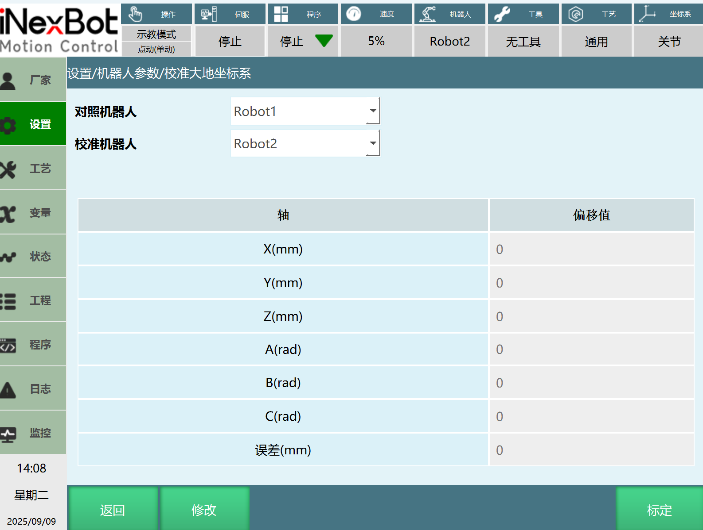

对照机器人：作为参照，一般为主机。

校准机器人：以对照机器人为参考进行校准，一般为从机。

误差：误差一般不超过10，否则需要重新标定。

3.  点击【标定】进入标定界面

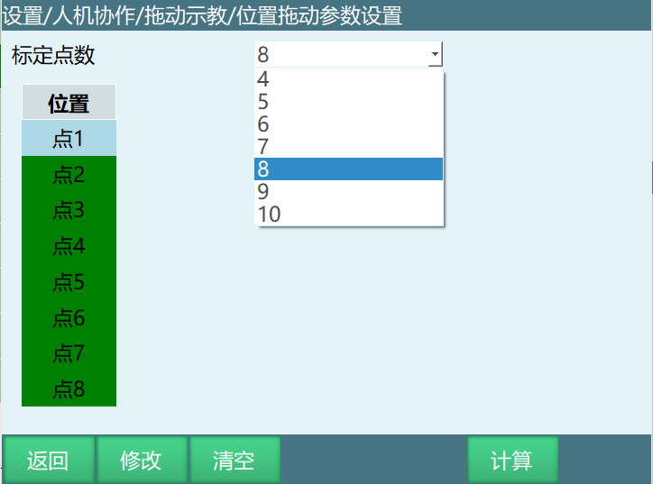

修改：点击修改进行标定

清空：清空标定参数

计算：计算标定结果

注意：标定变为选取一般6个或者9个， 就是x,y,z平均，如x 动3次， y动3次，
z动3次 就是9个，理论上点越多越准

4.  标定完成之后，在校准机器人的设置/用户坐标标定界面，【类型】选择【联动坐标系】、【机器人】，编号选择【1】

设置为联动坐标系的用户坐标为联动模式，选择其他设置静态坐标系的则为单机模式

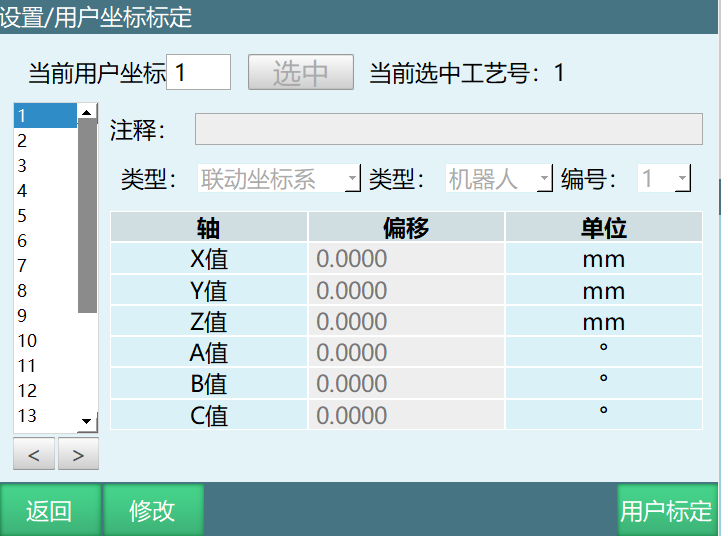

5.  设置好之后切换到机器人1，上电进行点动机器人1，此时机器人2也会跟着机器人1运动

> 联动模式下运行，机器人2会在走示教轨迹的基础上跟随机器人1的轨迹方向运动
>
> 联动模式下机器人运行效果如图

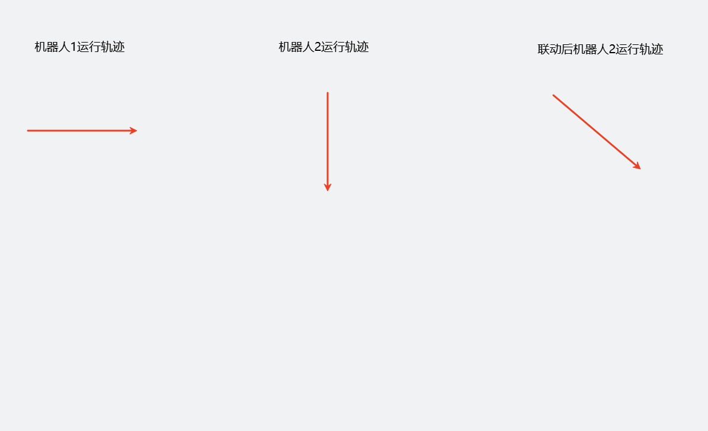

## 运行模式联动

> 前置条件：机器人1为对照机器人，机器2为校准机器人

1.  创建Robot1和Robot2作业文件

2.  机器人1中插入运动类指令。

3.  机器人2中插入切换用户坐标（切换的坐标为联动用户坐标。）

> 因为此时机器人2中切换用户坐标会立刻执行掉，机器人2会结束程序，可用三种方式保持和机器1的联动。

a.  机器人2开启循环模式

b.  预估机器人1运动时间，加延迟指令

c.  用多机协调类指令，在机器人1，2中都插入等待同步点。

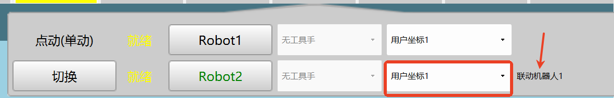

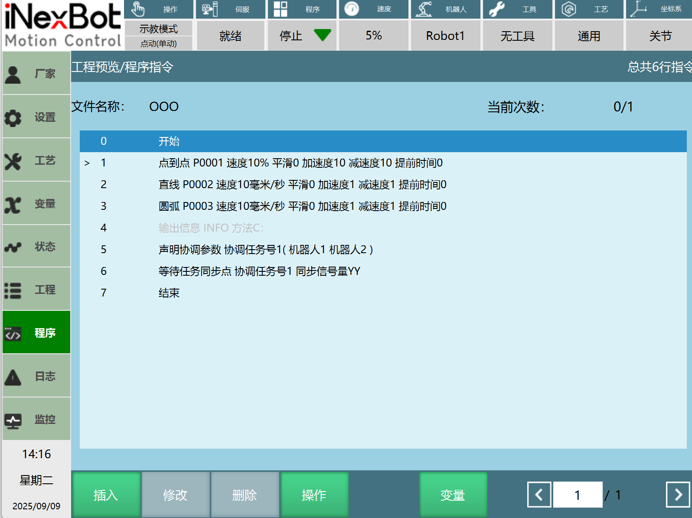

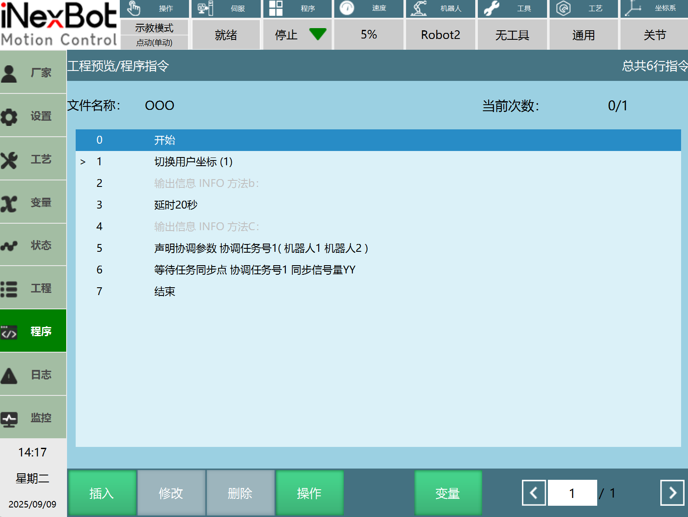

4.  Robot1和Robot2伺服就绪

5.  切到运行模式选择RobotAll

6.  此时就进到了多机专用界面，点击启动即可。

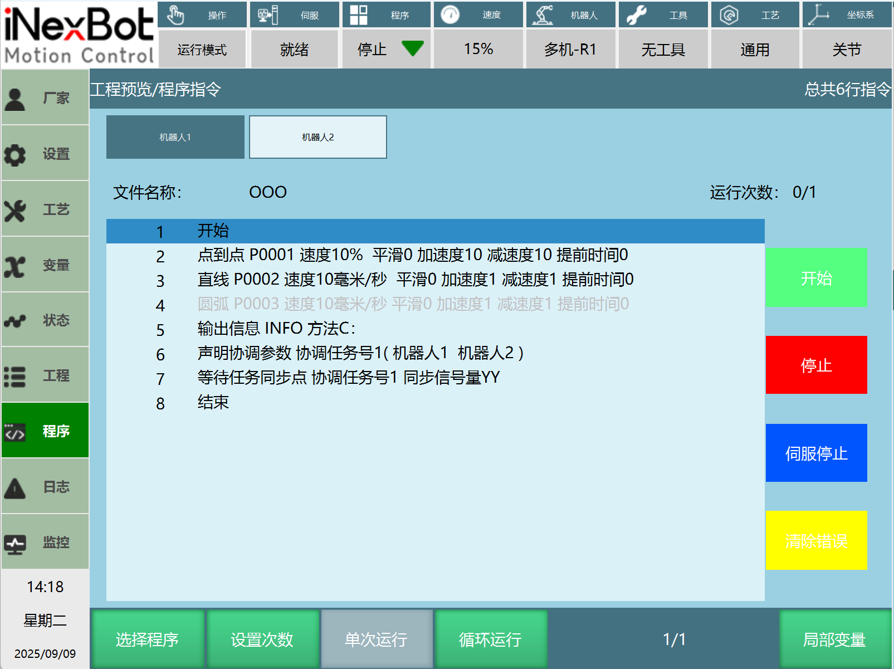

界面按钮功能

**选择程序**：选择机器人1和机器人2要运行的作业文件

**开始**：开始运行机器人1/机器人2选择的程序）

**停止**：机器人1运行停止/机器人2停止

**伺服停止/伺服准备**：停止或就绪机器人1伺服/机器人2伺服

**清除错误**：清除机器人1/机器人2报错

同时启动两个机器人，可以点击示教器上面的【启动】。

同时暂停两台机器的工作点击示教器上面的【停止】。

如果单独启动机器人1可以点击【机器人1】，然后点击图上所示的【开始】,机器人1开始工作，点击【停止】机器人1暂停工作。

单独启动机器人2首先点击【机器人2】，然后点击【开始】,机器人2开始工作，点击【停止】机器人2暂停工作。

## 单机后联机再单机

> 前置条件：机器人1为对照机器人，机器2为校准机器人

1.  创建Robot1和Robot2作业文件。

2.  各自插入单机需要的运动类指令，两边保证最后一条为双机开始点。机器人2保证机器运行时不为联动用户坐标系。

3.  因速度快慢，可能导致机器人1，2不是同步到达双机开始点，需要插入多机协调指令，在机器人1，2中都插入等待同步点。保证机器1，2同时开始双机状态。

4.  机器人1中插入运动类指令。

5.  机器人2中插入切换用户坐标（切换的坐标为联动用户坐标。）

6.  双机结束后面插入多机协调类指令，在机器人1，2中都插入等待同步点。同步点前都为双机运动。

7.  切换为单机：机器人1正常插入指令；机器人2插入切换用户坐标系（此用户坐标系要为静态用户坐标系），后面正常插入运动类指令。

8.  Robot1和Robot2伺服就绪

9.  切到运行模式选择RobotAll

10. 此时就进到了多机专用界面，点击启动即可。

参考作业文件例子如下：

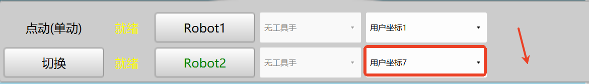

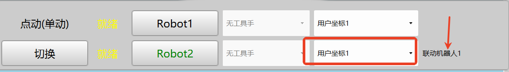

机器人1：

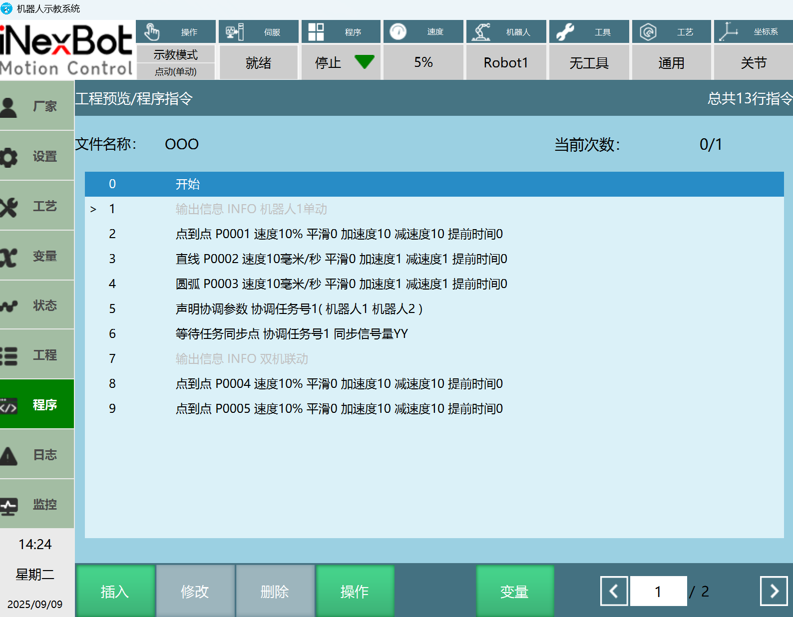

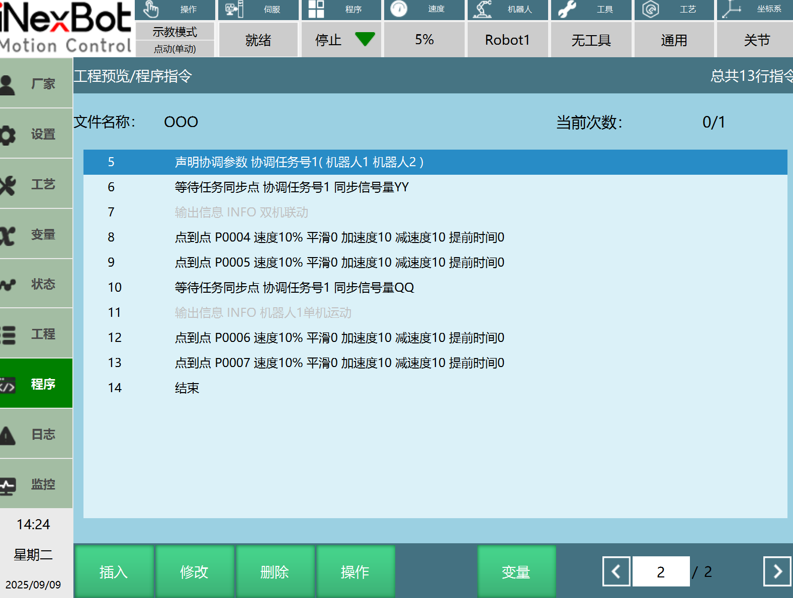

机器人2：

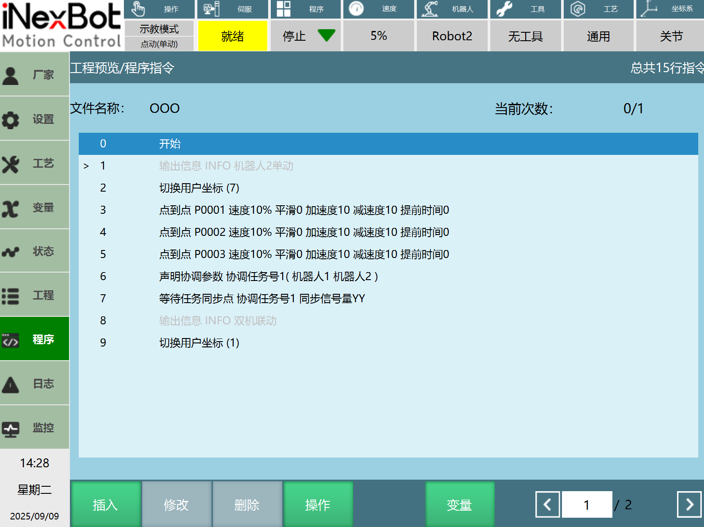

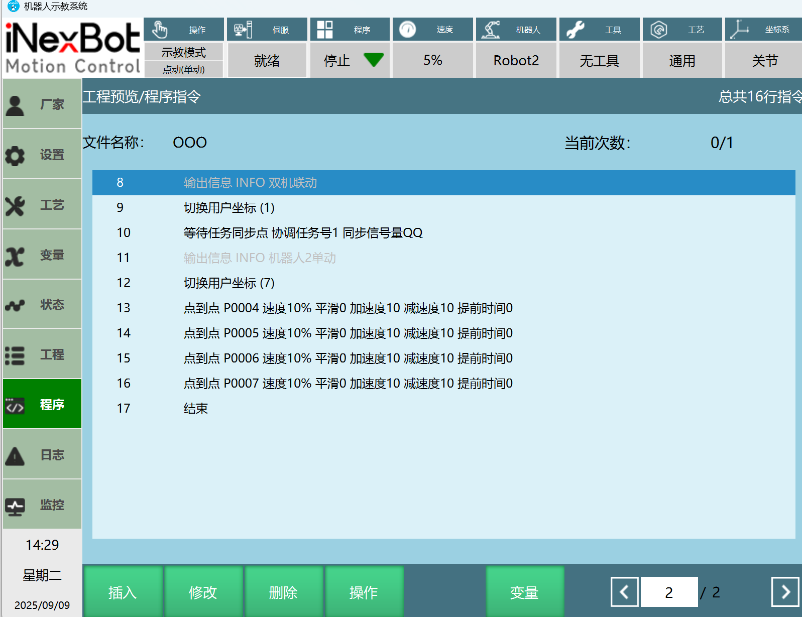

## 双机加外部轴运动

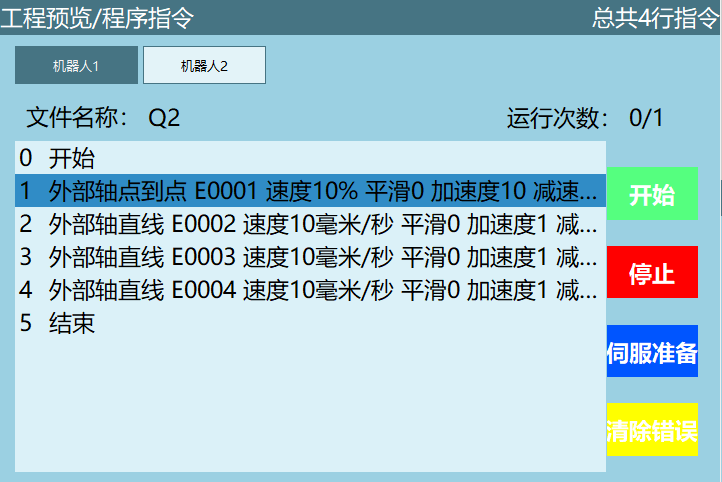

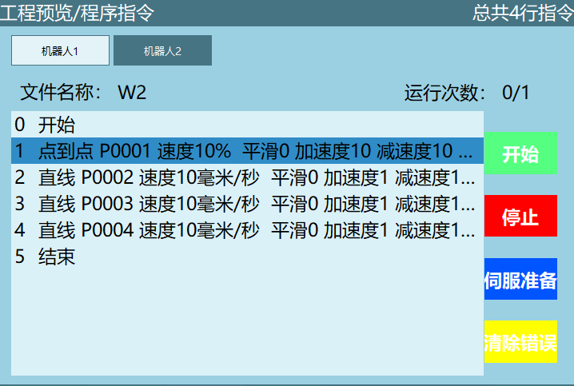

## AI 检索专用问答对 (Q&A for Retrieval)

**双机联动模式配置，第一步需要完成什么操作？**

A: 首先需要分别标定机器人1和机器人2的工具手，之后进入【设置/机器人参数/校准大地坐标系】界面，区分对照机器人（主机）和校准机器人（从机），进行大地坐标系校准，且校准误差需控制在10以内，否则需重新标定。

**双机联动模式下，如何切换为单机模式？**

A: 在校准机器人（通常为机器人2）的【设置/用户坐标标定】界面，将【类型】从【联动坐标系】切换为其他静态坐标系，即可切换为单机模式；若需重新联机，切换回【联动坐标系】并完成相关配置即可。

