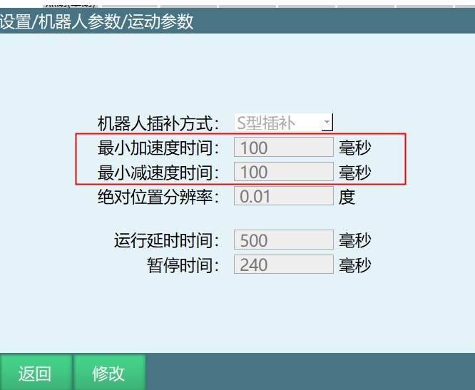
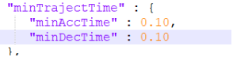
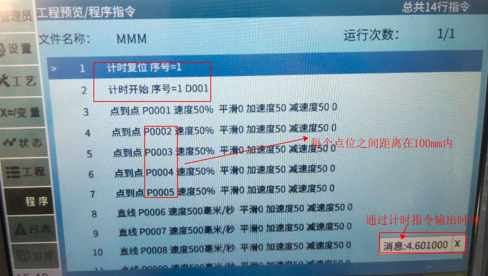
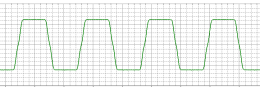
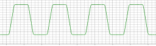
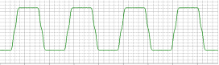

# 最小加速度时间与最小减速度时间

机器人参数-运动参数中，新增最小加速度时间和最小减速度时间，默认值为100，单位是毫秒，范围是[50,1000]

界面如图所示

此参数对应Robot参数配置中界面如图所示。

在机器人运动控制中，“最小加速度时间”（Minimum Acceleration Time）和“最小减速度时间”（Minimum Deceleration Time）是两个关键参数，它们直接影响机器人的运动性能和安全性。

## 最小加速度时间 (Minimum Acceleration Time)

最小加速度时间指的是机器人从静止状态加速至目标速度所需的最短时间，或者从一个较低的速度加速至较高的速度所需的时间。在实际应用中，这通常受到机器人驱动系统的限制，比如伺服电机的扭矩和功率。快速加速可能会导致电机过载或产生过多的振动和噪音，从而降低机器人的寿命或造成不稳定的运动。

## 最小减速度时间 (Minimum Deceleration Time)

最小减速度时间则指的是机器人从最高速度减速至静止状态，或者从较高速度减速至较低速度所需的最短时间。这同样受到驱动系统能力的约束，尤其是在高速减速时，电机需要处理反向扭矩并可能需要进行能量回收或消耗，以避免过电压或过热。在某些情况下，如果减速度过快，还可能触发安全机制，如急停系统。

## 在机器人运行中的作用

- **响应性：**在需要快速响应的应用中，如避障或抓取不稳定对象，最小化这些时间可以提升机器人的反应速度。
- **安全性**：控制加速度和减速度可以减少因突然变化引起的冲击，保护机器人本身及其周围环境的安全。
- **精度**：在精密操作中，适当的加速度和减速度可以提高定位精度，避免因惯性引起的误差。
- **能源效率**：优化这些参数可以减少能量消耗，尤其是在频繁启动和停止的应用中。
- **平滑性：**通过控制加减速时间，可以减少运动过程中的冲击，使得机器人动作更加平滑，减少对结构的应力。

在实际应用中，机器人控制器会根据运动规划、负载情况以及安全要求来动态调整加速度和减速度时间，以达到最佳的运动效果。

## 使用范例：

注：在工程界面新建作业文件，插入多条运动指令（十条左右），每个指令间的点位间距在100mm以内（开发定义在100mm内使用）。

1.在程序中插入计时指令记录运动时间。

2.插入运动类指令，如点到点、直线、圆弧等，为使每个点位间距在100mm以内其点位P001，P002等可在变量中手动修改调整。

3.不修改作业文件运动指令及指令各个参数的情况下，修改最小加速度时间和最小减速度时间，来测试其在不同最小加速度时间和最小减速度时间的运动时间，观察机器运动情况。

## 机器人插补方式：
插入运动指令后运行程序，选择不同的插补方式同通过肉眼很难看出区别，通过伺服软件采集波形图就可以看出变化

纵轴代表时间（ms）,横轴代表速度指令（rpm）

S型插补：

T型插补：

加加速度插补：

设置情景：没有特定情况，所有情况都可以选择加加速度插补

功能：系统会自动计算最佳的加加速度值从而改善机器人启动与停止时的柔软度，使机器人更柔顺

## AI 检索专用问答对 (Q&A for Retrieval)

**Q: 修改最小加速度时间需要重启才会生效吗**

A: 修改最小加速度时间后立即生效，不需要重启

**Q: 如果运动轨迹之间有明显的停顿，该如何让轨迹之间更流畅又不改变运行轨迹**

A: 修改最小加速度时间与最小减速度时间，能让轨迹之间更流畅又不改变运行轨迹