# 机器人DH参数说明

## 注意事项

1. 所有参数值需在机器人零点位置进行测量
2. 参数配置错误可能导致机器人运动异常或报错
3. 修改参数后需重新启动控制器生效
4. 建议在专业人员指导下进行参数配置
5. DH参数是机器人精度的基础，参数不准确会直接影响末端定位精度

---

## DH参数（标准法）

DH参数是机器人运动学建模的标准方法，由Denavit和Hartenberg于1955年提出，通过四个参数描述相邻连杆之间的几何关系。准确的DH参数是机器人精度标定的基础，直接影响机器人的运动学正逆解计算精度。

### DH参数坐标系建立规则

为每个连杆i建立坐标系{i}，需遵循以下规则：
1. **Z轴**：沿关节i的运动轴线（旋转关节为旋转轴，移动关节为移动轴）
2. **X轴**：垂直于Z轴，指向关节i+1，为Z_{i-1}与Z_i的公垂线方向
3. **Y轴**：由右手定则确定，Y_i = Z_i × X_i
4. **原点**：位于X_i与Z_i的交点

### DH参数说明

| 参数 | 符号 | 说明 | 物理意义 | 精度影响 |
| :--- | :--- | :--- | :--- | :--- |
| 连杆长度 | a_i | 从第i-1关节轴线(Z_{i-1})到第i关节轴线(Z_i)的公垂线长度 | 两关节轴线在垂直于公垂线平面内的距离 | 直接影响末端位置精度 |
| 连杆扭角 | α_i | 第i-1关节轴线(Z_{i-1})与第i关节轴线(Z_i)之间的夹角 | 两关节轴线的空间夹角，绕公垂线(X_i)测量 | 影响末端姿态精度 |
| 连杆偏距 | d_i | 沿第i-1关节轴线(Z_{i-1})方向，从第i-1连杆坐标系原点(O_{i-1})到公垂线的距离 | 沿前一关节轴线的位移量 | 影响轴向定位精度 |
| 关节角 | θ_i | 绕第i关节轴线(Z_i)的旋转角度 | 关节的转动角度（旋转关节）或位移（移动关节） | 影响各关节定位精度 |

### DH参数作用详解

**1. 连杆长度 (a_i)**
- **作用**：定义相邻两个关节轴线之间的垂直距离
- **测量方式**：在机器人零点位置，测量第i-1关节轴线到第i关节轴线的公垂线段长度
- **影响**：直接影响机器人的工作空间范围和运动学计算精度

**2. 连杆扭角 (α_i)**
- **作用**：定义相邻两个关节轴线之间的空间夹角
- **测量方式**：绕公垂线测量第i-1关节轴线与第i关节轴线的夹角
- **影响**：决定了连杆之间的扭转关系，影响机器人的姿态可达性和姿态精度

**3. 连杆偏距 (d_i)**
- **作用**：定义沿关节轴线方向的位移量
- **测量方式**：沿第i-1关节轴线，从第i-1连杆坐标系原点到公垂线的距离
- **影响**：对于旋转关节，此参数为常数；对于移动关节，此参数为关节变量

**4. 关节角 (θ_i)**
- **作用**：定义关节的旋转角度
- **测量方式**：绕第i关节轴线的旋转角度
- **影响**：对于旋转关节，此参数为关节变量；对于移动关节，此参数为常数

---

## 七轴串联机器人-CBCBABC

### 参考零点

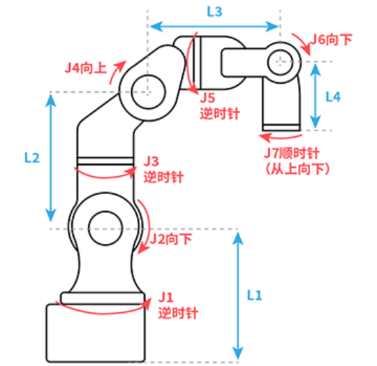

### 杆长参数

| 参数 | 说明 | 参数值正负说明（机器人零点状态下参考直角坐标系方向） |
| :--- | :--- | :--- |
| L1 | 机器人底座面到2轴旋转轴线的公垂线段的长度 | 与Z+方向一致为正值 |
| L2 | 2轴旋转轴线到3轴旋转轴线的公垂线段的长度 | 与Z+方向一致为正值 |
| L3 | Z轴方向上，3轴旋转轴线到5轴旋转轴线的长度 | 与Z+方向一致为正值 |
| L4 | X轴方向上，3轴旋转轴线到5轴旋转轴线的长度 | 与X+方向一致为正值 |
| L5 | 5轴旋转轴线到6轴法兰面的公垂线段的长度 | 与Z-方向一致为正值 |
| L6 | 1轴旋转轴线到2轴旋转轴线的公垂线段的长度 | 与X+方向一致为正值 |
| L7 | Y轴方向上，1轴旋转轴线到4轴旋转轴线的长度 | 与Y+方向一致为正值 |
| L8 | 4轴旋转轴线到6轴旋转轴线的公垂线段的长度 | 与Y+方向一致为正值 |
| L9 | 6轴旋转轴线到7轴旋转轴线的公垂线段的长度 | 与X+方向一致为正值 |
| L10 | 7轴旋转轴线到末端法兰面的公垂线段的长度 | 与Z-方向一致为正值 |

### 耦合比

机器人在运动过程中，一个关节运动时另一个关节也会运动，这就说明有耦合。为了抵消这种耦合作用，需要设置耦合比参数。

耦合比计算公式：`耦合比 = 跟随轴旋转角度 / 主轴旋转角度`

### 五轴方向

机器人在零点位置时五轴的方向，如果标定零点时的五轴方向和DH参数界面选择的五轴方向不一致，机器人在运动时会报错。

### 模型方向（零点旋转方向）

| 参数 | 参数值正负说明（从上往下、从前往后、从左往右） |
| :--- | :--- |
| J1 | 逆时针 |
| J2 | 逆时针 |
| J3 | 逆时针 |
| J4 | 逆时针 |
| J5 | 顺时针 |
| J6 | 顺时针 |
| J7 | 逆时针 |

---

## 六轴串联多关节机器人-CBBABC

### 参考零点

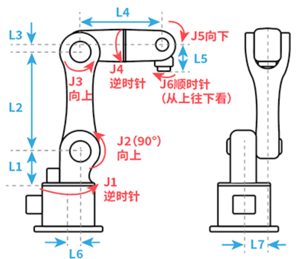

### 杆长参数

| 参数 | 说明 | 参数值正负说明（机器人零点状态下参考直角坐标系方向） |
| :--- | :--- | :--- |
| L1 | 机器人底座面到2轴旋转轴线的公垂线段的长度 | 与Z+方向一致为正值 |
| L2 | 2轴旋转轴线到3轴旋转轴线的公垂线段的长度 | 与Z+方向一致为正值 |
| L3 | Z轴方向上，3轴旋转轴线到5轴旋转轴线的长度 | 与Z+方向一致为正值 |
| L4 | X轴方向上，3轴旋转轴线到5轴旋转轴线的长度 | 与X+方向一致为正值 |
| L5 | 5轴旋转轴线到6轴法兰面的公垂线段的长度 | 与Z-方向一致为正值 |
| L6 | 1轴旋转轴线到2轴旋转轴线的公垂线段的长度 | 与X+方向一致为正值 |
| L7 | Y轴方向上，1轴旋转轴线到4轴旋转轴线的长度 | 与Y+方向一致为正值 |
| L8 | 4轴旋转轴线到6轴旋转轴线的公垂线段的长度 | 与Y+方向一致为正值 |

### 五轴方向

机器人在零点位置时五轴的方向，如果标定零点时的五轴方向和DH参数界面选择的五轴方向不一致，机器人在运动时会报错。

### 模型方向（零点旋转方向）

| 参数 | 参数值正负说明（从上往下、从前往后、从左往右） |
| :--- | :--- |
| J1 | 逆时针 |
| J2 | 逆时针 |
| J3 | 逆时针 |
| J4 | 逆时针 |
| J5 | 顺时针 |
| J6 | 顺时针 |

---

## 六轴协作机器人-CBBBAC

### 参考零点

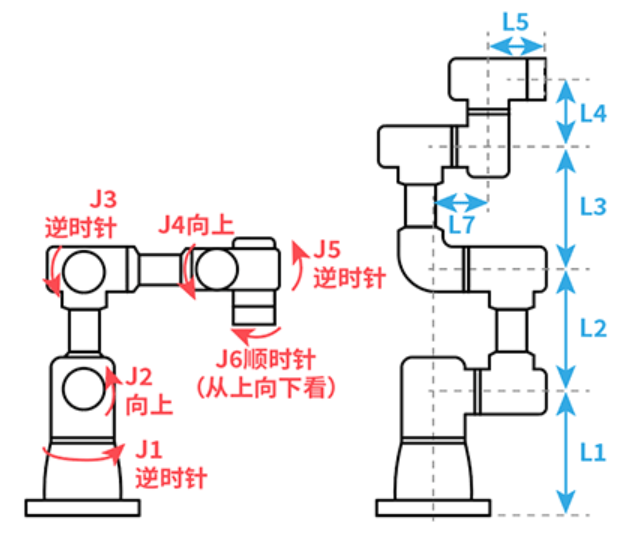

### 杆长参数

| 参数 | 说明 | 参数值正负说明（机器人零点状态下参考直角坐标系方向） |
| :--- | :--- | :--- |
| L1 | 机器人底座面到2轴旋转轴线的公垂线段的长度 | 与Z+方向一致为正值 |
| L2 | 2轴旋转轴线到3轴旋转轴线的公垂线段的长度 | 与Z+方向一致为正值 |
| L3 | 3轴旋转轴线到4轴旋转轴线的公垂线段的长度 | 与X+方向一致为正值 |
| L4 | 4轴旋转轴线到6轴旋转轴线的公垂线段的长度 | 与X+方向一致为正值 |
| L5 | 5轴旋转轴线到6轴法兰面的公垂线段的长度 | 与Z-方向一致为正值 |
| L6 | 1轴旋转轴线到2轴旋转轴线的公垂线段的长度 | 与X+方向一致为正值 |
| L7 | 1轴旋转轴线到5轴旋转轴线的公垂线段的长度 | 与Y-方向一致为正值 |

### 耦合比

机器人在运动过程中，一个关节运动时另一个关节也会运动，这就说明有耦合。为了抵消这种耦合作用，需要设置耦合比参数。

耦合比计算公式：`耦合比 = 跟随轴旋转角度 / 主轴旋转角度`

### 三轴方向、五轴方向

机器人在零点位置时三轴、五轴的方向，如果标定零点时的方向和DH参数界面选择的方向不一致，机器人在运动时会报错。

### 模型方向（零点旋转方向）

| 参数 | 参数值正负说明（从上往下、从前往后、从左往右） |
| :--- | :--- |
| J1 | 逆时针 |
| J2 | 逆时针 |
| J3 | 逆时针 |
| J4 | 逆时针 |
| J5 | 逆时针 |
| J6 | 顺时针 |

---

## 六轴喷涂机器人-CBBBCA

### 参考零点

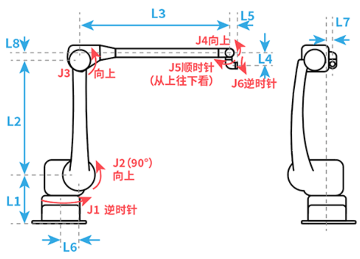

### 杆长参数

| 参数 | 说明 | 参数值正负说明（机器人零点状态下参考直角坐标系方向） |
| :--- | :--- | :--- |
| L1 | 机器人底座面到2轴旋转轴线的公垂线段的长度 | 与Z+方向一致为正值 |
| L2 | 2轴旋转轴线到3轴旋转轴线的公垂线段的长度 | 与Z+方向一致为正值 |
| L3 | X轴方向上，3轴旋转轴线到4轴旋转轴线的长度 | 与X+方向一致为正值 |
| L4 | 4轴旋转轴线到6轴旋转轴线的公垂线段的长度 | 与Z-方向一致为正值 |
| L5 | 4轴旋转轴线到6轴法兰面的公垂线段的长度 | 与X+方向一致为正值 |
| L6 | 1轴旋转轴线到2轴旋转轴线的公垂线段的长度 | 与X+方向一致为正值 |
| L7 | 1轴旋转轴线到6轴旋转轴线的公垂线段的长度 | 与Y+方向一致为正值 |
| L8 | Z轴方向上，3轴旋转轴线到4轴旋转轴线的长度 | 与Z+方向一致为正值 |

### 耦合比

机器人在运动过程中，一个关节运动时另一个关节也会运动，这就说明有耦合，为了抵消这种耦合作用，就需要耦合比。

耦合比计算公式：`耦合比 = 跟随轴旋转角度 / 主轴旋转角度`

### 模型方向（零点旋转方向）

| 参数 | 参数值正负说明（从上往下、从前往后、从左往右） |
| :--- | :--- |
| J1 | 逆时针 |
| J2 | 逆时针 |
| J3 | 逆时针 |
| J4 | 逆时针 |
| J5 | 顺时针 |
| J6 | 逆时针 |

---

## 六轴异形二机器人-CCBABC

### 参考零点

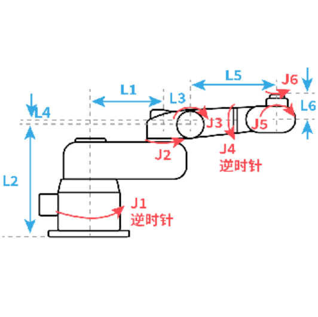

### 杆长参数

| 参数 | 说明 | 参数值正负说明（机器人零点状态下参考直角坐标系方向） |
| :--- | :--- | :--- |
| L1 | 1轴旋转轴线到2轴旋转轴线的公垂线段的长度 | 与X+方向一致为正值 |
| L2 | 机器人底座面到3轴旋转轴线的公垂线段长度 | 与Z+方向一致为正值 |
| L3 | 2轴旋转轴线到3轴旋转轴线的公垂线段长度 | 与X+方向一致为正值 |
| L4 | Z轴方向上，3轴旋转轴线到5轴旋转轴线的长度 | 与Z+方向一致为正值 |
| L5 | 3轴旋转轴线到6轴旋转轴的公垂线段长度 | 与X+方向一致为正值 |
| L6 | 5轴旋转轴到6轴法兰面的公垂线段长度 | 与Z+方向一致为正值 |

### 耦合比

机器人在运动过程中，一个关节运动时另一个关节也会运动，这就说明有耦合，为了抵消这种耦合作用，就需要耦合比。

耦合比计算公式：`耦合比 = 跟随轴旋转角度 / 主轴旋转角度`

### 模型方向（零点旋转方向）

| 参数 | 参数值正负说明（从上往下、从前往后、从左往右） |
| :--- | :--- |
| J1 | 逆时针 |
| J2 | 逆时针 |
| J3 | 顺时针 |
| J4 | 逆时针 |
| J5 | 顺时针 |
| J6 | 逆时针 |

---

## 五轴串联多关节机器人-CBBAB

### 参考零点

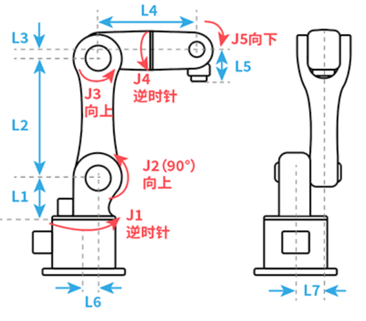

### 杆长参数

| 参数 | 说明 | 参数值正负说明（机器人零点状态下参考直角坐标系方向） |
| :--- | :--- | :--- |
| L1 | 机器人底座面到2轴旋转轴线的公垂线段的长度 | 与Z+方向一致为正值 |
| L2 | 2轴旋转轴线到3轴旋转轴线的公垂线段长度 | 与Z+方向一致为正值 |
| L3 | Z轴方向上，3轴旋转轴线到5轴旋转轴线的长度 | 与Z+方向一致为正值 |
| L4 | X轴方向上，3轴旋转轴线到5轴旋转轴线的长度 | 与X+方向一致为正值 |
| L5 | 5轴旋转轴线到工具手法兰盘的公垂线段长度 | 与Z-方向一致为正值 |
| L6 | 1轴旋转轴线到2轴旋转轴线的公垂线段的长度 | 与X+方向一致为正值 |
| L7 | Y轴方向上，1轴旋转轴线到6轴旋转轴线的长度 | 与Y+方向一致为正值 |

### 耦合比

机器人在运动过程中，一个关节运动时另一个关节也会运动，这就说明有耦合，为了抵消这种耦合作用，就需要耦合比。

耦合比计算公式：`耦合比 = 跟随轴旋转角度 / 主轴旋转角度`

### 五轴方向

机器人在零点位置时五轴的方向，如果标定零点时的五轴方向和DH参数界面选择的五轴方向不一致，机器人在运动时会报错。

### 模型方向（零点旋转方向）

| 参数 | 参数值正负说明（从上往下、从前往后、从左往右） |
| :--- | :--- |
| J1 | 逆时针 |
| J2 | 逆时针 |
| J3 | 逆时针 |
| J4 | 逆时针 |
| J5 | 顺时针 |

---

## 四轴SCARA机器人-CCZC

### 结构特点

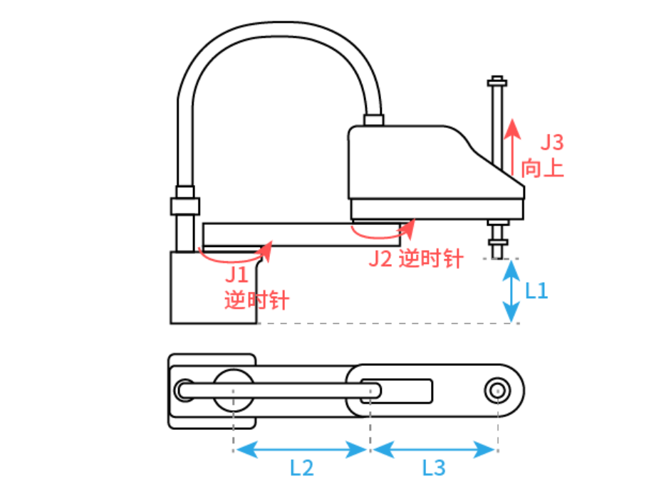

SCARA（Selective Compliance Assembly Robot Arm）机器人具有4个轴，其中前两个轴为旋转轴，第三个轴为移动轴，第四个轴为旋转轴。

### 杆长参数

| 参数 | 说明 | 参数值正负说明（机器人零点状态下参考直角坐标系方向） |
| :--- | :--- | :--- |
| L1 | 机器人底座面到3轴法兰面的公垂线段长度 | 与Z+方向一致为正值 |
| L2 | 1轴旋转轴线到2轴旋转轴线的公垂线段长度 | 与X+方向一致为正值 |
| L3 | 2轴旋转轴线到4轴旋转轴线的公垂线段长度 | 与X+方向一致为正值 |

### 耦合比

机器人在运动过程中，一个关节运动时另一个关节也会运动，这就说明有耦合，为了抵消这种耦合作用，就需要耦合比。

耦合比计算公式：`耦合比 = 跟随轴旋转角度 / 主轴旋转角度`

### 螺距

SCARA机器人的3轴是控制丝杆上下运动，控制丝杆的旋转轴转动360°时丝杆上下移动的距离就是螺距。

### 模型方向（零点旋转方向）

| 参数 | 参数值正负说明（从上往下、从前往后、从左往右） |
| :--- | :--- |
| J1 | 逆时针 |
| J2 | 逆时针 |
| J3 | 向上 |
| J4 | 顺时针 |

---

## 四轴SCARA异型1机器人-ZCCC

### 参考零点

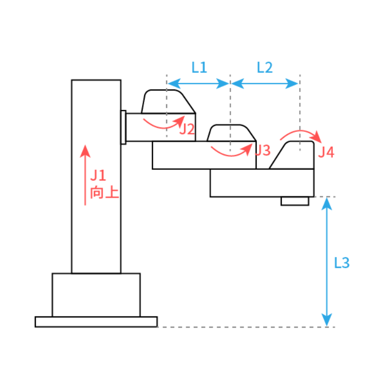

### 杆长参数

| 参数 | 说明 | 参数值正负说明（机器人零点状态下参考直角坐标系方向） |
| :--- | :--- | :--- |
| L1 | 2轴旋转轴线到3轴旋转轴线的公垂线段长度 | 与X+方向一致为正值 |
| L2 | 3轴旋转轴线到4轴旋转轴线的公垂线段长度 | 与X+方向一致为正值 |
| L3 | 机器人底座到4轴法兰面的公垂线段长度 | 与Z+方向一致为正值 |

### 耦合比

机器人在运动过程中，一个关节运动时另一个关节也会运动，这就说明有耦合，为了抵消这种耦合作用，就需要耦合比。

耦合比计算公式：`耦合比 = 跟随轴旋转角度 / 主轴旋转角度`

### 螺距

SCARA机器人的3轴是控制丝杆上下运动，控制丝杆的旋转轴转动360°时丝杆上下移动的距离就是螺距。

### 模型方向（零点旋转方向）

| 参数 | 参数值正负说明（从上往下、从前往后、从左往右） |
| :--- | :--- |
| J1 | 向上 |
| J2 | 逆时针 |
| J3 | 逆时针 |
| J4 | 顺时针 |

---

## 四轴连杆码垛机器人-CBBC

### 参考零点

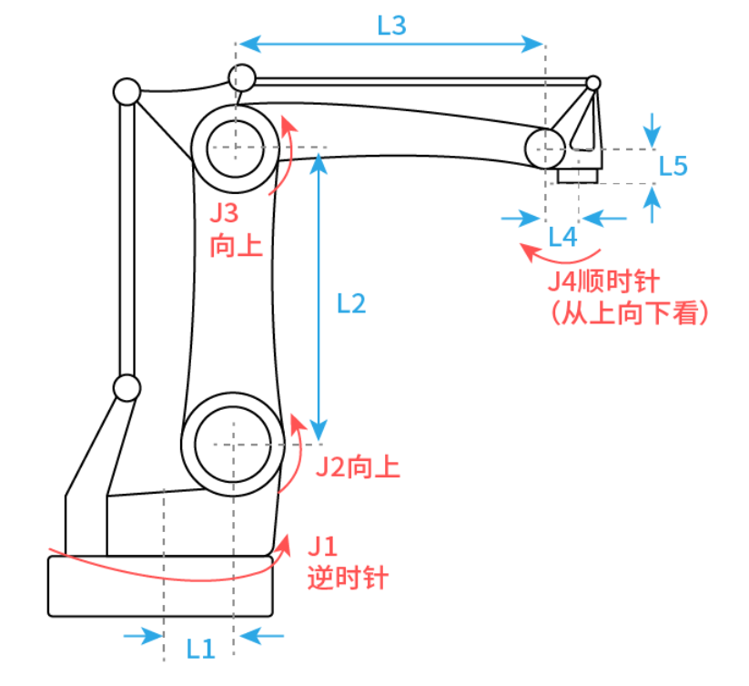

### 杆长参数

| 参数 | 说明 | 参数值正负说明（机器人零点状态下参考直角坐标系方向） |
| :--- | :--- | :--- |
| L1 | X轴方向上，1轴旋转轴线到2轴旋转轴线的长度 | 与X+方向一致为正值 |
| L2 | 2轴旋转轴线到3轴旋转轴线的公垂线段长度 | 与Z+方向一致为正值 |
| L3 | 3轴旋转轴线到连杆轴旋转轴线的公垂线段长度 | 与X+方向一致为正值 |
| L4 | 连杆轴旋转轴线到4轴旋转中心的公垂线段长度 | 与X+方向一致为正值 |
| L5 | 连杆轴旋转轴线到4轴法兰面的公垂线段长度 | 与Z-方向一致为正值 |
| L6 | Y轴方向上，1轴旋转轴线到4轴旋转轴线的距离 | 与Y+方向一致为正值 |

### 耦合比

机器人在运动过程中，一个关节运动时另一个关节也会运动，这就说明有耦合，为了抵消这种耦合作用，就需要耦合比。

耦合比计算公式：`耦合比 = 跟随轴旋转角度 / 主轴旋转角度`

### J2+J3限位

只有当2/3轴存在耦合时，动态限位才会生效。当J2+J3最大值和J2+J3最小值不在设置的参数范围内，在运行程序时会报错（机器人2，3轴动态限位超限）。

### 模型方向（零点旋转方向）

| 参数 | 参数值正负说明（从上往下、从前往后、从左往右） |
| :--- | :--- |
| J1 | 逆时针 |
| J2 | 逆时针 |
| J3 | 逆时针 |
| J4 | 顺时针 |

---

## 四轴码垛丝杆机器人-CZXC

### 参考零点

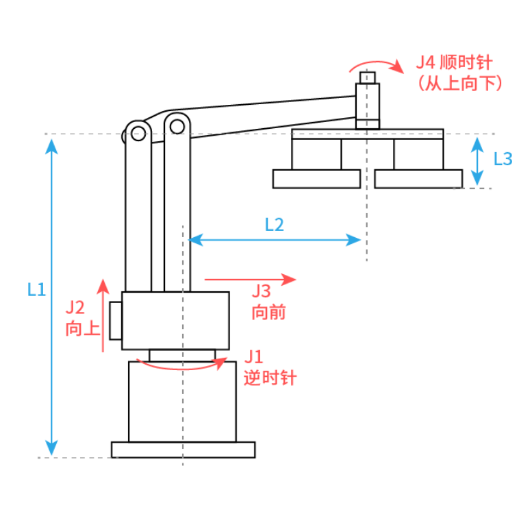

### 杆长参数

| 参数 | 说明 | 参数值正负说明（机器人零点状态下参考直角坐标系方向） |
| :--- | :--- | :--- |
| L1 | 机器人底座到双臂结构外臂上旋转轴线的公垂线段长度 | 与Z+方向一致为正值 |
| L2 | 1轴旋转轴线到4轴旋转轴线的公垂线段长度 | 与X+方向一致为正值 |
| L3 | 4轴法兰面到工具末梢面的距离，默认填0 | 与Z-方向一致为正值 |

### 转化比

转化比就是关节转360度（也可理解为电机转一圈）走的距离（单位：mm）。例如：电机旋转一圈会有角度值，我们通过转化比可以将角度值转化成长度值。

### 放大比

工具末端移动的距离 / 三轴丝杆移动的距离。

### 模型方向（零点旋转方向）

| 参数 | 参数值正负说明（从上往下、从前往后、从左往右） |
| :--- | :--- |
| J1 | 逆时针 |
| J2 | 逆时针 |
| J3 | 逆时针 |
| J4 | 顺时针 |

---

## 四轴串联机器人-ZBBB

### 结构特点

四轴串联机器人-ZBBB采用全旋转关节结构，四个关节均为旋转轴（C型轴），适用于需要灵活姿态调整的应用场景。

### 参考零点

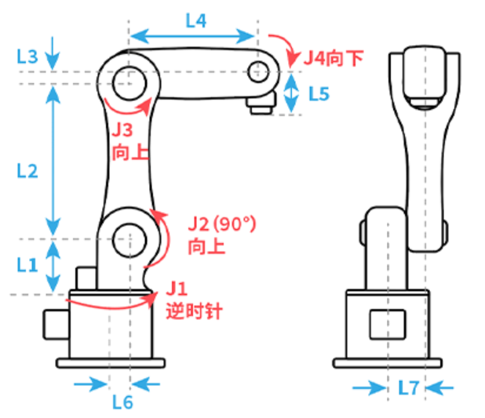

### 杆长参数

| 参数 | 说明 | 参数值正负说明（机器人零点状态下参考直角坐标系方向） |
| :--- | :--- | :--- |
| L1 | 机器人底座面到2轴旋转轴线的公垂线段的长度 | 与Z+方向一致为正值 |
| L2 | 2轴旋转轴线到3轴旋转轴线的公垂线段的长度 | 与X+方向一致为正值 |
| L3 | 3轴旋转轴线到4轴旋转轴线的公垂线段的长度 | 与X+方向一致为正值 |
| L4 | 4轴旋转轴线到末端法兰面的公垂线段的长度 | 与Z-方向一致为正值 |
| L5 | 1轴旋转轴线到2轴旋转轴线的公垂线段的长度 | 与X+方向一致为正值 |

### 模型方向（零点旋转方向）

| 参数 | 参数值正负说明（从上往下、从前往后、从左往右） |
| :--- | :--- |
| J1 | 逆时针 |
| J2 | 逆时针 |
| J3 | 逆时针 |
| J4 | 顺时针 |

---

## 四轴串联机器人-XYZC

### 结构特点

四轴串联机器人-XYZC采用直角坐标结构，前三轴为移动轴（X、Y、Z轴），第四轴为旋转轴（C轴），适用于需要精确位置控制和末端旋转的应用场景。

### 参考零点

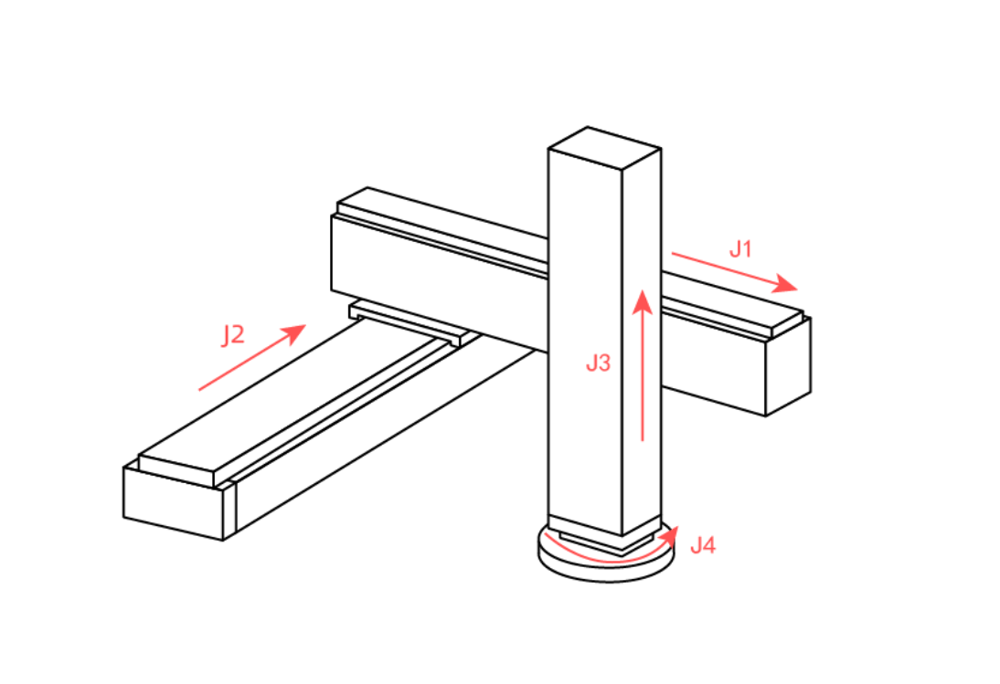

### 参数说明

| 参数 | 说明 | 参数值正负说明 |
| :--- | :--- | :--- |
| L1 | X轴行程长度 | 正值 |
| L2 | Y轴行程长度 | 正值 |
| L3 | Z轴行程长度 | 正值 |
| L4 | Z轴移动平面到C轴旋转中心的距离 | 与Z+方向一致为正值 |
| L5 | C轴旋转中心到末端法兰面的距离 | 与X+方向一致为正值 |

### 螺距参数

| 参数 | 说明 | 单位 |
| :--- | :--- | :--- |
| 螺距X | X轴丝杆转动360°时滑块移动的距离 | mm |
| 螺距Y | Y轴丝杆转动360°时滑块移动的距离 | mm |
| 螺距Z | Z轴丝杆转动360°时滑块移动的距离 | mm |

### 模型方向（零点旋转方向）

| 参数 | 参数值正负说明 |
| :--- | :--- |
| J1 (X) | 向右为正 |
| J2 (Y) | 向前为正 |
| J3 (Z) | 向上为正 |
| J4 (C) | 逆时针为正 |

---

## 三轴直角机器人

### 结构特点

三轴直角机器人采用X、Y、Z三个线性移动轴组成直角坐标系，适用于需要精确平面定位和垂直运动的应用场景。

### 参考零点

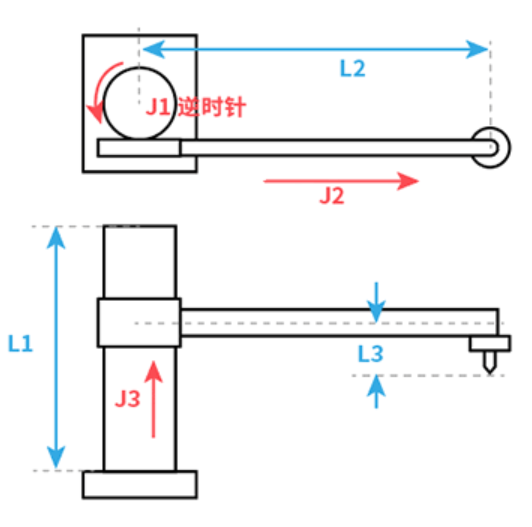

### 参数说明

| 参数 | 说明 | 参数值正负说明 |
| :--- | :--- | :--- |
| L1 | X轴行程长度 | 正值 |
| L2 | Y轴行程长度 | 正值 |
| L3 | Z轴行程长度 | 正值 |

### 螺距参数

| 参数 | 说明 | 单位 |
| :--- | :--- | :--- |
| 螺距X | X轴丝杆转动360°时滑块移动的距离 | mm |
| 螺距Y | Y轴丝杆转动360°时滑块移动的距离 | mm |
| 螺距Z | Z轴丝杆转动360°时滑块移动的距离 | mm |

### 模型方向（零点移动方向）

| 参数 | 参数值正负说明 |
| :--- | :--- |
| J1 (X) | 向右为正 |
| J2 (Y) | 向前为正 |
| J3 (Z) | 向上为正 |

---

## 三轴串联-CCZ

### 结构特点

三轴串联-CCZ采用两个旋转轴（C轴）和一个移动轴（Z轴）的组合结构，适用于需要旋转定位和垂直移动的应用场景。

### 参考零点

### 参数说明

| 参数 | 说明 | 参数值正负说明 |
| :--- | :--- | :--- |
| L1 | 1轴旋转中心到2轴旋转中心的距离 | 与X+方向一致为正值 |
| L2 | 2轴旋转中心到Z轴移动平台的距离 | 与Z+方向一致为正值 |
| L3 | Z轴移动平台到末端法兰面的距离 | 与Z+方向一致为正值 |

### 螺距参数

| 参数 | 说明 | 单位 |
| :--- | :--- | :--- |
| 螺距Z | Z轴丝杆转动360°时滑块移动的距离 | mm |

### 模型方向（零点旋转方向）

| 参数 | 参数值正负说明（从上往下、从前往后、从左往右） |
| :--- | :--- |
| J1 (C1) | 逆时针 |
| J2 (C2) | 逆时针 |
| J3 (Z) | 向上为正 |

---

## 三轴直角-XYZ

### 结构特点

三轴直角-XYZ采用X、Y、Z三个线性移动轴，与标准三轴直角机器人结构类似，适用于需要大行程平面定位的应用场景。

### 参考零点

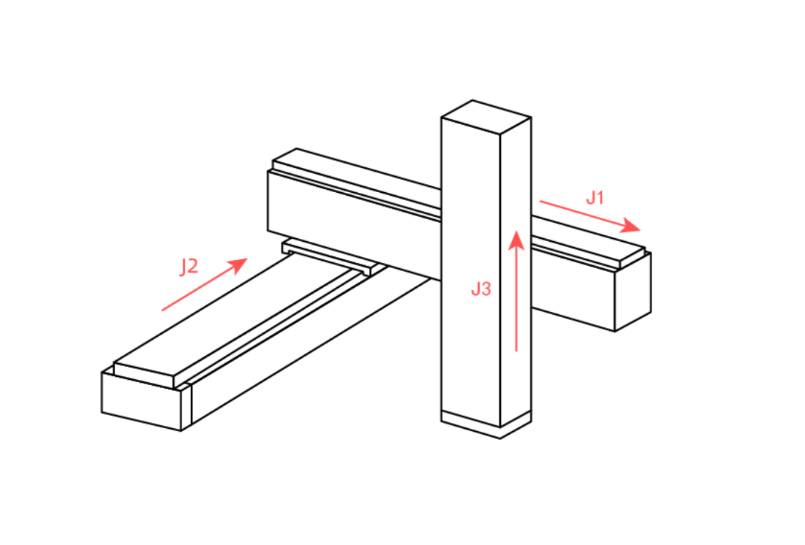

### 参数说明

| 参数 | 说明 | 参数值正负说明 |
| :--- | :--- | :--- |
| L1 | X轴行程长度 | 正值 |
| L2 | Y轴行程长度 | 正值 |
| L3 | Z轴行程长度 | 正值 |

### 螺距参数

| 参数 | 说明 | 单位 |
| :--- | :--- | :--- |
| 螺距X | X轴丝杆转动360°时滑块移动的距离 | mm |
| 螺距Y | Y轴丝杆转动360°时滑块移动的距离 | mm |
| 螺距Z | Z轴丝杆转动360°时滑块移动的距离 | mm |

### 模型方向（零点移动方向）

| 参数 | 参数值正负说明 |
| :--- | :--- |
| J1 (X) | 向右为正 |
| J2 (Y) | 向前为正 |
| J3 (Z) | 向上为正 |

---

## 五轴串联-XYZAB

### 结构特点

五轴串联-XYZAB采用X、Y、Z三个线性移动轴和A、B两个旋转轴的组合结构，适用于需要复杂姿态调整的五轴加工应用场景。

### 参考零点

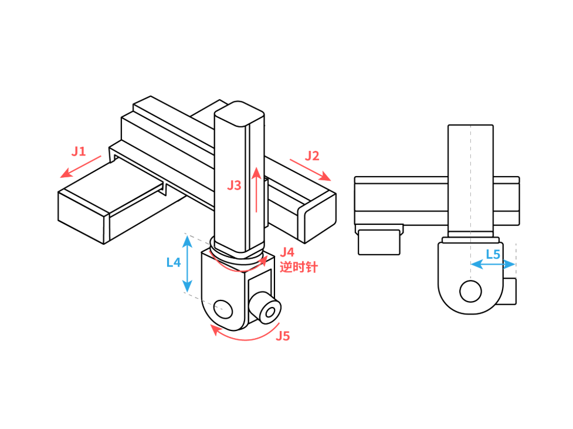

### 参数说明

| 参数 | 说明 | 参数值正负说明 |
| :--- | :--- | :--- |
| L1 | X轴行程长度 | 正值 |
| L2 | Y轴行程长度 | 正值 |
| L3 | Z轴行程长度 | 正值 |
| L4 | Z轴移动平面到A轴旋转中心的距离 | 与Z+方向一致为正值 |
| L5 | A轴旋转中心到B轴旋转中心的距离 | 与X+方向一致为正值 |
| L6 | B轴旋转中心到末端法兰面的距离 | 与Z-方向一致为正值 |

### 螺距参数

| 参数 | 说明 | 单位 |
| :--- | :--- | :--- |
| 螺距X | X轴丝杆转动360°时滑块移动的距离 | mm |
| 螺距Y | Y轴丝杆转动360°时滑块移动的距离 | mm |
| 螺距Z | Z轴丝杆转动360°时滑块移动的距离 | mm |

### 模型方向（零点旋转方向）

| 参数 | 参数值正负说明 |
| :--- | :--- |
| J1 (X) | 向右为正 |
| J2 (Y) | 向前为正 |
| J3 (Z) | 向上为正 |
| J4 (A) | 逆时针为正（绕X轴） |
| J5 (B) | 逆时针为正（绕Y轴） |

---

## 五轴直角-XYZAC

### 结构特点

五轴直角-XYZAC采用X、Y、Z三个线性移动轴和A、C两个旋转轴的组合结构，适用于需要平面旋转和倾斜调整的五轴加工应用场景。

### 参考零点

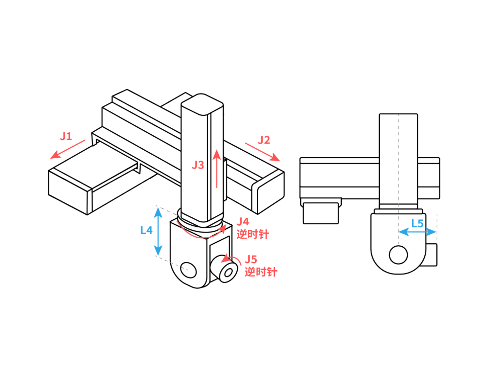

### 参数说明

| 参数 | 说明 | 参数值正负说明 |
| :--- | :--- | :--- |
| L1 | X轴行程长度 | 正值 |
| L2 | Y轴行程长度 | 正值 |
| L3 | Z轴行程长度 | 正值 |
| L4 | Z轴移动平面到A轴旋转中心的距离 | 与Z+方向一致为正值 |
| L5 | A轴旋转中心到C轴旋转中心的距离 | 与X+方向一致为正值 |
| L6 | C轴旋转中心到末端法兰面的距离 | 与Z-方向一致为正值 |

### 螺距参数

| 参数 | 说明 | 单位 |
| :--- | :--- | :--- |
| 螺距X | X轴丝杆转动360°时滑块移动的距离 | mm |
| 螺距Y | Y轴丝杆转动360°时滑块移动的距离 | mm |
| 螺距Z | Z轴丝杆转动360°时滑块移动的距离 | mm |

### 模型方向（零点旋转方向）

| 参数 | 参数值正负说明 |
| :--- | :--- |
| J1 (X) | 向右为正 |
| J2 (Y) | 向前为正 |
| J3 (Z) | 向上为正 |
| J4 (A) | 逆时针为正（绕X轴） |
| J5 (C) | 逆时针为正（绕Z轴） |

---

## 二轴串联-CC

### 结构特点

二轴串联-CC采用两个旋转轴（C轴）串联结构，适用于需要平面旋转定位的简单应用场景。

### 参考零点

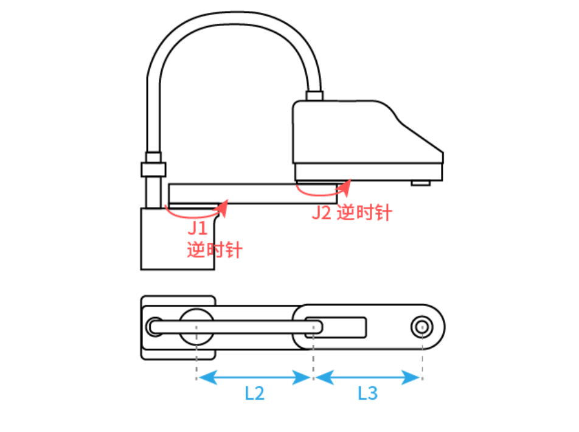

### 参数说明

| 参数 | 说明 | 参数值正负说明 |
| :--- | :--- | :--- |
| L1 | 1轴旋转中心到2轴旋转中心的距离 | 与X+方向一致为正值 |
| L2 | 2轴旋转中心到末端法兰面的距离 | 与X+方向一致为正值 |

### 模型方向（零点旋转方向）

| 参数 | 参数值正负说明（从上往下、从前往后、从左往右） |
| :--- | :--- |
| J1 | 逆时针 |
| J2 | 逆时针 |

---

## 四轴直角-CC

### 结构特点

四轴直角-CC采用两个移动轴和两个旋转轴的组合结构，适用于需要平面移动和双旋转定位的应用场景。

### 参考零点

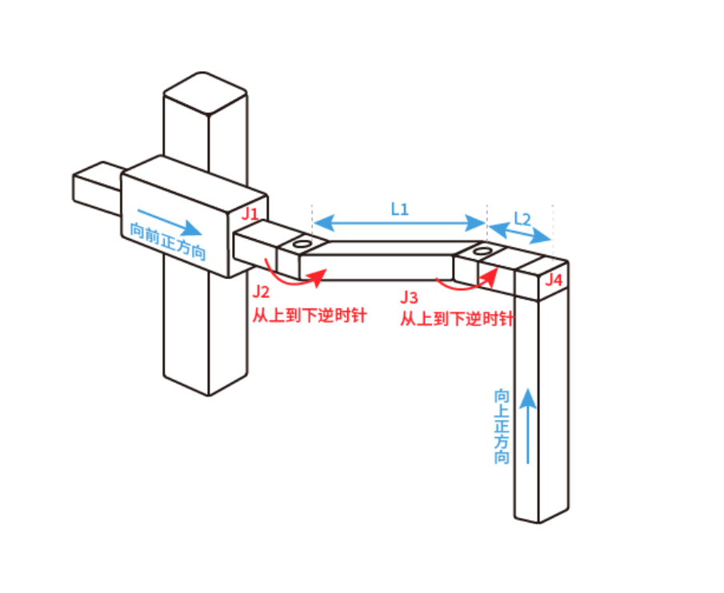

### 参数说明

| 参数 | 说明 | 参数值正负说明 |
| :--- | :--- | :--- |
| L1 | X轴行程长度 | 正值 |
| L2 | Y轴行程长度 | 正值 |
| L3 | 移动平台到第一个旋转中心的距离 | 与Z+方向一致为正值 |
| L4 | 第一个旋转中心到第二个旋转中心的距离 | 与X+方向一致为正值 |
| L5 | 第二个旋转中心到末端法兰面的距离 | 与Z-方向一致为正值 |

### 螺距参数

| 参数 | 说明 | 单位 |
| :--- | :--- | :--- |
| 螺距X | X轴丝杆转动360°时滑块移动的距离 | mm |
| 螺距Y | Y轴丝杆转动360°时滑块移动的距离 | mm |

### 模型方向（零点旋转方向）

| 参数 | 参数值正负说明 |
| :--- | :--- |
| J1 (X) | 向右为正 |
| J2 (Y) | 向前为正 |
| J3 (C1) | 逆时针 |
| J4 (C2) | 逆时针 |

---

## 六轴串联-XYZCAC

### 结构特点

六轴串联-XYZCAC采用X、Y、Z三个线性移动轴和C、A、C三个旋转轴的组合结构，适用于需要复杂姿态调整的六轴加工应用场景。

### 参考零点

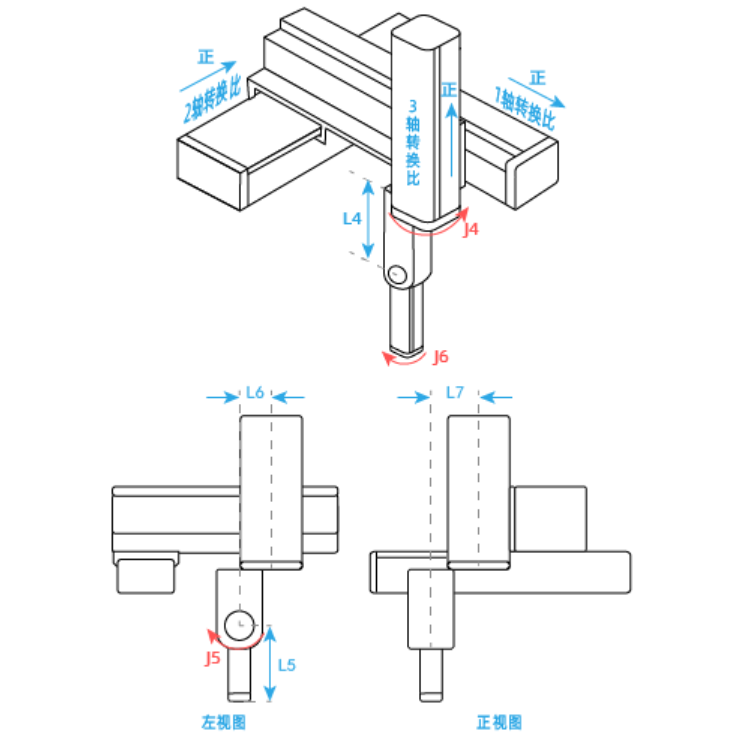

### 参数说明

| 参数 | 说明 | 参数值正负说明 |
| :--- | :--- | :--- |
| L1 | X轴行程长度 | 正值 |
| L2 | Y轴行程长度 | 正值 |
| L3 | Z轴行程长度 | 正值 |
| L4 | Z轴移动平面到第一个C轴旋转中心的距离 | 与Z+方向一致为正值 |
| L5 | 第一个C轴旋转中心到A轴旋转中心的距离 | 与X+方向一致为正值 |
| L6 | A轴旋转中心到第二个C轴旋转中心的距离 | 与Z-方向一致为正值 |
| L7 | 第二个C轴旋转中心到末端法兰面的距离 | 与Z-方向一致为正值 |

### 螺距参数

| 参数 | 说明 | 单位 |
| :--- | :--- | :--- |
| 螺距X | X轴丝杆转动360°时滑块移动的距离 | mm |
| 螺距Y | Y轴丝杆转动360°时滑块移动的距离 | mm |
| 螺距Z | Z轴丝杆转动360°时滑块移动的距离 | mm |

### 模型方向（零点旋转方向）

| 参数 | 参数值正负说明 |
| :--- | :--- |
| J1 (X) | 向右为正 |
| J2 (Y) | 向前为正 |
| J3 (Z) | 向上为正 |
| J4 (C1) | 逆时针为正（绕Z轴） |
| J5 (A) | 逆时针为正（绕X轴） |
| J6 (C2) | 逆时针为正（绕Z轴） |

---

## 五轴混联机

### 结构特点

五轴混联机采用混合结构设计，结合了串联和并联机构的特点，适用于需要高刚度和灵活姿态调整的应用场景。

### 参考零点

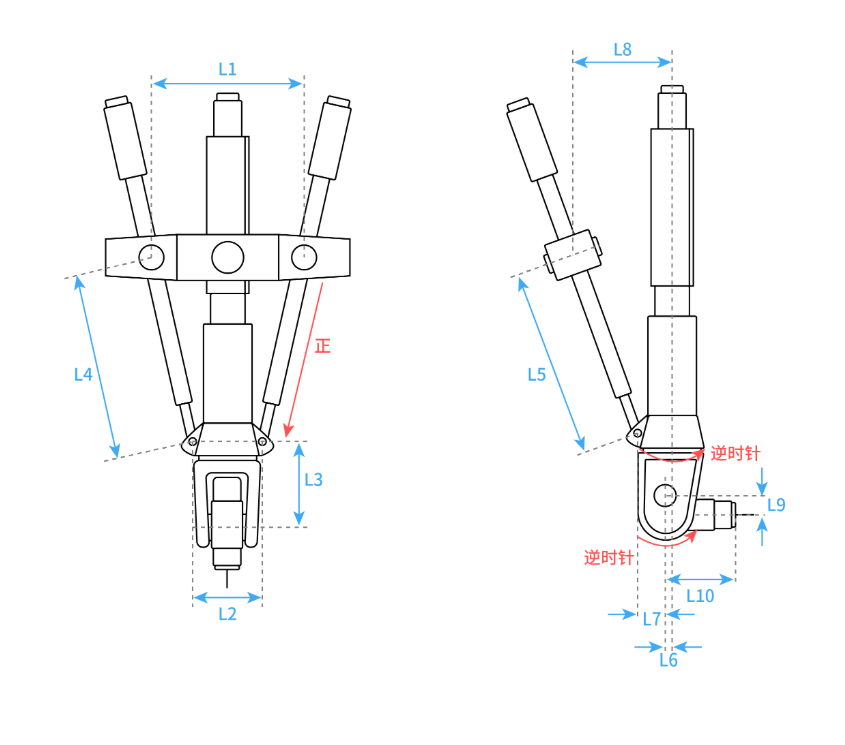

### 参数说明

| 参数 | 说明 | 参数值正负说明 |
| :--- | :--- | :--- |
| L1 | 底座到第一关节旋转中心的距离 | 与Z+方向一致为正值 |
| L2 | 第一关节旋转中心到第二关节旋转中心的距离 | 与X+方向一致为正值 |
| L3 | 第二关节旋转中心到第三关节旋转中心的距离 | 与X+方向一致为正值 |
| L4 | 第三关节旋转中心到第四关节旋转中心的距离 | 与Z+方向一致为正值 |
| L5 | 第四关节旋转中心到末端法兰面的距离 | 与Z-方向一致为正值 |

### 模型方向（零点旋转方向）

| 参数 | 参数值正负说明（从上往下、从前往后、从左往右） |
| :--- | :--- |
| J1 | 逆时针 |
| J2 | 逆时针 |
| J3 | 逆时针 |
| J4 | 顺时针 |
| J5 | 逆时针 |

---

## 四轴串联-XCZC

### 结构特点

四轴串联-XCZC采用X移动轴、C旋转轴、Z移动轴和C旋转轴的组合结构，适用于需要平面移动和双旋转定位的应用场景。

### 参考零点

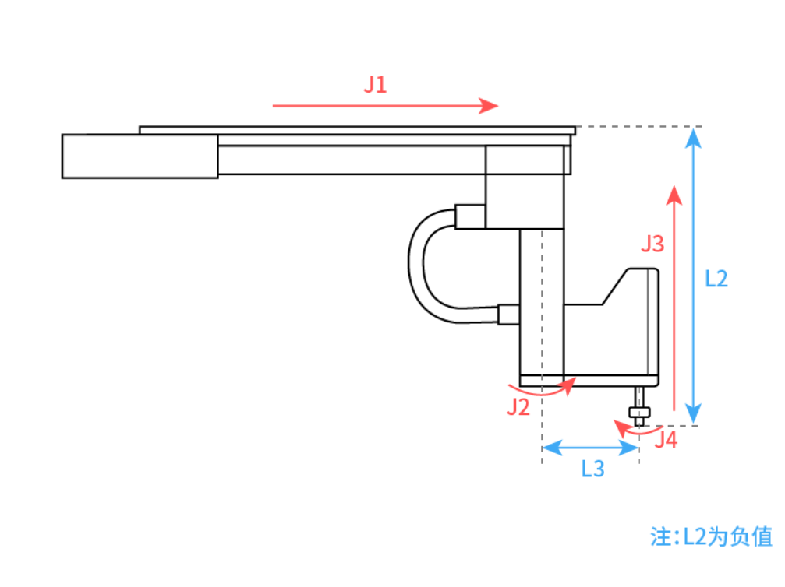

### 参数说明

| 参数 | 说明 | 参数值正负说明 |
| :--- | :--- | :--- |
| L1 | X轴行程长度 | 正值 |
| L2 | X轴移动平面到C轴旋转中心的距离 | 与Z+方向一致为正值 |
| L3 | C轴旋转中心到Z轴移动平台的距离 | 与Z+方向一致为正值 |
| L4 | Z轴移动平台到末端C轴旋转中心的距离 | 与Z+方向一致为正值 |
| L5 | 末端C轴旋转中心到法兰面的距离 | 与Z-方向一致为正值 |

### 螺距参数

| 参数 | 说明 | 单位 |
| :--- | :--- | :--- |
| 螺距X | X轴丝杆转动360°时滑块移动的距离 | mm |
| 螺距Z | Z轴丝杆转动360°时滑块移动的距离 | mm |

### 模型方向（零点旋转方向）

| 参数 | 参数值正负说明 |
| :--- | :--- |
| J1 (X) | 向右为正 |
| J2 (C1) | 逆时针 |
| J3 (Z) | 向上为正 |
| J4 (C2) | 顺时针 |

---

## 六轴串联-CBBCBA

### 结构特点

六轴串联-CBBCBA采用六个旋转轴的串联结构，适用于需要复杂姿态调整的六轴机器人应用场景。

### 参考零点

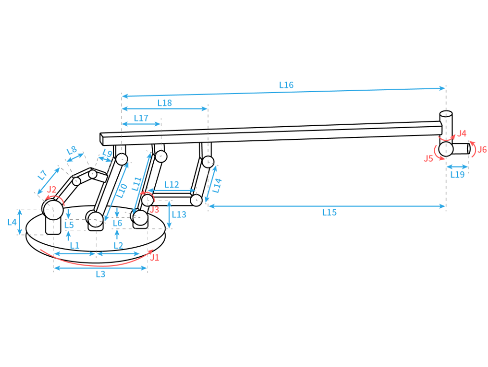

### 参数说明

| 参数 | 说明 | 参数值正负说明（机器人零点状态下参考直角坐标系方向） |
| :--- | :--- | :--- |
| L1 | 机器人底座面到2轴旋转轴线的公垂线段的长度 | 与Z+方向一致为正值 |
| L2 | 2轴旋转轴线到3轴旋转轴线的公垂线段的长度 | 与Z+方向一致为正值 |
| L3 | 3轴旋转轴线到4轴旋转轴线的公垂线段的长度 | 与X+方向一致为正值 |
| L4 | 4轴旋转轴线到5轴旋转轴线的公垂线段的长度 | 与Z-方向一致为正值 |
| L5 | 5轴旋转轴线到6轴旋转轴线的公垂线段的长度 | 与X+方向一致为正值 |
| L6 | 6轴旋转轴线到末端法兰面的公垂线段的长度 | 与Z-方向一致为正值 |
| L7 | 1轴旋转轴线到2轴旋转轴线的公垂线段的长度 | 与X+方向一致为正值 |

### 模型方向（零点旋转方向）

| 参数 | 参数值正负说明（从上往下、从前往后、从左往右） |
| :--- | :--- |
| J1 | 逆时针 |
| J2 | 逆时针 |
| J3 | 逆时针 |
| J4 | 逆时针 |
| J5 | 顺时针 |
| J6 | 逆时针 |

---

## 三轴串联-CCA

### 结构特点

三轴串联-CCA采用两个旋转轴（C轴）和一个旋转轴（A轴）的组合结构，适用于需要复杂旋转定位的应用场景。

### 参考零点

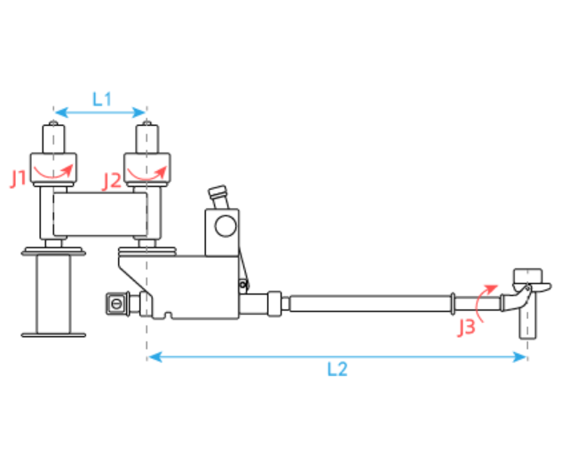

### 参数说明

| 参数 | 说明 | 参数值正负说明（机器人零点状态下参考直角坐标系方向） |
| :--- | :--- | :--- |
| L1 | 1轴旋转中心到2轴旋转中心的距离 | 与X+方向一致为正值 |
| L2 | 2轴旋转中心到A轴旋转中心的距离 | 与Z+方向一致为正值 |
| L3 | A轴旋转中心到末端法兰面的距离 | 与Z-方向一致为正值 |

### 模型方向（零点旋转方向）

| 参数 | 参数值正负说明（从上往下、从前往后、从左往右） |
| :--- | :--- |
| J1 (C1) | 逆时针 |
| J2 (C2) | 逆时针 |
| J3 (A) | 逆时针为正（绕X轴） |

---

## Delta并联机器人

### 结构特点

Delta并联机器人采用3个并联运动链结构，具有高速、高精度的特点，适用于分拣、装配等高速操作场景。

### 参考零点

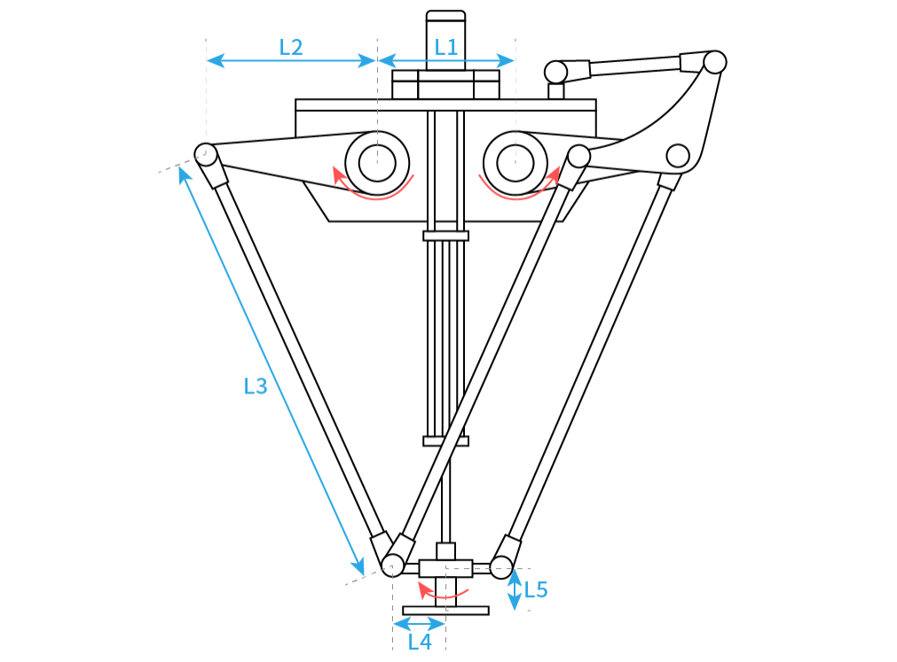

### 参数说明

| 参数 | 说明 | 参数值正负说明 |
| :--- | :--- | :--- |
| R1 | 上平台各关节点到中心的距离 | 正值 |
| R2 | 下平台各关节点到中心的距离 | 正值 |
| L1 | 主动臂长度 | 正值 |
| L2 | 从动臂长度 | 正值 |
| H | 上下平台之间的初始距离 | 正值 |

### 模型方向（零点旋转方向）

| 参数 | 参数值正负说明（从上往下、从前往后、从左往右） |
| :--- | :--- |
| J1 | 逆时针 |
| J2 | 逆时针 |
| J3 | 逆时针 |
| J4 | 顺时针 |

---

## 五轴串联-XYZBC

### 结构特点

五轴串联-XYZBC采用X、Y、Z三个线性移动轴和B、C两个旋转轴的组合结构，适用于需要复杂姿态调整的五轴加工应用场景。

### 参考零点

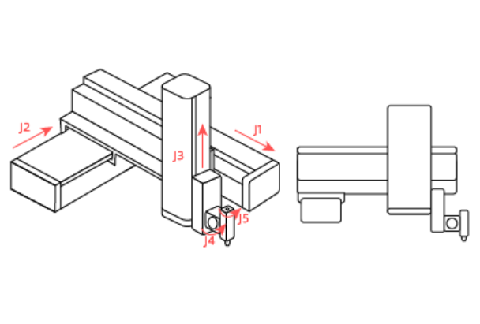

### 参数说明

| 参数 | 说明 | 参数值正负说明 |
| :--- | :--- | :--- |
| L1 | X轴行程长度 | 正值 |
| L2 | Y轴行程长度 | 正值 |
| L3 | Z轴行程长度 | 正值 |
| L4 | Z轴移动平面到B轴旋转中心的距离 | 与Z+方向一致为正值 |
| L5 | B轴旋转中心到C轴旋转中心的距离 | 与X+方向一致为正值 |
| L6 | C轴旋转中心到末端法兰面的距离 | 与Z-方向一致为正值 |

### 螺距参数

| 参数 | 说明 | 单位 |
| :--- | :--- | :--- |
| 螺距X | X轴丝杆转动360°时滑块移动的距离 | mm |
| 螺距Y | Y轴丝杆转动360°时滑块移动的距离 | mm |
| 螺距Z | Z轴丝杆转动360°时滑块移动的距离 | mm |

### 模型方向（零点旋转方向）

| 参数 | 参数值正负说明 |
| :--- | :--- |
| J1 (X) | 向右为正 |
| J2 (Y) | 向前为正 |
| J3 (Z) | 向上为正 |
| J4 (B) | 逆时针为正（绕Y轴） |
| J5 (C) | 逆时针为正（绕Z轴） |

---

## 三轴串联-BBB

### 结构特点

三轴串联-BBB采用三个旋转轴（B轴，绕Y轴旋转）的串联结构，适用于需要绕Y轴多次旋转定位的应用场景。

### 参考零点

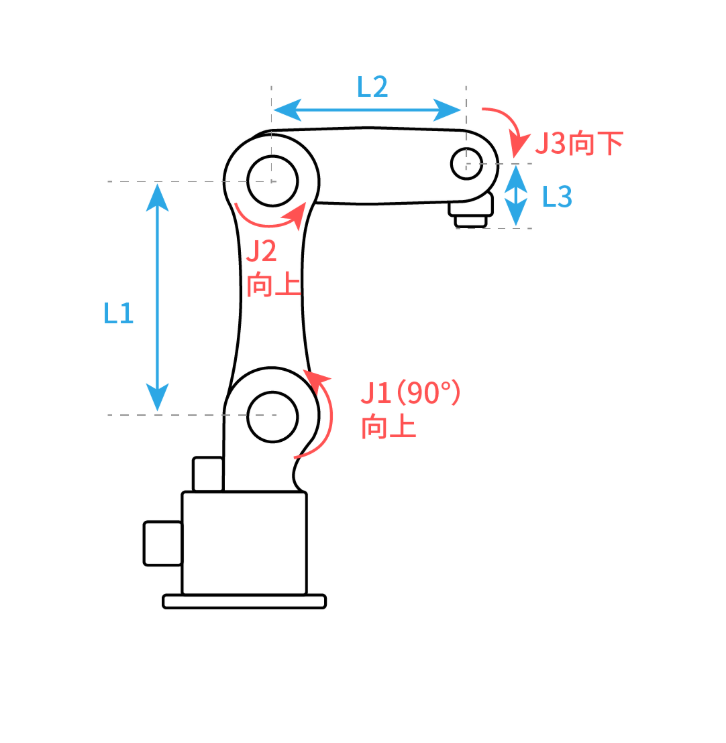

### 参数说明

| 参数 | 说明 | 参数值正负说明（机器人零点状态下参考直角坐标系方向） |
| :--- | :--- | :--- |
| L1 | 1轴旋转中心到2轴旋转中心的距离 | 与X+方向一致为正值 |
| L2 | 2轴旋转中心到3轴旋转中心的距离 | 与X+方向一致为正值 |
| L3 | 3轴旋转中心到末端法兰面的距离 | 与X+方向一致为正值 |

### 模型方向（零点旋转方向）

| 参数 | 参数值正负说明（从上往下、从前往后、从左往右） |
| :--- | :--- |
| J1 (B1) | 逆时针为正（绕Y轴） |
| J2 (B2) | 逆时针为正（绕Y轴） |
| J3 (B3) | 逆时针为正（绕Y轴） |

---

## 四轴并联机器人（Delta）

### 结构特点

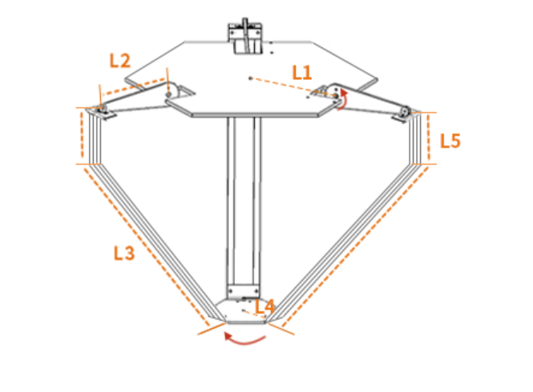

并联机器人具有3个或4个并联运动链，末端执行器通过多个连杆与底座相连，具有高速、高精度的特点。

### 参数说明

| 参数 | 说明 | 参数值正负说明 |
| :--- | :--- | :--- |
| R1 | 上平台各关节点到中心的距离 | 正值 |
| R2 | 下平台各关节点到中心的距离 | 正值 |
| L1 | 主动臂长度 | 正值 |
| L2 | 从动臂长度 | 正值 |
| H | 上下平台之间的初始距离 | 正值 |

### 模型方向（零点旋转方向）

| 参数 | 参数值正负说明（从上往下、从前往后、从左往右） |
| :--- | :--- |
| J1 | 逆时针 |
| J2 | 逆时针 |
| J3 | 逆时针 |
| J4 | 顺时针 |

---

## Tricept机器人

### 参考零点

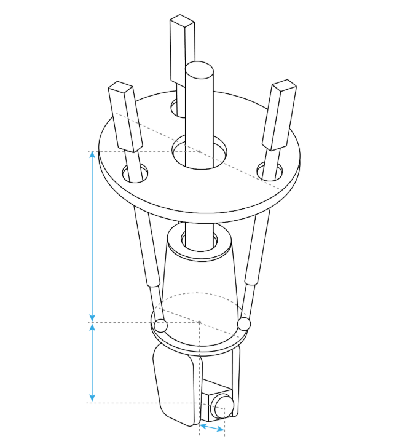

---

## 单轴直角机器人

### 参考零点

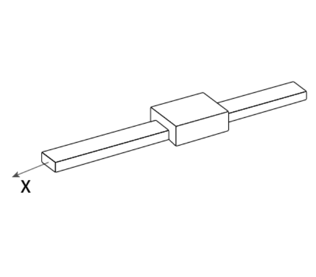

---

## AI 检索专用问答对 (Q&A for Retrieval)

**Q: DH参数包括哪四个参数？**

A: DH参数包括四个参数：连杆长度(a)、连杆扭角(α)、连杆偏距(d)和关节角(θ)。

**Q: DH参数与机器人精度有什么关系？**

A: DH参数是机器人运动学模型的基础，参数的准确性直接影响机器人末端定位精度。不准确的DH参数会导致理论位置与实际位置之间存在误差。

**Q: 工业机器人精度标定的目的是什么？**

A: 精度标定的目的是通过测量机器人末端在工作空间内多个位置的实际坐标，与理论坐标对比，修正DH参数和其他误差参数，提高机器人的定位精度。

**Q: 常用的机器人标定方法有哪些？**

A: 常用的标定方法包括激光跟踪仪标定、球杆仪标定、视觉标定和自标定。其中激光跟踪仪标定精度最高，适用于高精度要求场景。

**Q: 标定时需要注意什么？**

A: 标定时需确保机器人处于稳定环境，避免温度变化影响测量精度；标定前需进行机器人零点校准；采集数据点应均匀分布在工作空间内；标定后需进行精度验证测试。

**Q: 耦合比的作用是什么？**

A: 耦合比用于描述关节之间的耦合关系，当一个关节运动时另一个关节也会跟随运动，通过设置耦合比可以抵消这种耦合作用。

**Q: SCARA机器人的螺距是什么？**

A: SCARA机器人的3轴是控制丝杆上下运动，控制丝杆的旋转轴转动360°时丝杆上下移动的距离就是螺距。

**Q: 四轴码垛丝杆机器人的转化比是什么？**

A: 转化比就是关节转360度（也可理解为电机转一圈）走的距离（单位：mm）。

**Q: 修改DH参数后需要注意什么？**

A: 修改参数后需重新启动控制器生效，建议在专业人员指导下进行参数配置，参数配置错误可能导致机器人运动异常或报错。

**Q: 什么是连杆长度(a_i)？**

A: 连杆长度(a_i)是指从第i-1关节轴线到第i关节轴线的公垂线长度，定义了相邻两个关节轴线之间的垂直距离，直接影响机器人的工作空间范围和运动学计算精度。

**Q: 什么是连杆扭角(α_i)？**

A: 连杆扭角(α_i)是指第i-1关节轴线与第i关节轴线之间的夹角，绕公垂线测量，决定了连杆之间的扭转关系，影响机器人的姿态可达性和姿态精度。

**Q: 什么是连杆偏距(d_i)？**

A: 连杆偏距(d_i)是指沿第i-1关节轴线方向，从第i-1连杆坐标系原点到公垂线的距离。对于旋转关节，此参数为常数；对于移动关节，此参数为关节变量。

**Q: 什么是关节角(θ_i)？**

A: 关节角(θ_i)是指绕第i关节轴线的旋转角度。对于旋转关节，此参数为关节变量；对于移动关节，此参数为常数。

**Q: DH参数坐标系的建立规则是什么？**

A: DH参数坐标系建立规则为：1. Z轴沿关节i的运动轴线；2. X轴垂直于Z轴，指向关节i+1；3. Y轴由右手定则确定；4. 原点位于X轴与Z轴的交点。

**Q: 为什么DH参数需要在零点位置测量？**

A: DH参数是基于机器人零点位置建立的运动学模型参数，只有在零点位置测量才能保证参数的准确性和一致性，确保机器人运动学计算的正确性。

**Q: 耦合比如何计算？**

A: 耦合比的计算公式为：耦合比 = 跟随轴旋转角度 / 主轴旋转角度。通过设置耦合比参数，可以抵消关节之间的耦合作用。

**Q: 模型方向的正负是如何定义的？**

A: 模型方向的正负定义通常为：从上往下、从前往后、从左往右看，逆时针旋转为正值，顺时针旋转为负值。移动轴通常以向右、向前、向上为正值方向。

**Q: 五轴方向的设置有什么重要性？**

A: 五轴方向的设置必须与标定零点时的五轴方向一致，否则机器人在运动时会报错。这是确保机器人运动学模型正确的关键参数之一。

**Q: 什么是螺距参数？**

A: 螺距参数是指丝杆转动360°时滑块移动的距离，单位为mm。对于移动轴（如X、Y、Z轴），螺距参数决定了电机旋转与直线位移之间的转换关系。

**Q: 四轴码垛丝杆机器人的放大比是什么？**

A: 放大比是指工具末端移动的距离与三轴丝杆移动的距离之比，用于描述丝杆机构的传动比特性。

**Q: J2+J3限位是什么？**

A: J2+J3限位是指当2轴和3轴存在耦合关系时，对J2+J3的角度和进行动态限位。如果J2+J3的角度超出设置范围，机器人会报错（机器人2，3轴动态限位超限）。

**Q: 并联机器人的参数有哪些？**

A: 并联机器人（Delta）的主要参数包括：上平台半径(R1)、下平台半径(R2)、主动臂长度(L1)、从动臂长度(L2)和上下平台初始距离(H)。

**Q: 不同类型机器人的DH参数有什么区别？**

A: 不同类型机器人的DH参数区别主要在于关节类型（旋转轴C、移动轴Z/X/Y）、连杆数量和几何结构。例如，SCARA机器人包含移动轴，需要额外的螺距参数；并联机器人采用不同的参数定义（平台半径、臂长等）。

**Q: 如何验证DH参数的正确性？**

A: 验证DH参数正确性的方法包括：在机器人工作空间内选取多个位置，对比理论坐标与实际测量坐标；检查机器人是否能正确到达预期位置；验证机器人运动是否平稳无异常。

**Q: DH参数错误会导致什么问题？**

A: DH参数错误会导致机器人运动异常、定位精度下降、末端执行器无法到达目标位置，严重时可能导致机器人碰撞或报错停机。

**Q: 是否所有机器人都需要设置耦合比？**

A: 不是所有机器人都需要设置耦合比。只有当机器人存在关节耦合现象（即一个关节运动时另一个关节也会跟随运动）时，才需要设置耦合比参数来抵消耦合作用。

**Q: 如何确定DH参数的正负符号？**

A: DH参数的正负符号根据机器人零点状态下的直角坐标系方向确定。通常约定：与X+、Y+、Z+方向一致为正值，与X-、Y-、Z-方向一致为负值。

**Q: 机器人结构特点对DH参数有什么影响？**

A: 机器人结构特点决定了DH参数的数量和类型。例如，全旋转关节机器人主要需要杆长参数；包含移动轴的机器人需要额外的螺距参数；并联机器人采用平台半径和臂长等特殊参数。

---

## 相关资源

- [系统功能调试手册](./系统功能调试手册.md)
- [运动控制类指令](./运动控制类指令.md)