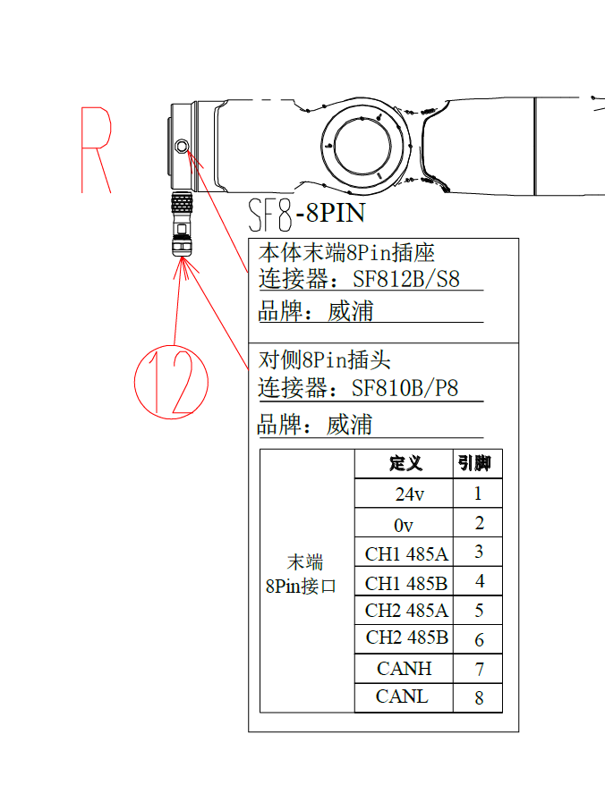
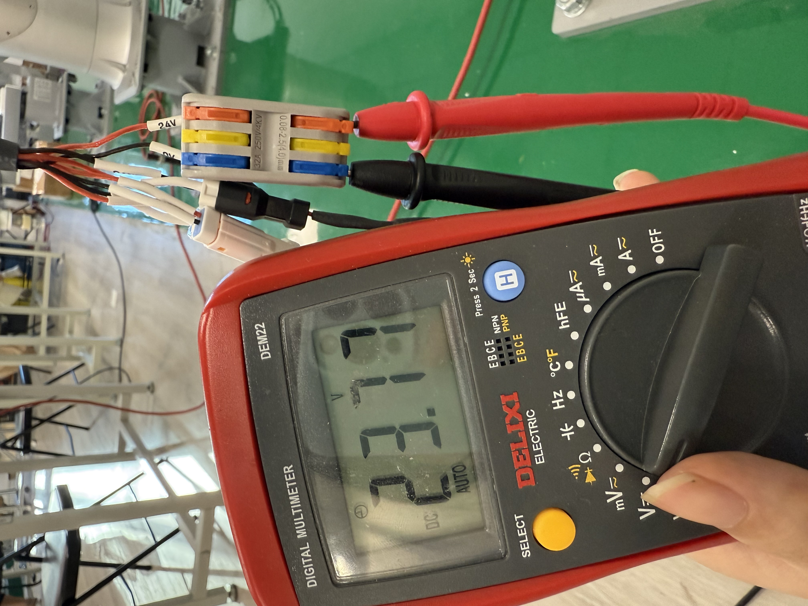
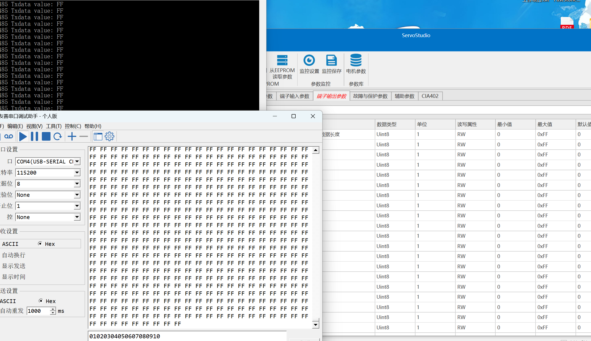
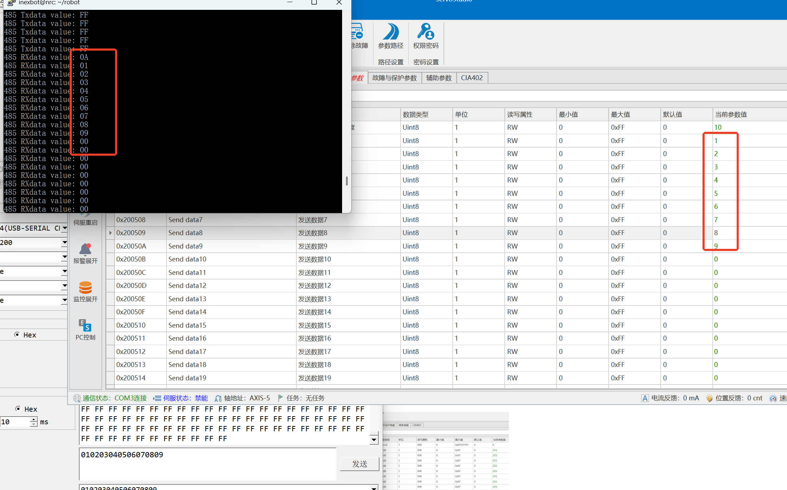
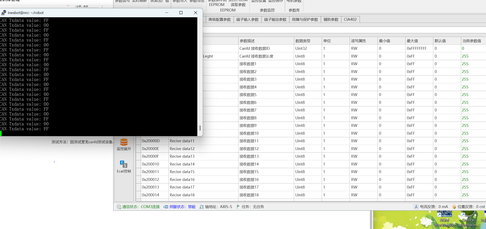
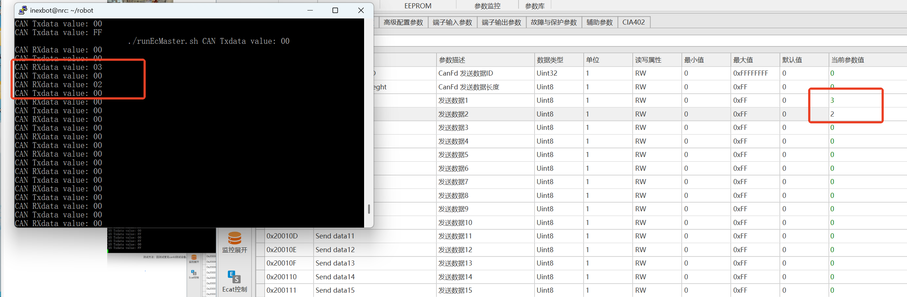

# 天机七轴CBCBCBA定制适配

## 版本说明

目前该适配仅支持 **24.03版本**，原因是七轴模型目前只适配了24.03版本。模型适配流程与正常适配一致。

---

## 末端通讯板端口定义

### 端口布局

### 端口功能说明

**1和2端口：供电端口**
- 末端通讯板-8PIN_DC 24V接口是否有效检测：8Pin插头接入法兰末端，万用表测量24V输出口电压，无需配置节点

**3和4端口：485 1通讯**
- 注意：旧版本硬件（5月）的485 1功能不能使用
- 目前未有完善功能，只能进行读写转发操作
- 测试结果：控制器发送FF，上位机正常接收FF，串口模拟器正常读写

**4和5端口：485 2通讯**
- 目前未有完善功能，只能进行读写转发操作

**7和8端口：CAN FD通讯**
- 目前未有完善功能，只能进行读写转发操作
- 测试方法：采用伺服上位机通讯测试或者真实CAN FD测试设备
- 测试结果：控制器发送FF，上位机正常接收FF

---

## AI 检索专用问答对 (Q&A for Retrieval)

**Q: 天机七轴CBCBCBA适配支持哪些版本？**

A: 目前仅支持24.03版本，七轴模型目前只适配了24.03版本。

**Q: 末端通讯板的端口如何定义？**

A: 末端通讯板共有8个端口：1和2端口为供电端口（24V），3和4端口为485 1通讯，4和5端口为485 2通讯，7和8端口为CAN FD通讯。

**Q: 如何检测末端通讯板供电是否正常？**

A: 将8Pin插头接入法兰末端，使用万用表测量24V输出口电压，无需配置节点。

**Q: 485 1通讯功能有什么限制？**

A: 旧版本硬件（5月）的485 1功能不能使用，目前485通讯仅有读写转发功能，尚未完善。

**Q: CAN FD通讯如何测试？**

A: 因测试室无CAN FD测试设备，暂时采用伺服上位机通讯测试，控制器发送FF，上位机正常接收FF即为测试通过。

---

## 相关资源

- [系统功能调试手册](../系统功能调试手册.md)
