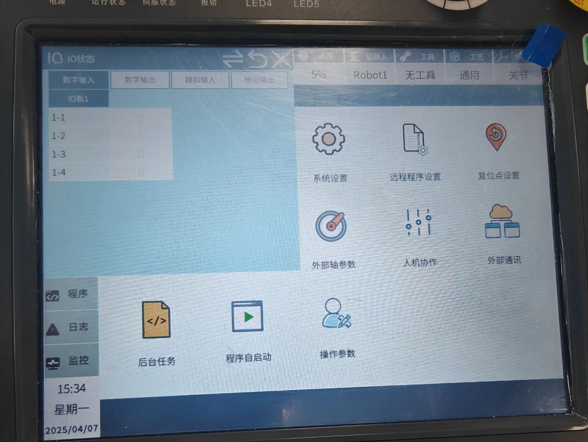
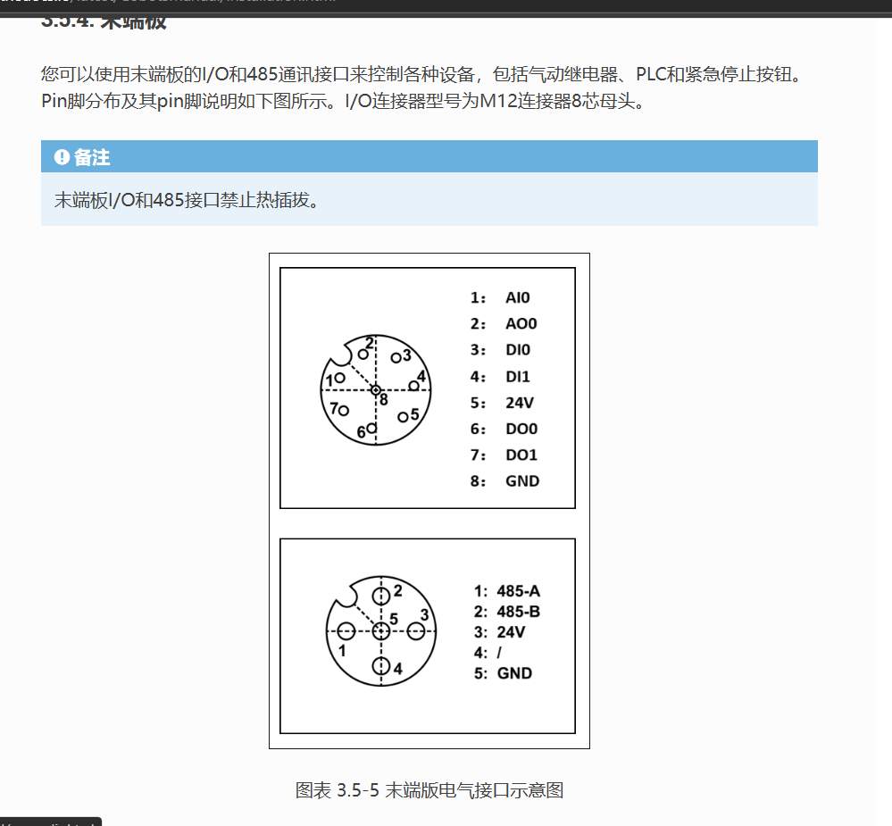
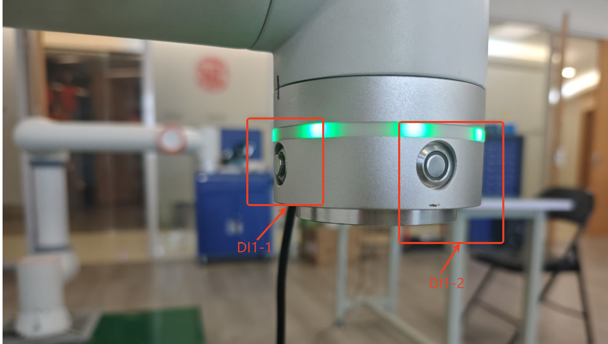
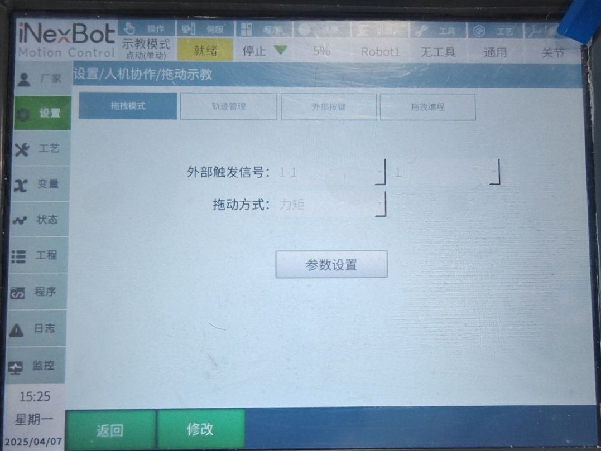
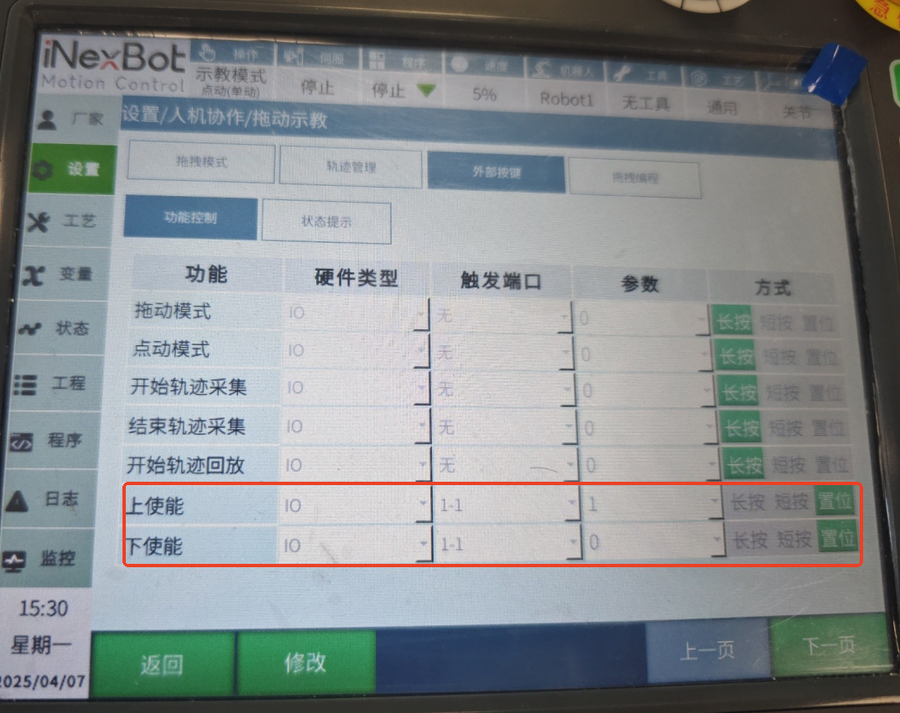

# 法奥fr5适配

## 1. 文档概述

### 1.1 文档目的
本文档旨在详细介绍法奥fr5机器人的适配方案，包括机器人配置、末端连接器说明、指示灯状态、拖拽功能设置和点记录操作等内容，帮助用户正确配置和使用法奥fr5机器人的末端IO功能。

### 1.2 适用范围
适用于法奥fr5机器人的适配和功能配置。

### 1.3 术语定义
- **末端IO**：机器人末端执行器上的输入输出接口
- **拖拽模式**：通过外部触发信号使机器人进入可手动拖拽的模式
- **点记录**：通过外部按钮记录并替换程序中的局部p点
- **EC库文件**：EtherCAT总线配置文件，用于识别伺服系统

## 2. 机器人配置

### 2.1 所需文件

| 文件 | 大小 | 上传时间 |
| :--- | :--- | :--- |
| [C1102-66296-68820-rtl-24.03-6.0.9-20250408-110947.zip](https://ones.inexbot.com/wiki/?/team/RnqpQ1Yp/space/XLUijCza/page/Eycytnrm) | 5.14 MB | 2025-04-08 13:32 |
| [slaveTypeLib.json](https://ones.inexbot.com/wiki/?/team/RnqpQ1Yp/space/XLUijCza/page/Eycytnrm) | 0.34 KB | 2025-04-08 14:27 |
| [法奥ec库文件.zip](https://ones.inexbot.com/wiki/?/team/RnqpQ1Yp/space/XLUijCza/page/Eycytnrm) | 18.77 MB | 2025-04-08 14:33 |
| [FrServoAsix-6-Fr_Cobot_Axle_Asix-1.xml](https://ones.inexbot.com/wiki/?/team/RnqpQ1Yp/space/XLUijCza/page/Eycytnrm) | 129.81 KB | 2025-04-08 14:37 |

### 2.2 配置步骤
1. 上传法奥对应EC库文件（未上传EC库无法识别到伺服）
2. 升级适配好的控制器程序
3. 上传slaveType文件
4. 上传ENI文件

### 2.3 常见错误
如果报0003错误，是伺服库文件不对，需要重新上传伺服库文件。

## 3. 末端连接器

### 3.1 连接器说明
末端8芯连接器提供以下IO接口：
- 2路IO输出
- 2路IO输入
- 1路模拟IO输出
- 1路模拟IO输入

### 3.2 按钮功能定义
其中DI1-1是拖拽按钮，DI1-2是记录点位按钮。

## 4. 指示灯

| 功能 | LED颜色 |
| :--- | :--- |
| 运行模式 | 蓝色长亮 |
| 示教模式 | 绿色长亮 |
| 拖拽模式 | 白青色长亮 |
| 按钮盒记录点 | 紫色闪烁两下 |
| 开始运行程序或类似运动至此 | 蓝色闪烁两下 |
| 停止运行或运动到该点后 | 红色闪烁两下 |
| 报错 | 红色长亮 |
| 下电 | 黄色闪烁两下 |

## 5. 末端拖拽

### 5.1 拖拽模式设置
设置外部触发信号为1-1，当1-1为1时就会进入拖拽模式。

### 5.2 使能设置
设置上使能和下使能触发端口为1-1，当1-1为1时候上电，为0的时候下电。

### 5.3 拖拽操作流程
1. 完成机器人辨识
2. 设置好所需3个触发端口
3. 按下DI1-1按钮，机器人就会先切换至拖拽模式，然后上电，最后就可以进行拖拽

## 6. 点记录

### 6.1 点记录功能
点记录是通过点击机器人上外部按钮来记录并替换程序中局部p点。

### 6.2 使用条件
- 需要新建一个作业文件
- 作业文件中需存在局部p点
- 如果没有打开作业文件或作业文件当中不存在局部p点就会报错
- 作业文件只能在示教模式下记录点位

### 6.3 操作流程
1. 在示教模式下打开包含局部p点的作业文件
2. 点击点记录按钮（DI1-2），就会从第一个p点依次往后覆盖
3. 记录超过设置的p点，就会重新从第一个p点开始覆盖
4. 作业文件退出后，再次进入：
   - 如果是相同作业文件，则累加记录
   - 如果是不同的作业文件，就从头记录

## 7. 常见问题

### 7.1 法奥协作机器人上传EC库文件后仍然无法识别伺服
- 可能原因：EC库文件版本不匹配
- 解决方法：确认使用正确版本的EC库文件，重新上传并重启控制器

### 7.2 拖拽功能无法正常工作
- 可能原因：触发端口设置错误或机器人辨识未完成
- 解决方法：检查触发端口设置，确保机器人辨识已完成

### 7.3 点记录功能报错
- 可能原因：作业文件中没有局部p点或不在示教模式
- 解决方法：在示教模式下打开包含局部p点的作业文件

## 8. 版本历史

| 版本 | 日期 | 说明 |
| :---: | :---: | :--- |
| 1.0.0 | 2026-04-07 |  |

## 9. 相关资源

### 9.1 参考文档
- 《法奥机器人用户手册》
- 《EtherCAT配置指南》

### 9.2 相关技术文档
- [机器人控制系统用户手册](../24.03版本/机器人控制系统用户手册.md)
- [人机协作功能指南](../24.03版本/人机协作.md)

---

## AI 检索专用问答对 (Q&A for Retrieval)

**Q: 法奥FR5机器人配置需要哪些文件？**

A: 需要上传以下文件：1. 法奥对应EC库文件；2. 适配好的控制器程序；3. slaveType文件；4. ENI文件。

**Q: 法奥FR5机器人末端连接器提供哪些IO接口？**

A: 末端8芯连接器提供以下IO接口：2路IO输出、2路IO输入、1路模拟IO输出、1路模拟IO输入。

**Q: 法奥FR5机器人的拖拽功能如何设置？**

A: 1. 设置外部触发信号为1-1，当1-1为1时就会进入拖拽模式；
2. 设置上使能和下使能触发端口为1-1，当1-1为1时候上电，为0的时候下电；
3. 完成机器人辨识；
4. 按下DI1-1按钮，机器人就会先切换至拖拽模式，然后上电，最后就可以进行拖拽。

**Q: 法奥FR5机器人的点记录功能如何使用？**

A: 1. 在示教模式下打开包含局部p点的作业文件；
2. 点击点记录按钮（DI1-2），就会从第一个p点依次往后覆盖；
3. 记录超过设置的p点，就会重新从第一个p点开始覆盖；
4. 作业文件退出后，再次进入：如果是相同作业文件，则累加记录；如果是不同的作业文件，就从头记录。

**Q: 法奥FR5机器人上传EC库文件后仍然无法识别伺服怎么办？**

A: 可能原因是EC库文件版本不匹配，解决方法是确认使用正确版本的EC库文件，重新上传并重启控制器。

**Q: 法奥FR5机器人的拖拽功能无法正常工作怎么办？**

A: 可能原因是触发端口设置错误或机器人辨识未完成，解决方法是检查触发端口设置，确保机器人辨识已完成。

**Q: 法奥FR5机器人的点记录功能报错怎么办？**

A: 可能原因是作业文件中没有局部p点或不在示教模式，解决方法是在示教模式下打开包含局部p点的作业文件。

**Q: 法奥FR5机器人的指示灯状态有哪些？**

A: 运行模式：蓝色长亮；示教模式：绿色长亮；拖拽模式：白青色长亮；按钮盒记录点：紫色闪烁两下；开始运行程序或类似运动至此：蓝色闪烁两下；停止运行或运动到该点后：红色闪烁两下；报错：红色长亮；下电：黄色闪烁两下。