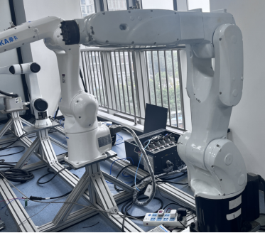
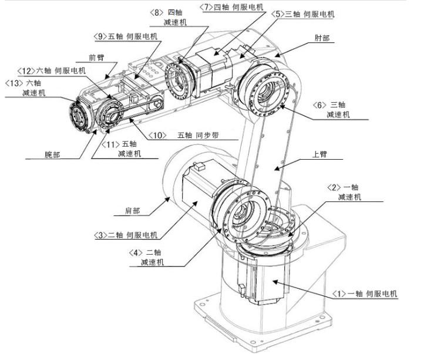
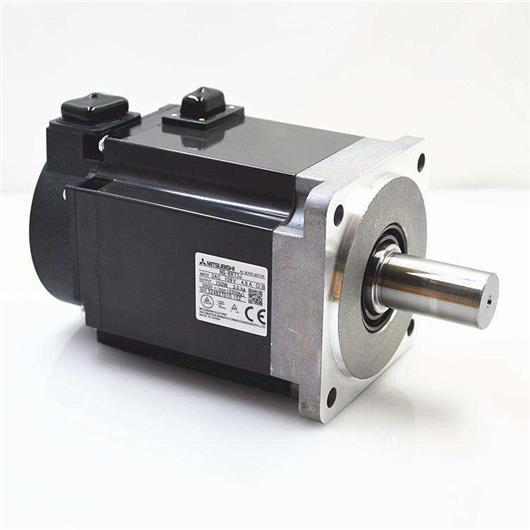
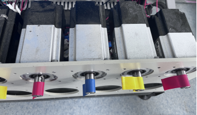
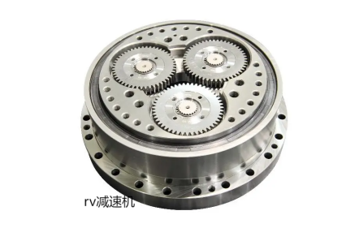
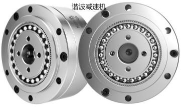

# 机器人的构成

工业机器人由机器人本体，伺服电机，减速机，伺服驱动器，控制器，IO等其它组件构成

## 机器人本体

机器人本体主要是机器人机械结构部分，如下图包括机器人的手部、腕部、臂部和机座。

## 伺服电机（机器人的每一个轴都会有一个伺服电机）

伺服电机有多部分组成，每个部分有不同的功能和作用，每个部分协同工作，实现对电机的控制和调整以及实现位置、速度、扭矩控制。

组成：

- 电机部分：一般由转子、定子、绕组、磁极等部分组成电机的类型，包括直流伺服电机、交流伺服电机、步进伺服电机等。

- 传感器部分：伺服电机的传感器部分通常包括位置传感器、速度传感器、扭矩传感器等，用于检测电机的位置、速度、扭矩等参数、并将结果反馈给控制系统。

- 控制器部分：伺服电机的控制器部分通常由控制芯片、编码器等组成，用于接收传感器反馈的参数，并将控制信号输出到电机，实现对电机的位置、速度等参数的调整。

- 电源部分：伺服电机的电源部分通常由电源变压器、整流器、滤波器等组成，用于提供稳定的电源电压和电流，保证电机的正常工作。    

功能：

- 位置控制功能：伺服电机能够实现高精度的位置控制，可以根据输入信号精确控制电机的位置和运动轨迹。

- 速度控制功能：伺服电机能够根据输入信号实现精确的速度控制，可以控制电机的转速和转向。

- 扭矩控制功能：伺服电机能够根据输入信号实现精确的扭矩控制，可以控制电机的输出扭矩大小和方向。

- 运动平滑功能：伺服电机能够实现平滑的运动控制，避免了机械运动过程中的震动，提高了精度和稳定性。

## 减速机（机器人的每一个轴都会有一个减速机）

作用：

- 精准点位：工业机器人通常执行重复的动作，以完成相同的工序；为保证工业机器人在生产中能够可靠地完成工序任务，并确保工艺质量，对工业机器人的定位精度和重复定位精度要求很高。

- 增加扭矩：减速机的作用是降低速度的同时增加输出扭矩

- 降低了负载的惯量：可以在减速过程中有效地减少主机的负载惯量，从而降低噪音和振动，提高工作效率和运行稳定性。

- 维护电机：通过调节电机负荷来减轻其负荷，使工作更加顺畅。

- 减少电机负荷：通过调节电机负荷来减轻其负荷，使工作更加顺畅。

- 保护设备：降低外部设备的旋转速度和增加扭矩，减少设备的磨损和损坏，延长设备的使用寿命。同时，减速机还可以稳定控制机械设备的速度和扭矩，确保设备的安全性和稳定性。  

- 提高惯性负载的安定性和降低振动：减速机通过改变速度来减少惯性的冲击，从而避免对伺服电机产生大的冲击。同时，减速机通过设定适当的转速和转矩，可以控制电机的转速，从而减少对其他设备的振动影响。

## 伺服驱动器

伺服驱动器，用于控制伺服电机的运动，以实现高精度、高性能的位置控制

## AI 检索专用问答对 (Q&A for Retrieval)

**Q：工业机器人由哪些部分构成？**

A：工业机器人由机器人本体、伺服电机、减速机、伺服驱动器、控制器、IO等其它组件构成。

**Q：机器人本体包括哪些部分？**

A：机器人本体主要是机器人机械结构部分，包括机器人的手部、腕部、臂部和机座。

**Q：伺服电机由哪些部分组成？**

A：伺服电机由以下部分组成：1. 电机部分：包括转子、定子、绕组、磁极等；2. 传感器部分：包括位置传感器、速度传感器、扭矩传感器等；3. 控制器部分：由控制芯片、编码器等组成；4. 电源部分：由电源变压器、整流器、滤波器等组成。

**Q：伺服电机有哪些功能？**

A：伺服电机具有以下功能：1. 位置控制功能：能够实现高精度的位置控制；2. 速度控制功能：能够实现精确的速度控制，可以控制电机的转速和转向；3. 扭矩控制功能：能够实现精确的扭矩控制；4. 运动平滑功能：能够实现平滑的运动控制，避免震动，提高精度和稳定性。

**Q：减速机的作用是什么？**

A：减速机的作用包括：1. 精准点位：保证工业机器人的定位精度和重复定位精度；2. 增加扭矩：降低速度的同时增加输出扭矩；3. 降低负载的惯量：降低噪音和振动，提高工作效率和运行稳定性；4. 维护电机和减少电机负荷；5. 保护设备：减少设备磨损和损坏，延长使用寿命；6. 提高惯性负载的安定性和降低振动。

**Q：伺服驱动器的作用是什么？**

A：伺服驱动器用于控制伺服电机的运动，以实现高精度、高性能的位置控制。

**Q：伺服电机的传感器部分有哪些？**

A：伺服电机的传感器部分通常包括位置传感器、速度传感器、扭矩传感器等，用于检测电机的位置、速度、扭矩等参数，并将结果反馈给控制系统。

**Q：减速机为什么能提高定位精度？**

A：工业机器人通常执行重复的动作以完成相同的工序，为保证工业机器人在生产中能够可靠地完成工序任务，并确保工艺质量，减速机通过精确的传动比来提高机器人的定位精度和重复定位精度。

## 版本历史

| 版本 | 日期 | 变更内容 | 作者 |
| :--- | :--- | :--- | :--- |
| 1.0.0 | 2026-04-16 | 初始版本 | tongmengyuan123 |
