# 条件控制类

## 条件控制类 

| 指令类型 | 前台 | 全局后台 | 局部后台 |
| :--- | :--- | :--- | :--- |
| 退出 | 支持 | 支持 | 支持 |
| 调用子程序 | 支持 |  |  |
| 调用Lua文件 | 支持 | 支持 | 支持 |
| 如果 | 支持 | 支持 | 支持 |
| 否则如果 | 支持 | 支持 | 支持 |
| 否则 | 支持 | 支持 | 支持 |
| 等待 | 支持 | 支持 | 支持 |
| 循环 | 支持 | 支持 | 支持 |
| 标签 | 支持 | 支持 | 支持 |
| 跳转 | 支持 | 支持 | 支持 |
| 直到 | 支持 |  |  |
| 工艺跳行 | 支持 |  |  |
| 指令注释 | 支持 | 支持 | 支持 |
| 是否可达判断 | 支持 | 支持 | 支持 |
| 计时开始 | 支持 | 支持 | 支持 |
| 计时结束 | 支持 | 支持 | 支持 |
| 计时复位 | 支持 | 支持 | 支持 |
| 读取线速度 | 支持 |  |  |
| 调用Lua语句 | 支持 | 支持 | 支持 |
| 参数声明 | 支持 |  |  |
| 等待运动到点 | 支持 |  |  |
| 碰撞检测设置 | 支持 |  |  |
| 碰撞检测参数复位 | 支持 |  |  |
| Switch | 支持 | 支持 | 支持 |
| Case | 支持 | 支持 | 支持 |
| Default | 支持 | 支持 | 支持 |

| 指令类型 | 指令 | 单步 | 倒序 | 试运行 | 提前执行 | 被提前执行 |
| :--- | :--- | :--- | :--- | :--- | :--- | :--- |
| 条件控制类 | 调用子程序 | 支持 | 跳转第一条 | 不支持 | 不支持 | 不支持 |
| 条件控制类 | 调用Lua文件 | 支持 |跳转第一条 | 不支持 | 不支持 | 支持 |
| 条件控制类 | 如果 | 支持 | 跳转第一条 | 不支持 | 不支持 | 支持 |
| 条件控制类 | 否则如果 | 支持 | 跳转第一条 | 不支持 | 不支持 | 支持 |
| 条件控制类 | 否则 | 支持 | 跳转第一条 | 不支持 | 不支持 | 支持 |
| 条件控制类 | 等待 | 支持 | 跳转第一条 | 不支持 | 不支持 | 不支持 |
| 条件控制类 | 循环 | 支持 | 跳转第一条 | 不支持 | 不支持 | 支持 |
| 条件控制类 | 标签 |支持 | 跳转第一条 | 不支持 | 不支持 | 支持 |
| 条件控制类 | 跳转 |支持 | 跳转第一条 | 不支持 | 不支持 | 支持 |
| 条件控制类 | 直到 |支持 | 跳转第一条 | 不支持 | 不支持 | 不支持 |
| 条件控制类 | 工艺跳行 |支持 | 跳转第一条 | 不支持 | 不支持 | 支持 |
| 条件控制类 | 指令注释 |支持 | 跳转第一条 | 不支持 | 不支持 | 支持 |
| 条件控制类 | 是否可达判断 |支持 | 跳转第一条 | 不支持 | 不支持 | 支持 |
| 条件控制类 | 计时开始 |支持 | 跳转第一条 | 不支持 | 不支持 | 支持 |
| 条件控制类 | 计时结束 |支持 | 跳转第一条 | 不支持 | 不支持 | 支持 |
| 条件控制类 | 计时复位 |支持 | 跳转第一条 | 不支持 | 不支持 | 支持 |
| 条件控制类 | 读取线速度 |支持 | 跳转第一条 | 不支持 | 不支持 | 支持 |
| 条件控制类 | 调用Lua语句 |支持 | 跳转第一条 | 不支持 | 不支持 |  |
| 条件控制类 | 参数声明 |  |  |  |  |  |
| 条件控制类 | 等待运动到点 |  |  |  |  |  |
| 条件控制类 | 碰撞检测设置 |  |  |  |  |  |
| 条件控制类 | 碰撞检测参数复位 |  |  |  |  |  |
| 条件控制类 | Switch |  |  |  |  |  |
| 条件控制类 | Case |  |  |  |  |  |
| 条件控制类 | Default |  |  |  |  |  |

## 条件控制类参数说明

1.  条件判断类指令有关与、或逻辑运算的说明。

| 与运算（&&） |
| :--- |
| 进行运算的两个数据，按二进制位进行"与"运算。 |
| 规则：0&&0=0; 0&&1=0; 1&&0=0; 1&&1=1; |
| 即： 两位同时为"1"，结果才为"1"，否则为0 |
| 例如：IF(I001=2)AND(GI001=1) |
| 当设置的两个判断条件都满足时才会执行if里面的指令。 |

| 或运算（\|\|） |
| :--- |
| 进行运算的两个数据，按二进制位进行"或"运算。 |
| 运算规则：0\|\|0=0； 0\|\|1=1； 1\|\|0=1； 1\|\|1=1； |
| 即 ：参加运算的两个对象只要有一个为1，其值为1。 |
| 例如：IF(I001=2)OR(GI001=1) |
| 当设置的两个判断条件只有一个满足时就会执行if里面的指令。 |

2.  判断指令比较方式的说明

此处以IF指令作为示例介绍：

| 比较方式 | 说明 |
| :--- | :--- |
| == 等于 | 例如：IF(GI001=3) 变量GI001=3时才会执行IF与ENDIF之间的指令 |
| \< 小于 | 例如：IF(D001\<3) 变量D001\<3时执行IF与ENDIF之间的指令 |
| \> 大于 | 例如：IF(I001\>11) 变量I001\>11时执行IF与ENDIF之间的指令 |
| \<= 小于等于 | 例如：IF(DOUT1-1\<=10) DOUT1-1端口为低电平时就会执行IF与ENDIF之间的指令 |
| \>= 大于等于 | 例如：IF(DIN1-1\>=12) DIN1-1端口为高电平时执行IF与ENDIF之间的指令 |
| != 不等于 | 例如：IF(GS001!=AAA) GS001!=AAA时执行IF与ENDIF之间的指令 |

3.  多组条件判断说明

IF,ELSEIF,WAIT,WHILE,JUMP,UNTIL指令支持多条件判断，最多支持5组判断。

此处以IF指令作为示例进行介绍：

如图1设置5组判断条件:

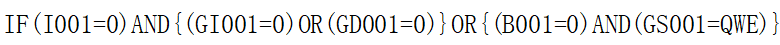

判断逻辑：首先对{(GI001=0)OR(GD001=0)}，{(B001=0)AND(GS001=QWE)}括号里的部分进行判断，然后{(GI001=0)OR(GD001=0)}的判断结果和(I001=0)进行与运算，最后将(I001=0)AND{(GI001=0)OR(GD001=0)}的判断结果和{(B001=0)AND(GS001=QWE)}的结果进行或运算，如果判断结果为真则执行IF与ENDIF之间的指令。

注意事项：判断顺序\[有括号的优先判断括号内（从左往右判断），再与括号外的进行判断\]。

### CALL-调用子程序

格式：CALL【指令名称】\[\$子程序\$\]【调用程序文件名】IN(12)【传入参数】OUT(GI001)【传出参数】。

功能：调用另一个程序，被调用的程序运行完后返回主程序CALL指令的下一行继续运行。

如果需要使用输入和输出参数功能在被调用的子程序内需要有"PARAM_DECLARATION"（参数声明）这条指令才能读取到输入和输出的个数,"PARAM_DECLARATION"指令必须插在子程序首行。

**参数：**

- CALL
  - 选择子程序(被调用程序名称)

- 输入参数个数
  - 从子程序参数声明指令设置的参数个数并显示到此处
  - 此参数不可修改

- 输入参数选择
  - 选择子程序后，输入参数为0时不可点击

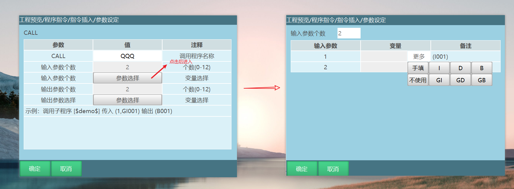

- 输入参数选择界面内：
  - 输入参数个数
    - 从子程序参数声明指令设置的参数个数并显示到此处
    - 此参数不可修改
    - 个数有几个下方表格会显示几行数据
  - 输入参数列
    - 显示参数顺序编号
  - 备注列
    - 备注显示的变量为PARAM_DECLARATION（参数声明）中的输入变量
  - 值列
    - 值类型可以为不使用、手填、变量；其中变量必须为可赋值到子程序对应变量的，例如子程序是I001,则只能选int、bool、double、手填值等类型，字符串类型不可赋值给I001。
    - 当PARAM_DECLARATION中对应的输入参数的默认值为
      - 手填或者变量时，输入参数值的【更多】选项可以选择不使用
      - 为不使用时，输入参数值的【更多】选项不可以选不使用
  - 注释列

    - 显示内容为PARAM_DECLARATION中对应填入的注释文本+PARAM_DECLARATION中的对应变量

    - 示例：AA(INT)

**CALL指令中的输入值可以赋值给子程序中PARAM_DECLARATION（参数声明）中的输入参数绑定的变量。**

- 输出参数个数
  - 从子程序获取输出参数个数并显示到此处
  - 此参数不可修改

- 输出参数选择
  - 选择子程序后，输出参数为0时不可点击

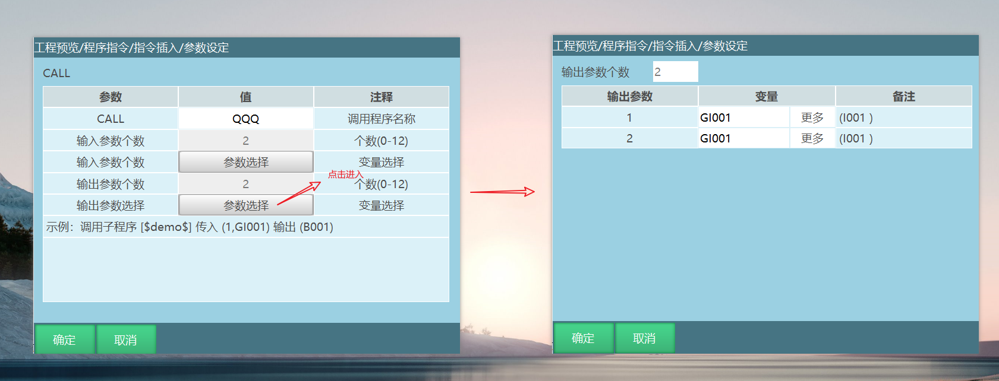

- 输出参数选择界面内
  - 输出参数个数
    - 从子程序获取输出参数个数并显示到此处
    - 此参数不可修改
    - 个数有几个下方表格会显示几行数据
  - 输出参数列
    - 显示参数顺序编号
  - 值列
    - 值类型可以为变量；其中变量必须为可赋值到子程序对应变量的，例如子程序是I001,则只能选int、bool、double等类型，字符串类型不可赋值给I001。
  - 备注
    - 备注显示参数为PARAM_DECLARATION（参数声明）中输出参数绑定的变量或者手填值
  - 注释列
    - 显示内容为PARAM_DECLARATION中对应填入的注释文本+PARAM_DECLARATION中的对应变量
    - 示例：AA(INT)

**子程序中PARAM_DECLARATION（参数声明）的输出值可以赋值给CALL指令中的输出参数绑定的变量。**

注意事项：主程序A调用程序B,程序B又调用程序A,会造成程序陷入死循环。

示例：主程序：

1.  NOP

2.  SET I001=12

3.  SET I002=22

4.  CALL\[\$Q11\$\]IN(I001,I002)OUT(D006,D007)

5.  TIMER T=1

6.  END

示例：子程序Q11：

1.  NOP

2.  PARAM_DECLARATION IN(D001=\[-\],D002=\[-\])OUT(10.0,11.0)

3.  TIMER T=0.5

4.  END

示例说明：主程序运行调用子程序指令，输入参数I001和I002的值被子程序接收使用，运行到子程序Q11时I001=12，I002=22，输出参数将返回给主程序使用，子程序运行结束后进入主程序D006=10，D007=11。

### PARAM_DECLARATION-参数声明

格式：PARAM_DECLARATION【指令名
】IN(I001=1,\[变量1\])【输入参数信息】OUT(1,\[输出参数\])【输出参数信息】。

功能：声明要输入或者输出的参数，输入参数将被子程序接收并使用，输出参数将返回给主程序使用。

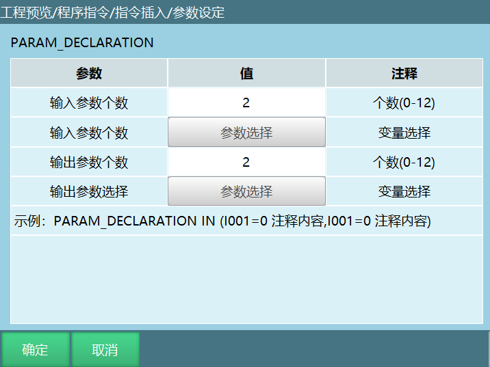

**参数**

- 输入参数个数
  - 定义输入参数的个数，此处定义几个个数，在调用子程序指令参数界面输入参数的个数就是多少

- 输入参数选择
  - 输入参数个数为0时可点击

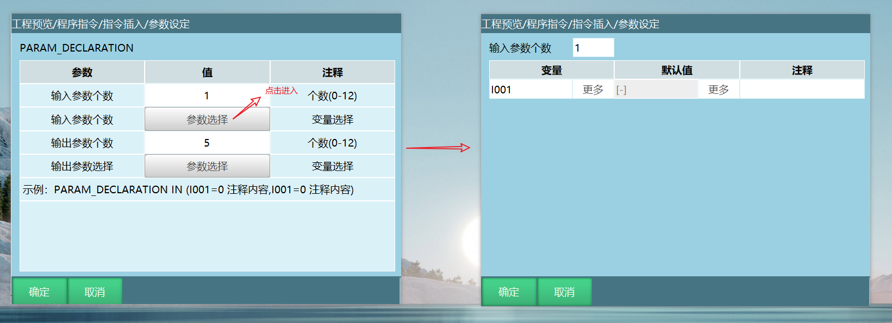

- 参数选择界面内
  - 输入参数个数
    - 此参数可修改，定义要输入的参数个数
    - 个数有几个下方表格会显示几行数据
  - 变量列
    - 选择输入参数要存入的变量
    - 默认为I001
  - 默认值列
    - 选择参数的默认值，默认为不使用
    - 此处更多类型有手填、不使用、变量
  - 注释列
    - 可以自定义注释内容
    - 注释内容不能超过20个字符
    - 示例：AA

**如果参数声明的输入参数变量值选择不使用，则从CALL指令输入参数中手填获取，如果参数声明的输入参数变量值选择手填，则CALL指令中的输入参数需要选择不使用。**

- 输出参数个数
  - 定义输出参数的个数，此处定义几个个数，在调用子程序指令参数界面输出参数的个数就是多少

- 输出参数选择
  - 输出参数个数为0时可点击

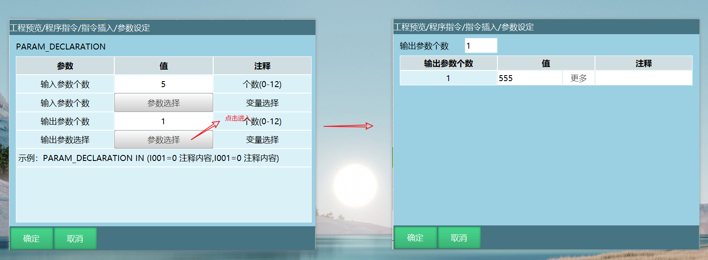

- 参数选择界面内
  - 输出参数个数
    - 此参数可修改，定义要输出的参数个数
    - 个数有几个下方表格会显示几行数据
  - 输出参数列
    - 显示参数顺序编号
  - 值列
    - 值类型可以为手填、变量；其中变量必须为可赋值到主程序对应变量的，例如CALL是I001,声明参数指令则只能选int、bool、double、手填值等类型，字符串类型不可赋值给I001。
  - 注释列
    - 可以自定义注释内容
    - 注释内容不能超过20个字符
    - 示例：AA

**PARAM_DECLARATION的输出参数值会返回给主程序中CALL指令的输出参数绑定的变量，需要注意的是变量必须为可赋值到主程序对应变量。**

**说明**

> 参数定义，所有的前台程序均可以使用该指令定义
>
> 该指令必须插入到程序第一行，否则需报错
>
> 后台程序暂不添加，后期也需要增加此指令

**注意**

> 输入参数接收类型不可以为手填值，必须将输入参数接收到变量，输出参数可以为手填值

注意事项：

1.  如果参数声明的输入参数变量值选择不使用，则从CALL指令输入参数中手填获取，如果参数声明的输入参数变量值选择手填，则CALL指令中的输入参数要选择不使用。

2.  PARAM_DECLARATION的输出参数值会返回给主程序中CALL指令的输出参数绑定的变量，需要注意的是变量必须为可赋值到主程序对应变量。

示例：主程序

1.  NOP

2.  SET I001=12

3.  SET I002=22

4.  CALL\[\$Q11\$\]IN(I001,I002)OUT(D006,D007)

5.  TIMER T=1

6.  END

示例：子程序Q11

1.  NOP

2.  PARAM_DECLARATION IN(D001=\[-\],D002=\[-\])OUT(10.0,11.0)

3.  TIMER T=0.5

4.  END

执行完子程序后能监控到变量，GI009和GI010接收到了主程序的数值，GI001接收到了子程序返回的数值。

执行效果：子程序Q11参数声明的输入参数变量值选择不使用（\[-\]表示：不使用），输入参数从从CALL指令输入参数中手填获取，主程序运行调用子程序指令，输入参数I001和I002的值被子程序接收使用，运行到子程序Q11时I001=12，I002=22，输出参数将返回给主程序使用，子程序运行结束后进入主程序D006=10，D007=11。

#### 示例

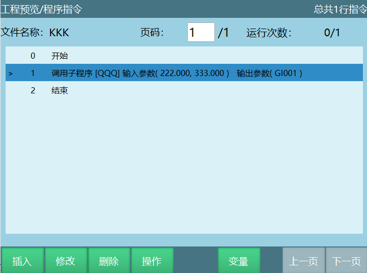

主程序KKK选择子程序QQQ读取到2个输入参数和一个输出参数，在主程序设置输入参数222，333，设置输出参数GI001

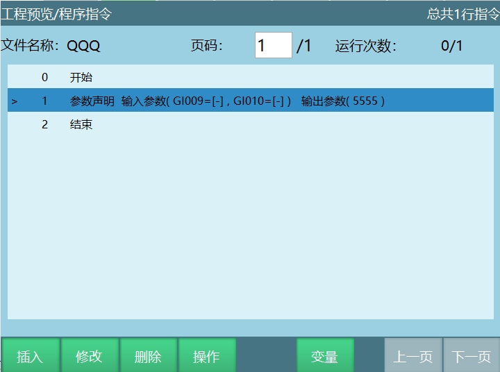

子程序参数声明2个输入参数接收变量为GI009,GI010,值为不使用，从主程序接收，1个输出参数返回给主程序值为555

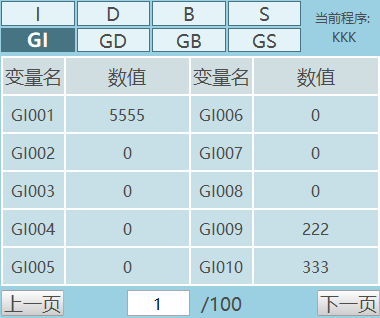

执行完子程序后能监控到变量，GI009和GI010接收到了主程序的数值，GI001接收到了子程序返回的数值。

### RETURN-退出

格式：RETURN【指令名称】。

功能：退出当前运行的作业文件，例如：子程序、后台程序。

RETURN因为不需要进行指令参数的填写，所以此类型的指令，点击插入指令时不会再跳转到指令参数界面，点击插入指令直接在作业文件中添加指令。由于此类指令没有指令参数界面，所以当光标位于指令上时，修改控件处于置灰状态。

参数：略。

示例：

主程序:

1.  MOVL P0001 V=10mm/s PL=0 ACC=1 DEC=1 0

2.  MOVL P0002 V=10mm/s PL=0 ACC=1 DEC=1 0

3.  RETURN

4.  TIMER T = 1

5.  PRINTMSG #TEST#

示例说明：程序运行到退出指令程序停止，伺服由运行状态变为就绪状态，程序停止运行，位于退出指令后的指令不再运行。

- 子程序：主程序调用子程序，当子程序运行到退出指令时子程序退出运行跳转到主程序，主程序继续运行。

- 后台程序：主程序调用全局后台和局部后台，当全局后台和局部后台运行到退出指令时，退出全局和局部线程。

### CALL_LUAFILE-调用LUA文件 

格式：CALL_LUAFILE【指令名称】\[\$name\$\]【上传的Lua文件名称】IN\[1001,I002\]【传入参数个数】OUT\[G1001,GI002\]【传出参数个数】。

功能:参数定义好之后，直接上传Lua文件，然后插入调用Lua文件指令，指令运行结束后会把写好的所有参数变量传入和输出。

参数：

| 参数 | 说明 |
| :--- | :--- |
| CALL_LUAFILE | 选择调用上传的Lua文件 |
| 传入参数个数 | Lua文件传入参数数量 |
| 传入参数选择 | 选择所需传入参数的个数和传入参数的变量类型 |
| 输出参数个数 | Lua文件输出参数数量 |
| 输出参数选择 | 选择所需输出参数的个数和变量类型 |

注意事项：

1.  传入的参数个数要和调用的Lua文件里面个数相同

2.  输出参数的个数可以少于调用的Lua文件里面个数

3.  传入参数和输出参数的类型变量类型最好统一，否则在执行CALL_LUAFILE-调用LUA文件指令时报错（调用Lua脚本出参错误）

以下调用的名为\[demo.lua\]文件定义了5个参数（I002、GI002、GD002、GP0001、GE0005）：

nex.I\[2\]=200 \--将全局数值变量 I002 修改为200

nex.GI\[2\]=100\--将全局数值变量 GI002 修改为100

nex.GD\[2\]=11.22 \--将全局数值变量 GD002 修改为11.22

GP1 = nex.GP\[1\]

GP1.coord, GP1.unit, GP1.configuration, GP1.tool, GP1.user = 0,2,4,6,1

pos1=GP1:pos()

pos1.x,pos1.y,pos1.z,pos1.a,pos1.b,pos1.c = 1,2,3,4,5,6

nex.GP\[1\]=GP1

GE5 = nex.GE\[5\]

GE5.coord, GE5.unit, GE5.configuration, GE5.tool, GE5.user = 2,1,3,4,5

pos1=GE5:pos()

pos1.x,pos1.y,pos1.z,pos1.a,pos1.b,pos1.c,GE5.E1,GE5.E2 =
1,2,3,4,5,6,7,8

nex.GE\[5\]=GE5

n1,n2,n3,GP1,GE5 = nex.get_param() \--获取从作业文件中传递过来的参数

nex.set_param(n1,n2,n3,GP1,GE5) \--将参数传递回作业文件

示例：插入调用Lua文件指令

1.  NOP

2.  CALL_LUAFILE\[demo.lua\]IN(GI002,I002,GD002,GP0001,GE0005)OUT(I003,GI003,GD003,GP0002,GE0001)

3.  TIMER T=5

4.  END

示例说明：运行调用Lua文件指令I002=200,GI002=100,GD002=11.22,GP0001(1,2,3,4,5,6)GE0005(1,2,3,4,5,6,7,8)。

I003=100,GI003=200,GD003=11.22,GP0002(1,2,3,4,5,6)GE0001(1,2,3,4,5,6,7,8)。

### IF-如果

格式：IF 【指令名】I001【参数1】=【比较方式】D001【参数2】。

功能：通过判断条件是否成立来执行下一目标的指令。

参数：

| 参数 | 说明 |
| :--- | :--- |
| 变量1 | 变量1的类型，可以选择数值变量、数字输入输出、模拟输入变量，位置变量类型 1. 若参数类型选择的类型为数值变量（INT、DOUBLE、BOOL、GINT、GDOUBLE、GBOOL），则此处为变量1的变量名 2. 若参数类型选择的类型为数字/模拟变量（DIN、DOUT、AIN）,则此处为数字输入输出或模拟输入的端口号 3. 若参数类型选择的类型为位置变量（P、GP、E、GE）,选择位置变量后变量的格式为选择的位置变量加位置变量坐标轴,当选择变量坐标轴的点位满足条件时执行if里面的指令 |
| 比较方式 | == 等于 \<小于 \>大于 \<= 小于或等于 \>= 大于或等于 != 不等于 |
| 变量2 | 参数2选择的变量类型:手填，变量 若变量值来源选择手填，则在此处直接填写参数2的值 |

注意事项：

1.  IF指令可以单独使用，也可搭配ELSEIF、ELSE两条指令使用。注意：ELSEIF、ELSE指令不可脱离IF指令单独使用。

2.  当程序的开头为IF且最后一行为ENDIF指令时，请在IF指令上方或ENDIF下方插入一条0.1秒的TIMER（延时）指令，否则当IF指令的条件不满足时会导致程序陷入死机状态。

3.  插入IF指令时会同时插入ENDIF指令，当删除IF指令时请注意将对应的ENDIF指令也删掉，否则会导致程序无法执行。

示例：

1.  NOP

2.  MOVL P0001 V=10mm/s PL=0 ACC=1 DEC=1 0

3.  IF (GI001\>5)AND{(GI002=5)OR(D001!=3)}

4.  TIMER T=2

5.  ENDIF

6.  END

示例说明：程序运行到第3行时，对IF指令进行判断，判断为真执行延时指令，反之程序直接运行到第6行。

### ELSEIF-否则如果

格式：IF 【指令名】I001【参数1】=【比较方式】D001【参数2】。

功能:IF指令的判断条件不满足时，执行ELSEIF语句。

参数：

| 参数 | 说明 |
| :--- | :--- |
| 变量1 | 变量1的类型，可以选择数值变量、数字输入输出、模拟输入、位置变量类型 1. 若参数类型选择的类型为数值变量（INT、DOUBLE、BOOL、GINT、GDOUBLE、GBOOL），则此处为变量1的变量名 2. 若参数类型选择的类型为数字/模拟变量（DIN、DOUT、AIN），则此处为数字输入输出或模拟输入的端口号 3. 若参数类型选择的类型为位置变量（P、GP、E、GE）,选择位置变量后变量的格式为选择的位置变量加位置变量坐标轴,当选择变量坐标轴的点位满足条件时执行elseif里面的指令 |
| 比较方式 | == 等于 \<小于 \>大于 \<= 小于或等于 \>= 大于或等于 != 不等于 |
| 变量2 | 变量2选择的变量类型 参数2支持自定义，若变量值来源处选择手填，则在此处直接填写参数2的值 |

注意事项：

1.  当IF的条件满足时，会执行IF语句里面的指令，会忽略掉ELSEIF与ENDIF之间的指令。

2.  当IF的条件不满足时，会跳转到ELSEIF指令，判断ELSEIF的判断条件，若条件成立，则运行ELSEIF和ENDIF之间的指令，然后继续运行ENDIF下面的指令；若不满足，则直接跳转到ENDIF下面的一行指令继续运行。

3.  若在IF与ENDIF中嵌套了多条ELSEIF，当IF的判断条件不成立时首先判断第一条ELSEIF的判断条件，若成立则运行第一条ELSEIF与第二条ELSEIF之间的指令；若不成立则判断第二条ELSEIF的判断条件，以此类推。

4.  当删除IF指令时，需删除与其对应的ELSEIF和ENDIF指令，否则会导致程序报错无法运行。

示例：

1.  NOP

2.  MOVL P0001 V=10mm/s PL=0 ACC=1 DEC=1 0

3.  IF(I001=5)

4.  TIMER T=1

5.  ELSEIF(I001!=0)AND(GI001=2)

6.  TIMER T=2

7.  ENDIF

8.  END

示例说明：运行到第三条指令时，对IF指令判断,判断为真执行第4条延时指令，反之则判断ELSEIF语句，如果ELSEIF条件成立，则执行第6条延时指令，反之程序直接运行到第8行。

### ELSE-否则

格式：ELSE【指令名】。

功能:IF,ELSEIF指令的判断条件都不成立时，执行ELSE语句。

参数：略。

注意事项：

1.  ELSE指令必须插入在IF和ENDIF之间，但是一个IF指令只能嵌入一条ELSE指令。

2.  当IF的判断条件成立时，会运行IF与ELSE之间的指令运行结束后跳转到ENDIF的下一行指令继续运行。

3.  当IF的判断条件不成立时，会跳转到ELSE与ENDIF之间的指令运行。

4.  当删除IF指令时，需删除与其对应的ELSE和ENDIF指令，否则会导致程序无法运行。

示例：

1.  NOP

2.  ADD D001 1

3.  IF (I001\<10)

4.  TIMER T=1

5.  ELSEIF (GI001!=5)

6.  MOVL P0001 V=10mm/s PL=0 ACC=1 DEC=1 0

7.  ELSE

8.  TIMER T=1

9.  ENDIF

10. END

示例说明：当IF指令和ELSEIF指令的判断条件都不成立时，判断ELSE指令，若ELSE判断成立，执行第8行指令，反之直接运行到第10行。

### WAIT-等待

格式：WAIT【指令名称】GI001【参数1】==【比较方式】2【参数2】T = 2
【等待时间】F = 1【滤波时间】Return=B001【等待结果存入变量】。

功能：条件成立之前程序处于等待状态，条件成立后继续执行等待指令后面的指令。

说明：WAIT即等待，可以选择是否有等待时间。当没有勾选"TIME"选项，则在判断条件不成立时一直停留在该WAIT指令等待，直到判断条件成立。若勾选了"TIME"选项，则会在等待该参数的时长后不再等，继续运行下一条指令。若在等待时条件变为成立，则立刻运行下一条指令。

现在WAIT支持多条件判断按顺序判断，有括号的优先判断括号内的再于括号外的进行判断，最多支持5个判断条件。

参数：

| 参数 | 说明 |
| :--- | :--- |
| 参数1 | 参数1的类型，可以选择数值变量、数字输入输出、模拟输入、位置变量类型 1. 若参数类型选择的类型为数值变量（INT、DOUBLE、BOOL、GINT、GDOUBLE、GBOOL），则此处为参数1的变量名 2. 若参数类型选择的类型为数字/模拟变量（DIN、DOUT、AIN），则此处为数字输入输出或模拟输入的端口号 3. 若参数类型选择的类型为位置变量（P、GP、E、GE）,选择位置变量后变量的格式为选择的位置变量加位置变量坐标轴,当选择变量坐标轴的点位满足条件时执行wait里面的指令 |
| 比较方式 | == 等于 \<小于 \>大于 \<= 小于或等于 \>= 大于或等于 != 不等于 |
| 参数2 | 参数2选择的变量类型 参数2支持自定义，若变量值来源处选择的为自定义，则在此处直接填写参数2的值 |
| Time等待时间 | 1. 不勾选"TIME"选项，则在判断条件不成立时一直停留在该WAIT指令等待，直到判断条件成立 2. 勾选了"TIME"选项，到达等待时间不论条件是否成立也会运行下一条指令。若在等待指令时条件变为成立，则立刻运行下一条令 |
| 滤波时间 | 1. 输入信号时间满足滤波时间:（无需等待TIME）直接到下一行继续行 2. 不满足滤波时间时:则到达等待TIME时间之后到下一行继续运行 |
| 等待结果 | 将等待结果存入布尔变量，超出等待时间等待结果返回1，未超出等待时间，等待结果返回0 |

示例：

1.  NOP

2.  MOVL P0001 V=10mm/s PL=0 ACC=1 DEC=1 0

3.  WAIT (GI001\<5) T=1 Return=GB001

4.  MOVL P0001 V=10mm/s PL=0 ACC=1 DEC=1 0

5.  END

示例说明：程序在运行到第3行等待指令判断条件是否成立，若成立直接运行等待下面的指令；若不成立，则到达等待时间后运行等待下面的指令，将等待结果存入变量GB001。

### WHILE-循环

格式：WHILE 【指令名】I001【参数1】=【比较方式】D001【参数2】。

功能：判断条件为真是反复执行循环语句里面的指令。

参数：

| 参数 | 说明 |
| :--- | :--- |
| 参数1 | 参数1的类型，可以选择数值变量、数字输入输出、模拟输入、位置变量类型 1. 若参数类型选择的类型为数值变量（INT、DOUBLE、BOOL、GINT、GDOUBLE、GBOOL），则此处为参数1的变量名 2. 若参数类型选择的类型为数字/模拟变量（DIN、DOUT、AIN），则此处为数字输入输出或模拟输入的端口号 3. 若参数类型选择的类型为位置变量（P、GP、E、GE）,选择位置变量后变量的格式为选择的位置变量加位置变量坐标轴,当选择变量坐标轴的点位满足条件时执行while里面的指令 |
| 比较方式 | == 等于 \<小于 \>大于 \<= 小于或等于 \>= 大于或等于 != 不等于 |
| 参数2 | 参数2选择的变量类型,支持自定义，若变量值来源处选择的为自定义，则在此处直接填写参数2的值 |

注意事项：

1.  插入WHILE指令的同时会同时插入ENDWHILE指令。若要删除WHILE指令请同时删掉其对应的ENDWHILE指令，否则会导致程序无法运行。

2.  当程序的开头为WHILE且最后一样指令为ENDWHILE时，请在程序的开头或结尾插入一条TIMER（延时）指令。否则当WHILE指令的条件不满足时会导致程序陷入死机。

3.  当WHILE内部的指令没有运动类指令或在某种情况下可能会陷入死循环时，请在WHILE与ENDWHILE间插入一条TIMER（延时）指令，否则当WHILE指令的条件满足时可能会导致程序陷入死机。

4.  当WHILE指令的条件满足时，会循环运行WHILE与ENDWHILE两条指令之间的指令。在运行到WHILE指令之前若判断条件不满足，在运行到WHILE指令时会直接跳转到ENDWHILE指令而不运行WHILE与ENDWHILE之间的指令；若在运行WHILE与ENDWHILE之间的指令过程中，判断条件变成不满足，会继续运行，直到运行到ENDWHILE行，不再循环而是继续运行ENDWHILE下面的指令。

示例：

1.  NOP

2.  CALL\[\$Z子程序\$\]

3.  WHILE(DIN1-1=1)OR(GI001=1)

4.  MOVL P0001 V=10mm/s PL=0 ACC=1 DEC=1 0

5.  MOVL P0002 V=10mm/s PL=0 ACC=1 DEC=1 0

6.  ENDWHILE

7.  TIMER T=1

8.  END

示例说明：程序在运行到WHILE指令之前先判断循环条件是否满足，若满足则循环运行WHILE与ENDWHILE两条指令之间的运动指令，若不满足则执行循环语句外的指令。

### LABEL-标签

格式：LABEL【指令名】\[\$name\$\]【标签名】。

功能：指定跳转目标行的标签。

参数：

| 参数 | 说明 |
| :--- | :--- |
| 标签名 | 指令跳转的标签名，例如标签名是【Q1】，在跳转指令参数设定界面选择的标签名是【Q1】，那程序会一直运行标签和跳转指令之间的指令 |

注意事项：

1.  同一程序无法插入两条标签名相同的标签指令。

2.  标签指令不支持上移、下移操作。

示例：

1.  NOP

2.  MOVL P0001 V=10mm/s PL=0 ACC=1 DEC=1 0

3.  LABEL \[\$Q1\$\]

4.  MOVL P0002 V=10mm/s PL=0 ACC=1 DEC=1 0

5.  MOVL P0003 V=10mm/s PL=0 ACC=1 DEC=1 0

6.  JUMP \[\$Q1\$\]

7.  TIMER T=1

8.  END

示例说明：一直循环运行LABEL \[\$Q1\$\]和JUMP
\[\$Q1\$\]两条指令之间的指令。

### JUMP-跳转

格式：JUMP【指令名】\[\$TIP\$\]【标签名】WHEN(I001=0)【判断条件】。

功能：跳转至指定标签号的指令行。

参数：

| 参数 | 说明 |
| :--- | :--- |
| 标签名 | 选择已插入LABEL指令的标签名 |
| 判断条件 | 1. 有判断条件：判断条件成立则跳转到LABEL指令行，若判断条件不成立则忽略JUMP指令，继续运行JUMP指令的下一行指令 2. 无判断条件：运行到该指令会直接跳转到对应的LABEL指令后继续运行LABEL指令的下一行指令 |
| 参数类型 | 可以选择数值变量、数字输入输出、模拟输入变量类型 若参数类型选择的类型为变量（INT、DOUBLE、BOOL、GINT、GDOUBLE、GBOOL），则此处为参数1的变量名 若参数类型选择的类型为输入值（DIN、DOUT、AIN），则此处为数字输入输出或模拟输入的端口号 |
| 比较方式 | == 等于 \<小于 \>大于 \<= 小于或等于 \>= 大于或等于 != 不等于 |
| 变量值来源 | 支持自定义和变量类型，若变量值来源选择自定义，则在此处直接填写给变量赋值的数值 |

注意事项：

1.  JUMP指令必须与LABEL（标签）指令配合使用。

2.  JUMP指令不可跨程序跳转。例如主程序里面插入LABEL
    \[\$Q1\$\]指令，在子程序插入JUMP \[\$Q1\$\]指令，程序运行会报错。

示例：

1.  NOP

2.  MOVL P0001 V=10mm/s PL=0 ACC=1 DEC=1 0

3.  LABEL \[\$Q1\$\]

4.  MOVL P0002 V=10mm/s PL=0 ACC=1 DEC=1 0

5.  MOVL P0003 V=10mm/s PL=0 ACC=1 DEC=1 0

6.  JUMP \[\$Q1\$\] WHEN(GI001!=10)AND(GI002\>5)

7.  TIMER T=1

8.  END

示例说明：跳转指令设置了条件判断，当判断条件成立时会跳转到标签行重复运行LABEL和JUMP
之间的直线指令，若不成立则继续运行JUMP指令的下一行TIMER（延时）指令。

### UNTIL-直到

格式：UNTIL【指令名】I001【变量1】=【比较方式】I002【变量2】。

功能：条件不成立时重复执行UNTIL和ENDUNTIL之间的指令，条件成立时直接跳到ENDUNTIL下面的指令运行。

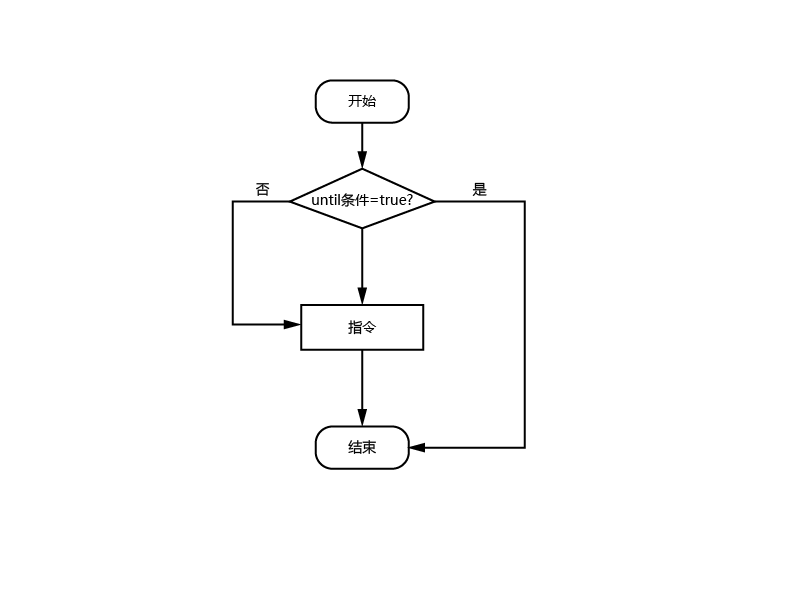

参数：

| 参数 | 说明 |
| :--- | :--- |
| 参数类型 | 可以选择数值变量、数字输入输出、模拟输入变量类型 若参数类型选择的类型为变量（INT、DOUBLE、BOOL、GINT、GDOUBLE、GBOOL），则此处为参数1的变量名 若参数类型选择的类型为输入值（DIN、DOUT、AIN），则此处为数字输入输出或模拟输入的端口号 |
| 比较方式 | == 等于 \<小于 \>大于 \<= 小于或等于 \>= 大于或等于 != 不等于 |
| 变量值来源 | 支持自定义和变量类型，若变量值来源选择自定义，则在此处直接填写给变量赋值的数值 |

注意事项：

1.  UNTIL指令插入的同时会插入ENDUNTIL指令。若要删除UNTIL指令请同时删掉其对应的ENDUNTIL指令，否则会导致程序无法运行。

示例：

1.  NOP

2.  MOVL P0001 V=10mm/s PL=0 ACC=1 DEC=1 0

3.  UNTIL(I001\<5)

4.  MOVL P0002 V=10mm/s PL=0 ACC=1 DEC=1 0

5.  MOVL P0003 V=10mm/s PL=0 ACC=1 DEC=1 0

6.  ENDUNTIL

7.  TIMER T=1

8.  END

示例说明：当UNTIL条件成立时，会直接跳转到ENDUNTIL后面的TIMER（延时）指令，当UNTIL条件不成立时，会执行UNTIL和ENDUNTIL之间的直线指令。

### CRAFTLINE-工艺跳行

格式：CRAFTLINE【指令名】1【对应行数】。

功能：只用于专用工艺，程序中插入该指令设置对应行数，在专用工艺界面运行程序时会先跳转到对应的行数。

参数：

| 参数 | 说明 |
| :--- | :--- |
| 新参数 | 此处填写的数字表示在运行专用工艺程序时，会跳行对应行数 |

示例：

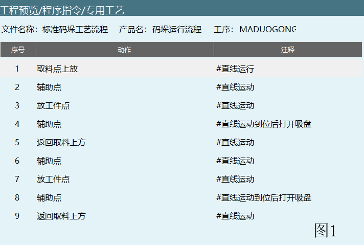

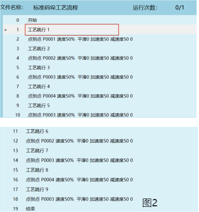

示例说明：图2程序中工艺跳行1这条指令对应图1专用工艺序号1这条指令，如果将图2图中红色勾选部分改为工艺跳行5，在专用工艺界面运行程序会首先跳行到图1界面序号5这一条指令，然后从辅助点开始运行程序。

### CMDNOTE-注释指令

格式：##注释内容\$\$。

功能:程序适当位置添加注释，便于调试。

参数:略。

注意事项：

1.  注释指令在运行时会跳到下一行指令运行，不会有报错提示。

2.  注释的内容支持中英文，支持大小写，支持数字输入和支持符号输入。

示例：

1.  NOP

2.  ##运行直线轨迹\$\$

3.  MOVL P0002 V=10mm/s PL=0 ACC=1 DEC=1 0

4.  MOVL P0002 V=10mm/s PL=0 ACC=1 DEC=1 0

5.  ##延时1秒\$\$

6.  TIMER T=1

7.  END

示例说明：第2行插入的注释指令是对第3、4行指令的注释，第5行插入的注释指令是对第6行指令的注释。

### POS_REACHABLE-是否可达判断

格式:POS_REACHABLE【指令名】MOVL/MOVJ【运动类型】B001【状态存入的变量】。

功能：判断目标点是否能到达，点位能够到达选择的状态存入的变量置1，不能到达置0。

参数：

| 参数 | 说明 |
| :--- | :--- |
| 位置变量名 | 全局位置点位(GP)，局部位置点位(P) |
| 运动类型 | 直线插补(MOVL),关节插补(MOVJ) 例如：有的点位通过关节插补的运动方式可以到达，直线插补的方式无法到达。通过插入是否可达判断指令来判断运行的目标点位通过直线插补、关节插补是否可以达到，防止机器人在运行过程中到达奇异点导致飞车 |
| 状态存入的变量 | 将点位能否到达的判定结果存入变量。"1"表示可以到达，"0"表示无法到达 |

示例：

1.  NOP

2.  POS_REACHABLE MOVL GP0001 GB0001

3.  POS_REACHABLE MOVL GP0002 GB0002

4.  MOVJ GP0001 V=10mm/s PL=0 ACC=1 DEC=1 0

5.  MOVJ GP0002 V=10mm/s PL=0 ACC=1 DEC=1 0

6.  END

示例说明：首先插入是否可达判断指令来判断目标点位GP0001、GP0002通过直线插补的方式能否到达，如果能到达的话变量GB001、GB0002置为1。

### CLKSTART-计时开始

格式：CLKSTART【指令名】ID=1【计时序号】D001【计时存入的变量】。

功能：运行该指令开始计时，并将时间记录到局部或者全局DOUBLE变量。

参数：

| 参数 | 说明 |
| :--- | :--- |
| 序号 | 计时器的序号，可以同时使用32个计时器分别计时 |
| 存入变量 | 变量类型可以选择局部DOUBLE变量或者全局的GDOUBLE变量，记录的时间会存入到选择的变量 例如：选择的变量是GD001，在程序运行的时候GD001会存入计时的时间 |

示例：

1.  NOP

2.  MOVL GP0001 V=10mm/s PL=0 ACC=1 DEC=1 0

3.  CLKSTART ID=1 GD001

4.  MOVL GP0002 V=10mm/s PL=0 ACC=1 DEC=1 0

5.  END

示例说明：程序在运行到第3行指令时计时1开始计时，第4行指令运行结束后计时器1计时结束，记录的时间存入到变量GD001。

### CLKSTOP-计时停止

格式：CLKSTOP 【指令名】ID=1【停止计时的计时器序号】。

功能:停止对应序号的计时器计时,停止后已存入变量的值不会归零。

参数：

| 参数 | 说明 |
| :--- | :--- |
| 序号 | 停止计时器计时的序号，计时开始和计时停止的计时器序号需要对应 |

示例：

1.  NOP

2.  CLKSTART ID=1 GD001

3.  MOVL GP0001 V=10mm/s PL=0 ACC=1 DEC=1 0

4.  MOVL GP0002 V=10mm/s PL=0 ACC=1 DEC=1 0

5.  CLKSTOP ID=1

6.  MOVL GP0003 V=10mm/s PL=0 ACC=1 DEC=1 0

7.  END

示例说明:程序运行到第2行时计时器1开始计时，运行到第5行时计时器1计时停止计时，停止后已存入变量的时间不会清零，如果在同一程序计时器1重新开始计时，会从上次停止的数值开始计时（例如：上次计时停止时间是12.55ms,重新开始计时会从12.55ms开始计时）。

### CLKRESET-计时复位

格式：格式：CLKSTOP 【指令名】ID=1【停止计时的计时器序号】。

功能：将对应序号的计时器清零。若没有使用该指令，下次运行CLKSTART指令会累积计时。

参数：

| 参数 | 说明 |
| :--- | :--- |
| 序号 | 计时器复位的序号，计时开始和计时复位的计时器序号需要对应 |

示例：

1.  NOP

2.  CLKSTART ID=1 GD001

3.  MOVL GP0001 V=10mm/s PL=0 ACC=1 DEC=1 0

4.  MOVL GP0002 V=10mm/s PL=0 ACC=1 DEC=1 0

5.  CLKSTOP ID=1

6.  MOVL GP0003 V=10mm/s PL=0 ACC=1 DEC=1 0

7.  CLKPESET ID=1

8.  END

示例说明：程序在运行到第2行时计时器1开始计时，计时的值存入变量GD001,运行到第5行时计时器1停止计时，但是变量GD001的值不会清零，运行到第7行时，计时器1复位变量GD001的值清零。

### READLINEAR-读取线速度

格式：READLINEAR【指令名】GI001【存入数值的变量】。

功能：机器人运行的时候实时读取机器人线速度，将读取到的速度存入到变量。

参数：

| 参数 | 说明 |
| :--- | :--- |
| 变量 | 选择的变量类型（INT、GINT，DOUBLE、GDOUBLE） |

注意事项：

1.  插入读取线速度指令时会同时插入读取线速度停止，如果要删除读取线速度指令请将对应线速度停止指令删除，否则程序会报错。

示例：

1.  NOP

2.  MOVL GP0001 V=10mm/s PL=0 ACC=1 DEC=1 0

3.  READLINEAR GI001

4.  MOVL GP0002 V=10mm/s PL=0 ACC=1 DEC=1 0

5.  ENDREADLINEAR

6.  MOVL GP0003 V=10mm/s PL=0 ACC=1 DEC=1 0

7.  END

示例说明：程序在运行到第2行时开始读取线速度，并将读取到的值存入到变量GI001（GI001的数值是实时变化的），在运行到第5行指令时，停止读取线速度（GI001的数值回到初始状态）。

### CALL_LUASTRING-调用Lua语句

格式:CALL_LUASTRING【指令名】\[\$语句\$\]【输入的Lua】。

功能：通过调用Lua语句来实现相应的功能或操作。例如：变量的修改，全局、局部点位的获取。

参数：

| 参数 | 说明 |
| :--- | :--- |
| 语句 | 手填：输入正确的Lua语句可以直接单步或运行 例如：修改GI001=12 CALL_LUASTRING #nex.GI\[1\]=12# 变量：把Lua语句写到字符串(string)变量中，通过调用相应的字符串变量来实现其功能 例如：修改GI002=22 SET GS001=#nex.GI\[2\]=22# CALL_LUASTRING GS001 |

示例：

1.  NOP

2.  SET GS005=#nex.GI\[5\]=12#

3.  CALL_LUASTRING GS005

4.  CALL_LUASTRING #nex.dout\[1,1\]#

5.  END

示例说明：通过调用lua语句指令，输入正确的lua语句格式，修改GI005=12,IO板1数字输出端口1-1口置为高电平。

### **WAIT_POS-等待运动到点**

格式：WAIT_POS【指令名】SPEED/POS【速度/位置】ACCURARY【精度】MINTIME【最小等待时间】MAXTIME【最大等待时间】

功能：MOV指令执行结束并不代表伺服运行结束，仅为点位下发结束，此指令等待伺服电机运行精准到点，再执行下一个指令

参数：

+---------------------+-------------------------------------------------------------------+
| 位置/速度           | 等到运动到点的参数                                                |
+---------------------+-------------------------------------------------------------------+
| 精度                | 判断是否到点的参考                                                |
|                     |                                                                   |
|                     | 例：数值为0.1，只要点位下发完成等待【设定的时间】开始判断是否到点 |
+---------------------+-------------------------------------------------------------------+
| 最小等待时间        | 不管有没有运动到指定点位，这个时间都要等待                        |
+---------------------+-------------------------------------------------------------------+
| 最大等待时间        | 如果等待时间超过了此时间，机器人还没有运动到点的话，就会报错      |
+---------------------+-------------------------------------------------------------------+

注意事项：

1.  此指令必须在运动指令后执行此指令才生效。

2.  此指令只能仅支持前台程序，后台无运动指令自然也不需要使用。

3.  此指令不支持提前执行

4.  如果机器人在 最小等待时间和最大等待时间
    之间，运动到点了，就会退出等待，执行下一条指令

示例：

1.  NOP

2.  MOVL P0001 V=10mm/s PL=0 ACC=1 DEC=1 0

3.  MOVL P0002 V=10mm/s PL=0 ACC=1 DEC=1 0

4.  MOVL P0003 V=10mm/s PL=0 ACC=1 DEC=1 0

5.  WAIT_POS

6.  TIMER T=2

7.  END

示例说明：当第4行指令运行结束后，表示点位的运行结束，第5行指令运行结束表示伺服运行结束，伺服运动到点后开始执行延时指令。

### **DETECTCOLLISION_SET_碰撞检测设置**

格式：DETECTCOLLISION_SET【指令名】0/1【临时参数关/临时参数开】0/1【0"碰撞检测使能关"，1"碰撞检测使能开"】JI=50、J2=50、J3=50、J4=50、J5=50、J6=50【碰撞检测阈值】。

功能：调用临时参数，方便及时调整碰撞检测阈值。

参数：

使用临时参数：打开此开关后才可以修改碰撞检测参数阈值。

碰撞检测使能：开启后机器人会根据灵敏度对碰撞进行检测，通常需要找到机器人运行时不会判定发生碰撞的值，然后就可以正常使用。

示例：

8.  NOP

9.  MOVL P0001 V=10mm/s PL=0 ACC=1 DEC=1 0

10. MOVL P0002 V=10mm/s PL=0 ACC=1 DEC=1 0

11. DETECTCOLLISION_SET 1 1 55 55 55 55 55 55

12. MOVL P0003 V=10mm/s PL=0 ACC=1 DEC=1 0

13. END

示例说明：执行第2，3条指令时调用的碰撞检测参数阈值为人机协作-力学功能界面的碰撞检测阈值（指令）参数，执行第4条指令时调用的碰撞检测参数阈值为碰撞检测设置指令设置的参数。

注意事项：碰撞检测设置指令只是临时参数，只对碰撞检测设置指令下面的运动指令有效，不插入碰撞检测设置指令时调用人机协作-力学功能界面的碰撞检测阈值（指令）参数。

### **DETECTCOLLISION_RESET-碰撞检测参数复位**

格式：DETECTCOLLISION_RESET【指令名】。

功能：复位临时使用的碰撞检测阈值，执行此条指令后会调用人机协作-力学功能界面的碰撞检测阈值（指令）参数。

参数：略。

示例：

1.  NOP

2.  MOVL P0001 V=10mm/s PL=0 ACC=1 DEC=1 0

3.  DETECTCOLLISION_SET 1 1 55 55 55 55 55 55

4.  MOVL P0002 V=10mm/s PL=0 ACC=1 DEC=1 0

5.  DETECTCOLLISIONRSET

6.  MOVL P0003 V=10mm/s PL=0 ACC=1 DEC=1 0

7.  END

示例说明：执行第1条指令时调用人机协作-力学功能界面的碰撞检测阈值（指令）参数，执行第4条指令时调用的是第3条指令设置的临时阈值参数，执行第5条指令后检测参数复位，执行第6条指令调用的是人机协作-力学功能界面的碰撞检测阈值（指令）参数。

### SWITCH

格式：SWITCH【指令名】。

功能：当SWITCH的参数值与某个CASE值匹配，则会跳到对应的CASE语句块中执行相应的指令，执行完该语句块则会跳出SWITCH;若SWITCH的参数值不与任何一个CASE匹配则运行DEFAULT语句。

参数：

| 参数 | 说明 |
| :--- | :--- |
| 变量 | 变量类型：INT,GINT |

示例：

1.  NOP

2.  SWITCH_I001

3.  CASE_1

4.  TIMER T=1

5.  ENDSWITCH\_

6.  END

示例说明：当SWITCH的参数值与第一个CASE情况匹配时执行第4条指令，若不匹配执行第5条指令。

### CASE

格式：CASE【指令名】。

功能：执行SWITCH时匹配成功会执行相对应的CASE。

参数：

| 参数 | 说明 |
| :--- | :--- |
| CASE | 参数只能是整数 |

示例：

1.  NOP

2.  SWITCH_I002

3.  CASE_1

4.  TIMER T=1

5.  CASE_2

6.  TIMER T=2

7.  ENDSWITCH\_

8.  END

示例说明：当SWITCH的参数值与第一个CASE情况匹配时执行第4条指令，若不匹配则执行第2个CASE，第2个CASE情况匹配则执行第6条指令，若不匹配执行第7条结束切换指令。

### DEFAULT

格式：DEFAULT【指令名】。

功能：当SWITCH参数变量与所存的CASE值均不符合时，执行DEFAULT语句。

参数：略。

示例：

1.  NOP

2.  SWITCH_I002

3.  CASE_1

4.  TIMER T=1

5.  CASE_2

6.  TIMER T=2

7.  DEFAULT\_

8.  ENDSWITCH\_

9.  END

示例说明：当SWITCH的参数值与第一个和第二个CASE情况都不匹配时执行第8条均不符合指令。
