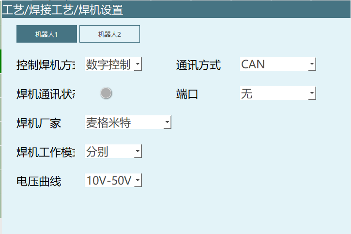
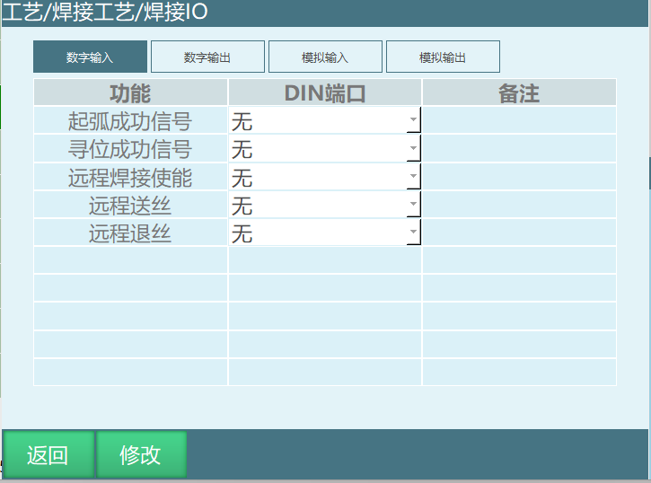
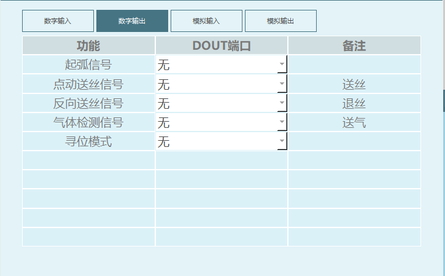
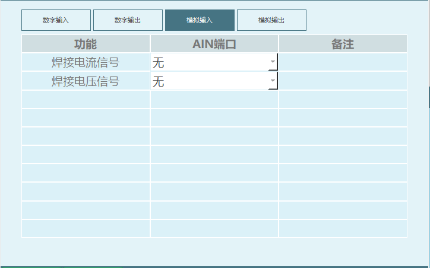
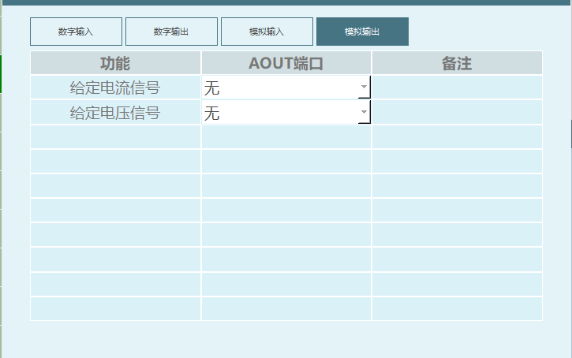
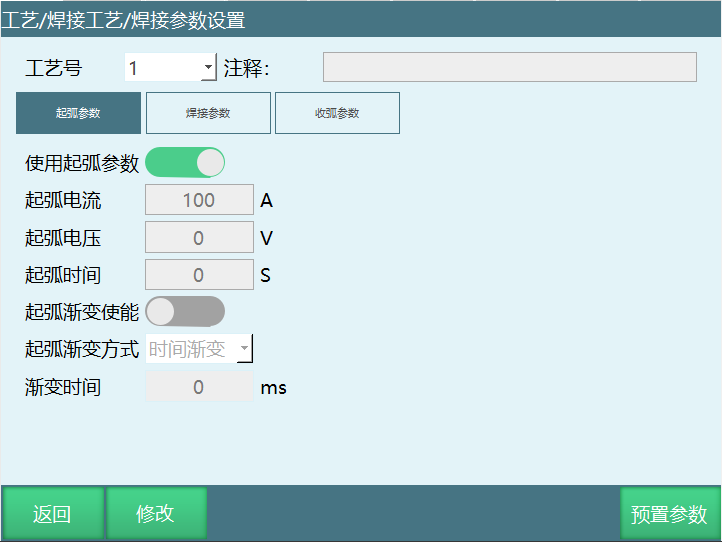
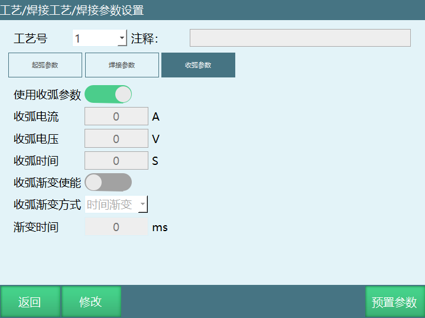
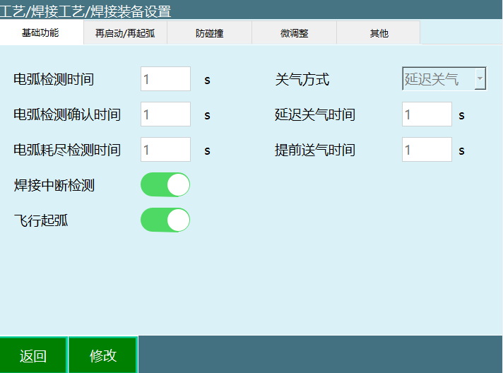
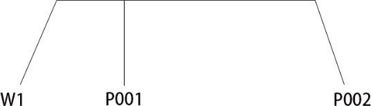
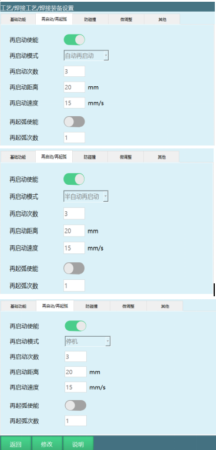

# 1. 文档概述

## 1.1 文档目的

面向机器人焊接工艺的操作和编程人员的一份详细的操作手册，主要用来解答焊接相关工艺使用中的问题与编程示例

## 1.2 文档结构

焊机设置：模拟焊接与数字焊机选择，数字焊机厂商、通讯方式、以及型号选择  
焊接IO：焊接中所需相关IO的设置  
电流电压匹配：模拟焊接匹配电流电压设置  
焊接参数：从起弧、焊接、收弧中电流电压等参数设置  
焊接设备：起弧、断弧与防碰撞等功能设置  
摆焊参数：不同摆焊类型参数设置  
相贯线：相贯线工件标定与设置  
手动操作：手动测试焊机电流电压与手动电焊电流电压设置  
多层多道焊：多层多道焊相关偏移设置与简易焊缝计算

## 1.3 术语定义

### 1.3.1 焊机与控制方式
模拟控制：	        通过模拟量信号（如0~10V）控制焊机输出电流/电压。  
数字控制：	        通过数字通信协议控制焊机，支持多种现场总线。  
CAN	通信 ：           一种工业现场总线。  
ModBus RTU：	        串行通信协议，基于RS485，常用于工业设备。  
EtherCAT：	        以太网控制自动化技术，实时工业以太网协议。  
ModBus TCP：	        基于以太网的ModBus协议。  
一元化模式：	        只需设定电流，电压由焊机自动匹配。  
分别模式：	        电流和电压可独立设定。  
电压曲线：	        焊机输出电压与给定信号之间的映射关系（如10-50V或0-50V）
### 1.3.2 IO信号与接口
起弧成功信号：	    焊机反馈起弧已成功的数字输入信号。  
寻位成功信号：	    焊丝触碰工件后反馈的信号，用于电弧寻位。  
远程焊接使能：	    通过输入信号远程开启焊接允许。  
远程送丝/退丝：	    通过输入信号远程控制焊丝送给或回抽。  
起弧信号：	        系统发给焊机的数字输出，命令开始起弧。  
点动送丝信号：	    手动控制送丝的输出信号。  
反向送丝信号：	    控制退丝的输出信号。  
气体检测信号：	    控制保护气体输出的信号。  
寻位模式：	        使焊机进入寻位状态，检测焊丝与工件接触。  
焊接电流/电压信号：	模拟输入，采集焊机实际电流/电压。  
给定电流/电压信号：	模拟输出，发送给焊机的电流/电压指令。
### 1.3.3 焊接参数与过程
工艺号：	            1~99个编号，对应一组焊接参数（如不同焊丝类型）。  
起弧电流/电压：      引弧瞬间施加的电流和电压。  
起弧时间：	        起弧成功后以起弧参数维持焊接的时间。  
焊接电流/电压：      正常焊接时的电流和电压。  
收弧电流/电压：      焊接结束时逐步降低到的电流和电压。  
收弧时间：	        到达收弧点后以收弧参数维持焊接的时间。  
渐变使能：	        允许电流/电压从起弧值平滑过渡到焊接值，或从焊接值过渡到收弧值。  
时间渐变：	        渐变方式之一，按设定时间线性变化。  
电流电压匹配：       校准模拟量输出与实际焊机输出之间的比例关系。
### 1.3.4 焊接装备与辅助功能
多段匹配：	        分多段（1~8段）拟合电流/电压映射曲线，提高精度。  
电弧检测时间：	    发出起弧信号后等待起弧成功的最长时间，超时则报错。  
电弧检测确认时间：	 持续检测到起弧成功信号的稳定时间，防抖动。  
电弧耗尽检测时间：	 灭弧开始到真正结束的允许时间，超时报错。  
延迟关气时间：	    焊接结束后保护气体继续输出的时间，用于冷却焊枪。  
提前关气时间：	    收弧前提前关闭气体的时间。  
飞行起弧：	        机器人在向焊接起始点移动过程中即开始起弧。  
提前送气时间：	    起弧前提前输出保护气体的时间，防止氧化。  
再启动：	            断弧后自动或手动恢复焊接的功能。  
自动再启动：	        断弧后系统自动重新起弧并继续程序。  
半自动再启动：	    断弧后程序暂停，需手动点击启动后恢复。  
停机（再启动模式）：	 断弧后伺服就绪、程序停止，需清错并手动启动。  
再启动距离：	        断弧后焊枪回退的距离，用于重新起弧。  
再启动速度：	        回退动作的速度。  
再起弧：	            起弧失败后在原地重试起弧。  
再起弧次数：	        允许的最大重试次数。  
防碰撞：	            通过IO信号检测焊枪碰撞，触发紧急停止。  
屏蔽防碰撞：	        碰撞发生后临时关闭防碰撞检测，便于移开焊枪。  
焊接完成回抽：	    焊接结束后自动退丝，防止焊丝粘连工件。  
断弧回抽：	        发生断弧时自动回抽焊丝，防止粘连。  
灭弧模拟量置零：	    焊接结束后将模拟输出电流/电压信号归零。
### 1.3.5 摆焊相关
摆焊：	           焊接时焊枪横向摆动，增加焊缝宽度。  
正弦摆：	           摆动轨迹为正弦曲线。  
Z字摆：	           摆动轨迹为Z字形折线。  
圆形摆：	           摆动轨迹为圆形。  
外部轴定点摆：	    配合外部轴旋转，在工件表面定点摆动。  
L型摆：	           摆动轨迹呈L形，有左右仰角参数。  
三角摆：	           摆动轨迹呈三角形。  
8字摆：	           摆动轨迹为8字形。  
摆动幅度：	       摆动的宽度（峰值到峰值）。  
摆动频率：	       单位时间内的摆动周期数。  
起始方向：	       摆动开始时的方向（向上或向下）。  
水平偏角：	       摆动平面与水平方向的夹角。  
竖直偏角：	       摆动平面与竖直方向的夹角。  
左/右停留时间：	   在Z字摆或定点摆中，到达左右端点时的停留时间。  
左/右仰角：	      L型摆或三角摆中，左右摆动平面与工具Z轴垂直面的夹角。  
### 1.3.6 特殊焊接工艺
鱼鳞焊：	           一种交替焊接与空走的工艺，焊缝呈鱼鳞状。  
点焊时间：	       鱼鳞焊中每段焊接的持续时间（机器人静止焊接）。  
焊接距离（L1）：	   鱼鳞焊中机器人移动时持续焊接的距离。  
空走距离（L2）：	   鱼鳞焊中灭弧后机器人移动而不焊接的距离。  
相贯线：	           两个圆柱体或管件相交处的焊接轨迹。
### 1.3.7 多层多道焊
多层多道焊：	       对于厚板焊接，需要分多层、每层分多道焊缝填充的焊接工艺。  
工艺号：	           1-999个编号，每个工艺号可记录一组焊道参数。  
焊道号：	           单个工艺号内最多99个焊道，每个焊道有独立的偏移参数。  
头部缩进：	       焊道起始点向焊接反方向（正值）或焊接方向（负值）的偏移量。  
尾部缩进：	       焊道结束点向焊接方向（正值）或反方向（负值）的偏移量。  
左右偏移：	       焊道相对于基准轨迹的横向偏移，左偏为正，右偏为负。  
高低偏移：	       焊道相对于基准轨迹的垂直偏移，工具手Z+为正，Z-为负。  
推角：	           工具手与焊道的垂直偏角，焊接方向为正，反方向为负（范围-180°~180°）。  
倾斜角：	           工具手与焊道的水平偏角，左倾为负，右倾为正（范围-180°~180°）。  
焊接方向：	       参数±1，仅影响左右偏移和倾斜角的正负符号，不改变机器人实际运动方向。  
头部倍数缩进使能：	使能后，实际头部缩进量 = 焊道编号 × 头部缩进值。  
尾部倍数缩进使能：   使能后，实际尾部缩进量 = 焊道编号 × 尾部缩进值。  
跟踪路径数据：	   电弧跟踪过程中记录的数据号，需与电弧跟踪指令中的记录号一致。  

---

# 2. 核心内容

焊机配置：模拟/数字控制方式、通讯协议、厂家选择。  
IO信号定义：起弧、寻位、送丝、气体、电流/电压等输入输出。  
电流电压匹配：多段线性校准。  
焊接参数：起弧/焊接/收弧的电流、电压、时间及渐变控制。  
装备功能：电弧检测、再启动/再起弧、防碰撞、回抽、提前/延迟送气等。  
摆焊工艺：7种摆动方式（正弦、Z字、圆形、L型、三角、8字、外部轴定点），可调幅度、频率、偏角、停留时间。  
多层多道焊：工艺配置：可设置1-999个工艺号，每个工艺号最多99个焊道。每个焊道可独立配置头部/尾部缩进、左右/高低偏移、推角、倾斜角、焊接方向等参数，并支持倍数缩进使能。  
焊接指令：ARCON/ARCOFF（起弧/收弧）、WVON/WVOFF（摆焊）、FSWELDON/OFF（鱼鳞焊）、SPOTWELD（点焊）、REFP（参考点）等。  
实操案例：正常焊接、摆焊、鱼鳞焊、点焊、外部轴协同、多机协同。  
焊接时序：  
[焊接时序](assets/Weldingsequence.png)

## 2.1 焊机设置

焊机设置需进入“工艺/焊接工艺/焊机设置”中修改。  
步骤如下：  
进入“工艺/焊接工艺/焊机设置”页面。  
两种控制焊机方式：  
模拟控制：全称模拟量焊机，是指通过IO模拟量来控制的焊机。如下图：  


数字控制：根据工业现场实际需要设置。  
点击修改选择控制焊机方式，如图：  



数字焊机的四种通讯方式：CAN、ModBus RTU、EtherCAT、ModBus TCP。  
选择ModBus RTU时，需要填写从站ID、端口号、波特率；  
选择ModBus TCP时，需要填写IP、端口号。  
焊接通讯状态：灰色表示没有通讯成功，绿色为通讯成功。   
焊接电源厂家：通用、麦格米特、深威智能、奥太、美佳尼克、瑞凌、EWM。  
注：选择瑞凌时，需要在【材料/丝径/气体】选择填写参数。  
焊机工作模式：一元化模式、分别模式。  
电压曲线：当焊机选择麦格米特时可以选择电压曲线，分别为10-50V与0-50V。  
点击保存，保存成功。  

## 2.2 焊接IO设置

焊接 IO 设置需进入“工艺/焊接工艺/焊接 IO 设置”中修改。相关步骤如下：  
进入“工艺/焊接工艺/焊接IO设置”页面。  
点击修改后，修改按钮变成保存，可以在各自的功能后面选择对应的IO端口。  
### 2.2.1 数字输入

界面如图所示：



参数介绍：  
起弧成功信号：设置这个信号是用来检测是否成功起弧，在执行焊接开始指令时，需要给起弧信号，如果起弧信号超过设置的焊接检测时间，会报错（焊接起弧信号超时）。  
寻位成功信号：在电弧寻位中需要设置寻位成功信号（需要的信号可以自己选择端口）。  
使用方法 ： 电弧寻位中，找两根单芯线，其中一根线的一端接IO输出端1-5（寻位模式信号），另一端接铁板；  
另一根线接IO输入端1-6（寻位成功信号），另一端接工具手末端；  
在电弧寻位中，打开输出口1-5，当工具手末端碰到铁板时，设置的1-6输入信号就由低电平变为高电平。  
远程焊接使能：设置该信号后可以通过输入设定信号打开焊接使能。  
远程退丝：设置该信号后可以通过输入设定信号进行退丝。  
远程送丝：设置该信号后可以通过输入设定信号进行送丝。  

### 2.1.2 数字输出

界面如图所示：



参数介绍：  
起弧信号：准备起弧时，系统会给焊机下发输出信号。  
点动送丝信号：焊机送丝。打开对应的信号端口时，在焊接监控窗口上同步显示：手动操作-送丝开关打开。  
反向送丝信号：焊机退丝时IO板给出对应的输出信号。  
气体检测信号：送气泵送气时IO板给出对应的输出信号。  
寻位模式：代表焊机进入寻位模式，机器人运动时，当焊丝触碰到工件时，焊机给寻位成功信号。  
使用方法：电弧寻位中，找两根单芯线，其中一根线的一端接IO输出端1-5（寻位模式信号），另一端接铁板。  
另一根线接IO输入端1-6（寻位成功信号），另一端接工具手末端。  
在电弧寻位中，打开输出口1-5，当工具手末端碰到铁板时，设置的1-6输入信号就有低电平变为高电平。  

### 2.1.3 模拟输入

界面如图所示：



焊接电流信号：模拟焊机电流的输入信号。  
焊接电压信号：模拟焊机电压的输入信号。  

### 2.1.4 模拟输出

界面如图所示：



给定电流信号：给定电流的信号。  
给定电压信号：给定电压的信号。  

## 2.2 电流电压匹配

设置焊接电压电流需进入“工艺/焊接工艺/电流电压匹配”中修改。相关步骤如下：  
进入“工艺/焊接工艺/电流电压匹配”页面（注：选择数字焊机时，该页面隐藏）。  
此时电流电压输入框不能输入数值。点击修改后，修改按钮变成保存，可以在各自的参数后面输入数值。

### 2.2.1 电流控制匹配界面参数设置步骤

将控制器和焊机连上，打开示教器界面如图所示：


设置电压：指IO监控里的模拟输出的值。  
焊机实际电流：焊机实际输出的电流，在焊机上面显示。  
测试焊机电流：在设置电压栏和焊接实际电流栏填写好数值，测试焊机电流框输入数值，点击测试，会计算出来一个值。  
这个值是通过图上填写的电压和焊机实际电流值计算出来一个比例系数，按照图上填写的值计算出来的比例系数是2 。  
此时测试焊机电流填写的是5A,点击测试后，选中的模拟输出端口通过比例系数计算出电流值2.5。  
注：焊机电流AOUT端口的输出上限10，大于10时按照上限执行；焊机电流AOUT端口下限小于0时按照下限执行。  


### 2.2.2 电压控制匹配界面参数设置步骤

将控制器和焊机连上，打开示教器界面如图所示： 


图中函数为修改控制器发送给焊机的电压、电流与焊机实际的电压、电流比例关系。  
设置电压：指IO监控里的模拟输出的值。  
焊机实际电压：焊机实际输出的电压，在焊机上面显示。  
测试焊机电压：在设置电压栏和焊接实际电压栏填写好数值，测试焊机电压框输入数值，点击测试，会计算出来一个值。  
这个值是通过图上填写的电压和焊机实际电流值计算出来一个比例系数，按照图上填写的值计算出来的比例系数是3 。  
此时测试焊机电压填写的是9V,点击测试后，选中的模拟输出端口通过比例系数计算出数值3。  
注：焊机电压AOUT端口的输出上限10，大于10时按照上限执行；焊机电压AOUT端口下限小于0时按照下限执行。  

### 2.2.3 连接焊机时电流电压匹配操作步骤

电流电压匹配做多段匹配：电流电压匹配分多段，可以是1～8任意几段。  
操作步骤如下：  
1.选择电流控制匹配。  
2.第1行设置电压填1，查看焊机上现在的电流值，把看到的电流值填到第一行焊机实际电流里；  
3.第2行设置电压填3，查看焊机上现在的电流值，把看到的电流值填到第2行焊机实际电流里；  
4.重复上述操作，直至把8行设置完（如只做1段匹配，设置1、2行即可）；  
5.测试焊机电流填220，查看焊机电流是否为220；  
6.点击保存，修改成功。该功能参数保存1份即可，无工艺号。    

## 2.3 焊接参数设置

设置焊接参数需进入“工艺/焊接工艺/焊接参数设置”中修改。相关步骤如下：  
进入“工艺/焊接工艺/焊接参数设置”页面；  
点击修改，修改按钮变成保存，此时工艺号可以选择，起弧参数、焊接参数、收弧参数值可以修改；  
例如:若需使用对应参数需先打开对应使能  
若起弧电流=10、起弧电压=8，焊接电流=15、焊接电压=20，收弧电流=10、收弧电压=15。  
打开起弧渐变使能，设置起弧渐变时间1秒，起弧渐变方式选择【时间渐变】；  
打开收弧渐变使能，设置收弧渐变时间1秒，收弧渐变方式选择【时间渐变】。  
执行效果：给起弧信号后起弧电流到达10A、起弧电压8V，设置了起弧渐变时间1秒，因此在1秒之内电流电压值从起弧电流电压逐渐变为焊接电流15A，焊接电压20V进行焊接，设置了收弧渐变1秒，所以在1秒之内电流电压值会逐渐从焊接电流电压变为收弧电流电压。  



工艺号：焊丝有多种选择，碳钢焊丝、低合金结构钢焊丝、合金结构钢焊丝、不锈钢焊丝和有色金属焊丝，不同的焊丝需要的起弧电压、起弧电流、起弧时间、焊接电压、焊接电流、灭弧电压、灭弧电流、灭弧时间、都是不一样的，故可以设置 1-99个不同的焊接参数，后期只需要调用就可以。  
注释：可以给此工艺号添加注释标明其作用。  
使用起弧参数：打开该使能下方参数才会生效  
起弧电流：从加热焊丝时施加的电流。  
起弧电压：从加热焊丝时施加的电压。  
起弧时间：确认起弧成功后以起弧电流电压维持焊接的时间；  
例如起弧电流=20A，起弧电压=10V,等待时间是1秒，表示确认起弧成功后以起弧电流电压维持一秒的焊接时间。  
起弧渐变使能：控制从起弧电流电压渐变到焊接电流电压的时间。  
起弧渐变方式：时间渐变。  
渐变时间：从起弧电流电压渐变到焊接电流电压的时间；  
起弧渐变时间设置了2秒，在这两秒之内电流电压值会从起弧电流电压渐变到焊接电流电压，而不是直接到达设定的焊接电流电压。  


焊接电流：焊接时施加的电流。焊接时，流经焊接回路的电流，是送丝速度和熔化速度平衡的结果。  
焊接电压：焊接电压即电弧电压，提供焊接能量和焊接质量。  



使用收弧参数：打开该使能下方参数才会生效  
收弧电流：在焊接中需要灭弧时灭弧器给出的电流。  
收弧电压：指保证避雷器能够在工频续流第一次过零值时灭弧的条件下，允许加在避雷器上的最高工频电压。灭弧电压应大于避雷器工作母线上可能出现的最高工频电压，否则避雷器可能因不能灭弧而爆炸。  
收弧时间：机器人到达灭弧点后以收弧电流电压维持焊接的时间。  
例如：收弧时间是1秒，表示机器人到达灭弧点后以收弧电流电压维持1S的焊接时间，然后焊接结束。根据不同的灭弧介质灭弧的时间不同，一般为秒级。   
收弧渐变使能：控制从焊接电流电压渐变到收弧电流电压的时间 （注：渐变使能打开之后下面的渐变参数才会起作用）。  
收弧渐变方式：时间渐变。  
渐变时间：从焊接电流电压渐变到收弧电流电压的时间。  
设置了收弧渐变时间是2秒，那么在2秒之内电流电压值从焊接电流电压逐渐变为收弧电流电压。而不是直接从焊接电流电压变为收弧电流电压  

## 2.4 焊接设备设置

设置焊接装置需进入“工艺/焊接工艺/焊接装备设置”中修改。相关步骤如下：  
进入“工艺/焊接工艺/焊接装备设置”页面，如下图所示。  
点击“修改”，修改按钮变成保存，点击下面的选择框，选择自己所需要的功能。  



### 2.4.1 基础功能

电弧检测时间：发出起弧信号到系统收到焊机发出的起弧成功的时间！如果在这个时间内系统没收到起弧成功，系统会发出起弧信号超时的报错（注：电弧检测时间要大于电弧检测确认时间）。  
电弧检测确认时间：防止有灰尘等障碍物而发生扰乱信号，故延时一段时间以确保电弧有信号传输，在这段时间里持续检测到起弧成功信号则开始焊接。  
电弧耗尽检测时间：灭弧开始到真正灭弧结束的时间。  
例如：设置的电弧耗尽检测时间是2秒，表示灭弧开始到灭弧真正结束的时间是2秒，在焊接结束后如果起弧信号还一直在给的话，会报灭弧失败。  
延迟关气时间：焊接结束，灭弧信号发出后，焊丝尚未冷却，如果此时就停止送保护气体，氧化依然会发生，故气体需要延迟关闭，并且还有冷却焊枪的功能。  
设置延迟关气1s，焊接完成后在【监控】-【IO状态-数字输出】界面可以看到设置的送气信号会延迟1S再关闭。  
提前关气时间：收弧前执行结束送气的时间参数。  
设置提前关气1s，焊接完成后在【监控】-【IO状态-数字输出】界面可以看到设置的送气信号会提前1S关闭。  
飞行起弧：机器人从安全点向焊接起始点移动过程中便开始执行起弧，开始提前送气。  
提前送气时间：焊接时，为防止焊丝被空气氧化，可能需要提前送气吹掉焊枪周围的空气，减少焊接的焊缝出现气孔，让焊接的焊缝看起来更加平整光滑。  



如上图所示：W1表示安全点，P001表示焊接开始点，P002表示焊接结束点，P001-P002表示焊接的距离。  
打开飞行起弧  
当设置的送气时间小于安全点到焊接起始点的时间。  
例如：设置提前送气时间4s,机器人从W1到焊接起始点P001需要10s。  
执行效果：W1 移动到 P001 需要 10s，第6s 时，机器人开始送气，10s 时到达 P001 点，同时开始起弧。  
当设置的送气时间大于于安全点到焊接起始点的时间。  
例如：设置提前送气时间4s,机器人从W1到焊接起始点P001需要2s。  
执行效果：W1 移动到 P001 需要2s，移动到 P001后机器人会在 P001 停留2s，4s 时才会起弧。   
关闭飞行起弧  
关闭飞行起弧：从安全点移动到焊接起始点后，开始提前送气。  
例如：关闭飞行起弧，提前送气时间4S。  
执行效果：机器人从 W1 点（安全点）移动到焊接起始点 P001 后，开始送气，4s 时，机器人才会起弧。  

### 2.4.2 再启动/再起弧

说明：外部轴指令走焊接轨迹不支持再启动回退  
界面如图所示，其中再启动模式分为自动再启动、半自动再启动与停机。



界面参数介绍：  
再启动使能：再启动使能，发生断弧时给起弧信号时才有效。  
自动再启动：检测到发生断弧后，伺服和程序都是在运行状态，在设置的电弧检测时间内，再次给起弧信号，程序继续运行。  
半自动再启动：检测到发生断弧后，伺服在运行状态，程序在暂停状态，此时需要手动点击启动按键，在设置的电弧检测时间内，再次给起弧信号，程序继续运行。  
停机：检测到发生断弧后，伺服在就绪状态，程序在停止状态，发生断弧后需要清错，然后手动点击启动按键，给起弧信号。  
再启动距离：再启动动作回退的距离。  
再启动速度：再启动动作回退时的速度，当速度为0时不会回退。  
再起弧使能：首先发信号让焊机起弧，若起弧失败在原地再次执行起弧动作，若起弧成功正常执行焊接-若设置的次数内还未起弧成功，则停机报错。  
再起弧次数：当前焊机开始、焊接结束区间内执行再启弧的最多次数，超过将不再执行再启动。  
设置的再起弧次数为2次，发生断弧后，给起弧信号超过2次的均未起弧的话，会报错。  


---

# 3. 

提供与本文档相关的其他资源链接。

## 3.1 参考文档

- [文档1](链接)
- [文档2](链接)

## 3.2 相关产品

- [产品1](链接)
- [产品2](链接)

## 3.3 相关操作手册

- [操作手册1](链接)
- [操作手册2](链接)

---

# 4. 常见问题

列出与本文档内容相关的常见问题及解答。

## 4.1 问题1

**问题**：问题描述

**解答**：详细解答

## 4.2 问题2

**问题**：问题描述

**解答**：详细解答

---

# 5. 版本历史

| 版本 | 日期 | 变更内容 | 作者 |
| :--- | :--- | :--- | :--- |
| 1.0.0 | YYYY-MM-DD | 初始版本 | iNexBot |

---

# 6. 附录

## 6.1 附录A：相关表格

| 列1 | 列2 | 列3 |
| :--- | :--- | :--- |
| 内容1 | 内容2 | 内容3 |
| 内容4 | 内容5 | 内容6 |

## 6.2 附录B：相关图表


## 6.3 附录C：代码示例

```python
# 代码示例
def example_function():
    pass
```