# 1. 文档概述

## 1.1 文档目的

面向机器人焊接工艺的操作和编程人员的一份详细的操作手册，主要用来解答焊接相关工艺使用中的问题与编程示例

## 1.2 文档结构

焊机设置：模拟焊接与数字焊机选择，数字焊机厂商、通讯方式、以及型号选择  
焊接IO：焊接中所需相关IO的设置  
电流电压匹配：模拟焊接匹配电流电压设置  
焊接参数：从起弧、焊接、收弧中电流电压等参数设置  
焊接设备：起弧、断弧与防碰撞等功能设置  
摆焊参数：不同摆焊类型参数设置  
相贯线：相贯线工件标定与设置  
手动操作：手动测试焊机电流电压与手动电焊电流电压设置  
多层多道焊：多层多道焊相关偏移设置与简易焊缝计算

## 1.3 术语定义

### 1.3.1 焊机与控制方式

模拟控制：	        通过模拟量信号（如0~10V）控制焊机输出电流/电压。  
数字控制：	        通过数字通信协议控制焊机，支持多种现场总线。  
CAN	通信 ：           一种工业现场总线。  
ModBus RTU：	        串行通信协议，基于RS485，常用于工业设备。  
EtherCAT：	        以太网控制自动化技术，实时工业以太网协议。  
ModBus TCP：	        基于以太网的ModBus协议。  
一元化模式：	        只需设定电流，电压由焊机自动匹配。  
分别模式：	        电流和电压可独立设定。  
电压曲线：	        焊机输出电压与给定信号之间的映射关系（如10-50V或0-50V）
### 1.3.2 IO信号与接口
起弧成功信号：	    焊机反馈起弧已成功的数字输入信号。  
寻位成功信号：	    焊丝触碰工件后反馈的信号，用于电弧寻位。  
远程焊接使能：	    通过输入信号远程开启焊接允许。  
远程送丝/退丝：	    通过输入信号远程控制焊丝送给或回抽。  
起弧信号：	        系统发给焊机的数字输出，命令开始起弧。  
点动送丝信号：	    手动控制送丝的输出信号。  
反向送丝信号：	    控制退丝的输出信号。  
气体检测信号：	    控制保护气体输出的信号。  
寻位模式：	        使焊机进入寻位状态，检测焊丝与工件接触。  
焊接电流/电压信号：	模拟输入，采集焊机实际电流/电压。  
给定电流/电压信号：	模拟输出，发送给焊机的电流/电压指令。
### 1.3.3 焊接参数与过程
工艺号：	            1~99个编号，对应一组焊接参数（如不同焊丝类型）。  
起弧电流/电压：      引弧瞬间施加的电流和电压。  
起弧时间：	        起弧成功后以起弧参数维持焊接的时间。  
焊接电流/电压：      正常焊接时的电流和电压。  
收弧电流/电压：      焊接结束时逐步降低到的电流和电压。  
收弧时间：	        到达收弧点后以收弧参数维持焊接的时间。  
渐变使能：	        允许电流/电压从起弧值平滑过渡到焊接值，或从焊接值过渡到收弧值。  
时间渐变：	        渐变方式之一，按设定时间线性变化。  
电流电压匹配：       校准模拟量输出与实际焊机输出之间的比例关系。
### 1.3.4 焊接装备与辅助功能
多段匹配：	        分多段（1~8段）拟合电流/电压映射曲线，提高精度。  
电弧检测时间：	    发出起弧信号后等待起弧成功的最长时间，超时则报错。  
电弧检测确认时间：	 持续检测到起弧成功信号的稳定时间，防抖动。  
电弧耗尽检测时间：	 灭弧开始到真正结束的允许时间，超时报错。  
延迟关气时间：	    焊接结束后保护气体继续输出的时间，用于冷却焊枪。  
提前关气时间：	    收弧前提前关闭气体的时间。  
飞行起弧：	        机器人在向焊接起始点移动过程中即开始起弧。  
提前送气时间：	    起弧前提前输出保护气体的时间，防止氧化。  
再启动：	            断弧后自动或手动恢复焊接的功能。  
自动再启动：	        断弧后系统自动重新起弧并继续程序。  
半自动再启动：	    断弧后程序暂停，需手动点击启动后恢复。  
停机（再启动模式）：	 断弧后伺服就绪、程序停止，需清错并手动启动。  
再启动距离：	        断弧后焊枪回退的距离，用于重新起弧。  
再启动速度：	        回退动作的速度。  
再起弧：	            起弧失败后在原地重试起弧。  
再起弧次数：	        允许的最大重试次数。  
防碰撞：	            通过IO信号检测焊枪碰撞，触发紧急停止。  
屏蔽防碰撞：	        碰撞发生后临时关闭防碰撞检测，便于移开焊枪。  
焊接完成回抽：	    焊接结束后自动退丝，防止焊丝粘连工件。  
断弧回抽：	        发生断弧时自动回抽焊丝，防止粘连。  
灭弧模拟量置零：	    焊接结束后将模拟输出电流/电压信号归零。
### 1.3.5 摆焊相关
摆焊：	           焊接时焊枪横向摆动，增加焊缝宽度。  
正弦摆：	           摆动轨迹为正弦曲线。  
Z字摆：	           摆动轨迹为Z字形折线。  
圆形摆：	           摆动轨迹为圆形。  
外部轴定点摆：	    配合外部轴旋转，在工件表面定点摆动。  
L型摆：	           摆动轨迹呈L形，有左右仰角参数。  
三角摆：	           摆动轨迹呈三角形。  
8字摆：	           摆动轨迹为8字形。  
摆动幅度：	       摆动的宽度（峰值到峰值）。  
摆动频率：	       单位时间内的摆动周期数。  
起始方向：	       摆动开始时的方向（向上或向下）。  
水平偏角：	       摆动平面与水平方向的夹角。  
竖直偏角：	       摆动平面与竖直方向的夹角。  
左/右停留时间：	   在Z字摆或定点摆中，到达左右端点时的停留时间。  
左/右仰角：	      L型摆或三角摆中，左右摆动平面与工具Z轴垂直面的夹角。  
### 1.3.6 特殊焊接工艺
鱼鳞焊：	           一种交替焊接与空走的工艺，焊缝呈鱼鳞状。  
点焊时间：	       鱼鳞焊中每段焊接的持续时间（机器人静止焊接）。  
焊接距离（L1）：	   鱼鳞焊中机器人移动时持续焊接的距离。  
空走距离（L2）：	   鱼鳞焊中灭弧后机器人移动而不焊接的距离。  
相贯线：	           两个圆柱体或管件相交处的焊接轨迹。
### 1.3.7 多层多道焊
多层多道焊：	       对于厚板焊接，需要分多层、每层分多道焊缝填充的焊接工艺。  
工艺号：	           1-999个编号，每个工艺号可记录一组焊道参数。  
焊道号：	           单个工艺号内最多99个焊道，每个焊道有独立的偏移参数。  
头部缩进：	       焊道起始点向焊接反方向（正值）或焊接方向（负值）的偏移量。  
尾部缩进：	       焊道结束点向焊接方向（正值）或反方向（负值）的偏移量。  
左右偏移：	       焊道相对于基准轨迹的横向偏移，左偏为正，右偏为负。  
高低偏移：	       焊道相对于基准轨迹的垂直偏移，工具手Z+为正，Z-为负。  
推角：	           工具手与焊道的垂直偏角，焊接方向为正，反方向为负（范围-180°~180°）。  
倾斜角：	           工具手与焊道的水平偏角，左倾为负，右倾为正（范围-180°~180°）。  
焊接方向：	       参数±1，仅影响左右偏移和倾斜角的正负符号，不改变机器人实际运动方向。  
头部倍数缩进使能：	使能后，实际头部缩进量 = 焊道编号 × 头部缩进值。  
尾部倍数缩进使能：   使能后，实际尾部缩进量 = 焊道编号 × 尾部缩进值。  
跟踪路径数据：	   电弧跟踪过程中记录的数据号，需与电弧跟踪指令中的记录号一致。  

# 2. 核心内容

焊机配置：模拟/数字控制方式、通讯协议、厂家选择。  
IO信号定义：起弧、寻位、送丝、气体、电流/电压等输入输出。  
电流电压匹配：多段线性校准。  
焊接参数：起弧/焊接/收弧的电流、电压、时间及渐变控制。  
装备功能：电弧检测、再启动/再起弧、防碰撞、回抽、提前/延迟送气等。  
摆焊工艺：7种摆动方式（正弦、Z字、圆形、L型、三角、8字、外部轴定点），可调幅度、频率、偏角、停留时间。  
多层多道焊：工艺配置：可设置1-999个工艺号，每个工艺号最多99个焊道。每个焊道可独立配置头部/尾部缩进、左右/高低偏移、推角、倾斜角、焊接方向等参数，并支持倍数缩进使能。  
焊接指令：ARCON/ARCOFF（起弧/收弧）、WVON/WVOFF（摆焊）、FSWELDON/OFF（鱼鳞焊）、SPOTWELD（点焊）、REFP（参考点）等。  
实操案例：正常焊接、摆焊、鱼鳞焊、点焊、外部轴协同、多机协同。  
焊接时序：  
[焊接时序](assets/Weldingsequence.png)

## 2.1 焊机设置

焊机设置需进入“工艺/焊接工艺/焊机设置”中修改。  
步骤如下：  
进入“工艺/焊接工艺/焊机设置”页面。  
两种控制焊机方式：  
模拟控制：全称模拟量焊机，是指通过IO模拟量来控制的焊机。如下图：  

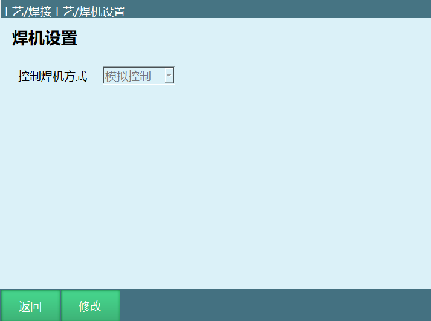

数字控制：根据工业现场实际需要设置。  
点击修改选择控制焊机方式，如图：  

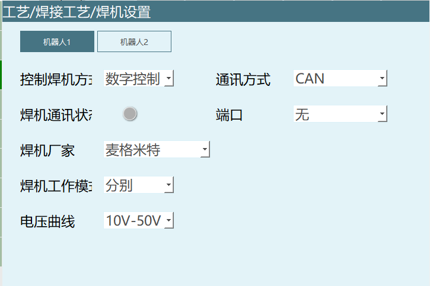

数字焊机的四种通讯方式：CAN、ModBus RTU、EtherCAT、ModBus TCP。  
选择ModBus RTU时，需要填写从站ID、端口号、波特率；  
选择ModBus TCP时，需要填写IP、端口号。  
焊接通讯状态：灰色表示没有通讯成功，绿色为通讯成功。   
焊接电源厂家：通用、麦格米特、深威智能、奥太、美佳尼克、瑞凌、EWM。  
注：选择瑞凌时，需要在【材料/丝径/气体】选择填写参数。  
焊机工作模式：一元化模式、分别模式。  
电压曲线：当焊机选择麦格米特时可以选择电压曲线，分别为10-50V与0-50V。  
点击保存，保存成功。  

## 2.2 焊接IO设置

焊接 IO 设置需进入“工艺/焊接工艺/焊接 IO 设置”中修改。相关步骤如下：  
进入“工艺/焊接工艺/焊接IO设置”页面。  
点击修改后，修改按钮变成保存，可以在各自的功能后面选择对应的IO端口。  
### 2.2.1 数字输入

界面如图所示：

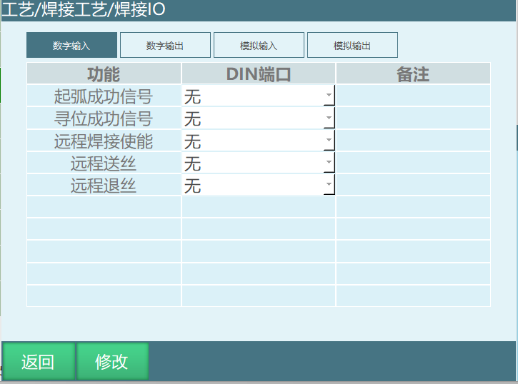

参数介绍：  
起弧成功信号：设置这个信号是用来检测是否成功起弧，在执行焊接开始指令时，需要给起弧信号，如果起弧信号超过设置的焊接检测时间，会报错（焊接起弧信号超时）。  
寻位成功信号：在电弧寻位中需要设置寻位成功信号（需要的信号可以自己选择端口）。  
使用方法 ： 电弧寻位中，找两根单芯线，其中一根线的一端接IO输出端1-5（寻位模式信号），另一端接铁板；  
另一根线接IO输入端1-6（寻位成功信号），另一端接工具手末端；  
在电弧寻位中，打开输出口1-5，当工具手末端碰到铁板时，设置的1-6输入信号就由低电平变为高电平。  
远程焊接使能：设置该信号后可以通过输入设定信号打开焊接使能。  
远程退丝：设置该信号后可以通过输入设定信号进行退丝。  
远程送丝：设置该信号后可以通过输入设定信号进行送丝。  

### 2.1.2 数字输出

界面如图所示：

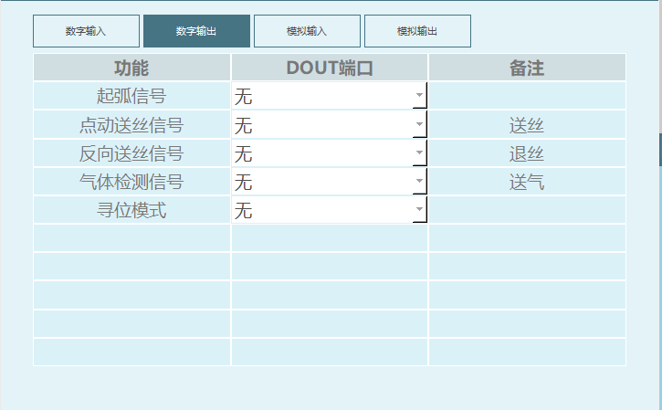

参数介绍：  
起弧信号：准备起弧时，系统会给焊机下发输出信号。  
点动送丝信号：焊机送丝。打开对应的信号端口时，在焊接监控窗口上同步显示：手动操作-送丝开关打开。  
反向送丝信号：焊机退丝时IO板给出对应的输出信号。  
气体检测信号：送气泵送气时IO板给出对应的输出信号。  
寻位模式：代表焊机进入寻位模式，机器人运动时，当焊丝触碰到工件时，焊机给寻位成功信号。  
使用方法：电弧寻位中，找两根单芯线，其中一根线的一端接IO输出端1-5（寻位模式信号），另一端接铁板。  
另一根线接IO输入端1-6（寻位成功信号），另一端接工具手末端。  
在电弧寻位中，打开输出口1-5，当工具手末端碰到铁板时，设置的1-6输入信号就有低电平变为高电平。  

### 2.1.3 模拟输入

界面如图所示：

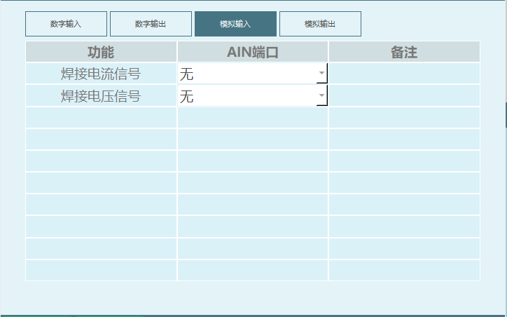

焊接电流信号：模拟焊机电流的输入信号。  
焊接电压信号：模拟焊机电压的输入信号。  

### 2.1.4 模拟输出

界面如图所示：

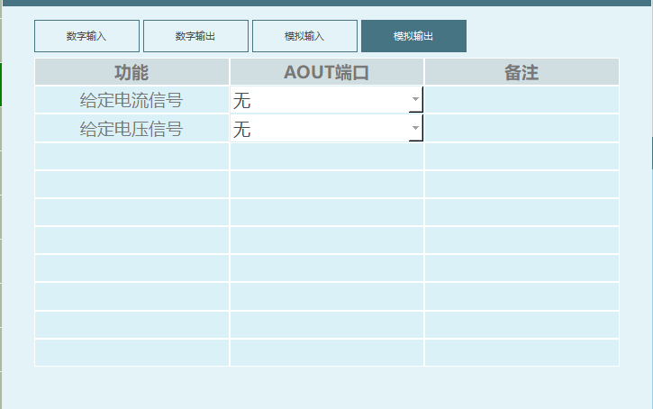

给定电流信号：给定电流的信号。  
给定电压信号：给定电压的信号。  

## 2.2 电流电压匹配

设置焊接电压电流需进入“工艺/焊接工艺/电流电压匹配”中修改。相关步骤如下：  
进入“工艺/焊接工艺/电流电压匹配”页面（注：选择数字焊机时，该页面隐藏）。  
此时电流电压输入框不能输入数值。点击修改后，修改按钮变成保存，可以在各自的参数后面输入数值。

### 2.2.1 电流控制匹配界面参数设置步骤

将控制器和焊机连上，打开示教器界面如图所示：

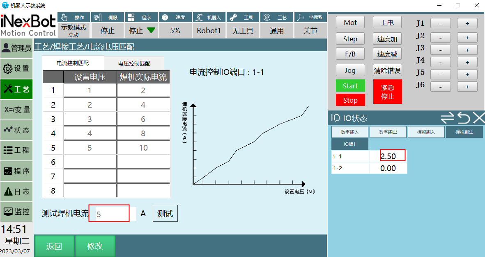

设置电压：指IO监控里的模拟输出的值。  
焊机实际电流：焊机实际输出的电流，在焊机上面显示。  
测试焊机电流：在设置电压栏和焊接实际电流栏填写好数值，测试焊机电流框输入数值，点击测试，会计算出来一个值。  
这个值是通过图上填写的电压和焊机实际电流值计算出来一个比例系数，按照图上填写的值计算出来的比例系数是2 。  
此时测试焊机电流填写的是5A,点击测试后，选中的模拟输出端口通过比例系数计算出电流值2.5。  
注：焊机电流AOUT端口的输出上限10，大于10时按照上限执行；焊机电流AOUT端口下限小于0时按照下限执行。  

### 2.2.2 电压控制匹配界面参数设置步骤

将控制器和焊机连上，打开示教器界面如图所示： 

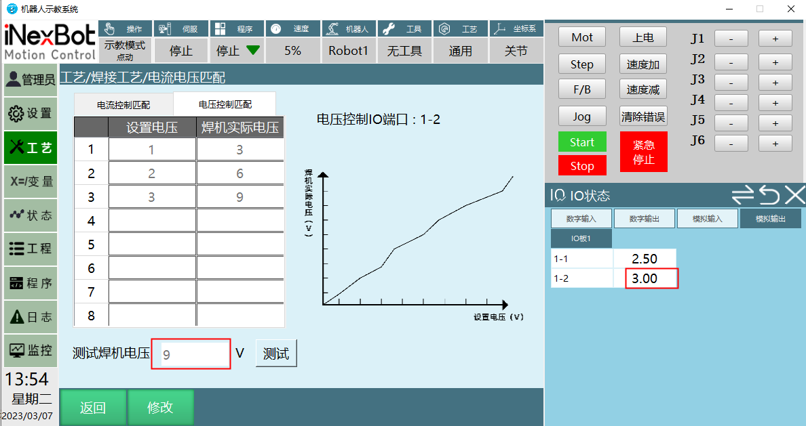

图中函数为修改控制器发送给焊机的电压、电流与焊机实际的电压、电流比例关系。  
设置电压：指IO监控里的模拟输出的值。  
焊机实际电压：焊机实际输出的电压，在焊机上面显示。  
测试焊机电压：在设置电压栏和焊接实际电压栏填写好数值，测试焊机电压框输入数值，点击测试，会计算出来一个值。  
这个值是通过图上填写的电压和焊机实际电流值计算出来一个比例系数，按照图上填写的值计算出来的比例系数是3 。  
此时测试焊机电压填写的是9V,点击测试后，选中的模拟输出端口通过比例系数计算出数值3。  
注：焊机电压AOUT端口的输出上限10，大于10时按照上限执行；焊机电压AOUT端口下限小于0时按照下限执行。  

### 2.2.3 连接焊机时电流电压匹配操作步骤

电流电压匹配做多段匹配：电流电压匹配分多段，可以是1～8任意几段。  
操作步骤如下：  
1.选择电流控制匹配。  
2.第1行设置电压填1，查看焊机上现在的电流值，把看到的电流值填到第一行焊机实际电流里；  
3.第2行设置电压填3，查看焊机上现在的电流值，把看到的电流值填到第2行焊机实际电流里；  
4.重复上述操作，直至把8行设置完（如只做1段匹配，设置1、2行即可）；  
5.测试焊机电流填220，查看焊机电流是否为220；  
6.点击保存，修改成功。该功能参数保存1份即可，无工艺号。    

## 2.3 焊接参数设置

设置焊接参数需进入“工艺/焊接工艺/焊接参数设置”中修改。相关步骤如下：  
进入“工艺/焊接工艺/焊接参数设置”页面；  
点击修改，修改按钮变成保存，此时工艺号可以选择，起弧参数、焊接参数、收弧参数值可以修改；  
例如:若需使用对应参数需先打开对应使能  
若起弧电流=10、起弧电压=8，焊接电流=15、焊接电压=20，收弧电流=10、收弧电压=15。  
打开起弧渐变使能，设置起弧渐变时间1秒，起弧渐变方式选择【时间渐变】；  
打开收弧渐变使能，设置收弧渐变时间1秒，收弧渐变方式选择【时间渐变】。  
执行效果：给起弧信号后起弧电流到达10A、起弧电压8V，设置了起弧渐变时间1秒，因此在1秒之内电流电压值从起弧电流电压逐渐变为焊接电流15A，焊接电压20V进行焊接，设置了收弧渐变1秒，所以在1秒之内电流电压值会逐渐从焊接电流电压变为收弧电流电压。  

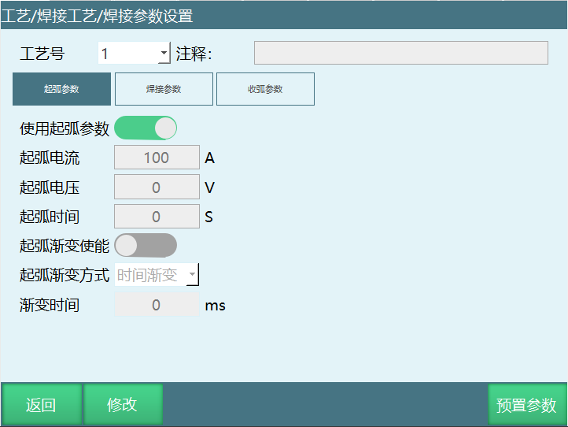

工艺号：焊丝有多种选择，碳钢焊丝、低合金结构钢焊丝、合金结构钢焊丝、不锈钢焊丝和有色金属焊丝，不同的焊丝需要的起弧电压、起弧电流、起弧时间、焊接电压、焊接电流、灭弧电压、灭弧电流、灭弧时间、都是不一样的，故可以设置 1-99个不同的焊接参数，后期只需要调用就可以。  
注释：可以给此工艺号添加注释标明其作用。  
使用起弧参数：打开该使能下方参数才会生效  
起弧电流：从加热焊丝时施加的电流。  
起弧电压：从加热焊丝时施加的电压。  
起弧时间：确认起弧成功后以起弧电流电压维持焊接的时间；  
例如起弧电流=20A，起弧电压=10V,等待时间是1秒，表示确认起弧成功后以起弧电流电压维持一秒的焊接时间。  
起弧渐变使能：控制从起弧电流电压渐变到焊接电流电压的时间。  
起弧渐变方式：时间渐变。  
渐变时间：从起弧电流电压渐变到焊接电流电压的时间；  
起弧渐变时间设置了2秒，在这两秒之内电流电压值会从起弧电流电压渐变到焊接电流电压，而不是直接到达设定的焊接电流电压。  

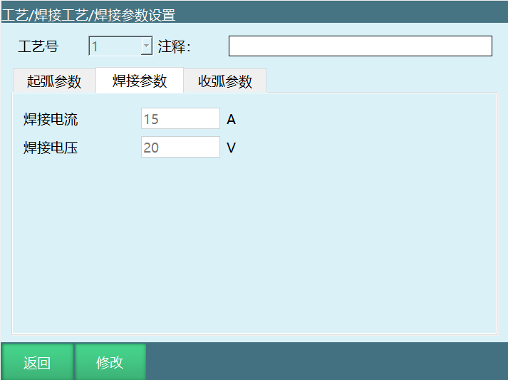

焊接电流：焊接时施加的电流。焊接时，流经焊接回路的电流，是送丝速度和熔化速度平衡的结果。  
焊接电压：焊接电压即电弧电压，提供焊接能量和焊接质量。  

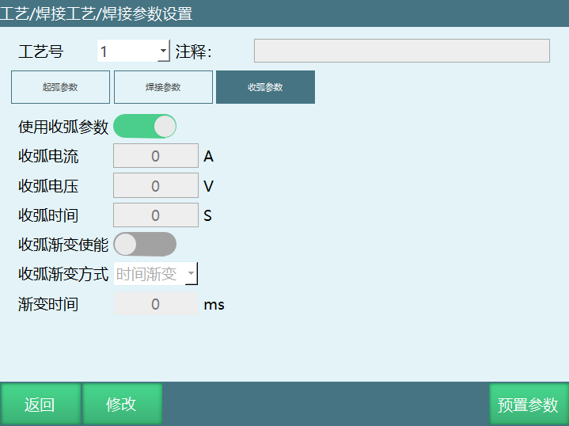

使用收弧参数：打开该使能下方参数才会生效  
收弧电流：在焊接中需要灭弧时灭弧器给出的电流。  
收弧电压：指保证避雷器能够在工频续流第一次过零值时灭弧的条件下，允许加在避雷器上的最高工频电压。灭弧电压应大于避雷器工作母线上可能出现的最高工频电压，否则避雷器可能因不能灭弧而爆炸。  
收弧时间：机器人到达灭弧点后以收弧电流电压维持焊接的时间。  
例如：收弧时间是1秒，表示机器人到达灭弧点后以收弧电流电压维持1S的焊接时间，然后焊接结束。根据不同的灭弧介质灭弧的时间不同，一般为秒级。   
收弧渐变使能：控制从焊接电流电压渐变到收弧电流电压的时间 （注：渐变使能打开之后下面的渐变参数才会起作用）。  
收弧渐变方式：时间渐变。  
渐变时间：从焊接电流电压渐变到收弧电流电压的时间。  
设置了收弧渐变时间是2秒，那么在2秒之内电流电压值从焊接电流电压逐渐变为收弧电流电压。而不是直接从焊接电流电压变为收弧电流电压  

## 2.4 焊接设备设置

设置焊接装置需进入“工艺/焊接工艺/焊接装备设置”中修改。相关步骤如下：  
进入“工艺/焊接工艺/焊接装备设置”页面，如下图所示。  
点击“修改”，修改按钮变成保存，点击下面的选择框，选择自己所需要的功能。  

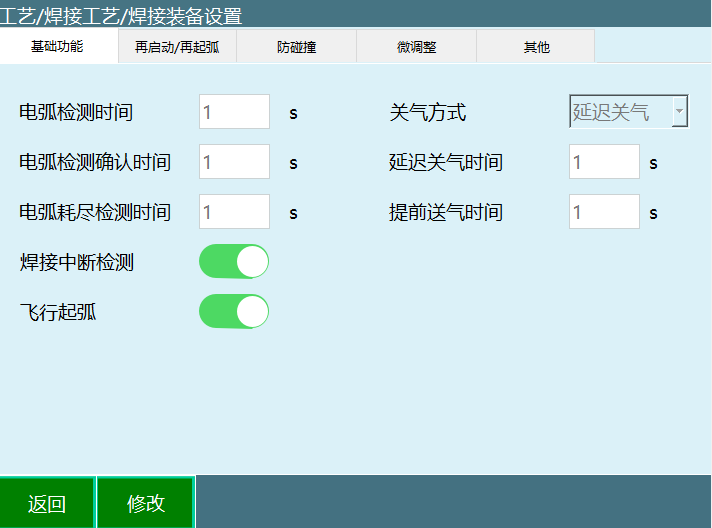

### 2.4.1 基础功能

电弧检测时间：发出起弧信号到系统收到焊机发出的起弧成功的时间！如果在这个时间内系统没收到起弧成功，系统会发出起弧信号超时的报错（注：电弧检测时间要大于电弧检测确认时间）。  
电弧检测确认时间：防止有灰尘等障碍物而发生扰乱信号，故延时一段时间以确保电弧有信号传输，在这段时间里持续检测到起弧成功信号则开始焊接。  
电弧耗尽检测时间：灭弧开始到真正灭弧结束的时间。  
例如：设置的电弧耗尽检测时间是2秒，表示灭弧开始到灭弧真正结束的时间是2秒，在焊接结束后如果起弧信号还一直在给的话，会报灭弧失败。  
延迟关气时间：焊接结束，灭弧信号发出后，焊丝尚未冷却，如果此时就停止送保护气体，氧化依然会发生，故气体需要延迟关闭，并且还有冷却焊枪的功能。  
设置延迟关气1s，焊接完成后在【监控】-【IO状态-数字输出】界面可以看到设置的送气信号会延迟1S再关闭。  
提前关气时间：收弧前执行结束送气的时间参数。  
设置提前关气1s，焊接完成后在【监控】-【IO状态-数字输出】界面可以看到设置的送气信号会提前1S关闭。  
飞行起弧：机器人从安全点向焊接起始点移动过程中便开始执行起弧，开始提前送气。  
提前送气时间：焊接时，为防止焊丝被空气氧化，可能需要提前送气吹掉焊枪周围的空气，减少焊接的焊缝出现气孔，让焊接的焊缝看起来更加平整光滑。  

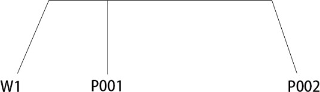

如上图所示：W1表示安全点，P001表示焊接开始点，P002表示焊接结束点，P001-P002表示焊接的距离。  
打开飞行起弧  
当设置的送气时间小于安全点到焊接起始点的时间。  
例如：设置提前送气时间4s,机器人从W1到焊接起始点P001需要10s。  
执行效果：W1 移动到 P001 需要 10s，第6s 时，机器人开始送气，10s 时到达 P001 点，同时开始起弧。  
当设置的送气时间大于于安全点到焊接起始点的时间。  
例如：设置提前送气时间4s,机器人从W1到焊接起始点P001需要2s。  
执行效果：W1 移动到 P001 需要2s，移动到 P001后机器人会在 P001 停留2s，4s 时才会起弧。   
关闭飞行起弧  
关闭飞行起弧：从安全点移动到焊接起始点后，开始提前送气。  
例如：关闭飞行起弧，提前送气时间4S。  
执行效果：机器人从 W1 点（安全点）移动到焊接起始点 P001 后，开始送气，4s 时，机器人才会起弧。  

### 2.4.2 再启动/再起弧

说明：外部轴指令走焊接轨迹不支持再启动回退  
界面如图所示，其中再启动模式分为自动再启动、半自动再启动与停机。

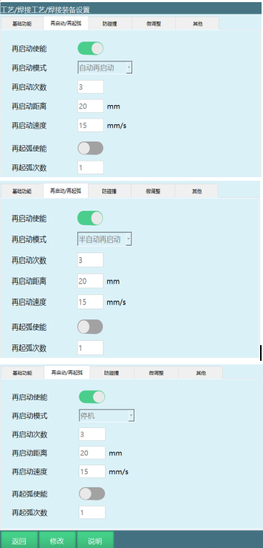

界面参数介绍：  
再启动使能：再启动使能，发生断弧时给起弧信号时才有效。  
自动再启动：检测到发生断弧后，伺服和程序都是在运行状态，在设置的电弧检测时间内，再次给起弧信号，程序继续运行。  
半自动再启动：检测到发生断弧后，伺服在运行状态，程序在暂停状态，此时需要手动点击启动按键，在设置的电弧检测时间内，再次给起弧信号，程序继续运行。  
停机：检测到发生断弧后，伺服在就绪状态，程序在停止状态，发生断弧后需要清错，然后手动点击启动按键，给起弧信号。  
再启动距离：再启动动作回退的距离。  
再启动速度：再启动动作回退时的速度，当速度为0时不会回退。  
再起弧使能：首先发信号让焊机起弧，若起弧失败在原地再次执行起弧动作，若起弧成功正常执行焊接-若设置的次数内还未起弧成功，则停机报错。  
再起弧次数：当前焊机开始、焊接结束区间内执行再启弧的最多次数，超过将不再执行再启动。  
设置的再起弧次数为2次，发生断弧后，给起弧信号超过2次的均未起弧的话，会报错。  

再启动功能（注：使用此功能需要打开基础功能中的焊接中断检测）
                                                                                                   
焊接轨迹P001-P002 焊接开始点P001,焊接结束点P002          
                                                                                                                                                                                 
自动再启动 再启动距离20mm 再启动速度15mm/s               
执行效果： 焊接开始后机器人从P001向P002移动，发生断弧后，控制器警告（检测到焊接发生断弧），此时伺服和程序都是在运行状态， 从P001向P002移动过程发生断弧，机器人会以你设置的再启动距离和 再启动速度参数在断弧的点位以15mm/S的速度移动20mm，到达回退距离后重新给起弧信号，机器人又执行焊接操作                                         

半自动再启动 再启动距离20mm 再启动速度15mm/s             
执行效果： 焊接开始后机器人从P001向P002移动，发生断弧后，控制器警告（检测到焊接发生断弧），此时伺服运行状态，程序为暂停状态，并且会有一个发生断弧的弹窗提示 从P001向P002移动过程发生断弧，点击弹窗提示框的确认按钮，然后再点击启动按键，机器人会以你设置的再启动距离和再启动速度参数在发生断弧的点位以15mm/S的速度移动20mm，到达回退距离后重新给起弧信号，机器人又执行焊接操作  

停机 再启动距离20mm 再启动速度15mm/s                     
执行效果： 焊接开始后机器人从P001向P002移动，发生断弧后，控制器报错（检测到焊接发生断弧），此时伺服就绪状态，程序为停止状态，并且会有发生断弧的弹窗提示。 从P001向P002移动过程发生断弧，报错后先点击清错按键，然后点击弹窗提示框的确认按钮，然后再点击启动按键后会再次有一个弹窗提示（断点执行，首行运行） 1.选择断点执行的效果：机器人会以你设置的再启动距离和再启动速度参数在发生断弧的点位以15mm/S的速度移动20mm，到达回退距离后重新给起弧信号，机器人又执行焊接操作 2.选择从首行运行的效果：机器人会从头开始执行焊接操作

再启动次数
发生断弧时，能够给的起弧信号的次数 执行效果：设置再启动次数为3，发生断弧后起弧信号最多可以给三次，当第四次再给起弧信号时控制器会报错（检测到焊接发生断弧）                                                                                                                                                                                                                                                                                                                                                     
### 2.4.3 防碰撞

界面如下图所示：
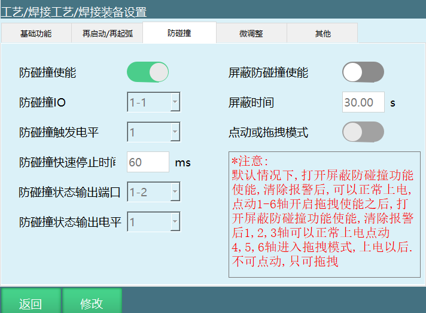

界面参数介绍：  
防碰撞使能：打开使能检测防碰撞信号。  
防碰撞IO：发生碰撞时的IO输入信号。  
防碰撞触发电平：1-高电平，0-低电平。  
防碰撞快速停止时间：触发防碰撞到机器人停止所需的时间。  
设置的防碰撞快速停止时间是60ms,那么在发生碰撞后机器人从工作到停止的时间是60ms。  
防碰撞状态输出端口：触发防碰撞时指定的IO输出口输出信号。  
防碰撞状态输出电平选择1，设置的IO输出端口设置的是1-2口，当发生碰撞时输出端口1-2口会从低电平0-高电平1。  
防碰撞状态输出电平选择0，设置的IO输出端口设置的是1-2口，当发生碰撞时输出端口1-2口会从高电平1-低电平0。  
防碰撞状态输出电平：1-高电平，0-低电平。  
屏蔽防碰撞使能：  
当焊枪发生碰撞后，控制器报错（焊枪防碰撞被触发）。  
此时无法清错，需要打开屏蔽防碰撞使能，设置屏蔽时间，屏蔽时间内不再检测防碰撞信号。   
如果解除防碰撞信号，屏蔽防碰撞使能立即关闭。  
屏蔽时间：碰撞发生时，屏蔽的时间参数。  
打开屏蔽防碰撞使能，设置屏蔽时间10s,当发生碰撞时会屏蔽10s，方便把焊枪移动到安全的位置。  
到达屏蔽时间后控制器报错（屏蔽已结束，焊枪防碰撞被触发）。  
点动或拖拽模式：  
发生碰撞后打开屏蔽防碰撞使能，设置屏蔽时间。  
打开点动或拖拽模式使能，碰撞后可以拖拽4，5，6轴（此时4，5，6轴只可推拽，1，2，3轴可以点动）。 

### 2.4.4 微调整

界面如下图所示：
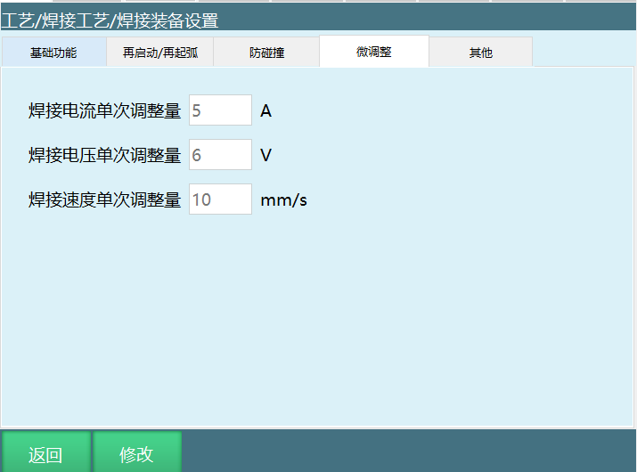

界面参数介绍：  
焊接电流单次调整量：焊接的过程中焊接电流的单次调整幅度。  
例如：焊接电流单次调整量是5A,再焊接的过程中如果想要增加或者减小电流值可以点击工艺栏-【焊接工艺】-【微调整】。  
点击给定值增加电流值会在焊接过程中增加5A,点击给定值减小电流值会在焊接过程中减小5A（注：增加或者减小的数值是根据设置的焊接电流单次调整量来调节的）。  
焊接电压单次调整量：焊接的过程中焊接电压的单次调整幅度。  
例如：焊接电压单次调整量是6V,，再焊接的过程中如果想要增加或者减小电压值可以点击工艺栏-【焊接工艺】-【微调整】。  
点击给定值增加电压值会在焊接过程中增加6V,点击给定值减小电流值会在焊接过程中减小6V（注：增加或者减小的数值是根据设置的焊接电压单次调整量来调节的）。  
焊接速度单次调整：焊接装备参数中可以设置微调整单次的加减幅度。  

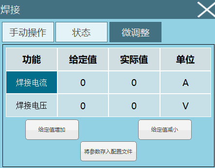

### 2.4.5 其他

界面如下图所示：  
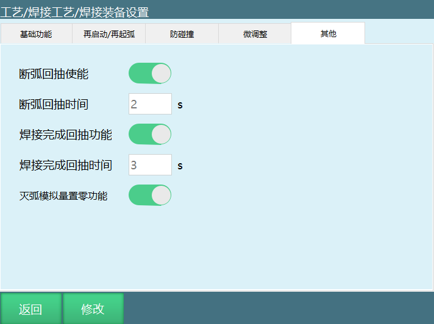

界面参数介绍：  
焊接完成回抽功能：在焊接结束时，焊枪会收到退丝信号，焊丝会回抽，防止去下个焊点时碰撞工件。  
焊接完成回抽时间：完成焊接后，回抽焊丝的时间。  
打开焊接完成回抽使能，设置完成回抽时间3秒，在焊接结束，从收到退丝信号到退丝结束的时间总共需要3秒。  
断弧回抽使能：焊接电流超出了焊机的额定负载率焊机出现了短暂的保护，发生断弧，焊丝需要进行回抽防止与工件粘连。  
断弧回抽时间：焊接断弧后，回抽焊丝的时间。  
打开断弧回抽使能，设置断弧回抽时间2秒，为了防止焊丝与工件粘连，焊丝回抽时间需要2秒。  
灭弧模拟量置零功能：焊接结束模拟量电压电流信号归零（模拟输出）。  

## 2.5 摆焊参数

摆焊是焊接时，焊缝热源在焊件上进行有规律的横向摆动的焊接操作。摆焊效果图如下所示。

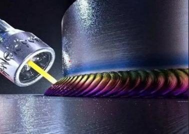

设置摆焊参数需进入“工艺/焊接工艺/摆焊参数”中修改。相关步骤如下：  
进入“工艺/焊接工艺/摆焊参数”页面，摆焊文件有99个工艺号可供选择。选择需要修改的摆焊参数，点击底部的修改按钮，所有输入框变为可输入状态；  
输入完成后点击保存按钮即可完成保存。  

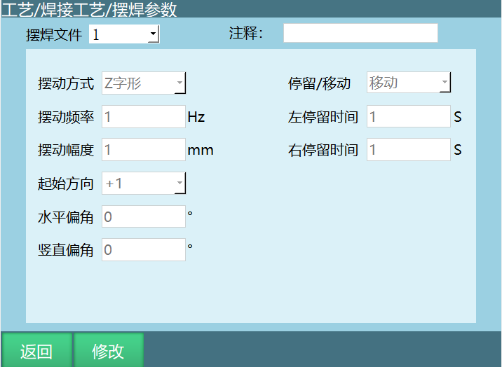

纳博特摆焊支持七种摆动方式：正弦摆、Z字摆、圆形摆、外部轴定点摆、L型摆、三角摆、8字摆。  
摆动频率、摆动幅度、起始方向、水平偏角、竖直偏角等等不同参数可调，可根据工业现场实际需要设置。  
摆动幅度：幅度越大，机器人摆动越大。  
摆动频率：频率越大，机器人摆动频率越快。  
起始方向：+1，从某一点开始走且先向上走；-1，从某一点开始走且先向下走  

### 2.5.1 正弦摆

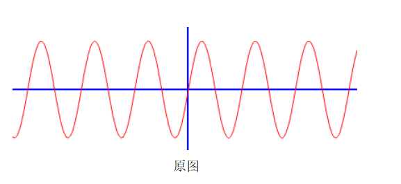

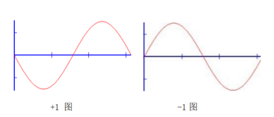

水平偏角：设置水平偏角30° 的摆焊轨迹，如下图所示：  

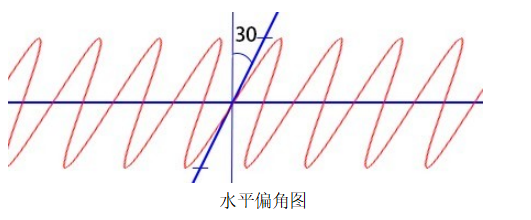

竖直偏角：设置竖直偏角30° 的摆焊轨迹，如图：  

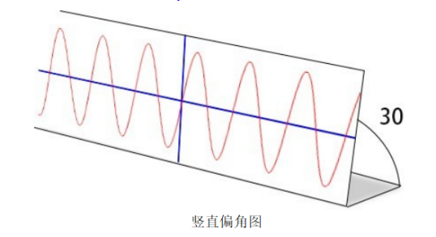

### 2.5.2 Z字摆
移动：机器人每摆动一次往前走设定的时间，然后进入下一次摆动；  
左停留时间/右停留时间：当摆焊方式为Z字形摆，定点摆焊时会有左停留时间，右停留时间参数设置；表示在进行Z字形摆，定点摆焊时，到达一个目标点停留的时间。如下图所示；  
红色轨迹表示Z字形摆焊轨迹，如果设置左右停留时间为1秒，机器人在a点停留1秒后运行到b点，然后再b点停留1秒到c点，按照这种运行逻辑，直到整个摆焊轨迹走完。  

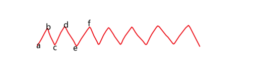

### 2.5.3 圆形摆

支持圆弧轨迹运动，优化了两段圆弧摆之间接头处，使衔接更流畅。  
原圆形摆轨迹及两段焊接衔接如图所示：  

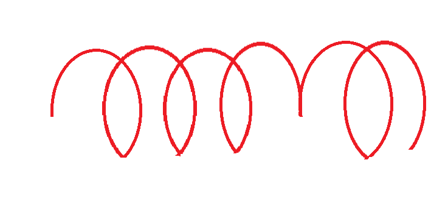

现圆形摆轨迹：  

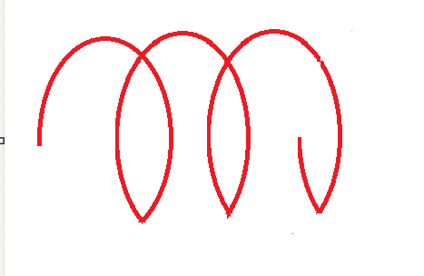

### 2.5.4 L型摆

轨迹示意图如下所示：  

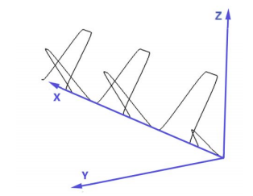  

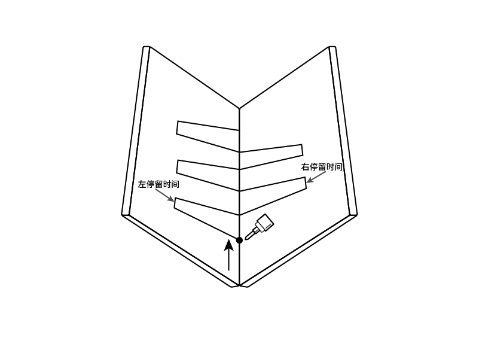  

参数在Z字摆的基础上增加左仰角、右仰角。
左/右仰角：摆动的左/右平面与焊枪工具Z轴方向垂直平面的夹角，如下图所示：

### 2.5.5 三角摆

轨迹示意图如下：

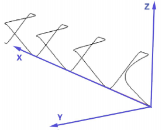

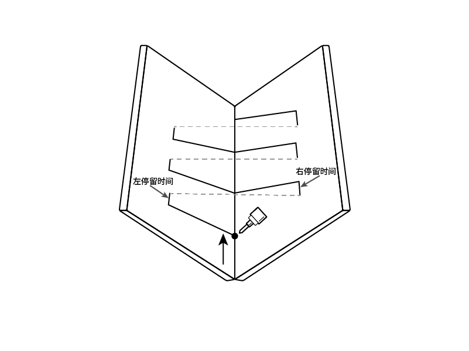

参数在Z字摆的基础上增加左仰角、右仰角。  
左/右仰角：摆动的左/右平面与焊枪工具Z轴方向垂直平面的夹角，如下图所示：  

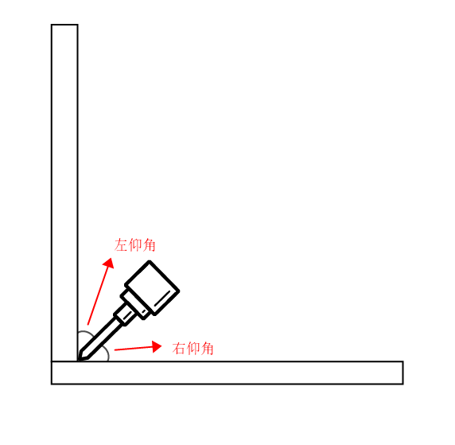

### 2.5.6 8字摆

参数与圆型摆相同，轨迹示意图如下：  

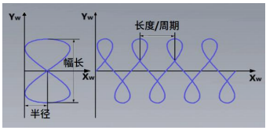

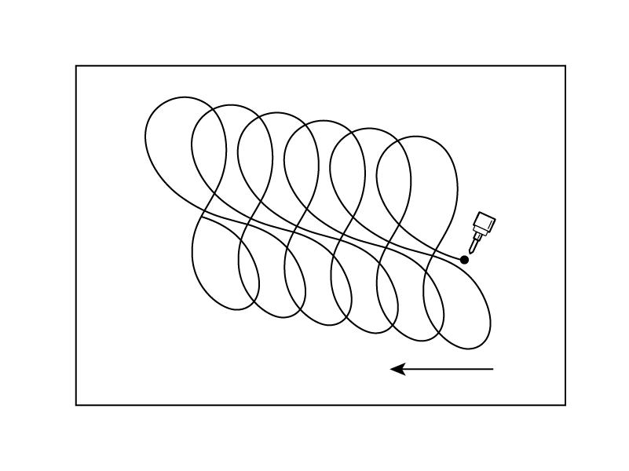

## 2.6 相贯线

相贯线设置需进入“工艺/焊接工艺/相贯线设置”中修改。  
相关步骤如下：  
进入“工艺/焊接工艺/相贯线设置”页面，如下图：  

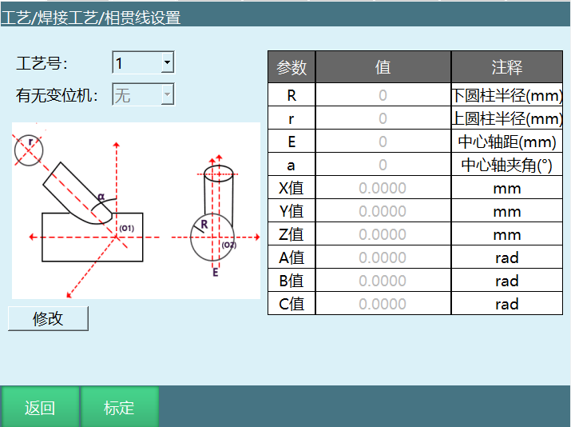

使用前标定可以减小误差，点击标定进入标定界面，如果不知道如何标定在界面内有演示按钮，可以查看，如图所示：  

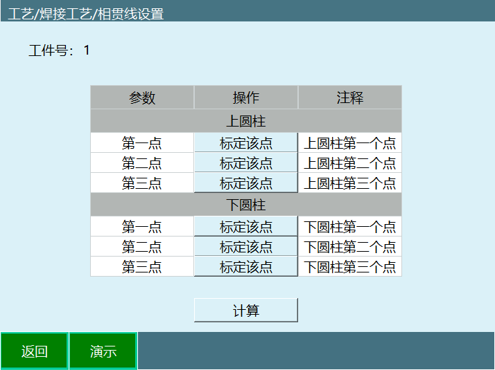

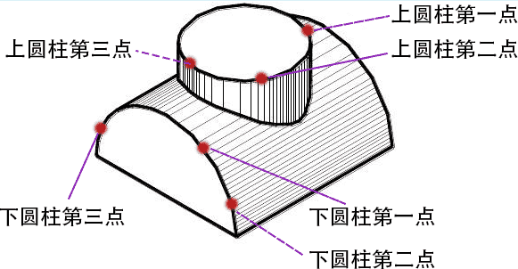

## 2.6 手动操作

设置手动操作需进入“工艺/焊接工艺/手动操作”中修改。相关步骤如下：  
进入“工艺/焊接工艺/手动操作”页面。  

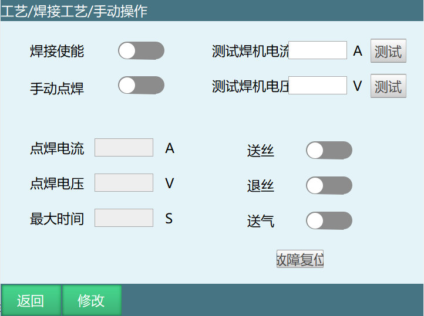

焊接使能：打开焊接使能，机器人才会执行焊接操作，否则只是在走轨迹。  
焊接轨迹的程序编写完后可以首先在示教模式确认运行轨迹正确。  
切换到运行模式打开焊接使能，机器人才会执行焊接功能。  
手动点焊：点击修改，修改按钮变为保存，设置点焊电流，点焊电压，最大时间，点击保存。  
长按手动点焊按钮（按住有效，松开无效），机器人进行焊接，松开按钮，机器人停止焊接。  
点焊电流：点焊输出电流。  
点焊电压：点焊输出电压。  
最大时间：手动点焊按钮允许被按住的最大时间。  
最大时间设置为 5s，按住手动点焊，机器人焊接 5s，超出 5s，即使按住手动点焊按钮，机器人也不会进行焊接。  
故障复位：使用数字焊机时有效，可用于复位焊机故障。  
送丝：按下后开始送丝。  
退丝：按下后开始退丝。  
送气：开始送气。  
为了焊接使用方便，我们现在状态栏添加了【工艺】/【焊接】。  
注：需要在设置/操作参数-工艺选择选中【焊接工艺】，修改保存。状态栏显示【焊接】。点击其中的焊接，会弹出手动操作的焊接窗口。  

【手动操作】与工艺/焊接工艺/手动操作”页面的手动操作效果一样。此状态栏可以更加方便的看见焊接过程中的信号，电流电压值的变化等效果。  
屏蔽防碰撞：触发防碰撞以后，打开屏蔽防碰撞开关，根据焊接装备设置-防碰撞的参数。打开后在屏蔽时间内解除碰撞，方便把焊枪移动到安全位置。  

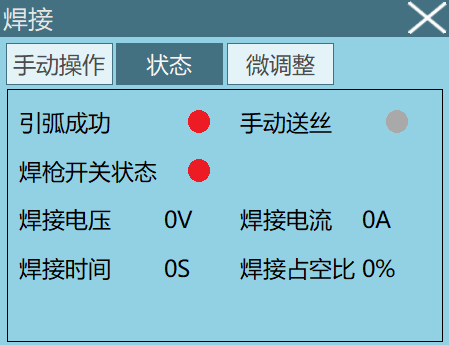

【状态】  
引弧成功/手动送丝/焊枪开关状态：绿色为开启，红色关闭。  
焊接电流/电压：输入的电流和电压 。  
焊接时间：焊接开始到焊接结束之前的焊接时间。记录开机后的焊接时间。  

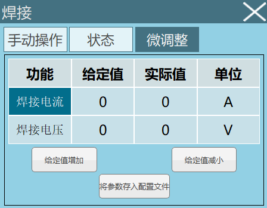

【微调整】  
将参数存入配置文件：焊接期间保存参数，点击保存按钮，参数自动覆盖到指令或参数中。  
指令使用自定义参数时，保存到指令中。  
使用焊接工艺号参数时，保存到焊接参数中。  
给定值增加/给定值减小：选中要调整的参数，点击给定值增加、给定值减小调整，立即生效。  
例如：在焊接工艺-焊接装备设置-微调整界面，设置焊接电流单次调整量是5A,再焊接的过程中如果想要增加或者减小电流值可以点击【给定值增加】，【给定值减小】。  
点击给定值增加电流值会在焊接过程中增加5A,点击给定值减小电流值会在焊接过程中减小5A。  
注：增加或者减小的数值是根据设置的焊接电流单次调整量来调节的。  
例如：在焊接工艺-焊接装备设置-微调整界面，焊接电压单次调整量是6V,，再焊接的过程中如果想要增加或者减小电压值可以点击【给定值增加】，【给定值减小】。  
点击给定值增加电压值会在焊接过程中增加6V,点击给定值减小电流值会在焊接过程中减小6V。  
注：增加或者减小的数值是根据设置的焊接电压单次调整量来调节的。  

## 2.7 多层多道焊

### 2.7.1 工艺

在工艺-焊接工艺中新增多层多道焊，进入后可设置多层多道焊工艺与参数

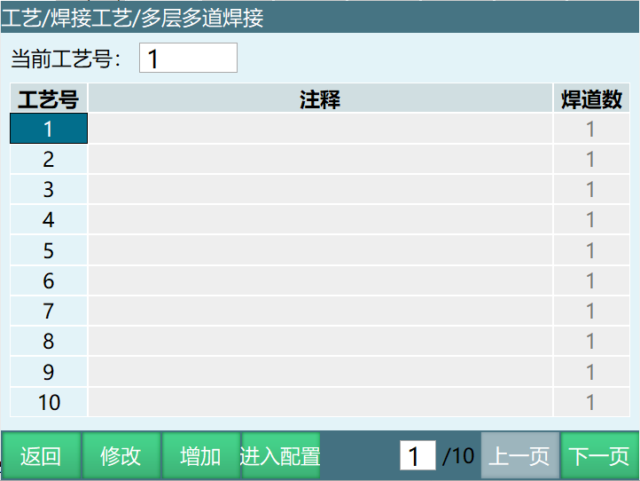

工艺号范围为1-999，每个工艺号中可记录焊道数为1-99，点击增加可增加工艺号，选中工艺号点击修改可进行注释修改、复制参数、清空参数、修改焊道数。

点击进入配置可进入工艺号中修改焊道偏移参数

焊道号：当前焊道的编号，单个工艺号内可存放99个焊道

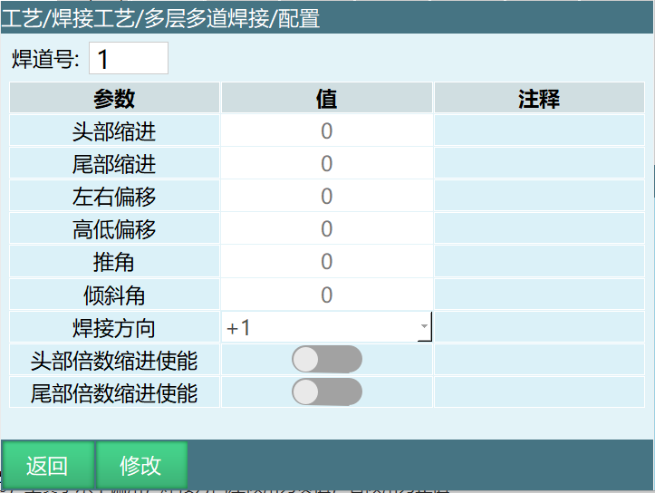

- **头部缩进**：正值往焊接反方向伸长，负值往焊接方向缩进
- **尾部缩进**：正值往焊接方向伸长，负值往焊接反方向缩进

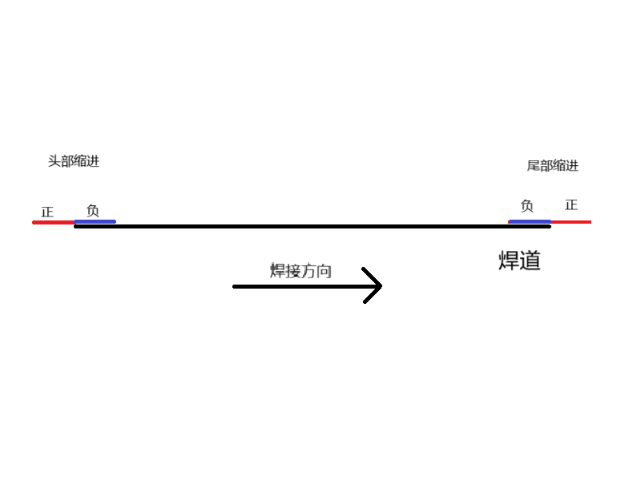

- **左右偏移**：焊道左右偏移值，左右方向与摆焊左右方向定义的要一致，焊接方向左偏为正值，右偏为负值
- **高低偏移**：焊道高低偏移值，高低方向与摆焊定义的要一致，以工具手z+方向为正值，z-向为负值
- **推角**：范围 -180° ~ +180°，工具手与焊道的垂直偏角，焊接方向为正值，反方向为负值，可通过查看A确认实际偏移角度

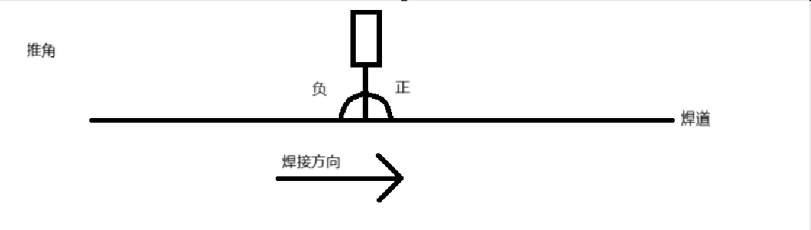

- **倾斜角**：范围 -180° ~ +180°，工具手与焊道的水平偏角，焊接方向左倾角为负值，右倾角为正值，可通过查看B确认实际偏移角度

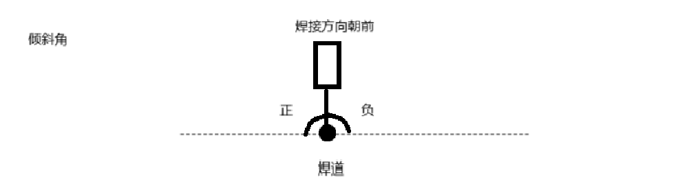

- **焊接方向**：可选 "-1"、"+1"；左右偏移、倾斜角受此参数影响，用于指定左右偏移的方向，+1/-1对应的偏移量的方向是不一样的
- **头部倍数缩进使能**：打开后，实际缩进量为 `焊道编号 * 头部缩进值`
- **尾部倍数缩进使能**：打开后，实际缩进量为 `焊道编号 * 尾部缩进值`

### 2.7.2 指令

焊接指令中新增多层多道焊接开始和多层多道焊接结束指令。

多层多道焊中可包含焊接与摆焊。

在使用电弧跟踪记录轨迹时要保证电弧跟踪运动轨迹参数与多层多道焊开始与结束中的运动轨迹参数相同，即：
- 轨迹数量相同
- 起始点位置与结束点位置相同
- 全局速度、指令速度、加速度、减速度相同
- 跟踪路径数据相同（暂时只能使用1，变量与其他手填值暂时不生效）

**参数说明：**

- **焊道号**：选择工艺中多层多道焊工艺号，可使用绑定变量
- **跟踪路径数据**：电弧跟踪过程中记录的数据号，需与电弧跟踪中跟踪路径数据记录使用相同（可使用绑定变量，但暂时只能使用1，填0为不使用，变量与其他手填值暂时不生效）
- **临时参数**：打开后可对当前工艺焊道参数进行临时修改，具体使用方法与工艺设置一致，可参考上文
- **头部缩进**：正值往焊接反方向伸长，负值往焊接方向伸长，可使用绑定变量
- **尾部缩进**：正值往焊接方向伸长，负值往焊接反方向伸长，可使用绑定变量
- **左右偏移**：焊道左右偏移值，左右方向与摆焊左右方向定义的要一致，焊接方向左偏为正值，右偏为负值，可使用绑定变量
- **高低偏移**：焊道高低偏移值，高低方向与摆焊定义的要一致，以工具手z方向为正值，反方向为负值，可使用绑定变量
- **推角**：范围 -180° ~ +180°，工具手垂直偏角，焊接方向为正值，反方向为负值，可使用绑定变量
- **倾斜角**：范围 -180° ~ +180°，工具手水平偏角，焊接方向左倾角为负值，右倾角为正值，可使用绑定变量
- **焊接方向**：可使用Bool变量或手填0或1；左右偏移、倾斜角受此参数影响，用于指定左右偏移的方向，0、1对应的偏移量的方向是不一样的
- **头部倍数缩进使能**：可使用Bool变量，0表示关闭，1表示打开，实际缩进量为 `焊道编号 * 头部缩进值`
- **尾部倍数缩进使能**：可使用Bool变量，0表示关闭，1表示打开，实际缩进量为 `焊道编号 * 尾部缩进值`

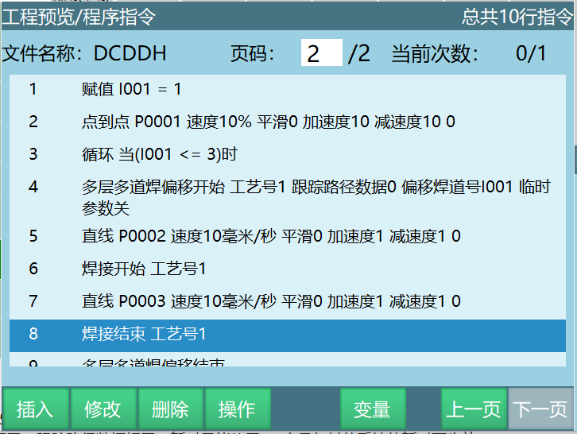

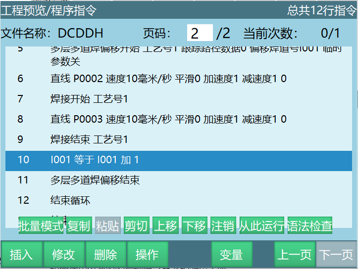

**最简单的多层多道焊程序模板：**

赋值、循环、偏移焊道号所使用的绑定变量需一致。循环的范围为小于等于工艺中所设的焊道数。

如需使用电弧跟踪与摆焊可参考相对应手册。

### 2.7.3 注

1. **左右偏移与高低偏移**均以工具手垂直的面为基准进行偏移，实际偏移并非在实际平面上。如工具手非垂直于工件平面，需根据夹角通过三角函数计算得出实际平面偏移量。

   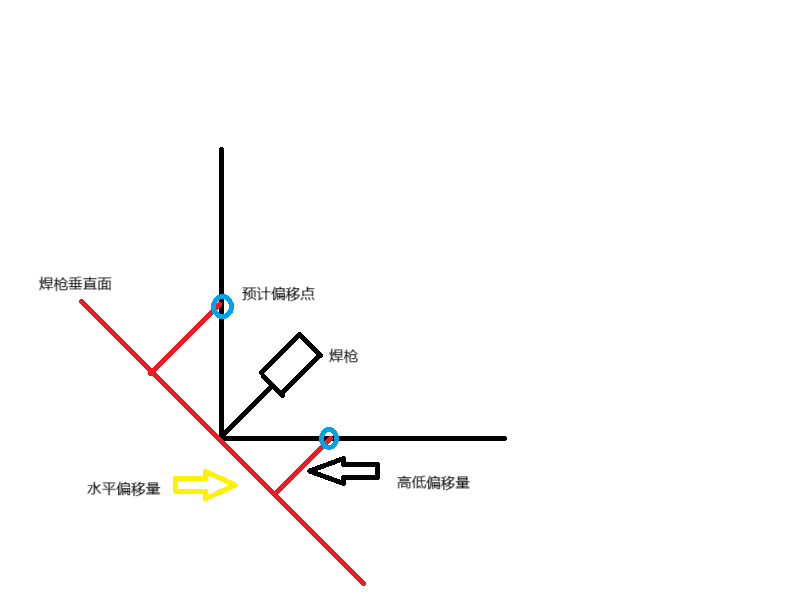

2. **焊接方向**只影响左右偏移和倾斜角，不影响实际运动方向。实际运动方向只与插入指令顺序有关。  
   例：指令为 P001 → P002，焊接方向选择 +1，机器人将从 P001 运动到 P002；当焊接方向选择 -1，机器人运动方向不变，但左右偏移与倾斜角参数的正负会发生变化。当指令为 P002 → P001 时，机器人才会从 P002 运动到 P001。

3. 多线段折线中机器人偏移方向以夹角的向量方向计算，当两个轨迹向量方向平行时机器人运动时姿态不会发生变化。

4. 多层多道焊开始与结束中尽量不要使用相同点位，若出现点位位置相同需将其中一个更换点位号。

5. 暂时多层多道焊轨迹不支持以圆弧轨迹开始与圆弧轨迹结束，不支持 m 型圆弧偏移。

6. 多层多道焊圆弧轨迹偏移当点位不在一个平面时是按球型轨迹偏移。

7. 多层多道焊接开始与结束中间需包含完整的焊道轨迹，即焊接起始点也要在多层多道焊开始与结束中间，不能只有 1 个点或者圆弧、圆轨迹只有 2 个点的情况。

8. 当运行了多层多道焊开始后发生断弧或者其他报错导致机器人停止，需单步运行一次多层多道焊结束再重新开始运行程序，否则会导致点位错误。

# 3. 焊接指令说明
## 3.1 ARCON指令-焊接开始

功能：该指令可以执行起弧操作  
参数界面  

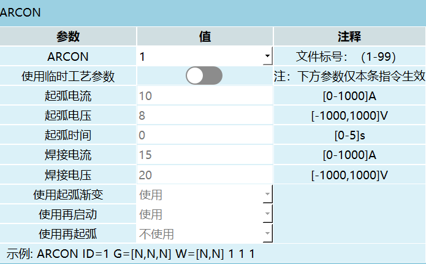

|参数|值|注释|  
| ---|---|---|
|ARCON|1-99或绑定变量|焊接工艺支持99个文件标号 使用绑定变量时变量名需与焊接结束保持一致|
|使用临时工艺参数|1 打开使用临时工艺参数开关，焊接开始时的电流电压值会根据你设置的临时工艺参数来进行焊接操作 例如：在焊接工艺-焊接参数界面设置的收弧电流是50A，如果在焊接结束指令参数界面打开了使用临时工艺参数开关，设置的收弧电流是60A,那么在执行焊接操作时收弧电流是60A 2 打开使用临时工艺参数开关，修改的参数值会有黄颜色的填充提示。如下图 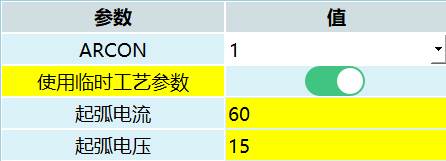 3 不打开使用临时工艺参数开关，进行焊接操作时的电流电压值是自己在焊接工艺-焊接参数界面设置的电流电压值|打开使用临时工艺参数开关，下面的参数才会生效，如下图 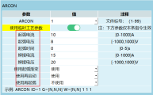 注：下方参数仅本条指令生效

## 3.2 ARCOFF指令-焊接结束

功能：执行灭弧操作，选择与焊接开始对应的工艺号  
参数界面                 

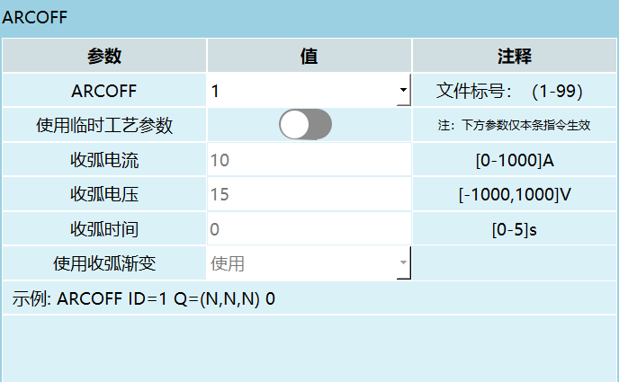

|参数|值|注释|  
| ---|---|---|
|ARCOFF|1-99或绑定变量|焊接工艺支持99个文件标号 使用绑定变量时变量名需与焊接结束保持一致|
|使用临时工艺参数|1 打开使用临时工艺参数开关，焊接开始时的电流电压值会根据你设置的临时工艺参数来进行焊接操作 例如：在焊接工艺-焊接参数界面设置的收弧电流是50A，如果在焊接结束指令参数界面打开了使用临时工艺参数开关，设置的收弧电流是60A,那么在执行焊接操作时收弧电流是60A 2 打开使用临时工艺参数开关，修改的参数值会有黄颜色的填充提示。如下图 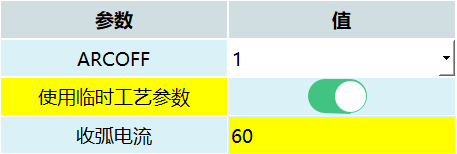 3 不打开使用临时工艺参数开关，进行焊接操作时的电流电压值是自己在焊接工艺-焊接参数界面设置的电流电压值|打开使用临时工艺参数开关，下面的参数才会生效，如下图 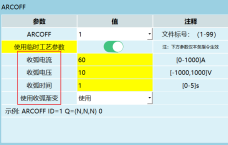 注：下方参数仅本条指令生效|

## 3.3 ARCSET指令-焊接设置                          

功能：该指令可以设置焊接时的电流电压  
例如：在焊接工艺-焊接参数界面设置了焊接电流50A，电压15V， 在焊接设置指令参数界面设置了焊接电流45A，电压20V  
如果在焊接开始指令后面插入焊接设置指令，焊接时的电流电压值是在焊接设置指令界面所填的参数值  
 
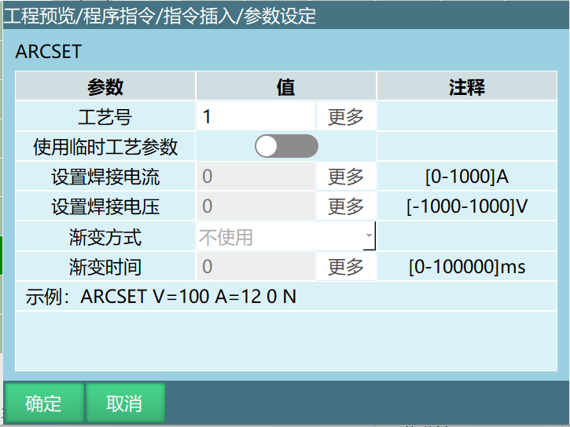
 
|参数|值|注释|  
| ---|---|---|
|工艺号|1-99或绑定变量|1-99或绑定变量|
|使用临时工艺参数|1 打开使用临时工艺参数开关，焊接开始时的电流电压值会根据你设置的临时工艺参数来进行焊接操作 例如：在焊接工艺-焊接参数界面设置的收弧电流是50A，如果在焊接结束指令参数界面打开了使用临时工艺参数开关，设置的收弧电流是60A,那么在执行焊接操作时收弧电流是60A 2 打开使用临时工艺参数开关，修改的参数值会有黄颜色的填充提示。如下图 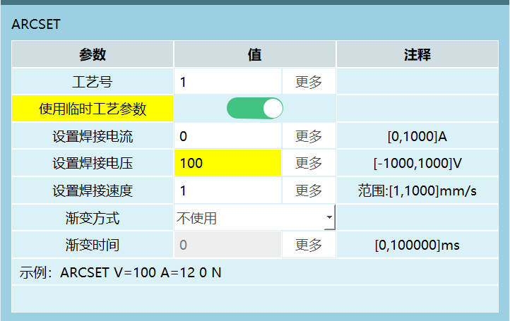3 不打开使用临时工艺参数开关，进行焊接操作时的电流电压值是自己在焊接工艺-焊接参数界面设置的电流电压值|
| 设置焊接电流 | 填写焊接操作时的焊接电流值 | [0-1000]A |
| 设置焊接电压 | 填写焊接操作时的焊接电压值 | [-1000-1000]V |
| 渐变方式 | 1. 时间渐变 2. 不使用 | |
| 渐变时间 | 当前的电流电压值渐变到焊接设置指令的电流电压 | [0-100000]ms |

## 3.4 WVON指令-摆焊开始

**功能：** 该指令执行时开始摆焊，执行该指令前请先运行焊接开始ARCON指令。

**参数界面：** 除moka版本仍为9个摆焊工艺号外，其他版本均为99个。

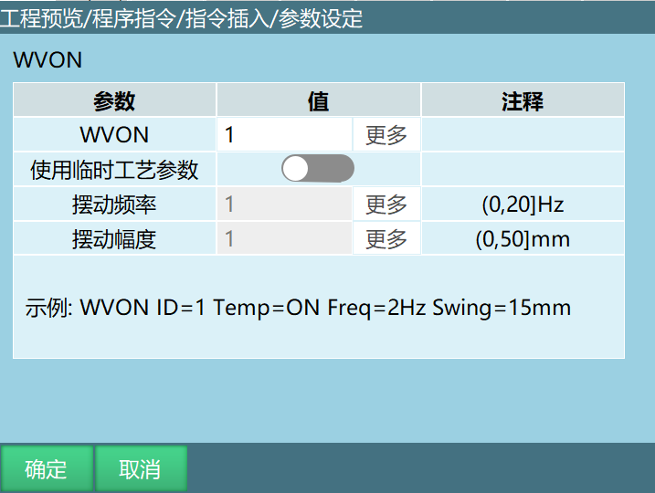

| 参数 | 数值 | 注释 |
|------|------|------|
| WVON | 1-9或绑定变量 | 摆焊时可以选择不同的文件标号。如图所示：  例如：在焊接工艺-摆焊参数界面，选择的摆焊文件是1，摆焊方式是正弦摆，如图一所示，摆焊开始工艺号选择1，在焊接时就会执行正弦摆轨迹的焊接。 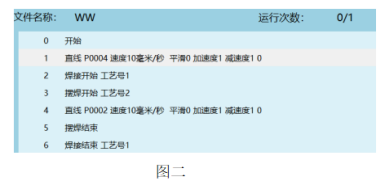 例如：在焊接工艺-摆焊参数界面，选择的摆焊文件是2，摆焊方式是Z字形摆，如图二所示，摆焊开始工艺号选择2，在焊接时就会执行Z字形摆轨迹的焊接。 |
| 使用临时工艺参数 | 1. 打开使用临时工艺参数开关，摆焊开始时的摆动频率和摆动幅度会根据你设置的临时工艺参数来进行焊接操作。例如：在焊接工艺-摆焊参数界面设置的摆动频率是3Hz，如果在摆焊开始指令参数界面打开了使用临时工艺参数开关，设置的摆动频率是1Hz，那么在执行焊接操作时摆动频率是1Hz。 2. 打开使用临时工艺参数开关，修改的参数值会有黄颜色的填充提示。如下图：  注：下方参数仅本条指令生效。 3. 不打开使用临时工艺参数开关，进行摆焊操作时的摆动频率和幅度值是自己在焊接工艺-摆焊参数界面设置的值。 | 打开使用临时工艺参数开关，下面的参数才会生效，如下图 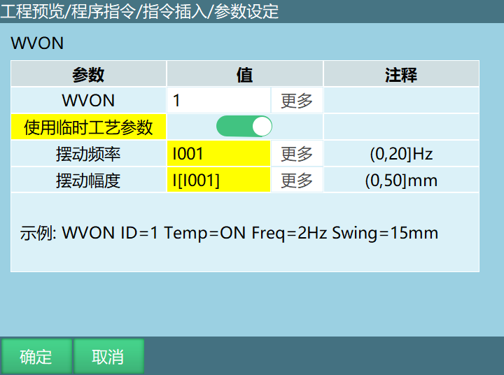注：下方参数仅本条指令生效|
| 摆动频率 | (0-20)值或绑定变量 | |
| 摆动幅度 | (0-20)值或绑定变量 | |

## 3.5 WVOFF指令-摆焊结束

**功能：** 该指令执行时结束摆焊。

**参数界面：**

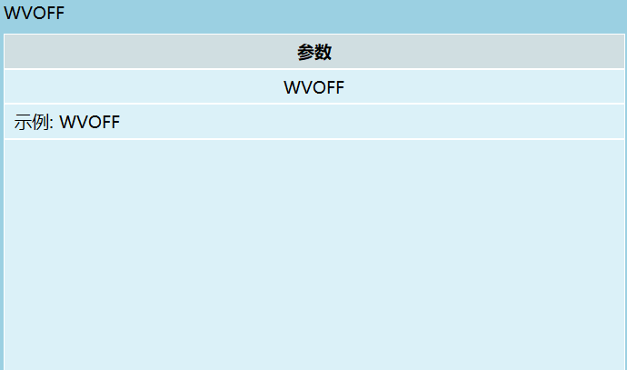

**使用方法：** 如图一所示执行摆焊结束指令，机器人结束摆焊。注：需要在摆焊开始前插入焊接开始指令，摆焊结束指令后插入焊接结束指令。

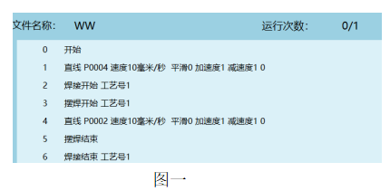

## 3.6 CIL指令-相贯线

**参数界面：**

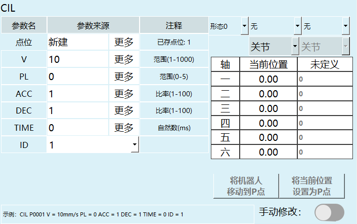

| 参数名 | 参数来源 | 注释 |
|--------|----------|------|
| 点位：选择局部位置变量/全局位置变量/绑定变量。当值为"新建"时，插入该指令则新建一个P变量，并将机器人的当前位置记录到该P变量 | P, GP, P[], CP[] | 新建的位置变量 |
| V：速度，单位mm/s | 这些参数都可以绑定变量，如图所示： 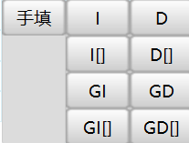 | 表示参数的范围和单位 |
| PL：平滑等级 | 例如：新建P001和P002两个点位，走一段直线轨迹，设置了平滑参数的话两个点之间衔接度就好。 | |
| ACC：加速度，单位百分比 | | |
| DEC：减速度，单位百分比 | | |
| TIME：提前执行时间，单位ms | | |
| ID：相贯线工艺号 | | |

## 3.7 FSWELDON指令-鱼鳞焊开始

**说明：** 鱼鳞焊暂不支持外部轴圆弧指令。

**功能：** 执行该指令开始鱼鳞焊轨迹，执行该指令前请先运行焊接开始ARCON指令。

**参数界面：**

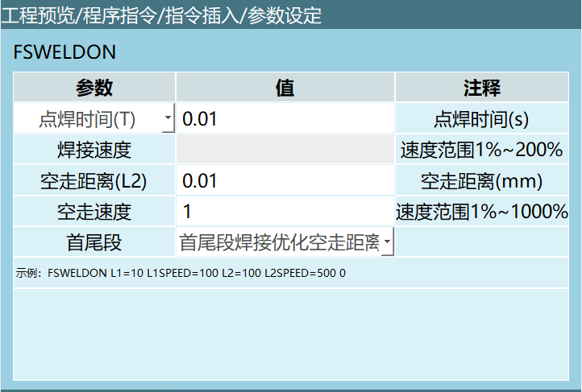

**鱼鳞焊图片：**

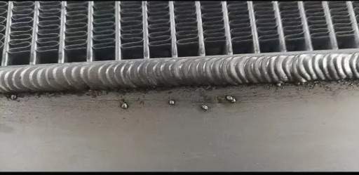

| 参数 | 值 | 注释 |
|------|----|------|
| 点焊时间T 焊接距离L1 | 图一为设置焊接距离和空走距离参数时的示例图。 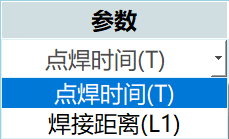 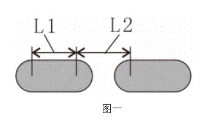 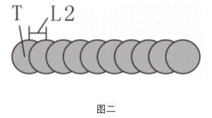 焊接距离：机器人在移动过程中持续进行焊接。例如：设置的焊接距离是5mm，如图一表示L1的距离是5mm。L2表示空走距离。 点焊时间：在设置的时间内机器人不移动，保持持续焊接。T表示点焊时间，L2空走距离。 | 选择L1时表示焊接距离mm；选择T时表示点焊时间s。 |
| 空走距离L2 | 填入空走的距离参数。例如：填写的距离是5mm，那如图一所示，L2的距离是5mm。 | 填入空走的距离参数，单位mm。 |
|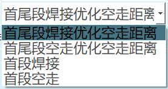| 首尾段类型选择 | 1. 首尾段焊接优化空走距离：指焊接轨迹首尾固定为焊接，焊接距离为固定的设置距离，空走距离则是系统优化后的距离（不固定）。 2. 首尾段空走优化空走距离：指焊接轨迹首尾固定为空走，焊接距离为固定的设置距离，空走距离则是系统优化后的距离（不固定）。**注意：首尾段空走优化空走距离，必须先插入鱼鳞焊开始指令再插入焊接开始。** 3. 首段焊接：指焊接轨迹首段固定为焊接，整条轨迹焊接距离以及空走距离都为设置的固定距离。 4. 首段空走：指焊接轨迹首段固定为空走，整条轨迹焊接距离以及空走距离都为设置的固定距离。 |

## 3.8 FSWELDOFF指令-鱼鳞焊结束

**功能：** 执行该指令结束鱼鳞焊轨迹。

## 3.9 FEEDWIRE指令-送丝

**功能：** 在焊接开始或者焊接结束后在设置的时间内送丝，然后到达指定的位置将焊丝剪掉，为了焊接时的焊丝均匀。

**参数界面：**

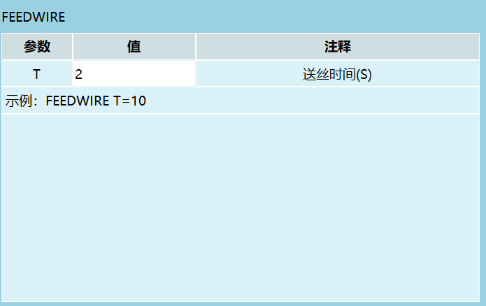

| 参数 | 值 | 注释 |
|------|----|------|
| T | 代表送丝时间 | 送丝时间，单位s |

## 3.10 ARCBUILTIN指令-焊机内置工艺

**指令界面：** 该指令目前可配合奥太焊机使用。

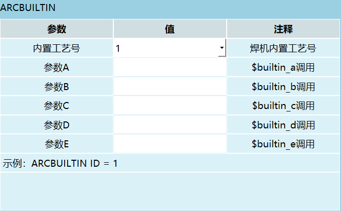

| 参数 | 值 | 注释 |
|------|----|------|
| 内置工艺号 | 1-9 | 焊机内置工艺号 |
| 参数A | | $builtin_a调用 |
| 参数B | | $builtin_b调用 |
| 参数C | | $builtin_c调用 |
| 参数D | | $builtin_d调用 |
| 参数E | | $builtin_e调用 |

## 3.11 REFP指令-摆焊参考点

**指令界面：**

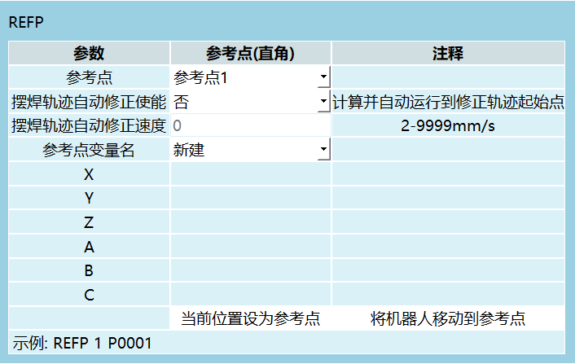

| 参数 | 参考点（直角） | 备注 |
|------|----------------|------|
| 参考点 | **红色轨迹表示通过确定摆焊方向进行摆焊的轨迹**。 只选择参考点1/参考点2： 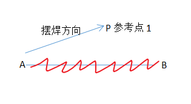 参考点1和参考点2都选则： 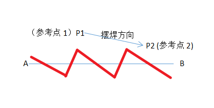 | |
| 摆焊轨迹自动修正使能 | 否/是 | 计算并自动运行到修正轨迹起始点。 |
| 摆焊轨迹自动修正速度 | 打开自动修正使能后会将焊道的起始点偏移至两参考点中间。**绿色轨迹表示通过修正摆焊起始点后，摆焊的轨迹和方向**。 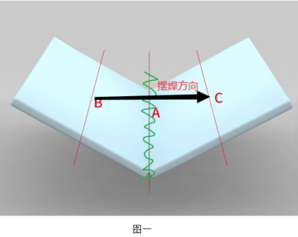 例如：如图所示，B为参考点1，C为参考点2，打开自动修正使能后焊道的起始点为两参考点距离的中心点。 | 速度范围2-9999mm/s。 |

## 3.11 SPOTWELD指令-点焊

**功能：** 该指令执行时机器人开始执行点焊操作。

**指令界面：**

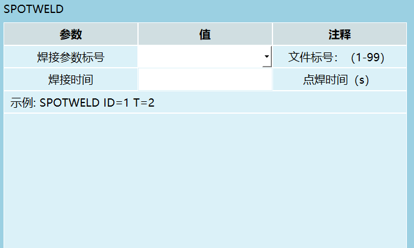

| 参数 | 值 | 注释 |
|------|----|------|
| 焊接参数标号 | 1-99 | 点焊时所使用的焊接参数工艺号（1-99）。 |
| 焊接时间 | 例如：点焊时间设置2秒，表示机器人在2秒内持续焊接。 | 在设置的时间内机器人不移动，保持持续焊接，单位（S）。 |
| 使用方法 | 设置焊接信号，电流电压匹配参数，焊接装备参数。在焊接工艺-手动操作界面设置点焊的电流，电压，时间参数。设置好所需要的参数后，在手动操作界面或者焊接工艺的状态界面点击点焊使能按钮会发现设置的起弧，送气信号端口会打开（因为测试时未连焊机所以送丝，退丝信号端口没有反应）。 | |

# 4 焊接工艺使用案例

## 4.1 正常起弧焊接

### 4.1.1 参数设置

所有参数数值设置无具体意义，仅用作示例说明。

- 进入"**工艺/焊机设置**"，设置焊机控制方式-模拟焊机。
- 进入"工艺/焊接IO"，数字输入：起弧成功信号1-1，数字输出：起弧信号1-2，模拟输入焊接电流信号DIN1-1，焊接电压信号DIN1-2，模拟输出给定电流信号DOUT1-1，给定电压信号DOUT1-2。
- 进入"**工艺/电流电压匹配**"，设置电流第一行焊接电流填【1】，实际焊接电流【10】；设置电压第一行焊接电压填【1】，实际焊接电压填【10】。
- 进入"**工艺/焊接工艺/焊接参数设置**"，设置起弧参数：起弧电流【8】A起弧电压【8】V起弧时间【2】S；焊接参数：焊接电流【10】A，焊接电压【10】V；收弧电流【7】A，收弧电压【7】V，收弧时间【2】S。
- 进入"**工艺/焊接装备设置**"-基础功能：电弧检测时间【2】S，电弧检测确认时间【1】S。
- 进入"**工艺/手动操作**"，打开焊接使能开关，打开手动起弧模式，设置手动点焊电流8A，点焊电压8V，最大时间2S。

### 4.1.2 程序编写

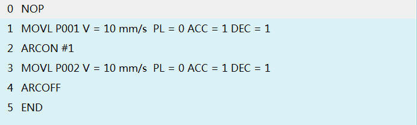

### 4.1.3 指令含义

1. 机器人移动到**焊接的起始点P001**。
2. **ARCON#1 焊接开始**：设置了4s的提前送气时间和1s的电弧检测时间，开始起弧，执行焊接参数标号1。4s的提前送气时间（焊机提前4秒送气，检测到有气体，气体检测信号端口输出高电平，4s之后，开始起弧，设置的起弧信号输出口输出高电平）。1s的电弧检测时间（若1s内检测到起弧成功信号，程序继续运行，若检测不到，则会报"等待焊接起弧成功信号超时"错误）。
3. 机器人移动到焊接的终点P002：机器人开始焊接，设置的起弧电压60V，起弧电流10A，起弧时间1s，焊接电压80V，焊接电流20A，收弧电压50V。从P001到P002的移动过程中，如果焊机起弧成功，则焊机会以起弧电流电压值起弧，然后以设置的起弧电流电压值维持1秒（起弧时间）后电流电压到达焊接电流电压值，开始焊接。
4. **ARCOFF 焊接结束**：在工艺-焊接参数界面设置收弧电压50V，收弧电流10A，收弧时间1。焊接完成后开始收弧，到达收弧电流电压值后维持1秒（收弧时间）然后焊接结束，设置的送气，起弧信号输出端口由高电平1-低电平0。

### 4.1.4 程序编写方法

1. 点击"工程"，点击"新建"，输入程序名称，点击"确定"。
2. 将机器人移动到**焊接的起始点**，点击"插入"，选择"运动控制类"，选择MOVL，点击"确定"，修改速度数值，点击"确定"。
3. 点击"插入"，选择"焊接控制类"，选择ARCON，点击"确定"，**输入文件编号**（文件编号对应焊接参数设置界面中的数值），点击"确定"。
4. 将机器人移动到**焊接的终点**，点击"插入"，选择"运动控制类"，选择MOVL，点击"确定"，修改速度数值，点击"确定"。
5. 点击"插入"，选择"焊接控制类"，选择ARCOFF，点击"确定"，点击"确定"。

**轨迹确认**：程序编写好之后，转动旋钮，将示教盒从示教模式切换到运行模式，点击"start"，确认机器人的运行轨迹是否正确，是否符合需要。

**焊接**：确认运行轨迹正确之后，打开焊接使能，机器人才会执行焊接功能。注：程序在运行模式时，按下"stop"，再按下"start"之后，程序重新开始之后，将不再执行焊接功能。

焊接使能打开方式：示教盒切换到示教模式，点击工艺栏-焊接，出现下图：

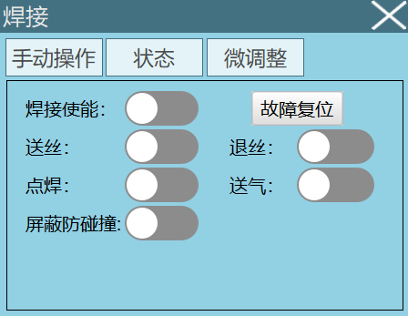

选中"焊接使能"，打开使能，如图所示：

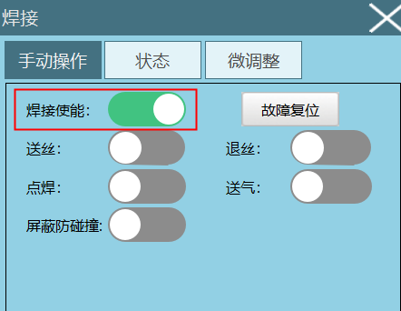

## 4.2 摆焊使用案例

### 4.2.1 参数设置

1. 进入"**工艺/焊机设置**"，设置焊机控制方式-模拟焊机。
2. 进入"工艺/焊接IO"，数字输入：起弧成功信号1-1，数字输出：起弧信号1-2，模拟输入焊接电流信号DIN1-1，焊接电压信号DIN1-2，模拟输出给定电流信号DOUT1-1，给定电压信号DOUT1-2。
3. 进入"**工艺/电流电压匹配**"，设置电流第一行焊接电流填【1】，实际焊接电流【10】；设置电压第一行焊接电压填【1】，实际焊接电压填【10】。
4. 进入"**工艺/焊接工艺/焊接参数设置**"，设置起弧参数：起弧电流【20】A起弧电压【10】起弧时间【1】焊接参数：焊接电流【50】A，焊接电压【20】V；收弧电流【28】A，收弧电压【15】V。
5. 进入"**工艺/焊接装备设置**"-基础功能：电弧检测时间【2】S，电弧检测确认时间【1】S。
6. 进入"**工艺/手动操作**"，打开焊接使能开关，打开手动起弧模式，设置手动点焊电流8A，点焊电压8V，最大时间2S。
7. 进入"**工艺/焊接工艺/摆焊参数**"，设置参数。

### 4.2.2 程序编写

参考指令见下图二：

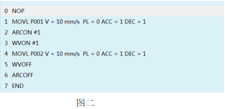

### 4.2.3 指令含义

1. 机器人移动到P001点（摆焊起始点）。
2. **ARCON#1 焊接开始**：从P001到P002的移动过程中，如果焊机起弧成功，则焊机会以起弧电流电压值起弧，然后以设置的起弧电流电压值维持1秒（起弧时间）后电流电压到达焊接电流电压值，开始焊接。
3. **WVON#1 摆焊开始**：执行摆焊文件1中的参数（若为WVON#2，摆焊开始，执行摆焊文件2的参数）。执行此条指令后根据在**工艺/焊接工艺/摆焊参数**设置的摆焊参数机器人进行摆焊操作。
4. P002摆焊的结束点：P001-P002是需要执行的摆焊轨迹。摆焊轨迹的幅度，频率，方向/水平竖直偏角根据图一设置进行摆焊。
5. **WVOFF#1 摆焊结束**：机器人完成摆焊接操作。
6. **ARCOFF 焊接结束**：在工艺-焊接参数界面设置收弧电压50V，收弧电流10A，收弧时间1s。焊接完成后开始收弧，到达收弧电流电压值后维持1秒（收弧时间）然后焊接结束，设置的送气，起弧信号输出端口由高电平1-低电平0。

### 4.2.4 程序编写方法

1. 点击"工程"，点击"新建"，输入程序名称，点击"确定"。
2. 将机器人移动到焊接的起始点，点击"插入"，选择"运动控制类"，选择MOVL，点击"确定"，修改速度数值，点击"确定"。
3. 点击"插入"，选择"焊接控制类"，选择ARCON，点击"确定"，输入文件编号（文件编号对应焊接参数设置界面中的数值），点击"确定"。
4. 点击"插入"，选择"焊接控制类"，选择WVON，点击"确定"，输入文件编号（文件编号对应摆焊参数界面中的数值）。
5. 将机器人移动到焊接的终点，点击"插入"，选择"运动控制类"，选择MOVL，点击"确定"，修改速度数值，点击"确定"。
6. 点击"插入"，选择"焊接控制类"，选择WVOFF，点击"确定"，点击"确定"。
7. 点击"插入"，选择"焊接控制类"，选择ARCOFF，点击"确定"，点击"确定"。

**轨迹确认**：程序编写好之后，转动钥匙，将示教盒从示教模式切换到运行模式，点击"start"，确认机器人的运行轨迹是否正确。

**焊接**：确认运行轨迹正确之后，要打开**焊接使能**，机器人才会执行焊接功能（有关焊接使能的打开方式，在**起弧焊接**案例中有介绍）。

## 4.3 鱼鳞焊使用案例

### 4.3.1 参数设置

- 进入"**工艺/焊机设置**"，设置焊机控制方式-模拟焊机。
- 进入"工艺/焊接IO"，数字输入：起弧成功信号1-1，数字输出：起弧信号1-2，模拟输入焊接电流信号DIN1-1，焊接电压信号DIN1-2，模拟输出给定电流信号DOUT1-1，给定电压信号DOUT1-2。
- 进入"**工艺/电流电压匹配**"，设置电流第一行焊接电流填【1】，实际焊接电流【10】；设置电压第一行焊接电压填【1】，实际焊接电压填【10】。
- 进入"**工艺/焊接工艺/焊接参数设置**"，设置起弧参数：起弧电流【20】A起弧电压【10】起弧时间【1】焊接参数：焊接电流【50】A，焊接电压【20】V；收弧电流【28】A，收弧电压【15】V。
- 进入"**工艺/焊接装备设置**"-基础功能：电弧检测时间【2】S，电弧检测确认时间【1】S。
- 进入"**工艺/手动操作**"，打开焊接使能开关，打开手动起弧模式，设置手动点焊电流8A，点焊电压8V，最大时间2S。
- 进入"**工艺/焊接工艺/摆焊参数**"，设置参数。

### 4.3.2 程序编写

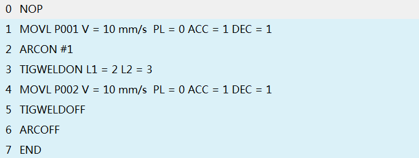

### 4.3.3 指令含义

1. P001焊接的起始点。
2. **ARCON#1 焊接开始**：机器人开始焊接，设置的起弧电压60V，起弧电流10A，起弧时间1s，焊接电压80V，焊接电流20A，收弧电压50V。从P001到P002的移动过程中，如果焊机起弧成功，则焊机会以起弧电流电压值起弧，然后以设置的起弧电流电压值维持1秒（起弧时间）后电流电压到达焊接电流电压值，开始焊接。
3. **FSWELDON T=2 L2=3**（鱼鳞焊开始）。设置点焊时间和空走距离，如下图： 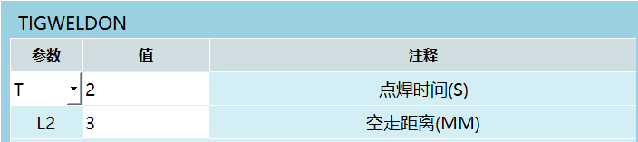 机器人起弧，机器人在P001点焊接2s（即T=2s），然后机器人灭弧，空走3mm（即L2=3mm）的距离到W1点。机器人在W1点起弧，在W1点焊接2s，灭弧，空走3mm到W2点。①起弧 ②焊接2s ③灭弧 ④空走3mm，**循环**前边的4个步骤，直至运行到焊接的终点（P002）。 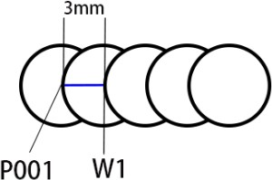 设置焊接距离和空走距离，如下图所示： 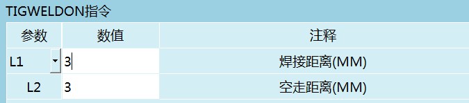 机器人起弧，机器人从P001点开始，以焊接的状态运行L1的距离到W1点（P001和W1的距离为3MM，即焊接距离），然后机器人灭弧，空走3mm（即L2=3mm）到W2点，机器人在W2点起弧，机器人从W2运行到W3点，然后机器人灭弧，空走3mm到W4点，①起弧，②焊接3MM，③灭弧，④空走3mm，循环前边的4个步骤，直至运行到焊接的终点（P002）。 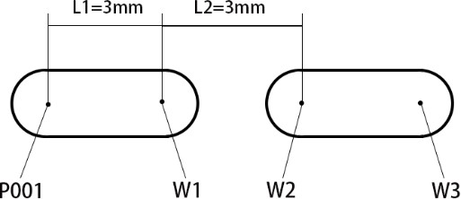
4. P002（焊接的结束点）。
5. **FSWELDOFF**（鱼鳞焊结束）。
6. **ARCOFF 焊接结束**：在工艺-焊接参数界面设置收弧电压50V，收弧电流10A，收弧时间1。焊接完成后开始收弧，到达收弧电流电压值后维持1秒（收弧时间）然后焊接结束，设置的送气，起弧信号输出端口由高电平1-低电平0。

### 4.3.4 程序编写方法

1. 点击"工程"，点击"新建"，输入程序名称，点击"确定"。
2. 将机器人移动到**焊接的起始点**。
3. 点击"插入"，选择"运动控制类"，选择MOVL，点击"确定"，修改速度数值，点击"确定"。
4. 点击"插入"，选择"焊接控制类"，选择ARCON，点击"确定"，输入文件编号（文件编号对应**焊接参数设置**界面中的数值），点击"确定"。
5. 点击"插入"，选择"焊接控制类"，选择FSWELDON，点击"确定"，选择鱼鳞焊类型：选择一：第一行参数选择T；选择二：第一行参数选择L1，输入相应的数值。
6. 将机器人移动到**焊接的终点**，点击"插入"，选择"运动控制类"，选择MOVL，点击"确定"，修改速度数值，点击"确定"。
7. 点击"插入"，选择"焊接控制类"，选择FSWELDOFF，点击"确定"，点击"确定"。点击"插入"，选择"焊接控制类"，选择ARCOFF，点击"确定"，点击"确定"。

**轨迹确认**：程序编写好之后，转动钥匙，将示教盒从示教模式切换到运行模式，点击"start"，确认机器人的运行轨迹是否正确。

**焊接**：确认运行轨迹正确之后，要打开**焊接使能**，机器人才会执行焊接功能；使能打开方式起弧焊接案例中有介绍。

## 4.4 点焊的使用

1. 进入"**工艺/焊机设置**"，设置焊机控制方式-模拟焊机。
2. 设置焊接信号，如下表：

| 数字输入 | 起弧成功信号1-1 |
|----------|----------------|
| 数字输出 | 起弧信号1-1 送丝信号1-2 退丝信号1-3 送气信号1-4 |
| 模拟输入 | AIN1-1 |
| 模拟输出 | AOUT1-1 |

3. 进入"**工艺/电流电压匹配**"，设置电流第一行焊接电流填【1】，实际焊接电流【10】；设置电压第一行焊接电压填【1】，实际焊接电压填【10】。
4. 进入"**工艺/手动操作**"，打开焊接使能开关，设置手动点焊电流8A，点焊电压8V，最大时间2S。

### 4.4.1 程序编写

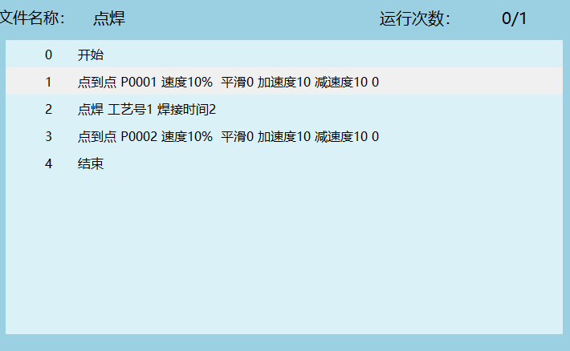

### 4.4.2 指令含义

- 第一行：机器人需要点焊的点位。
- 第二行：设置点焊的时间，根据指令参数设置点焊时间是两秒，机器人在P001点连续点焊两秒，在焊接的过程中送气，起弧信号端口由低电平0-高电平1，到达点焊时间后，焊接结束送气，起弧信号端口由高电平1-低电平0。
- 第三行：点焊完成后机器人移动到的安全点位。

## 4.5 摆焊参考点使用

### 4.5.1 参数设置

- 进入"**工艺/焊机设置**"，设置焊机控制方式-模拟焊机。
- 进入"**工艺/焊接IO**"，数字输入：起弧成功信号1-1，数字输出：起弧信号1-2，模拟输入DIN1-1，模拟输出NOUT1-1。
- 进入"**工艺/电流电压匹配**"，设置电流第一行焊接电流填【1】，实际焊接电流【10】；设置电压第一行焊接电压填【1】，实际焊接电压填【10】。
- 进入"**工艺/焊接参数设置**"，设置起弧参数：起弧电流【8】A起弧电压【8】V；焊接参数：焊接电流【10】A，焊接电压【10】V；收弧电流【7】A，收弧电压【7】。
- 进入"**工艺/焊接装备设置**"-基础功能：电弧检测时间【2】S，电弧检测确认时间【1】S，电弧耗尽检测时间【1】S。
- 进入"**工艺/手动操作**"，打开焊接使能开关。
- 插入一条REFP（摆焊参考点）指令，将当前位置设为摆焊参考点，MOVL轨迹与REFP（摆焊参考点）标定的点位组成摆焊平面，确定摆焊方向。如下图一所示A点到参考点1两点确定了摆焊方向，红色轨迹则是通过摆焊方向来进行摆焊的轨迹。摆焊平面：搭配摆焊开始指令使用，确定摆焊的坐标系。

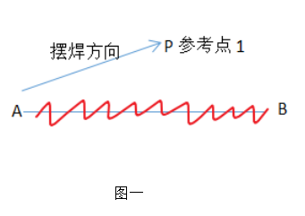

### 4.5.2 程序编写

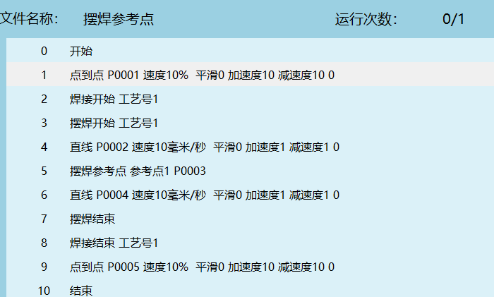

### 4.5.3 指令含义

- 第一行：焊接开始时的安全点。
- 第二行：开始焊接。
- 第三行：开始进行摆焊接。
- 第四-第六行：如上图一所示，A点(P0002)到参考点1两点确定了摆焊方向，P2-P4为摆焊的轨迹，摆焊的轨迹则是通过摆焊方向来进行摆焊的。
- 第七行：摆焊完成。
- 第八行：焊接完成。
- 第九行：焊接完成后机器人移动的安全点位。

## 4.6 外部轴定点摆焊

1. 连接外部轴后，在设置-机器人参数-从站配置界面，点击机器人看外部轴是否已经连接成功。
2. 外部轴连接成功后，在设置-外部轴参数界面标定外部轴和参数的设置。

### 4.6.1 参数设置

- 进入"**工艺/焊机设置**"，设置焊机控制方式-模拟焊机。
- 进入"**工艺/焊接IO**"，数字输入：起弧成功信号1-1，数字输出：起弧信号1-2，模拟输入焊接电流信号DIN1-1，焊接电压信号DIN1-2，模拟输出给定电流信号DOUT1-1，给定电压信号DOUT1-2。
- 进入"**工艺/电流电压匹配**"，设置电流第一行焊接电流填【1】，实际焊接电流【10】；设置电压第一行焊接电压填【1】，实际焊接电压填【10】。
- 进入"**工艺/焊接工艺/焊接参数设置**"，设置起弧参数：起弧电流【20】A起弧电压【10】起弧时间【1】焊接参数：焊接电流【50】A，焊接电压【20】V；收弧电流【28】A，收弧电压【15】V。
- 进入"**工艺/焊接装备设置**"-基础功能：电弧检测时间【2】S，电弧检测确认时间【1】S。
- 进入"**工艺/手动操作**"，打开焊接使能开关，打开手动起弧模式，设置手动点焊电流8A，点焊电压8V，最大时间2S。
- 进入"**工艺/焊接工艺/摆焊参数**"，设置参数，如下图所示：

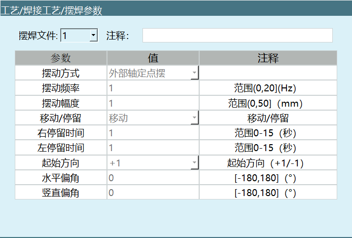

**定点摆焊的轨迹**：外部轴上标定两个点E1（外部轴旋转轴的起始点），E2（外部轴旋转轴的结束点）E1-E2确定了外部轴的转动方向，和实际焊接轨迹。圆上红色线段表示在外部轴上摆焊的轨迹。外部轴在转动的同时机器人进行定点摆焊，摆焊轨迹是下图红色曲线表示的部分。若E1-E2机器人位移方向与外部轴同向则轨迹如图所示，若机器人位移方向垂直于外部轴方向则摆动方向会旋转90°。

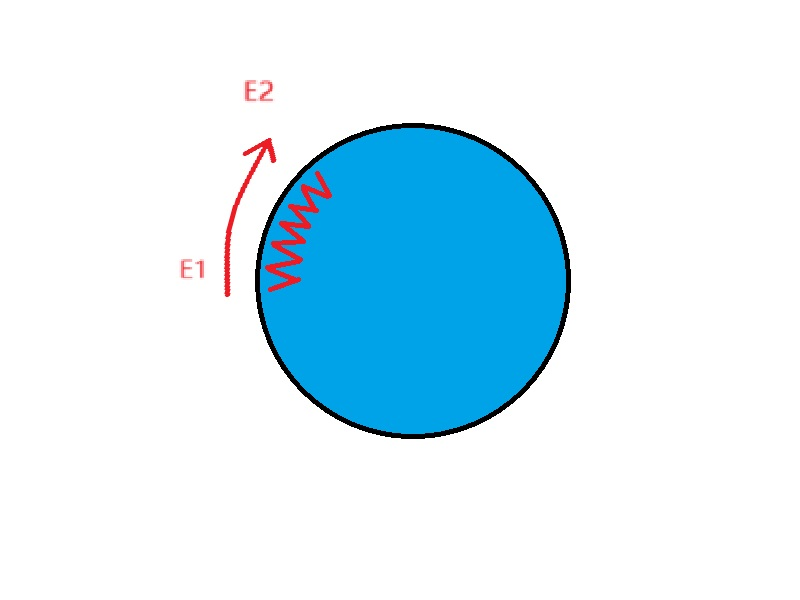

### 4.6.2 程序编写

### 4.6.3 指令含义

- 第一行：插入外部轴直线指令（外部轴和机器人都需要移动），确定机器人的坐标点位和外部轴点位，上图的E1点和A点。
- 第二行：开始执行焊接操作。
- 第三行：插入外部轴直线指令（外部轴和机器人都需要移动），确定机器人的坐标点位和外部轴点位，上图的E2点B点，插入第二条外部轴直线指令时，需要打开同步功能（打开同步功能后外部轴在旋转的同时机器人在外部轴上摆焊）。
- 第四行：完成焊接。

## 4.7 外部轴协同摆焊

1. 连接外部轴后，在设置-机器人参数-从站配置界面，点击机器人看外部轴是否已经连接成功。
2. 外部轴连接成功后，在设置-外部轴参数界面标定外部轴和参数的设置。

### 4.7.1 程序编写

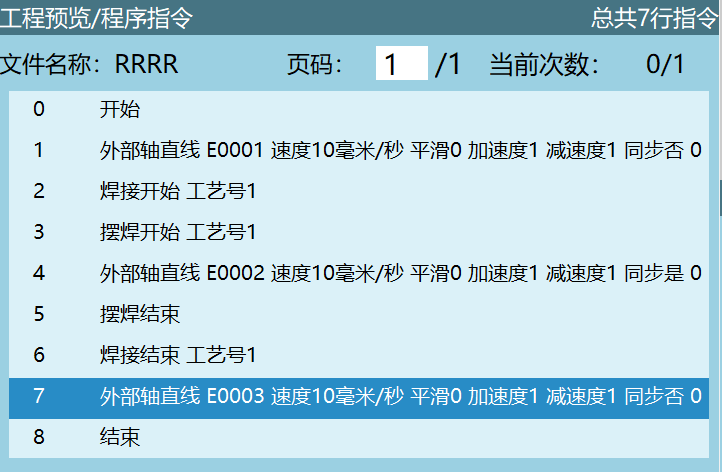

### 4.7.2 指令含义

- 第一行：插入外部轴直线指令（外部轴和机器人都需要移动），确定机器人的坐标点位和外部轴点位为焊接起始点。
- 第二行：开始执行焊接操作。
- 第三行：开始执行摆焊。
- 第四行：插入第二条外部轴直线指令时，需要打开同步功能（打开同步功能后外部轴在旋转的同时机器人在外部轴上摆焊）。
- 第五行：完成摆焊。
- 第六行：完成焊接。

## 4.8 焊接适配多机

操作界面如图所示，机器人1-4都要支持焊接工艺。

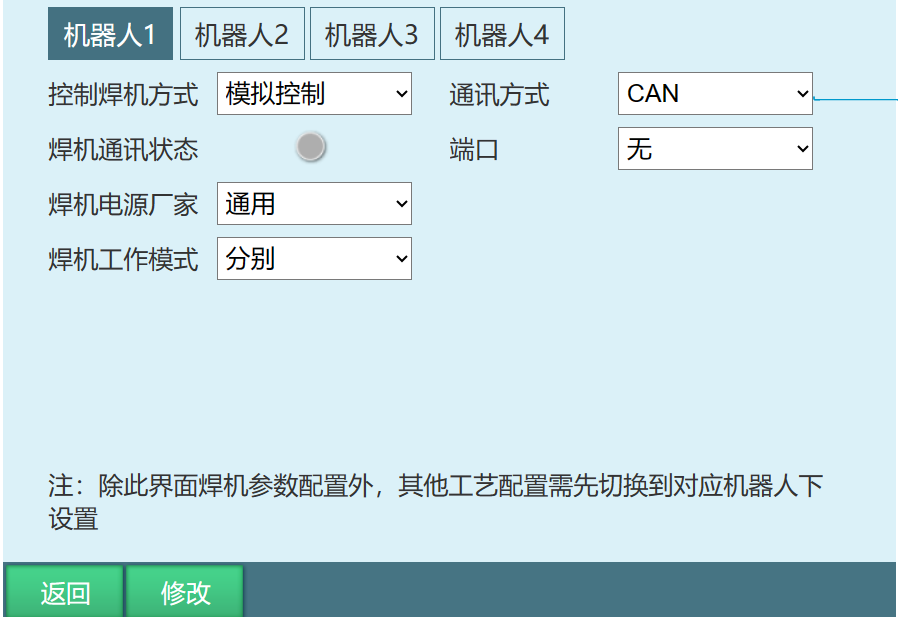

### 4.8.1 使用方法

1. 按实际需要添加机器人数目（例如四台机器人）。
2. 进入焊机设置界面设置焊机类型以及焊机各项参数（此界面只进行焊机的参数配置，其他焊接配置需切换到对应的机器人目录下进行设置）。
3. 按照机器人连接顺序，分别创建机器人1——机器人4对应的焊接程序以及设置对应的焊接参数。
4. 所有的机器人程序创建完毕后切到多机模式（切到运行模式后，点击上方机器人框，选择Robotall，如下图）。
5. 切换到多机模式后，点击启动，机器人1——机器人4同时运行焊接程序。

程序指令示例如图所示：

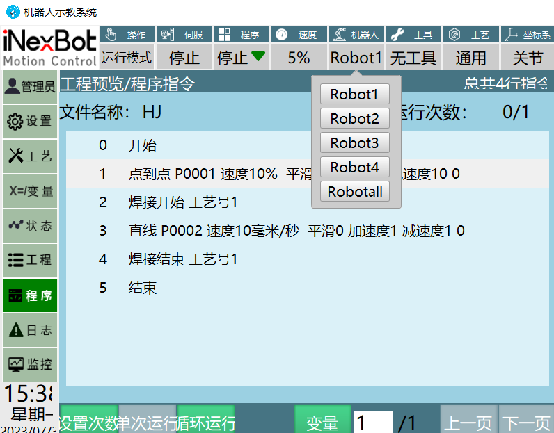

---

# 5 

提供与本文档相关的其他资源链接。

---

# 6 常见问题

## 6.1 焊机设置与通讯
Q1：焊机设置页面中，模拟控制和数字控制的主要区别是什么？
A：模拟控制通过 IO 模拟量控制焊机，适用于简单信号交互；数字控制通过总线通讯（如 CAN、ModBus RTU、EtherCAT、ModBus TCP）与焊机交换数据，可读写更多参数，支持焊机内置工艺。

Q2：选择 ModBus RTU 和 ModBus TCP 时需要分别填写哪些参数？
A：ModBus RTU 需要填写从站 ID、端口号、波特率；ModBus TCP 需要填写 IP 地址和端口号。

Q3：焊接通讯状态灰色和绿色分别代表什么？
A：灰色表示通讯失败，绿色表示通讯成功。

Q4：焊机电源厂家选项中，选择“瑞凌”时需要额外注意什么？
A：需要在【材料/丝径/气体】中填写参数，否则可能影响焊接效果。

Q5：焊机工作模式中的“一元化模式”和“分别模式”有什么区别？
A：一元化模式下，调节电流时电压会自动匹配给定值；分别模式下电流和电压需要独立调节。

## 6.2 焊接 IO 设置
Q6：起弧成功信号的作用是什么？如果超时会发生什么？
A：用于检测焊机是否成功起弧。执行焊接开始指令后，系统会在设定的电弧检测时间内等待该信号，超时则报“焊接起弧信号超时”错误。

Q7：电弧寻位中如何使用“寻位模式信号”和“寻位成功信号”？请简述接线及流程。
A：将 IO 输出端（如 1-5）接铁板，IO 输入端（如 1-6）接焊丝末端。执行电弧寻位时，打开输出口，焊丝接触铁板后输入信号由低变高，表示寻位成功。

Q8：数字输出中的“寻位模式”信号如何配合寻位成功信号工作？
A：寻位模式信号使焊机进入寻位状态，机器人运动过程中焊丝触碰工件时，焊机会触发寻位成功信号并回传。

Q9：模拟输入和模拟输出分别用于哪些信号？
A：模拟输入用于读取焊机实际电流和电压；模拟输出用于向焊机发送给定电流和电压。

## 6.3 电流电压匹配
Q10：模拟焊机模式下，为什么需要进行电流电压匹配？
A：因为控制器发送的模拟量值（如 0-10V）与焊机实际输出的电流（A）或电压（V）之间不是 1:1 关系，需要通过匹配建立比例系数。

Q11：请简述电流控制匹配的操作步骤。
A：① 在设置电压栏填入一个值，记录焊机显示的实际电流；② 填入多组数据（最多 8 行）；③ 点击测试并输入目标电流，系统自动计算匹配系数；④ 保存。

Q12：测试焊机电流的计算原理是什么？
A：系统根据“设置电压”与“焊机实际电流”的比例关系，计算出给定模拟量输出值。例如比例系数为 2，测试电流填 5A 时模拟输出为 2.5V。

Q13：模拟输出端口的上限和下限是多少？超限如何处理？
A：输出上限为 10（对应 10V），下限为 0。大于上限按上限执行，小于下限按下限执行。

## 6.4 焊接参数设置
Q14：起弧渐变和收弧渐变的作用是什么？请举例说明。
A：起弧渐变使电流/电压从起弧值平滑过渡到焊接值，避免突变。例如起弧电流 10A、焊接电流 15A、渐变时间 1s，则在 1 秒内线性上升。收弧渐变同理，从焊接值过渡到收弧值。

Q15：收弧时间设置过长或过短会有什么影响？
A：过长可能导致焊丝粘连工件或焊缝末端形成焊瘤；过短可能导致弧坑未填满，产生裂纹或凹陷。

Q16：工艺号的作用是什么？为什么需要 1-99 个不同的工艺号？
A：不同焊丝材料、直径、气体种类需要不同的焊接参数组合，工艺号用于快速调用预设参数，避免重复设置。

## 6.5 焊接装备设置
### 6.5.1 基础功能
Q17：电弧检测时间和电弧检测确认时间的区别是什么？
A：电弧检测时间是系统等待起弧成功的总时长；确认时间是在检测到起弧信号后需连续确认的时长，用于防抖。

Q18：延迟关气时间和提前关气时间分别用于什么场景？
A：延迟关气：焊接结束后延迟关闭保护气体，冷却焊丝和焊枪。提前关气：收弧前提前关闭气体，用于某些特殊工艺（如减少气体消耗）。

Q19：飞行起弧开启时，如果提前送气时间大于机器人从安全点到起弧点的运动时间，会发生什么？
A：机器人到达起弧点后会暂停运动，等待送气时间结束再起弧。

Q20：飞行起弧关闭时，提前送气从何时开始？
A：机器人到达焊接起始点后才开始送气，送气时间结束后起弧。

### 6.5.2 再启动/再起弧
Q21：自动再启动和半自动再启动的主要区别是什么？
A：自动再启动：断弧后系统自动尝试再起弧，程序继续运行。半自动再启动：断弧后程序暂停，需要操作员手动点击启动按钮。

Q22：再启动距离和再启动速度的作用是什么？
A：再启动距离决定了断弧后机器人回退的长度；再启动速度决定了回退的快慢。回退的目的是清除断弧处可能存在的焊瘤或飞溅，便于重新起弧。

Q23：再起弧次数达到上限后仍起弧失败，系统会怎样？
A：系统会停机并报错，需要人工干预。

### 6.5.3 防碰撞
Q24：触发防碰撞后，为什么需要“屏蔽防碰撞使能”功能？
A：碰撞后焊枪可能卡在工件中，无法直接移动。屏蔽使能可以在设定时间内忽略碰撞信号，允许操作员将焊枪移出危险位置。

Q25：屏蔽时间结束后如果碰撞信号依然存在，系统会如何处理？
A：系统会重新报错“焊枪防碰撞被触发”，需要再次屏蔽或手动处理。

### 6.5.4 微调整及其他
Q26：焊接电流单次调整量和焊接电压单次调整量的应用场景是什么？
A：在焊接过程中，操作员可以通过【微调整】界面实时增减电流或电压，每次步进量为设定值，无需修改底层参数。

Q27：焊接完成回抽功能和断弧回抽功能的目的分别是什么？
A：焊接完成回抽：防止焊丝与工件粘连，利于机器人移至下一点。断弧回抽：防止断弧后焊丝粘在工件上，便于重新起弧。

## 6.6 摆焊参数
Q28：摆焊的七种摆动方式分别是什么？各适用于什么场景？
A：正弦摆（常用）、Z字摆（坡口填充）、圆形摆（扩大熔宽）、外部轴定点摆（配合旋转轴）、L型摆（角焊缝）、三角摆（窄间隙）、8字摆（特殊熔池控制）。

Q29：摆动幅度和摆动频率的单位分别是什么？对焊缝有何影响？
A：幅度单位 mm，越大焊道越宽；频率单位 Hz，越快熔池搅拌越剧烈，但过快可能导致未熔合。

Q30：左右停留时间在 Z 字摆中起什么作用？
A：在摆动两端停留，增加两侧母材的熔深，防止咬边。

Q31：水平偏角和竖直偏角如何改变摆焊轨迹？
A：水平偏角使焊枪在平面内偏转，轨迹呈倾斜；竖直偏角使焊枪在垂直方向偏转，轨迹呈上下不对称形状。

## 6.7 焊接指令说明
Q32：ARCON 指令中的“使用临时工艺参数”与不使用有何区别？
A：使用时，本条指令的起弧/焊接/收弧参数覆盖工艺号中预设值，且仅对当前指令有效；不使用时，完全采用工艺号中的全局参数。

Q33：ARCSET 指令与 ARCON 指令中临时参数的关系是什么？
A：ARCSET 可以在焊接过程中动态改变电流电压，并支持渐变时间；而 ARCON 的临时参数仅在起弧初始阶段生效。

Q34：WVON 指令必须在什么指令之后执行？为什么？
A：必须在 ARCON 之后执行，因为摆焊需要先建立电弧，然后才能开始摆动。

Q35：使用鱼鳞焊指令 FSWELDON 时，选择“首尾段焊接优化空走距离”与“首段焊接”有何区别？
A：首尾段焊接优化空走距离：首尾两端固定为焊接，中间空走距离由系统自动优化；首段焊接：首段固定为焊接，其余段均为固定距离焊接+空走。

Q36：FEEDWIRE 指令的典型应用场景是什么？
A：在焊接开始前送丝以引出焊丝头，或在焊接结束后送一段丝便于下次起弧，也可配合剪丝机使用。

Q37：REFP 指令（摆焊参考点）如何确定摆焊方向？
A：通过两个参考点确定一条直线，摆焊轨迹的方向与该直线平行，从而建立摆焊的基准坐标系。

Q38：SPOTWELD 指令中的“焊接时间”与普通焊接的收弧时间有何区别？
A：点焊时间不包含移动，机器人在该点位静止焊接，时间结束后立刻灭弧；普通焊接的收弧时间是焊接结束后的渐变过渡时间。

## 6.8 多层多道焊
Q39：多层多道焊的工艺号范围及每个工艺号最多支持多少焊道？
A：工艺号 1-999，每个工艺号最多支持 99 个焊道。

Q40：头部缩进和尾部缩进的正负值分别代表什么方向？
A：头部缩进：正值向焊接反方向伸长（延长焊道起始点），负值向焊接方向缩进（缩短焊道）。尾部缩进：正值向焊接方向伸长，负值向反方向缩进。

Q41：头部倍数缩进使能和尾部倍数缩进使能的作用是什么？
A：打开后，实际缩进量 = 焊道编号 × 头部/尾部缩进值。例如第 3 道，头部缩进 2mm，实际缩进 6mm，适用于逐道递增的坡口填充。

Q42：推角和倾斜角的范围是多少？如何理解正负方向？
A：范围 -180°~+180°。推角：正值代表焊枪向焊接方向倾斜，负值相反。倾斜角：正值代表焊枪向右倾斜（从焊接方向看），负值向左倾斜。

Q43：焊接方向参数（+1/-1）如何影响左右偏移和倾斜角？
A：焊接方向改变时，左右偏移和倾斜角的正负定义会反向，但机器人实际运动方向始终由程序中的运动指令顺序决定。

Q44：使用多层多道焊时，若焊接过程中发生断弧导致机器人停止，正确的恢复步骤是什么？
A：先单步执行一次“多层多道焊结束”指令，清除偏移状态，然后重新从头运行程序。否则直接启动会导致点位偏移错误。

Q45：为什么多层多道焊开始与结束指令中间不能只有 1 个点或圆弧只有 2 个点？
A：因为多层多道焊需要在两个点位之间计算偏移向量，且必须包含完整的焊接轨迹（包含起弧和熄弧区），点数不足会导致偏移计算失败或轨迹异常。

Q46：多层多道焊圆弧轨迹偏移时，若三点不在同一平面，系统如何处理？
A：按球型轨迹偏移，即偏移方向沿球面法线，而不是平面偏移。

Q47：使用电弧跟踪配合多层多道焊时，对运动轨迹参数有什么强制要求？
A：电弧跟踪的运动轨迹参数（轨迹数量、起始点、结束点、速度、加速度、减速度、跟踪路径数据号）必须与多层多道焊指令中的参数完全一致。

## 6.9 常见问题与注意事项
Q48：焊接过程中出现“等待焊接起弧成功信号超时”错误，可能原因有哪些？
A：① 起弧信号线未正确连接；② 焊机未上电或通讯异常；③ 电弧检测时间设置过短；④ 气体未开通导致无法起弧。

Q49：为什么使用数字焊机时，电流电压匹配页面会隐藏？
A：数字焊机通过总线直接读写电流电压值，不需要模拟量匹配，因此匹配页面自动隐藏。

Q50：程序在运行模式下按 STOP 再按 START 后，为什么不再执行焊接？
A：按 STOP 后程序重头开始，但焊接使能状态可能被复位，需要重新确认“焊接使能”开关已打开。

Q51：手动操作界面中的“手动点焊”按钮，为什么设置最大时间？
A：防止操作员长时间按住造成过度焊接，超过最大时间后即使按住按钮也不会继续焊接。

Q52：防碰撞触发后，如果屏蔽使能未打开，能否消除报错？
A：不能。必须先解除碰撞物理状态，然后打开屏蔽使能将焊枪移开，或者直接手动移开（但可能触发二次报警）。

Q53：多层多道焊中，左右偏移和高低偏移的基准平面是什么？
A：以工具手垂直的面为基准，不是工件的实际平面。如果工具手不垂直于工件，需通过三角函数换算实际偏移量。

# 5. 版本历史

| 版本 | 日期 | 变更内容 | 作者 |
| :--- | :--- | :--- | :--- |
| 1.0.0 | YYYY-MM-DD | 初始版本 | iNexBot |
