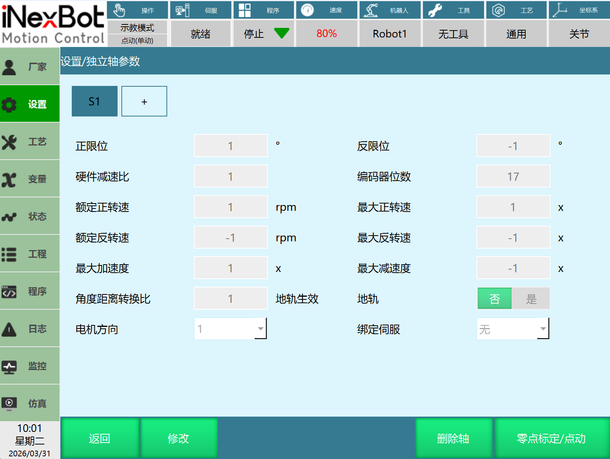
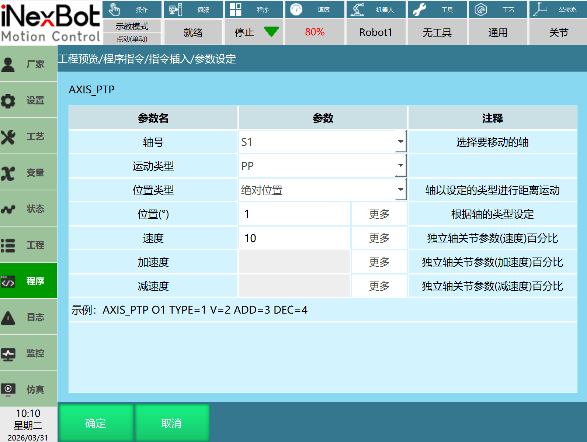
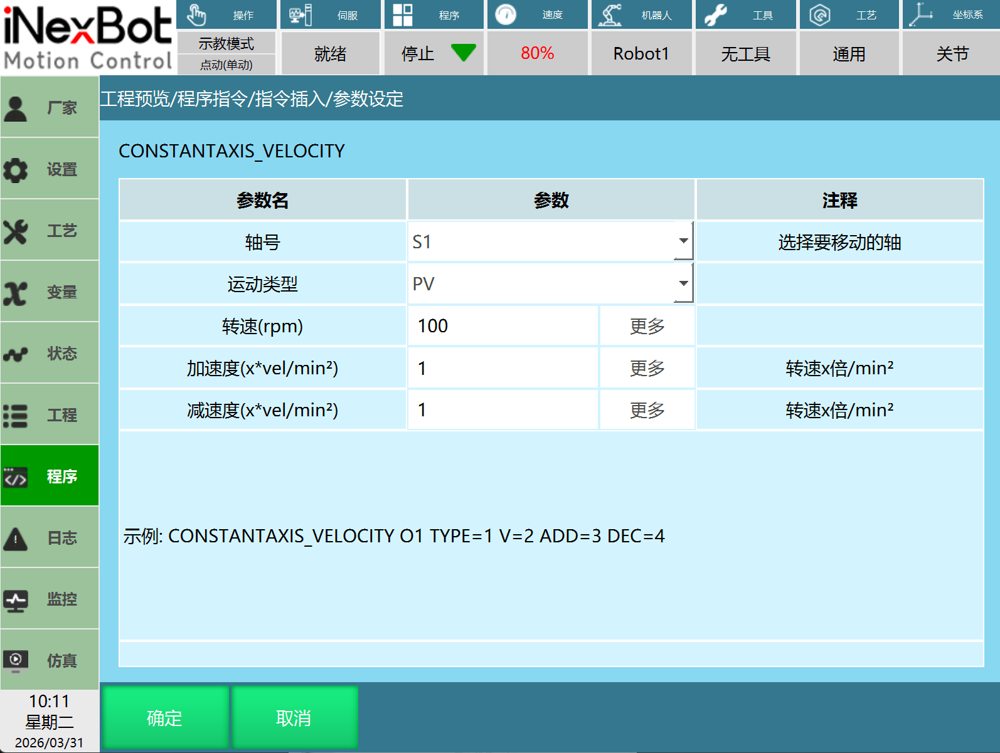
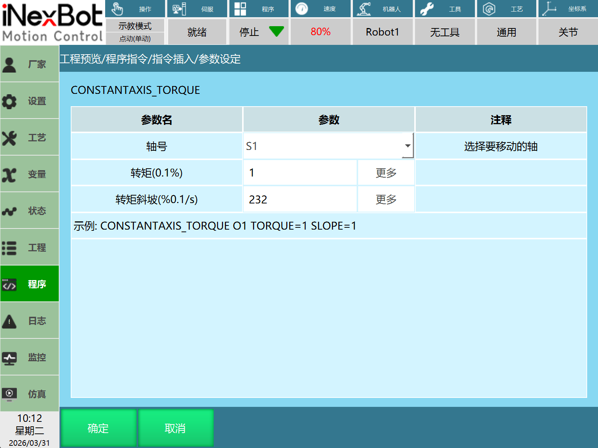
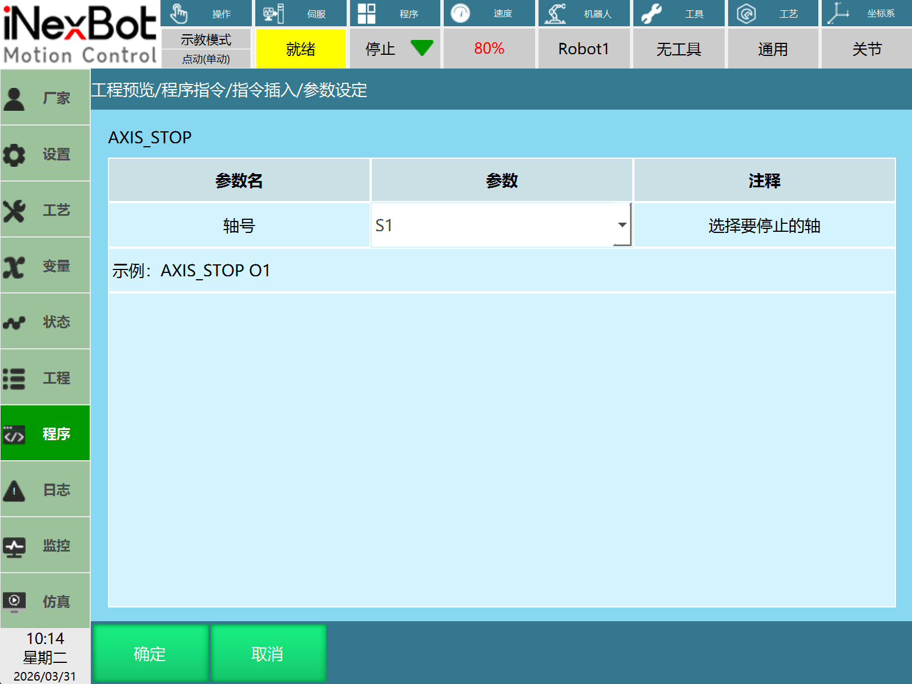
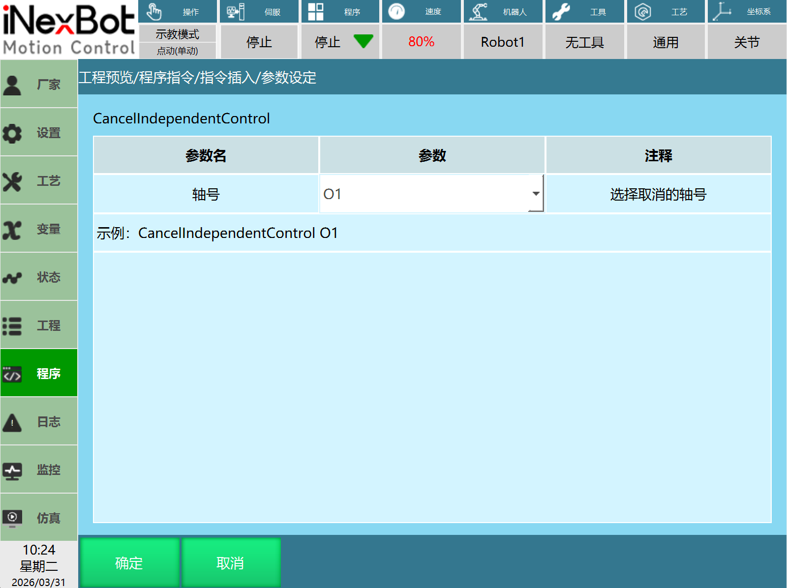
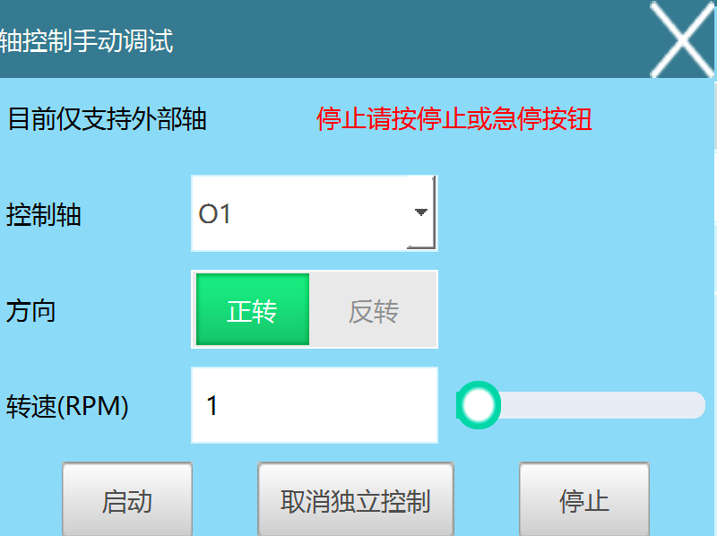

# 轴控制使用功能指南

## 注意事项

在使用轴控制功能前，请务必注意以下几点：

1. 使用前请检查伺服是否支持PP、CSP、PV、CSV、PT等模式。部分伺服手册虽然标明支持这些模式，但实际可能不支持。例如清能德创大部分伺服、久同驱控一体产品。

2. 如果现场使用的伺服这些模式的控制字是非常规的，需要重新适配，请详情查看对应伺服手册。

3. 部分伺服的控制字真唱，但是使用的单位不一致时，需要重新适配，请详情查看对应伺服手册。

4. 根据不同伺服的PP、CSP、PV、CSV、PT等模式说明配置eni参数，请详情查看对应伺服手册。

5. 以上配置注意事项确认后，仍无法正常运动，请确认伺服参数是否正确。

6. 轴控制运动无法试运行。


#### 注意事项：

1. 主程序中连续调用全局、局部程序时，中间需要添加延时。多线程开启时，不添加延迟存在没有开启这个线程中的轴运动，导致无法运行（外部轴在取消独立控制后首次运行的现象）。

2. 主程序调用局部程序，局部程序中在没有设置轴停止指令时，无法随着局部程序的结束而停止，建议按照正常轴指令使用流程使用。

3. 弹窗页面中的运动、标定页面中的点动与回零，一些保持运行的不会被对应的轴停止而停止，只有通过对应界面的停止方式而停止。


## 一、独立轴参数设置

打开设置——独立轴参数页面，设置独立轴关节参数：

1. 点击"+"按钮新建独立轴页面，配置关节参数（最多可以新建10个独立轴）。

2. 点击"修改"按钮可以修改独立轴关节参数。

3. 点击"删除轴"删除选中的当前独立轴。

4. 修改电机方向，可以改变独立轴运动方向。

5. 根据实际使用情况选择地轨，需要填写角度距离转换比，并且指令中位置单位从 ° 改为 mm。




## 二、轴控制指令详解

### 1. 轴点到点运动 (AXIS_PTP)

**支持类型：**外部轴（O1、O2）、独立轴（S1、S2）

**运动类型：** PP、CSP

**轮廓位置模式（PP）：** 控制器将目标位置、速度、加减速度发送给驱动器，驱动器内部完成位置控制、速度控制、转矩控制。

**周期同步位置模式（CSP）：** 控制器完成位置规划，将规划好的目标位置，周期性地发送给驱动器，驱动器内部完成位置控制、速度控制、转矩控制。

**位置类型：** 绝对位置、增量
- 绝对位置：运行到设置的位置处
- 增量：在当前位置以一定增量移动

**位置：** 位置设置的是距离或者角度，正负代表运动方向，根据轴的类型来决定，mm或者°。

**速度：** 速度、加减速度设置该轴的移动速度，填入数值的范围是1-100%关节参数里面设定（速度、加减速）的值；加减速度默认不使用，可以选择手填，可以选择整数型和浮点型等8种数字类型。

**阻塞特性：** 该指令为阻塞运动，运动完成后才会运行下面的指令。

**对应模式需要的PDO（以安驰为例）：**
- PP：6081 6083 6084
- CSP：607A



**使用案例：**
```
NOP
AXIS_PTP AxisNum = 1 RunType = 1 PositionType = 1 PositionValue = 1000 V = 30 AccSpeed = [-] DecSpeed = [-]  
AXIS_STOP 1
AXIS_PTP AxisNum = 1 RunType = 1 PositionType = 1 PositionValue = -1200 V = 30 AccSpeed = 50 DecSpeed = 30
AXIS_STOP 1
END
```

### 2. 轴恒转速 (CONSTANTAXIS_VELOCITY)

**支持类型：** 外部轴（O1、O2）、独立轴（S1、S2）

**运动类型：** PV、CSV

**轮廓速度模式（PV）：** 控制器将目标速度、加减速度发送给驱动器，速度、转矩调节由驱动器内部进行。

**周期同步速度模式（CSV）：** 控制器完成目标速度规划周期性发送给驱动器，速度、转矩调节由驱动器内部进行。

**转速：** 转速为该轴以设定的速度（电机转速）进行移动，正负代表运动方向，单位为rpm或mm/min。

**加减速度：** 加减速根据转速来计算，单位是转速×倍/min²；数值类型默认是不使用，选择手填时，可以选择整数型和浮点型等8种数字类型。

**阻塞特性：** 该指令为不阻塞运动，运动过程中可以执行下一条指令，直到下个指令运行。

**对应模式需要的PDO（以安驰为例）：**
- PV：60FF 6083 6084
- CSV：60FF



**使用案例：**
```
NOP
CONSTANTAXIS_VELOCITY AxisNum = 1 RunType = 2 V = -2900 AccSpeed = 10 DecSpeed = 10
TIMER T = 3
AXIS_STOP 1
CONSTANTAXIS_VELOCITY AxisNum = 1 RunType = 2 V = 1000 AccSpeed = 10 DecSpeed = 10
TIMER T = 3
AXIS_STOP 1
END
```

### 3. 轴恒转矩 (CONSTANTAXIS_TORQUE)

**支持类型：** 外部轴（O1、O2）、独立轴（S1、S2）

**运动类型：** PT

**轮廓转矩模式（PT）：** 控制器将目标转矩、转矩斜坡值发送给驱动器，转矩调节由驱动器内部执行。

**转矩：** 转矩的值设定为该轴额定转矩的百分比，正负代表运动方向。

**转矩斜坡：** 转矩斜坡是转矩的加减速，单位是%0.1/s，转矩斜坡填写较小时，启动会比较慢。

**阻塞特性：** 该指令为不阻塞运动，运动过程中可以执行下一条指令，直到下个指令运行。

**对应模式需要的PDO（以安驰为例）：**
- PT：6071



**使用案例：**
```
NOP
CONSTANTAXIS_TORQUE 2 1000 232
TIMER T = 3
AXIS_STOP 2
CONSTANTAXIS_TORQUE 2 -1000 232
TIMER T = 3
AXIS_STOP 2
END
```

### 4. 轴停止 (AXIS_STOP)

**支持类型：** 外部轴（O1、O2）、独立轴（S1、S2）

**轴号：** 选择需要停止的对应轴号，可以停止运行中的轴号。

**注意事项：**
- 轴控制运动指令运行后需要添加轴停止指令，运行轴停止指令后再运行其他的轴控制指令。

**可能存在的问题：**
1. 轴控制运动指令后没有添加轴停止指令，可能导致下一条轴控制指令运动方向、运动速度错误。
2. 轴停止指令没有添加在轴控制运动指令后，可能导致运动的独立轴无法正常停止。



**使用案例：**
```
NOP
CONSTANTAXIS_TORQUE 2 1000 232
TIMER T = 3
AXIS_STOP 2
END
```

```
NOP
AXIS_PTP AxisNum = 1 RunType = 1 PositionType = 1 PositionValue = 1000 V = 30 AccSpeed = [-] DecSpeed = [-]  
AXIS_STOP 1
END
```

### 5. 取消独立控制 (CancelIndependentControl)

**支持类型：** 外部轴（O1、O2）

**轴号：** 选择需要取消的轴号，可以重新绑回已经解绑的轴，外部轴可以使用。

**注意事项：**
- 需要将解绑的轴重新绑定，运行取消独立控制指令即可。
- 轴在运行过程中，执行取消独立控制，无法将解绑的轴重新绑定，需要确保解绑轴的是否在运动。

**可能存在的问题：**
1. 解绑后的外部轴，无法进行点动，需要重新绑定回来，才可以进行点动操作。
2. 没有运行取消独立控制指令，将解绑的轴重新绑定，则无法修改关节参数、伺服映射。
3. 取消独立控制指令可以将解绑的轴重新绑定回来，如果在取消独立控制指令下面还存在运动控制指令，会提示伺服状态不一致，作业文件启动失败的报错。作业文件运行时、运动控制基础指令会进行伺服状态检测，轴控制运动指令不检测伺服状态。



**使用案例：**
```
NOP
CONSTANTAXIS_VELOCITY AxisNum = 1 RunType = 3 V = -50 AccSpeed = 10 DecSpeed = 10
TIMER T = 3
AXIS_STOP 1
CANCEL_INDEPENDENT_CONTROL 1
END
```

## 三、轴独立控制窗口

打开设置——操作参数，打开显示轴控制界面，工艺弹窗中显示"轴独立控制"。

轴独立控制窗口支持模式：PV。

**控制轴：** 选择需要运动/停止的轴，目前支持外部轴。

**方向：** 运动时的方向。

**转速：** 设置运动时的转速。

**启动：** 点击启动，运行轴运动（轴恒转速pv）。

**停止：** 点击停止，停止正在运行的轴（轴停止）。

**取消独立控制：** 将选择的控制轴重新绑定回来（取消独立控制）。



