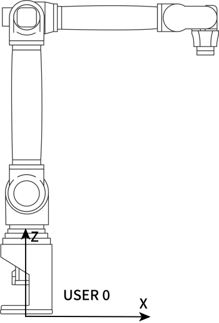
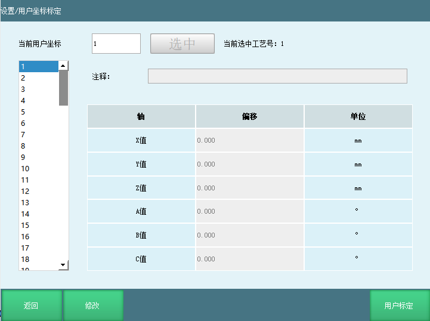
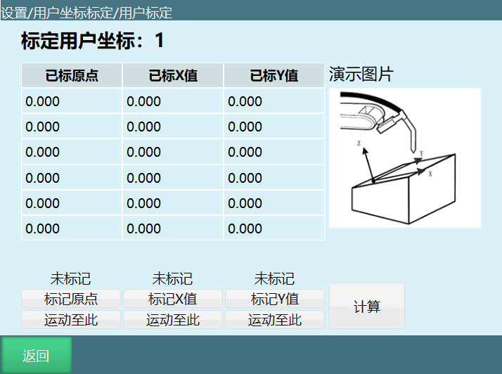

# 用户坐标系

默认的用户坐标系User0和直角坐标系重合。新的用户坐标系都是基于默认的用户坐标系变化得到的。

思考：我们知道用户坐标系是运动中的一个参考对象，但是它在实际调试过程中，又起到了什么作用呢？

推测：从图中可以看出，如果使用默认的用户坐标系User 0
或者直角坐标系将很难对每个工件位置进行调试，但如果存在某个坐标系的两个方向正好平行于工作台面的话，那就方便多了。

## 用户坐标系的作用

1.  确定参考坐标系。

2.  确定工作台上的运动方向，方便调试。

### 用户坐标系特点

新的用户坐标系是根据默认的用户坐标系User 0
变化得到的，新的用户坐标系的位置和姿态相对空间是不变化的。

### 用户坐标参数

点击设置-用户坐标标定，进入用户坐标标定界面，如下图：

用户坐标的参数：

| 轴 | 偏移 | 单位 |
| :--- | :--- | :--- |
| X | 用户坐标原点相对机器人基座原点X轴方向的偏移 | 毫米(mm) |
| Y | 用户坐标原点相对机器人基座原点Y轴方向的偏移 | 毫米(mm) |
| Z | 用户坐标原点相对机器人基座原点Z轴方向的偏移 | 毫米(mm) |
| A | 用户坐标系相对直角坐标系绕X轴方向的旋转角 | 度/弧度(°/rad) |
| B | 用户坐标系相对直角坐标系绕Y轴方向的旋转角 | 度/弧度(°/rad) |
| C | 用户坐标系相对直角坐标系绕Z轴方向的旋转角 | 度/弧度(°/rad) |

### 用户坐标系标定

点击"用户坐标标定"界面底部的【用户标定】按钮，进入"用户标定"界面，如图：

标定步骤：

1.  将机器人末梢移动到期望的用户坐标系原点的位置，点击"标定原点"按钮。

2.  将机器人相对于用户坐标系原点向期望的用户坐标系X轴正方向的位置移动任意距离，点击"标定X轴"按钮。

3.  将机器人相对于用户坐标系原点向期望的用户坐标系Y轴正方向的位置移动任意距离，点击"标定Y轴"按钮。

【计算】三个点标定结束后，点击计算，提示计算成功后，用户坐标标定完成。

【返回】返回到上一个界面。

【修改】修改标定后的点位，修改结束后点击【保存】，然后点击计算，用户坐标被修改。

# QA

| 问题 | 回答 |
| :--- | :--- |
| 什么是用户坐标系？ | 用户坐标系是基于默认用户坐标系User0变化得到的坐标系，用于确定参考坐标系和工作台上的运动方向，方便调试。 |
| 用户坐标系的作用是什么？ | 1. 确定参考坐标系；2. 确定工作台上的运动方向，方便调试。 |
| 用户坐标系的特点是什么？ | 新的用户坐标系是根据默认的用户坐标系User0变化得到的，其位置和姿态相对空间是不变化的。 |
| 用户坐标系标定的步骤是什么？ | 1. 将机器人末梢移动到期望的用户坐标系原点位置，点击"标定原点"按钮；2. 将机器人向期望的用户坐标系X轴正方向移动任意距离，点击"标定X轴"按钮；3. 将机器人向期望的用户坐标系Y轴正方向移动任意距离，点击"标定Y轴"按钮；最后点击计算。
