# 码垛工艺

## 工艺介绍

机器人码垛主要应用于食品、饮料、物流等产业，也是工业机器人应用的典型事例，配以不同抓手，可实现在不同行业各种形状的成品进行装箱和码垛。码垛的意义在于将成堆的物品通过一定的模式码成垛，使得物品能够容易的搬运、卸载以及存储。

传统码垛由人工完成，该码垛方式的人力成本高，生产效率低，已无法适应当今生产的自动化要求。

为了提高搬运效率与码垛质量、节约劳动成本、保证企业员工的人身安全，生产中将会更多的去应用码垛机器人。

## 简易码垛/完整码垛

进入工艺/码垛工艺/码垛参数，支持99个工艺号参数，可以选择简易码垛和完整码垛，如下图所示。

清空参数: 清空的是当前选中的工艺号，完整码垛/简易码垛的参数。

复制参数:
当前选中的工艺号，完整码垛/简易码垛的参数可以复制到你想要复制的工艺号里面。

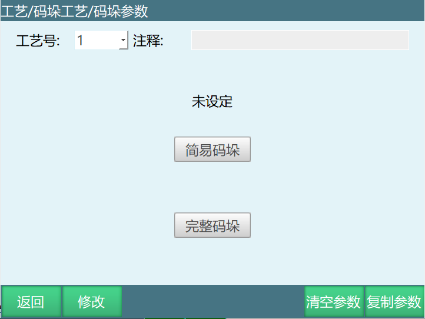

注：简易码垛工艺号最好不要和完整码垛的工艺号选择同样的工艺号，如果简易码垛的工艺号为1设置好参数后，将工艺号1换成完整码垛，就要重新设置完整码垛的参数，选择不同的工艺号可以节省时间，避免程序运行时出错。

### 完整码垛

#### 参数设置

完整码垛按流程可以进行抓手设置、托盘设置、工件参数、接近参数、重叠模式、位置设置、平面模式，如下图所示：

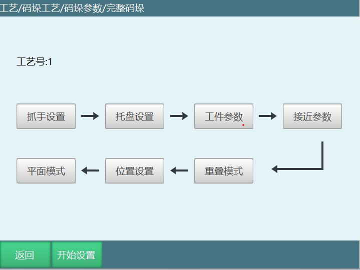

#### 抓手设置

抓手设置就是设置码垛过程中用到的工具手。

两个吸盘分别取料（一个吸盘吸完后再切换到另一个吸盘取料），那么要设置成两个抓手；

两个吸盘同时取料，则设置成一个抓手；

如果两个吸盘分别放料（一个吸盘放完后切换到另一个吸盘放料），此时需要设置两个抓手；

两个吸盘同时放料，则设置成一个抓手。

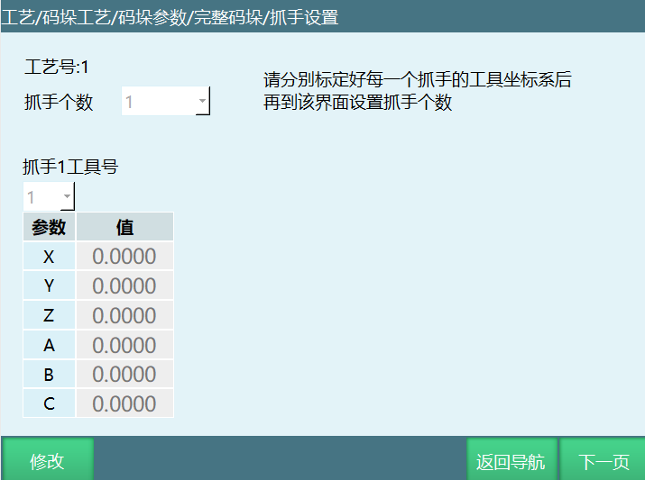

注：请提前到【设置-工具手标定】界面中标定抓手（工具手），再在此界面设置抓手。

术语释义：

抓手个数：抓手的个数，根据实际情况设置，最多可设置4个抓手。

抓手X工具号：设置抓手所对应的工具手号（X在图中值为1），工具手参数需提前标定。

参数值**：**工具手标定界面标定完成工具坐标后，在此界面选中标定好的工具手号后每个轴的参数值。

#### 托盘设置

托盘的设置就是设置托盘用户坐标的工程，在本界面需标定好托盘的原点、托盘的Y方向和托盘的X方向。

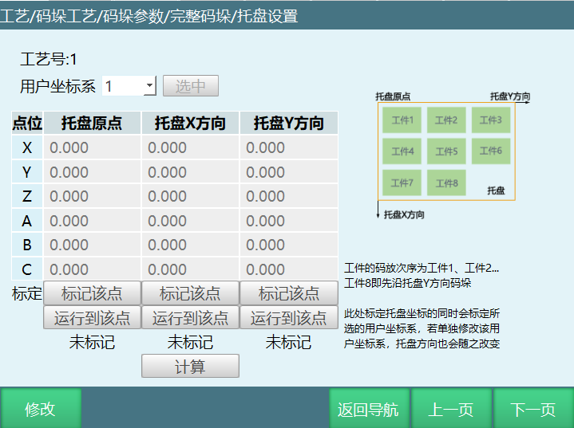

用户坐标系：托盘坐标，根据需要选择要标定的用户坐标，标定托盘坐标（用户坐标），若之后在用户坐标标定中更改坐标系位置，此处坐标系也会跟着改变.

注:
请使用抓手1所选的工具手进行标定，当不标定用户坐标（托盘坐标）时，用户坐标参数值为0时，同直角坐标系一致。

标记X方向与Y方向时一定要以机器人原X、Y方向为基础，否则标记出的托盘Z方向会向下，码垛时第二层会向下码！

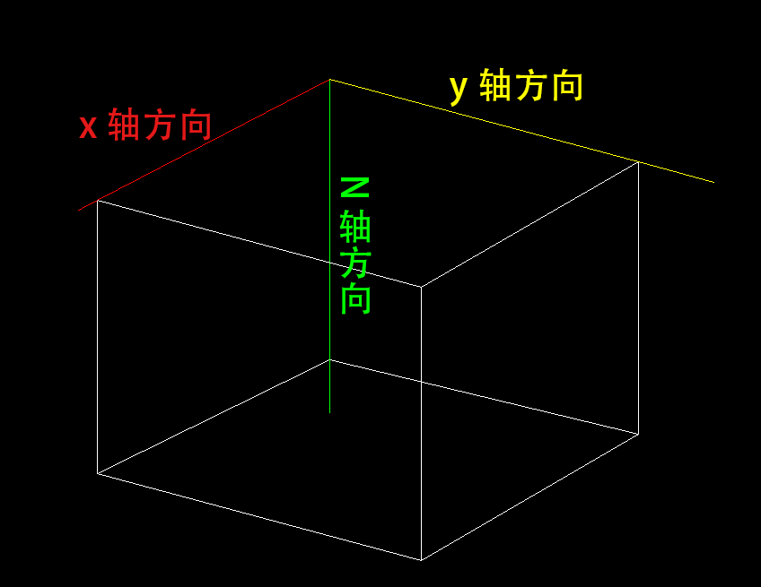

#### 工件参数

工件参数可以设置所码工件在用户坐标下的长宽高和间隙；

长宽高分别为其在托盘坐标系（用户坐标系）下的YXZ方向的长度，如下图所示：

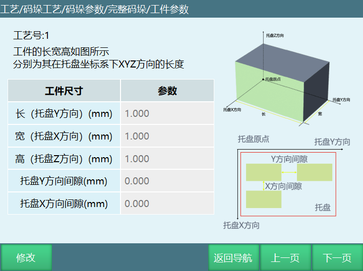

工件尺寸参数说明：

长：工件在托盘坐标系下Y方向的长度。

宽：工件在托盘坐标系下X方向的长度。

高：工件在托盘坐标系下Z方向的长度。

托盘Y方向间隙：在托盘坐标系下Y轴方向，两个工件之间缝隙距离的长度。

托盘X方向间隙：在托盘坐标系下X轴方向，两个工件之间缝隙距离的长度。

#### 接近参数

**使用场景**

将工件以设定的角度速度放入工件点，适用于部分大包装并且放置位置比较紧密的场景，且此功能支持任意垛型每个单独工件都可设置进入离开速度以及接近方式。

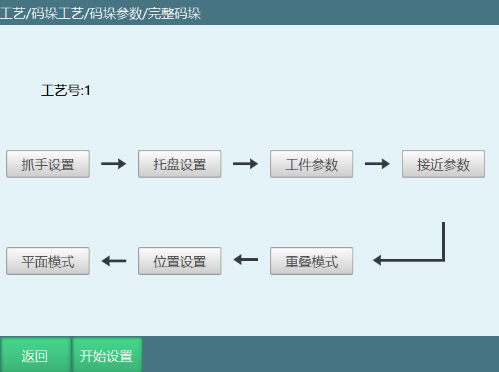

相对 22.07版本 流程中多了一个接近参数。

参数说明：接近方式分为下降接近和接近下降，以及XYZ方向的偏移距离。

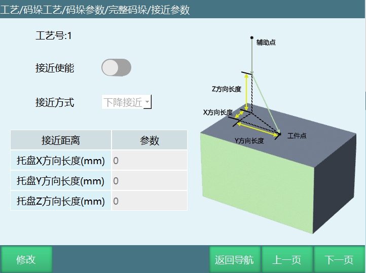

**接近使能**

需要打开才能使用码垛接近功能，如果打开了使能按钮但是没有设置接近距离那么接近使能也不会生效。

**接近方式**

下降接近：机器人先到辅助点然后根据偏移的距离运动到接近点，然后再运动至工件点。

接近下降：机器人先到辅助点然后根据偏移的距离运动到接近点，从接近点运动至工件点上方再运动至工件点。

运行轨迹参考上方图示

**接近距离**

分为XYZ方向，根据图示，具体接近点为为工件点根据XYZ方向数值偏移，但是如果选择了接近方向，例如选择了上方的接近方向，那么已接近方向为准，没有选择方向优先计算Z值然后偏移。

**接近方向：**有八个方向

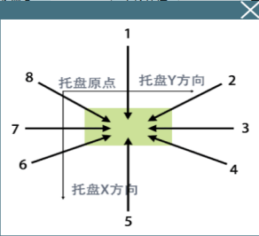

在接近说明按钮中可查看

**平面模式**

在码垛平面模式中的自定义垛型中添加了可设置单独工件的进入离开速度，不填默认走接近点指令速度，根据指令的插补方式不同速度也不同，如果插补方式为关节那么速度小于100就是对应的值，大于100则为100，加减速默认为等于速度；如果是直线则填多少就是多少（负数除外）不能大于笛卡尔参数加减速默认为速度的百分之10。

**接近速度：**运行到接近点的速度

**离开速度：**从工件点往接近点运行的速度

同时也可以设置单独或整体的接近方向。

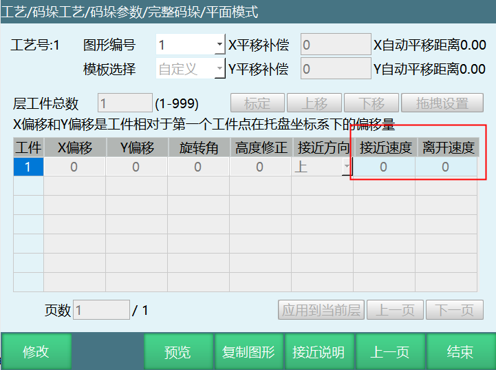

**应用到当前层**

将选中的工件的接近方向进入离开速度设置为整层的所有工件的参数。

**位置调试**

在位置调试中也可以设置单独工件的离开进入速度以及接近方向。

**抓手**：位置调试界面增加抓手选择项，如图。操作步骤：工艺→码垛工艺→位置调试，可通过修改不同抓手来适配不同的码垛位置。

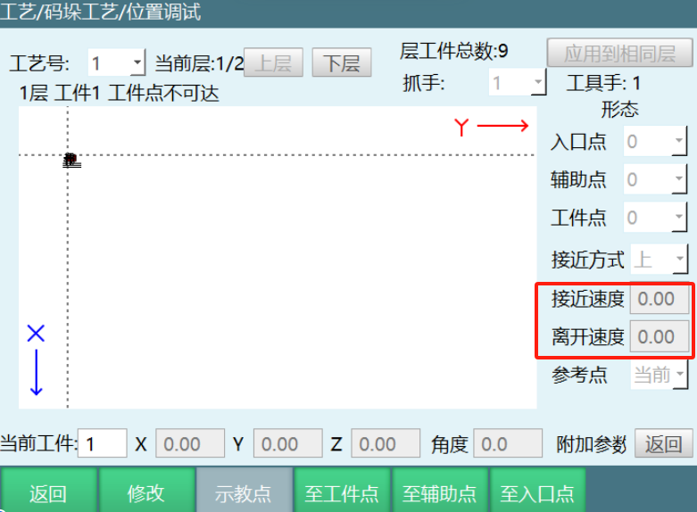

**码垛接近点**

新增指令码垛接近点，就是辅助点和工件点之间的过渡点，也就是接近方式要走到的点位。

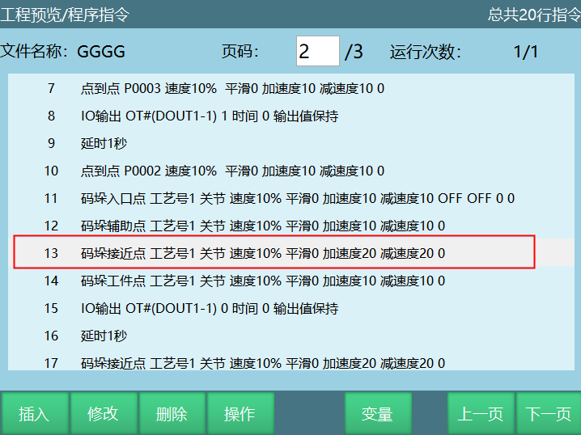

参数设置同码垛其他点位。

#### 重叠模式

重叠模式可以设置码垛的垛层和图形模板选择、及其他相关参数，如下图所示：

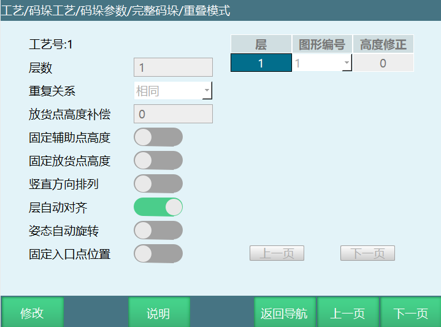

术语释义：

层数：码垛的总层数，根据实际需要填写。

重复关系：每层之间的重复关系。

选择相同：则每一层都使用相同的图形模板。

选择交替：则每两层的图形模板交替。

选择自定义：则需用户自己选择每一层使用的图形模板。

相同：每一层图形模板都相同，码垛为同一个图形模板，选择该选项时，右侧列表仅第一层可修改，修改后下面所有层均随之改变。下图是层数选择为6层，重复关系选择相同。

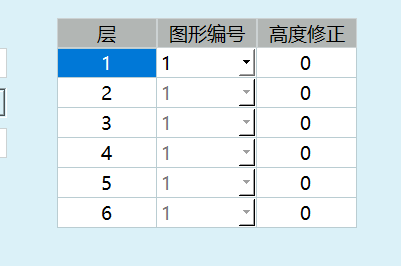

交替：两种图形模板交替使用，选择该项后，右侧列表仅前两层可修改，修改后下面所有层均重复该两层的图形编号。下图是层数选择为6层，重复关系选择交替。

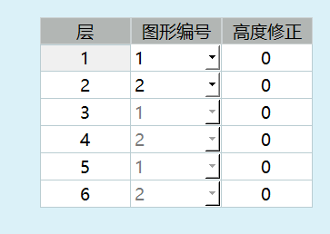

自定义：每层图形模板都可单独设置。下图是层数选择为6层，重复关系选择自定义，如下图：

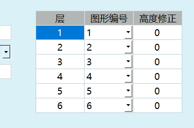

重复：重复关系使用自定义且层数较多时，若所有层均重复前N层的图形模板，则在填写好前N层的图形模板后，选中第N+1层，点击该按钮，以下各层自动重复(只能在第一页使用该功能)，图示见下方。

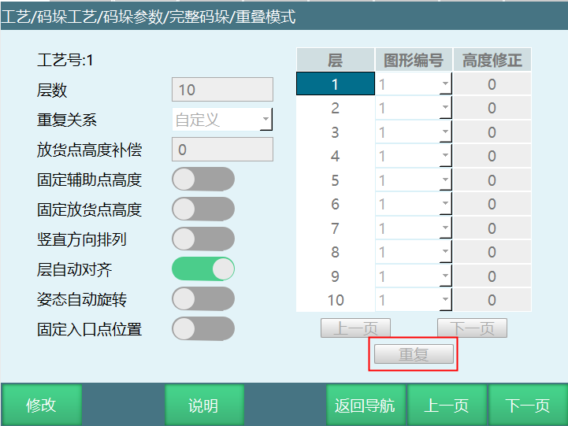

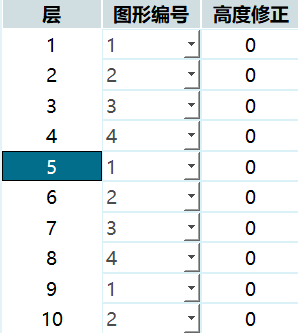

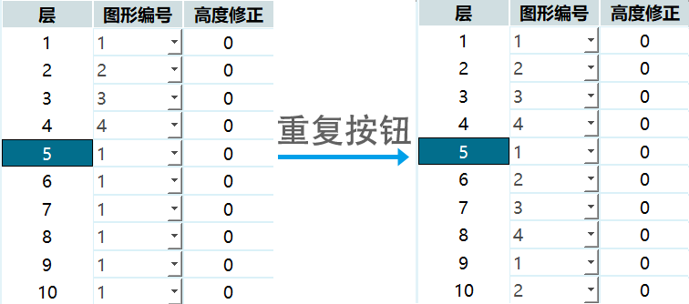

固定辅助点高度：如果码垛的层数为两层时，打开此按钮，第一层工件与第二层工件的辅助点是同一个点位，不会再运行第二层的工件时辅助点向Z+方向偏移。

例如：在一个四周封闭的盒子里需要码垛工件，如果码垛的工件比较多的话，每码一个工件设置的工件辅助点随着码垛工件个数的增加辅助点会越来越高，很可能会超过机器人关节参数的限位，为了防止出现这类错误，我们就可以打开固定辅助点高度按钮，设置好固定辅助点高度位置，这样的话随着码垛工件个数的增加，辅助点高度一直是同样的位置，就不会出现关节参数超限的情况，也能保证操作人员的安全。

放货点高度补偿：填入后，所有工件的放货点的高度将偏移，偏移的高度自己可以根据实际需要填写。数值为正则向Z+方向偏移，数值为负则向Z-方向偏移（卸垛时此参数无效，只有程序运行时才能看到高度补偿效果）。

固定放货点高度：选中后，码每一层的时候放货点的高度都相同,高度为标记的工件点高度（仅在码垛时有效），如果码垛的层数大于一层时（以两层为例），打开此按钮，每一层每个工件的工件点都是同一高度，不会在码垛第二层时工件点的高度向Z+方向偏移。

竖直方向排列：选中竖直方向排列后，将先码完竖直方向的一列后再码下一个竖直列。

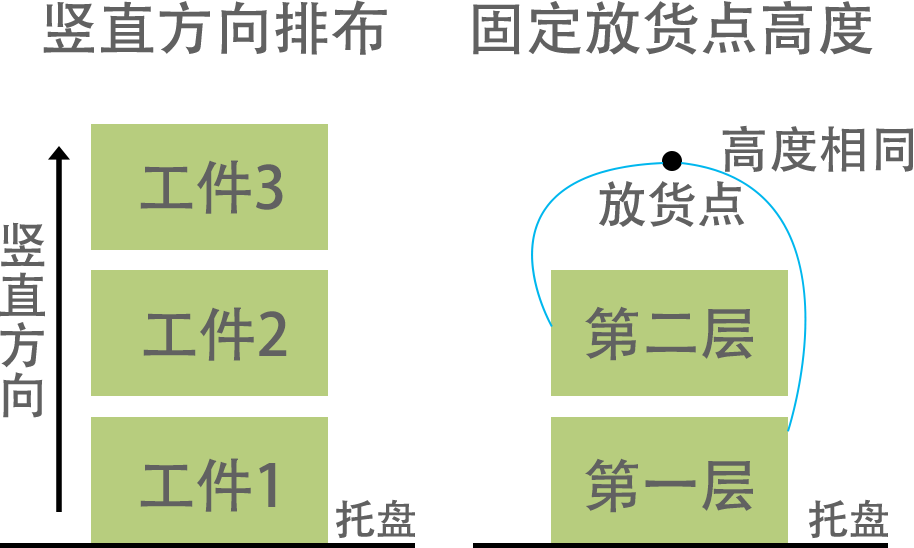

层自动对齐：选中层自动对齐则将每层模板自动对齐，将自动计算X轴，Y轴偏移量。

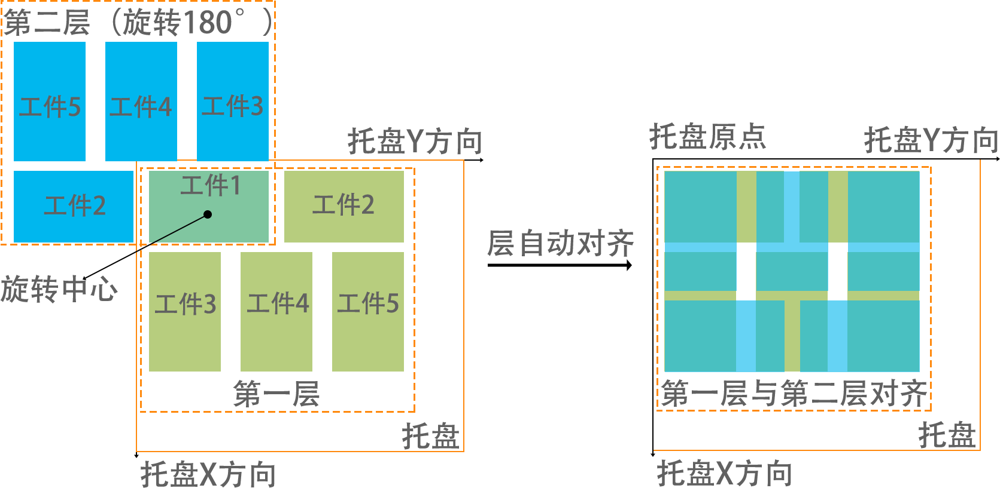

姿态自动旋转：选中后当码垛时工具手以一个固有姿态无法达到辅助点和放料点，但旋转一下工具手的姿态即可达到时，会自动旋转。该功能仅在辅助点和工件点都使用关节插补时有效。

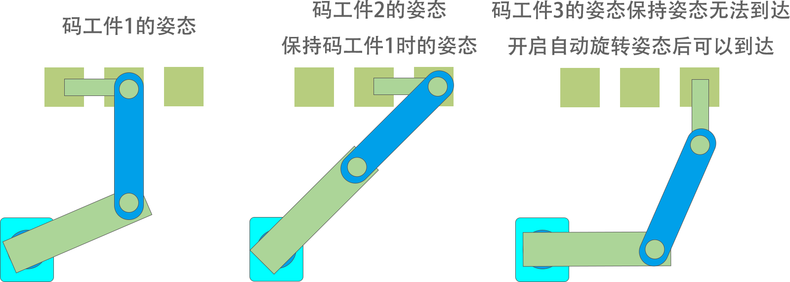

固定入口点位置：取料后每码一个工件都会在同一个入口点，在进入入口点过程中会优化Z轴。

位置设置：可以设置码垛工件点、辅助点、入口点，请带抓手设置所选的工具手进行位置标记。

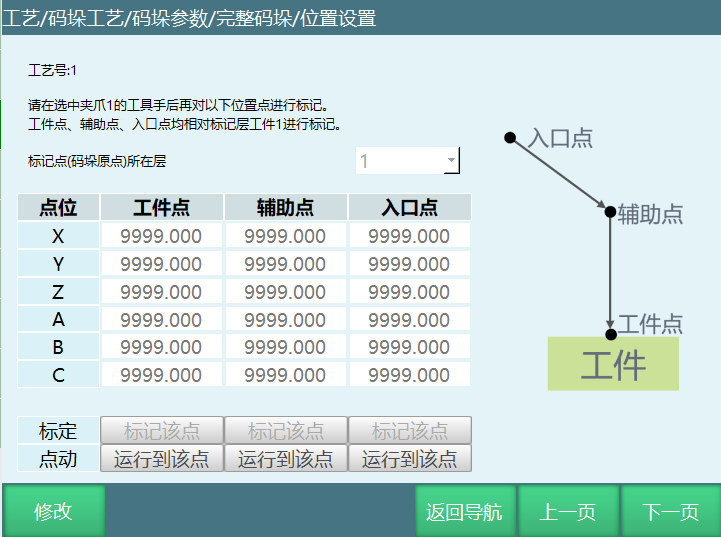

标记层编号：当前标定工件点位于第几层，省去清除垛堆过程，可以直接选择标记当前层。

工件点：该标记层第一个取料点或最后一个放料点（注：码垛参数设置界面的工件顺序都是按照码垛排序的，卸垛则顺序相反）。

辅助点：与工件点配合使用，使工件可以更安全的摆放到工件点，一般设置在工件点的上方，如果工件需要旋转角度，则会在到达辅助点之前旋转，该点会跟随工件的摆放位置而进行自动偏移。

入口点：托盘的入口点，为防止机器人与其他物体碰撞，尽量把机器人的安全位置设置为入口点，该点会跟随工件的摆放位置而在Z轴方向进行自动偏移。码垛入口点指令打开XYZ优化，运行到入口点时ABC轴坐标发生了变化。

标记该点：机器人先移动到位置，再点标记该点。

运行到该点：标记的值点击保存后才能移动到标记的点，不保存时，移动到的点为之前标记的点，若要移动到该点，需按下DEADMAN按键后点击该按钮（注：请带抓手设置所选的工具手进行位置标记）。

#### 平面模式

该模式设置码垛的图形模板：

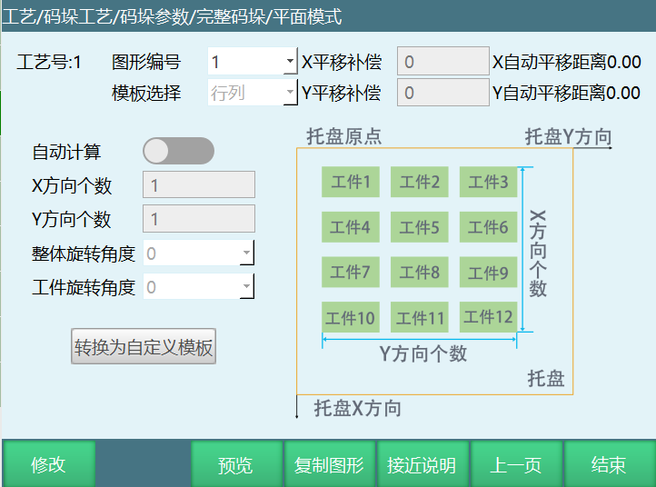

图形编号：图形模板的编号。

**模板选择**：分为4种固定图形模板和自定义图形模板，分别是行列、纵横交错、回字形、五花垛，自定义。

**X平移补偿**：整体图形模板相对于原码垛位置在托盘坐标系X轴上的偏移量。

**Y平移补偿**：整体图形模板相对于原码垛位置在托盘坐标系Y轴上的偏移量。

**自动计算**：根据托盘设置界面，标定出来的用户坐标系生成一个长方形托盘，根据工件大小自动计算X方向可以放多少个工件，Y方向可以放多少个工件。

**X方向个数**（行列模板、纵横交错模板）：工件在X方向上的个数（纵横交错的X方向上的个数为工件长边在X轴上的个数）。

**Y方向个数**（行列模板、纵横交错模板）：工件在Y方向上的个数（纵横交错的Y方向上的个数为工件长边在Y轴上的个数）。

**整体旋转角度**（行列模板、纵横交错模板、回字形模板）：整体绕第一个工件点顺时针旋转的角度。可以旋转0°，90°，180°，-90°

**（整体旋转角度0度） （整体旋转角度90度）**

**（整体旋转角度180度） （整体旋转角度-90度）**

工件旋转角度（行列模板、纵横交错模板、回字形模板，五花垛模板）：图形模板所有工件都绕顺时针旋转的角度，可以旋转0°，90°，180°，-90°。

**预览**：预览设置的图形模板，可用于检查图形模板是否设置正确，此处模板选择纵横交错模板,X方向工件个数是3，Y方向个数是3。

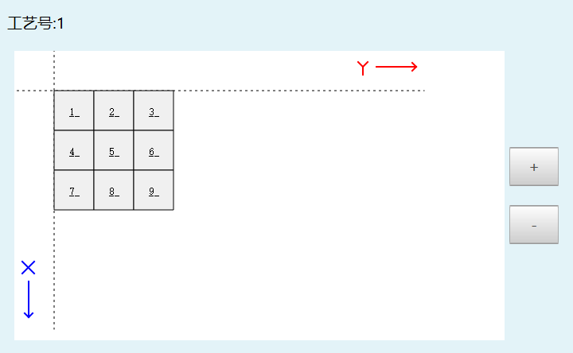

**行列**：整层图形模板的工件方向一致，依次码放，下图所示为X方向工件个数是4，Y方向个数是3。

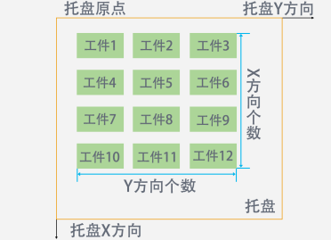

**纵横交错**：工件方向有横向的、竖向的，交错排列（该模板的X方向个数为工件长在X轴的个数，Y方向个数为工件长在Y轴的个数）。

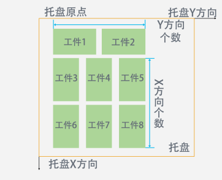

**回字形**：工件一层4个，成回字形排列（第二个工件较第一个工件顺时针旋转90度，第三个工件较第一个工件顺时针旋转180度，第四个工件较第一个工件逆时针旋转90度）。

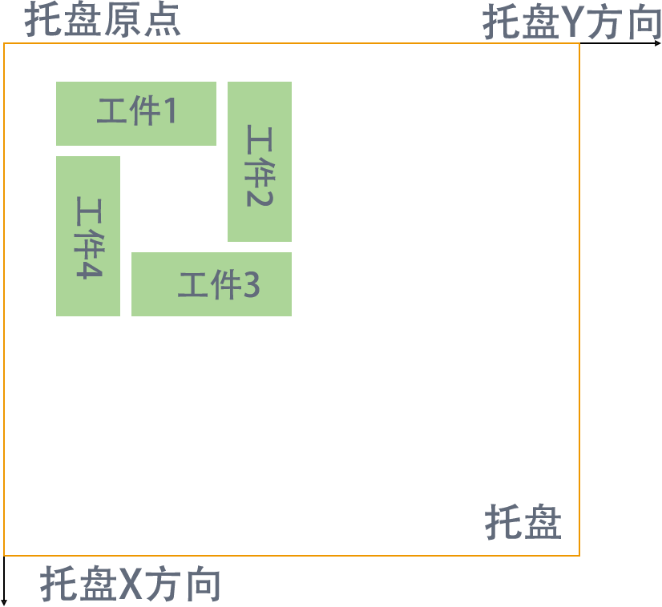

**五花垛**：工件分成三块区域：A区、B区、C区；A区与C区的列数可以一起设置，B区单独设置列数（如图B区的工件4\~7较A区的工件1-3和C区的工件8-13顺时针旋转了90度）如图1所示A区和C区的工件以列数最多的B区为基准保持工件左右对齐。

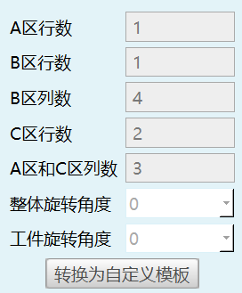

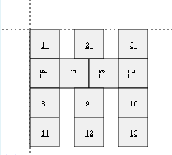

图1

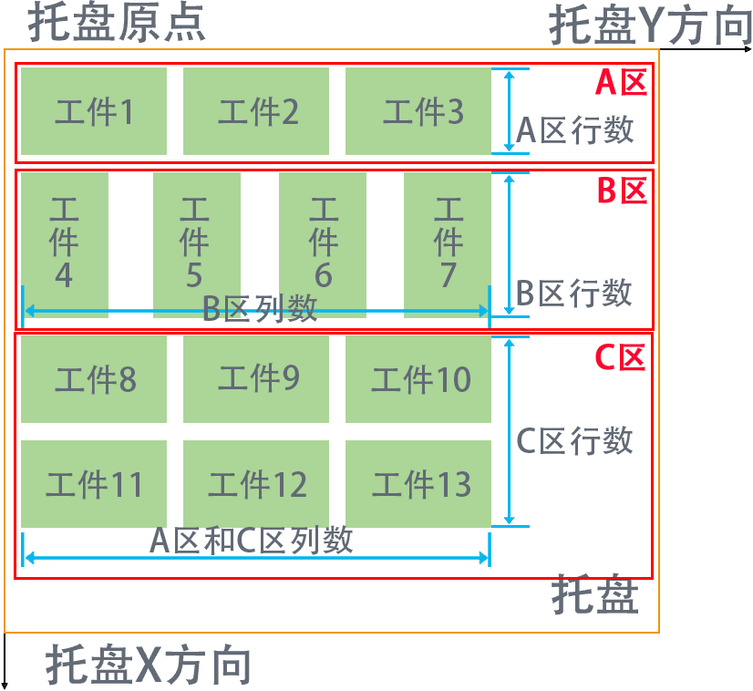

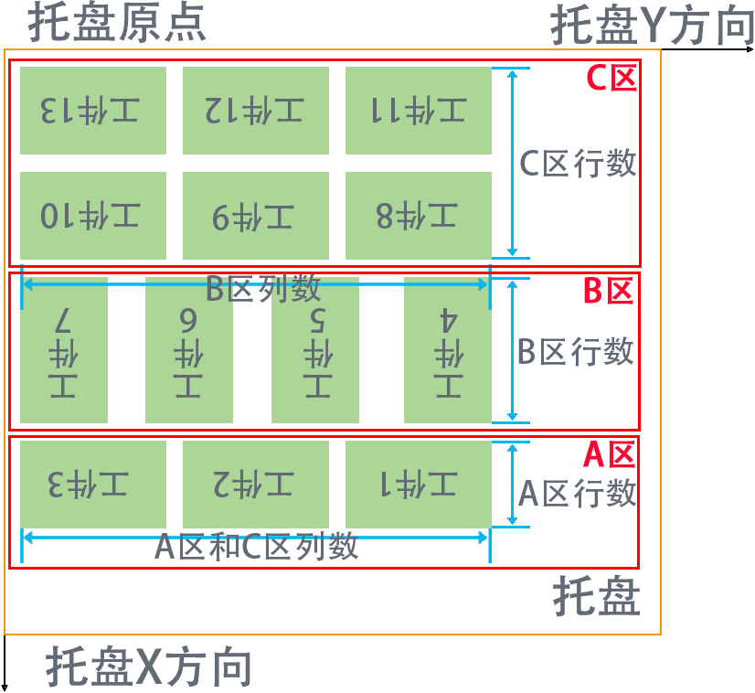

**整体旋转角度0° 整体旋转180°**

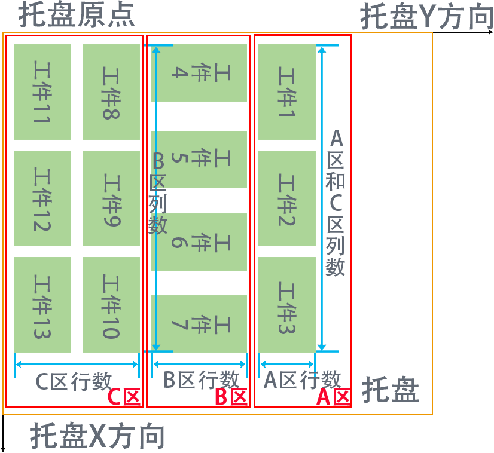

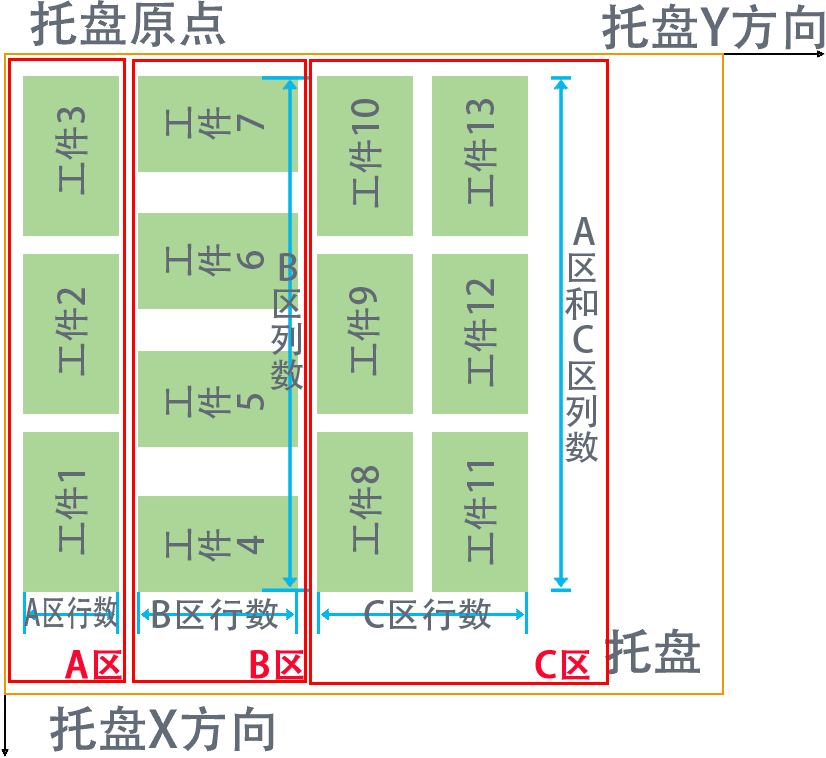

**整体旋转90° 整体旋转-90°**

**自定义**：自定义图形模板。

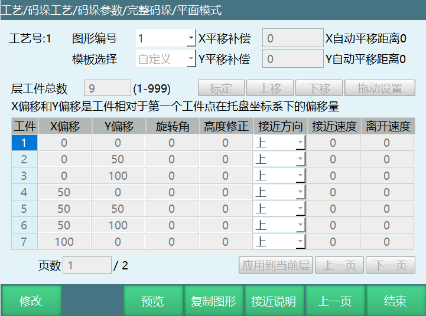

层工件总数:码垛工件总数，根据实际需要来设定。注：修改工件总数会清空所有工件参数。

**标定**:可以自己设置工件码垛时的点位，确定好点位后点击标定按钮。如果第一次设置的码垛时的工件点位想要修改的话，可以点击工件的编号，将机器人移动到自己想要的位置后点击标定，这样工件的点位就修改完成了。

**上移**:工件点位标定完成后想要将码垛工件2的位置设置为码垛工件1的位置，可以点击上移按钮，这样工件1的位置就发生了变化。这里以两个工件为例。

工件2上移后：

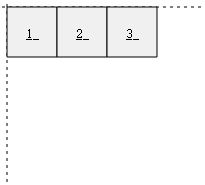

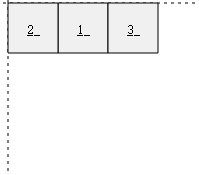

**下移**:工件点位标定完成后想要将码垛工件1的位置设置为码垛工件3的位置，可以点击下移按钮，这样工件3的位置就发生了变化。

工件1下移后：

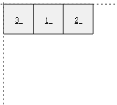

**X偏移**：工件点在X轴上的偏移量。

**Y偏移**：工件点在Y轴上的偏移量。

**旋转角**：工件相对于之前工件点角度旋转的角度。

**高度修正**：填写后，工件点、辅助点、入口点在该工件码垛时高度将偏移，数值为正则向Z+方向偏移，数值为负则向Z-方向偏移，可对工件点、辅助点、入口点高度进行修正。

**拖拽设置**：码垛工件数设置完成后，点击拖拽设置按钮，如图所示可以将工件点拖拽到你想要的任何位置。自定义除了可以填写XY偏移，也可以对工件直接进行拖拽。

**注：进入拖拽设置前，要先在自定义里设置好层工件总数，点击保存后，再点击修改-拖拽设置；拖拽设置完成后，先点击拖拽设置内的保存按钮，返回进入自定义界面，再次点击保存。**

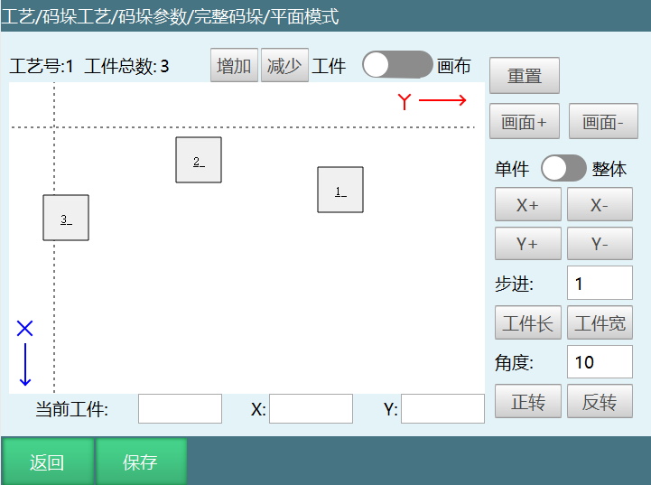

**增加**:增加工件的个数，根据自己需要来增加工件个数。

**减少**:减少工件的个数。

**工件/画布**：按钮关闭可以拖动工件，按钮打开可以拖动画布。

**重置**：重置画布。

**画面**+：画面放大。

**画面**-：画面缩小。

**单件/整体**：单件/整体工件在X或者Y方向的偏移，打开单件/整体按钮，可以对所有的工件进行X或者Y方向的偏移，关闭单件/整体按钮，可以对自己当前选中的工件进行X或者Y方向的偏移。

**X+/X-**：整体往X正或负方向偏移步进值。

**Y+/Y**-：整体往Y正或负方向偏移步进值。

**步进**：工件在X或者Y方向的偏移量。

**角度**：设置每次旋转的角度，打开单件/整体按钮，所有工件都会进行旋转，关闭单件/整体按钮，可以对自己当前选中的工件进行旋转。

**正转/反转**：工件以自身进行旋转设置角度值。

### 简易码垛

#### 参数设置

简易码垛参数设置按流程可以进行抓手设置，位置设置。

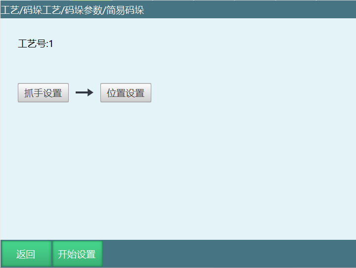

当前使用类型：简易码垛、完整码垛共用码垛号时，使用前需要设置正确的类型。

#### 抓手设置

抓手设置可以选择码垛的抓手（工具手），请提前到【设置-工具手标定】界面中标定抓手（工具手），再在此界面设置抓手，如图：

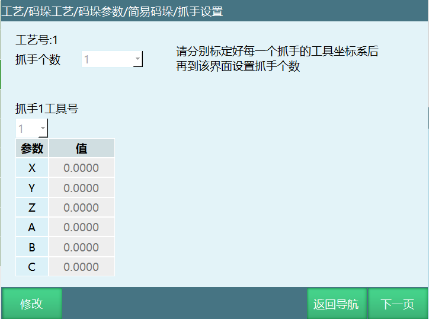

**抓手个数**：抓手的个数，根据实际情况设置。

**抓手X工具号**：设置抓手所对应的工具手号，工具手参数需提前标定。

**参数值**：参数值为工具手末端的偏移量，此处只可以选择，不可以标定。

#### 位置设置

简易码垛仅提供行列模式垛型使用。且所有码垛的方向与位置点均为标记出来的，即使标记的不是矩形垛型也会按照标记方向的去码。

简易码垛仅需设置码垛抓手、标记6个位置点。抓手的设置与完整码垛相同。若码垛有多个抓手分别进行取料和码垛，请用第一个抓手标记位置点，其它抓手的动作将自动计算。

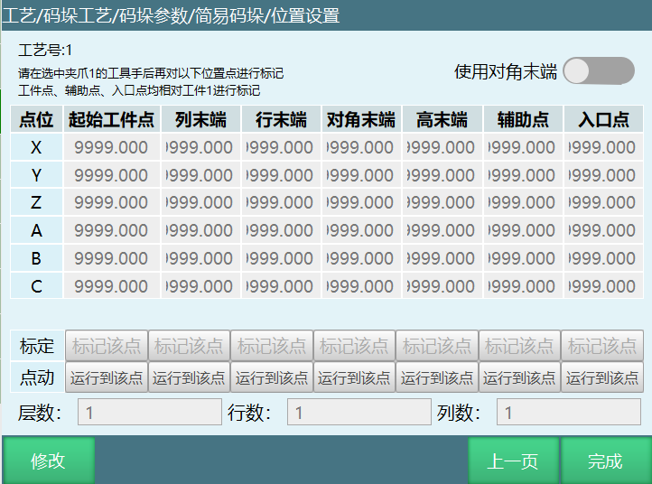

**起始工件点**：码垛时第一个工件的位置点。

**列末端**：码垛时列（用户坐标X轴）方向最后一个工件的位置点。

**行末端**：码垛时行（用户坐标Y轴）方向最后一个工件的位置点。

**高末端**：码垛时最后一层第一个工件的位置点。

**对角末端**：行末端对角末端连线与列末端对角末端连线相交的位置点，以校准码垛点位较多情况下位置偏移问题

**辅助点**：码垛的辅助点，建议设置为起始工件点的上方。

**入口点**：码垛时的入口点，建议设置为托盘外一个安全点。

**层数**：码垛的总层数。

**行数**：码垛总行数。

**列数**：码垛总列数。

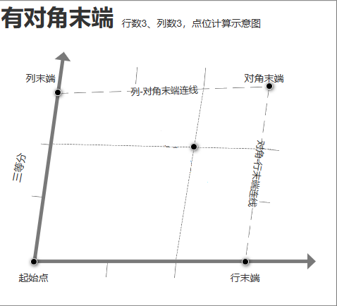

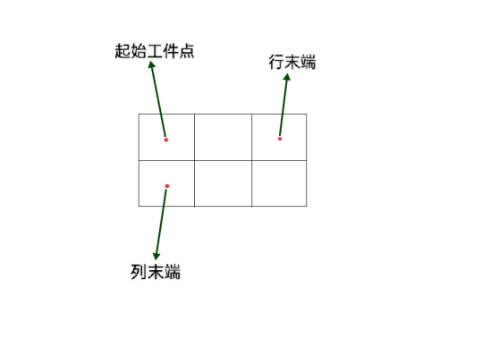

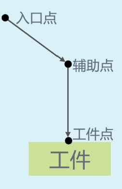

## 生成文件

使用生成文件可以生成标准的码垛、卸垛程序，需要提前设置好工艺号内的参数。

简易码垛生成文件功能，无IO禁止使用。如下图所示：

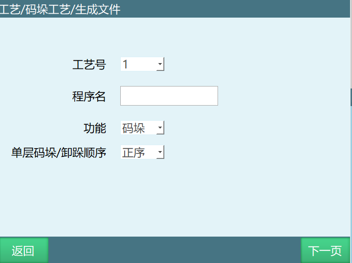

当前使用类型：简易码垛、完整码垛共用码垛号时，使用前需要设置正确的类型。

参数介绍：

**工艺号**：工艺号选择后要确认码垛当前使用类型是否设置。

**程序名**：需要英文字母开头(纯中文也可以)。

**功能**：码垛、卸垛。

**单层码垛/卸垛**：正序、倒序。

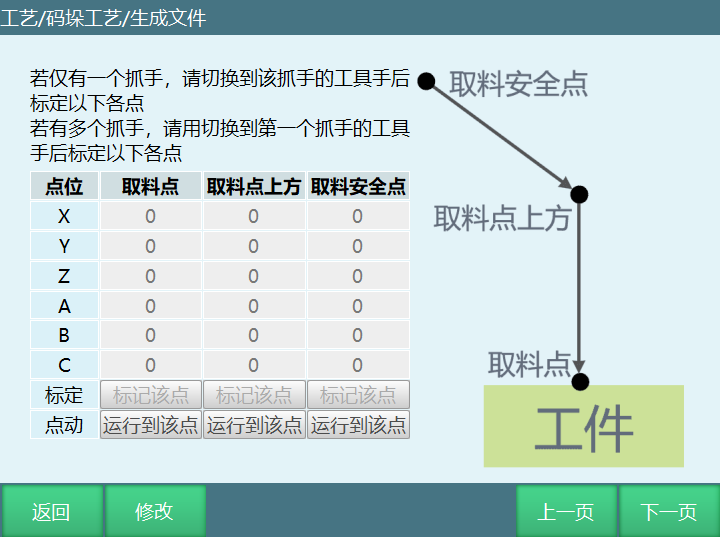

**标记该点**：示教到对应的点点击标定该点即可。

**运行到该点**：点击运行到该点，验证点位示教是否正确。

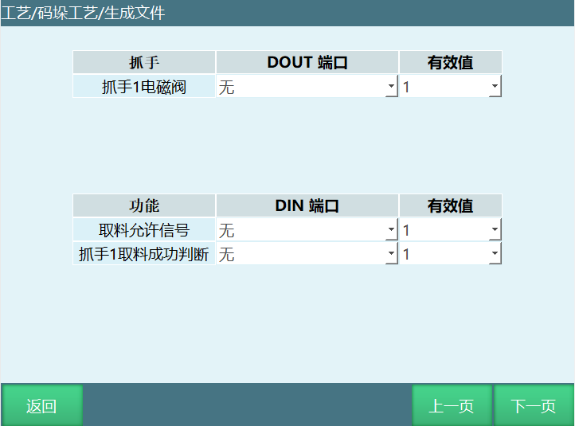

**抓手电磁阀**：抓手IO输出信号，抓手电磁阀DOUT端口必须设置，生成文件功能只支持1路输出，需要多路输出可在作业文件生成后返回工程修改输出信号指令。

**取料允许信号**：码垛取料前等待取料允许信号，根据自身情况选择。

**抓手取料成功信号**：判断抓手取料成功信号。

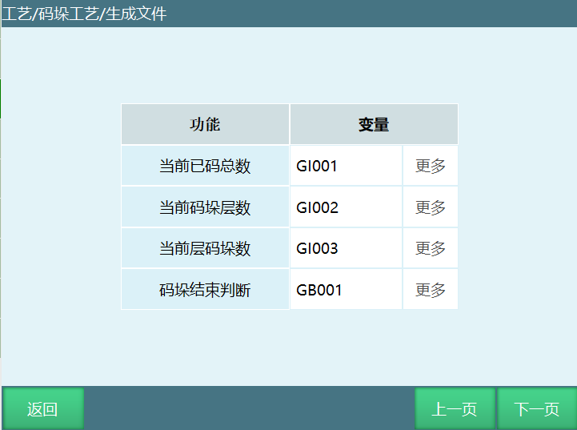

**注:当前已码总数、当前码垛层数、当前层码垛数如果在生成作业不选择变量类型，在执行码垛程序时我们可以在工艺栏-码垛工艺界面查看。**

**当前已码总数**：把当前已码总数变量的值缓存到设置的变量里。

**当前码垛层数**：把当前码垛层数变量的值缓存到设置的变量里。

**当前层码垛数**：把当前层码垛数变量的值缓存到设置的变量里。

**码垛结束判断**：码垛完成后，改变变量值跳出while循环 。

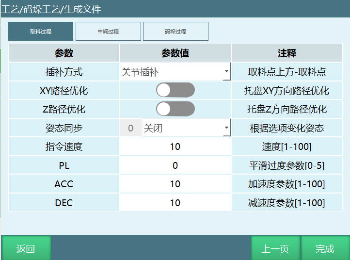

**取料过程**：取料点上方，取料点，可以改为关节插补或直线插补。

**中间过程**：取料安全点，码垛入口点，可以改为关节插补或直线插补。

**码垛过程**：码垛辅助点，工件点，可以改为关节插补或直线插补。

**XY路径优化**：点击开启后，可以优化托盘的XY方向的路径。

**Z路优化**：点击开启后，可以优化托盘的Z方向的路径。

**姿态同步：**

- 关闭：姿态按照设定点位执行。

- 手动写入：按手填姿态移动到入口。

- 自动计算姿态：根据入口点到辅助点，辅助点到工件点的距离之比，自动计算出入口点运行到辅助点工件点之间的轨迹姿态，运动过程中期间的C姿态是一直旋转的。例如入口点到辅助点与辅助点到工件点的距离比是2:8，从入口点到工件点的C姿态一共转了100°，那么1从工件点到辅助点时会转20°，剩下的80°会在辅助点到工件点之间转完。

### 码垛门型插补方式

码垛入口点 码垛辅助点 码垛工件点新增门型插补方式。

门型轨迹运动大量应用于物料搬运及3c行业。机械臂通过走门型轨迹（上升\--\>平移\--\>下降）运动到目标点，从而避免物料摩擦。

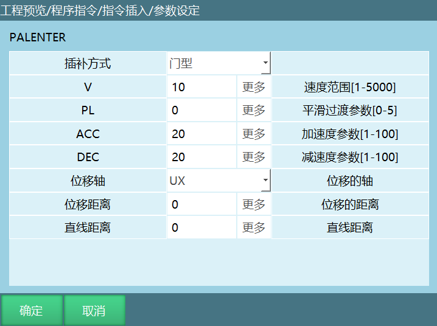

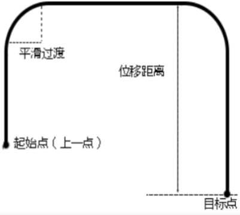

码垛实际运用可以通过两点实际码垛运行（取料点------工件点），如下图：

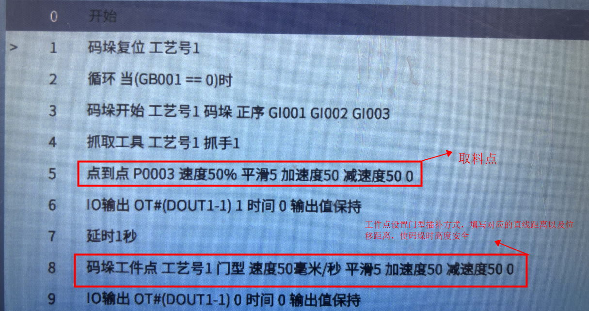

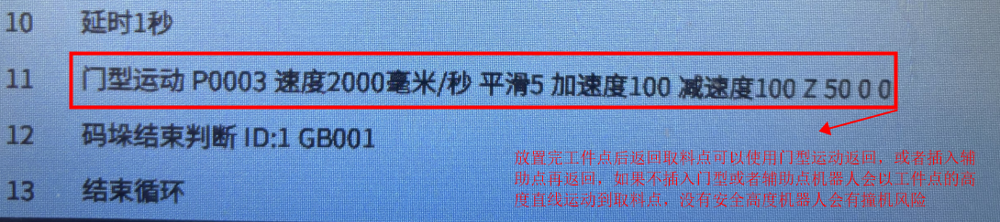

## 位置调试

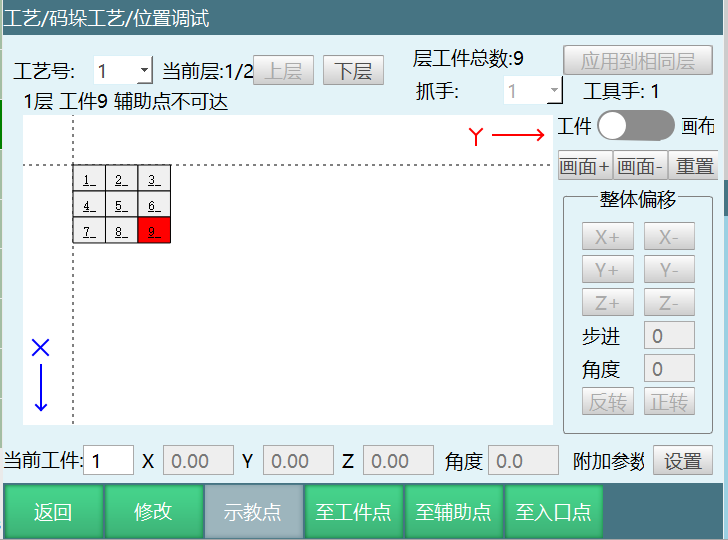

参数介绍：

**工艺号**：当前参数的工艺号。

**层工件总数**：该层工件总数。

**上层**：切换到上一层。

**下层**：切换到下一层。

**工件/画布**：按钮关闭可以拖动工件，按钮打开可以拖动画布。

**重置**：重置画布。

**画面+**：画面放大。

**画面-**：画面缩小。

**整体偏移**：操作整体工件偏移。

**X+**：整体往X正方向偏移步进值。

**X-**：整体往X负方向偏移步进值。

**Y+**：整体往Y正方向偏移步进值。

**Y-**：整体往Y负方向偏移步进值。

**Z+**：整体往Z正方向偏移步进值。

**Z-**：整体往Z负方向偏移步进值。

**步进：**设置每次偏移的步进值。

**角度**：设置每次旋转的角度。

**正转：**各工件整体顺时针旋转角度值。

**反转：**各工件整体逆时针旋转角度值。

**应用到相同层**：把当前层设置的参数应用到相同图形编号的层。

注：

- 通过当前工件一行填值设置点位的偏移，保存后当前层的当前工件偏移生效。如果需要应用到编号相同的层，操作步骤为点击修改
  \-\--\> 修改当前工件一行的偏移值 \-\--\> 点击应用到相同层按钮 \-\--\>
  点击保存
  （应用到相同层只应用x偏移，y偏移和角度偏移，z偏移不应用到相同层）。

- 通过整体偏移一列填值设置整体的偏移，保存后当前层的所有工件偏移生效。如果需要应用到编号相同的层，操作步骤为点击修改
  \-\--\> 修改整体偏移一列的偏移值 \-\--\> 点击各工件角度下面的确认按钮
  \-\--\> 点击应用到相同层按钮 \-\--\> 点击保存
  （应用到相同层只应用x偏移，y偏移和角度偏移，z偏移不应用到相同层）。

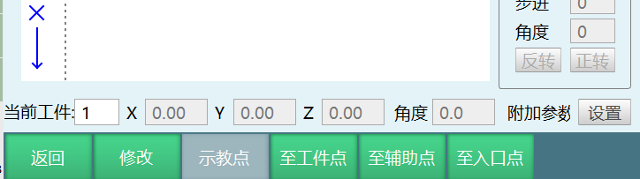

**当前工件**：1表示工件的编号；

X表示工件向X轴正或负偏移；

Y表示工件向Y轴正或负偏移；

Z表示工件向Z轴正或负偏移；

角度表示工件当前选择多少度。

**工件/画布功能演示**

按钮打开拖动整个画布，但是不影响工件坐标。

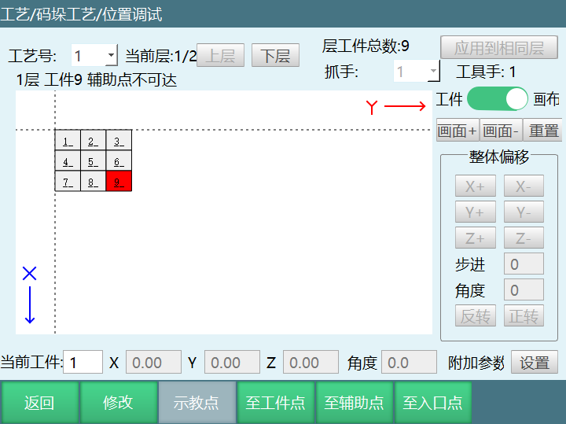

**重置功能演示**

点击重置按钮后，画布回到初始位置，但是画布大小不重置。

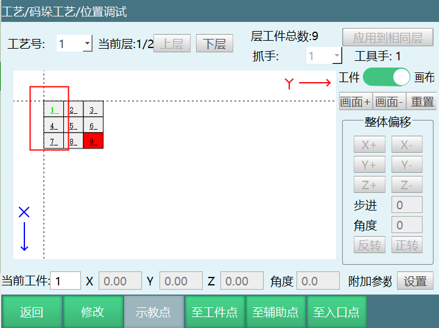

**画面+、画面-功能演示**

点击画面+，画布放大。

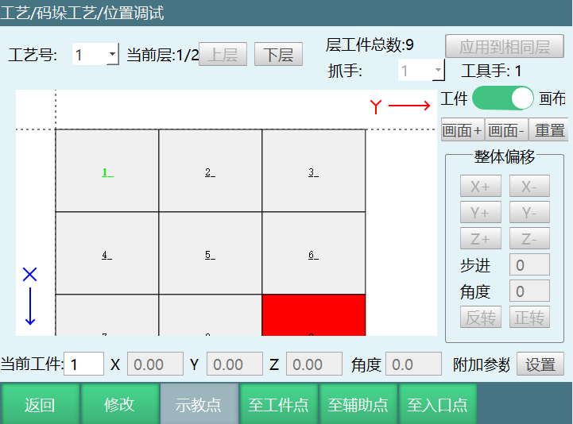

点击画面-，画布缩小

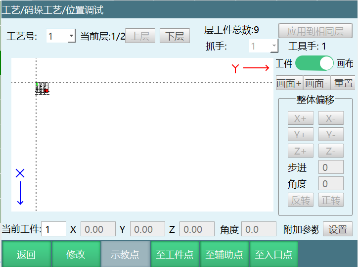

**单件/整体偏移功能演示**

填写坐标值，也是偏移X、Y，Z,角度（因为是平面，所以Z轴看不出效果）的值，例如填X:400,Y:300,Z:0，角度45。

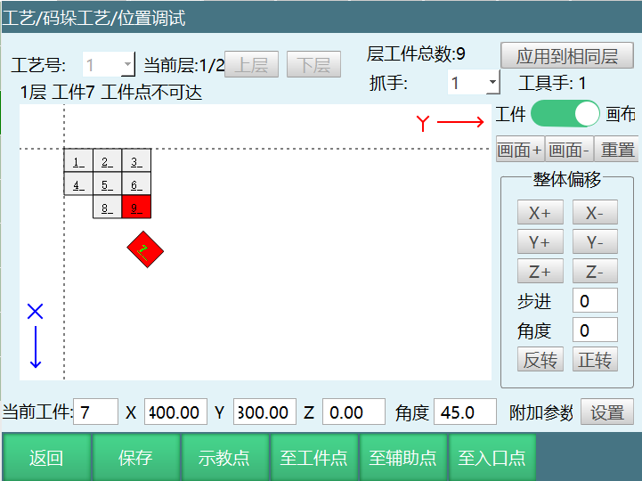

**附加参数功能介绍**

通过参考点设置与修改形态值能够让码垛过程更流畅。

以下是具体说明：

进入工艺/码垛工艺/位置调试界面，右下角新增【附加参数】页面，点击【设置】可以进入【附加参数】页面。

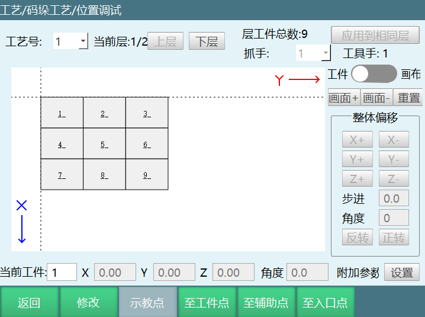

附加参数页面：

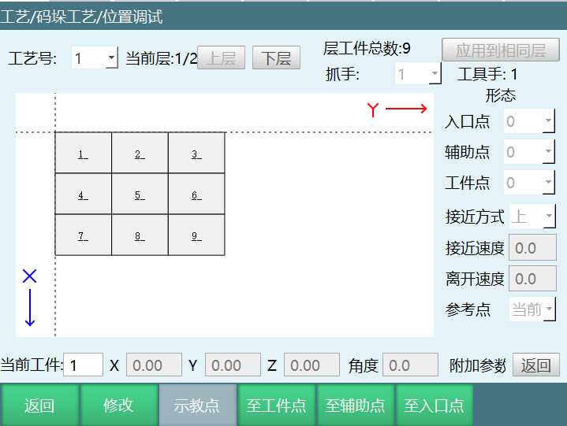

形态：可以设置当前工件的形态值，包含入口点、辅助点、工件点形态，其中形态值为0-8。

参考点：可以选择零点位置运动到目标点，还是从当前位置运动到目标点。

1.选择零点时，该工件位置将根据零点位置进行参考判断是否可以到达。若显示位置不可达，可更改选择形态值。如显示入口点不可达，可修改入口点形态值。

例如：当前工艺的工件9，参考点为零点时，入口点不可达。

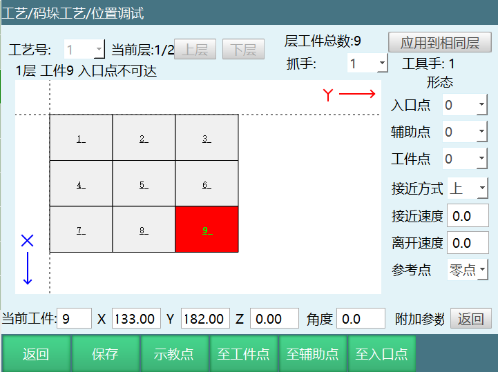

可以将工件9的入口点形态改为4，此时参考点为零点时入口点可达到。

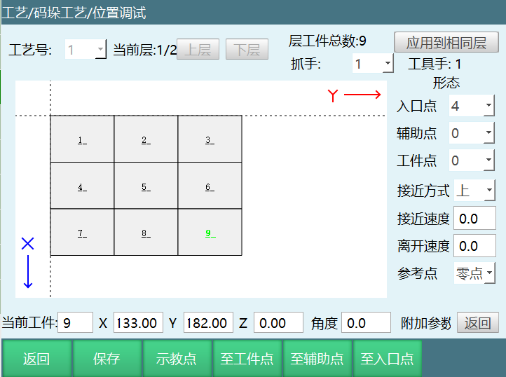

2.选择当前时，该工件位置将根据当前位置进行参考判断是否可以到达。若显示位置不可达，可更改选择形态值。如显示入口点不可达，可修改入口点形态值。

例如：当前工艺的工件1，参考点为当前时，工件点、辅助点、入口点均不可达。

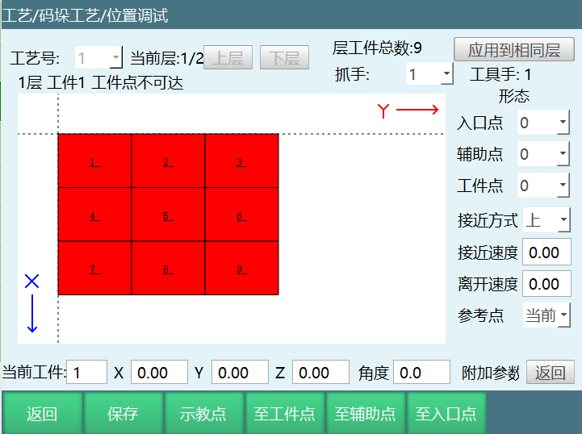

可以将工件1的工件点、辅助点、入口点的形态都改为4，此时参考点为当前时工件位置可达到。

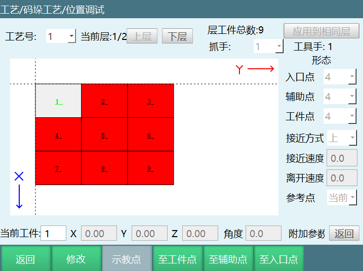

3.码垛生成文件若使用关节插补方式，运行作业文件时出现报错位置不可达，可以在位置调试/附加参数页面，更改相应工件的形态值。

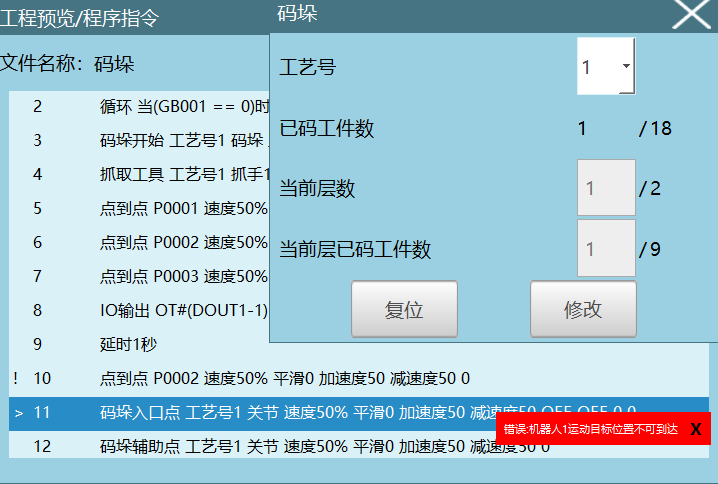

此时，在码第二个工件时出现入口点位置不可达，可在位置调试中修改工件2的入口点的形态值为4。

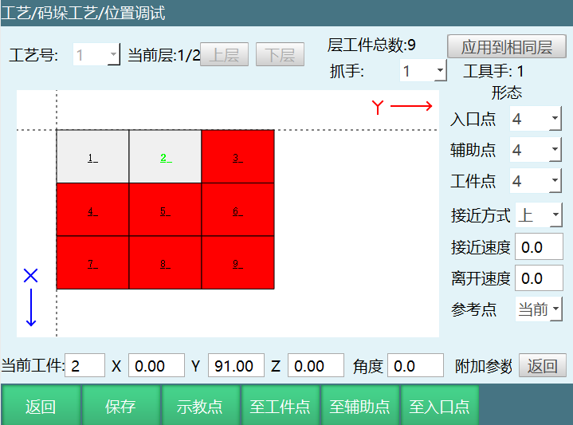

运行作业文件时，修改过工件点形态值后，有可能在回到取料点位置时会出现位置不可达问题。

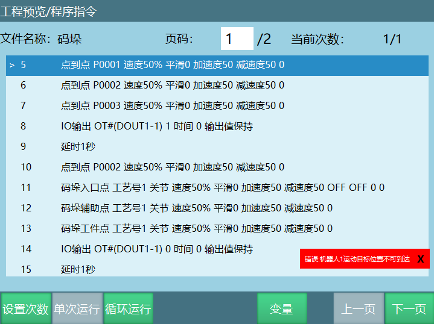

可手动修改取料安全点（P0001）的形态值为8，即可正常运行。

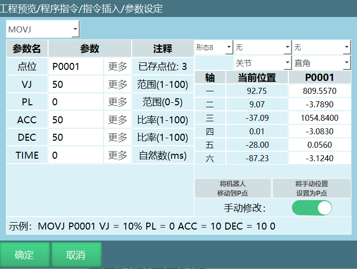

## 码垛状态

码垛状态可用来查看当前码垛状态，如果码垛需从中间开始，可通过设置需要码的层数和个数来实现。

**码垛数会在控制器重启后清零，重新运行不清零。**

码垛状态可在【状态栏-工艺-码垛】中查看，有两种方法；可以在操作参数中设置，工艺选择栏选择码垛工艺（操作参数中选择码垛会一直默认码垛工艺）；也可以直接在示教器上方导航栏工艺中选择码垛，如图所示：

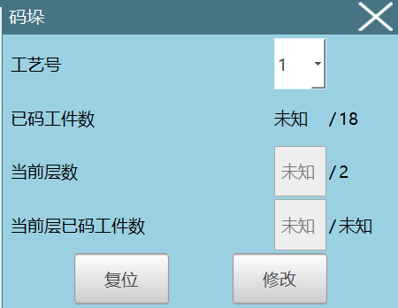

**工艺号**：码垛的工艺号。

**已码工件数**：已码工件数/总工件数。

**当前层数**:当前正在码的层数/总层数（如码垛需在中间开始，设置需要码的层数即可），这里以两层码垛为例，当机器人正在进行第一层工件码垛时，可以将当前层数设置为2，然后机器人会进行第二层工件的码垛，已码的工件数的显示也会发生变化。

**当前层已码工件数**:当前层已码工件数/当前层总工件数（如码垛需在中间开始，设置需要码的个数即可）例如现在正在进行第3个工件的码垛，如果想要从第7个工件开始码垛，然后就可以修改当前层已码工件数，按照自己需要的工件数开始码垛。

**复位**：清除已记录的码垛数据。

**修改**：机器人在码垛的过程中，点击修改可以修改当前层数和当前层已码的工件数。

## 码垛指令

| 指令类型 | 指令         | 单步  | 倒序                   | 试运行 | 提前执行 | 被提前执行 |
| :------- | :----------- | :---- | :--------------------- | :----- | :------- | :--------- |
| 码垛     | 开始码垛     | 支持  | 跳行至前一条运动指令处 | 不支持 | 不支持   |            |
| 码垛     | 切换抓手     | 支持  | 跳行至前一条运动指令处 | 不支持 | 不支持   |            |
| 码垛     | 码垛入口点   | 支持  | 跳行至前一条运动指令处 | 支持   | 不支持   |            |
| 码垛     | 码垛辅助点   | 支持  | 跳行至前一条运动指令处 | 支持   | 不支持   |            |
| 码垛     | 码垛工件点   | 支持  | 跳行至前一条运动指令处 | 支持   | 不支持   |            |
| 码垛     | 码垛复位     | 支持  | 跳行至前一条运动指令处 | 不支持 | 不支持   |            |
| 码垛     | 码垛结束判断 | 支持  | 跳行至前一条运动指令处 | 不支持 | 不支持   |            |
| 码垛     | 获取工件点位 | 支持  | 跳行至前一条运动指令处 | 不支持 | 不支持   |            |
| 码垛     | 简易码垛指令 | 支持  | 跳行至前一条运动指令处 | 不支持 | 不支持   |            |
| 码垛     | 码垛接近点   | 支持  | 跳行至前一条运动指令处 | 支持   | 不支持   |            |

### PALON（开始码垛）

**功能**：码垛开始判断。

**工艺号**：工艺号1-99。

**类型**：码垛、卸垛。

**单层码垛/卸垛**：正序、倒序。

**当前已码总数变量**：把当前已码总数变量的值缓存到设置的变量里。

注：可通过读取变量控制码第几层第几个工件。

**当前码垛层数变量**：把当前码垛层数变量的值缓存到设置的变量里。

注：可通过读取变量控制码第几层第几个工件。

**当前层垛数变量**：把当前层垛数变量的值缓存到设置的变量里。

注：可通过读取变量控制码第几层第几个工件。

示例：PALON ID=1 SORT=0 TYPE=0 \[变量名\]\[变量名\]\[变量名\] 。

**注：码垛开始PALON指令3个计数变量会直接写到配置中，不需要使用写入文件FORCESET指令。**

### PALGRIPPER（切换抓手）

**功能**：选取抓手。

**工艺号**：工艺号1-99。

**抓手**：抓手1、抓手2、抓手3、抓手4。

**示例**：PALGRIPPER ID=1 GRIPPERS=1。

### PALENTER (码垛入口点)

**功能**：码垛入口点。

**工艺号**：工艺号1-99。

**插补方式**：关节插补、直线插补、圆弧插补、门型插补。

**关节插补**：机器人将以关节插补的方式移动到该点。

**直线插补**：机器人将以直线插补的方式移动到该点。

**圆弧插补**：机器人将与另外两点（上一个点插MOVJ/MOVL,下一点MOVC）组成圆弧轨迹。

**门型插补**：门型轨迹运动大量应用于物料搬运及3c行业。机械臂通过走门型轨迹（上升\--\>平移\--\>下降）运动到目标点，从而避免物料摩擦。

**VJ**：速度范围1-100。

**PL**：平滑过渡范围0-5。

**ACC**：加速度范围1-100。

**DEC**：减速度范围1-100。

**XY优化**：优化XY轴运动路径。

**Z优化**：优化Z轴运动路径，需在码垛前插入一个固定点。

当入口点高度比固定点低时，入口点在高度上会和固定点、辅助点处于同一值线上（侧视同一直线，俯视不是同一直线，XY轴不变）。

当入口点高度位于固定点与辅助点之间时，入口点高度不变。

当入口点高度位于固定点、辅助点之上时，入口点高度将优化到与固定点水平的高度。

当入口点、辅助点高度都高于固定点时，入口点高度将优化到与辅助点水平高度。

**姿态**：关闭：姿态按照设定点位执行。

手动写入：按手填姿态移动到入口 。

自动计算姿态：在入口点前和后各有一个姿态，入口点姿态会在这两个姿态间计算出来。

**TIME**：时间，范围非负整数，单位ms，提前执行下一条指令。

示例：PALENTER ID=1 MOVJ VJ=10% PL=0 ACC=20 DEC=20 OFF OFF OFF 0。

### PALSHIFT（码垛辅助点）

**功能**：码垛辅助点。

**工艺号**：工艺号1-99。

**插补方式**：关节插补、直线插补、圆弧插补、门型插补。

**关节插补**：机器人将以关节插补的方式移动到该点。

**直线插补**；机器人将以直线插补的方式移动到该点。

**圆弧插补**：机器人将与另外两点（上一个点插MOVJ/MOVL,下一点MOVC）组成圆弧轨迹。

**门型插补**：门型轨迹运动大量应用于物料搬运及3c行业。机械臂通过走门型轨迹（上升\--\>平移\--\>下降）运动到目标点，从而避免物料摩擦。

**VJ**：速度范围1-100。

**PL**：平滑过渡范围0-5。

**ACC**：加速度范围0-100。

**DEC**：减速度范围0-100。

**TIME**：时间，范围非负整数，单位ms，提前执行下一条指令。

示例：PALSHIFT ID=2 MOVJ VJ=30% PL=2 ACC=20 DEC=20。

### PALREAL（码垛工件点）

**功能**：码垛工件点。

**工艺号**：工艺号1-99。

**插补方式**：关节插补、直线插补、圆弧插补、门型插补。

**关节插补**：机器人将以关节插补的方式移动到该点。

**直线插补**：机器人将以直线插补的方式移动到该点。

**圆弧插补**：机器人将与另外两点（上一个点插MOVJ/MOVL,下一点MOVC）组成圆弧轨迹。

**门型插补**：门型轨迹运动大量应用于物料搬运及3c行业。机械臂通过走门型轨迹（上升\--\>平移\--\>下降）运动到目标点，从而避免物料摩擦。

**VJ**：速度范围1-100。

**PL**：平滑过渡范围0-5。

**ACC**：加速度范围1-100。

**DEC**：减速度范围1-100。

**TIME**：时间，范围非负整数，单位ms，提前执行下一条指令。

示例:PALREAL ID=2 MOVJ VJ=30% PL=2 ACC=20 DEC=20。

### PALCLEAR（码垛复位）

**功能**：码垛复位，码垛状态清空。

**工艺号**：工艺号1-99。

示例：PALCLEAR ID=1。

### PALOFF（码垛结束判断）

**功能**：码垛结束判断。

**工艺号**：工艺号1-99。

**结束判断变量**：判断码垛结束的条件。

示例：PALOFF ID=1\[变量名\]。

**注：若某个工艺号总工件数为n，执行PALREAL指令前n-1次，变量值会被置为0，第n次执行PALREAL指令，变量值会被置为1。中途执行码垛复位，变量会被复位为0**。

### PALLET_POS（获取工件点位）

**功能**：获取工件点位。

**工艺号**：码垛参数存放的工艺号。

**层号**：工件所在层。

**编号**：工件的编号。

**获取点位类型**：对应工件的点位类型。

示例：PAL_POS ID=1 1 1 P0001。

通过变量读取第几层第几个的工件点位。

### PAL_SET_EXAMPLE（简易码垛指令）

**功能**：简易码垛指令。

**工艺号**：码垛参数存放的工艺号。

**起始工件点**：码垛时第一个工件的位置点。

**列末端**：码垛时列方向最后一个工件的位置点。

**行末端**：码垛时行方向最后一个工件的位置点。

**高末端**：码垛时最后一层第一个工件的位置点。

**辅助点**：码垛的辅助点一般在起始工件点的上方。

**入口点**：码垛的入口点一般在托盘外一个安全点。

**行数**：码垛总行数。

**列数**：码垛总列数。

**层数**：码垛总层数。

示例：PALSIMPLESET ID=1(P0001 P0002 P0003 P0004 P0005 P0006)。

简易码垛指令填好所有参数后运行，参数会相应的填入码垛工艺/简易码垛里，局部点位需要在变量里去设置（这个指令与码垛工艺里的简易码垛位置设置是一样的）。

## 使用情景

### 情景1------取料点固定，放料点逐层码垛

#### 参数设置

1.  点击右侧【菜单栏-工艺-码垛工艺-完整码垛】。

2.  根据实际情况选择工艺号，此处选择工艺号1。

3.  点击抓手设置。

4.  选择抓手，根据实际情况选择，此处选择抓手个数1，抓手工具号1（抓手工具号即工具手号，抓手需要先到【设置-工具手标定】界面设置），此处只可以选择，点击保存。

5.  点击下一页进入托盘设置（也可点击返回导航再进入托盘设置）。

6.  根据实际托盘标定托盘坐标系（用户坐标系），点击保存。

**注：标定托盘时需要带工具手标定，标定的坐标系Z轴不能朝下。**

7.  点击下一页进入位置设置（也可点击返回导航再进入位置设置）。

8.  根据实际情况标定工件点、辅助点、入口点，点击保存。

**注：标定时需要带工具手标定。**

9.  点击下一页进入工件参数设置（也可点击返回导航再进入工件参数设置）。

10. 根据实际情况填写工件尺寸参数，此处设置为长"50"、宽"30"、高"15"，间隙为0，点击保存。

11. 点击下一页进入接近参数设置（也可点击返回导航再进入接近参数设置）。

12. 根据实际情况设置，如果不需要可直接跳过。

13. 点击下一页进入重叠模式设置（也可点击返回导航再进入重叠模式）。

14. 层数根据实际情况填写，此处层数设置为"10"、重复关系设置为"相同"、第一层图形编号选择"1"、其他参数不填，点击保存。

15. 点击下一页进入平面模式设置（也可点击返回导航再进入平面模式）。

16. 选择图形编号"1"、模板选择"纵横交错"、X方向个数填"1"、Y方向个数填"3"、其他参数默认不填，点击保存，点击预览可查看设置的图形模板。

**注：整体旋转是以第一个工件中心整体旋转180度。**

17. 点击结束完成参数设置。

#### 编写程序

NOP //开始

BOOLEAN A001 = 0 //插入变量

PALCLEAR ID = 1 //清空前一次码垛数据

WHILE (A001 == 0) //循环语句

MOVJ P001 VJ = 30 % PL = 0 ACC = 20 DEC = 20 //取料入口点

WAIT (DIN4 == 1) T = 10 //取料判断

MOVJ P003 VJ = 30 % PL = 0 ACC = 20 DEC = 20 //取料辅助点

MOVJ P002 VJ = 30 % PL = 0 ACC = 20 DEC = 20 //取料工件点

DOUT OT#(5) 1 //取料信号

TIMER T = 1 //延时

MOVJ P003 VJ = 30 % PL = 0 ACC = 20 DEC = 20 //取料辅助点

PALON ID = 1 TYPE = 0 \[-\] \[-\] \[-\] MULTI = 0 //码垛开始

PALGRIPPER ID = 1 GRIPPERS = 1 //抓手选择

PALENTER ID = 1 MovJ VJ = 30 % PL = 0 ACC = 20 DEC = 20 OFF OFF
//放料入口点

PALSHIFT ID = 1 MovJ VJ = 30 % PL = 0 ACC = 20 DEC = 20 //放料辅助点

PALREAL ID = 1 MovJ VJ = 30 % PL = 0 ACC = 20 DEC = 20 //放料工件点

DOUT OT#(5) 0 //放料信号

TIMER T = 1 //延时

PALSHIFT ID = 1 MovJ VJ = 30 % PL = 0 ACC = 20 DEC = 20 //放料辅助点

PALOFF ID = 1 A001 //码垛结束

ENDWHILE //循环结束

END //结束

### 情景2------取料点固定，放货点高度补偿

#### 参数设置

打开【工艺-码垛工艺-完整码垛-重叠模式】，放货点高度补偿填"100"，点击保存。

其他参数设置步骤请参考情景1步骤。

#### 编写程序

**注：相关参数请根据实际情况填写。**

NOP //开始

BOOLEAN A001 = 0 //插入变量

PALCLEAR ID = 1 //清空前一次码垛数据

WHILE (A001 == 0) //循环语句

MOVJ P001 VJ = 30 % PL = 0 ACC = 20 DEC = 20 //取料入口点

WAIT (DIN4 == 1) T = 10 //取料判断

MOVJ P003 VJ = 30 % PL = 0 ACC = 20 DEC = 20 //取料辅助点

MOVJ P002 VJ = 30 % PL = 0 ACC = 20 DEC = 20 //取料工件点

DOUT OT#(5) 1 //取料信号

TIMER T = 1 //延时

MOVJ P003 VJ = 30 % PL = 0 ACC = 20 DEC = 20 //取料辅助点

PALON ID = 1 TYPE = 0 \[-\] \[-\] \[-\] MULTI = 0 //码垛开始

PALGRIPPER ID = 1 GRIPPERS = 1 //抓手选择

PALENTER ID = 1 MovJ VJ = 30 % PL = 0 ACC = 20 DEC = 20 OFF OFF
//放料入口点

PALSHIFT ID = 1 MovJ VJ = 30 % PL = 0 ACC = 20 DEC = 20 //放料辅助点

PALREAL ID = 1 MovJ VJ = 30 % PL = 0 ACC = 20 DEC = 20 //放料工件点

DOUT OT#(5) 0 //放料信号

TIMER T = 1 //延时

PALSHIFT ID = 1 MovJ VJ = 30 % PL = 0 ACC = 20 DEC = 20 //放料辅助点

PALOFF ID = 1 A001 //码垛结束

ENDWHILE //循环结束

END //结束

### 情景3------取料点固定，层高度修正

#### 参数设置

打开【工艺-码垛工艺-完整码垛-重叠模式】，每一层的高度修正都填"50"，点击保存。

#### 编写程序

NOP //开始

BOOLEAN A001 = 0 //插入变量

PALCLEAR ID = 1 //清空前一次码垛数据

WHILE (A001 == 0) //循环语句

MOVJ P001 VJ = 30 % PL = 0 ACC = 20 DEC = 20 //取料入口点

WAIT (DIN4 == 1) T = 10 //取料判断

MOVJ P003 VJ = 30 % PL = 0 ACC = 20 DEC = 20 //取料辅助点

MOVJ P002 VJ = 30 % PL = 0 ACC = 20 DEC = 20 //取料工件点

DOUT OT#(5) 1 //取料信号

TIMER T = 1 //延时

MOVJ P003 VJ = 30 % PL = 0 ACC = 20 DEC = 20 //取料辅助点

PALON ID = 1 TYPE = 0 \[-\] \[-\] \[-\] MULTI = 0 //码垛开始

PALGRIPPER ID = 1 GRIPPERS = 1 //抓手选择

PALENTER ID = 1 MovJ VJ = 30 % PL = 0 ACC = 20 DEC = 20 OFF OFF
//放料入口点

PALSHIFT ID = 1 MovJ VJ = 30 % PL = 0 ACC = 20 DEC = 20 //放料辅助点

PALREAL ID = 1 MovJ VJ = 30 % PL = 0 ACC = 20 DEC = 20 //放料工件点

DOUT OT#(5) 0 //放料信号

TIMER T = 1 //延时

PALSHIFT ID = 1 MovJ VJ = 30 % PL = 0 ACC = 20 DEC = 20 //放料辅助点

PALOFF ID = 1 A001 //码垛结束

ENDWHILE //循环结束

END //结束

### 情景4------取料点固定，固定放货点高度，竖直方向排列

#### 参数设置

打开【工艺-码垛工艺-完整码垛-重叠模式】，勾选竖直方向排列，点击保存。

注：使用竖直方向排列，重复关系需要改为"相同"，点击"竖直方向排列"后的按钮，重复关系会自动变为"相同"。

#### 编写程序

NOP //开始

BOOLEAN A001 = 0 //插入变量

PALCLEAR ID = 1 //清空前一次码垛数据

WHILE (A001 == 0) //循环语句

MOVJ P001 VJ = 30 % PL = 0 ACC = 20 DEC = 20 //取料入口点

WAIT (DIN4 == 1) T = 10 //取料判断

MOVJ P003 VJ = 30 % PL = 0 ACC = 20 DEC = 20 //取料辅助点

MOVJ P002 VJ = 30 % PL = 0 ACC = 20 DEC = 20 //取料工件点

DOUT OT#(5) 1 //取料信号

TIMER T = 1 //延时

MOVJ P003 VJ = 30 % PL = 0 ACC = 20 DEC = 20 //取料辅助点

PALON ID = 1 TYPE = 0 \[-\] \[-\] \[-\] MULTI = 0 //码垛开始

PALGRIPPER ID = 1 GRIPPERS = 1 //抓手选择

PALENTER ID = 1 MovJ VJ = 30 % PL = 0 ACC = 20 DEC = 20 OFF OFF
//放料入口点

PALSHIFT ID = 1 MovJ VJ = 30 % PL = 0 ACC = 20 DEC = 20 //放料辅助点

PALREAL ID = 1 MovJ VJ = 30 % PL = 0 ACC = 20 DEC = 20 //放料工件点

DOUT OT#(5) 0 //放料信号

TIMER T = 1 //延时

PALSHIFT ID = 1 MovJ VJ = 30 % PL = 0 ACC = 20 DEC = 20 //放料辅助点

PALOFF ID = 1 A001 //码垛结束

ENDWHILE //循环结束

END //结束

### 情景5------取料点固定，放料点整体旋转180度，XY平移补偿

#### 参数设置

1.  打开【工艺-码垛工艺-完整码垛-重叠模式】。

2.  层数根据实际情况填写，此处层数设置为"10"、重复关系设置为"交替"、第一层图形编号选择"1"、第二层图形编号选择"2"、其他参数不填，点击保存。

3.  打开【工艺-码垛工艺-完整码垛-平面模式】。

4.  选择图形编号"2"、模板选择"纵横交错"、X方向个数填"1"、Y方向个数填"3"、整体旋转角度选"180"、X平移补偿"50"、Y平移补偿"100"，其他参数默认不填，点击保存，点击预览可查看设置的图形模板。

#### 编写程序

NOP //开始

BOOLEAN A001 = 0 //插入变量

PALCLEAR ID = 1 //清空前一次码垛数据

WHILE (A001 == 0) //循环语句

MOVJ P001 VJ = 30 % PL = 0 ACC = 20 DEC = 20 //取料入口点

WAIT (DIN4 == 1) T = 10 //取料判断

MOVJ P003 VJ = 30 % PL = 0 ACC = 20 DEC = 20 //取料辅助点

MOVJ P002 VJ = 30 % PL = 0 ACC = 20 DEC = 20 //取料工件点

DOUT OT#(5) 1 //取料信号

TIMER T = 1 //延时

MOVJ P003 VJ = 30 % PL = 0 ACC = 20 DEC = 20 //取料辅助点

PALON ID = 1 TYPE = 0 \[-\] \[-\] \[-\] MULTI = 0 //码垛开始

PALGRIPPER ID = 1 GRIPPERS = 1 //抓手选择

PALENTER ID = 1 MovJ VJ = 30 % PL = 0 ACC = 20 DEC = 20 OFF OFF
//放料入口点

PALSHIFT ID = 1 MovJ VJ = 30 % PL = 0 ACC = 20 DEC = 20 //放料辅助点

PALREAL ID = 1 MovJ VJ = 30 % PL = 0 ACC = 20 DEC = 20 //放料工件点

DOUT OT#(5) 0 //放料信号

TIMER T = 1 //延时

PALSHIFT ID = 1 MovJ VJ = 30 % PL = 0 ACC = 20 DEC = 20 //放料辅助点

PALOFF ID = 1 A001 //码垛结束

ENDWHILE //循环结束

END //结束

### 情景6------取料点固定，放料点工件旋转90度

#### 参数设置

1.  打开【工艺-码垛工艺-完整码垛-重叠模式】。

2.  层数根据实际情况填写，此处层数设置为"10"、重复关系设置为"相同"、第一层图形编号选择"3"、其他参数不填，点击保存。

3.  打开【工艺-码垛工艺-完整码垛-平面模式】。

4.  选择图形编号"3"、模板选择"行列"、X方向个数填"2"、Y方向个数填"3"、工件旋转角度选"90"，其他参数默认不填，点击保存，点击预览可查看设置的图形模板。

#### 编写程序

NOP //开始

BOOLEAN A001 = 0 //插入变量

PALCLEAR ID = 1 //清空前一次码垛数据

WHILE (A001 == 0) //循环语句

MOVJ P001 VJ = 30 % PL = 0 ACC = 20 DEC = 20 //取料入口点

WAIT (DIN4 == 1) T = 10 //取料判断

MOVJ P003 VJ = 30 % PL = 0 ACC = 20 DEC = 20 //取料辅助点

MOVJ P002 VJ = 30 % PL = 0 ACC = 20 DEC = 20 //取料工件点

DOUT OT#(5) 1 //取料信号

TIMER T = 1 //延时

MOVJ P003 VJ = 30 % PL = 0 ACC = 20 DEC = 20 //取料辅助点

PALON ID = 1 TYPE = 0 \[-\] \[-\] \[-\] MULTI = 0 //码垛开始

PALGRIPPER ID = 1 GRIPPERS = 1 //抓手选择

PALENTER ID = 1 MovJ VJ = 30 % PL = 0 ACC = 20 DEC = 20 OFF OFF
//放料入口点

PALSHIFT ID = 1 MovJ VJ = 30 % PL = 0 ACC = 20 DEC = 20 //放料辅助点

PALREAL ID = 1 MovJ VJ = 30 % PL = 0 ACC = 20 DEC = 20 //放料工件点

DOUT OT#(5) 0 //放料信号

TIMER T = 1 //延时

PALSHIFT ID = 1 MovJ VJ = 30 % PL = 0 ACC = 20 DEC = 20 //放料辅助点

PALOFF ID = 1 A001 //码垛结束

ENDWHILE //循环结束

END //结束

### 情景7------取料点固定，固定辅助点高度

#### 参数设置

1.  打开【工艺-码垛工艺-完整码垛-重叠模式】。

2.  层数根据实际情况填写，此处层数设置为"3"、重复关系设置为"相同"、第一层图形编号选择"1"、打开固定辅助点按钮，层自动对齐，姿态自动旋转，点击保存。

3.  打开【工艺-码垛工艺-完整码垛-平面模式】。

4.  选择图形编号"1"、模板选择"行列"、X方向个数填"3"、Y方向个数填"4"，其他参数默认不填，点击保存，点击预览可查看设置的图形模板。

#### 编写程序

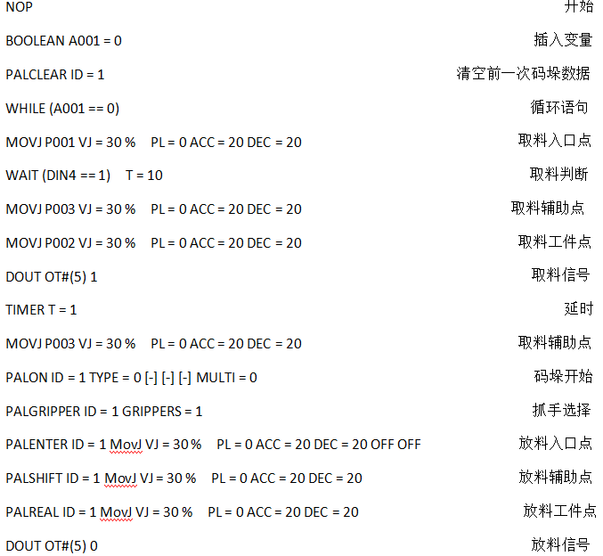

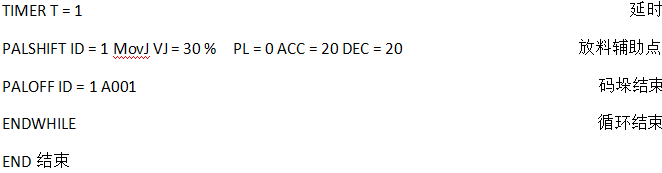

### 情景8------卸垛

#### 参数设置

1.  点击右侧【菜单栏-工艺-码垛工艺-完整码垛】。

2.  根据实际情况选择工艺号，此处选择工艺号1。

3.  点击抓手设置。

4.  选择抓手，根据实际情况选择，此处选择抓手个数1，抓手工具号1（抓手工具号即工具手号，抓手需要先到【设置-工具手标定】界面设置），此处只可以选择不能标定，点击保存。

5.  点击下一页进入托盘设置（也可点击返回导航再进入托盘设置）。

6.  根据实际托盘标定托盘坐标系（用户坐标系），点击保存。

**注：标定托盘时需要带工具手标定，标定的坐标系Z轴不能朝下。**

7.  点击下一页进入位置设置（也可点击返回导航再进入位置设置）。

8.  根据实际情况标定工件点、辅助点、入口点，点击保存。

**注：标定时需要带工具手标定，卸垛工件点仍按照码垛标定，卸垛是将从最高层的最后一个工件开始码。**

9.  点击下一页进入工件参数设置（也可点击返回导航再进入工件参数设置）。

10. 根据实际情况填写工件尺寸参数，此处设置为长"50"、宽"30"、高"15"，间隙为0，点击保存。

11. 点击下一页进入接近参数设置（也可点击返回导航再进入接近参数设置）。

12. 根据实际情况设置，如果不需要可直接跳过。

13. 点击下一页进入重叠模式设置（也可点击返回导航再进入重叠模式）。

14. 层数根据实际情况填写，此处层数设置为"10"、重复关系设置为"相同"、第一层图形编号选择"1"、其他参数不填，点击保存。

15. 点击下一页进入平面模式设置（也可点击返回导航再进入平面模式）。

16. 选择图形编号"1"、模板选择"纵横交错"、X方向个数填"1"、Y方向个数填"3"、其他参数默认不填，点击保存，点击预览可查看设置的图形模板。

**注：整体旋转是以第一个工件中心整体旋转180度。**

17. 点击结束完成工艺号1参数设置。

#### 编写程序

NOP //开始

BOOLEAN A001 = 0 //插入变量

PALCLEAR ID = 1 //清空前一次码垛数据

WHILE (A001 == 0) //循环指令

PALON ID = 1 TYPE = 1 \[-\] \[-\] \[-\] MULTI = 0 //卸垛开始

PALGRIPPER ID = 1 GRIPPERS = 1 //选择抓手

PALENTER ID = 1 MovJ VJ = 20 % PL = 0 ACC = 20 DEC = 20 OFF OFF
//取料入口点

WAIT (DIN4 == 1) T = 10 //取料判断

PALSHIFT ID = 1 MovJ VJ = 20 % PL = 0 ACC = 20 DEC = 20 //取料辅助点

PALREAL ID = 1 MovJ VJ = 20 % PL = 0 ACC = 20 DEC = 20 //取料工件点

DOUT OT#(5) 1 //取料信号

TIMER T = 1 //延时

PALSHIFT ID = 1 MovJ VJ = 20 % PL = 0 ACC = 20 DEC = 20 //取料辅助点

PALOFF ID = 1 A001 //卸垛结束

MOVJ P001 VJ = 30 % PL = 0 ACC = 20 DEC = 20 //放料入口点

MOVJ P003 VJ = 30 % PL = 0 ACC = 20 DEC = 20 //放料辅助点

MOVJ P002 VJ = 30 % PL = 0 ACC = 20 DEC = 20 //放料工件点

DOUT OT#(5) 0 //放料信号

TIMER T = 1 //延时

MOVJ P003 VJ = 30 % PL = 0 ACC = 20 DEC = 20 //放料辅助点

ENDWHILE //循环结束

END //结束

### 情景9------卸垛后码垛

#### 参数设置

- **卸垛参数**

1.  点击右侧【菜单栏-工艺-码垛工艺-完整码垛】。

2.  根据实际情况选择工艺号，此处选择工艺号1。

3.  点击抓手设置。

4.  选择抓手，根据实际情况选择，此处选择抓手个数1，抓手工具号1（抓手工具号即工具手号，抓手需要先到【设置-工具手标定】界面设置），此处只可以选择，点击保存。

5.  点击下一页进入托盘设置（也可点击返回导航再进入托盘设置）。

6.  根据实际托盘标定托盘坐标系（用户坐标系），点击保存。

**注：标定托盘时需要带工具手标定，标定的坐标系Z轴不能朝下。**

7.  点击下一页进入位置设置（也可点击返回导航再进入位置设置）。

8.  根据实际情况标定工件点、辅助点、入口点，点击保存。

**注：标定时需要带工具手标定，卸垛工件点仍按照码垛标定，卸垛是将从最高层的最后一个工件开始码。**

9.  点击下一页进入工件参数设置（也可点击返回导航再进入工件参数设置）。

10. 根据实际情况填写工件尺寸参数，此处设置为长"50"、宽"30"、高"15"，间隙为0，点击保存。

11. 点击下一页进入接近参数设置（也可点击返回导航再进入接近参数设置）。

12. 根据实际情况设置，如果不需要可直接跳过。

13. 点击下一页进入重叠模式设置（也可点击返回导航再进入重叠模式）。

14. 层数根据实际情况填写，此处层数设置为"10"、重复关系设置为"相同"、第一层图形编号选择"1"、其他参数不填，点击保存。

15. 点击下一页进入平面模式设置（也可点击返回导航再进入平面模式）。

16. 选择图形编号"1"、模板选择"纵横交错"、X方向个数填"1"、Y方向个数填"3"、其他参数默认不填，点击保存，点击预览可查看设置的图形模板。

**注：整体旋转是以第一个工件中心整体旋转180度。**

17. 点击结束完成工艺号1参数设置。

- **码垛参数**

1.  点击完整码垛。

2.  选择工艺号2，按照工艺号1的步骤填写工艺号2的参数。

**注：卸垛参数与码垛参数一致。**

#### 编写程序

NOP //开始

BOOLEAN A001 = 0 //插入变量

BOOLEAN A002 = 0 //插入变量

PALCLEAR ID = 1 //清空前一次卸垛数据

PALCLEAR ID = 2 //清空前一次码垛数据

WHILE (A001 == 0) //循环指令

PALON ID = 1 TYPE = 1 \[-\] \[-\] \[-\] MULTI = 0 //卸垛开始

PALGRIPPER ID = 1 GRIPPERS = 1 //选择抓手

PALENTER ID = 1 MovJ VJ = 20 % PL = 0 ACC = 20 DEC = 20 OFF OFF
//取料入口点

WAIT (DIN4 == 1) T = 10 //取料判断

PALSHIFT ID = 1 MovJ VJ = 20 % PL = 0 ACC = 20 DEC = 20 //取料辅助点

PALREAL ID = 1 MovJ VJ = 20 % PL = 0 ACC = 20 DEC = 20 //取料工件点

DOUT OT#(5) 1 //取料信号

TIMER T = 1 //延时

PALSHIFT ID = 1 MovJ VJ = 20 % PL = 0 ACC = 20 DEC = 20 //取料辅助点

PALOFF ID = 1 //卸垛结束

PALON ID = 2 TYPE = 0 \[-\] \[-\] \[-\] MULTI = 0 //码垛开始

PALGRIPPER ID = 2 GRIPPERS = 1 //选择抓手

PALENTER ID = 2 MovJ VJ = 30 % PL = 0 ACC = 20 DEC = 20 OFF OFF
//放料入口点

PALSHIFT ID = 2 MovJ VJ = 30 % PL = 0 ACC = 20 DEC = 20 //放料辅助点

PALREAL ID = 2 MovJ VJ = 30 % PL = 0 ACC = 20 DEC = 20 //放料工件点

DOUT OT#(5) 0 //放料信号

TIMER T = 1 //延时

PALSHIFT ID = 2 MovJ VJ = 30 % PL = 0 ACC = 20 DEC = 20 //放料辅助点

PALOFF ID = 2 A001 //码垛结束

ENDWHILE //循环结束

### 情景10------码垛中断，继续码垛

#### 参数设置

1.  码垛开始前工艺参数设置。

2.  中断后工艺参数设置。

3.  打开【状态-码垛状态】。

4.  工艺号选择工艺参数设置时选择的工艺号，这里选择之前设置的工艺号1。

5.  若之前设置已码到了第1层第5个。

6.  则当前层数填"1"、当前层已码工件数填"5"，点击保存。

#### 编写程序

NOP //开始

BOOLEAN A001 = 0 //插入变量

PALCLEAR ID = 1 //清空前一次码垛数据

WHILE (A001 == 0) //循环语句

MOVJ P001 VJ = 30 % PL = 0 ACC = 20 DEC = 20 //取料入口点

WAIT (DIN4 == 1) T = 10 //取料判断

MOVJ P003 VJ = 30 % PL = 0 ACC = 20 DEC = 20 //取料辅助点

MOVJ P002 VJ = 30 % PL = 0 ACC = 20 DEC = 20 //取料工件点

DOUT OT#(5) 1 //取料信号

TIMER T = 1 //延时

MOVJ P003 VJ = 30 % PL = 0 ACC = 20 DEC = 20 //取料辅助点

PALON ID = 1 TYPE = 0 \[-\] \[-\] \[-\] MULTI = 0 //码垛开始

PALGRIPPER ID = 1 GRIPPERS = 1 //抓手选择

PALENTER ID = 1 MovJ VJ = 30 % PL = 0 ACC = 20 DEC = 20 OFF OFF
//放料入口点

PALSHIFT ID = 1 MovJ VJ = 30 % PL = 0 ACC = 20 DEC = 20 //放料辅助点

PALREAL ID = 1 MovJ VJ = 30 % PL = 0 ACC = 20 DEC = 20 //放料工件点

DOUT OT#(5) 0 //放料信号

TIMER T = 1 // 延时

PALSHIFT ID = 1 MovJ VJ = 30 % PL = 0 ACC = 20 DEC = 20 // 放料辅助点

PALOFF ID = 1 A001 //码垛结束

ENDWHILE // 循环结束

END // 结束

### 情景11------多抓手配合码垛

#### 参数设置

1.  点击右侧【菜单栏-工艺-码垛工艺-完整码垛】。

2.  根据实际情况选择工艺号，此处选择工艺号1。

3.  点击抓手设置。

4.  选择抓手，根据实际情况选择，此处选择抓手个数"4"，抓手1工具号选"2"、抓手2工具号选"4"、抓手3工具号选"5"、抓手4工具号选"1"、（抓手工具号即工具手号，抓手需要先到【设置-工具手标定】界面设置），此处只可以选择，点击保存。

5.  点击下一页进入托盘设置（也可点击返回导航再进入托盘设置）。

6.  根据实际托盘标定托盘坐标系（用户坐标系），点击保存（注：标定托盘时需要带工具手标定（带其中任意一抓手标定即可），标定的坐标系Z轴不能朝下）。

7.  点击下一页进入位置设置（也可点击返回导航再进入位置设置）。

8.  根据实际情况标定工件点、辅助点、入口点，点击保存（注：标定时需要带工具手标定）。

9.  点击下一页进入工件参数设置（也可点击返回导航再进入工件参数设置）。

10. 根据实际情况填写工件尺寸参数，此处设置为长"50"、宽"30"、高"15"、间隙为0，点击保存。

11. 点击下一页进入接近参数设置（也可点击返回导航再进入接近参数设置，根据实际情况设置，如果不需要可直接跳过）。

12. 点击下一页进入重叠模式设置（也可点击返回导航再进入重叠模式）。

13. 层数根据实际情况填写，此处层数设置为"10"、重复关系设置为"相同"、第一层图形编号选择"1"、其他参数不填，点击保存。

14. 点击下一页进入平面模式设置（也可点击返回导航再进入平面模式）。

15. 选择图形编号"1"、模板选择"纵横交错"、X方向个数填"1"、Y方向个数填"3"、其他参数默认不填，点击保存，点击预览可查看设置的图形模板（注：整体旋转是以第一个工件中心整体旋转180度）。

16. 点击结束完成参数设置。

####  编写程序

NOP //开始

PALCLEAR ID = 1 //码垛复位

WHILE {(GB001 == 0)} //循环语句

MOVJ P0001 VJ = 50 % PL = 0 ACC = 50 DEC = 50 0 //取料安全点

MOVJ P0002 VJ = 50 % PL = 0 ACC = 50 DEC = 50 0 //取料上方点

MOVJ P0003 VJ = 50 % PL = 0 ACC = 50 DEC = 50 0 //取料点

DOUT OT#(1) 1 T = 0 0 //取料信号

TIMER T = 1 //延时1s

MOVJ P0002 VJ = 50 % PL = 0 ACC = 50 DEC = 50 0 //取料上方点

PALON ID = 1 TYPE = 0 GI001 GI002 GI003 MULTI = 0 //码垛开始

SWITCHTOOL (1) //切换工具坐标1

PALGRIPPER ID = 1 GRIPPERS = 1 //切换抓手工具1

PALSHIFT ID = 1 MOVJ VJ = 50 % PL = 0 ACC = 20 DEC = 20 0 //码垛辅助点

PALREAL ID = 1 MOVJ VJ = 50 % PL = 0 ACC = 20 DEC = 20 0 //码垛工件点

DOUT OT#(1) 0 T = 0 0 //放料信号

TIMER T = 1 //延时1s

PALSHIFT ID = 1 MOVJ VJ = 50 % PL = 0 ACC = 20 DEC = 20 0 //码垛辅助点

PALOFF ID = 1 GB001 //码垛结束判断

PALON ID = 1 TYPE = 0 GI001 GI002 GI003 MULTI = 0 //码垛开始

SWITCHTOOL (2) //切换工具坐标2

PALGRIPPER ID = 1 GRIPPERS = 2 //切换抓手工具2

PALSHIFT ID = 1 MOVJ VJ = 50 % PL = 0 ACC = 20 DEC = 20 0 //码垛辅助点

PALREAL ID = 1 MOVJ VJ = 50 % PL = 0 ACC = 20 DEC = 20 0 //码垛工件点

DOUT OT#(1) 0 T = 0 0 //放料信号

TIMER T = 1 //延时1s

PALSHIFT ID = 1 MOVJ VJ = 50 % PL = 0 ACC = 20 DEC = 20 0 //码垛辅助点

PALOFF ID = 1 GB001 //码垛结束判断

ENDWHILE //结束循环

END //结束

### 情景12（1）------ 一线两垛（两个垛堆工件数量相同）

#### 概述

说明：接近使能关闭程序不会生成码垛接近点指令（打开使能则相反），接近方式分两种分别为接近下降和下降接近。

接近下降：例如：按照上面所设置的接近参数，接近点的位置距离工件点的位置X方向相差50，Y方向相差50，Z方向相差50，用设定好的的接近方式从接近点移动到工件点。

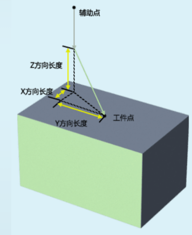

下降接近：例如：按照上面所设置的接近参数，辅助点的位置离工件点的X方向相差50，Y方向相差50，用设定好的接近方式从辅助点移动到接近点（工件点上方50的距离），再从接近点垂直下降到工件点。

托盘检测：托盘总数设置范围为【1-5】，固定绑定的IO口为2-1\~2-5口，程序会自动检测IO是否打开或者关闭来判断托盘的数量，例如当托盘总数为'3'，托盘厚度为'10'mm。启动程序时会自动检测IO
2-1 ，2-2 ，2-3
是否打开，当托盘数量减少一个时候（2-1或2-2或2-3任意关闭一个），所有工件点的z轴方向都会减少10mm。

#### 参数设置

1.  点击【菜单栏-工艺-码垛工艺-码垛参数-完整码垛】。

2.  根据实际情况选择工艺号，此处第一个垛堆选择工艺号1。

3.  点击抓手设置，现场根据实际情况来选择，例如：抓手个数"1"，抓手1工具号"1"（抓手工具号即工具手号，抓手需要先到【设置-工具手标定】界面设置），修改完成后点击保存。

4.  点击下一页进入托盘设置（也可点击返回导航再进入托盘设置），根据实际托盘标定托盘坐标系（用户坐标系）。选中用户坐标系首先标定托盘的原点、托盘的x轴的正方向、托盘的y轴的正方向，标定完成后必须点击计算。没有标定的z轴正方向是系统已经按照标定的x、y轴正方向自动计算出来，全部标定完成后点击保存（注：标定托盘时需要带工具手标定\--带其中任意一抓手标定即可，标定的坐标系Z轴不能朝下）。

5.  点击下一页进入位置设置（也可点击返回导航再进入位置设置），根据实际情况标定工件点，辅助点，入口点，点击保存。

6.  点击下一页进入工件参数，根据实际情况设置工件大小，此处设置为长"50"、宽"50"、高"50"，间隙为10，（托盘的y正方向为工件的长，托盘的x方向为工件的宽，托盘的z方向为工件的高，间隙是工件与工件之间空出来的地方），填写完成后点击保存。

7.  点击下一页进入接近参数设置（也可点击返回导航再进入接近参数设置），设置接近方式和托盘检测。根据实际情况选择是否打开，此处打开接近使能开关和托盘检测开关，托盘X方向长度'50'，托盘Y方向长度'50'，托盘Z方向长度'50'，托盘厚度'10'，托盘总数'3'。

8.  点击下一页进入重叠模式（也可点击返回导航再进入重叠模式），层数根据实际情况填写，此处层数设置为'2'，重复关系设置为'相同'，第一层图形编号选择"1"、其他参数不填，（层数为工件总层数，重复关系为每一层摆放的关系）点击保存。

9.  点击下一页进入平面模式（也可点击返回导航再进入平面模式），选择图形编号"1"、模板选择"行列"、X方向个数填"2"、Y方向个数填"1"、其他参数默认不填，点击保存，点击预览可查看设置的图形模板（注：整体旋转是以第一个工件中心整体旋转180度）。

10. 点击结束完成参数设置。

11. 按以上方法根据实际情况设置第二个垛堆，工艺号选择2，（注意；工艺号2中的用户坐标系需要根据实际情况重新标定或者使用工艺号1中设置好的用户坐标系1）。

#### 编写程序

NOP // 开始

PALCLEAR ID = 1 //码垛复位 工艺号1

PALCLEAR ID = 2 //码垛复位 工艺号2

WHILE (B001 == 0) //循环语句

PALON ID = 1 TYPE = 0 \[-\] \[-\] \[-\] MULTI = 0 //1号码垛开始

PALGRIPPER ID = 1 GRIPPERS = 1 //抓手选择

MOVJ P001 VJ = 50 % PL = 5 ACC = 10 DEC = 10 0 //取料安全点

MOVJ P002 VJ = 50 % PL = 5 ACC = 10 DEC = 10 0 //取料上方点

MOVJ P003 VJ = 50 % PL = 5 ACC = 10 DEC = 10 0 //取料点

DOUT OT#(1) 1 T = 0 0 //取料信号

TIMER T = 1 //延时1s

MOVJ P002 VJ = 50 % PL = 5 ACC = 10 DEC = 10 0 //取料上方点

PALENTER ID = 1 MovJ VJ = 50 % PL = 5 ACC = 10 DEC = 10 OFF OFF 0
//放料入口点

PALSHIFT ID = 1 MovJ VJ = 50 % PL = 5 ACC = 10 DEC = 10 0 //放料辅助点

PALAPPRO ID = 1 MovJ VJ = 50 % PL = 0 ACC = 20 DEC = 20 0 //放料接近点

PALREAL ID = 1 MovJ VJ = 50 % PL = 5 ACC = 10 DEC = 10 0 //放料工件点

DOUT OT#(1) 0 T = 0 0 //放料信号

TIMER T = 1 //延时1s

PALAPPRO ID = 1 MovJ VJ = 50 % PL = 0 ACC = 20 DEC = 20 0 //放料接近点

PALSHIFT ID = 1 MovJ VJ = 50 % PL = 5 ACC = 10 DEC = 10 0 //放料辅助点

PALOFF ID = 1 //码垛结束判断

PALON ID = 2 TYPE = 0 \[-\] \[-\] \[-\] MULTI = 0 //2号码垛开始

PALGRIPPER ID = 2 GRIPPERS = 1 //抓手选择

MOVJ P001 VJ = 50 % PL = 5 ACC = 10 DEC = 10 0 //取料安全点

MOVJ P002 VJ = 50 % PL = 5 ACC = 10 DEC = 10 0 //取料上方点

MOVJ P003 VJ = 50 % PL = 5 ACC = 10 DEC = 10 0 //取料点

DOUT OT#(1) 1 T = 0 0 // 取料信号

TIMER T = 1 //延时1s

MOVJ P002 VJ = 50 % PL = 5 ACC = 10 DEC = 10 0 //取料上方点

PALENTER ID = 2 MovJ VJ = 50 % PL = 5 ACC = 10 DEC = 10 OFF OFF 0
//放料入口点

PALSHIFT ID = 2 MovJ VJ = 50 % PL = 5 ACC = 10 DEC = 10 0 //放料辅助点

PALAPPRO ID = 1 MovJ VJ = 50 % PL = 0 ACC = 20 DEC = 20 0 //放料接近点

PALREAL ID = 2 MovJ VJ = 50 % PL = 5 ACC = 10 DEC = 10 0 //放料工件点

DOUT OT#(1) 0 T = 0 0 //放料信号

TIMER T = 1 //延时1s

PALAPPRO ID = 1 MovJ VJ = 50 % PL = 0 ACC = 20 DEC = 20 0 //放料接近点

PALSHIFT ID = 2 MovJ VJ = 50 % PL = 5 ACC = 10 DEC = 10 0 //放料辅助点

PALOFF ID = 2 B001 //码垛工艺号2和循环结束判断

ENDWHILE //结束循环

END //结束

### 情景12（2）------ 一线两垛（两个垛堆工件数量不相同）

说明：接近使能关闭程序不会生成码垛接近点指令（打开使能则相反），接近方式分两种分别为接近下降和下降接近。

接近下降：例如：按照上面所设置的接近参数，接近点的位置距离工件点的位置X方向相差50，Y方向相差50，Z方向相差50，用设定好的的接近方式从接近点移动到工件点，如下图：

下降接近：例如：按照上面所设置的接近参数，辅助点的位置离工件点的X方向相差50，Y方向相差50，用设定好的接近方式从辅助点移动到接近点（工件点上方50的距离），再从接近点垂直下降到工件点。

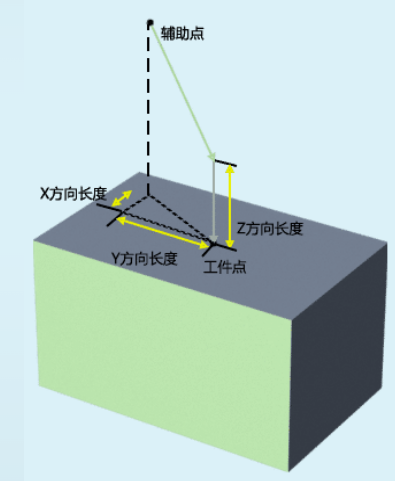

托盘检测：托盘总数设置范围为【1-5】，固定绑定的IO口为2-1\~2-5口，程序会自动检测IO是否打开或者关闭来判断托盘的数量，例如当托盘总数为'3'，托盘厚度为'10'mm。启动程序时会自动检测IO
2-1 ，2-2 ，2-3
是否打开，当托盘数量减少一个时候（2-1或2-2或2-3任意关闭一个），所有工件点的z轴方向都会减少10mm。

#### 参数设置

1.  点击【菜单栏-工艺-码垛工艺-码垛参数-完整码垛】。

2.  根据实际情况选择工艺号，此处第一个垛堆选择工艺号1。

3.  点击抓手设置，现场根据实际情况来选择，例如：抓手个数"1"，抓手1工具号"1"（抓手工具号即工具手号，抓手需要先到【设置-工具手标定】界面设置），修改完成后点击保存。

4.  点击下一页进入托盘设置（也可点击返回导航再进入托盘设置），根据实际托盘标定托盘坐标系（用户坐标系）。选中用户坐标系首先标定托盘的原点，托盘的x轴的正方向，托盘的y轴的正方向，标定完成后必须点击计算。没有标定的z轴正方向是系统已经按照标定的x，y轴正方向自动计算出来。全部标定完成后点击保存（注：标定托盘时需要带工具手标定（带其中任意一抓手标定即可），标定的坐标系Z轴不能朝下）。

5.  点击下一页进入位置设置（也可点击返回导航再进入位置设置），根据实际情况标定工件点、辅助点、入口点，点击保存。

6.  点击下一页进入工件参数，根据实际情况设置工件大小，此处设置为长"50"、宽"50"、高"50"，间隙为10，（托盘的y正方向为工件的长，托盘的x方向为工件的宽，托盘的z方向为工件的高，间隙是工件与工件之间空出来的地方），填写完成后点击保存。

7.  点击下一页进入接近参数设置（也可点击返回导航再进入接近参数设置），设置接近方式和托盘检测。根据实际情况选择是否打开，此处打开接近使能开关和托盘检测开关，托盘X方向长度'50'，托盘Y方向长度'50'，托盘Z方向长度'50'，托盘厚度'10'，托盘总数'3'。

8.  .点击下一页进入重叠模式（也可点击返回导航再进入重叠模式），层数根据实际情况填写，此处层数设置为'2'，重复关系设置为'相同'，第一层图形编号选择"1"、其他参数不填，（层数为工件总层数，重复关系为每一层摆放的关系）点击保存。

9.  点击下一页进入平面模式（也可点击返回导航再进入平面模式），选择图形编号"1"、模板选择"行列"、X方向个数填"2"、Y方向个数填"1"、其他参数默认不填，点击保存，点击预览可查看设置的图形模板（注：整体旋转是以第一个工件中心整体旋转180度）。

10. 点击结束完成参数设置。

11. 按以上方法根据实际情况设置第二个垛堆，工艺号选择2，（注意：工艺号2中的用户坐标系需要根据实际情况重新标定，或者使用工艺号1中设置好的用户坐标系1）。

#### 编写程序

NOP //开始

PALCLEAR ID = 1 //码垛复位 工艺号1

PALCLEAR ID = 2 //码垛复位 工艺号2

WHILE {(B003 == 0)} // 循环语句

IF {(B001 == 0)} //执行1号垛堆的 if判断语句

PALON ID = 1 TYPE = 0 \[-\] \[-\] \[-\] MULTI = 0 //1号码垛开始

PALGRIPPER ID = 1 GRIPPERS = 1 //抓手选择

MOVJ P001 VJ = 50 % PL = 0 ACC = 20 DEC = 20 0 //取料安全点

MOVJ P002 VJ = 50 % PL = 0 ACC = 20 DEC = 20 0 //取料上方点

MOVJ P003 VJ = 50 % PL = 0 ACC = 20 DEC = 20 0 //取料点

DOUT OT#(1) 1 T = 0 0 //取料信号

TIMER T = 1 //延时1s

MOVJ P002 VJ = 50 % PL = 0 ACC = 20 DEC = 20 0 //取料上方点

PALENTER ID = 1 MovJ VJ = 50 % PL = 0 ACC = 20 DEC = 20 OFF OFF 0
//放料入口点

PALSHIFT ID = 1 MovJ VJ = 50 % PL = 0 ACC = 20 DEC = 20 0 //放料辅助点

PALAPPRO ID = 1 MovJ VJ = 50 % PL = 0 ACC = 20 DEC = 20 0 //放料接近点

PALREAL ID = 1 MovJ VJ = 50 % PL = 0 ACC = 20 DEC = 20 0 //放料点

DOUT OT#(1) 0 T = 0 0 //放料信号

TIMER T = 1 //延时1s

PALAPPRO ID = 1 MovJ VJ = 50 % PL = 0 ACC = 20 DEC = 20 0 //放料接近点

PALSHIFT ID = 1 MovJ VJ = 50 % PL = 0 ACC = 20 DEC = 20 0 //放料辅助点

PALOFF ID = 1 B001 //1号码垛结束判断

ENDIF //结束如果

IF {(B002 == 0)} //执行2号垛堆的if判断语句

PALON ID = 2 TYPE = 0 \[-\] \[-\] \[-\] MULTI = 0 //2号垛堆开始

PALGRIPPER ID = 2 GRIPPERS = 1 //抓手选择

MOVJ P001 VJ = 50 % PL = 0 ACC = 20 DEC = 20 0 //取料安全点

MOVJ P002 VJ = 50 % PL = 0 ACC = 20 DEC = 20 0 //取料上方点

MOVJ P003 VJ = 50 % PL = 0 ACC = 20 DEC = 20 0 //取料点

DOUT OT#(1) 1 T = 0 0 //取料信号

TIMER T = 1 //延时1s

MOVJ P002 VJ = 50 % PL = 0 ACC = 20 DEC = 20 0 //取料上方点

PALENTER ID = 2 MovJ VJ = 50 % PL = 0 ACC = 20 DEC = 20 OFF OFF 0
//放料入口点

PALSHIFT ID = 2 MovJ VJ = 50 % PL = 0 ACC = 20 DEC = 20 0 //放料辅助点

PALAPPRO ID = 2 MovJ VJ = 50 % PL = 0 ACC = 20 DEC = 20 0 //放料接近点

PALREAL ID = 2 MovJ VJ = 50 % PL = 0 ACC = 20 DEC = 20 0 //放料点

DOUT OT#(1) 0 T = 0 0 //放料信号

TIMER T = 1 //延时1s

PALAPPRO ID = 2 MovJ VJ = 50 % PL = 0 ACC = 20 DEC = 20 0 //放料接近点

PALSHIFT ID = 2 MovJ VJ = 50 % PL = 0 ACC = 20 DEC = 20 0 //放料辅助点

PALOFF ID = 2 B002 //2号垛堆结束判断

ENDIF //结束如果

IF {(B001 == 1)} AND {(B002 == 1)} //判断1号垛堆和2号垛堆是否都结束

SETBOOL B003 = 1 //跳出循环的变量

ENDIF //结束如果

ENDWHILE //结束循环

END //结束

## 码垛工艺报错码及处理方法

| 报警号 | 类型 | 内容详情 | 报警原因 | 处理方案 |
| :--- | :--- | :--- | :--- | :--- |
| 25361 | 错误 | 机器人1的1号垛堆运行错误（垛堆不在工作中） | 未执行码垛开始指令，就执行了码垛其他相关指令 | 先执行码垛开始指令，再执行码垛其他相关指令 |
| 25362 | 错误 | 机器人1的2号垛堆启动失败（目标正在运行中，请勿重复启动） | 执行了码垛开始指令，未执行码垛结束就再次执行码垛开始 | 执行完码垛结束后再进行码垛开始 |
| 25363 | 错误 | 机器人1的垛堆运行错误（垛堆已完成） | 垛堆已经完成，未复位就进行了下次码垛 | 垛堆已经完成后复位，再进行码垛 |
| 25364 | 错误 | 机器人1的%号垛堆启动失败（无效的起始工件数） | 1、工件超出范围 2、程序中有码垛工艺未进行设置 | 1、重新标定范围 2、重新设置未设置的码垛工艺 |
| 25365 | 错误 | 机器人1的1号垛堆运行错误(未设置使用类型) | 码垛工艺号1未设置码垛类型 | 设置码垛工艺号1的码垛类型 |
| 25366 | 错误 | 机器人1的1号垛堆运行错误（目标抓手无效） | 切换抓手指令里的抓手设置与工艺设置的抓手设置不一致 | 修改切换抓手指令里的的抓手设置使其在工艺设置的抓手设置的范围内 |
| 25377 | 警告 | 机器人%d的%d号码垛入口点优化失败(XY) | 开启XY优化码垛入口点指令时码垛的入口点、辅助点、工件点为同一点 | 重新示教入口点、辅助点、工件点 |
| 25378 | 警告 | 机器人%d的%d号码垛入口点优化失败(Z) | 入口点和辅助点高度比较接近 | 重新示教入口的或者辅助点高度 |
| 25379 | | 机器人%d的%d号码垛入口点优化失败(不符合优化条件) | 当前码垛指令不完整 | 插入完整的码垛指令 |
| 25393 | 错误 | 机器人1码垛点位调试工件总数超过999 | 工件总数超过999 | 1、在码垛参数/完整码垛/重叠模式修改层数 2、平面模式重新填写工件个数 |
| 25394 | 错误 | 机器人%d码垛自动计算个数超限 | | |
| 25395 | 错误 | 机器人%d码垛标记层编号超限 | | |
| 25396 | 错误 | 机器人%i指令错误,不支持码垛工艺 | 码垛工艺未被允许 | 打开码垛工艺权限 |
| 25397 | 错误 | 机器人1指令错误，缺少PALLOFF指令 | 1、缺少PALLOFF指令 2、多余PALON指令 | 1、根据需要在相应位置添加PALLOFF指令 2、删除PALON指令 |
| 25398 | 错误 | 机器人1指令错误，缺少对应的PALON指令 | 1、缺少PALLOFF指令 2、多余PALON指令 | 1、根据需要在相应位置添加PALON指令 2、删除PALLOFF指令 |
| 25400 | 错误 | 机器人%i码垛工艺号%i请选择简易码垛 | | |
| 25401 | 错误 | 第%i层，第%i个工件点位不存在 | | |
| 25402 | 错误 | 当前工艺号为完整码垛，请选择其它工艺号 | 简易码垛指令里选择的工艺号的类型设置的是完整码垛 | 重新更换工艺号或将当前工艺号配置为简易码垛 |
| 25403 | 错误 | 超过码垛最大工艺号，请更换工艺号。 | | |
| 25404 | 错误 | 机器人1码垛行列层数不能小于0 | 简易码垛行列层数小于0 | 修改简易码垛行列层数 |
| 25405 | 错误 | 机器人1码垛行列乘积不能大于9999 | 简易码垛行列乘积个数大于9999 | 修改简易码垛行列行数、列数个数 |
| 25406 | 错误 | 码垛总数不能大于99999 | 简易码垛行列层数之间乘积个数大于9999 | 修改简易码垛行列行数、列数、层数个数 |
| 25407 | 警告 | 机器人1码垛点位调试计算中清稍等 | 在平面模式中层工件太多的情况下过速点击下一页或者偏移等按钮，计算跟不上 | 不要过速点击 |

## AI 检索专用问答对 (Q&A for Retrieval)

**Q: 简易码垛和完整码垛有什么区别？**

A: 简易码垛仅提供行列模式垛型使用，只需设置码垛抓手、标记6个位置点（起始工件点、列末端、行末端、高末端、对角末端、辅助点、入口点）。而完整码垛功能更丰富，支持多种垛型模板（行列、纵横交错、回字形、五花垛、自定义），可以设置抓手、托盘、工件参数、接近参数、重叠模式、位置设置、平面模式等详细参数。

**Q: 如何正确设置码垛的抓手？**

A: 首先需要到【设置-工具手标定】界面中标定抓手（工具手），然后在码垛工艺的抓手设置中选择相应的工具手号。对于多个吸盘的情况，如果是分别取料/放料，需要设置多个抓手；如果是同时取料/放料，则设置一个抓手。

**Q: 托盘坐标系如何标定？有什么注意事项？**

A: 在托盘设置界面，需要标定托盘的原点、Y方向和X方向。注意：标定托盘时需要带工具手标定，标定的坐标系Z轴不能朝下。标记X方向与Y方向时一定要以机器人原X、Y方向为基础，否则标记出的托盘Z方向会向下，码垛时第二层会向下码！

**Q: 码垛过程中出现位置不可达的情况怎么办？**

A: 可以在位置调试/附加参数页面，更改相应工件的形态值。例如，当参考点为零点时入口点不可达，可以修改入口点形态值；当参考点为当前时工件点不可达，可以修改工件点、辅助点、入口点的形态值。

**Q: 如何实现码垛过程中的路径优化？**

A: 可以在生成文件时开启XY路径优化和Z路径优化，以优化托盘的XY方向和Z方向的路径。此外，码垛入口点、辅助点、工件点支持门型插补方式，通过走门型轨迹（上升→平移→下降）运动到目标点，从而避免物料摩擦。

**Q: 码垛状态中的已码工件数、当前层数、当前层已码工件数有什么作用？**

A: 这些参数可以用来查看当前码垛状态，如果码垛需从中间开始，可通过设置需要码的层数和个数来实现。例如，当机器人正在进行第一层工件码垛时，可以将当前层数设置为2，然后机器人会进行第二层工件的码垛。

**Q: 码垛开始指令PALON的3个计数变量有什么作用？**

A: PALON指令的3个计数变量（当前已码总数变量、当前码垛层数变量、当前层垛数变量）可以把当前码垛状态的值缓存到设置的变量里，通过读取这些变量可以控制码第几层第几个工件。需要注意的是，这些变量会直接写到配置中，不需要使用写入文件FORCESET指令。

**Q: 如何设置码垛的接近参数？**

A: 在接近参数设置界面，可以设置接近使能、接近方式（下降接近或接近下降）、接近距离（XYZ方向）、接近方向（八个方向）、接近速度、离开速度等参数。接近参数适用于部分大包装并且放置位置比较紧密的场景，且此功能支持任意垛型每个单独工件都可设置进入离开速度以及接近方式。

**Q: 如何使用生成文件功能生成码垛/卸垛程序？**

A: 首先需要提前设置好工艺号内的参数，然后进入生成文件界面，选择工艺号、程序名、功能（码垛/卸垛）、单层码垛/卸垛顺序（正序/倒序），设置抓手电磁阀、取料允许信号、抓手取料成功信号等参数，最后点击生成按钮即可生成标准的码垛/卸垛程序。

## 相关资源

- [工具手标定](./工具手标定.md)

- [用户坐标系标定](./用户坐标系标定.md)
