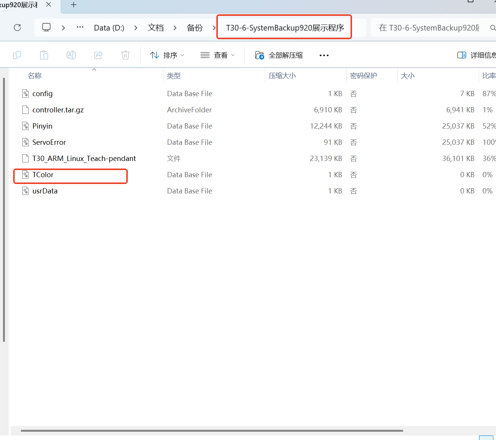
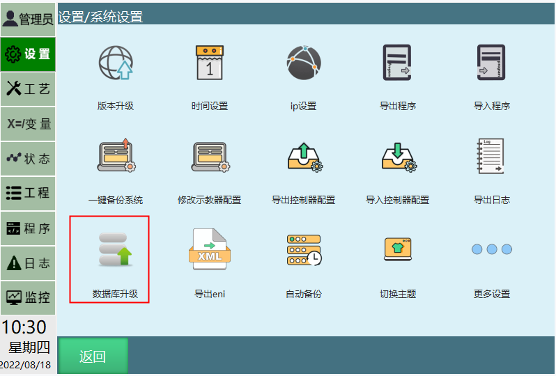
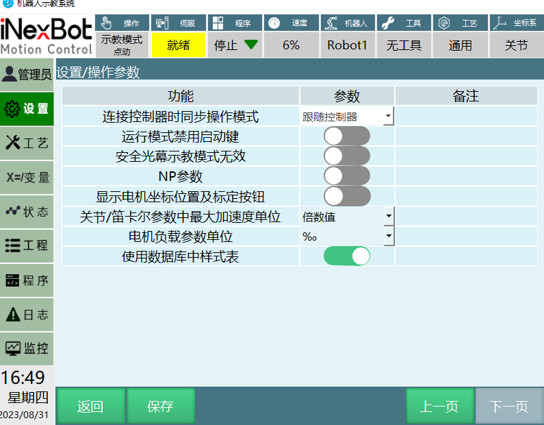
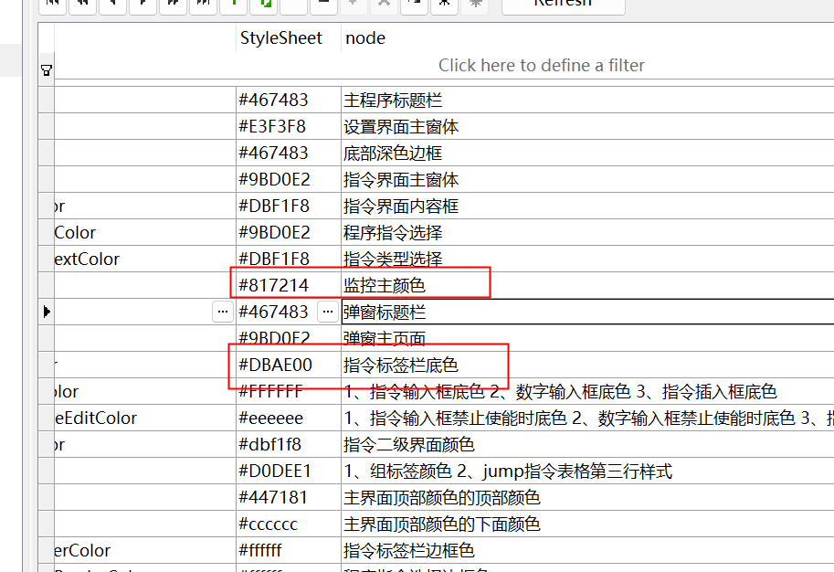

# 示教器修改主题颜色功能教程

## 功能教程

TColor.db 数据库存放主题颜色。

方法如下：

首先找到TColor.db文件路径：

在设置/系统设置/自动备份页面，点击U盘备份，等待一段时间，在U盘中的备份文件压缩包中，找到TColor.db文件。

1. 将示教器设置/操作参数里的使用数据库中样式表按键打开；

2. 用SQL软件打开TColor.db文件，修改数据库对应模块的颜色编码，保存后退出；

3. 颜色编码是RGB编码；

4. 把TColor.db文件，放在U盘根目录下，再去系统设置将数据库升级后重启示教器生效。

---

## AI 检索专用问答对 (Q&A for Retrieval)

**Q: 如果没有TColor.db文件，需要怎么做？**

A: 需要先U盘备份生成.zip文件，解压后，找到TColor.db文件。

**Q: 在修改主题颜色之前，需要在示教器上做什么设置?**

A: 需要将示教器设置/操作参数里的"使用数据库中样式表"按键打开。

**Q: 示教器主题颜色使用的是什么编码格式？**

A: 颜色编码是RGB编码。

**Q: 修改完TColor.db文件后，如何使修改生效？**

A: 把TColor.db文件放在U盘根目录下，再去系统设置将数据库升级后重启示教器生效。

**Q: 如果修改后主题颜色没有变化，可能的原因是什么？**

A: 可能的原因包括：TColor.db文件路径不正确、数据库升级未成功、重启操作未完成等。

---

## 相关资源

- [示教器换图](./示教器换图.md)

- [示教器功能按键说明手册](./示教器功能按键说明手册.md)