# 示教器编程指导教程

## 示教模式操作

用户可以通过使用示教器右上角的【模式选择钥匙】可以在三种模式（"示教模式"、"运行模式"、"远程模式"）间切换。

示教模式下可以完成机器人的系统参数设定、点动操作、作业文件编程等各项操作。

## 单步运行

1.  点击【工程】，打开运行的程序，进入程序指令界面.

2.  选中要进行单步操作的指令行。

3.  按下【DEADMAN】按键，机器人上电。

4.  按下【单步】按键，机器人执行选中行的指令，执行完后停止。

5.  选中行自动下移/上移，若要单步运行下一行指令则再按一次【单步】 按键。

正序运行：

如下图所示，点击【单步】程序从第1行开始运行，第1行运行结束后自动跳行到第2行，再点击【单步】运行第2行指令，依次运行完整个作业文件。

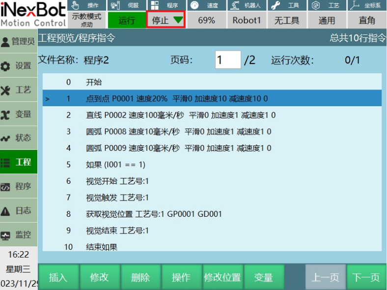

倒序运行：

如下图所示，点击【单步】程序从第4行开始运行，第4行运行结束后自动跳行到第3行，再点击【单步】运行第3行指令，第一行指令运行结束后整个作业文件执行结束。

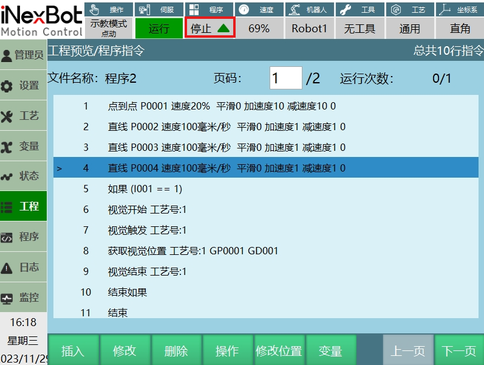

| **注释：**                                                                  |
| :--- |
|  |
| - 点击示教器下方。                                                          |
|  |
| 按键可以切换正序运行、倒序运行。                                            |

## 试运行

1.  试运行功能是示教模式下将【启动】键作为试运行按键，上电按住【启动】键保持运行，松开停止。

2.  试运行模式支持所有指令。

3.  试运行不支持倒序以及后台程序。

如下图所示，一直按下【DEADMAN】按键和【启动】按键会运行完作业文件里面的所用指令。

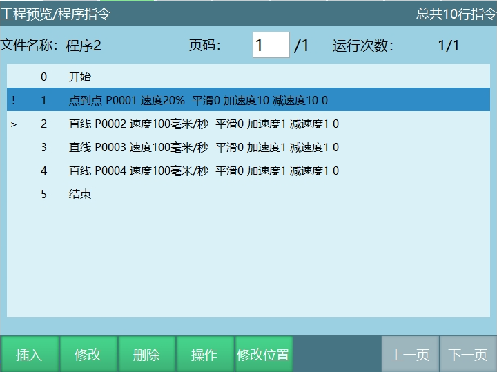

## 示教模式速度

说明：**此处的全局速度**表示示教器状态栏上面的速度。

| 点动速度 | 关节点动速度 |
| :--- | :--- |
| （示教速度) | 关节轴最大点动速度*全局速度 |
| | 设置-机器人参数-点动速度界面修改关节轴最大点动速度参数 |
| | 直角点动速度 |
| | 直角轴最大点动速度*全局速度 |
| | 设置-机器人参数-点动速度界面修改直角轴最大点动速度参数 |
| 单步指令速度 | 单步关节速度 |
| | 全局速度*指令速度*关节额定正速度 |
| | 最大速度限制：关节额定正速度*30% |
| | 单步直角速度 |
| | 全局速度*指令速度 |
| | 最大限制：300mm/s |
| 试运行速度 | 同单步指令速度 |
| 倒序速度 | 同单步指令速度 |
| 回零速度 | 示教速度 |

示例说明：

1.  单步关节速度

如下图所示单步运行点到点指令的关节速度=关节额定正速度\*指令速度20%\*全局速度10%，

每个轴的关节额定正速度可以在关节参数界面去看。

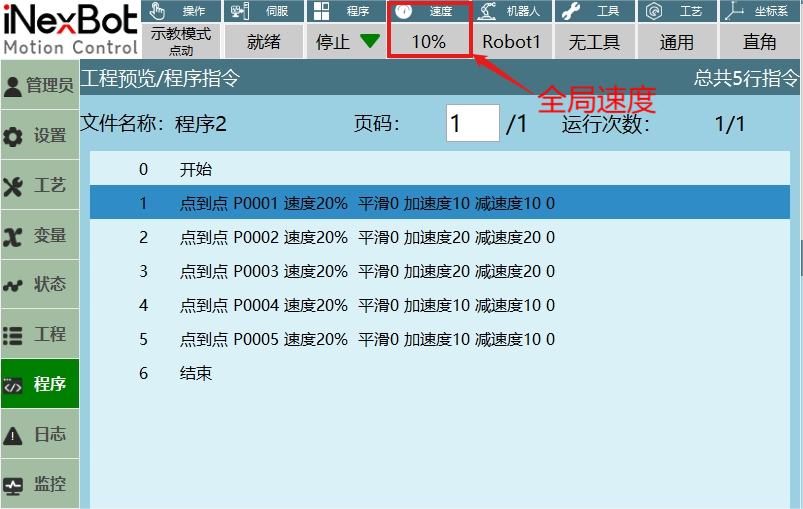

2.  点动关节速度

如下图所示,点动机器人实际点动速度=40°/s \* 80%=32°/s

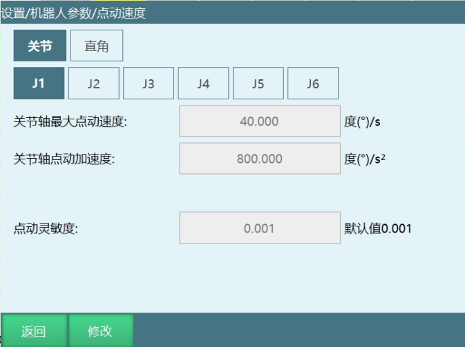

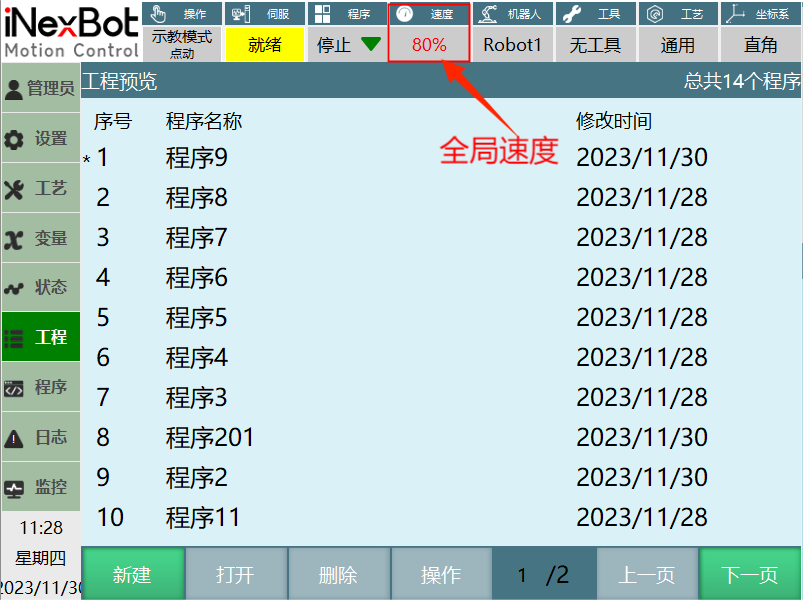

##  运行模式操作

示教模式下作业文件编程结束，将示教器右上方的旋钮切到中间，此时操作模式切换为运行模式，点击示教器上的【启动】按键，开始运行作业文件。

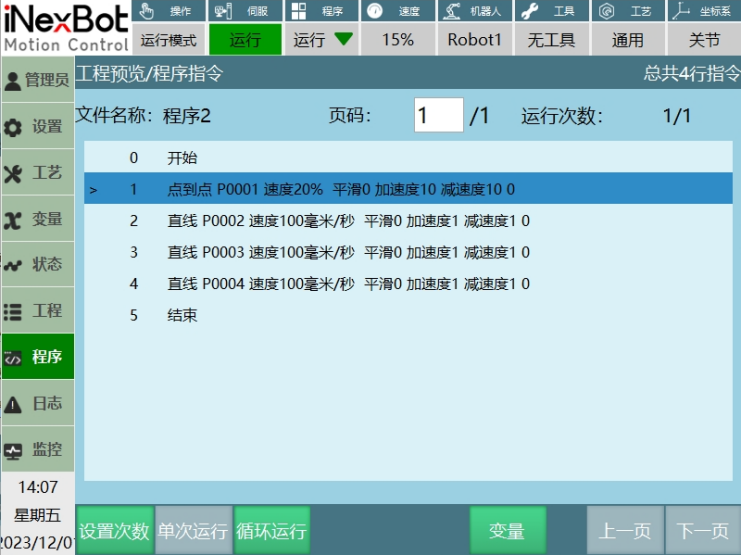

【设置次数】：设置当前作业文件的运行次数，程序在运行时也可以修改运行次数。

如下图所示，点击【设置次数】，设置完运行次数后点击【确定】，程序运行次数设为3次。点击【取消】会取消设置次数的操作。

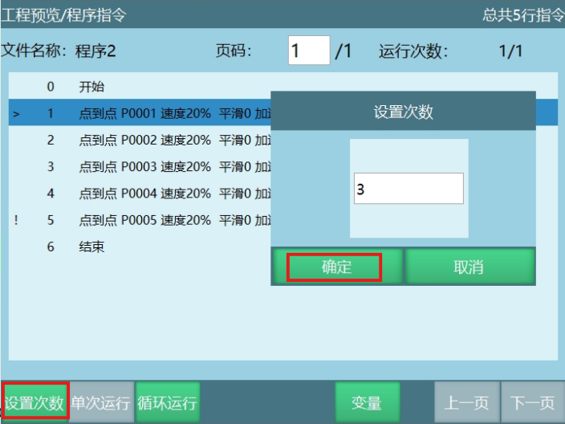

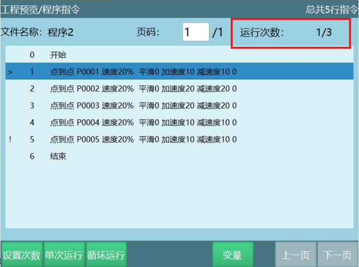

运行模式时程序上方显示的运行次数的格式为：已运行次数/总设置运行次数。

【单次运行】：程序运行次数为1次。

【循环运行】：点击循环运行，程序会无限循环运行。

【变量】：点击变量进入局部位置变量界面，在运行模式时局部变量界面的参数无法修改。

##  运行模式速度

运行模式默认的开机速度是5%，如果需要修改默认速度可以在设置-操作参数界面进行修改，如下图所示。

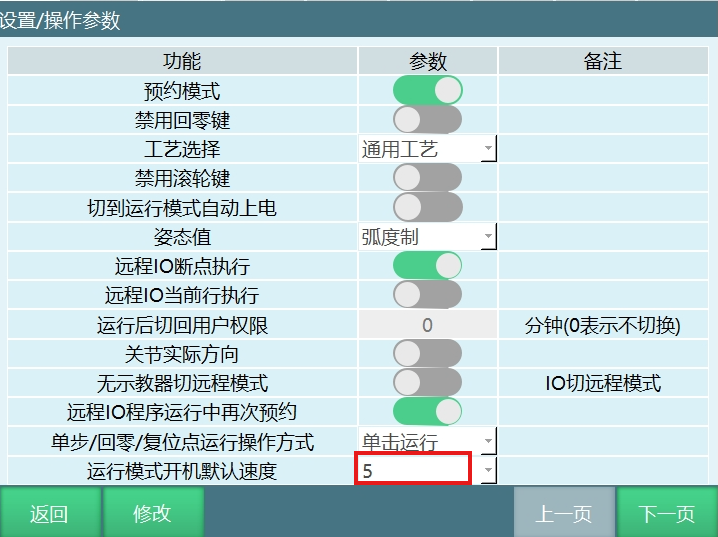

运行模式速度如何计算？

此处的全局速度表示示教器上方状态栏的速度。

| 运行模式 | 关节：最大轴速度=额定正速度*指令速度*全局速度 |
| :--- | :--- |
| | 直角：最大线速度=指令速度*全局速度 |
| | 曲线：以第一条曲线速度为轨迹速度 |

###  加速度参数

加速度倍数越大，表示机器人到达最大加速度的时间越快。

此处的全局速度表示示教器上方状态栏的速度。

1.  点到点指令修改加速度参数

进入【设置-机器人参数-关节参数】调整最大加速度参数

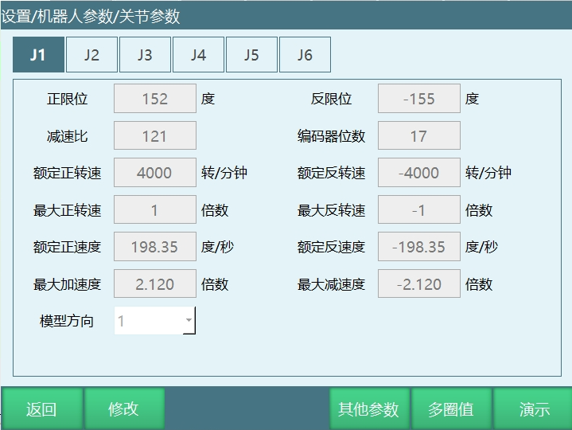

- 最大轴速度=额定速度\*全局速度\*指令速度。

例如：点到点指令，全局速度为50%、指令速度为40%、指令加速度为10%、额定速度为200°/s、最大加速度为4倍。

最大轴速度=200°/s\*50%\*40%=40°/s。

运行到额定速度时间=（额定速度\*全局速度\*指令速度）/（额定速度\*最大加速度\*全局速度\*指令加速度）=（200°/s\*50%\*40%）/（200°/s\*4\*50%\*10%）=1s。

3.  直线指令修改最大加速度参数。

进入【设置-机器人参数-笛卡尔参数】调整最大加速度参数。

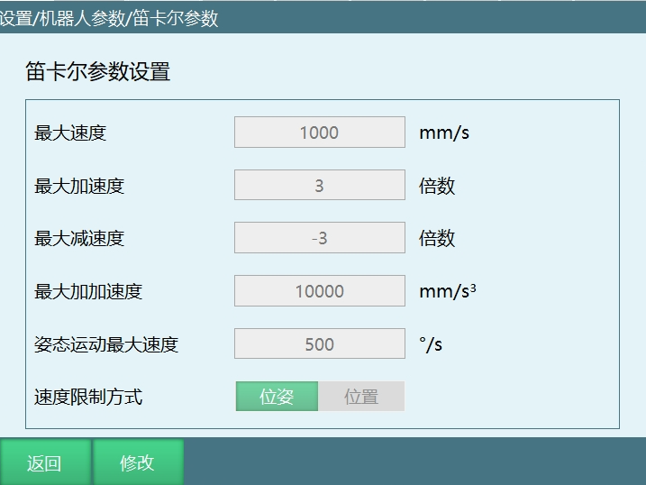

- 最大线速度=全局速度\*指令速度。

例如：直线指令，全局速度为30%、指令速度为1000mm/s、指令加速度为50%、笛卡尔最大速度为2000mm/s、笛卡尔最大加速度为2倍。

最大线速度=全局速度\*指令速度=30%\*1000mm/s =300mm/s。

运行到额定速度时间=（全局速度\*指令速度）/(笛卡尔最大速度\*笛卡尔最大加速度\*指令加速度\*全局速度)
=（30%\*1000mm/s）/（2000mm/s\*2\*50%\*30%）=0.5s。

4.  根据最大正转速，减速比计算额定正速度。

额定正速度=额定正转速 \* 360 / 60 / 减速比。

##  当前行运行

1.  主程序设置当前行

- 在示教模式下打开作业文件，选中需要当前行运行的指令，点击【操作】按键，选择【从此运行】，选中行会出现\>符号。

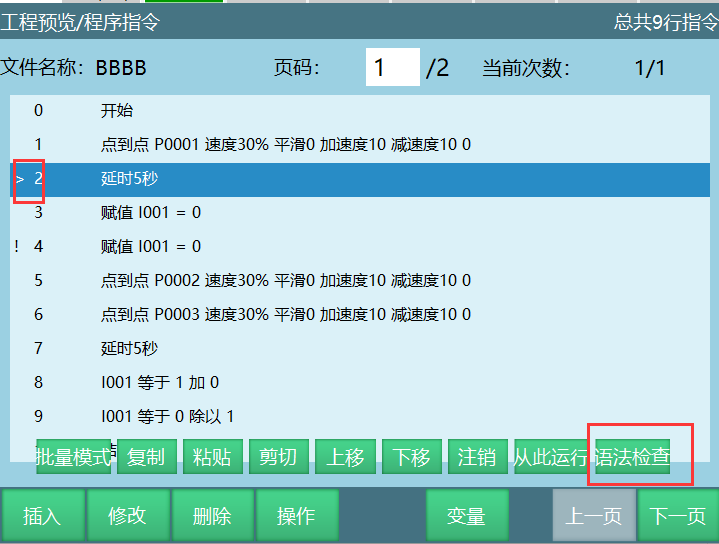

- 操作模式切换运行模式，点击【启动】，根据提示界面点击【确定】程序从选中行开始运行，点击【本程序从头运行】程序开始从第2行开始运行。

2.  子程序设置当前行

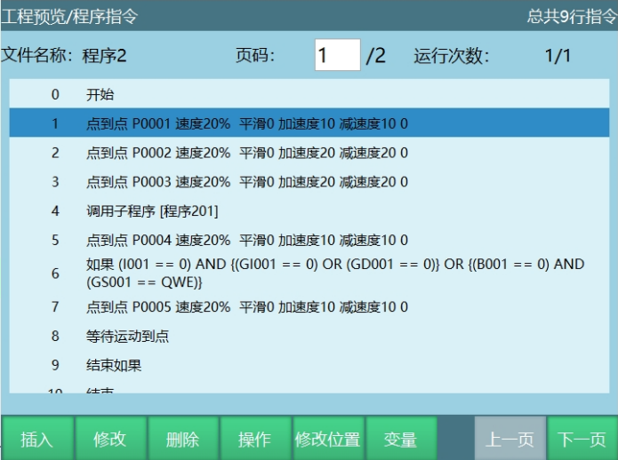

- 主程序里面调用子程序，运行到子程序时将操作模式切换到示教模式。

- 选中某一行，点击【操作】按键，点击【从此运行】，选中行出现\>符号。

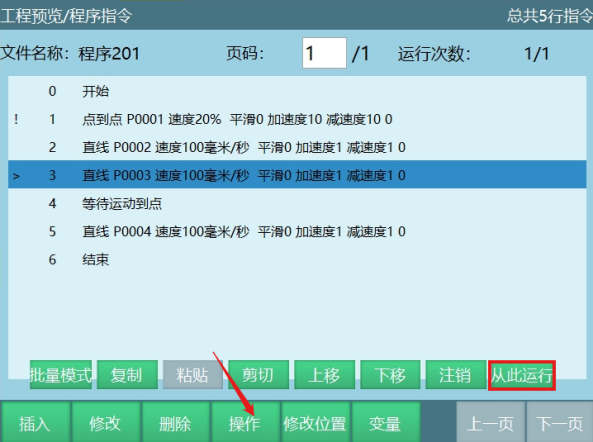

- 切换到运行模式，点击【启动】，根据提示界面点击【确定】程序从选中行第3行开始运行，子程序运行结束后返回到主程序继续执行下一条的指令。

- 点击【本程序从头运行】子程序运行结束后不会返回主程序。

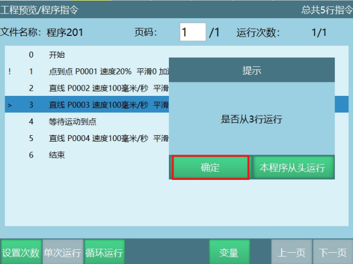

##  断点运行

断点运行：运行程序时进行下电或者其他导致程序运行中断的操作，当程序再次启动运行时从运行中断的点继续运行。

运行模式断点运行举例说明：

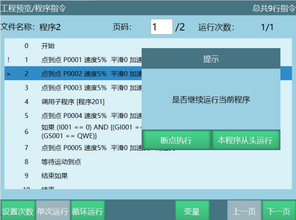

1.  运行模式程序运行过程中（第一条指令除外）,切换至其他模式时导致运行中断，会将中断时的变量状态、程序运行位置存为断点，断点执行不会清状态。

2.  再次切到运行模式点击【启动】时会弹出提示框，选择"断点执行"则从断点处继续运行，选择"重新运行"则断点消失从第一条指令重新运行。

3.  清断点操作：

- 运行模式进行回零、复位、运行其他程序、运行到该点、重启控制器、修改机器人参数。

- 运行模式切到示教模式进行指令的插入/删除/移动/剪切/复制粘贴操作。

- 运行模式切到示教模式数值变量/位置变量/程序指令参数。

- 控制器报错。

例如：程序在运行中切模式，进行回零操作，然后再次切运行发现清除断点，如下图。

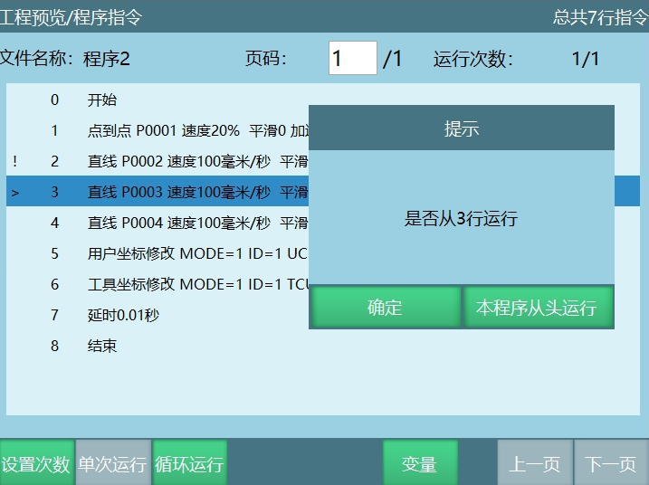

4.  不清除断点操作

例如：

- 运行模式下IO紧急停止/伺服警报/输出信息指令。

- 程序运行时下电退出当前作业文件程序，然后重新运行退出的作业文件。

- 程序运行时下电，切到示教模式点动机器人，然后重新运行退出的作业文件等操作。

##  远程模式操作

### **远程模式控制权说明**

- 当控制系统中同时存在示教器、Modbus设备与IO控制设备时，其控制权优先级为示教器＞Modbus设备\>IO设备。

- 切换到远程模式后控制权切换到触摸屏。若无触摸屏则切换到IO
  控制。此时示教器界面仅显示Modbus 模块、IO模块连接状态、IO程序。

- 同时有触摸屏与I/O模块时，在触摸屏中设置I/O模块使能。

示教模式下作业文件编程结束，将示教器右上方的旋钮切到右边，此时操作模式切换为远程模式。

远程模式如何启动程序:IO启动、Modbus启动。

**远程模式程序运行步骤**：

1.  示教模式编写程序；

2.  设置-远程程序设置界面设置参数；

3.  操作模式切换到远程模式；

4.  选择的作业文件给信号；

5.  作业文件运行。

##  远程模式IO启动程序

###  远程程序设置

点击【设置】-【远程程序设置】，进入远程程序设置界面。

####  远程参数

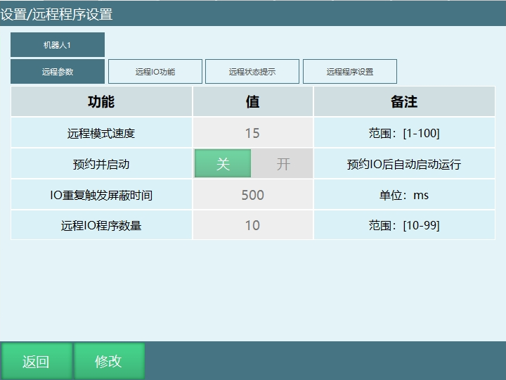

1.  远程模式速度:切换到远程模式时的全局速度，范围\[1,100\]%。

例如：在远程参数界面将远程模式速度修改为30%，切换到远程模式后的全局速度为30%。

2.  预约并启动：信号0-1（按下按钮）0.6秒以上时间后1-0（松开按钮），程序直接运行。

- 开：打开预约并启动，如下图所示在远程模式下给1-4信号后伺服上电且作业文件"程序2"开始启动运行。

- 关：关闭预约并启动，在远程模式下给1-1启动信号后伺服上电，然后在给1-4信号作业文件"程序2"开始运行。

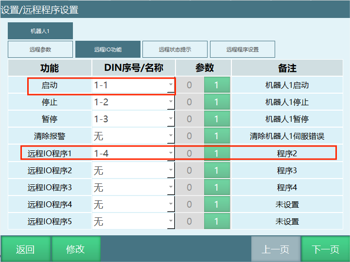

3.  IO重复触发屏蔽时间:重复预约程序的屏蔽时间。

例如：设置的重复屏蔽时间是500ms，作业文件"程序2"第一次预约启动后，再次预约"程序2"的话，信号会屏蔽500ms，500ms后再次给信号，"程序2"的状态为预约中。

4.  远程IO程序数量\[10,99\]:远程模式下可以运行的程序数量。

例如：远程参数界面设置IO程序数量20，那在远程IO功能界面的"功能"列会显示为远程IO程序1---远程IO程序20，远程状态提示界面的"功能"列会显示为远程IO程序1输出---远程IO程序20输出，远程程序设置界面的"程序序号"列会显示为程序1---程序20。

注意事项：

- 远程模式界面只显示10个队列，如果选择的程序数量超出10个，队列顺序根据远程程序设置界面选择的程序显示前10个。

- 如果设置了10个以上的远程程序，在远程程序界面只显示前10个，但是通过远程IO可以启动未显示的程序。

例如:远程程序设置界面设置12个程序，在远程界面只显示前10个程序，第11、第12个程序通过设置的启动信号是可以正常启动运行只是在远程界面"程序序号"列不显示而已。

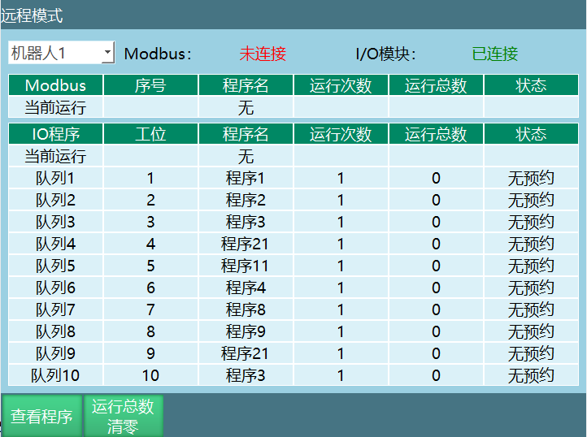

####  远程IO功能

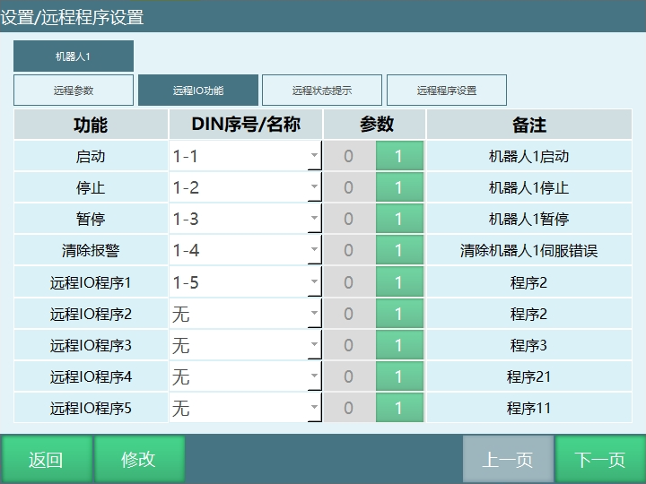

|  | 功能 | 模式 | 触发/输出方式 | 说明 |
| :--- | :--- | :--- | :--- | :--- |
| 数字IO输入 | 启动 | 远程模式 | 上升沿 | 参数为1时，信号0变1时有效 |
|  | 停止 | 远程模式 | 持续有效 | 参数为1时，信号持续有效 |
|  | 暂停 | 远程模式 | 持续有效 | 参数为1时，信号持续有效 |
|  | 清除报警 | 远程模式 | 上升沿 | 参数为1时，信号0变1时有效 |
|  | 预约即启动 | 远程模式 | 无 | 打开时，预约成功即上电 |
|  | I/O程序1-10 | 远程模式 | 脉冲（周期0.6s） | 参数为1时，信号0-1-0时有效，程序预约成功至少需要触发0.6秒以上。 |

注：本说明均是参数列数值输出1高电平为例。

**功能列**

如上图设置对此界面参数进行说明：

1.  启动：远程模式下给1-1的启动信号后伺服上电，伺服状态切换为运行。

2.  停止：远程模式下给1-2的停止信号后，作业文件停止运行，程序由运行状态切换为停止状态，伺服下电。

3.  暂停：远程模式下给1-3的暂停信号后，作业文件暂停运行，程序状态由运行状态切换为暂停状态。

4.  清除报警：远程模式下清除报错（伺服报错、控制器报错），程序如果在运行过程出现报错给1-4的信号后会清除错误。

5.  远程IO程序：远程模式运行的作业文件名。

**DIN序号列：**

设置每个功能对应的IO端口号。

如上图参数设置，切到远程模式后给IO端口1-1信号后，伺服上电。

**参数列：**

参数为1时，选择的IO端口上升沿（信号由低电平0-高电平1）有效。

参数为0时，选择的IO端口下降沿（信号由高电平1-低电平0）有效。

####  远程状态提示

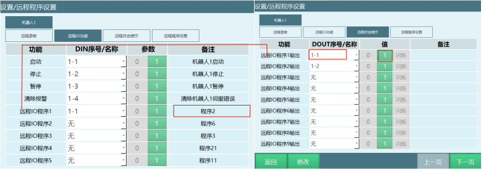

程序在远程模式下运行时，设置的IO输出端口的值会有变化，通过端口数值的变化可以知道当前的程序处于什么状态。

如上图所示：当作业文件"程序1"开始运行时，IO输出端口1-1口由低电平变为高电平。

1.  远程IO程序输出：对应远程IO功能界面的远程IO程序1，当远程IO程序1选中的程序开始运行时，选中的IO端口输出提示。

2.  DOUT序号：选中IO端口后程序运行时对应端口输出提示。

3.  相关值：

- "0"程序运行时对应的端口是低电平状态。

- "1"程序运行时对应的端口是高电平状态。

- "闪烁"程序运行时对应的端口闪烁变化。

注意事项：程序远程模式运行时，只有程序状态为暂停状态和运行状态时设置IO输出端口才会输出提示，程序状态为停止时IO输出端口不会输出提示。

####  远程程序设置

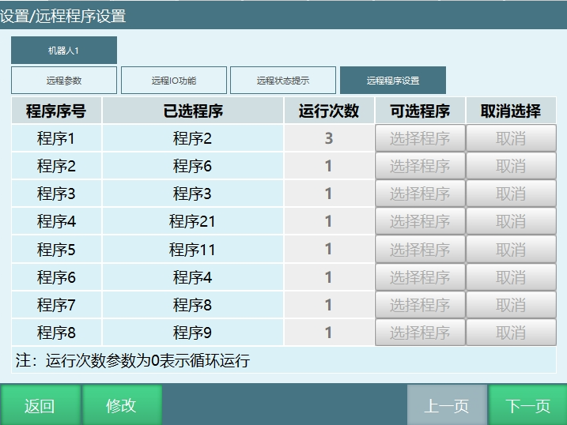

1.  程序序号：此界面显示的程序序号个数是由远程参数界面的远程IO程序数量决定，如果IO程序数量为15此界面程序序号为程序1---程序15。

2.  已选程序：点击此界面的"选择程序"进入程序界面，已选程序就是选择的目标程序。

3.  运行次数：目标程序运行的次数，填0表示此程序循环运行。

4.  可选程序：点击的"选择程序"进入程序界面选择目标程序。

5.  取消选择：取消选择的目标程序，取消后对应程序行的已选程序显示未设置。

###  远程模式界面参数介绍 

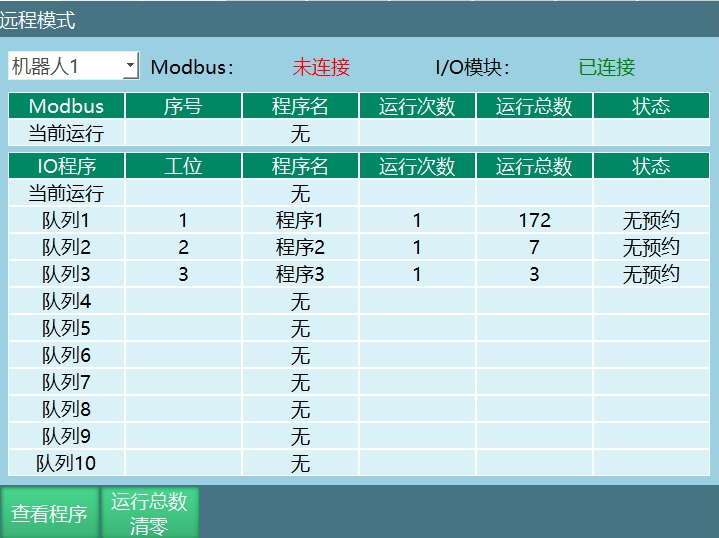

1.  队列：远程模式界面只会显示10个队列，"当前运行"行表示当前正在运行的程序。

2.  工位：此界面的工位显示是根据程序设置界面程序序号列的排序显示的，如下图所示：

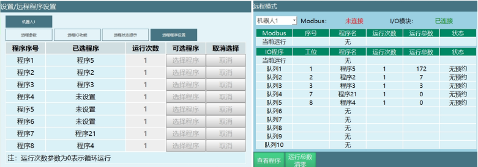

3.  程序名：运行的作业文件的名称。

4.  运行次数：作业文件运行的次数，如果运行次数是3的话程序会连续运行3次，运行3次后作业文件停止运行。

5.  运行总数：程序的运行总数，会将程序运行次数累计起来。

6.  查看程序：程序在运行时点击【查看程序】进入程序运行界面，查看程序运行详细情况。

7.  运行总数清零：清除当前运行程序的运行总数，不清除运行次数。

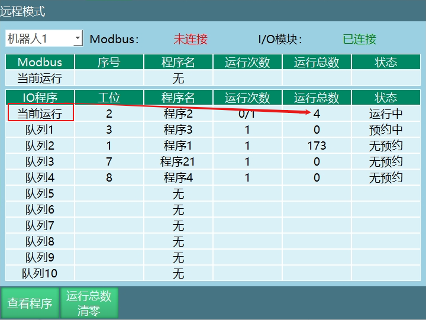

####  远程运行状态说明

无预约：进入远程模式后没有预约过程序或预约后又取消预约，显示无预约。

预约中：程序运行过程中触发对应程序的I0口即成功预约程序，取消需再次触发该程序对应的IO口。

运行中：程序正在运行。

已预约：程序运行完成显示已预约。

暂停：程序在运行过程中触发了暂停信号，程序状态为暂停。

程序出错：程序在运行过程中出现报错，此时运行的程序状态为程序出错。

注意事项：程序预约运行的话需要在设置-操作参数界面打开预约模式。

假设需要运行的程序队列1、队列2、队列3分别为程序1、程序2、程序3。

1.  触发远程IO程序1信号→触发启动信号→机器人运行，此时程序1的状态为运行中。

2.  触发远程IO程序2信号-程序2运行状态为预约中，程序1运行结束后程序2运行。

3.  触发远程IO程序3信号-程序3运行状态为预约中，程序2运行结束后程序3运行。

###  远程IO断点，当前行执行

远程模式IO断点执行和当前行执行需要在设置-操作参数界面打开开关，否则当程序在运行过程中切模式或者其它操作导致程序运行停止再次运行程序时断点和当前行不生效。

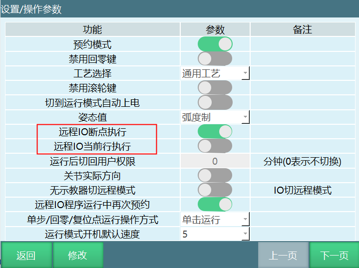

例如：

| IO断点执行关闭 | 远程IO当前行关闭 | **伺服报警：** |
| :--- | :--- | :--- |
| | | 主程序:主程序第一行执行 |
| | | 子程序：主程序第一行开始执行 |
| | | **IO急停：** |
| | | 主程序:主程序第一行执行 |
| | | 子程序：主程序第一行开始执行 |
| | | **切换模式:** |
| | | 主程序:主程序第一行执行 |
| | | 子程序：主程序第一行开始执行 |

| IO断点执行打开 | 远程IO当前行打开 | **伺服报警：** |
| :--- | :--- | :--- |
| | | 主程序:主程序断点执行 |
| | | 子程序：断点执行 |
| | | **IO急停：** |
| | | 主程序:主程序断点执行 |
| | | 子程序：断点执行 |
| | | **切换模式:** |
| | | 主程序:主程序断点执行 |
| | | 子程序：断点执行 |

##  远程模式Modbus启动程序

###  Modbus程序运行步骤

1.  作业文件编程。

2.  点击设置-modbus设置-modbus程序，进入程序选择界面选择需要运行的目标程序。

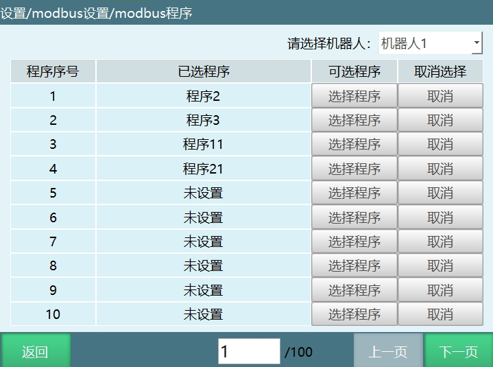

3.  4X类型地址码29写1，伺服就绪。

4.  地址码选择作业文件，4x类型地址码45写的数值就是就是对应程序序号选中的程序。

例如：4x类型地址码45写1，机器人1选中上图modbus程序界面程序序号为1的作业文件"程序2"；4x类型地址码45写2，机器人1选中上图modbus程序界面程序序号为2的作业文件"程序3"。

5.  作业文件运行，4x类型地址码19写1，运行作业文件。

###  Modbus启动程序

点击设置-modbus设置-modbus程序，进入modbus程序界面选择需要运行的程序。

1.  4X类型地址码6写2，操作模式切换为远程模式（需要拔出示教器）。

2.  4X类型地址码29写1，伺服就绪。

3.  地址码选择作业文件，4x类型地址码45填写数值，填写的数就是对应程序序号选中的程序。

例如：需要运行的是程序序号4的作业文件"程序21"则4x类型地址码45写4。

4.  4x类型地址码19写1，运行作业文件"程序21"，此时当前选中的程序状态为运行。

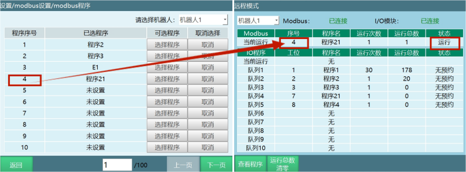

说明：如果需要设置运行次数、运行速度等其它参数可以参考《modbus地址码列表》进行设置。

###  Modbus断点，当前行运行

Modbus远程启动程序运行时程序在运行过程中切模式或者其它操作导致程序运行停止，再次启动程序可断点执行、当前行执行。

4x类型地址码19写0，停止运行；

4x类型地址码19写1，启动运行；

4x类型地址码19写2，暂停运行；

4x类型地址码19写3，断点执行；

4x类型地址码19写4，当前行执行。

###  Modbus与io优先级

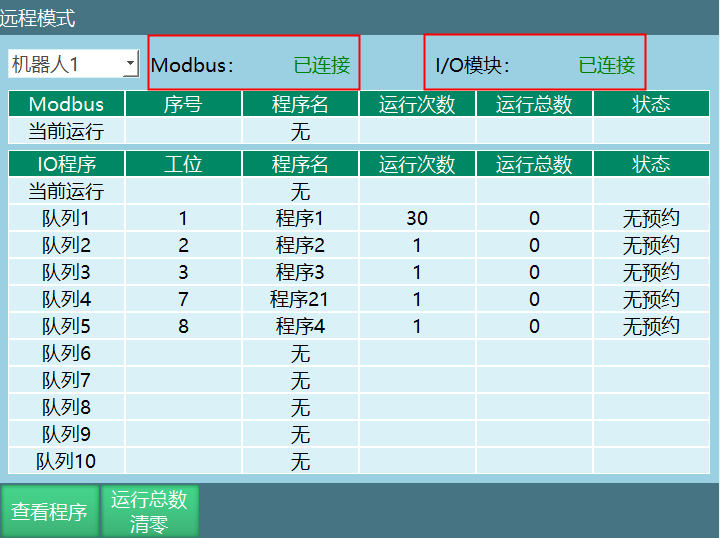

当modbus和io都连接的话，两者远程启动程序时是有优先级的。

如何修改优先级？

导出配置，在config文件夹里面打开modbusAddr.json文件，找到如下参数：

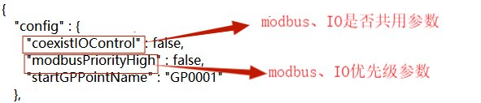

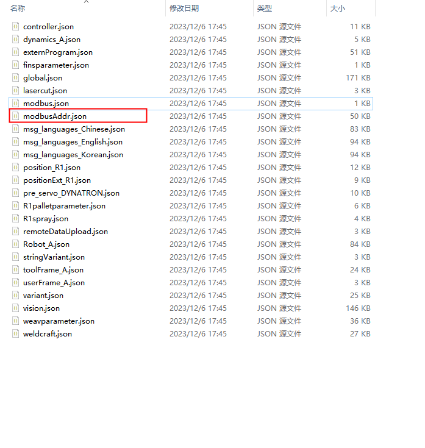

- coexistIOControl：false

表示modbus与IO不共用，modbus优先级高，即当modbus连接上时IO不能控制机器人。

- coexistIOControl：true

表示modbus与IO共用，即modbus和IO可以同时控制机器人。

当modbus与IO共用时，此时调取作业文件调取的是【远程程序设置】中的作业文件，同时【操作参数中-预约模式】必须打开。

- coexistIOControl：false

- modbusPriorityHigh：false/true

modbus默认优先级高,且modbus连接上时IO不能控制。

- coexistIOControl：true

- modbusPriorityHigh：false

表示
modbus和IO共用且IO优先级高，即modbus和IO可以同时控制机器人且modbus按照IO的设置（示教盒上的设置）运行，例如断点与当前行运行。

- coexistIOControl：true

- modbusPriorityHigh：true

表示IO不能运行自己的程序，而是io(在示教器上的设置）控制modbus选择的程序以及运行次数和总次数。
且在共用时，只要优先级高的那一方未连接，另一方功能不可用。

##  远程模式速度

此处的全局速度表示操作模式为远程模式时示教器上方的速度栏显示的速度

| 远程模式 | 关节：最大轴速度=额定正速度*指令速度*全局速度 |
| :--- | :--- |
| | 直角：最大线速度=指令速度*全局速度 |

## 常见问题解答

### Q1: 如何切换示教器的操作模式？

**A1:** 示教器的操作模式通过右上方的旋钮进行切换：
- 左侧：示教模式，用于编程和调试
- 中间：运行模式，用于执行程序
- 右侧：远程模式，用于外部控制

### Q2: 如何在示教模式下点动机器人？

**A2:** 在示教模式下，按住DEADMAN按键，然后使用示教器上的方向键或摇杆进行点动操作。可以在点动速度设置中调整点动速度。

### Q3: 如何创建新的作业文件？

**A3:** 在示教模式下，点击【工程】-【新建】，输入文件名后点击【确定】即可创建新的作业文件。

### Q4: 如何插入指令到作业文件中？

**A4:** 在示教模式下，打开作业文件，点击【指令】按钮，选择需要的指令类型，设置参数后点击【确定】即可插入指令。

### Q5: 如何设置程序的运行次数？

**A5:** 在运行模式下，点击【设置次数】，输入需要的运行次数后点击【确定】。设置为0表示循环运行。

### Q6: 如何使用单步运行功能？

**A6:** 在示教模式下，打开作业文件，选中要执行的指令行，按住DEADMAN按键，然后点击【单步】按钮，机器人会执行选中的指令。

### Q7: 如何使用断点运行功能？

**A7:** 当程序运行中断后，再次启动时会弹出提示框，选择"断点执行"则从断点处继续运行，选择"重新运行"则从第一条指令重新运行。

### Q8: 如何通过远程模式启动程序？

**A8:** 可以通过IO信号或Modbus协议启动远程模式下的程序：
- IO启动：设置远程IO功能，通过外部IO信号触发程序运行
- Modbus启动：通过Modbus协议写入对应地址码启动程序

### Q9: 如何调整示教器的速度？

**A9:** 可以通过示教器状态栏上的速度滑块调整全局速度，也可以在设置-操作参数中修改默认速度。

### Q10: 如何处理程序运行中的报错？

**A10:** 当程序运行中出现报错时，可以通过以下方式处理：
- 查看报错信息，了解具体原因
- 清除报警：点击【清除报警】按钮或通过远程IO信号清除
- 检查程序逻辑和参数设置，修复问题后重新运行
