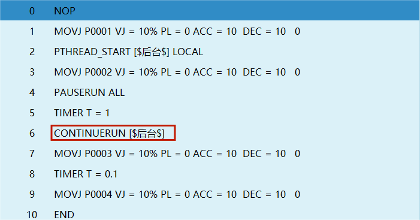
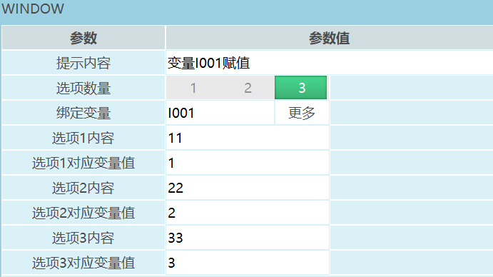
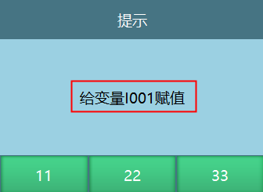
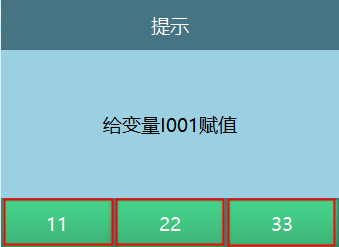
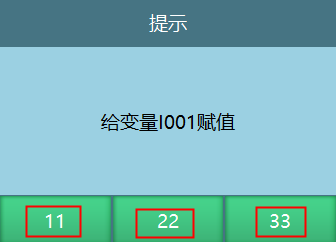

# 程序控制类指令

| 指令类型 | 前台 | 全局后台 | 局部后台 |
| :--- | :--- | :--- | :--- |
| 开启线程 | 支持 | 支持 |  |
| 退出线程 | 支持 | 支持 |  |
| 暂停运行 | 支持 | 支持 | 支持 |
| 继续运行 | 支持 | 支持 | 支持 |
| 停止运行 | 支持 | 支持 | 支持 |
| 重新运行 | 支持 | 支持 | 支持 |
| 弹窗指令 | 支持 |  |  |
| 线程状态 | 支持 | 支持 | 支持 |

| 指令类型 | 指令 | 单步 | 倒序 | 试运行 | 提前执行 | 被提执行 |
| :--- | :--- | :--- | :--- | :--- | :--- | :--- |
| 程序控制类 | 开启线程 |  支持 | 不支持 |  支持 | 不支持 |  支持 |
| 程序控制类 | 退出线程 |  支持 | 不支持 |  支持 | 不支持 |  支持 |
| 程序控制类 | 暂停运行 |  支持 | 不支持 |  支持 | 不支持 |  支持 |
| 程序控制类 | 继续运行 |  支持 | 不支持 |  支持 | 不支持 |  支持 |
| 程序控制类 | 停止运行 |  支持 | 不支持 |  支持 | 不支持 |  支持 |
| 程序控制类 | 重新运行 |  支持 | 不支持 |  支持 | 不支持 |  支持 |
| 程序控制类 | 弹窗指令 |  支持 | 不支持 |  支持 | 不支持 |  支持 |
| 程序控制类 | 线程状态 |  支持 | 不支持 |  支持 | 不支持 |  支持 |

---

## 程序控制相关内容

如何建立后台任务？

点击设置-后台任务，进入后台任务界面：

全局后台：

1. 点击【全局】,进入全局后台任务界面。

2. 点击【新建】,建立全局后台作业文件。

3. 点击【操作】,可以对当前选中的作业文件进行复制，删除，重命名和设置自启操作。

4. 点击【启动】,后台运行选中的自启程序。

5. 设置自启：在开机时执行自启程序，全局后台界面点击【启动】执行自启程序。

6. 说明：只有全局后台任务才可以设自启。

局部后台：

7. 点击【局部】,进入局部后台任务界面。

8. 点击【新建】,建立局部后台作业文件。

9. 点击【操作】,可以对当前选中的作业文件进行复制，删除，重命名操作。

### PTHREAD_START-开启线程

格式：PTHREAD_START【指令名】\[\$测试\$\]【开启的后台作业文件】GLOBAL,LOCAL【全局后台，局部后台】。

功能：开启全局后台或者局部后台任务。

参数：

| 类型 | 全局后台，局部后台 |
| :--- | :--- |
| 后台任务 | 当选择全局后台类型时,可以选择全局后台建立的作业文件   当选择局部后台类型时,可以选择局部后台建立的作业文件 |

示例：

1.  NOP

2.  TIMER T=1

3.  PTHREAD_START\[TEST\]GLOBAL

4.  MOVL P0001 V=10mm/s PL=0 ACC=10 DEC=10 0

5.  END

示例说明：在前台开启全局后台作业文件TEST。

### PTHREAD_END-退出线程

格式：PTHREAD_END【指令名】\[\$测试\$\]【退出运行的作业文件名】GLOBAL,LOCAL【全局后台，局部后台】。

功能：关闭已经开启的后台任务。

参数：
| 类型 | 全局后台，局部后台 |
| :--- | :--- |
| 后台任务 | 退出已经开启的局部或全局后台的作业文件 |

注意事项：退出线程指令只可以退出在前台已经开启的作业文件。

例如：开启全局后台的作业任务是\[TEST\],那在退出线程时选择全局后台的作业任务是\[TEST1\]，在执行退出线程指令时全局后台的作业任务是\[TEST\]无法退出运行。

示例：

1.  NOP

2.  TIMER T=1

3.  PTHREAD_START\[TEST\]GLOBAL

4.  MOVL P0001 V=10mm/s PL=0 ACC=10 DEC=10 0

5.  PTHREAD_END\[TEST\]GLOBAL

6.  END

示例说明：

程序运行到第1行时开启全局后台作业文件TEST，运行到第5行时退出全局后台作业文件TEST的运行。

### PAUSERUN-暂停运行

格式：PAUSERUN【指令名】ALL,MAIN【暂停运行的类型】。

功能：暂停主程序和局部后台程序运行。

参数：

| 类型 | 全部：暂停开启的局部后台任务和主程序，开启的全局后台任务不会暂停   主程序：暂停运行的主程序，开启的后台任务不会暂停。   局部后台：暂停开启的局部后台任务，运行的主程序不会暂停。 |
| :--- | :--- |
| 程序 | 选择全部和主程序时，输入框置灰。当类型为局部后台，选择需要暂停运行的后台程序。|

示例：

1.  NOP

2.  TIMER T=1

3.  PTHREAD_START\[TEST\]LOCAL

4.  PTHREAD_START\[TEST1\]GLOBAL

5.  MOVL P0001 V=10mm/s PL=0 ACC=10 DEC=10 0

6.  PAUSERUN ALL

7.  END

示例说明：程序运行到第3行，第4行时开启了局部和全局后台任务，运行到第6行暂停运行指令时，开启的局部后台任务和主程序暂停运行，全局后台任务正常运行。

### CONTINUERUN-继续运行

格式：CONTINUERUN【指令名】MAIN、LOCAL【暂停运行的程序类型】。

功能:继续运行已暂停的主程序或者局部后台程序。

参数：

| 类型 | 主程序：继续运行暂停的主程序，已经被暂停的后台程序不会继续运行   局部后台：运行暂停的局部后台程序 |
| :--- | :--- |
| 程序 | 选择主程序时输入框置灰，选择局部后台时可以选择继续运行的后台程序。 |

示例：

1.  NOP

2.  TIMER T=1

3.  PTHREAD_START\[TEST\]LOCAL

4.  MOVL P0001 V=10mm/s PL=0 ACC=10 DEC=10 0

5.  PAUSERUN ALL

6.  TIMER T=1

7.  CONTINUERUN MAIN

8.  MOVL P0002 V=10mm/s PL=0 ACC=10 DEC=10 0

9.  END

示例说明：程序在运行时开启了局部后台程序，运行到第5行指令时，主程序和局部后台程序被暂停，运行到第7行指令时被暂停的主程序继续运行，局部后台程序依然暂停。

特别说明：如果继续运行指令选择的程序类型是局部后台，如果插入了暂停运行指令当程序运行到暂停运行指令时，此时伺服状态为暂停，然后点击示教器上的【启动】，执行继续运行指令，现在的执行逻辑是主程序和局部后台的程序都会继续运行。

### STOPRUN-停止运行

格式：STOPRUN【指令名】。

功能：停止正在运行的程序，程序运行到停止运行指令时伺服下电。

参数：略。

1.  NOP

2.  PTHREAD_START\[TEST\]LOCAL

3.  MOVL P0001 V=10mm/s PL=0 ACC=10 DEC=10 0

4.  PAUSERUN ALL

5.  CONTINUERUN MAIN

6.  STOPRUN

7.  MOVL P0002 V=10mm/s PL=0 ACC=10 DEC=10 0

8.  END

示例说明：程序运行到第6行指令时，伺服下电程序停止运行。

### RESTARTRUN-重新运行

格式：RESTARTRUN【指令名】。

功能：重新运行此条指令上面的程序。

参数：略。

示例：

1.  NOP

2.  PTHREAD_START\[TEST\]LOCAL

3.  MOVL P0001 V=10mm/s PL=0 ACC=10 DEC=10 0

4.  PAUSERUN ALL

5.  RESTARTRUN

6.  TIMER T=1

7.  MOVL P0002 V=10mm/s PL=0 ACC=10 DEC=10 0

8.  END

示例说明：程序每次运行到第5行指令时，会重新运行此条指令上面的程序。

### WINDOW-弹窗指令

格式：WINDOW【指令名】变量I001赋值【提示内容】1,2,3【选项数量】INT,GINT【绑定变量】11【选项1内容】1【选项1变量值】22【选项2内容】2【选项2变量值】33【选项3内容】3【选项3变量值】。

功能:运行指令时弹出所填写的提示内容窗口，按钮数量为选项数量，点击按钮会将变量值存入绑定的变量。

参数：

 

| 参数 | 参数值 |
| :--- | :--- |
| 提示内容 | 运行弹窗指令时,提示框显示的内容  例如：提示内容是"给变量I001赋值",如图    |
| 选项数量 | 设置选项数量，在执行弹窗指令时提示框的按钮就会显示几个   例如：选项数量是3,如图    |
| 绑定变量 | INT,GINT   执行弹窗指令会将选项框里对应的变量值存入选择的变量 |
| 选项内容 | 根据设置的选项数量和内容，在执行弹窗指令时会显示选项框里的内容   例如：设置了三个选项数量，三个选项内容分别是11、22和33如图    |
| 选项对应的变量值 | 执行弹窗指令，点击对应的选项框,会将选项框里对应的变量值写入选择的变量   例如：选项1内容11，选项框1对应的变量值为1，在执行弹窗指令点击11按钮选择的变量会变为1 |

示例：

1.  NOP

2.  WINDOW\[\$给变量I001赋值\$\] GI001 3 \[\$11\$\]1 \[\$22\$\] 2
    \[\$33\$\] 3

3.  END

示例说明：执行弹窗指令,点击按钮1 GI001=1，点击按钮2 GI001=2 点击按钮3
GI001=3。

### PTHREAD_STATE-线程状态

格式：PTHREAD_STATE【指令名】MAIN、LOCAL、GLOBAL【主程序、局部后台、全局后台】I/GI【变量类型】。

功能：查看当前所执行的线程程序的状态，停止等于1，暂停等于2，运行等于3。

参数：

| 类型 | 查看主程序，局部后台，全局后台的线程状态 |
| :--- | :--- |
| 后台任务 | 主程序：类型选择主程序时，输入框置灰   局部后台，全局后台：查看选择的后台任务的状态 |
| 存入的变量类型 | 将读取到的状态存入变量 |

注意事项：

线程状态可以读取到程序当前的状态，当主程序停止，暂停时程序是无法运行到线程状态这条指令，所以前台无法读取主程序的停止，暂停状态。当程序正常启动时主程序的状态为运行状态，所以当需要读取主程序状态时可以在后台插入读取线程状态指令，然后在前台开启此线程。

示例：

1.  NOP

2.  PTHREAD_START\[\$TEST\$\]LOCAL

3.  TIMER T=1

4.  PTHREAD_STATE\[\$TEST\$\]LOCAL I002

5.  PAUSERUN\[\$TEST\$\]

6.  TIMER T=1

7.  PTHREAD_STATE\[\$TEST\$\]LOCAL I002

8.  PTHREAD_END\[\$TEST\$\]LOCAL

9.  TIMER T=1

10. PTHREAD_STATE\[\$TEST\$\]LOCAL I002

11. END

示例说明：第2行程序开启局部后台线程，程序在运行到第4行时获取线程状态存入的变量I002=3；运行到第5行指令时暂停开启的后台线程，程序在运行到第7行时获取线程状态存入的变量I002=2；运行到第8行指令时退出开启的后台线程，程序在运行到第10行时获取线程状态存入的变量I002=1。

---

## AI 检索专用问答对 (Q&A for Retrieval)

**Q: 如何建立全局后台任务?**

A: 建立全局后台任务的步骤：

1. 点击设置-后台任务，进入后台任务界面
2. 点击【全局】，进入全局后台任务界面
3. 点击【新建】，建立全局后台作业文件
4. 点击【操作】，可以对当前选中的作业文件进行复制、删除、重命名和设置自启操作
5. 点击【启动】，后台运行选中的自启程序
6. 设置自启：在开机时执行自启程序，全局后台界面点击【启动】执行自启程序

**Q: 如何建立局部后台任务?**

A: 建立局部后台任务的步骤：

1. 点击设置-后台任务，进入后台任务界面
2. 点击【局部】，进入局部后台任务界面
3. 点击【新建】，建立局部后台作业文件
4. 点击【操作】，可以对当前选中的作业文件进行复制、删除、重命名和设置自启操作
5. 点击【启动】，后台运行选中的自启程序
6. 设置自启：在开机时执行自启程序，局部后台界面点击【启动】执行自启程序

**Q: 建立线程状态指令的注意事项?**

A: 线程状态可以读取到程序当前的状态，当主程序停止，暂停时程序是无法运行到线程状态这条指令，所以前台无法读取主程序的停止，暂停状态。当程序正常启动时主程序的状态为运行状态，所以当需要读取主程序状态时可以在后台插入读取线程状态指令，然后在前台开启此线程。

**Q: 如何设置后台任务自启？**

A: 只有全局后台任务才可以设置自启。

设置方法：在全局后台界面点击【操作】，对选中的作业文件进行设置自启操作，这样在开机时会执行自启程序。

