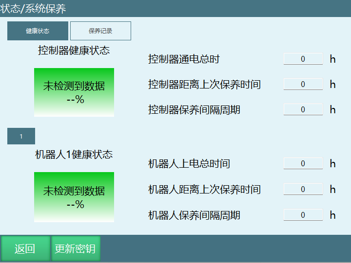

# 系统保养功能使用教程

系统保养功能是对机器人和控制器达到设定时间进行保养维护

## 系统保养参数说明

1.控制器通电时间：第一次更新保养密钥时开始记录该时间，此为总时长，更新保养密钥后不会清零

2.控制器距离上次保养时间：更新保养密钥时开始记录该时间，此为更新密钥间隔时间，更新含有控制器保养密钥后将会清零

3.控制器保养间隔周期：保养密钥生成器的间隔周期时间，勾选默认时为8760小时，取消勾选填入则为自定义时间

4.机器人上电总时间：第一次更新保养密钥时开始记录该时间，此为总时长，更新保养密钥后不会清零

5.机器人距离上次保养时间：更新保养密钥时开始记录该时间，此为更新密钥间隔时间，更新含有机器人保养密钥后将会清零

6.机器人保养间隔周期：保养密钥生成器的间隔周期时间，勾选默认时为8760小时，取消勾选填入则为自定义时间

### 系统保养使用说明

1.首次使用需要使用Windows密钥生成软件进行生成保养密钥

2.填入控制器ID，选择需要生成的密钥类型与周期
  *控制器ID：点击更新密钥按钮，控制器ID显示

3.点击生成保养秘文，软件会生成一个名为maintenance的密钥文件

4.将该文件拷入U盘根目录

5.插入U盘，点击更新密钥按钮，上传秘钥文件

6.示教器与控制器自动重启，开机后生效

#### 注释

导入成功后，maintenance密钥文件在控制器/home/inexbot/robot/目录，并重新命名为maintenanceLicense，如果需要重置通电总时长，删除该文件重启就行