# 系统功能调试手册

## 工具手标定、用户坐标标定

工具手和用户坐标的标定请参考系统操作手册[工具手和用户坐标](./工具手和用户坐标)

## 系统设置

### 版本升级

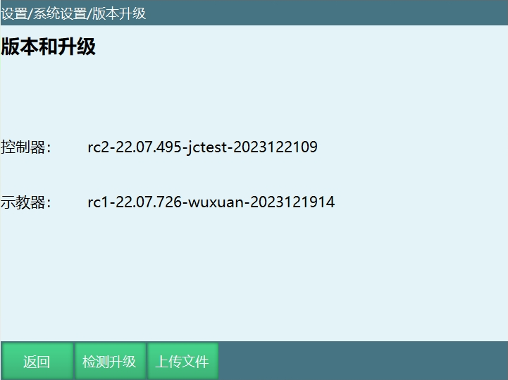

#### T30升级

控制器和示教器行分别是当前所使用的程序版本。

检测升级：在示教器的USB口插入U盘，在U盘根目录下放入需要升级的程序压缩包，点击”检测升级“，如下图所示会出现提示弹窗，点击”取消“会升级程序包。

如下图所示选中程序点击升级文件界面的【确定】，点击确定后会有一个二次确认界面，再次点击【确定】后开始升级程序。

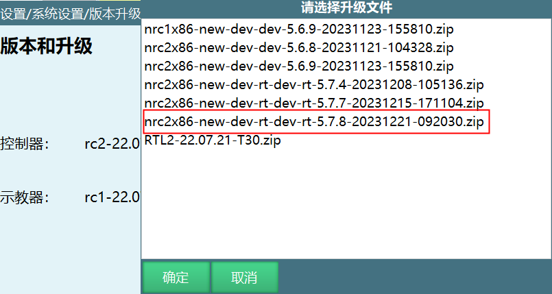

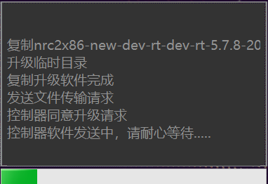

通过检测升级可以升级的文件有控制器程序，示教器程序，语言包等。

系统备份：在示教器的USB口插入U盘，在U盘根目录下放入需要升级的程序压缩包，点击”检测升级“，如下图所示会出现提示弹窗，点击”确定”会备份系统到U盘。

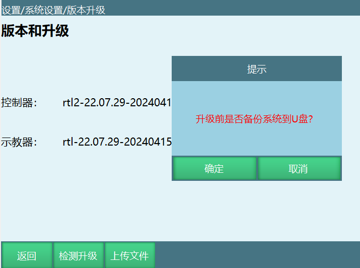

**系统备份：**

将U盘插入示教器USB口，点击设置-系统备份与还原，根据备份时当前运行的系统程序定义SystemBackup的文件名前缀为T30-1还是T30-2。nrc对应T30-1-SystemBackup，nrc2对应T30-2-SystemBackup。

1. 备份文件命名格式：T30-1-SystemBackup/T30-2-SystemBackup+具体日期。

如下图所示：

1. 备份路径：U盘根目录。
2. 备份的文件：

- 示教器备份文件：config.db;Pinyin.db;ServoError.db;TColor，Userdata.db，T30_ARM_Linux_Teach-pendant（示教器程序）。
- 控制器备份文件：控制器配置文件config；工艺文件craft；eni文件；作业文件job；lua文件；多语言文件msg_languages；预置参数preset；变量variant；控制器程序C1102_X86_Linux-RT_Robot-controller。

控制器程序备份说明：

2403版本针对不同平台，控制器启动程序名称也做了修改，因此不同平台备份的控制器名称也不同，详见下方表格。

| 平台 | 原程序 | 新程序 |
| --- | --- | --- |
| 桦汉-C1102 | Actions：nrc.out | C1102_X86_Linux-RT1_Robot-controller |
| Igh:nrc2.out | C1102_X86_Linux-RT_Robot-controller |
| 源控-C1200 | nrc2.out | C1200_X64_Linux-RT_Robot-controller |
| 诺达佳-C1201 | nrc2.out | C1201_X64_Linux-RT_Robot-controller |
| T5-C2200 | nrc.out | C2200_ARM_Linux-RT_Robot-controller |
| 驱控一体-T01 | nrc.out | T01_ARM_Linux-Xenomai_Robot-controller |

上传文件：点击此按钮可以上传的文件有控制器语言文件（例如：俄语msg_languages_Russian.json）、控制器解密文件（initlicense.vx）、初始化文件（batchlicense.txt）、伺服参数识别（pre_servo_DYNATRON.json）。

返回：点击【返回】退出版本升级界面。

####  PC版升级

1. 示教器程序升级：对应版本的PC版程序放在PC文件夹的根路径。

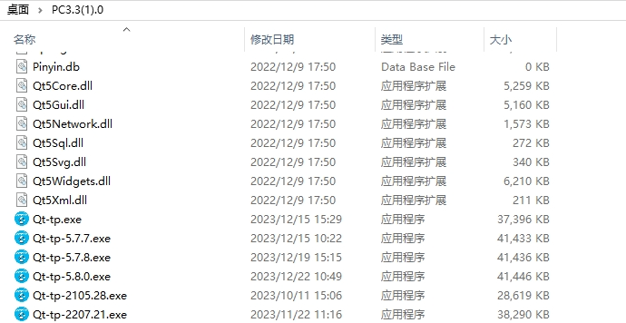

1. 控制器程序升级：PC文件夹下新建udisk文件夹，然后将控制器程序放在PC-udisk路径。

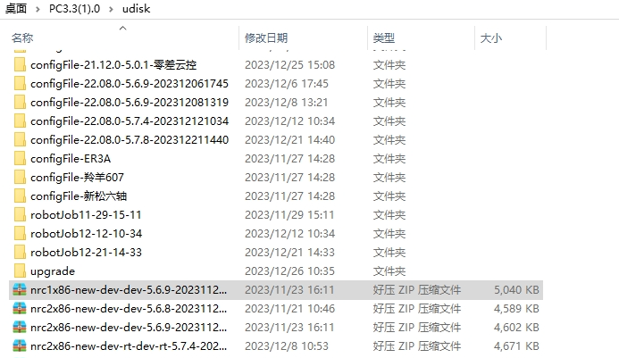

1. 上传文件：udisk文件夹下新建upgrade文件夹，上传文件路径PC-udisk-upgrade。

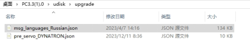

###  时间设置

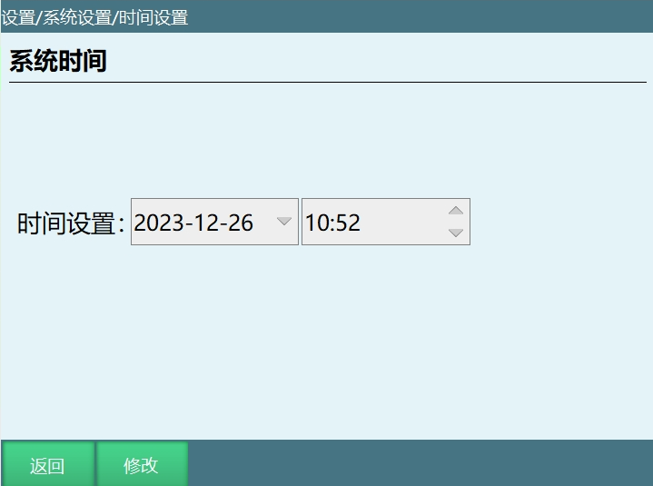

【修改】：点击【修改】按钮，设置年、月、日、小时、分钟。

如何修改日期：

- 点击如下图标记的第1步，出现修改日期弹窗。
- 点击标记第2步，修改月份。
- 点击标记第3步，修改年份 。

修改时间：

- 点击如下图标记的第4步，修改时间 。

【返回】点击返回按钮，退出此界面。

【保存】点击保存按钮，时间设置成功。

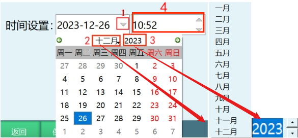

###  IP设置

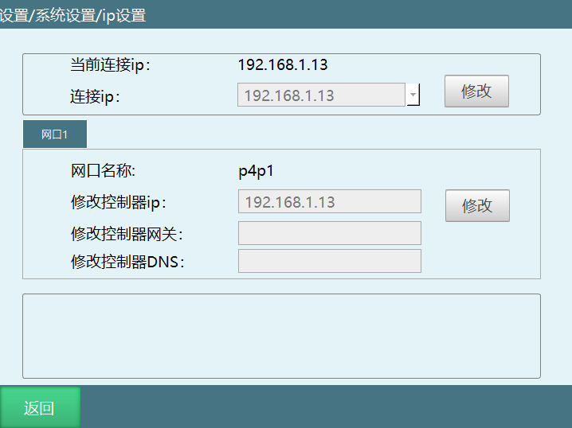

修改IP的具体步骤如下：

1. 修改IP前记录好新的IP地址。
2. 点击“修改控制器IP”、“连接IP”、“修改示教器IP”对应的【修改】按钮。
3. 输入框里输入新的IP地址，点击【保存】，示教器IP点击保存后重启系统生效，连接IP和控制器IP点击【保存】立即生效。

注意：

- 在非必要情况下请不要修改IP，以免造成使用故障。
- 若修改控制器IP为非默认值（192.168.1.13），请自行记录好该控制器的IP。

#### 扫描IP功能

功能：控制器可以扫描扫描到同一局域网内（即：连接在同一个交换机/集线器/路由器上），且同一网段的控制器IP。

注意：该功能在第一次扫描时有延迟。

1. IP设置界面扫描IP功能。

点击连接IP行的【修改】按键，再点击出现的下拉框等待3-4秒，即可扫描到同一网段同一局域网内的其他控制器的IP，等待搜索完成，以IP最后一位大小进行排序显示，选中搜索出来的IP，则更新到文本框中，文本框原有输入功能不变，可以输入IP地址进行连接，其余机制保持不变。如下图：

1. 监控-快捷键界面拔出示教器后插入示教器，扫描IP功能。

- 文本框原有输入功能不变，可以输入IP地址进行连接。
- 可以点击下拉框弹窗下拉界面，会搜索示教盒网段下6002端口地址，等待搜索完成，以IP最后三位数字大小进行排序显示，选中搜索出来的IP，则更新到文本框中，点击确认之后开始连接。

具体界面如下图所示：

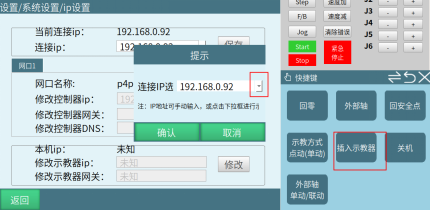

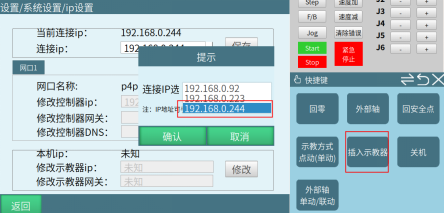

### 导出程序

在上图的系统设置中，导出程序步骤如下：

1. 将U盘插入示教器的USB接口。
2. 点击【设置】-【系统设置】-【导出程序】。
3. 程序导出到U盘根目录下。

导出程序的命名方式为“robotJobxx-xx-xx-xx（当前日期时间）”目录下。

如下图所示：

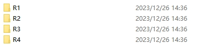

导出程序可以将robot1、robot2、robot3、robot4的程序全部导出，R1文件里面是robot1的程序，R2文件里面是robot2的程序，R3文件里面是robot4的程序，R4文件里面是robot4的程序。

### 导入程序

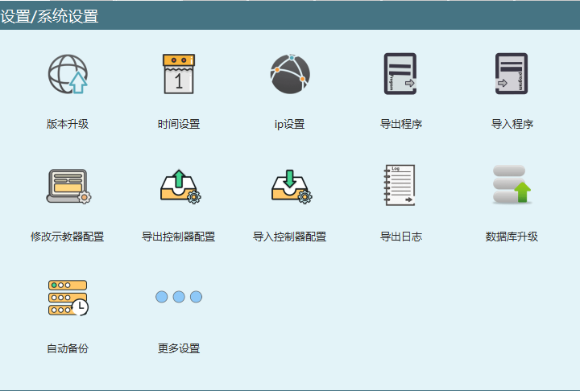

在系统设置界面中，导入程序步骤如下：

1. 插入示教器的USB接口；
2. 点击【设置】-【系统设置】-【导入程序】，选择上传的文件；

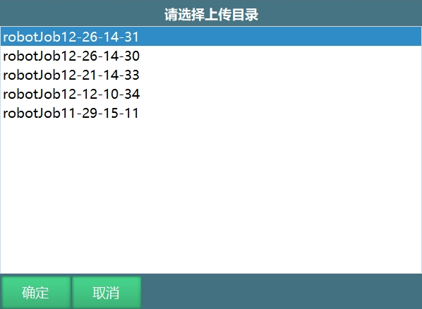

1. 点击【确定】，选择需要上传的作业文件；

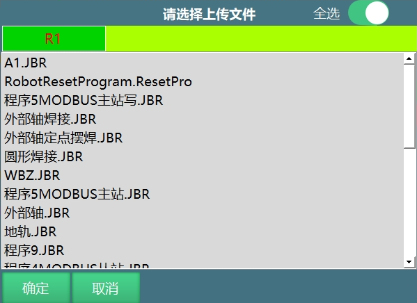

打开“全选”开关可以导入所有作业文件或者一次性导入多个作业文件，关闭全选一次只能导入一个作业文件；

1. 点击【确定】开始导入程序，程序导入成功后工程界面会显示导入的程序名。

用户自定义作业文件导入：

1. 在U盘中根路径新建名为“robotJob”的文件夹，并在该文件夹内新建名为“R1”的文件夹；
2. 将后缀名为“.JBR”的程序放在R1文件夹；
3. 将U盘插入示教器的USB接口；
4. 点击【设置】-【系统设置】-【导入程序】；
5. 选中robotJob，点击【确定】；

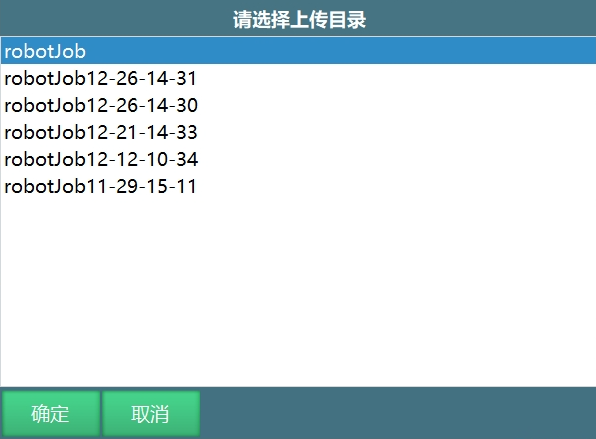

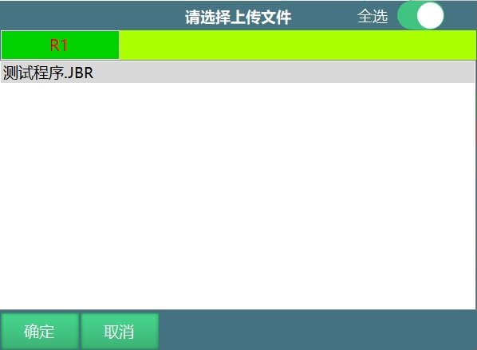

1. 点击【确定】开始导入程序，程序导入成功后工程界面会显示导入的程序名。

###  修改示教器配置

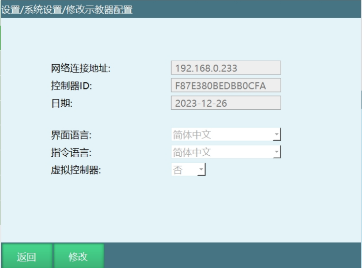

1. 界面语言：切换示教器的界面语言，例如切换界面语言为俄语、韩语、泰语等其它语言，界面语言如何切切换请查看《多语言功能手册》。
2. 指令语言：指令语言只有当前界面语言和英语，例如当前界面语言是韩语，指令语言为韩语和英语。
3. 虚拟控制器：虚拟控制器选择是的话只能查看每个界面，无法修改保存参数。

### 导出控制器配置

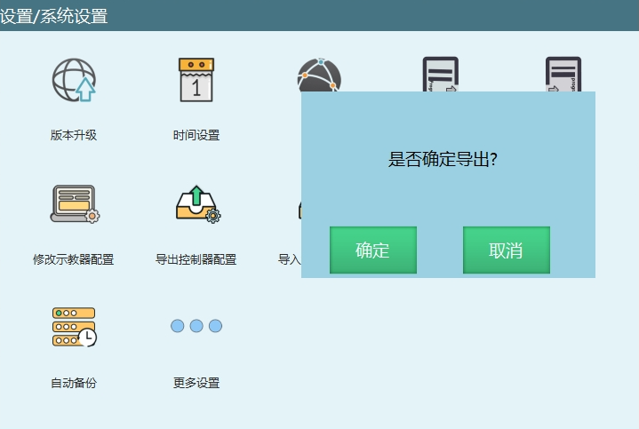

具体步骤如下：

1. 将U盘插入示教器的USB接口。
2. 点击【设置】-【系统设置】-【导出控制器配置】。
3. 点击【确定】开始导出配置。
4. 导出的配置文件格式：configFile-大版本号-小版本号-具体的日期，如下所示。

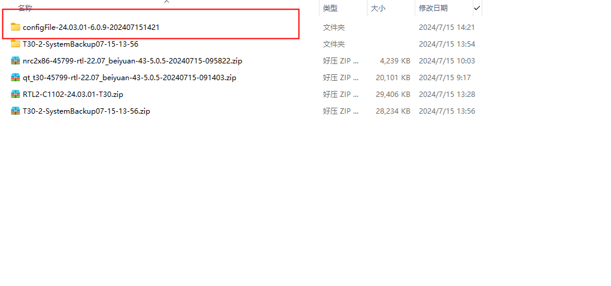

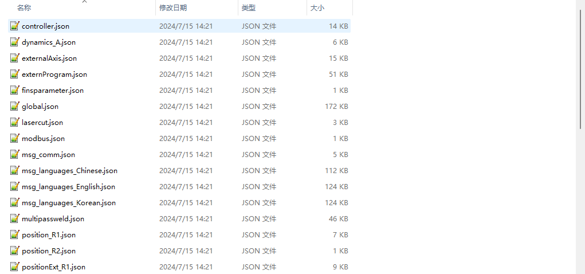

导出的配置文件包含的参数有：Modbus配置文件 modbus. json，中文语言文件 msg_languages_Chinese. json，传送带跟踪参数配置 conveytrack. json全局参数配置  global. json，全局字符串变量 stringVariant. json，机器人1全局点位参数配置 position_R1. json，机器人1参数配置 Robot_A. json等文件。

### 导入控制器配置

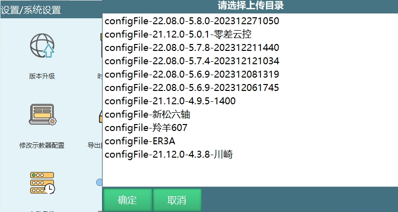

具体步骤如下：

1. 将U盘插入示教器的USB接口。
2. 点击【设置】-【系统设置】-【导入控制器配置】。
3. 选择需要导入的配置文件，点击【确定】进入配置文件选择界面，打开“全选”可以导入所有文件或者带入多个文件，关闭“全选”只能导入一个配置文件。

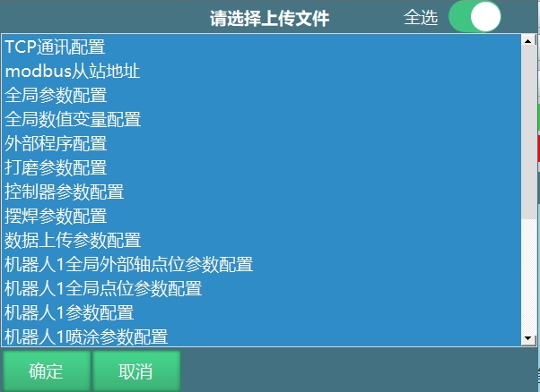

1. 如下图点击【确定】开始上传配置文件，配置文件导入成功后重启控制器。

### 导出日志

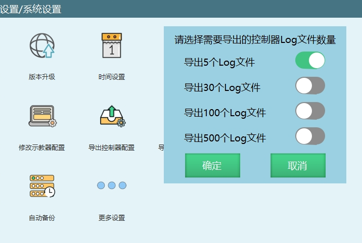

具体步骤如下：

1. 将U盘插入示教器的USB接口。
2. 点击【设置】-【系统设置】-【导出日志】。
3. 选择导出的Log文件数量，点击【确定】开始导出日志。
4. 导出的日志格式：controlLog-具体的日期，如下所示。

1. 导出的日志包含的文件有控制器配置文件、控制日志、崩溃日志和作业文件。

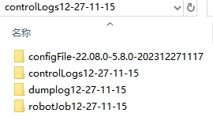

### 数据库升级

1. 用于升级config.db文件，该文件保存的为示教器配置，如ip、操作参数中的一些参数等。
2. 修改主题颜色：新增TColor.db，数据库存放主题颜色。

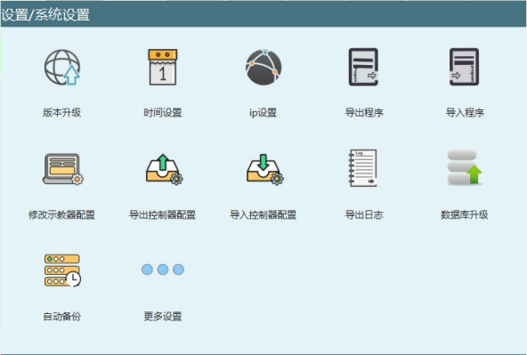

操作步骤：

1. 点击设置-操作参数，在操作参数界面将使用数据库中样式表按键打开。

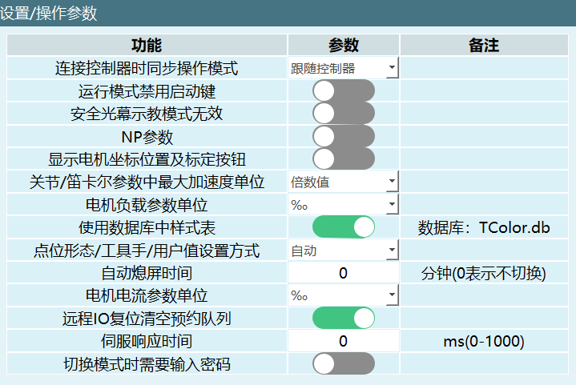

1. 用SQLite软件打开TColor.db文件，修改数据库stylesheet列（样式表）的颜色编码，保存。

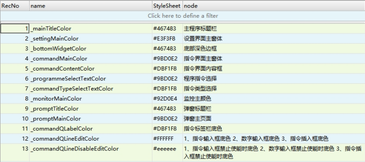

1. 修改后的TColor.db文件放在u盘根目录，点击设置-系统设置-数据库升级，选择TColor.db文件点击【确定】。

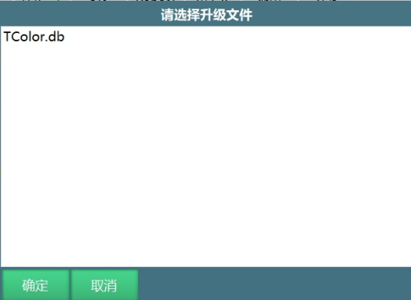

1. 二次确认弹窗提示，点击确定数据库升级完成后重启示教器生效。

### 自动备份

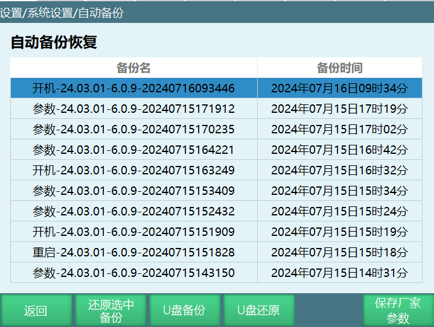

1. 控制器自动备份功能：

- 备份内容：程序、参数。
- 备份个数：最大10个。
- 备份命名：按前提、版本、时间命名。如2024年07月15日6点36分修改参数，备份名“参数-22.08-5.8.0-20240715143150
- 触发备份的前提：开机、修改参数、修改程序、升级。

1. 备份频率：

- 开机时确认版本、参数正常后备份一次；
- 修改参数后5分钟内没有再次修改参数备份一次；
- 修改程序（插指令、修改指令）后5分钟内没有再次修改备份一次；升级前备份一次。

1. 功能说明：

- 还原选中备份：选中想要恢复的备份，选中后会显示光标，点击“还原选中备份”按钮。

弹框提示，点击确定。

恢复过程中，请勿断电。

U盘备份：

步骤：将U盘插入示教器USB口，点击U盘备份，根据备份时当前运行的系统程序定义SystemBackup的文件名前缀为T30-1还是T30-2。nrc对应T30-1-SystemBackup，nrc2对应T30-2-SystemBackup。

备份文件命名格式：T30-1-SystemBackup/T30-2-SystemBackup+具体日期。

如下图所示：

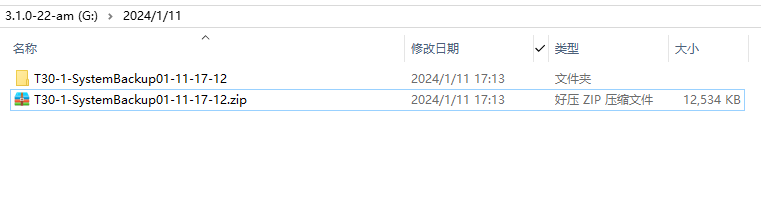

备份路径：U盘根目录。

备份的文件：

- 示教器备份文件：config.db;Pinyin.db;ServoError.db;TColor，Userdata.db，T30_ARM_Linux_Teach-pendant（示教器程序）
- 控制器备份文件：控制器配置文件config；工艺文件craft；eni文件；作业文件job；lua文件；多语言文件msg_languages；预置参数preset；变量variant；控制器程序C1102_X86_Linux-RT_Robot-controller。
- 控制器程序备份说明：2403版本针对不同平台，控制器启动程序名称也做了 修改，因此不同平台备份的控制器名称也不同，详见下表格：

| 平台 | 原程序 | 新程序 |
| --- | --- | --- |
| 桦汉-C1102 | Actions：nrc.out | C1102_X86_Linux-RT1_Robot-controller |
| Igh:nrc2.out | C1102_X86_Linux-RT_Robot-controller |
| 源控-C1200 | nrc2.out | C1200_X64_Linux-RT_Robot-controller |
| 诺达佳-C1201 | nrc2.out | C1201_X64_Linux-RT_Robot-controller |
| T5-C2200 | nrc.out | C2200_ARM_Linux-RT_Robot-controller |
| 驱控一体-T01 | nrc.out | T01_ARM_Linux-Xenomai_Robot-controller |

U盘还原：

先获取系统当前运行的程序信息，对比备份系统文件的文件名。即nrc对应T30-1，nrc2对应T30-2。当前运行的系统与备份系统文件名匹配时，则允许系统还原，反之则不允许系统还原。

U盘插入示教器USB口，点击系统还原，选择系统还原文件，上传成功后重启示教器。

保存厂家参数：

保存厂家参数后在恢复出厂设置中即可恢复出厂时的机器人参数、IO以及工具手配置，此按钮只在厂家权限下显示。

###  更多设置

####  恢复出厂设置

如下图所示，用户可以根据自己的需要选择清除的配置文件。

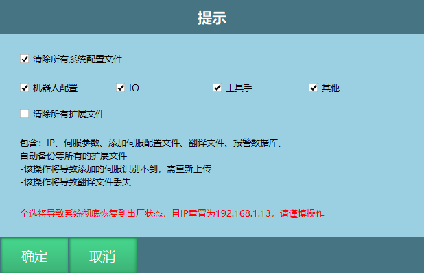

恢复出厂设置时需要谨慎请操作！请一定要在执行本操作之前备份所有参数以及程序文件！

步骤如下：

1. 进入设置-系统设置-更多设置界面；
2. 点击【恢复出厂设置】按钮，在弹出的提示窗中有两种选择，清除系统配置文件和所有扩展文件。选择需要清除的配置文件类型；
3. 点击【确定】按钮后继续点击二次确认框【确定】，选择的配置文件被恢复出厂设置。

####  清空程序

选择清空程序，点击【确定】程序清空成功后创建的作业文件被清空。

谨慎操作，程序被清空后无法恢复 ！

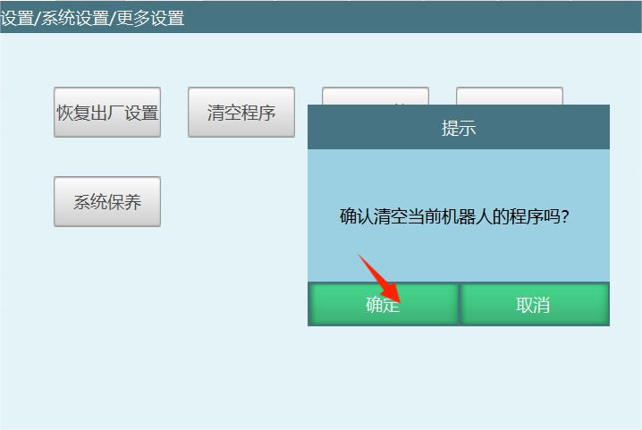

#### 重启系统

如下图所示：

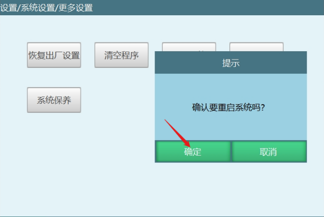

####  删除数据库

如下图所示，删除数据库步骤：

1. 点击【确定】删除config.db文件；
2. 重启示教器后会重新生成一份新的config.db文件。

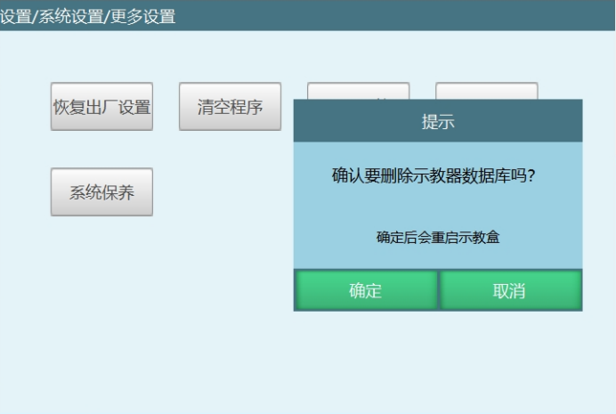

####  系统保养

功能：对机器人和控制器达到设定时间进行保养维护。

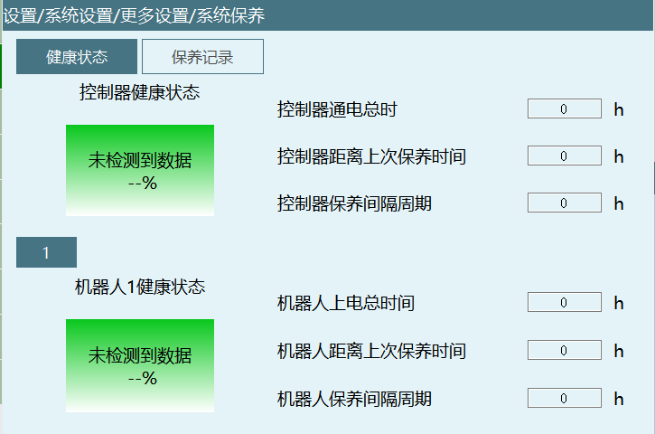

1. 控制器通电时间：第一次更新保养密钥时开始记录该时间，此为总时长，更新保养密钥后不会清零。
2. 控制器距离上次保养时间：更新保养密钥时开始记录该时间，此为更新密钥间隔时间，更新含有控制器保养密钥后将会清零。
3. 控制器保养间隔周期：保养密钥生成器的间隔周期时间，勾选默认时为8760小时，取消勾选填入则为自定义时间。
4. 机器人上电总时间：第一次更新保养密钥时开始记录该时间，此为总时长，更新保养密钥后不会清零。
5. 机器人距离上次保养时间：更新保养密钥时开始记录该时间，此为更新密钥间隔时间，更新含有机器人保养密钥后将会清零。
6. 机器人保养间隔周期：保养密钥生成器的间隔周期时间，勾选默认时为8760小时，取消勾选填入则为自定义时间。

使用说明：

1. 首次使用需要使用Windows密钥生成软件进行生成保养密钥。
2. 填入控制器ID，选择需要生成的密钥类型与周期。
3. 控制器ID：点击更新密钥按钮，控制器ID显示。

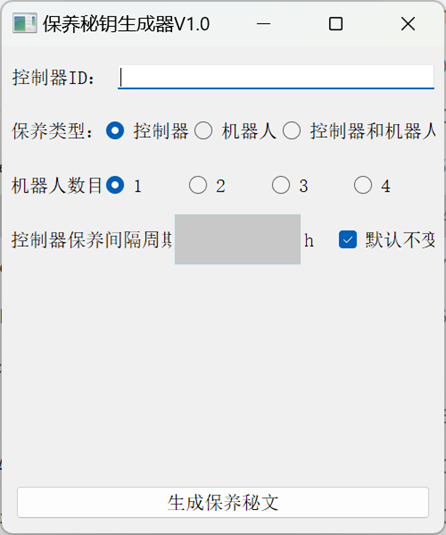

1. 点击生成保养秘文，软件会生成一个名为maintenance的密钥文件。
2. 将该文件拷入U盘根目录。

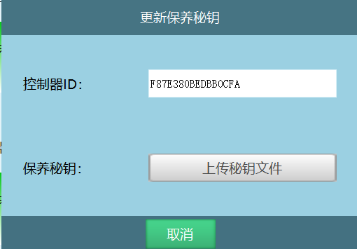

1. 插入U盘，点击更新密钥按钮，上传秘钥文件。
2. 示教器与控制器自动重启，开机后生效。

注释：

- 导入成功后，maintenance密钥文件在控制器/home/inexbot/robot/目录，并重新命名为maintenanceLicense，如果需要重置通电总时长，删除该文件重启即可。
- 保养间隔周期默认为8760小时，如填入自定义时间则生成自定义时间的密钥。

###  远程程序设置

请查看系统操作手册《示教运行》。

###  复位点设置

点击示教器上的“复位”按钮机器人可以回到复位点。

点击监控-快捷键-回安全点机器人可以回到复位点。

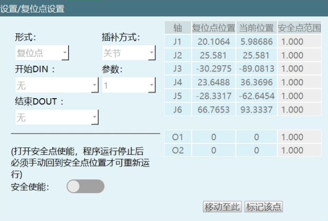

形式：复位点，复位程序：

1. 复位点：机器人移动到目标复位点位置后点击【标记该点】，点击【确定】复位点设置成功。示教模式下点击复位按钮，机器人会运动到设置的复位点位置。

如上图所示点击复位机器人运动到复位点位置（20.1064，25.581，-30.2975，23.6488，-28.3317，66.7653）。

1. 复位程序：用户插入指令后点击复位开始运行复位程序。

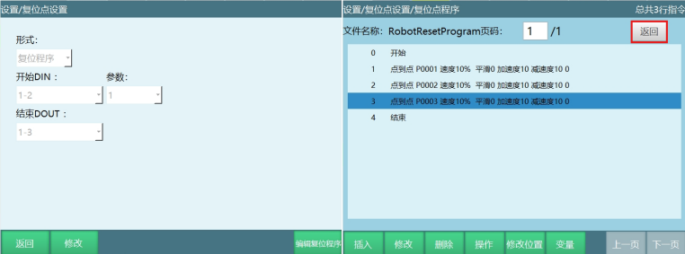

- 设置好参数，点击【编辑复位程序】；
- 插入目标指令后点击复位点程序界面的“返回”退出此界面，不点击“返回”无法退出此界面。

1. 复位点位置：记录的复位点点位。
2. 当前位置：机器人当前实际位置。
3. 安全点范围：范围[-10,10]，打开安全使能，运行模式下运行程序，如果当前位置不在安全点范围的话无法运行程序，需要切到示教模式手动回到安全点位置后才可重新运行程序。

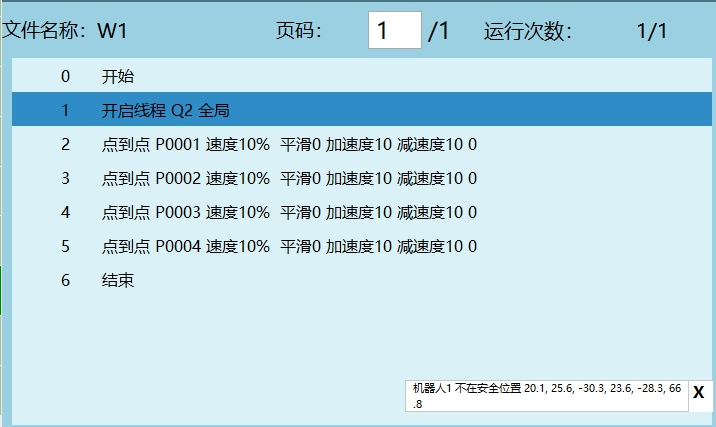

说明：示教模式和远程模式下打开安全使能对程序的运行没有影响。

1. 标记该点：机器人运动目标点位后，点击“标记该点”，点击“确定”复位点标记成功。
2. 移动至此：示教模式下点击“运动至此”机器人运动到复位点。
3. 插补方式：关节插补、直线插补。
4. 开始DIN:设置IO输入信号，远程模式下给信号后机器人运动到复位点或者复位程序。
5. 参数：0、1(低电平启动、高电平启动)。
6. 结束DOUT:远程模式下机器人运行到复位点后信号的反馈，假设设置的输出信号为1-3，机器人运行到复位点后IO的1-3端口由低电平-高电平。

说明：IO启动复位仅支持远程模式。

###  IO设置

见下图：

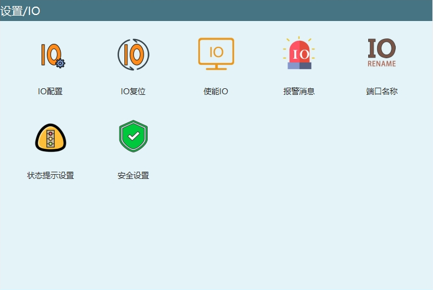

####  IO配置

配置方法见下图：

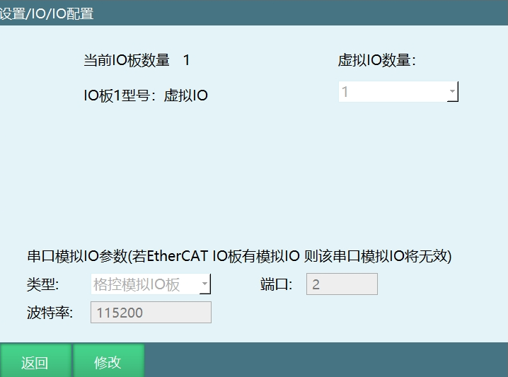

点击设置-IO，进入IO配置界面,此界面可以看到IO板数量和当前连接IO板的型号，点击【修改】可以设置IO数量，最多支持连接4块IO板。

注：虚拟IO仅供程序调试及程序演示使用，并没有任何IO信号接入。

####  IO复位

此功能是根据用户在执行了IO复位操作、切模式操作、程序报错操作后信号的输出反馈。

说明：打开是否复位使能后在执行IO复位操作、切模式操作、程序报错操作时选择的输出端口才会复位，不打开使能输出端口无法复位。

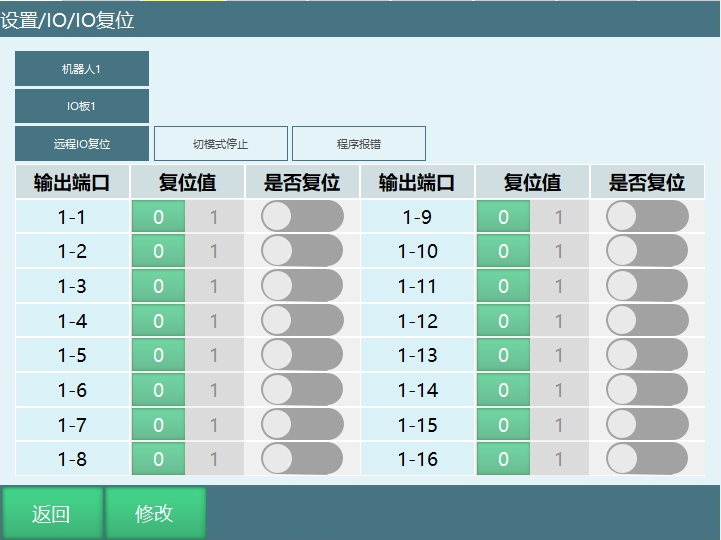

1. 远程IO复位：远程模式下执行IO复位操作后在运行到复位点或者运行完复位程序后选择的输出端口复位到复位值。

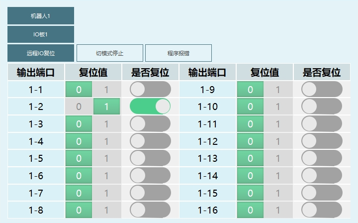

示例说明：远程模式下机器人运行到复位点或者运行完复位程序后输出端口1-2口复位，复位值为1。

1. 切模式停止：程序运行时通过切模式导致程序运行停止的操作，在执行切模式操作后根据选择的输出端口复位到复位值。

示例说明：程序在运行模式运行程序时将操作模式切换到示教模式，选择复位的输出端口是1-1，复位值为1，打开是否复位使能。

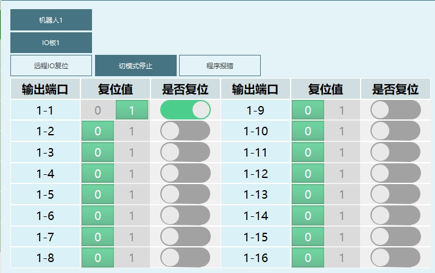

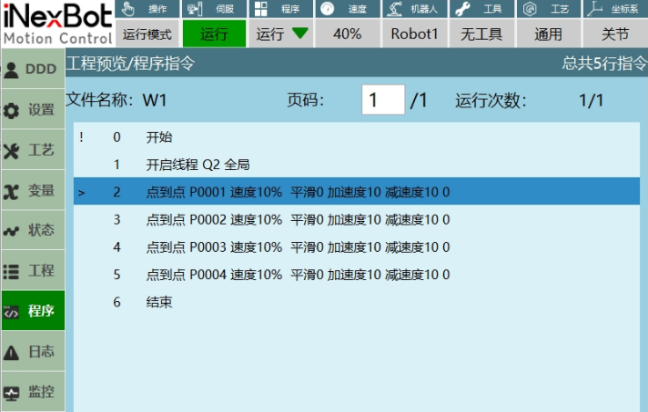

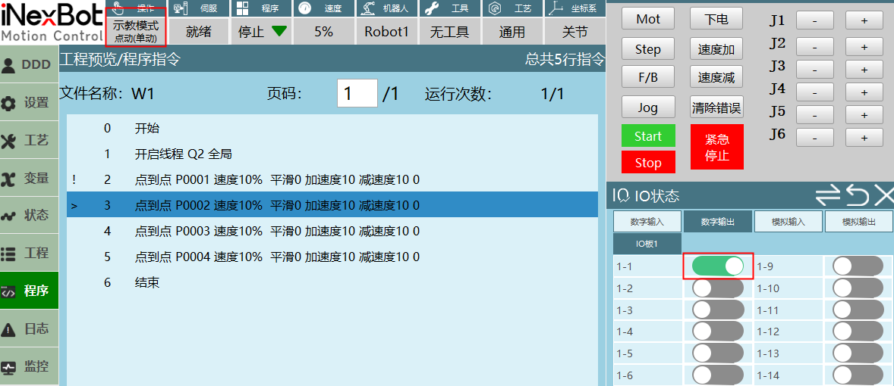

1. 程序报错：程序运行时出现报错导致程序运行停止，将输出IO端口复位到复位值。

说明：只有会清断点的报错才会触发IO复位-程序报错。

####  使能IO

1. 如果使用使能硬接线示教盒需在连接好线缆后，在此页面选择对应的DIN的端口并打开使能开关，上电使能功能则由IO板输入信号控制；非使能硬接线示教盒请勿设置。
2. 打开此功能后示教盒使能按键失效，不可使用。
3. 使能端口1为上电使能，使能端口2为下电使能。
4. 上电只需要打开使能端口1，在任何情况下，只要使能端口2打开，均会下电。

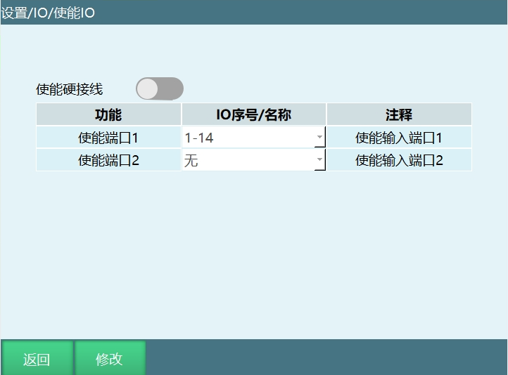

####  报警消息

点击【设置】，选择【IO报警信息】进入界面，用户自定义数字输入和数字输出的报警类型和内容。

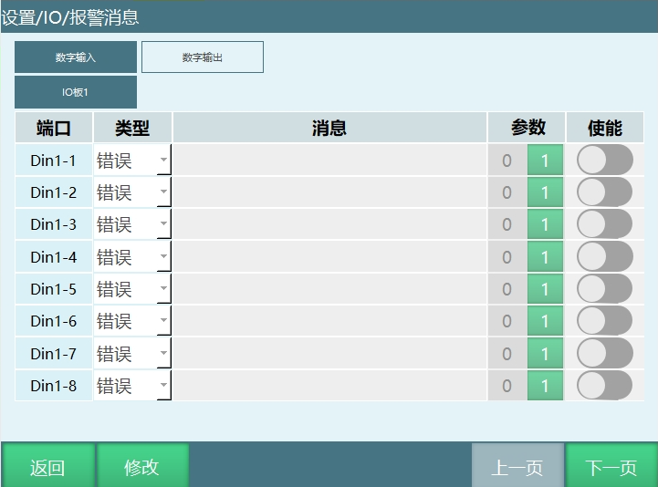

1. 【端口】IO端口。
2. 【类型】IO报警信息输出的类型（消息、警告、错误）。
3. 【消息】触发IO报警后输出的内容。
4. 【参数】当设置为0时，IO端口状态为0时触发报警信息。
5. 当设置为1时，IO端口状态为1时触发报警信息。
6. 【使能】打开使能开关，IO端口到达设置好的状态回会触发报警信息，关闭使能开关，无论io什么状态都不会触发报警信息。

数字输出报警消息参数的设置和数字输入用法一样，下面以数字输入报警信息的使用作为示例说明。

1. 示例说明1：端口选择Din1-1，类型选择消息，消息内容为“这是一条消息”，参数1，使能打开。如下图：

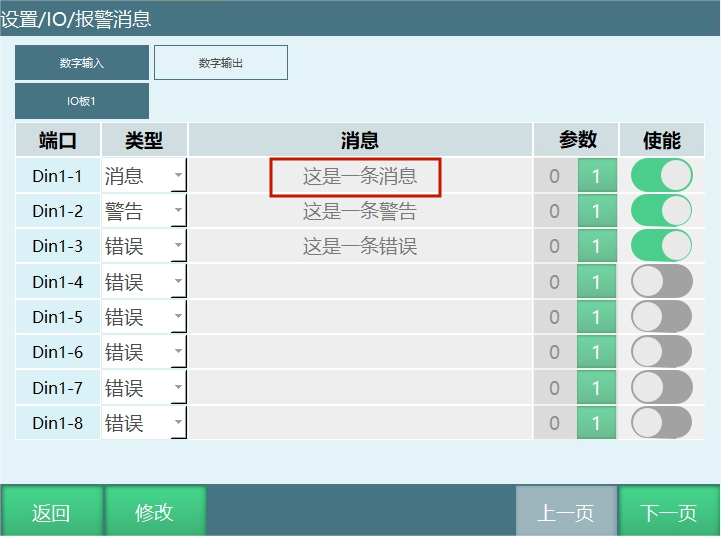

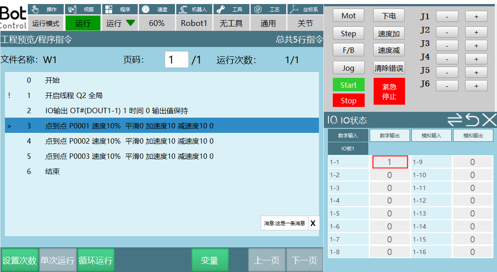

当输入端口1-1由低电平0-高电平1触发报警消息，示教器上弹出白色消息提示，程序正常运行。

1. 示例说明2：端口选择Din1-1，类型选择消息，消息内容为“这是一条警告”；参数1，使能打开。如下图：

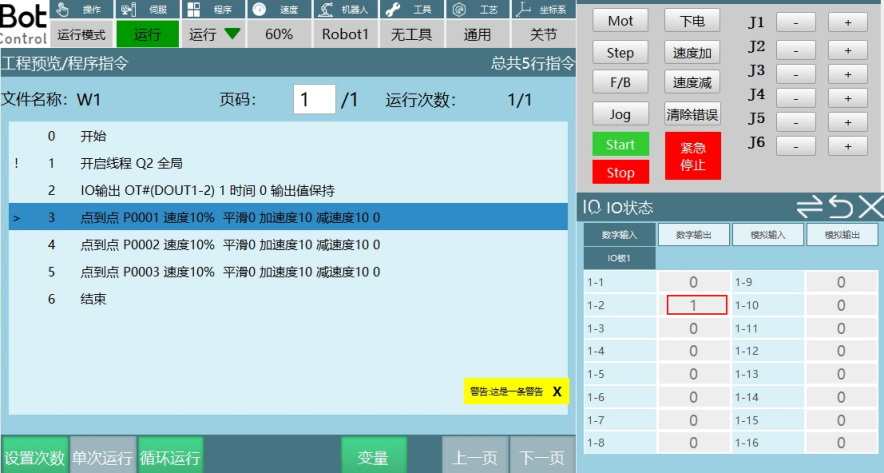

当输入端口1-2由低电平0-高电平1触发报警消息，示教器上弹出黄色警告消提示，程序正常运行。

1. 示例说明3：端口选择Din1-3，类型选择错误，消息内容为“这是一条错误”，参数1，使能打开。如图：

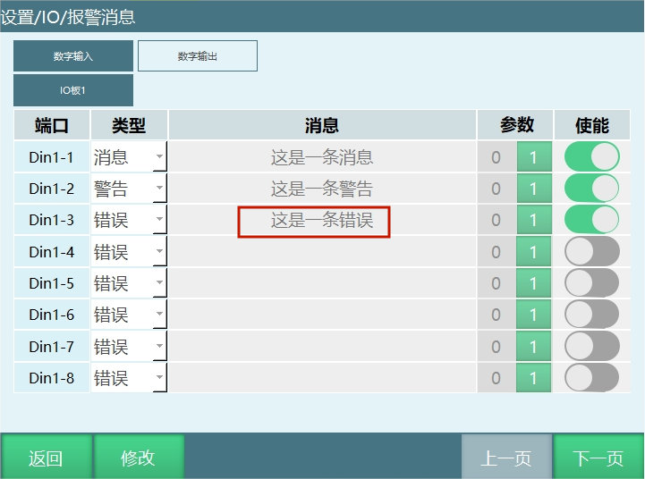

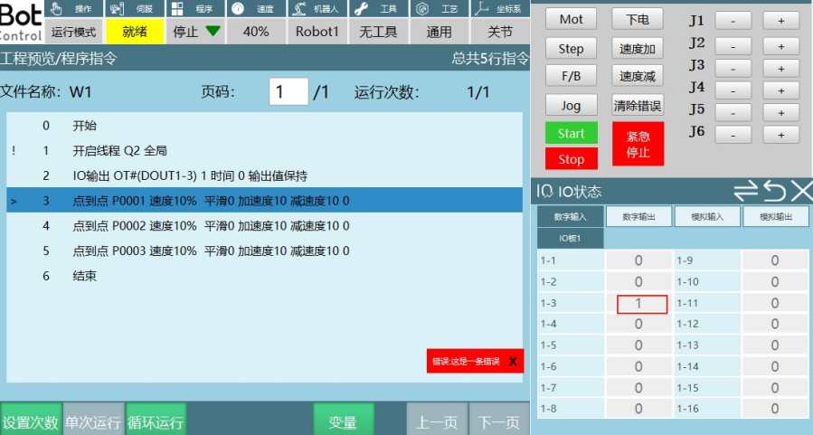

当输入端口1-3由低电平0-高电平1触发报警消息，示教器上弹出红色报错提示，伺服下电，程序停止运行。

####  端口名称

功能：给IO板的数字端口和模拟端口定义名称，方便用户在用到多个信号时知道所使用的IO端口所代表的意思。例如焊接工艺里面需要用到很多信号，定义端口名称后就知道每个端口所表示的意思。

如下图定义端口名称，保存后端口名称修改成功。

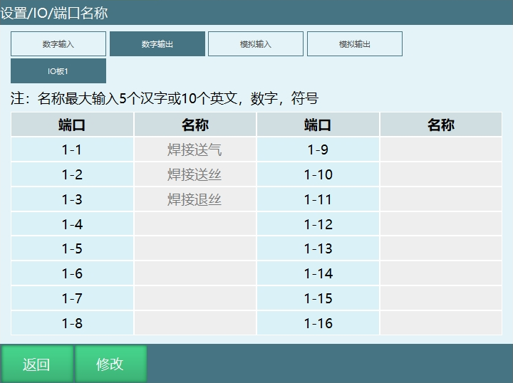

指令里面对应端口名称被修改：

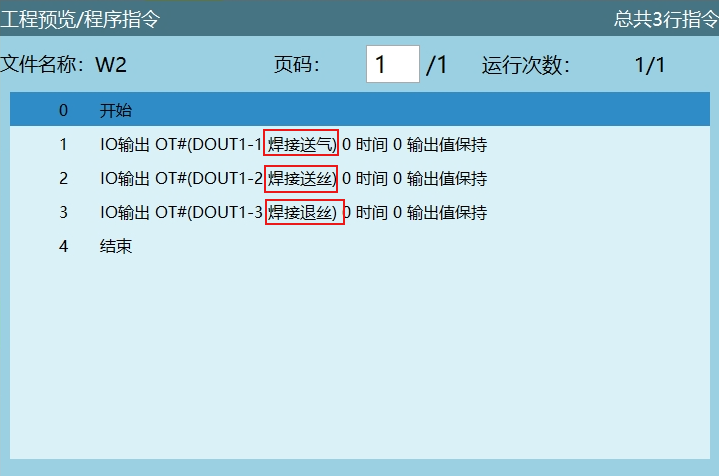

监控-IO状态界面端口名被修改：

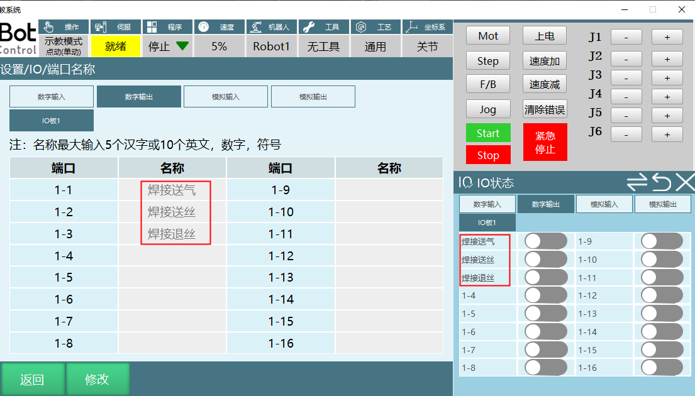

####  状态提示设置

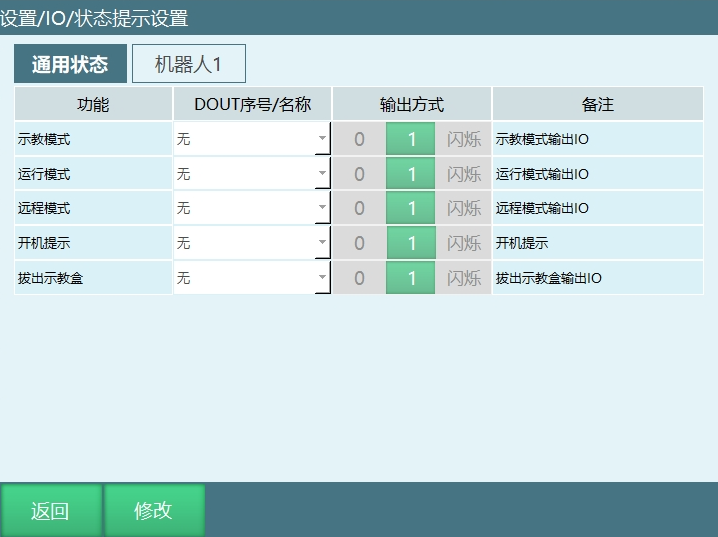

输出方式：

| 0 | 低电平输出提示 |
| --- | --- |
| 1 | 高电平输出提示 |
| 闪烁 | 选中的IO闪烁输出提示 |

通用状态：

1. 开机提示：控制器处于开机状态时IO输出提示。
2. 示教模式：当前操作模式为示教模式时IO输出提示。
3. 运行模式：当前操作模式为运行模式时IO输出提示。
4. 远程模式：当前操作模式为远程模式时IO输出提示。
5. 拔出示教盒：拔出示教盒后IO输出提示。

说明：以下状态IO输出的端口和输出方式根据用户设置的参数输出提示。

示例说明1：功能选择运行模式；输出端口1-1；输出方式1。

当操作模式为运行模式时IO的1-1口输出高电平。

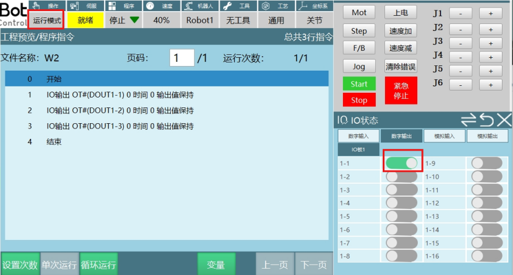

机器人状态提示：

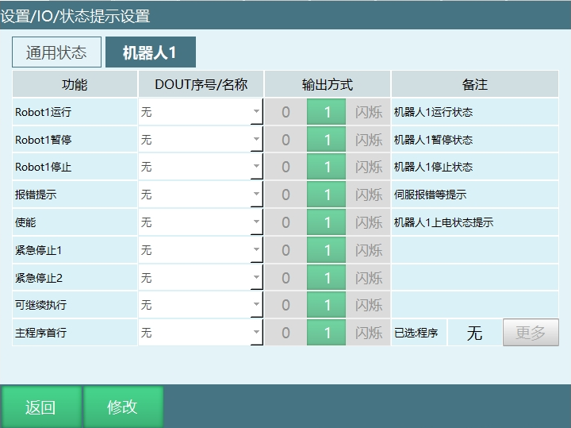

1. Robot1运行：机器人1程序状态为运行时IO输出提示。
2. Robot1暂停：机器人1程序状态为暂停时IO输出提示。
3. Robot1停止：机器人1程序状态为停止时IO输出提示。
4. 报错提示：机器人报错时IO输出提示。
5. 使能：伺服处于上电状态时IO输出提示。
6. 紧急停止1：紧急停止1触发后IO输出提示。
7. 紧急停止2：紧急停止2触发后IO输出提示。
8. 主程序首行：光标跳至“主程序”首行时IO输出提示。
9. 可继续执行：运行暂停的程序时IO输出提示。

示例说明2：功能选择Robot1运行；输出端口1-2；输出方式1。

当程序处于运行状态时IO的1-2口输出高电平。

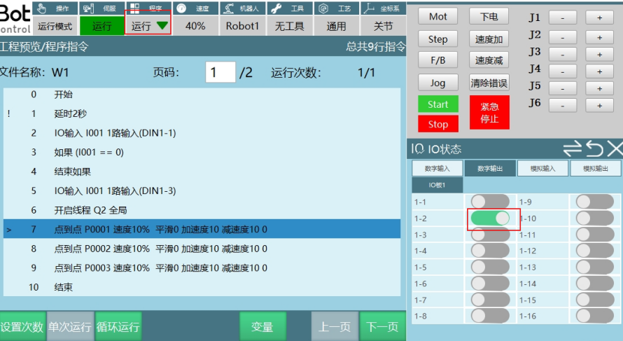

###  安全设置

紧急停止：触发紧急停止信号后机器人下电，伺服状态切换为停止。

安全光幕：触发安全光幕机器人暂停运行，再次按下启动按钮机器人继续运行。

屏蔽紧急停止：紧急停止触发后打开使能屏蔽紧急停止信号。

快速停止时间：紧急停止触发后机器人快速停止时间。

屏蔽时间：紧急停止触发后信号的屏蔽时间，在屏蔽时间内点击清错按键将机器人可以移动到安全位置，超过屏蔽时间后控制器报错（机器人屏蔽结束，紧急停止被触发）。

下图是安全设置界面：

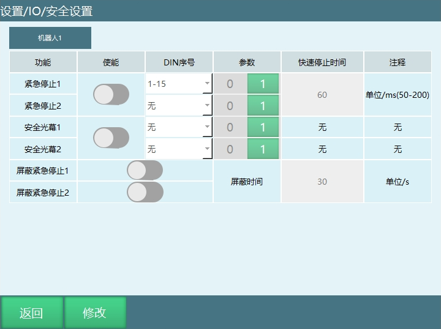

示例说明：如下图所示设置参数（此参数仅为说明，无实际意义）：

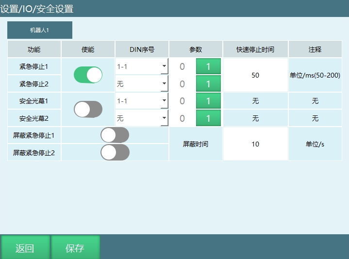

当IO端口1-1口由低电平0—高电平1时，紧急停止被触发，在设置的50ms之内机器人停止运行。

###  机器人参数

#### 干涉区范围

标定的X、Y、Z确定空间范围，以标定的空间范围为基准用户可以选择在区域内或者区域外限制机器人运动。如下图所示：

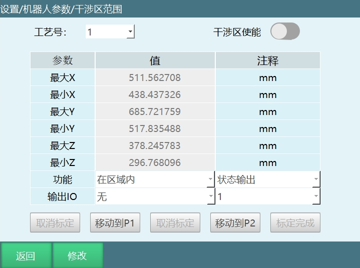

确定干涉区范围可以直接手填参数、移动机器人标定范围。

1. 手填参数；

- 点击【修改】在对应参数行填入数值；
- 打开干涉区使能，点击【保存】，干涉区范围设置完成。

1. 移动机器人标定；

- 点击【修改】；
- 移动机器人点击【标定P1】；
- 移动机器人点击【标定P2】；
- 点击【标定完成】；
- 打开干涉区使能，点击【保存】，干涉区范围设置完成。

界面参数说明：

| 参数 | 参数说明 |
| --- | --- |
| 工艺号 | 可以选择9个工艺号，可以多个同时使用 |
| 干涉区使能 | 打开干涉区使能设置的干涉区范围才会生效 |
| 最小X | 运动范围X轴最小值 |
| 最大X | 运动范围X轴最大值 |
| 最小Y | 运动范围Y轴最小值 |
| 最大Y | 运动范围Y轴最大值 |
| 最小Z | 运动范围Z轴最小值 |
| 最大Z | 运动范围Z轴最大值 |
| 功能 | 区域内 | 状态输出：机器人位于干涉区内时触发状态输出 |
| 禁止运动：机器人位于干涉区内时禁止机器人运行 |
| 区域外 | 状态输出：机器人位于干涉区外时触发状态输出 |
| 禁止运动：机器人位于干涉区外时禁止机器人运行 |
| 输出IO | 功能选项为状态输出时有效，输出干涉区状态 |
| 标定P1、P2 | 通过标定的P1点和P2点确定干涉区范围 |
| 移动到P1、P2 | 示教模式下上使能将机器人移动到标定的位置 |
| 标定完成 | 自动计算最大值与最小值 |

示例说明1（区域内禁止运动）：机器人在运行时进入干涉区报错，伺服下电，机器人停止运动。如下图：

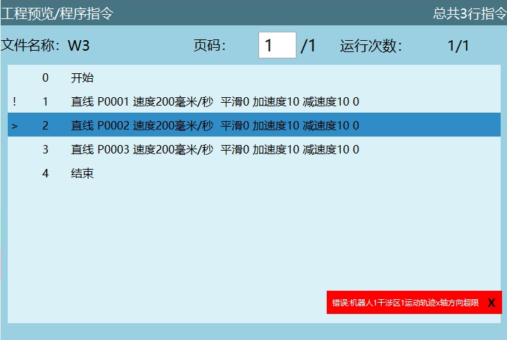

示例说明2（区域内状态输出）：机器人运动到干涉区时IO端口输出提示。详见下图：

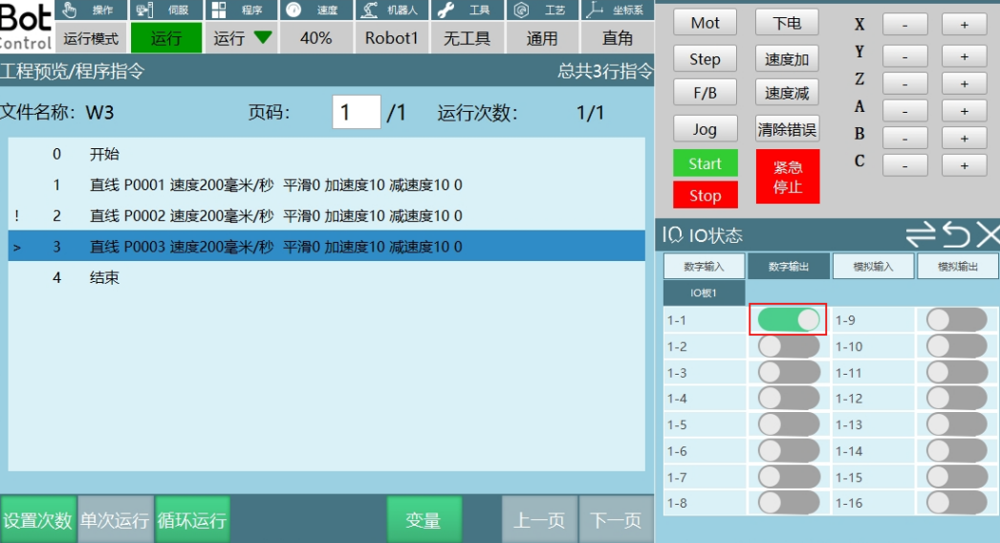

####  零点位置

每个坐标系总有一个所有轴都为 0 的点，就是坐标系原点。对于关节坐标系来说，这个点叫做零点位置。也就是机器人的第 1-6 轴的数值均为 0 的位置。如图：

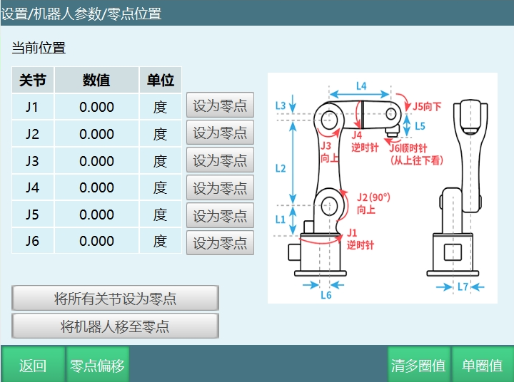

【设为零点】：点击设为零点可单独设置某个轴的零点位置。

【将所有关节设为零点】：点击此按钮可修改所有轴的零点位置。

【将机器人移至零点】：示教模式下上使能点击此按钮机器人移至零点位置。

#####  零点偏移

零点偏移可以在用户需要调整零点时使用，手动输入数值。

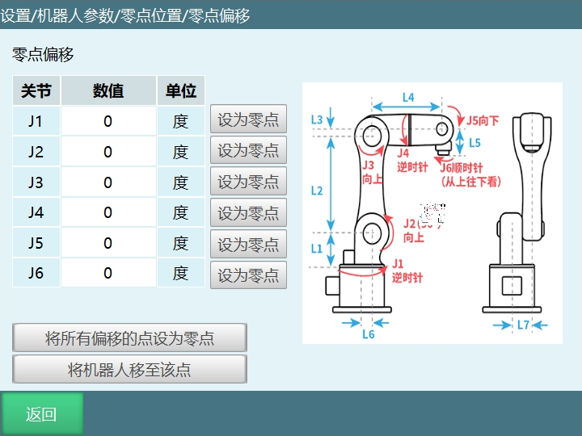

【设为零点】：单独调整某个轴的零点位置，选中需要调整零点位置的轴手动输入值，点击此按钮，然后点击此界面的【返回】进入零点位置界面，点击对应轴的【设为零点】零点位置被修改。

【将所有偏移的点设为零点】：调整所有轴的零点位置，手动输入数值后点击此按钮，然后点击此界面的【返回】进入零点位置界面，点击【将所有关节设为零点】所有轴的零点位置被修改。

【将机器人移至该点】：示教模式下上使能，点击此按钮，机器人运动到零点位置。

#####  清多圈值

多圈值就是伺服电机圈数。

清空：清除某个轴的多圈值。

清空所有轴多圈值：清空所有轴的多圈值。

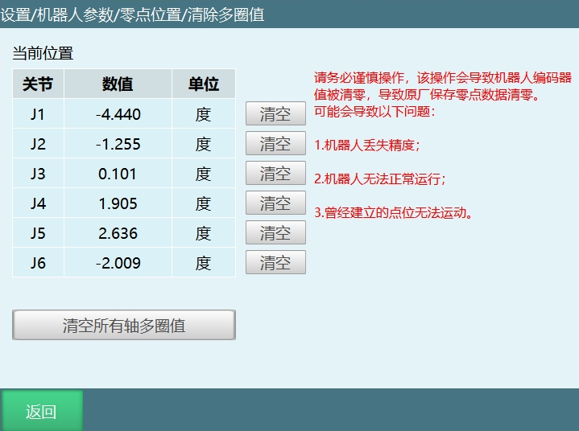

|  请务必谨慎操作，该操作会导致机器人编码器值被清零，导致原厂保存的零点数据清零！ 可能会导致以下问题： 1. 机器人丢失精度； 2. 机器人无法正常运行； 3. 曾经建立的点位无法运行。 |
| --- |

#####  单圈值

单圈值是根据分辨率与旋转角度在一圈内得出的脉冲数。单圈值设置界面见下：

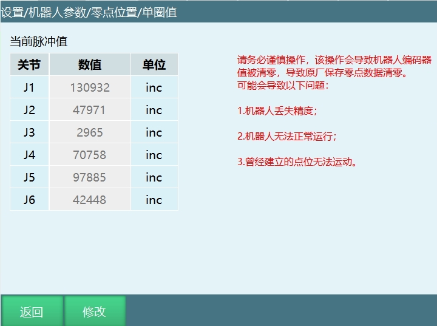

#####  零点丢失如何找回？

前置条件：

1. 机器人只是因为操作失误导致零点丢失，发生碰撞无法找回。
2. 记录未丢失零点前单圈值数据（没有清多圈值时，单圈值界面显示的数值为上次零点标定时的数据）。

操作步骤：

1. 找到丢失零点前记录的单圈值备用。
2. 将机器人示教到机械零点位置。
3. 清机器人所有轴多圈值（此操作会清除多圈值、单圈值，请谨慎操作）。
4. 标定机器人所有轴零点。
5. 在单圈值界面输入记录的单圈值数据。
6. 操作机器人回零，确认零点是否正确。

####  DH参数

#####  DH参数说明

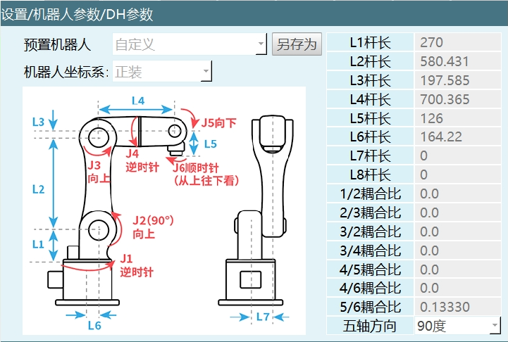

1. 杆长：所有杆长值是机器人在零点位置时测量的。
2. 耦合比：机器人在运动过程中，一个关节运动时另一个关节也会运动，这就说明有耦合，为了抵消这种耦合作用，就需要耦合比。

耦合比=跟随轴旋转角度​/主轴旋转角度。

例如：我们操作 1 轴旋转了 10°，发现 2轴跟随旋转了 15°，那么耦合比为 15/10=1.5。

1. 五轴方向：机器人在零点位置时五轴的方向
2. 三轴方向（机型为六轴协作机器人）：六轴协作机器人有两个零点位置，三轴方向，五轴方向（0,180），三轴方向，五轴方向（-90，90）。
3. 螺距（SCARA机器人）：SCARA 机器人的 3 轴是控制丝杆上下运动，控制丝杆的旋转轴转动 360° 时丝杆上下移动的距离就是螺距。
4. J2+J3最大值、J2+J3最小值。

只有当2/3存在耦合时，动态限位才会生效，当J2+J3最大值和J2+J3最小值不在设置的参数范围内，在运行程序时会报错（机器人2、3轴动态限位超限）。

1. 转化比：转化比就是关节转360度（也可理解为电机转一圈）走的距离（单位：mm）。

转换比计算方法：1 齿距*齿轮，2 转换比填1然后对应轴转360度，然后量走的距离，将量完的距离填入。

例如：电机旋转一圈会有角度值，我们通过转化比可以将角度值转化成长度值。

1. 放大比（四轴码垛丝杆）：工具末端移动的距离/三轴丝杠移动的距离。
2. DH参数界面新增另存参数功能，方便用户切换参数。

- 点击【另存为】，如下图所示给文件命名，点击【确定】。

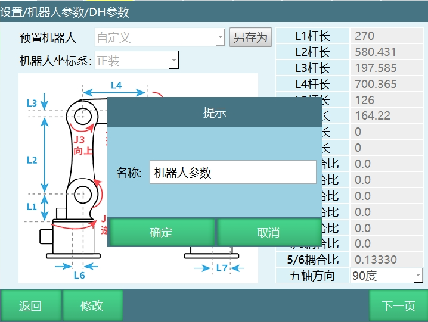

- 点击预置机器人选择预置参数文件，用户可以修改DH参数和关节参数，点击【关节参数】进入关节参数界面修改，不需要的话在当前界面直接修改DH参数即可。
- 点击【保存】，用户所修改的参数被存入“机器人参数.json文件”。

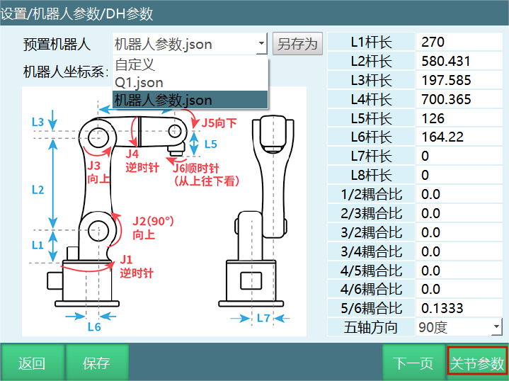

####  关节参数

1. 关节正限位：机器人正方向旋转的角度或移动的距离，运动时超过限位会报错（机器人点动位置到达极限）。
2. 关节方限位：机器人反方向旋转的角度或移动的距离，运动时超过限位会报错（机器人点动位置到达极限）。
3. 关节减速比：减速机的减速比。
4. 编码器位数：填写当前所使用的编码器位数，注意不要随便填写，否则在点动机器人时飞车。
5. 额定正转速：电机正方向能够运行的转速。
6. 额定反转速：电机反方向能够运行的转速。
7. 最大正转速：例如1倍时从0速到达额定正速度时间为10秒，那么2倍就是5秒到达额定正速度。
8. 最大反转速：例如1倍时从0速到达额定反速度时间为10秒，那么2倍就是5秒到达额定反速度。
9. 关节额定正速度：机器人关节额定正方向速度，关节额定正速度计算方法：额定正转速*360/60/减速比。
10. 关节额定反速度：机器人关节额定反方向速度，关节额定反速度计算方法：额定反转速*360/60/减速比。
11. 最大加速度：例如1倍时从0速到达最大加速度时间为10秒，那么2倍就是5秒到达最大加速度。
12. 最大减速度：例如1倍时从0速到达最大减速度时间为10秒，那么2倍就是5秒到达最大减小速度。
13. 模型方向：模型方向可参照零点位置界面关节正方向示意图设置，各轴点动“+”键应与关节正方向示意图方向相同，相同选1，相反选-1。

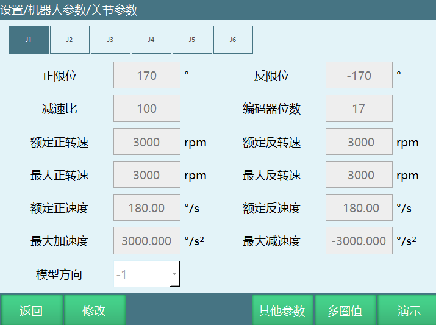

#####  其它参数

齿轮反向间隙：略。

#####  多圈值

点击【设置】-【机器人参数】-【关节参数】进入关节参数界面，点击【多圈值】修改编码器的范围。

编码器多圈值溢出计数功能：该功能用来消除编码器最大/最小值之间跳变产生的影响。

例如编码器多圈值范围为[-2147483648,2147483647]，当前编码器多圈值位置为2147483647，则再往正方向转1个单位则为-2147483648，如系统不知道编码器多圈值范围则会认为机器人突然跳变，并不会知道实际只转了1个单位，此时则容易出现飞车现象。

|  必须填写该参数，不填写可能出现以下问题： 1. 点位出现较大跳变，例如突然从4度变为40度。 2. 飞车。 若配置从动轴，则从动轴的编码器最大/最小值也要填写！ |
| --- |

####  笛卡尔参数

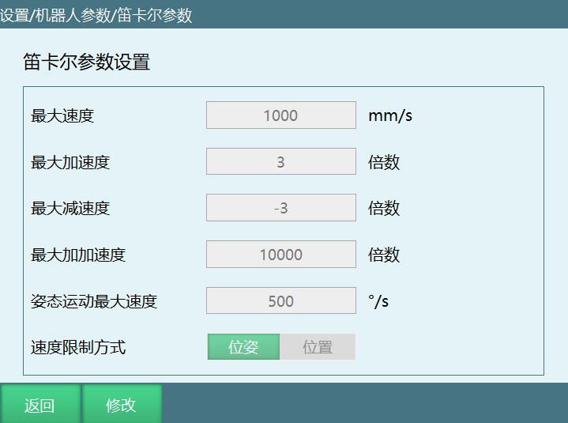

1. 最大速度

机器人运行时的最大线速度，此处填写的速度值会影响线速度的范围，如果最大速度填写的是2000，那在插入一条直线指令时速度参数最大范围会变为2000。

1. 最大加速度

最大加速度1倍时机器人从0速到达最大加速度的时间为5秒，最大加速度2倍时从0速到达最大加速度的时间为2.5秒。

1. 最大减速度

最大减速度1倍时机器人从0速到达最大减速度的时间为5秒，最大减速度2倍时从0速到达最大减速度的时间为2.5秒。

1. 最大加加速度

当机器人插补方式为加加速度插补时笛卡尔参数界面才会显示最大加加速度。

1. 姿态运动最大速度

机器人运动时ABC轴的最大速度，超过会限速。

1. 速度限制方式

位姿：运动时要考虑位置及姿态，任何一个都不会超过最大限速。

位置：限制直线运动最大速度，姿态运动最大速度不限制。

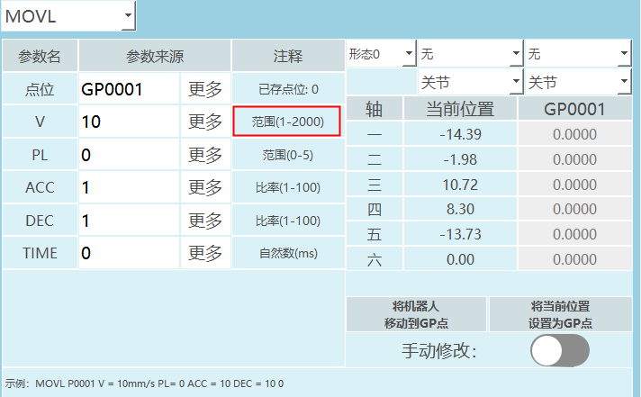

####  点动速度

说明：此处的全局速度表示示教器状态栏上面的速度。

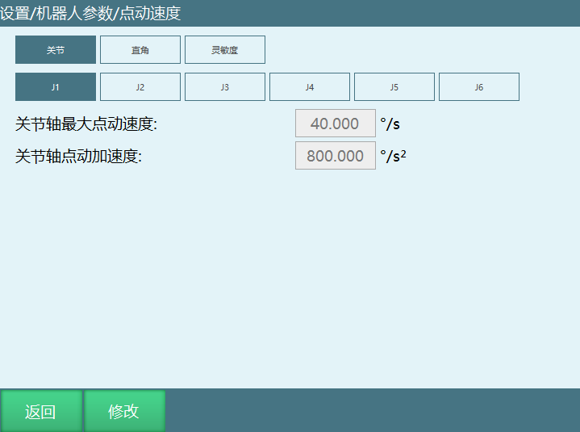

关节最大点动速度：关节坐标下点动机器人时的最大速度=关节轴最大点动速度*全局速度。

直角最大点动速度：直角坐标下点动机器人时的最大速度=直角最大点动速度*全局速度。

关节轴点动加速度：【1,800】。

点动灵敏度：上电后，机器人抖动范围大于点动灵敏度时点动操作无效。

####  运动参数

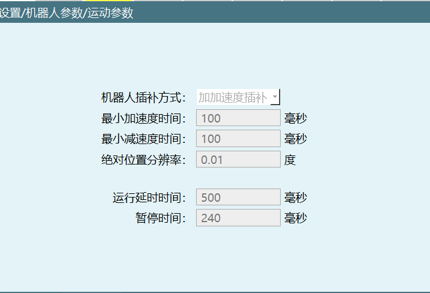

机器人插补方式：S型插补、梯形插补、加加速度插补。

最小加速度时间：最小加速度时间指的是机器人从静止状态加速至目标速度所需的最短时间，或者从一个较低的速度加速至较高的速度所需的时间。在实际应用中，这通常受到机器人驱动系统的限制，比如伺服电机的扭矩和功率。快速加速可能会导致电机过载或产生过多的振动和噪音，从而降低机器人的寿命或造成不稳定的运动。

最小减速度时间：最小减速度时间则指的是机器人从最高速度减速至静止状态，或者从较高速度减速至较低速度所需的最短时间。这同样受到驱动系统能力的约束，尤其是在高速减速时，电机需要处理反向扭矩并可能需要进行能量回收或消耗，以避免过电压或过热。在某些情况下，如果减速度过快，还可能触发安全机制，如急停系统。

**在机器人运行中的作用：**

- 响应性：在需要快速响应的应用中，如避障或抓取不稳定对象，最小化这些时间可以提升机器人的反应速度。
- 安全性：控制加速度和减速度可以减少因突然变化引起的冲击，保护机器人本身及其周围环境的安全。
- 精度：在精密操作中，适当的加速度和减速度可以提高定位精度，避免因惯性引起的误差。
- 能源效率：优化这些参数可以减少能量消耗，尤其是在频繁启动和停止的应用中。
- 平滑性：通过控制加减速时间，可以减少运动过程中的冲击，使得机器人动作更加平滑，减少对结构的应力。

在实际应用中，机器人控制器会根据运动规划、负载情况以及安全要求来动态调整加速度和减速度时间，以达到最佳的运动效果。

**使用范例：**

在工程界面新建作业文件，插入多条运动指令（十条左右），每个指令间的点位间距在100mm以内。

- 在程序中插入计时指令记录运动时间。
- 插入运动类指令，如点到点、直线、圆弧等，为使每个点位间距在100mm以内其点位P001，P002等可在变量中手动修改调整。

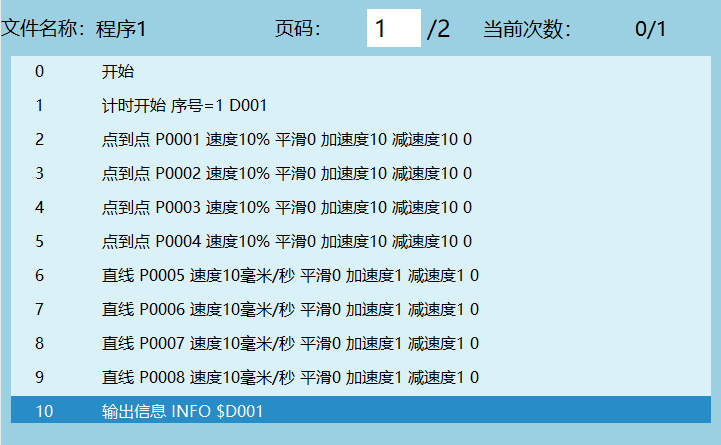

- 不修改作业文件运动指令及指令各个参数的情况下，修改最小加速度时间和最小减速度时间，测试在不同最小加速度时间和最小减速度时间的运动时间，观察机器运动情况。

绝对位置分辨率：运行点位时2个点相差小于分辨率时，当成1个点执行。

例如：设置分辨率为0.01。

GP0001关节点位(10，0，0，0，0，0)；

GP0002关节点位(10.001，0，0，0，0，0)。

当运行这两个点位时，会被当成一个点执行。

运行延时时间：程序启动时的延时时间。

---

##  AI 检索专用问答对 (Q&A for Retrieval)

**Q: 如何进行系统备份？**

A: 将U盘插入示教器USB口，点击设置-系统设置-自动备份-U盘备份，根据备份时当前运行的系统程序定义SystemBackup的文件名前缀为T30-1还是T30-2。

**Q: 如何修改示教器的界面语言？**

A: 点击设置-系统设置-修改示教器配置-界面语言，选择需要的语言，界面语言如何切换请查看《多语言功能手册》。

**Q: 如何设置机器人的零点位置？**

A: 点击设置-机器人参数-零点位置，点击【设为零点】可单独设置某个轴的零点位置，点击【将所有关节设为零点】可修改所有轴的零点位置。

**Q: 如何导入/导出程序？**

A: 导出程序：将U盘插入示教器的USB接口，点击设置-系统设置-导出程序，程序导出到U盘根目录下。
导入程序：将U盘插入示教器的USB接口，点击设置-系统设置-导入程序，选择上传的文件，点击确定开始导入程序。

**Q: 如何设置IO报警信息？**

A: 点击设置-IO-IO报警信息，选择IO端口，设置报警类型（消息、警告、错误），输入报警消息内容，设置参数（0或1），打开使能开关。

**Q: 如何查看控制器id和剩余加密时间**

A: 点击示教器上左上角logo即可查看

---

## 4 相关资源

- [Modbus功能使用手册](./Modbus功能使用手册.md)
- [TCP通讯功能手册](./TCP通讯功能手册.md)
- [OPC-UA参数](./OPC-UA参数.md)
- [示教器功能按键说明手册](./示教器功能按键说明手册.md)
- [外部轴使用手册](./外部轴使用手册.md)
- [示教器编程指导手册](./示教器编程指导手册.md)
- [程序控制类指令](./程序控制类指令.md)
- [Modbus数值，变量](./Modbus功能使用手册.md)
