# 纳博特机器人自动标定系统NexAutoCail使用教程

目前激光标定仪支持的机型有**七轴串联多关节、七轴串联CBCBCBA、六轴串联、六轴协作、五轴协作、四轴SCARE、四轴SCARE异型一**等机型，后续会适配更多机型

性能测试，目前支持的有轨迹准确度（APt）、轨迹重复度（RPt）、距离准确度(ADp)、距离重复度(RDp)、位姿准确度（APp）、位姿重复度(RPp)，其他国标14项内容会逐步完善

## 标定功能

激光标定仪的标定功能主要是校准机器人本体的参数，主要有DH参数、减速比、耦合比等

**标定步骤：**\
1、双机打开软件，选择符合的机器人类型、项目（校准或性能测试）、标定仪类型（目前支持API、中图两种），选择好后点击【进入】

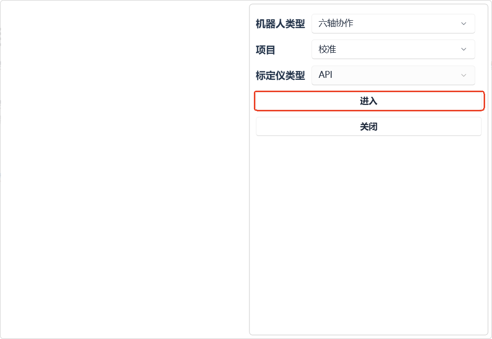{width="3.7184798775153105in"
height="2.5583136482939635in"}

2、点击【控制器】，输入连接控制器的IP地址（如下图以192.168.3.15为例），点击【连接】

**（连接成功，【控制器】按钮背景色为绿色，连接失败背景色为白色）**

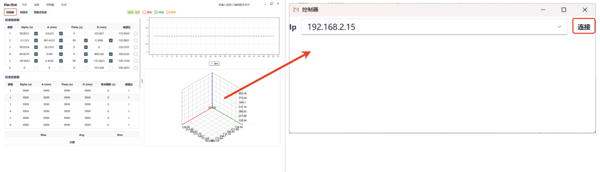

连接上控制器会自动读取机器人DH参数以及当前位置的关机坐标及直角坐标点位信息，如下图所示：

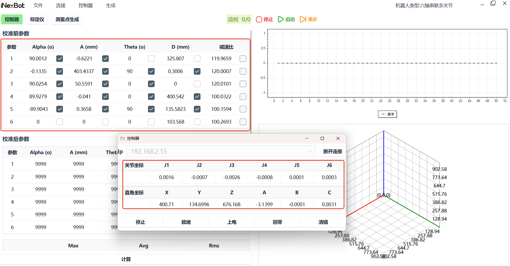

3、连接激光标定仪（以API为例），点击【标定仪】，点击弹窗的【连接】

**（连接成功，【标定仪】按钮背景色为绿色，连接失败背景色为白色）**

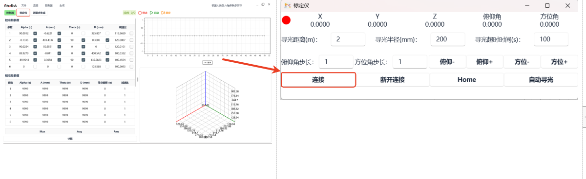

点击【连接】后在依次按照下图所示点击【Connect
Tracker】、【OK】(IP不用更改，API激光标定仪默认的IP是192.168.0.168)

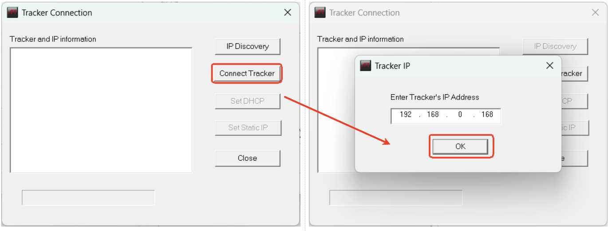

**成功连接标定仪后，标定仪弹窗内会有当前激光标定仪靶球位置信息，如下图所示：**

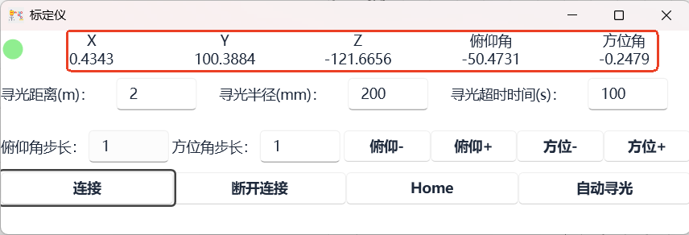

（连接成功控制器和标定仪后，将激光标定仪上的靶球放置机器人抓夹处或通过"引光"方式将激光引至机器人夹爪靶球上）

3、生成测试点（通常是50个点）

名词解释：

点数：生成的测试点数\
停顿时间：运动相邻两个点位的停顿时间，一般是\"1-3\"s

姿态变化：默认选A，有"无、A、B、C"四种可选

轴限位：默认不选择，不使用限位，如果场地较小或机器人没有接可以选择"启用直角限位或者启用关节限位或者启用直角限位与关节限位"

（以直角限位为例，在直角坐标下运动X-、X+、Y-、Y+、Z-、Z+，选择合适的位置将示教器的值填写在X、Y、Z的反限位、正限位）

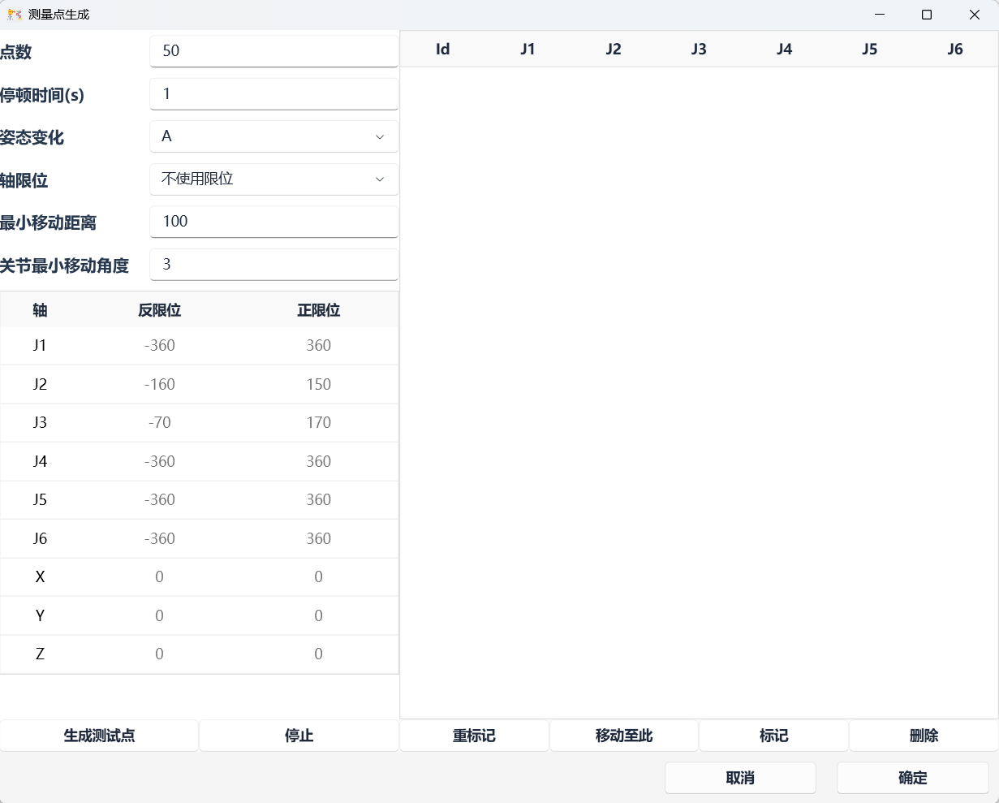

（测试点位生成完右下角提示）

测量点生成完，点击右下角的【确定】

4、点位生成完点击【启动】**（点击前确保机器人是上电状态、激光标定仪的激光在机器人的靶球上）**

停止：停止标定过程

单步：

测试点跑完，根据勾选在校准后参数表格会生成新的校准后的参数，

（下图以六轴协作为例展示校准后参数截图）

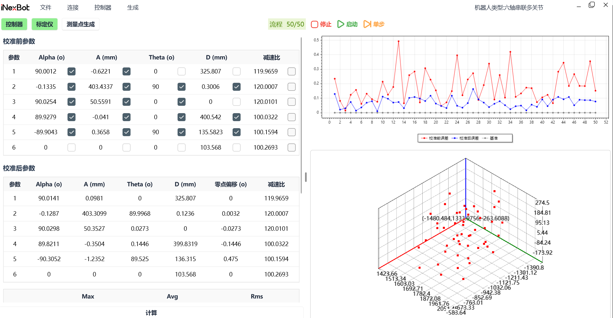
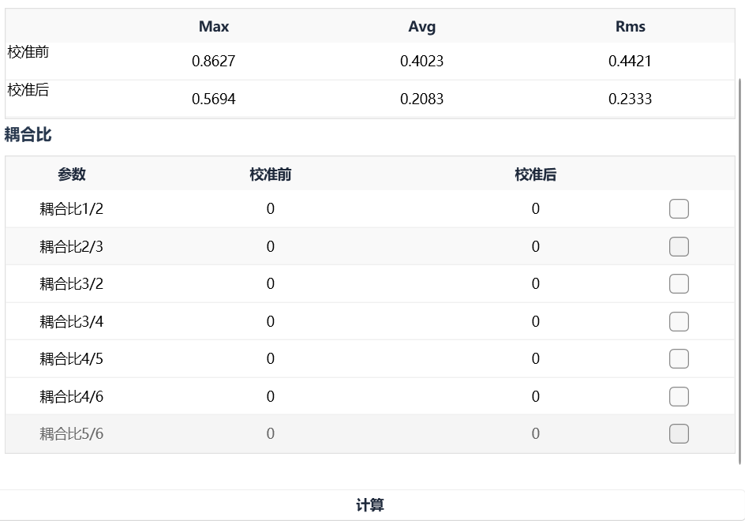

**如果需要计算不同的信息，自行勾选后点击【计算】**

5、上传结果至控制器，计算完成后依次点击【控制器】、【上传】\
下载：将控制器参数同步至软件

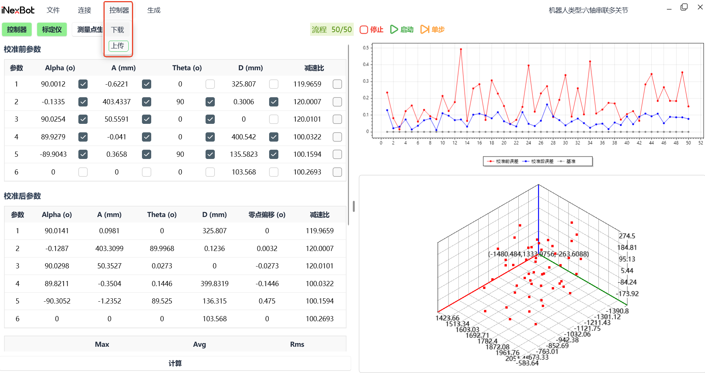

6、生成测试报告，点击【文件】，点击下拉框的【生成报告】

保存：将此次标定过程完整记录保存下来，生成\".necal\"文件\
加载：将保存的necal文件在软件重新打开

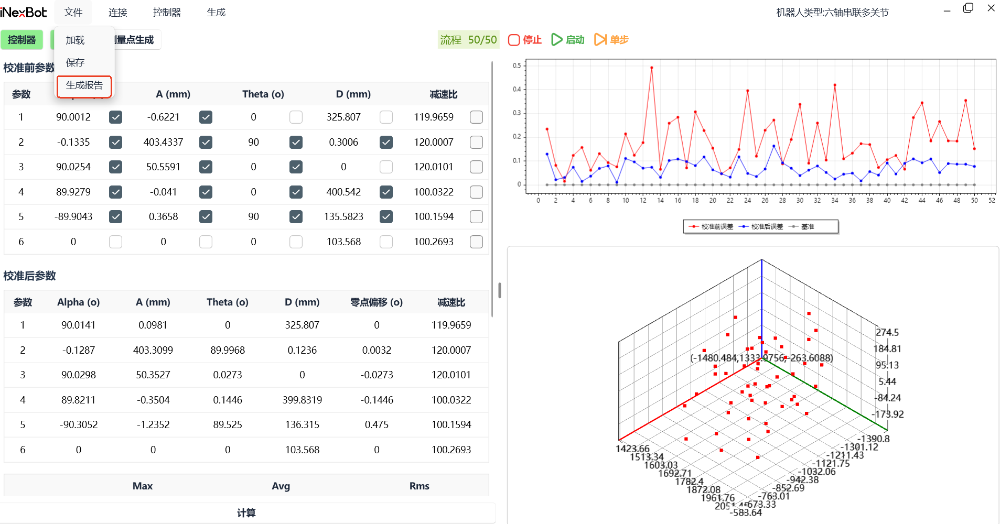

## 国标十四项测试功能

进行十四项测试之前确保控制器和标定仪都以连接上，具体教程如上

1、生成工作空间，确认位姿测试平面和轨迹测试平面。点击【工作空间】，如下图所示：

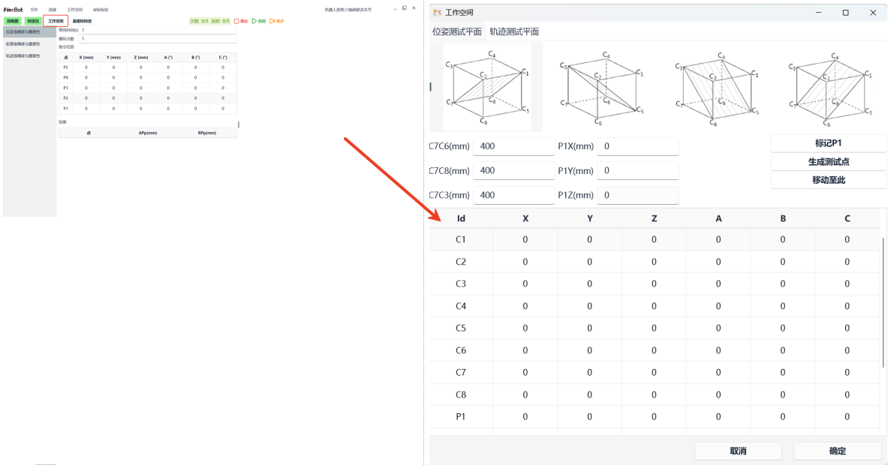

"位姿测试平面"的参数设置：设置C7C6、C7C8、C7C3的值，三个值的填写依据机器人大小及工作空间设定，其中C7C8的值是机器人Y方向的运动轨迹长度。在设置完三个参数后在机器人零点处点击【标记P1】、【生成测试点】

"轨迹测试平面\"的参数设置：同位姿测试平面一致，C7C6、C7C8、C7C3的值填写的与位姿测试平面的值相同

在设置好"位姿测试平面"与"轨迹测试平面"后，点击【确定】

2、确定基座标，点击【基座标标定】，如下图所示：

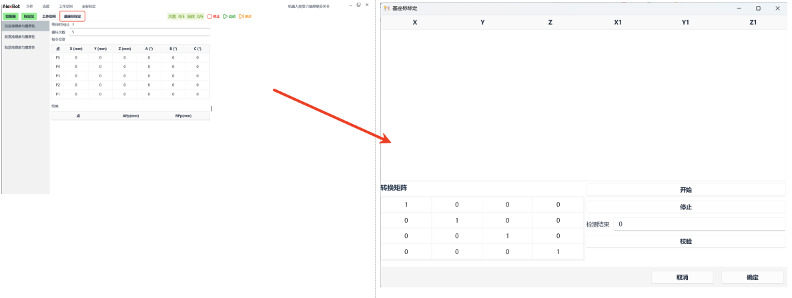

机器人在"零点"处时，点击【开始】（机器人处于上电状态），机器人及激光标定仪会自动进行标定，标定完成后右下角会有绿色弹窗弹出，如下图所示：

标定完成后可以点击【校验】，通常"校验结果"的值在1以内，标定正常。标定完成之后点击【确定】

3、开始十四项测试，**下图以"轨迹准确度与重复度"为例**

点击【轨迹准确度与重复度】，填写等待时间（默认3s）与循环次数，轨迹类型有"直线、小圆、大圆"，确认完之后点击【启动】，执行完结果自动出现在底部，如下图所示

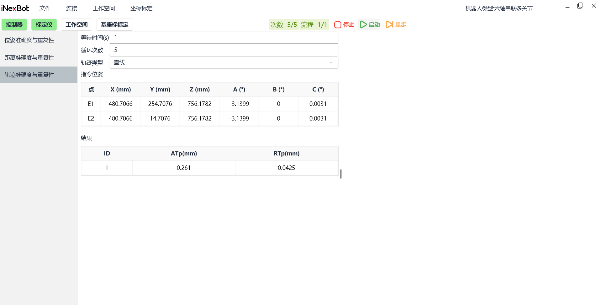

如果需要生成相应报告，点击文件，点击下拉框的【生成报告】

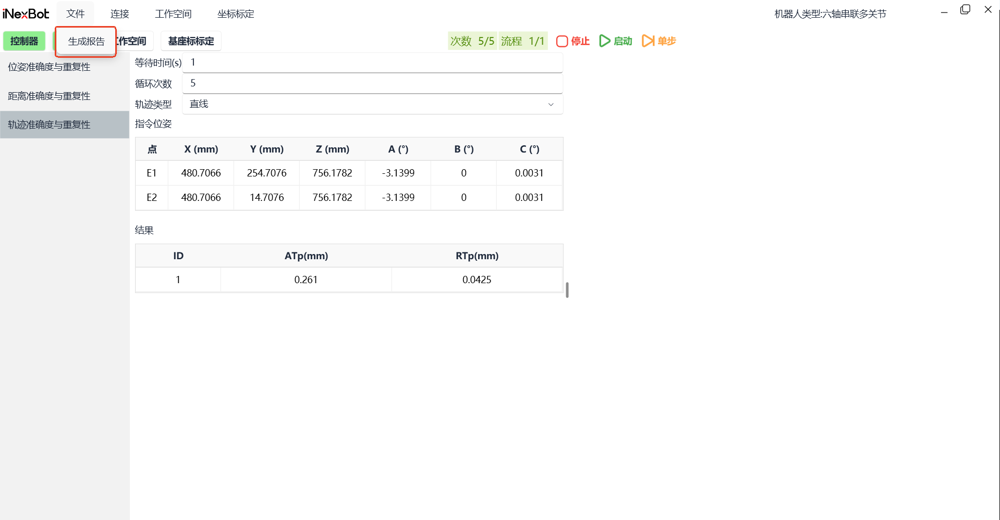

### 标定**注意事项：**

1.  整个标定及测试过程中一定不可以出现"丢光"现象

2.  标定及测试过程中如果出现人为现象导致控制器断开，需要重启控制器进行连接

3.  标定仪放置地面须平整、质地硬（地板等软地面会影响测量精度）

4.  标定仪测试过程中周边减少行人走动

5.  标定仪引光至机器人之前一定要让标定仪数据稳定（回Home点后等待几秒让数据稳定）

6. 测试环境尽量稳定（例如不要在风向口，不要直吹等）

## AI 检索专用问答对 (Q&A for Retrieval)

**Q: 激光标定仪目前支持哪些机型？**

A: 目前支持七轴串联多关节、七轴串联CBCBCBA、六轴串联、六轴协作、五轴协作、四轴SCARE、四轴SCARE异型一等机型，后续会适配更多机型。

**Q: 性能测试目前支持哪些项目？**

A: 目前支持轨迹准确度（APt）、轨迹重复度（RPt）、距离准确度(ADp)、距离重复度(RDp)、位姿准确度（APp）、位姿重复度(RPp)，其他国标14项内容会逐步完善。

**Q: 激光标定仪的标定功能主要是什么？**

A: 激光标定仪的标定功能主要是校准机器人本体的参数，主要有DH参数、减速比、耦合比等。

**Q: 标定步骤是什么？**

A: 1. 双机打开软件，选择符合的机器人类型、项目、标定仪类型，点击【进入】；2. 点击【控制器】，输入连接控制器的IP地址，点击【连接】；3. 连接激光标定仪，点击【标定仪】，点击弹窗的【连接】，然后依次点击【Connect Tracker】、【OK】；4. 生成测试点（通常是50个点），设置点数、停顿时间、姿态变化、轴限位等参数；5. 点位生成完点击【启动】，确保机器人是上电状态、激光标定仪的激光在机器人的靶球上；6. 上传结果至控制器，计算完成后依次点击【控制器】、【上传】；7. 生成测试报告，点击【文件】，点击下拉框的【生成报告】。

**Q: 如何判断控制器连接是否成功？**

A: 连接成功，【控制器】按钮背景色为绿色，连接失败背景色为白色。

**Q: 如何判断标定仪连接是否成功？**

A: 连接成功，【标定仪】按钮背景色为绿色，连接失败背景色为白色。成功连接标定仪后，标定仪弹窗内会有当前激光标定仪靶球位置信息。

**Q: 什么是点数、停顿时间、姿态变化、轴限位？**

A: 点数：生成的测试点数；停顿时间：运动相邻两个点位的停顿时间，一般是"1-3"s；姿态变化：默认选A，有"无、A、B、C"四种可选；轴限位：默认不选择，不使用限位，如果场地较小或机器人没有接可以选择"启用直角限位或者启用关节限位或者启用直角限位与关节限位"。

**Q: 国标十四项测试功能如何使用？**

A: 1. 生成工作空间，确认位姿测试平面和轨迹测试平面，点击【工作空间】；2. 确定基座标，点击【基座标标定】，机器人在"零点"处时，点击【开始】；3. 开始十四项测试，选择相应的测试项目（如轨迹准确度与重复度），填写等待时间与循环次数，选择轨迹类型，点击【启动】。

**Q: 如何验证基座标标定是否正常？**

A: 标定完成后可以点击【校验】，通常"校验结果"的值在1以内，标定正常。

**Q: 标定过程中有哪些注意事项？**

A: 1. 整个标定及测试过程中一定不可以出现"丢光"现象；2. 标定及测试过程中如果出现人为现象导致控制器断开，需要重启控制器进行连接；3. 标定仪放置地面须平整、质地硬；4. 标定仪测试过程中周边减少行人走动；5. 标定仪引光至机器人之前一定要让标定仪数据稳定；6. 测试环境尽量稳定（例如不要在风向口，不要直吹等）。
