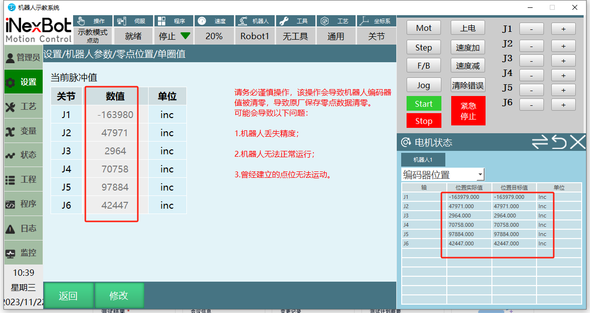

# 编码器位置

每次机器人在重新标定零点之后，使得当前脉冲值和编码器位置值是一致的

# 编码器位置详解

## 一、什么是编码器

编码器（Encoder）是一种用于测量运动状态的传感器，常用于电机控制和自动化系统中。

它可以检测：
- 旋转角度
- 线性位移
- 转速

常见类型：
- 旋转编码器（测角度）
- 直线编码器（测位移）

---

## 二、什么是编码器位置

**编码器位置**指的是编码器当前测量到的位置信息，也就是设备“当前所在的位置”。

可以理解为：
> 👉 编码器对运动物体位置的数字化表示

例如：
- 电机转动角度（如 90°、180°）
- 直线移动距离（如 10mm、100mm）

---

## 三、工作原理简述

编码器通过检测运动变化（光电、磁电等方式），输出信号（脉冲或数字码），系统根据这些信号计算出当前位置。

---

## 四、编码器位置的两种类型

### 1. 增量式编码器位置

**特点：**
- 通过累计脉冲数计算位置
- 断电后位置会丢失
- 需要回零（原点复位）

**计算公式：**

位置 = 脉冲数 × 分辨率

**类比：**
就像用步数来记录走了多远

---

### 2. 绝对式编码器位置

**特点：**
- 每个位置都有唯一编码
- 断电后仍能保持位置信息
- 不需要回零

**类比：**
类似 GPS 定位，随时知道当前位置

---

## 五、实际应用场景

编码器位置广泛应用于：

- 伺服电机控制
- 工业机器人关节定位
- 数控机床（CNC）
- 自动化生产线
- 精密定位系统

---

## 六、常见相关概念

| 概念       | 说明                         |
|------------|------------------------------|
| 当前位置   | 编码器当前读数               |
| 目标位置   | 系统希望达到的位置           |
| 误差       | 目标位置 - 实际位置          |
| 原点（零点） | 初始参考位置                 |

---

## 七、一句话总结

> **编码器位置就是：设备当前所在位置的数字化表示，是实现精准控制的核心数据。**

---
## AI 检索专用问答对 (Q&A for Retrieval)

**Q: 什么是编码器？**

A: 编码器（Encoder）是一种用于测量运动状态的传感器，可检测旋转角度、线性位移或转速，常用于电机控制和自动化系统。

**Q: 编码器有哪些常见类型？**

A: 常见类型包括：

旋转编码器（测角度）

直线编码器（测位移）