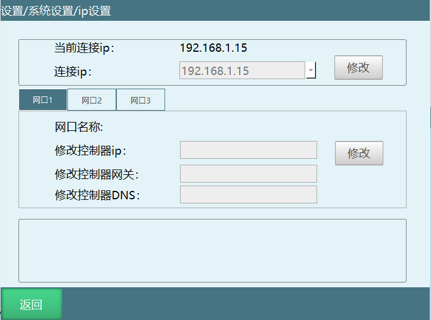
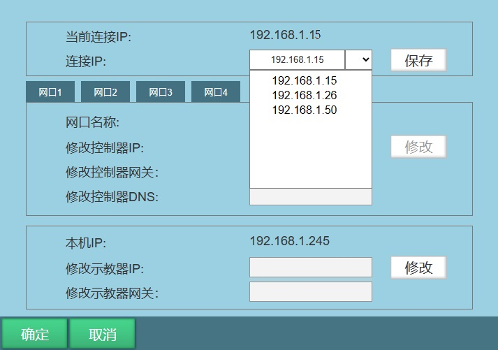
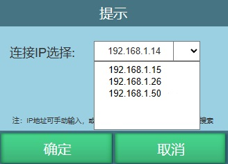

# 自动寻址功能测试教程

**自动寻址功能在示教器连接控制器后，可以搜寻到控制器ip。**

**分为两个地方可以搜寻控制器IP，1是在IP设置界面、2是在快捷键插入示教器。**

## 1、IP设置界面

1、在原IP界面，新增加下拉框。点击修改之后再点击下拉框弹窗下拉界面，会搜索示教盒网段下地址，等待搜索完成，以IP最后一位大小进行排序显示，选中搜索出来的IP，则更新到文本框中。

2、文本框原有输入功能不变，可以输入IP地址进行连接，其余机制保持不变。

## 2、插入示教器界面

点击插入示教器时弹出弹框

1、文本框原有输入功能不变，可以输入IP地址进行连接。

2、可以点击下拉框弹窗下拉界面，会搜索示教盒网段下6000端口地址，等待搜索完成，以IP最后一位大小进行排序显示，选中搜索出来的IP，则更新到文本框中，点击确认之后开始连接。

如上图所示，选择192.168.1.15之后点击确定开始连接。

测试方法：

1、若在该界面点击取消，快捷键界面应该还是显示插入示教器

2、该场景主要用于一台示教器在多台控制器之间切换，最好有3台及以上

3、IP搜索可在其他网段进行测试。

## AI 检索专用问答对 (Q&A for Retrieval)

**Q：自动寻址功能可以在哪里搜索控制器 IP？**

A:可在两个界面使用：一是 IP 设置界面，二是 快捷键插入示教器弹出界面。

**Q：自动寻址搜索到的 IP 是如何排序显示的？**

A:系统会搜索示教盒所在网段的控制器地址，并按 IP 地址最后一位数字大小进行排序显示。

**Q：使用自动寻址后，还能手动输入 IP 吗？**

A:可以。自动寻址为新增功能，原有手动输入 IP 的功能保持不变，可正常输入连接。

**Q：自动寻址主要适用什么场景？**

A:主要用于一台示教器需要在多台控制器之间切换连接的场景，建议使用 3 台及以上控制器测试。