# 视觉工艺

| 指令类型 | 前台 | 全局后台 | 局部后台 |
| :--- | :--- | :--- | :--- |
| 开始视觉 | 支持 | 支持 | 支持 |
| 触发视觉 | 支持 |  支持| 支持 |
| 获取视觉位置个数 | 支持 | 支持 | 支持 |
| 获取视觉位置 | 支持 | 支持 | 支持 |
| 清除视觉位置信息 | 支持 | 支持 | 支持 |
| 结束视觉 | 支持 | 支持 | 支持 |

| 指令类型 | 单步 | 倒序 | 提前执行 |  试运行| 被提前执行 |
| :--- | :--- | :--- | :--- | :--- |   :--- | 
| 开始视觉 | 支持 |  |  |支持|
| 触发视觉 | 支持 |  |  |支持|
| 获取视觉位置个数 | 支持 |  |  |支持|
| 获取视觉位置 | 支持 |  |  |支持|
| 清除视觉位置信息 | 支持 |  | |支持|       
| 结束视觉 | 支持 |  |  |支持|

# 工艺介绍

识别和定位工件，以便机器人可以更加精准的对工件进行抓取操作。它具有：精准定位、方便部署、简单易用，参数配置方法灵活、指令丰富等优势，我们常将它与传送带工艺相结合，可以利用简单的编程，有效的对工件跟踪抓取。

## 参数设置

点击工艺-视觉工艺，进入视觉工艺参数设置界面，如图所示：

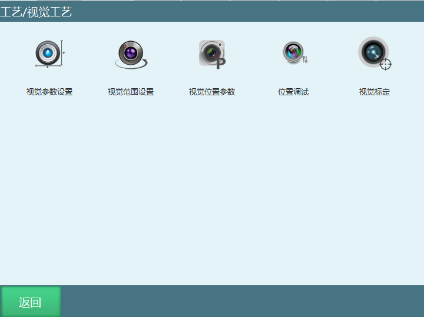

### 视觉参数设置

如图所示为视觉参数设置界面：

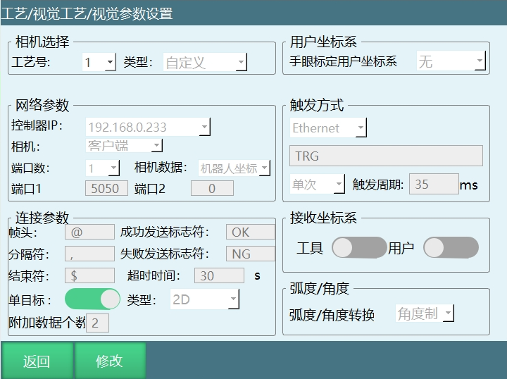

1.  相机选择：

| 参数 | 说明 |
| :--- | :--- |
| 工艺号 | 提供1-99个工艺号，每个工艺号均保存该工艺号下面的全部视觉参数和视觉位置参数。 |
| 类型 | 目前支持自定义类型和delta类型，用户可根据自己需求对参数进行设置。 |

2.  用户坐标系：

本系统支持视觉点位对应到用户坐标系中，即相机发送的点位是视觉坐标系中的点位。在这里需要选择一个已和相机匹配好的用户坐标系。

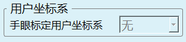

如上图所示，若选择无，便默认是相机发送的为直角坐标系下的点位；

用户也可以选择自己标定的用户坐标系（所选择的用户坐标系在设置-用户坐标标定页面进行标定）。

3.  网络参数

| 参数 | 说明 |
| :--- | :--- |
| 相机IP | 相机为服务器时此处填入相机IP，相机的IP地址与控制器的IP地址需要在同一网段。相机为客户端时此处的IP地址为当前连接控制器的IP地址，相机为客户端则控制器为服务器，需要相机主动连接。 |
| 相机 | 客户端、服务器 |
| 端口数 | 若视觉服务器的数据收发使用同一个端口，则端口数为1；若数据收发使用不同端口，则端口数为2。端口1是接收数据，端口2是发送数据（端口号不能设置成相同的） |
| 相机数据 | 机器人坐标、像素坐标、传送带像素坐标、传送带机器人坐标。若选择机器人坐标，则TCP发过来的数据就是机器人的坐标；若选择像素坐标，则TCP发过来的数据就是相机坐标系下的像素坐标。 |

4.  连接参数

| 参数 | 说明 |
| :--- | :--- |
| 帧头 | 发送点位数据前的帧头，需和相机配置的参数相同。 |
| 分隔符 | 发送点位数据时每个数据之间的分隔符，需和相机配置的参数相同（分隔符不能设为空） |
| 结束符 | 发送点位数据后的结束符。此处需和相机配置的参数相同。 |
| 成功发送标志符 | 相机拍完照并且成功识别工件会发送一个成功标志符。 |
| 失败发送标志符 | 相机拍完照并且识别失败会发送一个失败标志符。 |
| 超时时间 | 当超过该时间后控制器报错（视觉触发超时）拍照失败，范围(0,5000]S。 |
| 单目标 | 关闭该使能，可以识别多个目标点位。单目标数据示例格式：@,x,y,Rz,$（"@"代表帧头；","代表分隔符；"$"代表结束符；"x,y,Rz"表示具体发送的点位坐标值）。多目标数据示例格式：@,N,x,y,Rz,x,y,Rz,$（"@"代表帧头；"N"代表发送的点位数据个数；","代表分隔符；"$"代表结束符；"x,y,Rz"表示具体发送的点位坐标值）。注：打开单目标使能只会识别一个点位 |
| 类型 | 2D、2D+高度、3D。示例：(帧头"!"分隔符","帧尾"$")。2D：发送的数据格式为:!,X,Y,Rz,$。2D+高度：发送的数据格式为:!,X,Y,Rz,h,$。3D：发送的数据格式为:!,X,Y,Z,A,B,C,$ |
| 附加数据个数 | 存放除点位外相机发送的数据（工具手编号，颜色，点位是否有效之类信息），用户自定义的附加数据的值会默认存入首变量GS001,根据附加数据个数顺延存入。示例：自定义1代表黑色，相机发送过来附加数据1，解析到变量之后，相机拍到黑色的工件，然后我们可以通过条件判断定义变量值为1，机器人抓取黑色工件。示例：（帧头"!"，分隔符","，帧尾"$")。单目标格式：!,X,Y,Rz,data ...,$。多目标格式：!,N,X,Y,Rz,data ...,X,Y,Rz,data ...,$ |

5.  触发方式

| 参数 | 说明 |
| :--- | :--- |
| IO | 给相机一个触发信号，此处需要设置IO信号端口 |
| Ethernet | 一般默认为Ethernet 发送，当相机接收到"TRG"（或用户自定义字符串）后，应回复给控制器坐标值。 |
| 触发条件-单次触发 | 当条件为单次触发时，运行视觉触发指令时只触发一次。 |
| 触发条件-持续触发 | 当条件为持续触发时，运行视觉触发指令时持续触发。 |
| 触发周期 | 连续触发时的时间间隔 |

6.  接收坐标系

| 参数 | 说明 |
| :--- | :--- |
| 说明 | 接受的点位信息为相机发送的带有特定工具手与特定的用户坐标系下的点位信息 |
| 工具 | 打开该使能，相机发送的点位包含使用的工具手（用于多个工具手作业时） |
| 用户 | 打开该使能，相机发送的点位包含使用的用户坐标系（用于多个工作台时） |
| 注 | 打开用户使能前，手眼标定用户坐标系不能为无（关闭的情况下，需要设置为无），用户和工具使能可以同时打开/关闭 |

7.  弧度/角度

| 参数 | 说明 |
| :--- | :--- |
| 弧度/角度 | 视觉位置参数里的A/B/C轴选择单位类型，弧度的单位为rad、角度的单位为°（度） |
| 注 | 视觉参数设置的角度、弧度切换会影响解析数据的内容，操作参数中的角度、弧度设置只影响示教器关于角度、弧度的内容显示 |

### 视觉范围设置

为了避免相机传递回来的位置参数超出了机器人所能达到的范围，规定了机器人所能达到的最大范围。若相机传递回来的参数超范围，会进行警告提示超限并自动过滤该数据，该数据不生效。标定方法可以用手动示教的方法进行标定，也可以直接填写参数。

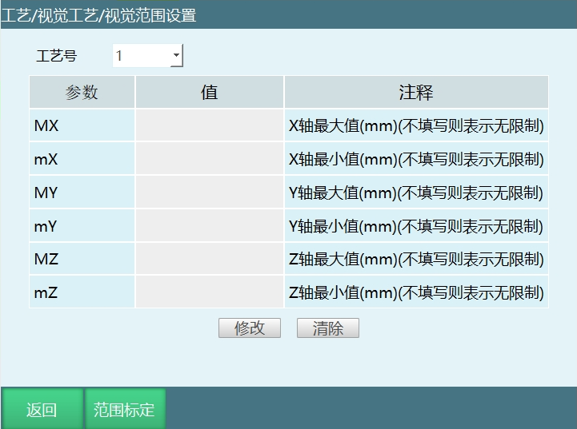

工艺号：提供1-99个工艺号，每一个工艺号均保存该工艺号下面的视觉范围参数。

范围标定：标定直角坐标系下XYZ三轴的最大值和最小值。

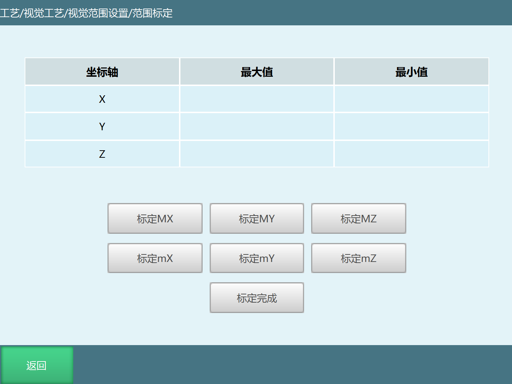

标定Mx：标定X轴最大值；

标定mX：标定X轴最小值；

标定MY：标定Y轴最大值；

标定mY：标定Y轴最小值；

标定MZ：标定Z轴最大值；

标定mZ：标定Z轴最小值；

标定完成：记录标定的X、 Y、Z范围最大值和最小值。

### 视觉位置参数

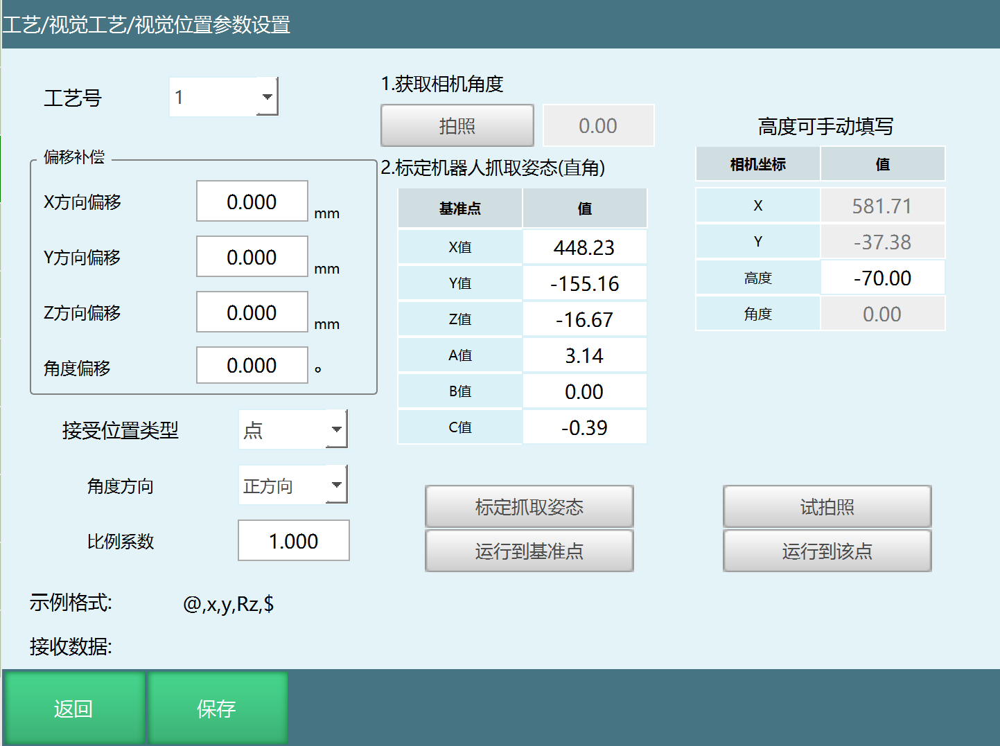

工艺号：提供1-99个工艺号，每一个工艺号均保存该工艺号下面的视觉位置参数设置。

1.  偏移补偿：若每一次机器人抓取位置均与其实际位置有固定方向偏移，请在此处填写补偿量， 则自动补偿到正确位置。

2.  比例系数：若相机发送的位置值是按照特定比例缩小后发送的，则需在此处填写比例系数。例如相机发送的值为（300,200,100），实际位置是（3,2,1），那么此处需填写0.01。

补偿量：工件抓取位置与实际位置的直角坐标值偏差。

计算公式：比例系数=实际位置值/相机发送位置值。

3.  角度方向：相机发送点位与机器人旋转角度相同或相反。

4.  接收位置类型：点/轨迹。

点：相机拍照发送点位给控制器。

轨迹：相机识别轨迹后发来一串点位，通过外部点指令去运行轨迹。

当接收位置类型选择轨迹时，程序作业文件如下：

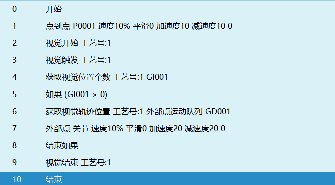

5.  获取相机拍照角度
相机拍物体，记录此时相机返回的角度。

6.  机器人抓取时的姿态

标定抓取姿态：此处需标记一下机器人在抓取物体时的末端姿态。标定好之后，每一次抓取均以该姿态进行抓取（此处的XYZ值不影响抓取时的位置）。如果拍摄目标有角度变化，此时最终的角度为=标定C值+相机发送的C值。

运行到基准点：运行到标定抓取姿态时标定的点位。

7.  相机坐标

相机坐标：若相机不能发送抓取高度，则需在右侧表格填写抓取的高度Z。若相机能发送抓取高度，则此处的设置无效。在设置完毕之后，按住DEADMAN按键上电，点击【试拍照】按钮进行拍照试验，相机发送来的数据会在相机坐标和接收数据处显示。

试拍照：伺服上电，点击试拍照，打开网络连接，接收通讯设备发送的数据，如和示例格式不匹配触发警告提醒。

运行到该点：拍照后按住DEADMAN按键上电，点击【运行到该点】按钮，将机器人移动到拍照位置，手眼标定后转出的机器坐标是否准确。

示例格式：根据视觉参数设置界面设置好的连接参数，进行核实排列。

例如2D+高度：连接参数中帧头为@， 分隔符为,， 结束符为\$，则格式为@,x,y,Rz,h,\$。

接收数据：相机发送的位置。

例如:相机发送的位置x=100，y=-50，Rz=1，h=1000，此处接收数据显示为@,100,-50,1,1000,\$。

### 位置调试

与传送带相结合使用，用于传送带的调试时使用，相机拍照后，会发送一个点位数据同时存在于【原始点位】和【偏移后点位】，但工件会被传送带运出一段距离，点击计算偏移，计算出的偏移的位置会覆盖在【偏移后点位】，点击运行至此，机器人便会直接去计算后偏移的位置。

由"工艺"-"视觉工艺"-"位置调试"进入，使用视觉加传送带跟踪工艺时用于调试传送带。

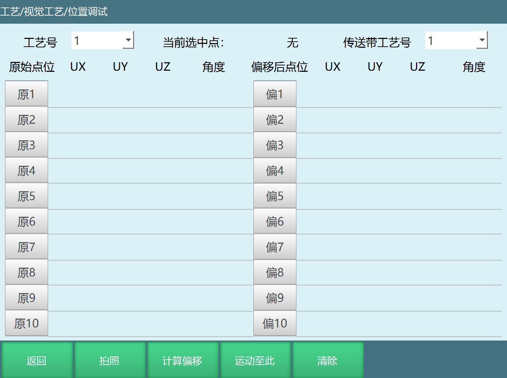

工艺号：视觉工艺的工艺号。

传送带工艺号：需要调试的传送带工艺号。

拍照：按住DEADMAN按键上电后点击【拍照】按钮进行拍照试验，相机发送来的位置数据会在【原始点位】和【偏移后点位】处显示。

运行至此：拍照后，按住DEADMAN按键上电选中点位并点击【运行至此】按钮，机器人会移动到相机发送的位置处。

计算偏移：拍照后打开传送带使工件被传送一段距离，点击计算偏移会重新在右侧【偏移后点位】显示出偏移后的工件点位。

清除：清除所有点位。

### 视觉标定

视觉标定的目的是标定相机坐标系到机器人坐标系的转换关系，从而确定相机识别的目标在机器人坐标系中的位置坐标，最终实现机器人运动到目标位置。

根据相机是否安装在机械臂上，标定方式主要分为眼在手上和眼在手外两种，下面进行详细的操作说明。

1.  眼在手上

用于相机在工具手上，相机镜面与标定模板平面应大致平行，且整个标定过程中相机距离标定模板的相对高度不变。通过标记机器人当前的点位信息，这些位置要满足至少3个不变姿态点位 和 3个变姿态点位。运行计算，机械臂带着相机走到当前机器人的点位，得到对应的像素数据。当全部像素数据取得后，计算得到相机数据与机器人点位的转换关系。后续发送的相机点位可通过该转换关系，转换成机器人实际运动点位。

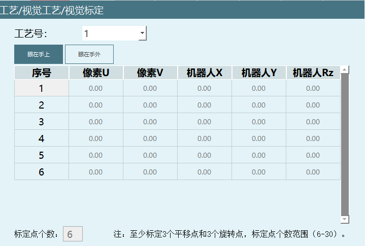

工艺号：视觉工艺的工艺号。

标定点个数：所需示教的点位个数，标定点个数范围（6-30）。

点位：最少需要标定6个点，最多为30个点，标定的点位最少要求三个位置不同，三个姿态不同。如（移动X轴,Y轴标记三个点，然后动C轴标定三个点）。

标记该点：记录当前机器人点位数据。

运动该点：按住DEADMAN按键上电后，选中序号并点击【运行至此】按钮，机器人会移动到该序号标记的点位处。

清除该点：清除所选序号的点位数据，不清除像素数据，像素数据会在运行计算后，数据会重新拍摄。

运行计算：点击运行计算，机器人会根据之前示教的点位数据自动运动到每一个点，且每运动到一个点均会触发拍照、记录当前的像素数据，运动采集数据完成后，自动进行标定计算，并弹出计算结果。

2.  眼在手外

相机固定安装在固定支架上（从上向下拍照），或者安装在目标下方（从下向上拍照）；相机镜面应与标定模板大致平行，且在整个标定过程中相机距离标定模板的相对高度不变。

注：标定模板固定在机械臂工具手末端。

方法简介：此标定方法分为3个步骤，依次为手眼标定、机械臂工具手标定以及高精度工具手标定。

注意：此方法仅能够标定工具手在视场平面上的偏移量，所以适合Scara机器人。

步骤：

①9点（16点）手眼标定：移动机械臂使得工具手末端模板放在视场中心区域，点击"运行计算"后，系统会自动计算9个（16个）点位并依次运动到位置，依次采集9组（16组）点位坐标（像素坐标和机器人无工具手坐标），完成后，系统自动计算出相机像素坐标到机器人坐标的转换关系。

②工具手标定：移动机械臂到第1步中的第1个标记点，然后以末端法兰中心为标定平面圆心，分别向正反两个方向旋转工具手一定角度，并依次采集2组点位坐标（像素坐标和机器人无工具手坐标），完成后，系统会自动计算出该工具手。

③高精度工具手标定：移动机械臂到第1步中的第1个标记点，然后以第2步计算的工具手末端为圆心，按步进角度变姿态在标定平面上绕圆心旋转（即工具手位置不动，变姿态）6次，依次记录6组点位坐标（像素坐标和机器人无工具手坐标）；完成后，再次移动到第1个点，按相反方向步进角度旋转6次；完成后再次回到第1个点，再按第1次的旋转方向旋转6次并记录坐标；最终系统会计算出一个高精度工具手。

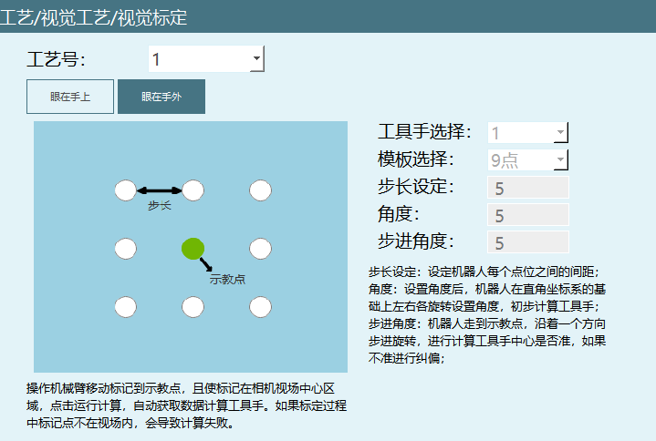

工具手选择：选择待标定的工具手。

模板选择：分为9点和16点。

注：9点标定的范围是九宫格，需要测试机器人坐标位于四个角时是否可以拍到，如果无法拍到则调整相机拍摄范围，或者减小每个点之间的步长间距。16点标定同理。

步长设定：在当前机器人位置的基础上，自动计算9点（16点）的间距。

角度：设置角度后，机器人在直角坐标系的基础上左右各旋转设置角度，初步计算工具手。

步进角度：第3步高精度工具手标定中，机器人绕工具手末端沿着一个方向步进旋转的角度。

## 视觉指令

### VISION_RUN-视觉开始

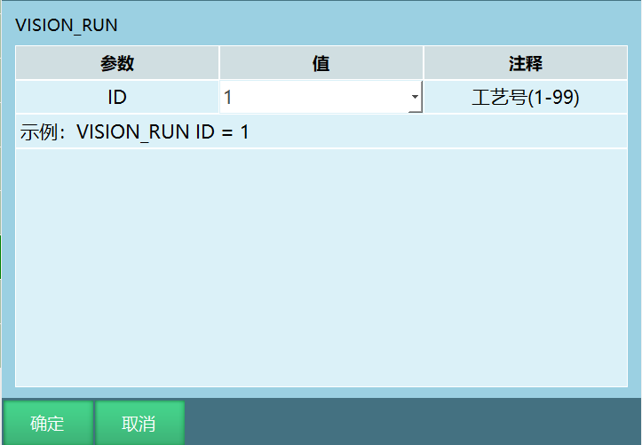

格式：VISION_RUN【指令名】ID=1【工艺号】。

功能：执行视觉开始指令后控制器与相机连接。

参数：

| 参数 | 说明 |
| :--- | :--- |
| ID | 范围【1，99】，指令里面选择的工艺号需要和视觉工艺界面选择的工艺号一致。 |

### VISION_TRG-视觉触发

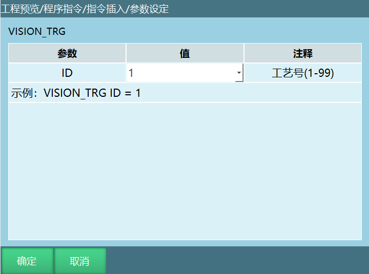

格式：VISION_TRG【指令名】ID=1【工艺号】。

功能：执行视觉触发指令后等待视觉服务器的返回值（发送的位置数据），获取到位置数据后继续运行下一条指令。

参数：

| 参数 | 说明 |
| :--- | :--- |
| ID | 范围【1，99】，指令里面选择的工艺号需要和视觉工艺界面选择的工艺号一致。 |

说明：具体触发方式在视觉工艺-视觉参数设置界面内设置：

1.  选择IO触发，运行本指令则发出对应IO信号

2.  选择Ethernet方式，运行本指令则向相机发出自定义的字符串。

### VISION_POSNUM-获取视觉位置个数

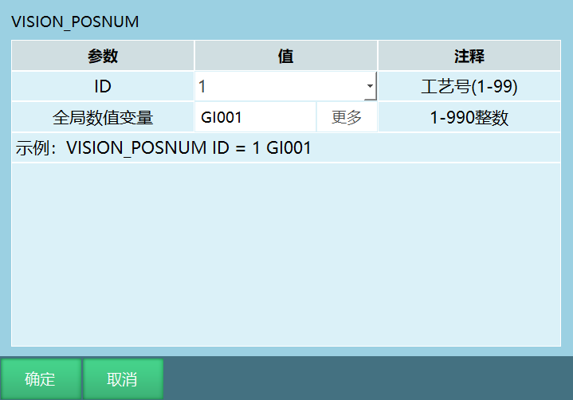

格式：VISION_POSNUM【指令名】ID=1【工艺号】GI001【全局数值变量】。

功能：记录相机发送的点位个数，将点位个数存入到选择的变量。

参数：

| 参数 | 说明 |
| :--- | :--- |
| ID | 范围【1，99】，指令里面选择的工艺号需要和视觉工艺界面选择的工艺号一致。 |
| 全局数值变量 | 将相机发送的点位个数存入到选择的变量。例如：相机发送了三个点位数据，选择的变量为GI001,执行此条指令后GI001=3。说明：每执行一次获取点位执行，点位个数就会减一 |

示例：

1.  NOP

2.  VISION_RUN ID = 1 视觉开始

3.  VISION_TRG ID = 1 视觉触发

4.  VISION_POSNUM ID = 1 GI001 获取视觉位置个数

5.  VISON_END ID = 1 结束视觉

6.  END

示例说明：执行第2行指令与相机通讯成功，执行第3行指令视觉触发相机发送点位信息，执行第4行指令将视觉发送的点位个数存入到变量GI001，如果视觉发送了3个点位，则执行此条指令后GI001=3。

### VISION_POS-获取视觉位置

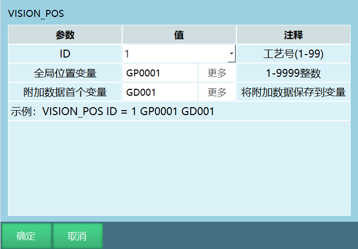

格式：VISION_POS【指令名】ID=1【工艺号】GP001【全局数值变量】I/GI/D/GD/S/GS【附加数据变量】。

功能：执行此条指令可以将相机发送的点位信息存入到变量。

参数：

| 参数 | 说明 |
| :--- | :--- |
| ID | 范围【1，99】，指令里面选择的工艺号需要和视觉工艺界面选择的工艺号一致 |
| 全局位置变量 | 相机发送的点位信息逐次缓存于选择的全局位置变量。例如：全局位置变量为GP0001,相机发送两个点位，执行获取视觉位置指令会将点位信息存到变量GP0001。第一次运行该指令GP0001存的是第一个点位的信息，第二次运行该指令GP0001存的是第二个点位的信息 |
| 附加数据首个变量 | 变量类型：整型，浮点型，字符串型。执行此条指令会将定义的附加数据依次存入变量，附件数据个数需要在视觉工艺-视觉参数设置界面设置。例如：设置附加数据个数为2，附加数据首个变量为GD001执行此条指令会将定义的附加数据存入GD001,GD002。附件数据的使用会在本章手册后面作为示例说明（多个不同的附加数据的写入和单个数据） |

示例：

1.  NOP

2.  VISION_RUN ID = 1 视觉开始

3.  VISION_TRG ID = 1 视觉触发

4.  VISON_POS ID = 1 GP0001 获取视觉位置

5.  VISON_END ID = 1 结束视觉

6.  END

示例说明：执行第2行指令与相机通讯成功，执行第3行指令视觉触发相机发送点位信息，执行第4行指令将视觉发送的点位信息存到变量GP0001,如果视觉发送了3个点位，第一次运行获取位置指令GP0001存的是第1个点位的信息，第二次运行获取位置指令GP0001存的是第2个点位的信息,第二次运行获取位置指令GP0001存的是第3个点位的信息。

### VISION_CLEAR-清除视觉位置信息

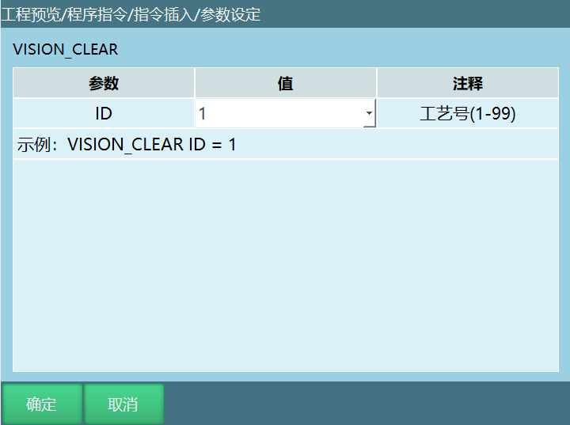

格式：VISION_CLEAR【指令名】ID=1【工艺号】。

功能：清除当前工艺号里相机发送的点位信息。

参数：

| 参数 | 说明 |
| :--- | :--- |
| ID | 范围【1，99】，指令里面选择的工艺号需要和视觉工艺界面选择的工艺号一致。 |

示例：

1.  NOP

2.  VISION_RUN ID = 1 视觉开始

3.  VISION_TRG ID = 1 视觉触发

4.  VISION_POSNUM ID = 1 GI001 获取视觉位置个数

5.  VISON_POS ID = 1 GP0001 获取视觉位置

6.  VISON_CLEAR ID = 1 清除视觉位置信息

7.  VISON_END ID = 1 结束视觉

8.  END

示例说明：执行第2行指令与相机通讯成功，执行第3行指令视觉触发相机发送点位信息，执行第4行指令将视觉发送的点位个数存到变量GI001，（假设视觉发送了3个点位，则变量GI001=3，每执行一次获取视觉位置指令，GI001变量存的点位个数减少1个），执行第5行指令将视觉发送的点位数据存入到变量GP0001，（假设视觉发送了3个点位，第一次运行获取位置指令GP0001存的是第1个点位的信息，第二次运行获取位置指令GP0001存的是第2个点位的信息,第三次运行获取位置指令GP0001存的是第3个点位的信息），执行第六行指令会清除当前工艺号视觉发送的所有点位信息。

### VISION_END-视觉结束

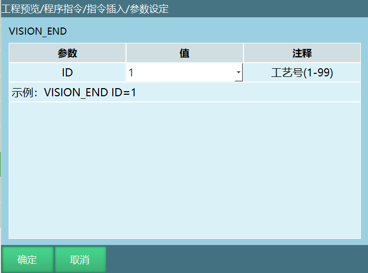

格式：VISION_END【指令名】ID = 1【工艺号】。

功能：结束视觉工艺，控制器与相机断开连接。

参数：

| 参数 | 说明 |
| :--- | :--- |
| ID | 范围【1，99】，指令里面选择的工艺号需要和视觉工艺界面选择的工艺号一致。 |

### VISION_TRACE-获取视觉轨迹位置

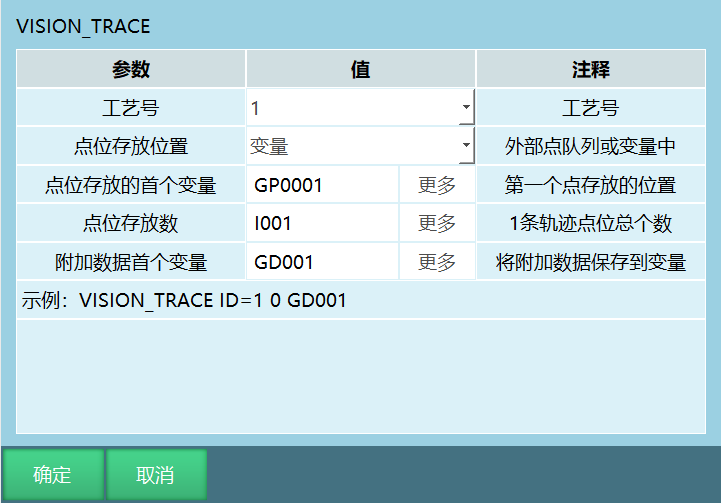

格式：VISION_TRACE【指令名】ID = 1 【工艺号】；

0/1【"0"表示点位存放位置为外部轴运动对列，"1"表示点位存放位置为变量】P/GP【点位存放的首个变量】I/GI【点位存放数】；

I/GI/D/GD/S/GS【附件数据首个变量】。

功能：当相机发送的数据为多个点位时可选择不同点位存储方式运行轨迹。

参数：

| 参数 | 说明 |
| :--- | :--- |
| 工艺号 | 范围【1，99】，指令里面选择的工艺号需要和视觉工艺界面选择的工艺号一致 |
| 点位存放位置 | 变量、外部点运动队列。变量（发送来的点位存放在变量里面）。外部点队列（相机发送点位后，再获取轨迹位置指令下面插入外部点指令，这样程序就可以运行外部点轨迹 |
| 点位存放的首个变量（默认GP0001） | 点位存放位置选择外部点运动队列时，此参数无法修改。变量类型P,GP,P[],GP[]。相机发送点位后执行获取轨迹位置指令后点位会被存放在自己选择的首个变量，存放点位的变量会根据点位个数和选择的首变量顺延存入。例如：相机发送3个点位，选择首变量是GP0005，点位的数据存入变量GP0005,GP0006,GP0007 |
| 点位存放数（默认I001） | 点位存放位置选择外部点运动队列时，此参数无法修改。点位存放数的类型可以选择I,GI,I[],GI[]四种类型。相机发送的点位个数存到选择的变量。例如：相机发送的点位是4，选择的点位存放数变量是I005，运行获取轨迹运行指令时变量I005=4 |
| 附加数据首个变量 | 变量类型：整型，浮点型，字符串型。执行此条指令会将定义的附加数据依次存入变量，附件数据个数需要在视觉工艺-视觉参数设置界面设置。例如：设置附加数据个数为2，附加数据首个变量为GI001执行此条指令会将定义的附加数据存入GI001,GI002 |

### ONFLY_INIT-飞拍开始

飞拍功能：机器人工具手运动经过拍照点时，快速触发相机拍照，在拍照过程中物体或相机处于运动状态。

- 飞拍触发方式：拍照点

格式：ONFLY_INIT【指令名】；ID【视觉飞拍工艺号】；VISIONID【飞拍绑定的视觉工艺号】；TYPE【拍照点】；

RADIUS【拍照点范围半径】；DELAY【记录坐标延时】；CAMERA_TRIGGER_DELAY【相机触发延时】。

- 飞拍触发方式：IO信号

格式：ONFLY_INIT【指令名】；ID【视觉飞拍工艺号】；VISIONID【飞拍绑定的视觉工艺号】；TYPE【IO】；

VALUE【端口值】；DELAY【记录坐标延时】；CAMERA_TRIGGER_DELAY【相机触发延时】。

功能：启动飞拍任务。

- 飞拍触发方式：单轴

格式：ONFLY_INIT【指令名】；ID【视觉飞拍工艺号】；VISIONID【飞拍绑定的视觉工艺号】；TYPE【单轴】；

TRIGGER_START_POS【触发起始位置】；TRIGGER_COUNT【触发次数】；ANGLE_SPACING【触发角度间隔】；

DELAY【记录坐标延时】；CAMERA_TRIGGER_DELAY【相机触发延时】。

注：拍照点方式，仅支持直线指令，且不支持平滑。

> 单轴方式不支持直线指令。

参数：

| 参数 | 说明 |
| :--- | :--- |
| 工艺号 | 每组视觉飞拍工艺号有1-99个，手填工艺号和变量形式。变量仅支持整型变量（INT,GINT） |
| 视觉工艺号 | 此处填飞拍绑定的视觉工艺号，手填工艺号和变量形式。变量仅支持整型变量（INT,GINT）。若该指令执行时视觉没有连接，则不会触发拍照；视觉关闭时飞拍也会关闭 |
| 飞拍触发方式 | 1. 拍照点；2. IO信号，上升沿（1）或者下降沿（0）有效 |
| 拍照点 | 要拍照的位置，需要手动示教，手动赋值到变量中 |
| 拍照点范围半径 | 距离拍照点的距离半径，进入拍照区域触发拍照 |
| IO端口 | 手填IO输入端口号和变量形式（DIN,DIN[]）。触发拍照，记录的是信号触发后机器人的位置 |
| 端口值 | 手填：直接定义选中端口的值。范围[0,1]。变量：通过给变量赋值的形式定义IO端口的值。 |
| 记录坐标延时 | 触发拍照到记录机器人坐标的延时时间，单位ms |

示例：拍照点触发拍照

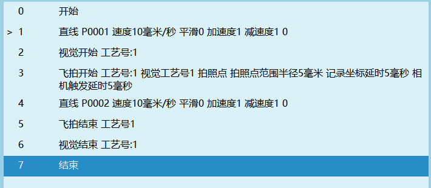

示例：IO信号拍照。

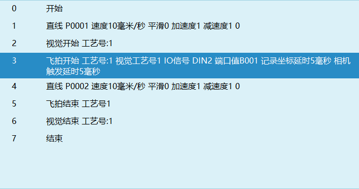

示例：单轴。

注意点：触发角度隔间是正数是正方向，负数是反方向。\
单轴方式，J4，运动轨迹从-44 到 44 ，起始位置0，触发次数3，触发角度隔间5 ，意味着当在0触发后，下一个触发点是5，在下一个是10，会触发三次。\
单轴方式，J4，运动轨迹从-44 到 44 ，起始位置0，触发次数3，触发角度隔间-5 ，意味着当在0触发后，下一个触发点是-5，在下一个是-10，只会触发一次，因为运动轨迹从-44 到 44是正方向运动。

程序逻辑：飞拍轨迹P001到P002运行中，J4轴经过0°就触发拍照。

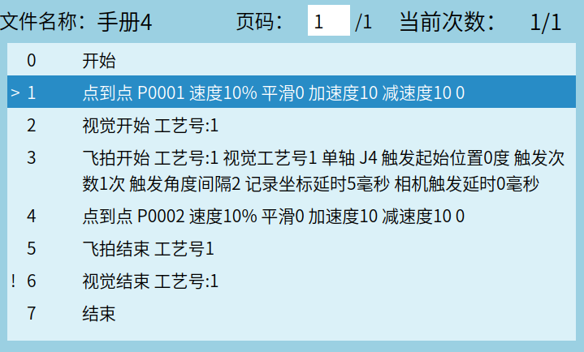

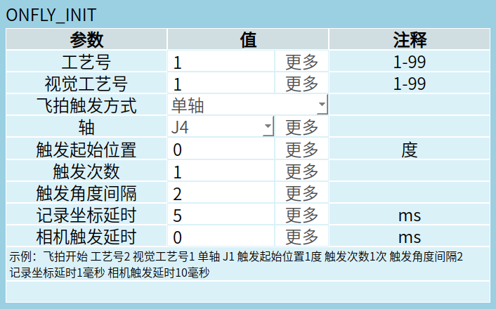

### ONFLY_END-飞拍结束

格式：ONFLY_END【指令名】ID=1【工艺号】。

功能：结束飞拍任务。

可以单独使用，没有执行飞拍开始前，执行飞拍结束无效。

参数：

| 参数 | 说明 |
| :--- | :--- |
| 工艺号 | 视觉飞拍工艺号，范围[1,99]。支持直接手填工艺号和变量（INT,GINT）表示 |

说明：单独插入飞拍结束指令程序运行时不会报错，没有执行飞拍开始前，执行飞拍结束无效。

### ONFLY_GET_STATUS-获取飞拍打开状态

格式：ONFLY_GET_STATUS【指令名】 ID=2【飞拍工艺号】 STATUS=B001【状态】。

功能：获取飞拍任务是否打开，将获取的状态存入选择的变量。

参数：

| 参数 | 说明 |
| :--- | :--- |
| 工艺号 | 视觉飞拍工艺号，范围[1,99]。支持直接手填工艺号和变量（INT,GINT）表示 |
| 结果 | 获取飞拍任务打开的状态，将获取到的状态存入变量（BOOL,GBOOL）。"0"表示飞拍未打开，"1"表示飞拍打开。例如：选择的变量是B001,执行获取飞拍打开状态指令，如果飞拍打开则B001=1,如果飞拍未打开则B001=0 |

### ONFLY_CALC_TOOL-飞拍计算工具手

格式：ONFLY_CALC_TOOL【指令名】 ID=2【】 GRABTOOL=1【抓取的工具手】 NEWTOOL=2【新工具手】。

功能：飞拍计算工具手作用于机械臂夹持工件时可能出现偏心位置，工件有旋转角。通过计算获取并切换新的工具手之后，工件中心放置到放料位置点，不偏心无旋转。

参数：

| 参数 | 说明 |
| :--- | :--- |
| 工艺号 | 视觉飞拍工艺号，范围[1,99]。支持直接手填工艺号和变量（INT,GINT）表示 |
| 抓取工具手 | 支持手填工具手号和变量（INT,GINT）表示,范围[1,999]。抓取拍照的工具手 |
| 新工具手 | 支持手填工具手号和变量（INT,GINT）表示,范围[1,999]。通过计算获取到的新工具手 |

示例：单个拍照点计算飞拍工具手程序编写。

程序逻辑：切换工具手1，到工件取料点，夹持工件经过拍照点，触发相机拍照回传点位且控制器记录当前点位，计算飞拍工具手指令读取对应工艺号的飞拍数据计算出新的工具手2，切换到工具手2，通过偏移将工件中心放置到放料位置点，不偏心无旋转。

-  机械臂夹持工件中心，计算获取的工具手2 应 与工具手1一致；

- 机械臂加持工件偏心位置，工件无旋转，计算获取并切换工具手2之后，工件中心放置到放料位置点，不偏心；

- 机械臂加持工件偏心位置，工件有旋转角，计算获取并切换工具手2之后，工件中心放置到放料位置点，不偏心无旋转。

注：当执行计算飞拍工具手，相机还没回传点动，会报：工具手计算错误。

以下的点位都需要在作文文件 变量 界面中，选工具，写入当前位置，否则是会以无工具手执行的。P0004点工具手要手填0。

1.  NOP

2.  SWITCHTOOL (1) #切换上述标定的工具手

3.  MOVJ P0001 VJ = 80 % PL = 0 ACC = 80 DEC = 80 0 #工件取料点

4.  VISION_RUN ID = 1 #视觉开始

5.  ONFLY_INIT ID = 1 VISIONID = 1 TYPE = Point GP0001 RADIUS = 1 DELAY = 1.9 CAMERA_TRIGGER_DELAY = 0 #飞拍开始，触发方式拍照点GP0001 半径1 记录延迟1.9 相机延时0

6.  MOVL P0002 V = 1000 mm/s PL = 0 ACC = 100 DEC = 100 0 #飞拍运动轨迹起始点

7.  MOVL P0003 V = 1000 mm/s PL = 0 ACC = 100 DEC = 100 0 #飞拍运动轨迹结束点

8.  ONFLY_CALC_TOOL ID = 1 GRABTOOL = 1 NEWTOOL = 2 #计算飞拍工具手 计算出新的工具手2

9.  SWITCHTOOL (2) #切换工具手2

10.  MOVL P0004 V = 1000 mm/s PL = 0 ACC = 100 DEC = 100 0 #工件中心放置到放料位置点

11.  ONFLY_END ID = 1 #飞拍结束

12.  VISION_END ID = 1 #视觉结束

13.  END

## 视觉工艺示例说明

### 示例一：相机拍照10次后，视觉关闭

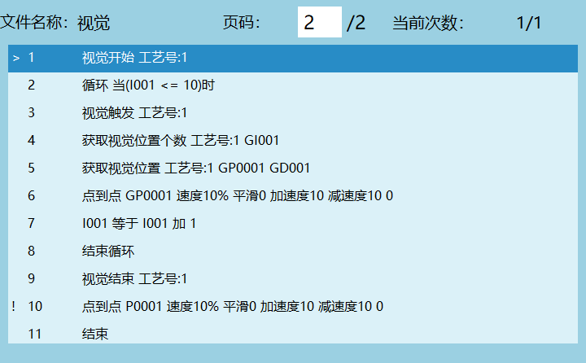

### 示例二：相机发送的点位为连续轨迹

当相机发送的点位为连续轨迹，可以通过获取轨迹位置指令获取点位，以下示例是通过网络调试助手发送点位，视觉通讯成功，发送点位。发送的点位只是使用说明，没有实际含义。

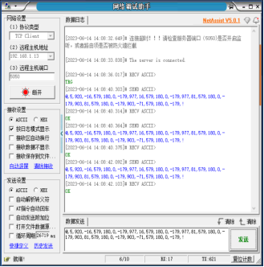

1.   获取轨迹位置点位存放位置选择外部点

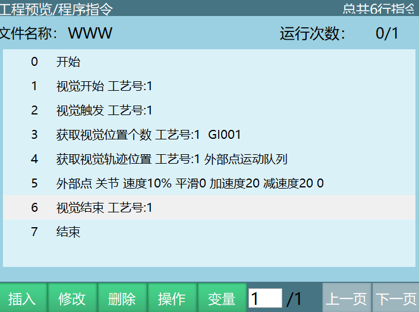

2.   点位存放位置选择变量

例如：首变量选择P0001,网络调试助手发送5个点位，程序如下图所示：

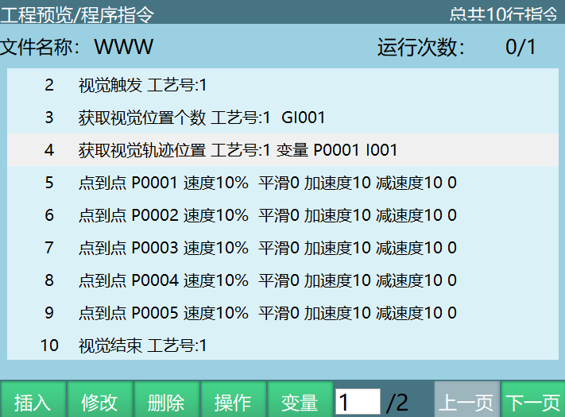

### 示例三:获取跟踪位置附加数据参数说明

1.  视觉工艺-视觉参数界面设置附加数据个数，最多支持10个。

2.  点击视觉位置参数进入参数界面后查看示例格式，"data"表示附加的数据。

3.  外部设备：网络调试助手，按照视觉位置参数界面的示例格式发送点位。

4.  点击试拍照，网络助手发送点位后接收数据行的"1，2"表示附加数据。附加数据默认存到GS001,根据定义的附加数据个数顺延存入。

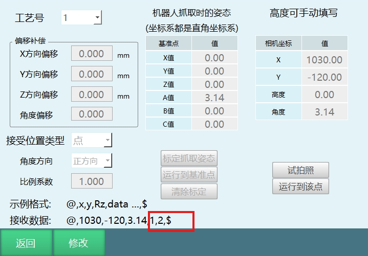

5.  如果插入获取传送带跟踪位置指令，执行指令会将定义的附加数据的值存入用户自己选择的变量（整型，浮点型，字符型），用户可以将工件的形状，颜色用数值表示（例如GD001=1表示红色，GD002=2表示绿色），然后通过条件判断对不同颜色的工件跟踪抓取。

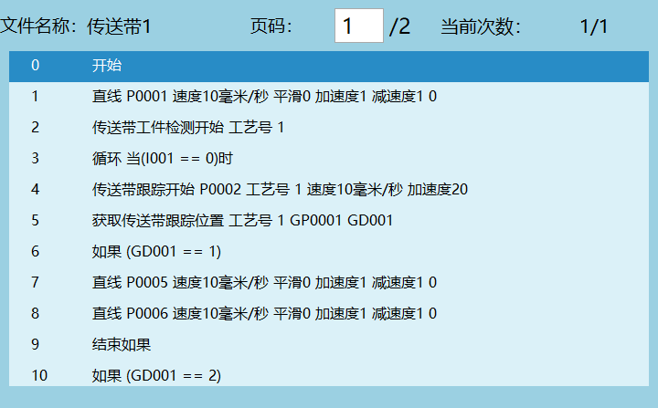

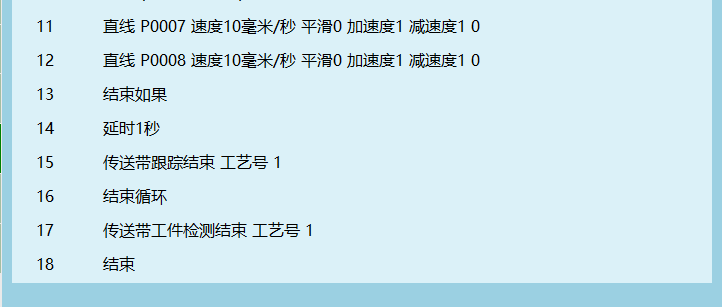

### 示例四：相机对物料拍完照后，将数据发送给机器人，机器人去抓取

如图所示：

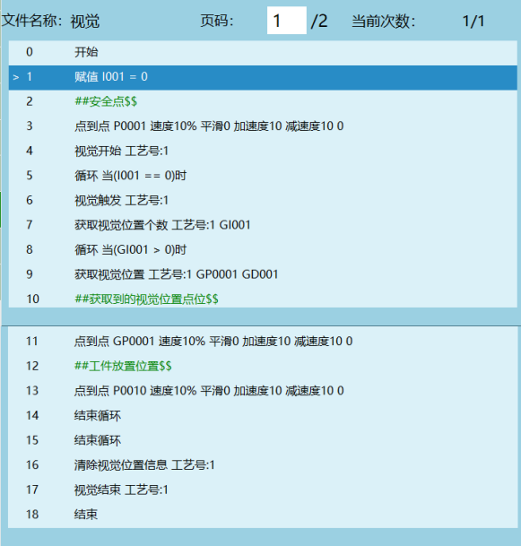

## AI 检索专用问答对 (Q&A for Retrieval)

**Q: 视觉标定的目的是什么？**
A: 视觉标定的目的是标定相机坐标系到机器人坐标系的转换关系，从而确定相机识别的目标在机器人坐标系中的位置坐标，最终实现机器人运动到目标位置。

**Q: 视觉标定有哪两种方式？**
A: 视觉标定主要分为两种方式：
- 眼在手上：相机安装在工具手上，需要标定6-30个点，包括至少3个不变姿态点位和3个变姿态点位
- 眼在手外：相机固定安装，分为三个步骤：9点（16点）手眼标定、工具手标定、高精度工具手标定

**Q: 飞拍功能是什么？**
A: 飞拍功能是指机器人工具手运动经过拍照点时，快速触发相机拍照，在拍照过程中物体或相机处于运动状态。

**Q: 飞拍触发方式有哪些？**
A: 飞拍触发方式包括：
- 拍照点：机器人经过拍照点时触发
- IO信号：通过IO信号的上升沿或下降沿触发
- 单轴：按角度间隔触发多次拍照

**Q: 视觉工艺的典型应用场景是什么？**
A: 视觉工艺的典型应用场景包括：
- 工业机器人抓取工件
- 传送带跟踪抓取
- 精密定位任务
- 自动化生产线中的视觉引导
- 需要精准识别和定位的场景