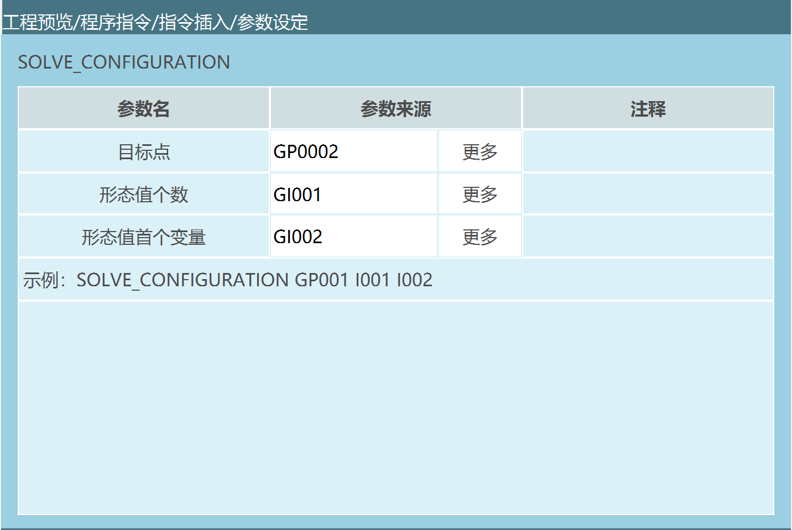
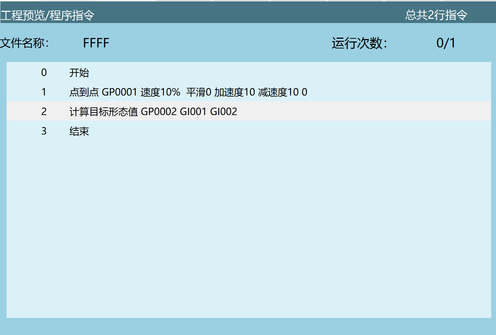
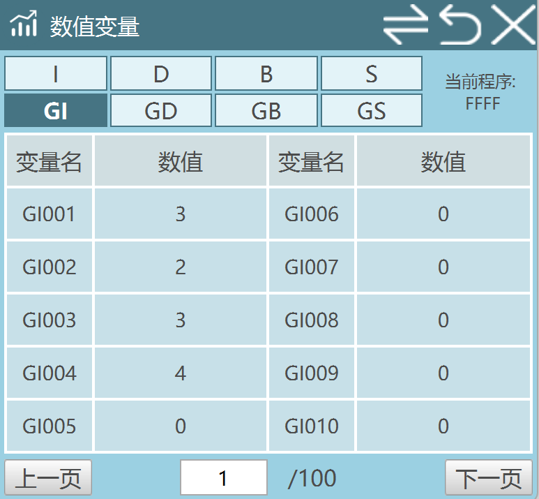
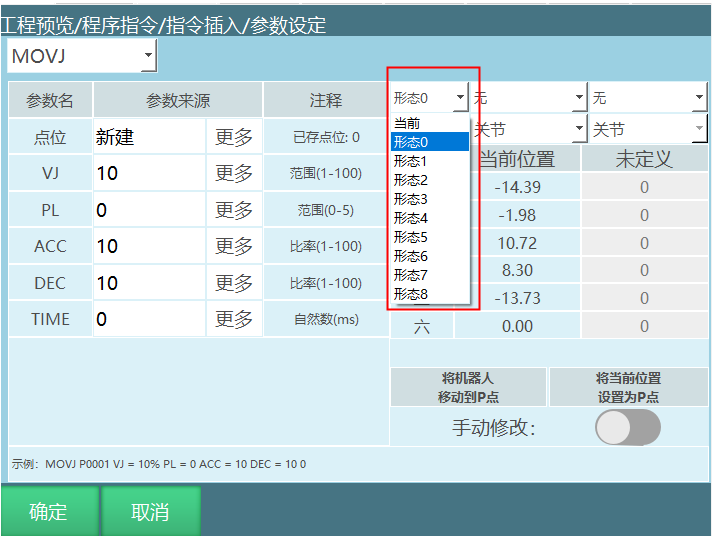
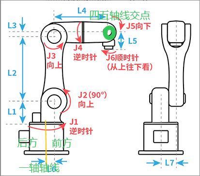

# 计算目标形态指令

### **SOLVE_CONFIGURATION-计算目标形态值**

**功能**

当从一个点A（机器人当前实际位置）运动到另外一个点B时，可以通过算法计算出机器人能以多少种形态从A到B

**使用范例**

**参数说明:**

目标点：即机器人要运动到的位置

形态值个数：算法计算得出多少种形态可以从A到达B（计算的是姿态总数）

形态值首个变量：存放计算出形态值D的首个变量（比如说算法计算出有3种形态可以从A到B，如指令说明所示，算法计算出第一个形态为2，则GI002存放2，GI003存放的就是3，GI004存放4）

计算目标形态值 G0001 GI001 GI002



程序**说明**





如上图所示，现在有两条指令，需要从GP0001使用计算形态值指令到GP0002。

通过计算，计算出有3种形态到GP002,将形态个数存入GI001

计算出有3种形态，将计算出的形态值首个变量存入GI002，GI002=2
GI003=3，GI004=4

**注意事项**

计算出来的形态，无法直接在点位参数界面修改形态值使用，可以使用设置点位信息指令调用计算出来的形态值。

**计算目标形态值参数说明:**

**运动指令内形态值计算方式：**



形态参数：

（如选择当前，则控制系统自动通过转换方式计算出应该选择哪个形态值）

> 形态值为机器人1轴、3轴、5轴位置的二进制转换值

转换方式：

> 例如某个六轴机器人1轴为59度、2轴为69度、3轴为79度、4轴为89度、5轴为99度、6轴为109度；
>
> 取其中的1/3/5轴，点位范围在-90\~+90之间为1，不在为0；
>
> 所以结果如下

  ------------ ------ ------ ------
  轴           1轴    3轴    5轴

  二进制数值   1      1      0
  ------------ ------ ------ ------

二进制数110 = 十进制6

形态值为十进制结果再加1，该点位形态值为7

**注意事项**

如需使用计算出来的姿态，则需要使用设置点位指令调用计算出来的姿态进行使用

## 六轴串联形态值计算优化

\-\-\-2026.2.24牛鹏帅修改

1、形态值的计算规则进行过一次优化，对J1的二进制转换做了优化，整体没有大的改动；

2、形态值为肩部形态值（原来的一轴）、肘部形态值（原来三轴）、腕部形态值（原来五轴）的二进制转换值；

3、转换方式如下：

（1）肩部形态值

判断规则：四五六轴的轴线交点是否在J1轴线的前方，在前方，则肩部形态值取1，不在前方，肩部形态值取0；

如图示位置，肩部形态值取1

注意：肩部形态值和J1的度数没有关系了，会受到J2 J3
J4的综合影响，只看交点在前方还是后方。图示位置肩部形态值取1，即使J1转了180度，也还是在前方



（2）肘部形态值

判断规则： -90 \< 三轴J3的度数 \< 90，肘部形态值取1，否则取0；

示意图中，J3为零点，故肘部形态值取1；

（3）腕部形态值

判断规则：以五轴部分和小臂共线时作为分界点，往下翻时，腕部形态值取1，否则取0；

通常以图示位置作为零点位置，则判断规则为 ：-90 \< 五轴J5的度数 \< 90
,腕部形态值取1，否则取0；示意图中的腕部形态值是1；

还有一种，五轴水平的零点位置，则判断规则为：0 \< 五轴J5的度数\<
180，腕部形态值取1，否则取0；

4、形态值的计算

三个形态值共同组成一个二进制数，111

形态值 = 4\*肩部形态值 + 2\*肘部形态值 + 腕部形态值 + 1

示意图位置的形态值则为：4\*1+2\*1+1+1 = 8；


## 计算目标形态指令 Q&A

### Q1：SOLVE_CONFIGURATION 指令的作用是什么？
**A：**
用于计算机器人从当前点A运动到目标点B时，可行的所有“形态（姿态）”。  
👉 输出结果包括：
- 可达形态总数
- 每一种形态对应的形态值

---

### Q2：计算出来的形态值是如何存储的？
**A：**
通过连续寄存器变量存储，例如：
- GI001：存储形态个数
- GI002：存储第一个形态值
- GI003、GI004...：依次存储后续形态值  

👉 本质是：**顺序写入一组连续变量**

---

### Q3：计算出来的形态值可以直接使用吗？
**A：**
不可以直接在点位参数界面修改使用。  

👉 正确方式：
- 使用“设置点位信息”指令
- 将计算出的形态值写入点位后再使用

---

### Q4：形态值是如何计算出来的？
**A：**
基于机器人关键轴（通常为1轴、3轴、5轴或肩/肘/腕）生成二进制值：

规则示例：
- 在指定角度范围内 → 记为1
- 不在范围内 → 记为0  

然后：
```text
二进制 → 十进制 → +1 = 最终形态值
```

---

## AI 检索专用问答对 (Q&A for Retrieval)

**Q: SOLVE_CONFIGURATION 指令的作用是什么？**

A: 用于计算机器人从当前点A运动到目标点B时，可行的所有"形态（姿态）"。输出结果包括可达形态总数和每一种形态对应的形态值。

**Q: 计算出来的形态值是如何存储的？**

A: 通过连续寄存器变量存储，例如：GI001存储形态个数，GI002存储第一个形态值，GI003、GI004...依次存储后续形态值。本质是顺序写入一组连续变量。

**Q: 计算出来的形态值可以直接使用吗？**

A: 不可以直接在点位参数界面修改使用。正确方式是使用"设置点位信息"指令，将计算出的形态值写入点位后再使用。

**Q: 形态值是如何计算出来的？**

A: 基于机器人关键轴（通常为1轴、3轴、5轴或肩/肘/腕）生成二进制值，在指定角度范围内记为1，不在范围内记为0。然后将二进制转换为十进制，再加1得到最终形态值。

**Q: 六轴串联形态值计算的优化内容是什么？**

A: 1. 形态值的计算规则进行过优化，对J1的二进制转换做了优化，整体没有大的改动；
2. 形态值为肩部形态值（原来的一轴）、肘部形态值（原来三轴）、腕部形态值（原来五轴）的二进制转换值；
3. 肩部形态值判断规则：四五六轴的轴线交点是否在J1轴线的前方，在前方取1，不在前方取0；
4. 肘部形态值判断规则：-90 < 三轴J3的度数 < 90，取1，否则取0；
5. 腕部形态值判断规则：以五轴部分和小臂共线时作为分界点，往下翻时取1，否则取0；
6. 形态值计算：4*肩部形态值 + 2*肘部形态值 + 腕部形态值 + 1。

---

## 相关资源

- [系统功能调试手册](./系统功能调试手册.md)
- [运动控制类指令](./运动控制类指令.md)