# 运动控制类指令

## 运动控制类：

"✔"表示支持此条指令。

| 指令类型 | 前台          | 全局后台 | 局部后台 |
| --- |-------------| --- | --- |
| 点到点 |✔|  |  |
| 直线 | ✔  |  |  |
| 圆弧 | ✔ |  |  |
| 整圆 | ✔ |  |  |
| 曲线 | ✔ |  |  |
| 增量 | ✔ |  |  |
| 外部轴点到点 | ✔ |  |  |
| 外部轴直线 | ✔ |  |  |
| 外部轴圆弧 | ✔ |  |  |
| 全局速度 | ✔ | ✔ | ✔ |
| 定点移动 | ✔ |  |  |
| 双机点到点 | ✔ |  |  |
| 双机直线 | ✔ |  |  |
| 双机圆弧 | ✔ |  |  |
| 双机整圆 | ✔ |  |  |
| 外部点 | ✔ |  |  |
| 外部轴随动 | ✔ |  |  |
| 电子齿轮 | ✔ |  |  |
| 复位外部轴多圈转动量 | ✔ |  |  |
| 拖拽示教 | ✔ |  |  |
| 切换负载参数 | ✔ |  |  |
| 门型运动 | ✔ |  |  |
| 外部基准点直线 | ✔ |  |  |
| 外部基准点圆弧 | ✔ |  |  |
| 外部基准点整圆 | ✔ |  |  |

# 运动控制类指令

如何插入指令？方法如下：

1. 点击工程，点击【新建】；
2. 新建程序后，点击【确定】；
3. 进入程序指令界面，点击【插入】；
4. 进入指令类型界面，选择需要插入的指令类型，然后选择指令，点击【确定】；
5. 进入指令参数设定界面，若需要修改参数，在修改完后点击【确定】，不需要修改参数直接点击【确定】；
6. 修改指令在指令参数界面选中需要修改的指令行点击【修改】；
7. 删除指令在指令参数界面选中需要修改的指令行点击【删除】；
8. 点击【操作】，可以对当前选中的指令进行复制，粘贴，剪切，上移，下移，注销和从此运行操作；
9. 点击【修改位置】，将机器人当前的位置写入选择的位置变量。

有关速度、平滑、加速度比率、减速度比率，提前执行的参数在运动类指令参数这一节有详细介绍。

注意：当修改部分指令速度(MOVJ、MOVL、MOVS等运动指令)时，加速度比率和减速度比率会与速度成1：1的关系自动显示，如需修改加速度比率或减速度比率，可手动操作。

## 运动控制类

### MOVJ-点到点

格式：MOVJ【指令名】 P/GP【变量】 VJ 【速度】 PL【平滑】 ACC【加速度比率】 DEC【减速度比率】 TIME 【提前执行时间，不设置则显示为0】。

功能：机器人向目标点移动中，不受轨迹约束的区间使用。机器人在空间内以最快的速度从一个点运行到另一个点。

参数：

| 点位 | 使用局部位置变量（P）或全局位置变量（GP）。当值为“新建”时，插入该指令则新建一个P变量，并将机器人的当前位置记录到该P变量 |
| --- | --- |
| VJ | 关节插补的速度，范围:[1,100] |
| PL | 平滑过渡等级，范围[0,5] |
| ACC | 加速度比率，范围[1,100] |
| DEC | 减速度比率，范围[1,100] |
| TIME | 提前执行时间，单位ms |

示例：

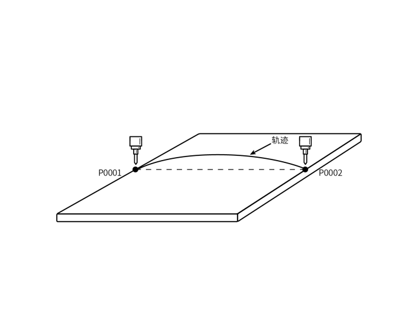

1. NOP
2. MOVJ P0001 VJ = 10 % PL =1 ACC = 5 DEC = 5 0
3. MOVJ P0002 VJ = 10 % PL =1 ACC = 5 DEC = 5 0
4. END

示例说明：机器人通过关节插补的方式从P0001运动到P0002。

### MOVL-直线

格式：MOVL【指令名】P/GP【变量】 V【速度】 PL【平滑】 ACC【加速度比率】 DEC【减速度比率】 TIME 【提前执行时间，不设置则显示为0】。

功能：机器人向目标点移动的过程中，机器人末端运动的轨迹为直线。

参数：

| 点位 | 使用局部位置变量（P）或全局位置变量（GP）。当值为“新建”时，插入该指令则新建一个P变量，并将机器人的当前位置记录到P变量 |
| --- | --- |
| V | 直线插补的速度，范围1-1000（默认笛卡尔参数最大速度为1000，范围根据实际填写的笛卡尔参数变化），单位为mm/s |
| PL | 平滑过渡等级，范围[0,5] |
| ACC | 加速度比率，范围[1,100] |
| DEC | 减速度比率，范围[1,100] |
| TIME | 提前执行时间，单位ms |

示例：

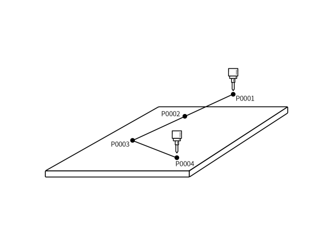

1. NOP
2. MOVL P0001 V = 200 mm/s PL = 0 ACC = 20 DEC=20 0
3. MOVL P0002 V = 200 mm/s PL = 0 ACC = 20 DEC=20 0
4. MOVL P0003 V = 200 mm/s PL = 0 ACC = 20 DEC=20 0
5. MOVL P0004 V = 200 mm/s PL = 0 ACC = 20 DEC=20 0
6. END

示例说明：机器人从P0001点通过直线插补的方式向目标点运动,运动过程中机器人末端运动的轨迹为直线。

### MOVC-圆弧

格式：MOVC【指令名】P/GP【变量】 V【速度】 PL【平滑】 ACC【加速度比率】 DEC【减速度比率】 TIME 【提前执行时间，不设置则显示为0】。

功能：圆弧插补方式移动到示教的三个点位

参数：

| 点位 | 使用局部位置变量（P）或全局位置变量（GP）。当值为“新建”时，插入该指令则新建一个P变量，并将机器人的当前位置记录到该P变量 |
| --- | --- |
| V | 直线插补的速度，范围1-1000（默认笛卡尔参数最大速度为1000，范围根据实际填写的笛卡尔参数变化），单位为mm/s |
| PL | 平滑过渡等级，范围[0,5] |
| ACC | 加速度比率，范围[1,100] |
| DEC | 减速度比率，范围[1,100] |
| TIME | 提前执行时间，单位ms |
| SPIN | 示教姿态：姿态从第一点直接往第三点运行。 姿态倾角不变：全程保持第一个点的倾角不变，运行整个轨迹（第二第三点无论什么姿态都不影响 变量表示：0示教姿态，1姿态倾角不变 |

注意事项：机器人走一个完整的圆弧轨迹需插入一条MOVJ或者MOVL指令，然后插入两条MOVC指令，否则程序运行时会报错（机器人1指令错误，孤立MOVC指令）。

示例：

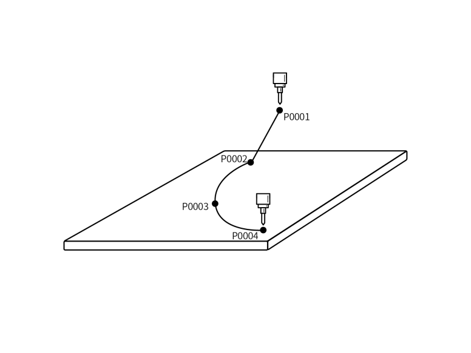

1. NOP
2. MOVL P0001 V=100mm/s PL=0 ACC=1 DEC=1 0
3. MOVL P0002 V=100mm/s PL=0 ACC=1 DEC=1 0         圆弧起始点
4. MOVC P0003 V=100mm/s PL=0 ACC=10 DEC=10 0     圆弧中间点
5. MOVC P0004 V=100mm/s PL=0 ACC=10 DEC=10 0     圆弧终点
6. END

示例说明：机器人从P0001点运行到圆弧起始点，到达圆弧起始点后开始走圆弧轨迹。

### MOVCA-整圆

格式：MOVCA【指令名】P/GP【变量】 V【速度】 PL【平滑】 ACC【加速度比率】 DEC【减速度比率】 TIME 【提前执行时间，不设置则显示为0】。

功能：机器人通过示教的三个点位走整圆轨迹。

参数：

| 点位 | 使用局部位置变量（P）或全局位置变量（GP）。当值为“新建”时，插入该指令则新建一个P变量，并将机器人的当前位置记录到该P变量 |
| --- | --- |
| V | 直线插补的速度，范围1-1000（默认笛卡尔参数最大速度为1000，范围根据实际填写的笛卡尔参数变化），单位为mm/s |
| PL | 平滑过渡等级，范围[0,5] |
| ACC | 加速度比率，范围[1,100] |
| DEC | 减速度比率，范围[1,100] |
| TIME | 提前执行时间，单位ms |
| SPIN | 姿态不变：整圆运行的姿态和的第一个点位示教的姿态(MOVJ,MOVL的标定姿态)相同，并以这个姿态走完整圆轨迹 六轴不转：整圆的运行会按照每个点位示教的姿态进行运动，同时六轴是固定不动的 六轴旋转:整圆的运行会按照每个点位示教的姿态进行运动 |

注意事项：机器人走一个完整的整圆轨迹需插入一条MOVJ或者MOVL指令，然后插入两条MOVCA指令，否则程序运行时会报错（机器人1指令错误，孤立MOVCA指令）。

示例：

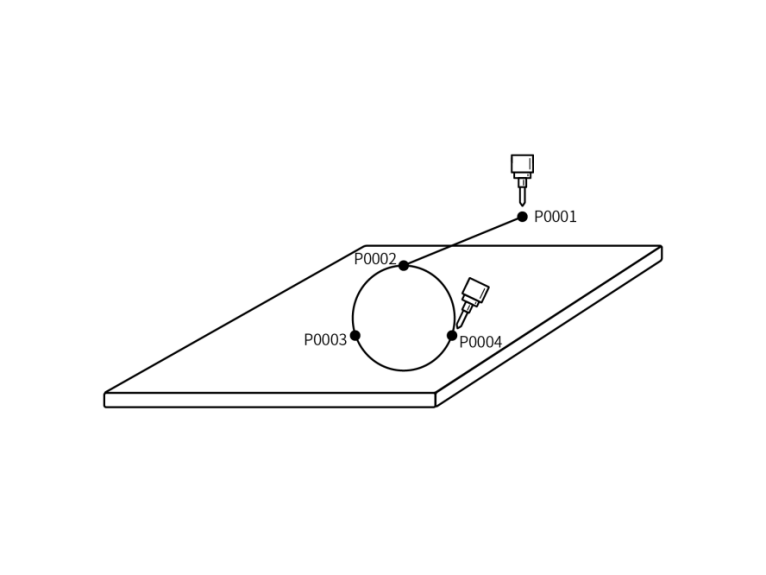

1. NOP
2. MOVL P0001 V=50mm/s PL=0 ACC=1 DEC=1 0
3. MOVL P0002 V=50mm/s PL=0 ACC=1 DEC=1 0              整圆起始点
4. MOVC P0003 V=100mm/s PL=0 ACC=10 DEC=10 0        整圆过度点
5. MOVC P0004 V=100mm/s PL=0 ACC=10 DEC=10 0        整圆终点
6. END

示例说明：机器人从安全点P0001运行到整圆轨迹起始点P0002，到达整圆起始点后走整圆轨迹。

### MOVS-曲线

格式：MOVCA【指令名】P/GP【变量】 V【速度】 PL【平滑】 ACC【加速度比率】 DEC【减速度比率】 TIME 【提前执行时间，不设置则显示为0】。

功能：在焊接、切割、熔接、涂底漆等作业时，使用自由曲线插补，对于不规则曲线工件的示教作业可变得容易。

参数：

| 点位 | 使用局部位置变量（P）或全局位置变量（GP）。当值为“新建”时，插入该指令则新建一个P变量，并将机器人的当前位置记录到该P变量 |
| --- | --- |
| V | 直线插补的速度，范围1-1000（默认笛卡尔参数最大速度为1000，范围根据实际填写的笛卡尔参数变化），单位为mm/s |
| PL | 平滑过渡等级，范围[0,5] |
| ACC | 加速度比率，范围[1,100] |
| DEC | 减速度比率，范围[1,100] |
| TIME | 提前执行时间，单位ms |

注意事项：曲线轨迹最少需要示教四个曲线点位，否则程序运行会报错（机器人1指令错误，MOVS指令不能少于4条）。

示例：使用曲线插补示教四个点，形成一条曲线轨迹。

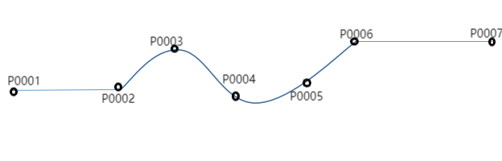

1. NOP
2. MOVL P0001 V = 100mm/s  PL = 0 ACC = 10 DEC = 10 0        安全点
3. MOVS P0002 V = 100 mm/s PL = 0 ACC = 10 DEC = 10 0        曲线起始点
4. MOVS P0003 V = 100mm/s  PL = 0 ACC = 10 DEC = 10 0        曲线中间点
5. MOVS P0004 V = 100 mm/s PL = 0 ACC = 10 DEC = 10 0        曲线中间点
6. MOVS P0005 V = 100 mm/s PL = 0 ACC = 10 DEC = 10 0        曲线中间点
7. MOVS P0006 V = 100mm/s  PL = 0 ACC = 10 DEC = 10 0        曲线结束点
8. MOVL P0007 V = 100mm/s  PL = 0 ACC = 10 DEC = 10 0        整条轨迹的结束点
9. END

示例说明：机器人从P0001点运行到曲线轨迹的起始点,到达在曲线起始点后开始走曲线轨迹P0002-P0006,走完整个曲线轨迹后最后运行到P0007，整条运动轨迹运行结束。

### IMOV-增量

格式：IMOV【指令名】 RP【变量】 V/VJ【速度】 RF BF TF UF【坐标系】 PL【平滑】 ACC【加速度比率】 DEC【减速度比率】 TIME 【提前执行时间，不设置则显示为0】。

功能：通过关节或直线的插补方式从当前位置移动设定的增量数值。

参数：

| RP | 增量变量,记录增量位置数据 |
| --- | --- |
| V/VJ | V:直线插补速度 VJ:关节插补速度 |
| PL | 平滑过渡等级，范围[0,5] |
| 坐标系 | 关节坐标，直角坐标，工具坐标，用户坐标 |
| ACC | 加速度比率，范围[1,100] |
| DEC | 减速度比率，范围[1,100] |
| TIME | 提前执行时间，单位ms |

注意事项：错误处理：在插入增量指令时，如果坐标系选择工具坐标，点位工具要和实际使用工具统一，否则程序运行会报错（例如：机器人1工具手使用错误，点位工具为1，实际使用工具为2）。

示例：

| 坐标系可选择关节、直角、工具、用户四种坐标系，对应轴填正数为正方向，负数为反方向，若不动则填0 |
| --- |
| 坐标系 | 设置的位置参数值 | 示例介绍 |
| 关节坐标（RF） | JI-(10) J2-(-5) J3-0 J4-0 J5-0 J6-0 | IMOV RP0001 VJ=10% RF PL=0 ACC=1 DEC=1 0 机器人在当前位置关节坐标的JI轴增加10，J2轴减5,其它轴数值不变 |
| 直角坐标（BF） | X-(-20) Y-(35) Z-(50) A-0 B-0 C-0 | IMOV RP0002 V=10mm/s BF PL=0 ACC=1 DEC=1 0 机器人在当前位置直角坐标X轴减少20mm，Y轴增加35mm,Z轴增加50mm，其它坐标轴数值不变 |
| 工具坐标（TF） | TX-(10) TY-(20) TZ-(-30) TA-(1) TB-0 TC-0 | IMOV RP0003 V=10mm/sTF PL=0 ACC=1 DEC=1 0 机器人在当前位置工具坐标X轴增加10mm，Y轴增加20mm,Z轴减少30mm， 姿态轴A轴增加1rad其它轴数值不变 |
| 用户坐标（UF） | UX-(0) UY-(-20) UZ-(30) UA-(0) UB-(-1) UC-0 | IMOV RP0004 V=10mm/sUF PL=0 ACC=1 DEC=1 0 机器人在当前位置用户坐标Y轴减少20mm,Z轴增加30mm， 姿态轴B轴减少1rad，其它轴数值不变 |

## 外部轴指令

问题：什么是外部轴？

解答：外部轴是指除去机器人本体的轴，为了工作需要所以在加上的轴，被用于喷涂，焊接，切割等行业。

问题：如何设置外部轴？

解答：点击设置-机器人参数-从站配置，从站列表界面点击【外部轴】进入外部轴配置界面。点击【修改】设置外部轴组数，外部轴型号点击保存，然后点击【轴组组号】在轴组组合配置界面选中外部轴组。

问题：如何设置外部轴参数？

解答：点击设置-外部轴参数，进入外部轴参数界面。标定外部轴，外部轴的标定方法参考《外部轴使用手册》，设置外部轴关节参数等，参数设置完成后，就可以使用外部轴工作了

注意事项：当修改外部轴指令的速度时，加速度比率和减速度比率会与速度成1：1的倍数关系自动显示，如需修改加速度比率或减速度比率，可手动操作。

### MOVJEXT-外部轴点到点

格式：MOVJEXT【指令名】 E/GE【变量】 VJ 【速度】 PL【平滑】 ACC【加速度比率】DEC【减速度比率】TIME 【提前执行时间，不设置则显示为0】

功能：机器人以关节插补方式向示教位置移动，外部轴在旋转时机器人通过示教的点位在外部轴上运动

参数：

| E | 记录机器人与外部轴位置数据的变量。当值为“新建”时，插入该指令则新建一个E变量，并将机器人与外部轴的当前位置记录到该E变量。 |
| --- | --- |
| VJ | 关节插补的速度，范围[1,100] |
| EVJ | 外部轴速度，范围[1,100] |
| PL | 平滑过渡等级，范围[0,5] |
| ACC | 加速度比率，范围[1,100] |
| DEC | 减速度比率，范围[1,100] |
| TIME | 提前时间执行下一条指令。单位ms |

示例：

1. NOP
2. MOVJEXT E0001 VJ = 10 % PL = 0 ACC= 10 DEC = 10 0
3. MOVJEXT E0002 VJ = 20 % PL = 0 ACC= 10 DEC = 10 0
4. END

示例说明：机器人从E0001运动到E0002，并且E0001-E0002的运动过程中外部轴旋转。

### MOVLEXT-外部轴直线

格式：MOVLEXT【指令名】 E/GE【变量】 V【速度】 PL【平滑】 ACC【加速度比率】DEC【减速度比率】SYNC【变位机同步,“0”表示没有开启同步,“1”表示打开了同步】 TIME 【提前执行时间，不设置则显示为0】

功能:机器人以直线插补的方式向示教位置移动，外部轴在旋转时机器人在外部轴上走直线轨迹

参数：

| E | 记录机器人与外部轴位置数据的变量。当值为“新建”时，插入该指令则新建一个E变量，并将机器人与外部轴的当前位置记录到该变量。 |
| --- | --- |
| V | 直线插补的速度，范围1-1000（默认笛卡尔参数最大速度为1000，范围根据实际填写的笛卡尔参数变化），单位为mm/s |
| EVJ | 外部轴速度，范围[1,100] |
| PL | 平滑过渡等级，范围[0,5] |
| ACC | 加速度比率，范围[1,100] |
| DEC | 减速度比率，范围[1,100] |
| TIME | 提前时间执行下一条指令。单位ms |
| SYNC | SYNC 变位机是否同步 打开同步：机器人与外部轴协同走直线 关闭同步：机器人在空间走直线，外部轴独立运动到目标位置 |

注意事项：在使用外部轴直线指令前需要在外部轴标定界面选中外部轴组号，否则程序运行时会报错。标定外部轴时需要准确的标定，否则在走外部轴直线指令时，机器人与外部轴同步会有问题。

示例：

1. NOP
2. MOVLEXT E0001 V = 50 mm/s PL = 0 ACC = 1 DEC = 1 SYNC = 1 0
3. MOVLEXT E0002 V = 50 mm/s PL = 0 ACC = 1 DEC = 1 SYNC = 1 0
4. END

示例说明：机器人从安全点位运动到E0001，到达E0001机器人与外部轴协作走直线轨迹运行到 E0002。

### MOVCEXT-外部轴圆弧

格式：MOVCEXT【指令名】 E/GE【变量】 V【速度】 PL【平滑】 ACC【加速度比率】DEC【减速度比率】SYNC【变位机同步,“0”表示没有开启同步,“1”表示打开了同步】 TIME 【提前执行时间，不设置则显示为0】

功能：机器人以圆弧插补方式向示教位置移动，外部轴用关节插补的方式运动。机器人末端执行器从E0001-E0003走圆弧轨迹，并且在走圆弧轨迹时外部轴旋转。

参数：

| E | 记录机器人与外部轴位置数据的变量。当值为“新建”时，插入该指令则新建一个E变量，并将机器人与外部轴的当前位置记录到该变量。 |
| --- | --- |
| V | 直线插补的速度，范围1-1000（默认笛卡尔参数最大速度为1000，范围根据实际填写的笛卡尔参数变化），单位为mm/s |
| EVJ | 外部轴速度，范围[1,100] |
| PL | 平滑过渡等级，范围[0,5] |
| ACC | 加速度比率，范围[1,100] |
| DEC | 减速度比率，范围[1,100] |
| TIME | 提前时间执行下一条指令。单位ms |
| SYNC | SYNC 变位机是否同步 打开同步：机器人与外部轴协同走圆弧 关闭同步：机器人在空间走圆弧，外部轴独立运动到目标位置 |

注意事项：在使用外部轴圆弧指令前需要在外部轴标定界面选中外部轴组号，否则程序运行时会报错。标定外部轴时需要准确的标定，否则在走外部轴圆弧指令时，机器人与外部轴同步会有问题

示例：

1. NOP
2. MOVL E0001V = 100 mm/s PL = 0 ACC = 1 DEC = 1 0                       安全点
3. MOVLEXT E0002 V = 50 mm/s PL = 0 ACC = 1 DEC = 1 SYNC = 1 0  圆弧开始点
4. MOVCEXT E0003 V = 50 mm/s PL = 0 ACC = 1 DEC = 1 SYNC = 1 0  圆弧中间点
5. MOVCEXT E0004 V = 50 mm/s PL = 0 ACC = 1 DEC = 1 SYNC = 1 0  圆弧结束点
6. END

示例说明：机器人从当前位置运行到E0001点，从E0001点运行到圆弧开始点E0002，到达E0002后运行至圆弧中间点E0003 ，在E0003点走完整个外部轴圆弧轨迹。E0002-E0004运动过程中机器人与外部轴协作走圆弧，机器人在向示教的目标点移动时，外部轴也在同步旋转。

### SPEED-全局速度

格式：SPEED【指令名】 10%【设置的速度参数】。

功能：整体修改SPEED指令下运动类指令的速度。

参数：

| SPEED 范围[1,200]% | 手填:直接手输速度参数 变量：通过给变量赋值的形式设置速度参数 |
| --- | --- |

注意事项：SPEED指令以下的运动类指令速度计算方式：

线速度：指令速度*状态栏速度*SPEED全局速度的百分比。

轴速度：关节额定正速度*指令速度*状态栏速度*SPEED全局速度的百分比。

程序在运行时可以在监控-轴速度界面看当前速度和最大速度。

示例：设置全局速度为50%：

1. NOP
2. MOVL GP0001 V = 200 mm/s PL = 2 ACC = 20 DEC=20 0
3. MOVL GP0002 V = 200 mm/s PL = 2 ACC = 20 DEC=20 0
4. SPEED= 80%
5. MOVL GP0003 V = 100 mm/s PL = 2 ACC = 20 DEC=20 0
6. MOVL GP0004 V = 100 mm/s PL = 2 ACC = 20 DEC=20 0
7. MOVL GP0005 V = 100 mm/s PL = 2 ACC = 20 DEC=20 0
8. END

示例说明：GP0001-GP0002运行时的线速度：指令速度200 mm/s*全局速度50%。

GP0002-GP0004运行时的线速度：指令速度100mm/s*全局速度50%*SPEED全局速度80%。

### SAMOV-定点移动

格式：SAMOV【指令名】 AP【变量】 V/VJ【速度】 RF BF TF UF【坐标系】 PL【平滑】 ACC【加速度比率】 DEC【减速度比率】 TIME 【提前执行时间，不设置则显示为0】。

功能：机器人定点移动到设置的点位。

参数：

| AP | 定点移动变量,记录位置数据 |
| --- | --- |
| V/VJ | V:直线插补速度 VJ:关节插补速度 |
| PL | 平滑过渡等级，范围[0,5] |
| 坐标系 | 关节坐标，直角坐标，工具坐标，用户坐标 |
| ACC | 加速度比率，范围[1,100] |
| DEC | 减速度比率，范围[1,100] |
| TIME | 提前执行时间，单位ms |

参数设定：

| 坐标系 | 设置的位置参数值 | 示例介绍 |
| --- | --- | --- |
| 关节坐标（RF） | JI-(10) J2-(-5) J3 J4 J5 J6 | SAMOV AP0001 VJ=10% RF PL=0 ACC=1 DEC=1 0 机器人移动到设置好的关节点位，关节坐标下J1轴的坐标值为10，J2轴的坐标值为-5，其它轴的坐标值不变 |
| 直角坐标（BF） | X-(300) Y-(0) Z-(120) A B C | SAMOV AP0002 VJ=10% BF PL=0 ACC=1 DEC=1 0 机器人移动到设置好的直角点位，直角坐标下X轴的坐标值为300，Y轴的坐标值为O，Z轴的坐标值为120，其它轴的坐标值不变 |
| 工具坐标（TF） | TX-(300) TY-(0) TZ TA-(3.14) TB TC | SAMOV AP0003 VJ=10% TF PL=0 ACC=1 DEC=1 0 机器人移动到工具点位，工具坐标下X轴的坐标值为300，Y轴的坐标值为O，姿态轴A轴的坐标值为3.14rad，其它轴的坐标值不变 |
| 用户坐标（UF） | UX UY-(120) UZ-(100) UA UB UC | SAMOV AP0004 VJ=10% UF PL=0 ACC=1 DEC=1 0 机器人移动到用户点位，用户坐标下Y轴的坐标值为12O，Z轴的坐标值为100，其它轴的坐标值不变 |

注意事项：如果不需要移动某个轴，请在该轴的坐标处留空，不要填0（如果填写0的话，在运行这条指令时对应的坐标轴点位会变为0）。

示例：

假设机器人当前关节坐标系下的点位（10，20，30，40，50，60），插入定点移动指令，选择关节坐标系，设置需要修改的坐标轴参数。

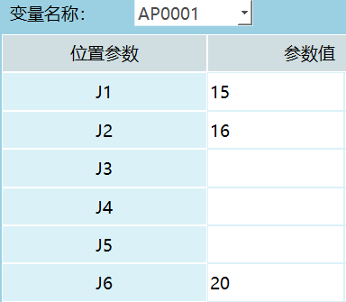

SAMOV AP0004 VJ=10% UF PL=0 ACC=1 DEC=1 0；

示例说明：执行定点移动指令，机器人运动到目标点位（15，16，30，40，50，20）。

## 双机指令

双机工作模式：机器人双机协作是由两台六轴串联机器人协同完成，在整个工作过程中，机器人之间共同协调，以完成最终的任务目标。

问题：如何设置双机模式？

解答：

1. 点击设置-机器人参数-从站配置，进入从站配置界面点击【机器人】进入机器人配置界面设置机器人数目；
2. 两个机器人类型均选择六轴串联机器人；
3. 设置点击【保存】重启系统；
4. 在机器人1导入配置，robot_A（机器人1配置）与robot_B（机器人2配置）；
5. 在机器人参数-运动参数界面点击【修改】，打开双机同步模式，点击【保存】。

问题：双机指令插入后如何示教点位？

解答：说明：双机点到点，双机直线，双机圆弧和双机整圆指令只支持在机器人1插入。

1. 机器人1指令界面插入双机指令；
2. 在机器人1点动机器人到达目标点位；
3. 切换到机器人2点动机器人到达目标点位。

在机器人1程序指令界面选中需要修改的指令点击【修改】，然后在参数定界面点击【当前位置设置为E点】，提示框弹出“是否继续修改点位”,点击【确定】将当前位置存入目标变量，点击【取消】不会记录机器人当前点位到目标变量，可以继续移动机器人到想要的点位。下图第1部分表示机器人1当前位置和存入变量的位置，第2部分表示机器人2当前位置和存入变量的位置。

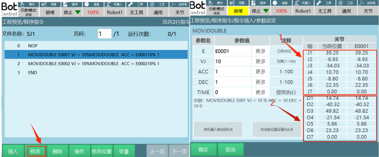

问题：双机模式如何运行程序？

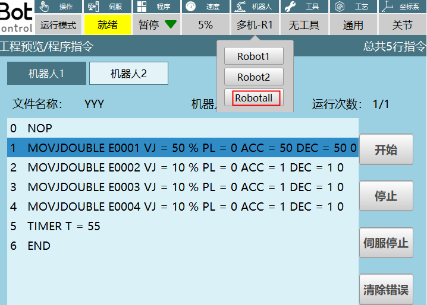

解答：

1. 切到运行模式，点击机器人选择“Robotall”,进入到双机运行模式界面；
2. 同时启动两个机器人，可以点击示教器上面的【启动】，同时暂停两台机器的工作点击示教器上面的【停止】；
3. 如果单独启动机器人1可以点击【机器人1】然后点击图上所示的【开始】,机器人1开始工作，点击【停止】机器人1暂停工作，机器人2的启动和停止与机器人1操作方式相同。

**注意事项：双机以及多机连接时需要直连，不能因为线不够长等情况通过交换机去串联，这种情况可能会出现机器人飞车！**

### MOVJDOUBLE-双机点到点

格式：MOVJDOUBLE【指令名】E/GE【变量】 VJ 【速度】 ACC【加速度比率】 DEC【减速度比率】 TIME 【提前执行时间，不设置则显示为0】。

功能：两台机器通过关节插补从一个点运动到另一个点。

参数：

| E/GE | 记录机器人位置数据的变量。当值为“新建”时，插入该指令则新建一个E变量，并将机器人的当前位置记录到该E变量 |
| --- | --- |
| VJ | 关节插补的速度，范围:[1,100] |
| ACC | 加速度比率，范围[1,100] |
| DEC | 减速度比率，范围[1,100] |
| TIME | 提前执行时间，单位ms |

示例：

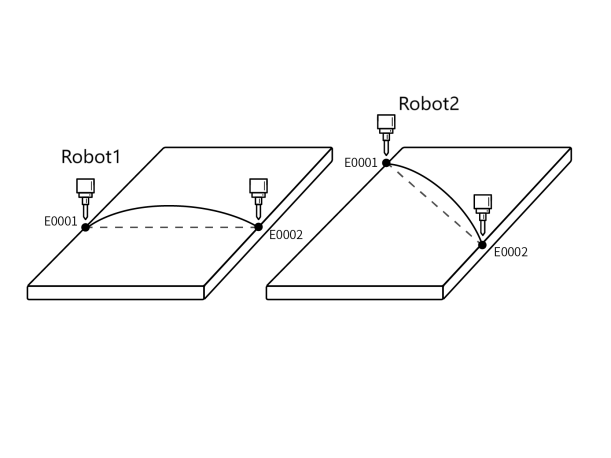

1. NOP
2. MOVJDOUBLE E0001 VJ = 10 % PL = 0 ACC= 10 DEC = 10 0
3. MOVJDOUBLE E0002 VJ = 15 % PL = 0 ACC= 10 DEC = 10 0
4. END

示例说明：程序启动时两台机器人根据示教的点位通过关节插补方式从E0001运动到E0002。

### MOVLDOUBLE-双机直线

格式：MOVLDOUBLE【指令名】E/GE【变量】 V 【速度】 ACC【加速度比率】 DEC【减速度比率】 TIME 【提前执行时间，不设置则显示为0】。

功能:控制两台机器人通过直线插补运行到目标点位，机器人末端运动的轨迹为直线。

参数：

| E/GE | 记录机器人位置数据的变量。当值为“新建”时，插入该指令则新建一个E变量，并将机器人的当前位置记录到该E变量 |
| --- | --- |
| V | 直线插补的速度，范围1-1000（默认笛卡尔参数最大速度为1000，范围根据实际填写的笛卡尔参数变化），单位为mm/s |
| ACC | 加速度比率，范围[1,100] |
| DEC | 减速度比率，范围[1,100] |
| TIME | 提前执行时间，单位ms |

示例：

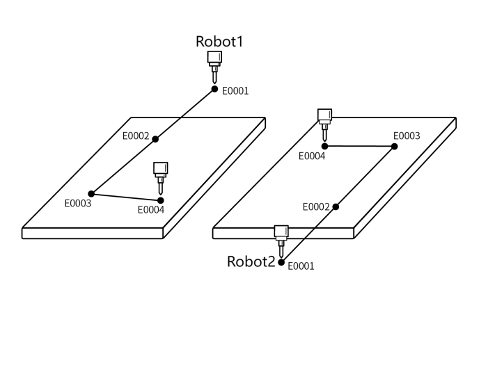

1. NOP
2. MOVLDOUBLE E0001 V = 100 mm/s PL = 0 ACC= 10 DEC = 10 0
3. MOVLDOUBLE E0002 V = 50 mm/s PL = 0 ACC= 10 DEC = 10 0
4. MOVLDOUBLE E0003 V = 50 mm/s PL = 0 ACC= 10 DEC = 10 0
5. MOVLDOUBLE E0004 V = 50 mm/s PL = 0 ACC= 10 DEC = 10 0
6. END

示例说明：程序启动时两台机器人根据示教的点位通过直线插补方式从E0001运动到E0004，机器人末端运动的轨迹为直线。

### MOVCDOUBLE-双机圆弧

格式：MOVCDOUBLE【指令名】E/GE【变量】 V 【速度】 ACC【加速度比率】 DEC【减速度比率】 TIME 【提前执行时间，不设置则显示为0】。

功能:两个机器人在程序启动时走圆弧轨迹。

参数：

| E/GE | 记录机器人位置数据的变量。当值为“新建”时，插入该指令则新建一个E变量，并将机器人的当前位置记录到该E变量 |
| --- | --- |
| V | 直线插补的速度，范围1-1000（默认笛卡尔参数最大速度为1000，范围根据实际填写的笛卡尔参数变化），单位为mm/s |
| ACC | 加速度比率，范围[1,100] |
| DEC | 减速度比率，范围[1,100] |
| TIME | 提前执行时间，单位ms |

示例：

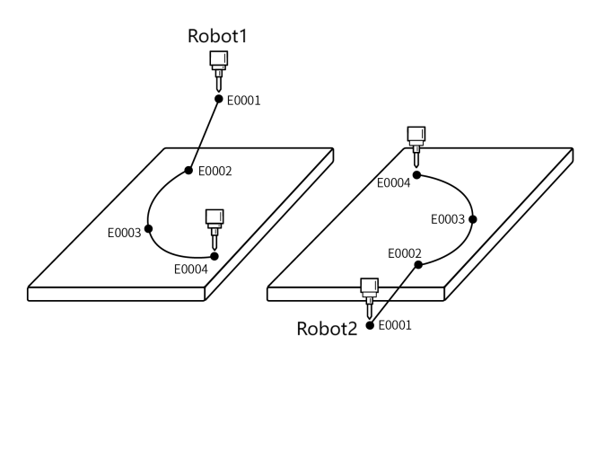

1. NOP
2. MOVLDOUBLE E0001 V = 10 % PL = 0 ACC= 10 DEC = 10 0
3. MOVLDOUBLE E0002 V = 10 % PL = 0 ACC= 10 DEC = 10 0             圆弧起始点
4. MOVCDOUBLE E0003 V = 100 mm/s PL = 0 ACC= 10 DEC = 10 0    圆弧过渡点
5. MOVCDOUBLE E0004 V = 100mm/s PL = 0 ACC= 10 DEC = 10 0     圆弧终点
6. END

示例说明：程序启动时两台机器人根据示教的点位通过直线插补方式从E0001运动到E0002，在E0002走完整个圆弧轨迹。

### MOVCADOUBLE-双机整圆

格式：MOVCADOUBLE【指令名】E/GE【变量】 V 【速度】 ACC【加速度比率】 DEC【减速度比率】 TIME 【提前执行时间，不设置则显示为0】。

功能：机器人通过双机协作两个机器人同时走整圆轨迹。

参数：

| E/GE | 记录机器人位置数据的变量。当值为“新建”时，插入该指令则新建一个E变量，并将机器人的当前位置记录到该E变量 |
| --- | --- |
| V | 直线插补的速度，范围1-1000（默认笛卡尔参数最大速度为1000，范围根据实际填写的笛卡尔参数变化），单位为mm/s |
| ACC | 加速度比率，范围[1,100] |
| DEC | 减速度比率，范围[1,100] |
| TIME | 提前执行时间，单位ms |
| SPIN：机器人末梢旋转 | 姿态不变：整圆运行的姿态和的第一个点位示教的姿态(MOVJ,MOVL的标定姿态)相同，并以这个姿态走完整圆轨迹 六轴不转：整圆的运行会按照每个点位示教的姿态进行运动，同时六轴是固定不动的 六轴旋转；整圆的运行会按照每个点位示教的姿态进行运动 |

示例：

1. NOP
2. MOVLDOUBLE E0001 V = 10 % PL = 0 ACC= 10 DEC = 10 0
3. MOVLDOUBLE E0002 V = 10 % PL = 0 ACC= 10 DEC = 10 0               整圆起始点
4. MOVCADOUBLE E0003 V = 25 mm/s PL = 0 ACC= 10 DEC = 10 0      整圆过渡点
5. MOVCADOUBLE E0004 V = 25 mm/s PL = 0 ACC= 10 DEC = 10 0      整圆终点
6. END

示例说明：程序启动时两台机器人根据示教的点位通过直线插补方式从E0001运动到E0002，在E0002走完整个整圆轨迹。

### MOVCOMM-外部点

格式：MOCOMM【指令名】 MOVJ/MOVL/MOVS/MOVC【插补方式】V/VJ【速度】 PL【平滑】 ACC【加速度比率】DEC【减速度比率】TIME 【提前执行时间，不设置则显示为0】。

功能：以规定的插补方式通过外部点指令运动到目标点位，可以通过6000,7000端口和视觉工艺发送外部点点位。

参数：

| 插补方式 | 关节、直线、曲线，圆弧 |
| --- | --- |
| V/VJ | V:直线插补速度 范围2-1000（默认笛卡尔参数最大速度为1000，范围根据实际填写的笛卡尔参数变化），单位为mm/s VJ:关节插补速度 |
| PL | 平滑过渡等级，范围[0,5] |
| ACC | 加速度比率，范围[1,100] |
| DEC | 减速度比率，范围[1,100] |
| TIME | 提前执行时间，单位ms |

问题：视觉工艺如何运行外部点？

1. 视觉工艺-视觉参数界面设置好参数，运行一个单独点位，打开单目标按钮。运行连续轨迹需要关闭单目标按钮；
2. 视觉位置参数界面将接受位置类型选择轨迹；
3. 插入外部点指令，机器人开始走发送的点位。

示例1:

1. NOP
2. VISION_RUN ID =1                                                        视觉开始
3. VISION_TRG ID =1                                                         视觉触发
4. VISION_TRACE ID =1                                                     获取视觉轨迹位置
5. MOCOMM MOVJ VJ=10% PL=0 ACC=10 DEC=10 0    外部点
6. VISION_END ID =1                                                        视觉结束
7. END

示例说明：相机通讯成功，发送点位，获取轨迹位置点位存放位置选择外部点运动队列，再轨迹位置指令下面插入外部点指令。然后机器人开始走相机发送的外部点轨迹。

问题：6000，7000端口如何运行外部点指令？

解答：首先注意：6000端口连接时需要拔出示教器！

1. 6000/7000端口：根据《纳博特网络功能协议》查找命令字,发送数据(注意发送格式，发送格式不对的话会导致发送的数据不生效)。
2. 插入外部点指令，根据《纳博特网络功能协议》的格式发送点位，发送成功后，运行外部点指令机器人会根据发送的数据运行到目标点位。
3. 机器人会根据发送的数据运行单独的点位或者连续轨迹。

示例2：命令字9521，选择”连续轨迹”，”一次传输完全部轨迹点位”，设置的参数仅作为参考，有关其他参数设置可以查看《纳博特网络功能协议》，示例的协议格式如下：

{

"robot":1,

"clearBuffer":1,

"targetMode":1,

"sendMode":0,

"cfg":{

"coord":"ACS",

"extMove":1,

"sync":1,

"speed":100,

"acc":100

},

"targetVec":[

{

"Pos": [0.041551248380773474, -2.4360361628239624, -3.2330625556135573, -0.11526996517990794, 84.33099586526323, 0.05293787887842427, -50.0, -0.003641843003143831, 0.0],

"axisVel": [-0.0158, -0.0022, -0.0114, -0.0, -0.0136, -0.0158, 0.0, -0.8369, 0.0],

"axisAcc": [-0.79, -0.11, -0.57, -0.0, -0.68, -0.79, 0.0, -41.84, 0.0],

"timeStamp":1000

},

{

"Pos": [0.04091827209393009, -2.4361222744046107, -3.2335192193925764, -0.1152700747519332, 84.33045182378399, 0.05230600132017571, -50.0, -0.010925529009431494, 0.0],

"axisVel": [-0.0316, -0.0043, -0.0228, -0.0, -0.0272, -0.0316, 0.0, -1.6738, 0.0],

"axisAcc": [-0.79, -0.1, -0.57, 0.0, -0.68, -0.79, 0.0, -41.84, 0.0],

"timeStamp":2000

}

]

}

### EXTMOV-外部轴随动

格式：EXTMOV【指令名】O1【运动的外部轴】COMST_T【外部轴随动类型】10【倍数】。

功能:外部轴按机器人线速度倍数的速度或恒速跟随机器人随动的指令。

参数：

| 外部轴 | 可选O1-O5某个轴进行随动 |
| --- | --- |
| 类型 | 外部轴的速度在监控中的轴速度中看 随动：随机器人实时速度改变速度 恒速：恒定的某个速度运行 |
| 速度值 | 当随动类型为恒速时速度值可以选择手填，变量 |
| K | 当随动类型为随动时可以填写值 K（倍数）：外部轴速度（°/s）=K*线速度（mm/s） |

注意事项：外部轴随动指令中间不支持插入外部轴运动指令！

示例1：外部轴随动指令类型恒速，恒速值为10。

1. NOP
2. EXTMOV O1 COMST_T 10                                随动开始
3. MOVL P0001 V=50mm/s  PL=0 ACC=1 DEC=1 0
4. ENDEXTMOV                                                    随动结束
5. END

执行效果：机器人在向P0001移动的过程中，外部轴也会一起运动，在运动过程中外部轴的轴速度一直为10，机器人运行到P0001点后外部轴也停止运动。

示例2：外部轴随动指令类型随动，K=2。

1. NOP
2. EXTMOV O1 FOLLOW 2                                 随动开始
3. MOVL P0001 V=10mm/s  PL=0 ACC=1 DEC=1 0
4. ENDEXTMOV                                                 随动结束
5. END

示例说明：机器人在向P0001移动的过程中，外部轴一起运动，在运动过程中外部轴的轴速度是随着机器人速度的变化而变化的，机器人运行到P0001点后外部轴也停止运动。

插入非运动类指令（例如延时指令）：

1. 如果选择的随动，在执行到延时指令时外部轴和机器人都会停止。
2. 如果选择的恒速在执行到延时指令时机器人会停止，外部轴会继续旋转直至延时结束。

### GEARIN-电子齿轮

格式：GEARIN【指令名】 J1【主轴】 O1【随动轴】 K=2【比例关系】。

功能：外部轴某轴跟随机器人某轴一起运动的指令，跟随的外部轴的轴速度等于选择的主轴的轴速度*比例关系K值。

参数：

| 主轴 | 机器人的J1-J6轴 |
| --- | --- |
| 外部轴 | 外部轴O1-O5的某个轴进行随动 |
| 比例关系K | 随动轴速（°/s）=K*主轴速（°/s） |

示例：

1. NOP
2. GEARIN J1 O1 2                                                                电子齿轮开始
3. MOVL P0001 V=10mm/s PL=0 ACC=1 DEC=1 0             直线指令
4. ENDGEARIN                                                                     电子齿轮停止
5. END

示例说明：在机器人开始运动时，外部轴O1轴跟随一起运动，O1的轴速度=J1轴的轴速度*2，运行到电子齿轮停止指令时J1轴，O1轴的轴速度变为0。

### MRESET-复位外部轴多圈转动量

格式：MRESET【指令名】 1【复位的外部轴】。

功能：外部轴超出限位后使用此指令可将外部轴坐标复位.让外部轴不会因超限而报错。

参数：

| MRESET | 全部轴：复位O1-O5所有轴的转动量 |
| --- | --- |
| 单个轴：复位O1-O5所选择的单轴转动量 |

示例：

1. NOP
2. MOVL P0001 V=10mm/s PL=0 ACC=1 DEC=1 0             程序点1
3. EXTMOV O1 FOLLOW 1                                                   随动开始
4. MOVL P0002 V=10mm/s PL=0 ACC=1 DEC=1 0             程序点2
5. ENDEXTMOV                                                                   随动结束
6. MRESET 1                                                                       复位外部轴O1轴
7. END

示例说明：当插入外部轴随动指令时，当机器人运动时外部轴跟随一起运动，这种情况下外部轴的限位很容易超过设置的最大正反限位，插入复位外部轴多圈转动量指令会将外部轴位置变更为一圈内的位置，不会出现超限位报错的问题。

例如：当在执行完外部轴随动指令时，此时外部轴O1轴的位置为1200°，超过了设置的最大正反限位，插入复位外部轴多圈转动量指令将外部轴的位置复位到120°，计算方式：1200/360取计算结果的整数部分3，3表示外部轴转了3圈，然后1200-360*3=120°。

### DRAG_TRAJECTORY-拖拽示教

格式：DRAG_TRAJECTORY【指令名】Track【拖拽记录保存的轨迹】20%【轨迹回放速度】。

功能:通过指令运行记录的拖拽轨迹。

参数:

| 轨迹名 | 机器人辨识成功，拖拽机器人记录的轨迹，在拖拽前可以命名轨迹 |
| --- | --- |
| 回放速率 | 回放轨迹时的运行速度 |

示例：

1. NOP
2. DRAG_TRAJECTORY ##Track1$$ 20%               运行记录的轨迹1
3. END

示例说明：机器人以20%的速度运行记录的轨迹1。

### SWITCHPAYLOAD-切换负载参数

格式：SWITHCPAYLOAD【指令名】1【负载编号】。

功能：用于切换负载参数。

参数：

| 负载编号 | 手填：直接输入需要切换的编号参数 变量：通过给选择的变量赋值切换编号参数 |
| --- | --- |

注意事项：

1. 实际运行中，实际负载和负载参数匹配。
2. 切换负载参数只会切换当前选中编号的负载参数，工具手参数无影响。
3. 会影响碰撞检测和力矩前馈。

示例：

1. NOP
2. GI001=10
3. SWITHCPAYLOAD GI001
4. END

示例说明：切换负载编号为10的负载参数。

### MOVARCH-门型运动

格式：MOVARCH【指令名】 P/GP【变量】 V【速度】 P【平滑】ACC【加速度比率】DEC【减速度比率】X/Y/Z【位移轴】 150【设置的位移距离】100【设置的直线距离】TIME 【提前执行时间，不设置则显示为0】。

功能：机器人走门型轨迹。

门型轨迹图：

标准门型轨迹：高25mm，宽300mm。

参数：

| 点位 | 使用局部位置变量（P）或全局位置变量（GP）。当值为“新建”时，插入该指令则新建一个P变量，并将机器人的当前位置记录到该P变量 |
| --- | --- |
| V | 直线插补的速度，范围1-1000（默认笛卡尔参数最大速度为1000，范围根据实际填写的笛卡尔参数变化），单位为mm/s |
| PL | 平滑过渡等级，范围[0,5] |
| ACC | 加速度比率，范围[1,100] |
| DEC | 减速度比率，范围[1,100] |
| 位移轴（X,Y,Z） | 门型运动时进行位移的轴，标准门型运动位移的是Z轴方向 |
| 位移距离 | 需要在位移轴上位移的距离，标准门型运动是在Z轴上位移25mm |
| 直线距离 | 保证机器人走的位移距离有一段距离是以直线的方式走的（即为门型上升起始和下降末端之间的一段竖直运动的距离） 注意事项：直线距离不能大于位移距离 |
| TIME | 提前执行时间，单位ms |

示例:

1. NOP
2. MOVARCH P0001 V=10 PL=0 ACC=10 DEC=10 Z 25 0
3. MOVARCH P0002 V=10 PL=0 ACC=10 DEC=10 Z 25 0
4. END

### EIMOVL-外部基准点直线

外部TCP（Tool Center Point，工具中心点）使用场景：机器人手臂夹持工件至固定的TCP(例如：打磨机)处进行相关打磨作业。

外部TCP使用方法：

1. 工件上找一个点，然后找的点与TCP的尖端对齐；
2. 对齐后标定用户坐标系，用户坐标的原点,X,Y三个点位的姿态要一样，标定完成选中该用户坐标系。

格式：EIMOVL【指令名】P/GP【变量】 V【速度】 PL【平滑】 ACC【加速度比率】 DEC【减速度比率】 TIME 【提前执行时间，不设置则显示为0】。

功能：机器人手臂夹持工件至固定的TCP处完成直线轨迹的作业。

参数：

| 点位 | 使用局部位置变量（P）或全局位置变量（GP）。当值为“新建”时，插入该指令则新建一个P变量，并将机器人的当前位置记录到P变量 |
| --- | --- |
| V | 直线插补的速度，范围1-1000（默认笛卡尔参数最大速度为1000，范围根据实际填写的笛卡尔参数变化），单位为mm/s |
| PL | 平滑过渡等级，范围[0,5] |
| ACC | 加速度比率，范围[1,100] |
| DEC | 减速度比率，范围[1,100] |
| TIME | 提前执行时间，单位ms |

示例：示教的每一个外部直线点需要和TCP对齐。

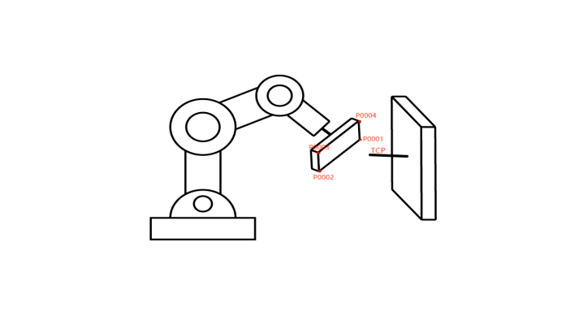

1. NOP
2. EIMOVL P0001 V=10mm/s PL=0 ACC=10 DEC=10 0
3. EIMOVL P0002 V=10mm/s PL=0 ACC=10 DEC=10 0
4. EIMOVL P0003 V=10mm/s PL=0 ACC=10 DEC=10 0
5. EIMOVL P0004 V=10mm/s PL=0 ACC=10 DEC=10 0
6. END

示例说明：机器人手臂夹持工件按照示教的点位在固定的TCP处走直线轨迹。

### EIMOVC-外部基准点圆弧

格式：EIMOVC【指令名】P/GP【变量】 V【速度】 PL【平滑】 ACC【加速度比率】 DEC【减速度比率】 TIME 【提前执行时间，不设置则显示为0】。

功能**：**机器人手臂夹持工件至固定的TCP处完成圆弧轨迹的作业。

参数：

| 点位 | 使用局部位置变量（P）或全局位置变量（GP）。当值为“新建”时，插入该指令则新建一个P变量，并将机器人的当前位置记录到P变量 |
| --- | --- |
| V | 直线插补的速度，范围1-1000（默认笛卡尔参数最大速度为1000，范围根据实际填写的笛卡尔参数变化），单位为mm/s |
| PL | 平滑过渡等级，范围[0,5] |
| ACC | 加速度比率，范围[1,100] |
| DEC | 减速度比率，范围[1,100] |
| TIME | 提前执行时间，单位ms |

示例：示教的每一个外部圆弧点需要和TCP对齐。

1. NOP
2. EIMOVL P0001 V=50mm/s PL=0 ACC=10 DEC=10 0
3. EIMOVC P0002 V=50mm/s PL=0 ACC=10 DEC=10 0
4. EIMOVC P0003 V=50mm/s PL=0 ACC=10 DEC=10 0
5. END

示例说明：机器人手臂夹持工件按照示教的点位在固定的TCP处走圆弧轨迹。

### EIMOVCA-外部基准点整圆

格式：EIMOVCA【指令名】P/GP【变量】 V【速度】 PL【平滑】 ACC【加速度比率】 DEC【减速度比率】 TIME 【提前执行时间，不设置则显示0】。

功能:机器人手臂夹持工件至固定的TCP处完成整圆轨迹的作业。

参数：

| 点位 | 使用局部位置变量（P）或全局位置变量（GP）。当值为“新建”时，插入该指令则新建一个P变量，并将机器人的当前位置记录到P变量 |
| --- | --- |
| V | 直线插补的速度，范围1-1000（默认笛卡尔参数最大速度为1000，范围根据实际填写的笛卡尔参数变化），单位为mm/s |
| PL | 平滑过渡等级，范围[0,5] |
| ACC | 加速度比率，范围[1,100] |
| DEC | 减速度比率，范围[1,100] |
| TIME | 提前执行时间，单位ms |
| SPIN：机器人末梢旋转 | 姿态不变：整圆运行的姿态和的第一个点位示教的姿态(MOVJ,MOVL的标定姿态)相同，并以这个姿态走完整圆轨迹 |

示例：示教的每一个外部圆弧点需要和TCP对齐。

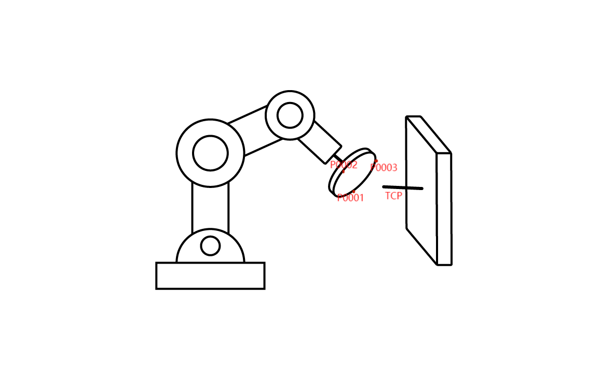

1. NOP
2. EIMOVL P0001 V=50mm/s PL=0 ACC=10 DEC=10 0
3. EIMOVCA P0002 V=10mm/s PL=0 ACC=10 DEC=10 0
4. EIMOVCA P0003 V=10mm/s PL=0 ACC=10 DEC=10 0
5. END

示例说明：机器人手臂夹持工件按照示教的点位在固定的TCP处走整圆轨迹。

## AI 检索专用问答对 (Q&A for Retrieval)

**Q: 运行圆弧类指令报孤立MOVC**

A: 跳到圆弧指令上一行执行或检查程序MOVC指令是否都是连续两条